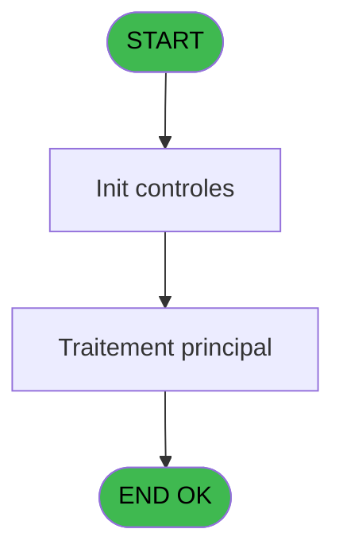
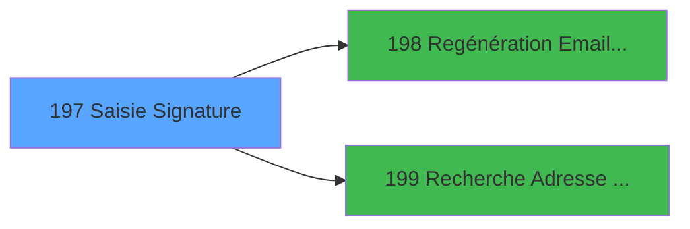

# PVE IDE 197 - Saisie Signature

> **Analyse**: Phases 1-4 2026-02-03 18:50 -> 18:51 (14s) | Assemblage 18:51
> **Pipeline**: V7.2 Enrichi
> **Structure**: 4 onglets (Resume | Ecrans | Donnees | Connexions)

<!-- TAB:Resume -->

## 1. FICHE D'IDENTITE

| Attribut | Valeur |
|----------|--------|
| Projet | PVE |
| IDE Position | 197 |
| Nom Programme | Saisie Signature |
| Fichier source | `Prg_197.xml` |
| Dossier IDE | Mobile |
| Taches | 1 (1 ecrans visibles) |
| Tables modifiees | 0 |
| Programmes appeles | 2 |
| :warning: Statut | **ORPHELIN_POTENTIEL** |

## 2. DESCRIPTION FONCTIONNELLE

**Saisie Signature** assure la gestion complete de ce processus.

Le flux de traitement s'organise en **1 blocs fonctionnels** :

- **Saisie** (1 tache) : ecrans de saisie utilisateur (formulaires, champs, donnees)

**Logique metier** : 2 regles identifiees couvrant conditions metier.

## 3. BLOCS FONCTIONNELS

### 3.1 Saisie (1 tache)

L'operateur saisit les donnees de la transaction via 1 ecran (Saisie Signature).

---

#### 197 - Saisie Signature [[ECRAN]](#ecran-t1)

**Role** : Saisie des donnees : Saisie Signature.
**Ecran** : 1960 x 216 DLU (Modal) | [Voir mockup](#ecran-t1)
**Variables liees** : L (v.Chemin tempo Signature), N (v.Chemin complet temp Signature), O (v.Signature bien stockée)

## 5. REGLES METIER

2 regles identifiees:

### Autres (2 regles)

#### [RM-001] Si v.Decline_Mail? [I] alors 'X' sinon '')

| Element | Detail |
|---------|--------|
| **Condition** | `v.Decline_Mail? [I]` |
| **Si vrai** | 'X' |
| **Si faux** | '') |
| **Variables** | I (v.Decline_Mail?), R (e) |
| **Expression source** | Expression 11 : `IF(v.Decline_Mail? [I],'X','')` |
| **Exemple** | Si v.Decline_Mail? [I] → 'X'. Sinon → '') |

#### [RM-002] Si v.Chemin complet temp ... [N] alors Trim(v.fini par \ [M]) sinon Trim(v.fini par \ [M])&'\')&'signature.png'

| Element | Detail |
|---------|--------|
| **Condition** | `v.Chemin complet temp ... [N]` |
| **Si vrai** | Trim(v.fini par \ [M]) |
| **Si faux** | Trim(v.fini par \ [M])&'\')&'signature.png' |
| **Variables** | M (v.fini par \), R (e) |
| **Expression source** | Expression 14 : `IF(v.Chemin complet temp ... [N],Trim(v.fini par \ [M]),Trim` |
| **Exemple** | Si v.Chemin complet temp ... [N] → Trim(v.fini par \ [M]). Sinon → Trim(v.fini par \ [M])&'\')&'signature.png' |

## 6. CONTEXTE

- **Appele par**: (aucun)
- **Appelle**: 2 programmes | **Tables**: 0 (W:0 R:0 L:0) | **Taches**: 1 | **Expressions**: 31

<!-- TAB:Ecrans -->

## 8. ECRANS

### 8.1 Forms visibles (1 / 1)

| # | Position | Tache | Nom | Type | Largeur | Hauteur | Bloc |
|---|----------|-------|-----|------|---------|---------|------|
| 1 | 197 | 197 | Saisie Signature | Modal | 1960 | 216 | Saisie |

### 8.2 Mockups Ecrans

---

#### 197 - Saisie Signature
**Tache** : [197](#t1) | **Type** : Modal | **Dimensions** : 1960 x 216 DLU
**Bloc** : Saisie | **Titre IDE** : Saisie Signature

<!-- FORM-DATA:
{
    "width":  1960,
    "vFactor":  8,
    "type":  "Modal",
    "hFactor":  8,
    "controls":  [
                     {
                         "x":  1,
                         "type":  "label",
                         "var":  "",
                         "y":  1,
                         "w":  782,
                         "fmt":  "",
                         "name":  "",
                         "h":  24,
                         "color":  "186",
                         "text":  "Receipt Signature",
                         "parent":  null
                     },
                     {
                         "x":  209,
                         "type":  "label",
                         "var":  "",
                         "y":  5,
                         "w":  476,
                         "fmt":  "",
                         "name":  "",
                         "h":  17,
                         "color":  "189",
                         "text":  "Decline E-Receipt",
                         "parent":  null
                     },
                     {
                         "x":  0,
                         "type":  "label",
                         "var":  "",
                         "y":  26,
                         "w":  1956,
                         "fmt":  "",
                         "name":  "",
                         "h":  19,
                         "color":  "6",
                         "text":  "Signature  required  to validate purchase  /  Signature requise pour valider l\u0027achat",
                         "parent":  null
                     },
                     {
                         "x":  1882,
                         "type":  "button",
                         "var":  "",
                         "y":  1,
                         "w":  74,
                         "fmt":  "+",
                         "name":  "B Change",
                         "h":  24,
                         "color":  "",
                         "text":  "",
                         "parent":  null
                     },
                     {
                         "x":  787,
                         "type":  "combobox",
                         "var":  "",
                         "y":  3,
                         "w":  1088,
                         "fmt":  "",
                         "name":  "p.Email address",
                         "h":  18,
                         "color":  "",
                         "text":  "",
                         "parent":  null
                     },
                     {
                         "x":  694,
                         "type":  "button",
                         "var":  "",
                         "y":  5,
                         "w":  48,
                         "fmt":  "",
                         "name":  "b.Bt Decline Email",
                         "h":  17,
                         "color":  "",
                         "text":  "",
                         "parent":  null
                     },
                     {
                         "x":  0,
                         "type":  "edit",
                         "var":  "",
                         "y":  44,
                         "w":  1960,
                         "fmt":  "",
                         "name":  "v. .NET Sign",
                         "h":  169,
                         "color":  "",
                         "text":  "",
                         "parent":  null
                     },
                     {
                         "x":  1657,
                         "type":  "button",
                         "var":  "",
                         "y":  189,
                         "w":  296,
                         "fmt":  "\u0026Erase Signature",
                         "name":  "B Erase",
                         "h":  24,
                         "color":  "",
                         "text":  "",
                         "parent":  null
                     }
                 ],
    "taskId":  "197",
    "height":  216
}
-->

<strong>Champs : 2 champs</strong>

| Pos (x,y) | Nom | Variable | Type |
|-----------|-----|----------|------|
| 787,3 | p.Email address | - | combobox |
| 0,44 | v. .NET Sign | - | edit |

<strong>Boutons : 3 boutons</strong>

| Bouton | Pos (x,y) | Action |
|--------|-----------|--------|
| + | 1882,1 | Bouton fonctionnel |
| b.Bt Decline Email | 694,5 | Bouton fonctionnel |
| Erase Signature | 1657,189 | Bouton fonctionnel |

## 9. NAVIGATION

Ecran unique: **Saisie Signature**

### 9.3 Structure hierarchique (1 tache)

| Position | Tache | Type | Dimensions | Bloc |
|----------|-------|------|------------|------|
| **197.1** | [**Saisie Signature** (197)](#t1) [mockup](#ecran-t1) | Modal | 1960x216 | Saisie |

### 9.4 Algorigramme

> **Legende**: Vert = START/END OK | Rouge = END KO | Bleu = Decisions
> *Algorigramme auto-genere. Utiliser `/algorigramme` pour une synthese metier detaillee.*

<!-- TAB:Donnees -->

## 10. TABLES

### Tables utilisees (0)

| ID | Nom | Description | Type | R | W | L | Usages |
|----|-----|-------------|------|---|---|---|--------|

### Colonnes par table (0 / 0 tables avec colonnes identifiees)

## 11. VARIABLES

### 11.1 Parametres entrants (8)

Variables recues en parametre.

| Lettre | Nom | Type | Usage dans |
|--------|-----|------|-----------|
| A | p.Ste | Alpha | 1x parametre entrant |
| B | p.Compte | Numeric | 3x parametre entrant |
| C | p.Filiation | Numeric | - |
| D | p.Email address | Alpha | 1x parametre entrant |
| E | p.Receive-Recept ? | Logical | 2x parametre entrant |
| F | p.Continue | Logical | 1x parametre entrant |
| G | p.nb strokes | Alpha | 2x parametre entrant |
| H | p.Assurance-0-soucis? | Logical | 1x parametre entrant |

### 11.2 Variables de session (7)

Variables persistantes pendant toute la session.

| Lettre | Nom | Type | Usage dans |
|--------|-----|------|-----------|
| I | v.Decline_Mail? | Logical | 3x session |
| K | v.Envoi | Logical | - |
| L | v.Chemin tempo Signature | Alpha | - |
| M | v.fini par \ | Logical | 4x session |
| N | v.Chemin complet temp Signature | Alpha | - |
| O | v.Signature bien stockée | Logical | 4x session |
| P | v. .NET Sign | Blob | [197](#t1) |

### 11.3 Autres (3)

Variables diverses.

| Lettre | Nom | Type | Usage dans |
|--------|-----|------|-----------|
| J | b.Bt Decline Email | Alpha | - |
| Q | sender | Blob | - |
| R | e | Blob | 26x refs |

Toutes les 18 variables (liste complete)

| Cat | Lettre | Nom Variable | Type |
|-----|--------|--------------|------|
| P0 | **A** | p.Ste | Alpha |
| P0 | **B** | p.Compte | Numeric |
| P0 | **C** | p.Filiation | Numeric |
| P0 | **D** | p.Email address | Alpha |
| P0 | **E** | p.Receive-Recept ? | Logical |
| P0 | **F** | p.Continue | Logical |
| P0 | **G** | p.nb strokes | Alpha |
| P0 | **H** | p.Assurance-0-soucis? | Logical |
| V. | **I** | v.Decline_Mail? | Logical |
| V. | **K** | v.Envoi | Logical |
| V. | **L** | v.Chemin tempo Signature | Alpha |
| V. | **M** | v.fini par \ | Logical |
| V. | **N** | v.Chemin complet temp Signature | Alpha |
| V. | **O** | v.Signature bien stockée | Logical |
| V. | **P** | v. .NET Sign | Blob |
| Autre | **J** | b.Bt Decline Email | Alpha |
| Autre | **Q** | sender | Blob |
| Autre | **R** | e | Blob |

## 12. EXPRESSIONS

**31 / 31 expressions decodees (100%)**

### 12.1 Repartition par type

| Type | Expressions | Regles |
|------|-------------|--------|
| CALCULATION | 1 | 0 |
| CONDITION | 6 | 2 |
| CONSTANTE | 1 | 0 |
| OTHER | 18 | 0 |
| CAST_LOGIQUE | 1 | 0 |
| NEGATION | 1 | 0 |
| FORMAT | 2 | 0 |
| STRING | 1 | 0 |

### 12.2 Expressions cles par type

#### CALCULATION (1 expressions)

| Type | IDE | Expression | Regle |
|------|-----|------------|-------|
| CALCULATION | 5 | `'cmd /c mkdir '&Trim(v.fini par \ [M])` | - |

#### CONDITION (6 expressions)

| Type | IDE | Expression | Regle |
|------|-----|------------|-------|
| CONDITION | 14 | `IF(v.Chemin complet temp ... [N],Trim(v.fini par \ [M]),Trim(v.fini par \ [M])&'\')&'signature.png'` | [RM-002](#rm-RM-002) |
| CONDITION | 11 | `IF(v.Decline_Mail? [I],'X','')` | [RM-001](#rm-RM-001) |
| CONDITION | 30 | `p.nb strokes [G]<>e [R].StrokeCount().ToString()` | - |
| CONDITION | 7 | `Right(Trim(v.fini par \ [M]),1)='\'` | - |
| CONDITION | 13 | `SubformExecMode(0)=0 AND p.Receive-Recept ? [E]<>NOT(v.Decline_Mail? [I])` | - |
| ... | | *+1 autres* | |

#### CONSTANTE (1 expressions)

| Type | IDE | Expression | Regle |
|------|-----|------------|-------|
| CONSTANTE | 22 | `'0'` | - |

#### OTHER (18 expressions)

| Type | IDE | Expression | Regle |
|------|-----|------------|-------|
| OTHER | 19 | `NOT(v. .NET Sign [P])` | - |
| OTHER | 23 | `ISNULL(VG121)` | - |
| OTHER | 17 | `FileExist(v.Signature bien stockée [O])` | - |
| OTHER | 18 | `NULL()` | - |
| OTHER | 25 | `NOT(p.Receive-Recept ? [E])` | - |
| ... | | *+13 autres* | |

#### CAST_LOGIQUE (1 expressions)

| Type | IDE | Expression | Regle |
|------|-----|------------|-------|
| CAST_LOGIQUE | 9 | `'FALSE'LOG` | - |

#### NEGATION (1 expressions)

| Type | IDE | Expression | Regle |
|------|-----|------------|-------|
| NEGATION | 12 | `NOT v.Decline_Mail? [I]` | - |

#### FORMAT (2 expressions)

| Type | IDE | Expression | Regle |
|------|-----|------------|-------|
| FORMAT | 21 | `'La signature n''a pas été stockée dans le blob pour le compte n° '&Str(p.Compte [B],'8')` | - |
| FORMAT | 20 | `'Le fichier de signature n''a pas été créée pour le compte n° '&Str(p.Compte [B],'8')` | - |

#### STRING (1 expressions)

| Type | IDE | Expression | Regle |
|------|-----|------------|-------|
| STRING | 28 | `e [R].Save(Trim(v.Signature bien stockée [O]))` | - |

### 12.3 Toutes les expressions (31)

Voir les 31 expressions

#### CALCULATION (1)

| IDE | Expression Decodee |
|-----|-------------------|
| 5 | `'cmd /c mkdir '&Trim(v.fini par \ [M])` |

#### CONDITION (6)

| IDE | Expression Decodee |
|-----|-------------------|
| 11 | `IF(v.Decline_Mail? [I],'X','')` |
| 14 | `IF(v.Chemin complet temp ... [N],Trim(v.fini par \ [M]),Trim(v.fini par \ [M])&'\')&'signature.png'` |
| 13 | `SubformExecMode(0)=0 AND p.Receive-Recept ? [E]<>NOT(v.Decline_Mail? [I])` |
| 24 | `p.nb strokes [G]<>'0'` |
| 30 | `p.nb strokes [G]<>e [R].StrokeCount().ToString()` |
| 7 | `Right(Trim(v.fini par \ [M]),1)='\'` |

#### CONSTANTE (1)

| IDE | Expression Decodee |
|-----|-------------------|
| 22 | `'0'` |

#### OTHER (18)

| IDE | Expression Decodee |
|-----|-------------------|
| 1 | `p.Ste [A]` |
| 2 | `p.Compte [B]` |
| 3 | `p.Continue [F]` |
| 4 | `SetCrsr(1)` |
| 6 | `Translate ('%TempDir%')` |
| 8 | `NOT(FileExist(v.fini par \ [M]))` |
| 10 | `SetCrsr(2)` |
| 15 | `File2Blb(v.Signature bien stockée [O])` |
| 16 | `FileDelete(v.Signature bien stockée [O])` |
| 17 | `FileExist(v.Signature bien stockée [O])` |
| 18 | `NULL()` |
| 19 | `NOT(v. .NET Sign [P])` |
| 23 | `ISNULL(VG121)` |
| 25 | `NOT(p.Receive-Recept ? [E])` |
| 26 | `NOT(p.Assurance-0-soucis? [H])` |
| 27 | `e [R].Clear()` |
| 29 | `e [R].StrokeCount().ToString()` |
| 31 | `CtrlGoto('p.Email address',0,0)` |

#### CAST_LOGIQUE (1)

| IDE | Expression Decodee |
|-----|-------------------|
| 9 | `'FALSE'LOG` |

#### NEGATION (1)

| IDE | Expression Decodee |
|-----|-------------------|
| 12 | `NOT v.Decline_Mail? [I]` |

#### FORMAT (2)

| IDE | Expression Decodee |
|-----|-------------------|
| 20 | `'Le fichier de signature n''a pas été créée pour le compte n° '&Str(p.Compte [B],'8')` |
| 21 | `'La signature n''a pas été stockée dans le blob pour le compte n° '&Str(p.Compte [B],'8')` |

#### STRING (1)

| IDE | Expression Decodee |
|-----|-------------------|
| 28 | `e [R].Save(Trim(v.Signature bien stockée [O]))` |

<!-- TAB:Connexions -->

## 13. GRAPHE D'APPELS

### 13.1 Chaine depuis Main (Callers)

**Chemin**: (pas de callers directs)

### 13.2 Callers

| IDE | Nom Programme | Nb Appels |
|-----|---------------|-----------|
| - | (aucun) | - |

### 13.3 Callees (programmes appeles)

### 13.4 Detail Callees avec contexte

| IDE | Nom Programme | Appels | Contexte |
|-----|---------------|--------|----------|
| [198](PVE-IDE-198.md) | Regénération Email Liste Temp | 1 | Configuration impression |
| [199](PVE-IDE-199.md) | Recherche Adresse Mail | 1 | Sous-programme |

## 14. RECOMMANDATIONS MIGRATION

### 14.1 Profil du programme

| Metrique | Valeur | Impact migration |
|----------|--------|-----------------|
| Lignes de logique | 70 | Programme compact |
| Expressions | 31 | Peu de logique |
| Tables WRITE | 0 | Impact faible |
| Sous-programmes | 2 | Peu de dependances |
| Ecrans visibles | 1 | Ecran unique ou traitement batch |
| Code desactive | 1.4% (1 / 70) | Code sain |
| Regles metier | 2 | Quelques regles a preserver |

### 14.2 Plan de migration par bloc

#### Saisie (1 tache: 1 ecran, 0 traitement)

- **Strategie** : Formulaire React/Blazor avec validation Zod/FluentValidation.
- Reproduire 1 ecran : Saisie Signature
- Validation temps reel cote client + serveur

### 14.3 Dependances critiques

| Dependance | Type | Appels | Impact |
|------------|------|--------|--------|
| [Recherche Adresse Mail (IDE 199)](PVE-IDE-199.md) | Sous-programme | 1x | Normale - Sous-programme |
| [Regénération Email Liste Temp (IDE 198)](PVE-IDE-198.md) | Sous-programme | 1x | Normale - Configuration impression |

---
*Spec DETAILED generee par Pipeline V7.2 - 2026-02-03 18:51*
