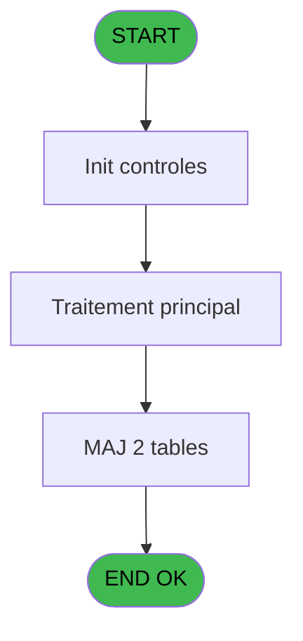
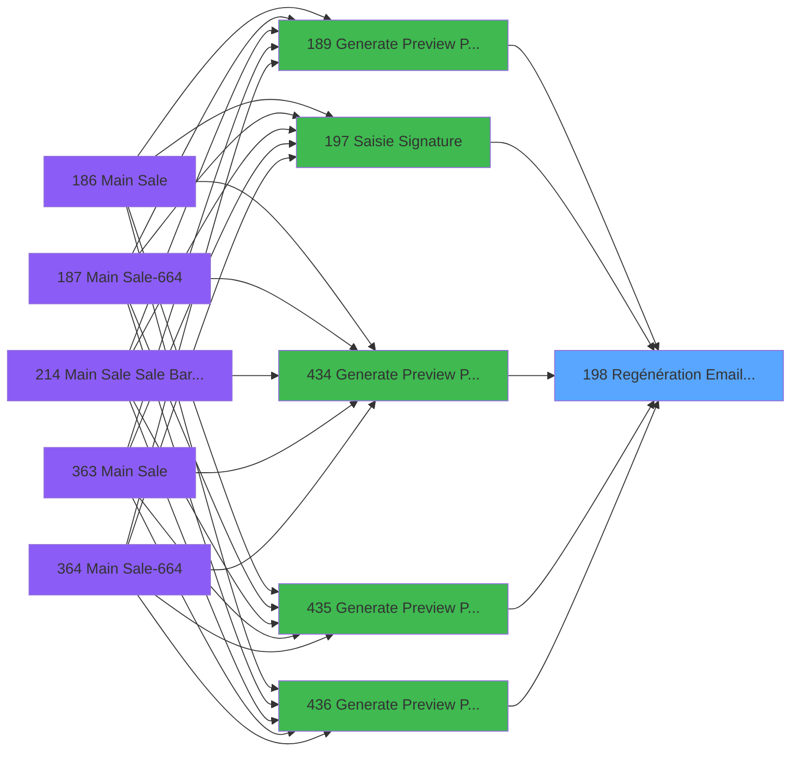

# PVE IDE 198 - Regénération Email Liste Temp

> **Analyse**: Phases 1-4 2026-02-03 18:51 -> 18:51 (13s) | Assemblage 18:51
> **Pipeline**: V7.2 Enrichi
> **Structure**: 4 onglets (Resume | Ecrans | Donnees | Connexions)

<!-- TAB:Resume -->

## 1. FICHE D'IDENTITE

| Attribut | Valeur |
|----------|--------|
| Projet | PVE |
| IDE Position | 198 |
| Nom Programme | Regénération Email Liste Temp |
| Fichier source | `Prg_198.xml` |
| Dossier IDE | Mobile |
| Taches | 3 (0 ecrans visibles) |
| Tables modifiees | 2 |
| Programmes appeles | 0 |

## 2. DESCRIPTION FONCTIONNELLE

**Regénération Email Liste Temp** assure la gestion complete de ce processus, accessible depuis [Generate Preview Payments (IDE 189)](PVE-IDE-189.md), [Generate Preview Payments 1212 (IDE 434)](PVE-IDE-434.md), [Generate Preview Payments 1112 (IDE 435)](PVE-IDE-435.md), [Generate Preview Payments 1012 (IDE 436)](PVE-IDE-436.md), [Generate Preview Payment 1212E (IDE 437)](PVE-IDE-437.md), [Saisie Signature (IDE 197)](PVE-IDE-197.md).

Le flux de traitement s'organise en **1 blocs fonctionnels** :

- **Traitement** (3 taches) : traitements metier divers

**Donnees modifiees** : 2 tables en ecriture (email, Table_1653).

## 3. BLOCS FONCTIONNELS

### 3.1 Traitement (3 taches)

Traitements internes.

---

#### 198 - Création email liste

**Role** : Traitement : Création email liste.
**Variables liees** : D (Pi email_Selectionne), F (v.existe au moins 1email?)

---

#### 198.1 - Création email liste

**Role** : Traitement : Création email liste.
**Variables liees** : D (Pi email_Selectionne), F (v.existe au moins 1email?)

---

#### 198.2 - Création email liste

**Role** : Traitement : Création email liste.
**Variables liees** : D (Pi email_Selectionne), F (v.existe au moins 1email?)

## 5. REGLES METIER

*(Aucune regle metier identifiee)*

## 6. CONTEXTE

- **Appele par**: [Generate Preview Payments (IDE 189)](PVE-IDE-189.md), [Generate Preview Payments 1212 (IDE 434)](PVE-IDE-434.md), [Generate Preview Payments 1112 (IDE 435)](PVE-IDE-435.md), [Generate Preview Payments 1012 (IDE 436)](PVE-IDE-436.md), [Generate Preview Payment 1212E (IDE 437)](PVE-IDE-437.md), [Saisie Signature (IDE 197)](PVE-IDE-197.md)
- **Appelle**: 0 programmes | **Tables**: 2 (W:2 R:0 L:1) | **Taches**: 3 | **Expressions**: 2

<!-- TAB:Ecrans -->

## 8. ECRANS

*(Programme sans ecran visible)*

## 9. NAVIGATION

### 9.3 Structure hierarchique (3 taches)

| Position | Tache | Type | Dimensions | Bloc |
|----------|-------|------|------------|------|
| **198.1** | [**Création email liste** (198)](#t1) | - | - | Traitement |
| 198.1.1 | [Création email liste (198.1)](#t2) | - | - | |
| 198.1.2 | [Création email liste (198.2)](#t3) | - | - | |

### 9.4 Algorigramme

> **Legende**: Vert = START/END OK | Rouge = END KO | Bleu = Decisions
> *Algorigramme auto-genere. Utiliser `/algorigramme` pour une synthese metier detaillee.*

<!-- TAB:Donnees -->

## 10. TABLES

### Tables utilisees (2)

| ID | Nom | Description | Type | R | W | L | Usages |
|----|-----|-------------|------|---|---|---|--------|
| 285 | email |  | DB |   | **W** |   | 1 |
| 1653 | Table_1653 |  | MEM |   | **W** | L | 2 |

### Colonnes par table (1 / 2 tables avec colonnes identifiees)

Table 285 - email (**W**) - 1 usages

| Lettre | Variable | Acces | Type |
|--------|----------|-------|------|
| A | Pi Societe | W | Unicode |
| B | Pi compte | W | Numeric |
| C | Pi Filiation | W | Numeric |
| D | Pi email_Selectionne | W | Alpha |
| E | v.existecorrespondance? | W | Logical |
| F | v.existe au moins 1email? | W | Logical |

Table 1653 - Table_1653 (**W**/L) - 2 usages

*Table utilisee uniquement en Link ou aucune colonne Real identifiee dans le DataView.*

## 11. VARIABLES

### 11.1 Parametres entrants (4)

Variables recues du programme appelant ([Generate Preview Payments (IDE 189)](PVE-IDE-189.md)).

| Lettre | Nom | Type | Usage dans |
|--------|-----|------|-----------|
| A | Pi Societe | Unicode | - |
| B | Pi compte | Numeric | - |
| C | Pi Filiation | Numeric | - |
| D | Pi email_Selectionne | Alpha | - |

### 11.2 Variables de session (2)

Variables persistantes pendant toute la session.

| Lettre | Nom | Type | Usage dans |
|--------|-----|------|-----------|
| E | v.existecorrespondance? | Logical | - |
| F | v.existe au moins 1email? | Logical | - |

## 12. EXPRESSIONS

**2 / 2 expressions decodees (100%)**

### 12.1 Repartition par type

| Type | Expressions | Regles |
|------|-------------|--------|
| OTHER | 2 | 0 |

### 12.2 Expressions cles par type

#### OTHER (2 expressions)

| Type | IDE | Expression | Regle |
|------|-----|------------|-------|
| OTHER | 2 | `{1,2}` | - |
| OTHER | 1 | `{1,1}` | - |

<!-- TAB:Connexions -->

## 13. GRAPHE D'APPELS

### 13.1 Chaine depuis Main (Callers)

Main -> ... -> [Generate Preview Payments (IDE 189)](PVE-IDE-189.md) -> **Regénération Email Liste Temp (IDE 198)**

Main -> ... -> [Generate Preview Payments 1212 (IDE 434)](PVE-IDE-434.md) -> **Regénération Email Liste Temp (IDE 198)**

Main -> ... -> [Generate Preview Payments 1112 (IDE 435)](PVE-IDE-435.md) -> **Regénération Email Liste Temp (IDE 198)**

Main -> ... -> [Generate Preview Payments 1012 (IDE 436)](PVE-IDE-436.md) -> **Regénération Email Liste Temp (IDE 198)**

Main -> ... -> [Generate Preview Payment 1212E (IDE 437)](PVE-IDE-437.md) -> **Regénération Email Liste Temp (IDE 198)**

Main -> ... -> [Saisie Signature (IDE 197)](PVE-IDE-197.md) -> **Regénération Email Liste Temp (IDE 198)**

### 13.2 Callers

| IDE | Nom Programme | Nb Appels |
|-----|---------------|-----------|
| [189](PVE-IDE-189.md) | Generate Preview Payments | 2 |
| [434](PVE-IDE-434.md) | Generate Preview Payments 1212 | 2 |
| [435](PVE-IDE-435.md) | Generate Preview Payments 1112 | 2 |
| [436](PVE-IDE-436.md) | Generate Preview Payments 1012 | 2 |
| [437](PVE-IDE-437.md) | Generate Preview Payment 1212E | 2 |
| [197](PVE-IDE-197.md) | Saisie Signature | 1 |

### 13.3 Callees (programmes appeles)

### 13.4 Detail Callees avec contexte

| IDE | Nom Programme | Appels | Contexte |
|-----|---------------|--------|----------|
| - | (aucun) | - | - |

## 14. RECOMMANDATIONS MIGRATION

### 14.1 Profil du programme

| Metrique | Valeur | Impact migration |
|----------|--------|-----------------|
| Lignes de logique | 48 | Programme compact |
| Expressions | 2 | Peu de logique |
| Tables WRITE | 2 | Impact faible |
| Sous-programmes | 0 | Peu de dependances |
| Ecrans visibles | 0 | Ecran unique ou traitement batch |
| Code desactive | 0% (0 / 48) | Code sain |
| Regles metier | 0 | Pas de regle identifiee |

### 14.2 Plan de migration par bloc

#### Traitement (3 taches: 0 ecran, 3 traitements)

- **Strategie** : 3 service(s) backend injectable(s) (Domain Services).
- Decomposer les taches en services unitaires testables.

### 14.3 Dependances critiques

| Dependance | Type | Appels | Impact |
|------------|------|--------|--------|
| email | Table WRITE (Database) | 1x | Schema + repository |
| Table_1653 | Table WRITE (Memory) | 1x | Schema + repository |

---
*Spec DETAILED generee par Pipeline V7.2 - 2026-02-03 18:51*
