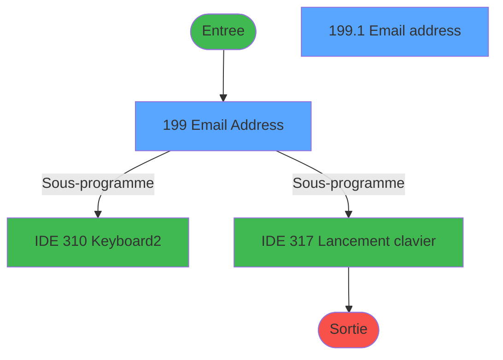
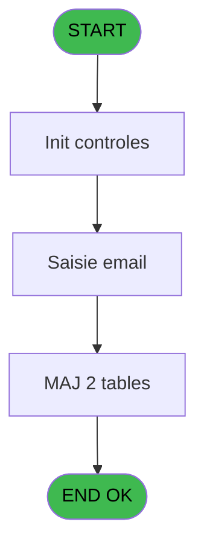
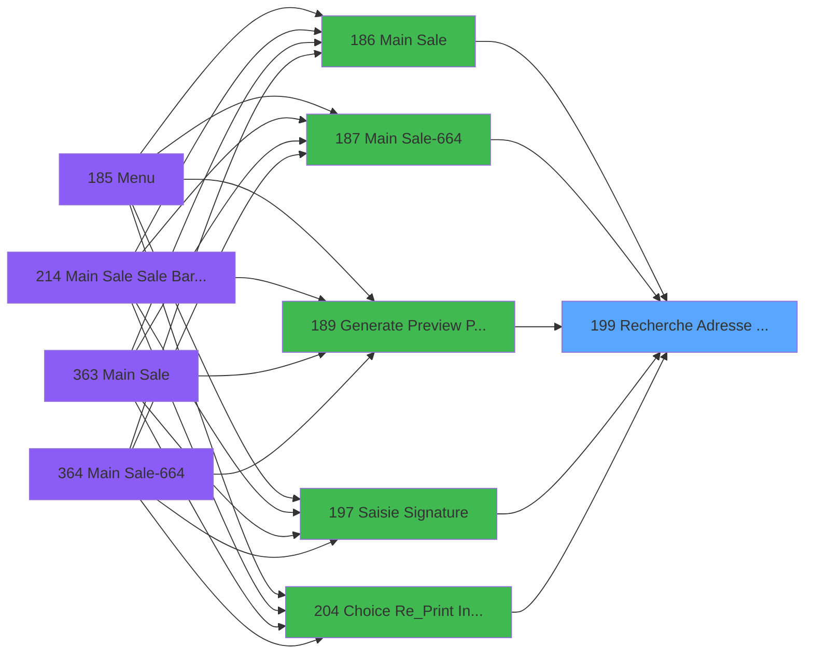
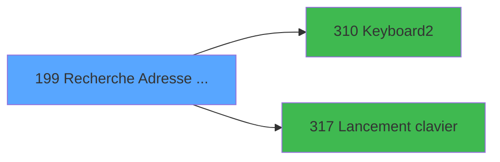

# PVE IDE 199 - Recherche Adresse Mail

> **Analyse**: Phases 1-4 2026-02-03 18:51 -> 18:51 (14s) | Assemblage 18:51
> **Pipeline**: V7.2 Enrichi
> **Structure**: 4 onglets (Resume | Ecrans | Donnees | Connexions)

<!-- TAB:Resume -->

## 1. FICHE D'IDENTITE

| Attribut | Valeur |
|----------|--------|
| Projet | PVE |
| IDE Position | 199 |
| Nom Programme | Recherche Adresse Mail |
| Fichier source | `Prg_199.xml` |
| Dossier IDE | Mobile |
| Taches | 5 (2 ecrans visibles) |
| Tables modifiees | 2 |
| Programmes appeles | 2 |

## 2. DESCRIPTION FONCTIONNELLE

**Recherche Adresse Mail** assure la gestion complete de ce processus, accessible depuis [Main Sale (IDE 186)](PVE-IDE-186.md), [Main Sale-664 (IDE 187)](PVE-IDE-187.md), [Generate Preview Payments (IDE 189)](PVE-IDE-189.md), [Saisie Signature (IDE 197)](PVE-IDE-197.md), [Choice Re_Print Invoice (IDE 204)](PVE-IDE-204.md), [Main Sale Sale Bar Code (IDE 214)](PVE-IDE-214.md), [Main Sale (IDE 363)](PVE-IDE-363.md), [Main Sale-664 (IDE 364)](PVE-IDE-364.md), [Main Sale ===V4 Booking ACTUEL (IDE 417)](PVE-IDE-417.md), [Generate Preview Payments 1212 (IDE 434)](PVE-IDE-434.md), [Generate Preview Payments 1112 (IDE 435)](PVE-IDE-435.md), [Generate Preview Payments 1012 (IDE 436)](PVE-IDE-436.md), [Generate Preview Payment 1212E (IDE 437)](PVE-IDE-437.md), [Main Sale (IDE 440)](PVE-IDE-440.md).

Le flux de traitement s'organise en **2 blocs fonctionnels** :

- **Traitement** (4 taches) : traitements metier divers
- **Creation** (1 tache) : insertion d'enregistrements en base (mouvements, prestations)

**Donnees modifiees** : 2 tables en ecriture (gm-recherche_____gmr, email).

**Logique metier** : 1 regles identifiees couvrant conditions metier.

Detail : phases du traitement

#### Phase 1 : Traitement (4 taches)

- **199** - Email Address **[[ECRAN]](#ecran-t1)**
- **199.1** - Email address **[[ECRAN]](#ecran-t2)**
- **199.1.1** - Update
- **199.1.2** - Lecture email

Delegue a : [Keyboard2 (IDE 310)](PVE-IDE-310.md), [Lancement clavier (IDE 317)](PVE-IDE-317.md)

#### Phase 2 : Creation (1 tache)

- **199.1.3** - Creation email

#### Tables impactees

| Table | Operations | Role metier |
|-------|-----------|-------------|
| email | R/**W**/L (4 usages) |  |
| gm-recherche_____gmr | **W** (1 usages) | Index de recherche |

## 3. BLOCS FONCTIONNELS

### 3.1 Traitement (4 taches)

Traitements internes.

---

#### 199 - Email Address [[ECRAN]](#ecran-t1)

**Role** : Traitement : Email Address.
**Ecran** : 992 x 432 DLU (Type6) | [Voir mockup](#ecran-t1)

3 sous-taches directes

| Tache | Nom | Bloc |
|-------|-----|------|
| [199.1](#t2) | Email address **[[ECRAN]](#ecran-t2)** | Traitement |
| [199.1.1](#t3) | Update | Traitement |
| [199.1.2](#t4) | Lecture email | Traitement |

**Variables liees** : H (v Lien email), Q (LAST email), BA (CHG_REASON_V email cnil), BB (CHG_PRV_V email cnil)
**Delegue a** : [Keyboard2 (IDE 310)](PVE-IDE-310.md), [Lancement clavier (IDE 317)](PVE-IDE-317.md)

---

#### 199.1 - Email address [[ECRAN]](#ecran-t2)

**Role** : Traitement : Email address.
**Ecran** : 1266 x 236 DLU (Type6) | [Voir mockup](#ecran-t2)
**Variables liees** : H (v Lien email), Q (LAST email), BA (CHG_REASON_V email cnil), BB (CHG_PRV_V email cnil)
**Delegue a** : [Keyboard2 (IDE 310)](PVE-IDE-310.md), [Lancement clavier (IDE 317)](PVE-IDE-317.md)

---

#### 199.1.1 - Update

**Role** : Traitement : Update.
**Delegue a** : [Keyboard2 (IDE 310)](PVE-IDE-310.md), [Lancement clavier (IDE 317)](PVE-IDE-317.md)

---

#### 199.1.2 - Lecture email

**Role** : Traitement : Lecture email.
**Variables liees** : H (v Lien email), Q (LAST email), BA (CHG_REASON_V email cnil), BB (CHG_PRV_V email cnil)
**Delegue a** : [Keyboard2 (IDE 310)](PVE-IDE-310.md), [Lancement clavier (IDE 317)](PVE-IDE-317.md)

### 3.2 Creation (1 tache)

Insertion de nouveaux enregistrements en base.

---

#### 199.1.3 - Creation email

**Role** : Creation d'enregistrement : Creation email.
**Variables liees** : H (v Lien email), Q (LAST email), BA (CHG_REASON_V email cnil), BB (CHG_PRV_V email cnil)

## 5. REGLES METIER

1 regles identifiees:

### Autres (1 regles)

#### [RM-001] Si B Quit [P] vaut 'FR' alors 'FRA', sinon 'ENG'

| Element | Detail |
|---------|--------|
| **Condition** | `B Quit [P]='FR'` |
| **Si vrai** | 'FRA' |
| **Si faux** | 'ENG') |
| **Variables** | P (B Quit) |
| **Expression source** | Expression 15 : `IF(B Quit [P]='FR','FRA','ENG')` |
| **Exemple** | Si B Quit [P]='FR' → 'FRA'. Sinon → 'ENG') |

## 6. CONTEXTE

- **Appele par**: [Main Sale (IDE 186)](PVE-IDE-186.md), [Main Sale-664 (IDE 187)](PVE-IDE-187.md), [Generate Preview Payments (IDE 189)](PVE-IDE-189.md), [Saisie Signature (IDE 197)](PVE-IDE-197.md), [Choice Re_Print Invoice (IDE 204)](PVE-IDE-204.md), [Main Sale Sale Bar Code (IDE 214)](PVE-IDE-214.md), [Main Sale (IDE 363)](PVE-IDE-363.md), [Main Sale-664 (IDE 364)](PVE-IDE-364.md), [Main Sale ===V4 Booking ACTUEL (IDE 417)](PVE-IDE-417.md), [Generate Preview Payments 1212 (IDE 434)](PVE-IDE-434.md), [Generate Preview Payments 1112 (IDE 435)](PVE-IDE-435.md), [Generate Preview Payments 1012 (IDE 436)](PVE-IDE-436.md), [Generate Preview Payment 1212E (IDE 437)](PVE-IDE-437.md), [Main Sale (IDE 440)](PVE-IDE-440.md)
- **Appelle**: 2 programmes | **Tables**: 4 (W:2 R:1 L:3) | **Taches**: 5 | **Expressions**: 16

<!-- TAB:Ecrans -->

## 8. ECRANS

### 8.1 Forms visibles (2 / 5)

| # | Position | Tache | Nom | Type | Largeur | Hauteur | Bloc |
|---|----------|-------|-----|------|---------|---------|------|
| 1 | 199 | 199 | Email Address | Type6 | 992 | 432 | Traitement |
| 2 | 199.1 | 199.1 | Email address | Type6 | 1266 | 236 | Traitement |

### 8.2 Mockups Ecrans

---

#### 199 - Email Address
**Tache** : [199](#t1) | **Type** : Type6 | **Dimensions** : 992 x 432 DLU
**Bloc** : Traitement | **Titre IDE** : Email Address

<!-- FORM-DATA:
{
    "width":  992,
    "vFactor":  8,
    "type":  "Type6",
    "hFactor":  4,
    "controls":  [
                     {
                         "x":  11,
                         "type":  "label",
                         "var":  "",
                         "y":  47,
                         "w":  56,
                         "fmt":  "",
                         "name":  "",
                         "h":  10,
                         "color":  "181",
                         "text":  "First Name",
                         "parent":  null
                     },
                     {
                         "x":  75,
                         "type":  "label",
                         "var":  "",
                         "y":  47,
                         "w":  56,
                         "fmt":  "",
                         "name":  "",
                         "h":  10,
                         "color":  "181",
                         "text":  "Last Name",
                         "parent":  null
                     },
                     {
                         "x":  252,
                         "type":  "label",
                         "var":  "",
                         "y":  47,
                         "w":  70,
                         "fmt":  "",
                         "name":  "",
                         "h":  10,
                         "color":  "181",
                         "text":  "E-Mail Address",
                         "parent":  null
                     },
                     {
                         "x":  4,
                         "type":  "label",
                         "var":  "",
                         "y":  2,
                         "w":  985,
                         "fmt":  "",
                         "name":  "",
                         "h":  40,
                         "color":  "186",
                         "text":  "",
                         "parent":  null
                     },
                     {
                         "x":  11,
                         "type":  "label",
                         "var":  "",
                         "y":  16,
                         "w":  183,
                         "fmt":  "",
                         "name":  "",
                         "h":  12,
                         "color":  "186",
                         "text":  "Select an email address",
                         "parent":  4
                     },
                     {
                         "x":  7,
                         "type":  "table",
                         "var":  "",
                         "name":  "",
                         "titleH":  12,
                         "color":  "110",
                         "w":  933,
                         "y":  61,
                         "fmt":  "",
                         "parent":  null,
                         "text":  "",
                         "rowH":  24,
                         "h":  336,
                         "cols":  [
                                      {
                                          "title":  "First Name",
                                          "layer":  1,
                                          "w":  64
                                      },
                                      {
                                          "title":  "Last Name",
                                          "layer":  2,
                                          "w":  178
                                      },
                                      {
                                          "title":  "E-Mail Address",
                                          "layer":  3,
                                          "w":  364
                                      }
                                  ],
                         "rows":  3
                     },
                     {
                         "x":  11,
                         "type":  "edit",
                         "var":  "",
                         "y":  63,
                         "w":  56,
                         "fmt":  "",
                         "name":  "gmr_prenom__8_",
                         "h":  20,
                         "color":  "110",
                         "text":  "",
                         "parent":  6
                     },
                     {
                         "x":  75,
                         "type":  "edit",
                         "var":  "",
                         "y":  63,
                         "w":  168,
                         "fmt":  "",
                         "name":  "gmr_nom__30_",
                         "h":  20,
                         "color":  "110",
                         "text":  "",
                         "parent":  6
                     },
                     {
                         "x":  252,
                         "type":  "edit",
                         "var":  "",
                         "y":  63,
                         "w":  683,
                         "fmt":  "",
                         "name":  "ema_email",
                         "h":  20,
                         "color":  "110",
                         "text":  "",
                         "parent":  6
                     },
                     {
                         "x":  941,
                         "type":  "button",
                         "var":  "",
                         "y":  61,
                         "w":  48,
                         "fmt":  "ñ",
                         "name":  "",
                         "h":  168,
                         "color":  "",
                         "text":  "",
                         "parent":  null
                     },
                     {
                         "x":  941,
                         "type":  "button",
                         "var":  "",
                         "y":  229,
                         "w":  48,
                         "fmt":  "ò",
                         "name":  "",
                         "h":  168,
                         "color":  "",
                         "text":  "",
                         "parent":  null
                     },
                     {
                         "x":  7,
                         "type":  "button",
                         "var":  "",
                         "y":  402,
                         "w":  84,
                         "fmt":  "\u0026Cancel",
                         "name":  "B No Mail",
                         "h":  24,
                         "color":  "",
                         "text":  "",
                         "parent":  null
                     },
                     {
                         "x":  676,
                         "type":  "button",
                         "var":  "",
                         "y":  402,
                         "w":  84,
                         "fmt":  "\u0026Create",
                         "name":  "B Create",
                         "h":  24,
                         "color":  "",
                         "text":  "",
                         "parent":  null
                     },
                     {
                         "x":  790,
                         "type":  "button",
                         "var":  "",
                         "y":  402,
                         "w":  84,
                         "fmt":  "\u0026Modify",
                         "name":  "B Modify",
                         "h":  24,
                         "color":  "",
                         "text":  "",
                         "parent":  null
                     },
                     {
                         "x":  905,
                         "type":  "button",
                         "var":  "",
                         "y":  402,
                         "w":  84,
                         "fmt":  "\u0026Select",
                         "name":  "B Choose",
                         "h":  24,
                         "color":  "",
                         "text":  "",
                         "parent":  null
                     }
                 ],
    "taskId":  "199",
    "height":  432
}
-->

<strong>Champs : 3 champs</strong>

| Pos (x,y) | Nom | Variable | Type |
|-----------|-----|----------|------|
| 11,63 | gmr_prenom__8_ | - | edit |
| 75,63 | gmr_nom__30_ | - | edit |
| 252,63 | ema_email | - | edit |

<strong>Boutons : 6 boutons</strong>

| Bouton | Pos (x,y) | Action |
|--------|-----------|--------|
| ñ | 941,61 | Bouton fonctionnel |
| ò | 941,229 | Bouton fonctionnel |
| Cancel | 7,402 | Annule et retour au menu |
| Create | 676,402 | Bouton fonctionnel |
| Modify | 790,402 | Modifie l'element |
| Select | 905,402 | Ouvre la selection |

---

#### 199.1 - Email address
**Tache** : [199.1](#t2) | **Type** : Type6 | **Dimensions** : 1266 x 236 DLU
**Bloc** : Traitement | **Titre IDE** : Email address

<!-- FORM-DATA:
{
    "width":  1266,
    "vFactor":  8,
    "type":  "Type6",
    "hFactor":  8,
    "controls":  [
                     {
                         "x":  27,
                         "type":  "label",
                         "var":  "",
                         "y":  12,
                         "w":  784,
                         "fmt":  "",
                         "name":  "",
                         "h":  14,
                         "color":  "186",
                         "text":  "Update your email information",
                         "parent":  null
                     },
                     {
                         "x":  56,
                         "type":  "label",
                         "var":  "",
                         "y":  51,
                         "w":  288,
                         "fmt":  "",
                         "name":  "",
                         "h":  15,
                         "color":  "187",
                         "text":  "Email address",
                         "parent":  null
                     },
                     {
                         "x":  152,
                         "type":  "label",
                         "var":  "",
                         "y":  113,
                         "w":  1093,
                         "fmt":  "",
                         "name":  "",
                         "h":  54,
                         "color":  "183",
                         "text":  "Texte",
                         "parent":  null
                     },
                     {
                         "x":  56,
                         "type":  "edit",
                         "var":  "",
                         "y":  70,
                         "w":  1196,
                         "fmt":  "L129",
                         "name":  "V email texte",
                         "h":  27,
                         "color":  "148",
                         "text":  "",
                         "parent":  null
                     },
                     {
                         "x":  1019,
                         "type":  "button",
                         "var":  "",
                         "y":  204,
                         "w":  224,
                         "fmt":  "\u0026Validate",
                         "name":  "Btn.Valider",
                         "h":  24,
                         "color":  "",
                         "text":  "",
                         "parent":  null
                     },
                     {
                         "x":  764,
                         "type":  "button",
                         "var":  "",
                         "y":  204,
                         "w":  224,
                         "fmt":  "\u0026Cancel",
                         "name":  "B Cancel",
                         "h":  24,
                         "color":  "",
                         "text":  "",
                         "parent":  null
                     },
                     {
                         "x":  20,
                         "type":  "button",
                         "var":  "",
                         "y":  204,
                         "w":  224,
                         "fmt":  "\u0026Keyboard",
                         "name":  "B Keyboard",
                         "h":  24,
                         "color":  "",
                         "text":  "",
                         "parent":  null
                     },
                     {
                         "x":  0,
                         "type":  "edit",
                         "var":  "",
                         "y":  196,
                         "w":  1264,
                         "fmt":  "",
                         "name":  "",
                         "h":  38,
                         "color":  "",
                         "text":  "",
                         "parent":  null
                     },
                     {
                         "x":  65,
                         "type":  "checkbox",
                         "var":  "",
                         "y":  111,
                         "w":  49,
                         "fmt":  "",
                         "name":  "OUI_NON",
                         "h":  19,
                         "color":  "187",
                         "text":  "",
                         "parent":  null
                     },
                     {
                         "x":  2,
                         "type":  "edit",
                         "var":  "",
                         "y":  1,
                         "w":  1264,
                         "fmt":  "",
                         "name":  "",
                         "h":  38,
                         "color":  "182",
                         "text":  "",
                         "parent":  null
                     }
                 ],
    "taskId":  "199.1",
    "height":  236
}
-->

<strong>Champs : 4 champs</strong>

| Pos (x,y) | Nom | Variable | Type |
|-----------|-----|----------|------|
| 56,70 | V email texte | - | edit |
| 0,196 | (sans nom) | - | edit |
| 65,111 | OUI_NON | - | checkbox |
| 2,1 | (sans nom) | - | edit |

<strong>Boutons : 3 boutons</strong>

| Bouton | Pos (x,y) | Action |
|--------|-----------|--------|
| Validate | 1019,204 | Valide la saisie et enregistre |
| Cancel | 764,204 | Annule et retour au menu |
| Keyboard | 20,204 | Appel [Keyboard2 (IDE 310)](PVE-IDE-310.md) |

## 9. NAVIGATION

### 9.1 Enchainement des ecrans

**Detail par enchainement :**

| Depuis | Action | Vers | Retour |
|--------|--------|------|--------|
| Email Address | Sous-programme | [Keyboard2 (IDE 310)](PVE-IDE-310.md) | Retour ecran |
| Email Address | Sous-programme | [Lancement clavier (IDE 317)](PVE-IDE-317.md) | Retour ecran |

### 9.3 Structure hierarchique (5 taches)

| Position | Tache | Type | Dimensions | Bloc |
|----------|-------|------|------------|------|
| **199.1** | [**Email Address** (199)](#t1) [mockup](#ecran-t1) | Type6 | 992x432 | Traitement |
| 199.1.1 | [Email address (199.1)](#t2) [mockup](#ecran-t2) | Type6 | 1266x236 | |
| 199.1.2 | [Update (199.1.1)](#t3) | MDI | - | |
| 199.1.3 | [Lecture email (199.1.2)](#t4) | MDI | - | |
| **199.2** | [**Creation email** (199.1.3)](#t5) | MDI | - | Creation |

### 9.4 Algorigramme

> **Legende**: Vert = START/END OK | Rouge = END KO | Bleu = Decisions
> *Algorigramme auto-genere. Utiliser `/algorigramme` pour une synthese metier detaillee.*

<!-- TAB:Donnees -->

## 10. TABLES

### Tables utilisees (4)

| ID | Nom | Description | Type | R | W | L | Usages |
|----|-----|-------------|------|---|---|---|--------|
| 30 | gm-recherche_____gmr | Index de recherche | DB |   | **W** |   | 1 |
| 130 | fichier_langue |  | DB |   |   | L | 1 |
| 285 | email |  | DB | R | **W** | L | 4 |
| 720 | arc_transac_entete_bar |  | DB |   |   | L | 2 |

### Colonnes par table (3 / 2 tables avec colonnes identifiees)

Table 30 - gm-recherche_____gmr (**W**) - 1 usages

| Lettre | Variable | Acces | Type |
|--------|----------|-------|------|
| A | P Societe | W | Alpha |
| B | P Adherent | W | Numeric |
| C | P Filiation | W | Numeric |
| D | P.Adresse Mail Retour | W | Alpha |
| E | P Langue Mail Retour | W | Alpha |
| F | P Envoi Mail ? | W | Logical |
| G | p.Cancel | W | Logical |
| H | v Lien email | W | Logical |
| I | v Retour Mail Non Renseigné | W | Numeric |
| J | v Retour Quit | W | Numeric |
| K | v Retour No Mail | W | Numeric |
| L | B Create | W | Alpha |
| M | B Modify | W | Alpha |
| N | B Choose | W | Alpha |
| O | B No Mail | W | Alpha |
| P | B Quit | W | Alpha |

Table 285 - email (R/**W**/L) - 4 usages

| Lettre | Variable | Acces | Type |
|--------|----------|-------|------|
| A | V ADHERENT | W | Numeric |
| B | V FILIATION adh | W | Numeric |
| C | V DOSSIER | W | Numeric |

## 11. VARIABLES

### 11.1 Parametres entrants (7)

Variables recues du programme appelant ([Main Sale (IDE 186)](PVE-IDE-186.md)).

| Lettre | Nom | Type | Usage dans |
|--------|-----|------|-----------|
| A | P Societe | Alpha | 1x parametre entrant |
| B | P Adherent | Numeric | 1x parametre entrant |
| C | P Filiation | Numeric | 1x parametre entrant |
| D | P.Adresse Mail Retour | Alpha | - |
| E | P Langue Mail Retour | Alpha | - |
| F | P Envoi Mail ? | Logical | - |
| G | p.Cancel | Logical | - |

### 11.2 Variables de session (6)

Variables persistantes pendant toute la session.

| Lettre | Nom | Type | Usage dans |
|--------|-----|------|-----------|
| H | v Lien email | Logical | [199](#t1), [199.1](#t2), [199.1.2](#t4) |
| I | v Retour Mail Non Renseigné | Numeric | - |
| J | v Retour Quit | Numeric | 1x session |
| K | v Retour No Mail | Numeric | - |
| U | V.Sortie loop | Logical | 4x session |
| Y | V.ErreurText | Unicode | - |

### 11.3 Autres (15)

Variables diverses.

| Lettre | Nom | Type | Usage dans |
|--------|-----|------|-----------|
| L | B Create | Alpha | - |
| M | B Modify | Alpha | 1x refs |
| N | B Choose | Alpha | - |
| O | B No Mail | Alpha | - |
| P | B Quit | Alpha | 1x refs |
| Q | LAST email | Alpha | [199](#t1), [199.1](#t2), [199.1.2](#t4) |
| R | LAST cnil | Logical | - |
| S | LAST report filiation | Logical | - |
| T | LAST Telephone portable | Alpha | - |
| V | B Cancel | Alpha | 1x refs |
| W | B Keyboard | Alpha | - |
| X | MailIsValid? | Logical | - |
| Z | Btn.Valider | Alpha | - |
| BA | CHG_REASON_V email cnil | Numeric | - |
| BB | CHG_PRV_V email cnil | Logical | - |

Toutes les 28 variables (liste complete)

| Cat | Lettre | Nom Variable | Type |
|-----|--------|--------------|------|
| P0 | **A** | P Societe | Alpha |
| P0 | **B** | P Adherent | Numeric |
| P0 | **C** | P Filiation | Numeric |
| P0 | **D** | P.Adresse Mail Retour | Alpha |
| P0 | **E** | P Langue Mail Retour | Alpha |
| P0 | **F** | P Envoi Mail ? | Logical |
| P0 | **G** | p.Cancel | Logical |
| V. | **H** | v Lien email | Logical |
| V. | **I** | v Retour Mail Non Renseigné | Numeric |
| V. | **J** | v Retour Quit | Numeric |
| V. | **K** | v Retour No Mail | Numeric |
| V. | **U** | V.Sortie loop | Logical |
| V. | **Y** | V.ErreurText | Unicode |
| Autre | **L** | B Create | Alpha |
| Autre | **M** | B Modify | Alpha |
| Autre | **N** | B Choose | Alpha |
| Autre | **O** | B No Mail | Alpha |
| Autre | **P** | B Quit | Alpha |
| Autre | **Q** | LAST email | Alpha |
| Autre | **R** | LAST cnil | Logical |
| Autre | **S** | LAST report filiation | Logical |
| Autre | **T** | LAST Telephone portable | Alpha |
| Autre | **V** | B Cancel | Alpha |
| Autre | **W** | B Keyboard | Alpha |
| Autre | **X** | MailIsValid? | Logical |
| Autre | **Z** | Btn.Valider | Alpha |
| Autre | **BA** | CHG_REASON_V email cnil | Numeric |
| Autre | **BB** | CHG_PRV_V email cnil | Logical |

## 12. EXPRESSIONS

**16 / 16 expressions decodees (100%)**

### 12.1 Repartition par type

| Type | Expressions | Regles |
|------|-------------|--------|
| CONDITION | 4 | 5 |
| CONSTANTE | 1 | 0 |
| OTHER | 10 | 0 |
| CAST_LOGIQUE | 1 | 0 |

### 12.2 Expressions cles par type

#### CONDITION (4 expressions)

| Type | IDE | Expression | Regle |
|------|-----|------------|-------|
| CONDITION | 15 | `IF(B Quit [P]='FR','FRA','ENG')` | [RM-001](#rm-RM-001) |
| CONDITION | 13 | `B Cancel [V]=6 OR V.Sortie loop [U]<>''` | - |
| CONDITION | 12 | `V.Sortie loop [U]=''` | - |
| CONDITION | 10 | `V.Sortie loop [U]<>''` | - |

#### CONSTANTE (1 expressions)

| Type | IDE | Expression | Regle |
|------|-----|------------|-------|
| CONSTANTE | 11 | `'Email adress is empty ! Confirm '` | - |

#### OTHER (10 expressions)

| Type | IDE | Expression | Regle |
|------|-----|------------|-------|
| OTHER | 7 | `P Filiation [C]` | - |
| OTHER | 6 | `NOT(LAST email [Q])` | - |
| OTHER | 8 | `LAST email [Q]` | - |
| OTHER | 14 | `B Modify [M]` | - |
| OTHER | 9 | `V.Sortie loop [U]` | - |
| ... | | *+5 autres* | |

#### CAST_LOGIQUE (1 expressions)

| Type | IDE | Expression | Regle |
|------|-----|------------|-------|
| CAST_LOGIQUE | 16 | `'TRUE'LOG` | - |

<!-- TAB:Connexions -->

## 13. GRAPHE D'APPELS

### 13.1 Chaine depuis Main (Callers)

Main -> ... -> [Main Sale (IDE 186)](PVE-IDE-186.md) -> **Recherche Adresse Mail (IDE 199)**

Main -> ... -> [Main Sale-664 (IDE 187)](PVE-IDE-187.md) -> **Recherche Adresse Mail (IDE 199)**

Main -> ... -> [Generate Preview Payments (IDE 189)](PVE-IDE-189.md) -> **Recherche Adresse Mail (IDE 199)**

Main -> ... -> [Saisie Signature (IDE 197)](PVE-IDE-197.md) -> **Recherche Adresse Mail (IDE 199)**

Main -> ... -> [Choice Re_Print Invoice (IDE 204)](PVE-IDE-204.md) -> **Recherche Adresse Mail (IDE 199)**

Main -> ... -> [Main Sale Sale Bar Code (IDE 214)](PVE-IDE-214.md) -> **Recherche Adresse Mail (IDE 199)**

Main -> ... -> [Main Sale (IDE 363)](PVE-IDE-363.md) -> **Recherche Adresse Mail (IDE 199)**

Main -> ... -> [Main Sale-664 (IDE 364)](PVE-IDE-364.md) -> **Recherche Adresse Mail (IDE 199)**

Main -> ... -> [Main Sale ===V4 Booking ACTUEL (IDE 417)](PVE-IDE-417.md) -> **Recherche Adresse Mail (IDE 199)**

Main -> ... -> [Generate Preview Payments 1212 (IDE 434)](PVE-IDE-434.md) -> **Recherche Adresse Mail (IDE 199)**

Main -> ... -> [Generate Preview Payments 1112 (IDE 435)](PVE-IDE-435.md) -> **Recherche Adresse Mail (IDE 199)**

Main -> ... -> [Generate Preview Payments 1012 (IDE 436)](PVE-IDE-436.md) -> **Recherche Adresse Mail (IDE 199)**

Main -> ... -> [Generate Preview Payment 1212E (IDE 437)](PVE-IDE-437.md) -> **Recherche Adresse Mail (IDE 199)**

Main -> ... -> [Main Sale (IDE 440)](PVE-IDE-440.md) -> **Recherche Adresse Mail (IDE 199)**

### 13.2 Callers

| IDE | Nom Programme | Nb Appels |
|-----|---------------|-----------|
| [186](PVE-IDE-186.md) | Main Sale | 1 |
| [187](PVE-IDE-187.md) | Main Sale-664 | 1 |
| [189](PVE-IDE-189.md) | Generate Preview Payments | 1 |
| [197](PVE-IDE-197.md) | Saisie Signature | 1 |
| [204](PVE-IDE-204.md) | Choice Re_Print Invoice | 1 |
| [214](PVE-IDE-214.md) | Main Sale Sale Bar Code | 1 |
| [363](PVE-IDE-363.md) | Main Sale | 1 |
| [364](PVE-IDE-364.md) | Main Sale-664 | 1 |
| [417](PVE-IDE-417.md) | Main Sale ===V4 Booking ACTUEL | 1 |
| [434](PVE-IDE-434.md) | Generate Preview Payments 1212 | 1 |
| [435](PVE-IDE-435.md) | Generate Preview Payments 1112 | 1 |
| [436](PVE-IDE-436.md) | Generate Preview Payments 1012 | 1 |
| [437](PVE-IDE-437.md) | Generate Preview Payment 1212E | 1 |
| [440](PVE-IDE-440.md) | Main Sale | 1 |

### 13.3 Callees (programmes appeles)

### 13.4 Detail Callees avec contexte

| IDE | Nom Programme | Appels | Contexte |
|-----|---------------|--------|----------|
| [310](PVE-IDE-310.md) | Keyboard2 | 1 | Sous-programme |
| [317](PVE-IDE-317.md) | Lancement clavier | 1 | Sous-programme |

## 14. RECOMMANDATIONS MIGRATION

### 14.1 Profil du programme

| Metrique | Valeur | Impact migration |
|----------|--------|-----------------|
| Lignes de logique | 324 | Taille moyenne |
| Expressions | 16 | Peu de logique |
| Tables WRITE | 2 | Impact faible |
| Sous-programmes | 2 | Peu de dependances |
| Ecrans visibles | 2 | Quelques ecrans |
| Code desactive | 16% (52 / 324) | Nettoyer avant migration |
| Regles metier | 1 | Quelques regles a preserver |

### 14.2 Plan de migration par bloc

#### Traitement (4 taches: 2 ecrans, 2 traitements)

- **Strategie** : Orchestrateur avec 2 ecrans (Razor/React) et 2 traitements backend (services).
- Les ecrans deviennent des composants UI, les traitements invisibles deviennent des services injectables.
- 2 sous-programme(s) a migrer ou a reutiliser depuis les services existants.
- Decomposer les taches en services unitaires testables.

#### Creation (1 tache: 0 ecran, 1 traitement)

- **Strategie** : Repository pattern avec Entity Framework Core.
- Insertion via `IRepository<T>.CreateAsync()`

### 14.3 Dependances critiques

| Dependance | Type | Appels | Impact |
|------------|------|--------|--------|
| gm-recherche_____gmr | Table WRITE (Database) | 1x | Schema + repository |
| email | Table WRITE (Database) | 2x | Schema + repository |
| [Lancement clavier (IDE 317)](PVE-IDE-317.md) | Sous-programme | 1x | Normale - Sous-programme |
| [Keyboard2 (IDE 310)](PVE-IDE-310.md) | Sous-programme | 1x | Normale - Sous-programme |

---
*Spec DETAILED generee par Pipeline V7.2 - 2026-02-03 18:51*
