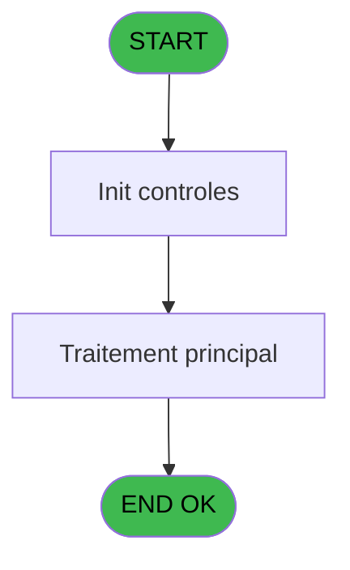
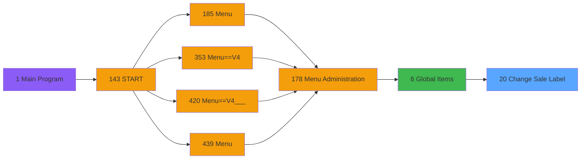
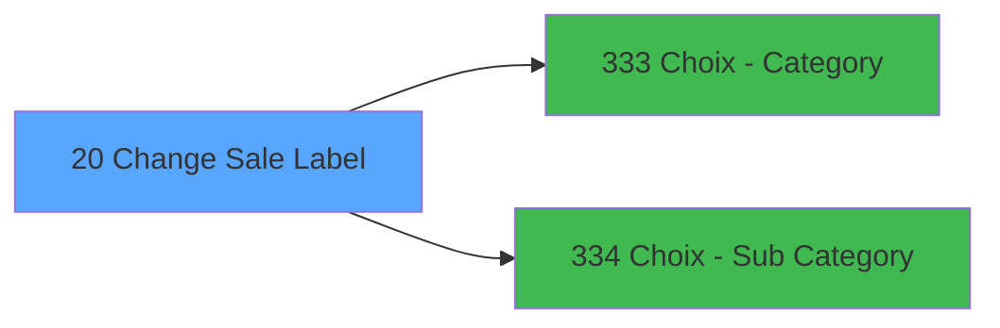

# PVE IDE 20 - Change Sale Label

> **Analyse**: Phases 1-4 2026-02-03 01:07 -> 01:08 (41s) | Assemblage 01:08
> **Pipeline**: V7.2 Enrichi
> **Structure**: 4 onglets (Resume | Ecrans | Donnees | Connexions)

<!-- TAB:Resume -->

## 1. FICHE D'IDENTITE

| Attribut | Valeur |
|----------|--------|
| Projet | PVE |
| IDE Position | 20 |
| Nom Programme | Change Sale Label |
| Fichier source | `Prg_20.xml` |
| Domaine metier | Change |
| Taches | 2 (1 ecrans visibles) |
| Tables modifiees | 0 |
| Programmes appeles | 2 |

## 2. DESCRIPTION FONCTIONNELLE

**Change Sale Label** assure la gestion complete de ce processus, accessible depuis [Global Items (IDE 6)](PVE-IDE-6.md).

Le flux de traitement s'organise en **1 blocs fonctionnels** :

- **Traitement** (2 taches) : traitements metier divers

## 3. BLOCS FONCTIONNELS

### 3.1 Traitement (2 taches)

Traitements internes.

---

#### 20 - Change Sale Label [[ECRAN]](#ecran-t1)

**Role** : Traitement : Change Sale Label.
**Ecran** : 786 x 130 DLU (MDI) | [Voir mockup](#ecran-t1)

---

#### 20.1 - Existe Copy Subcat Décoché ?

**Role** : Traitement : Existe Copy Subcat Décoché ?.
**Variables liees** : C (V.Existe Copy Cat/SCat Décoché?)

## 5. REGLES METIER

*(Aucune regle metier identifiee)*

## 6. CONTEXTE

- **Appele par**: [Global Items (IDE 6)](PVE-IDE-6.md)
- **Appelle**: 2 programmes | **Tables**: 3 (W:0 R:2 L:1) | **Taches**: 2 | **Expressions**: 9

<!-- TAB:Ecrans -->

## 8. ECRANS

### 8.1 Forms visibles (1 / 2)

| # | Position | Tache | Nom | Type | Largeur | Hauteur | Bloc |
|---|----------|-------|-----|------|---------|---------|------|
| 1 | 20 | 20 | Change Sale Label | MDI | 786 | 130 | Traitement |

### 8.2 Mockups Ecrans

---

#### 20 - Change Sale Label
**Tache** : [20](#t1) | **Type** : MDI | **Dimensions** : 786 x 130 DLU
**Bloc** : Traitement | **Titre IDE** : Change Sale Label

<!-- FORM-DATA:
{
    "width":  786,
    "vFactor":  8,
    "type":  "MDI",
    "hFactor":  8,
    "controls":  [
                     {
                         "x":  8,
                         "type":  "label",
                         "var":  "",
                         "y":  3,
                         "w":  378,
                         "fmt":  "",
                         "name":  "",
                         "h":  37,
                         "color":  "183",
                         "text":  "Category",
                         "parent":  null
                     },
                     {
                         "x":  8,
                         "type":  "label",
                         "var":  "",
                         "y":  47,
                         "w":  378,
                         "fmt":  "",
                         "name":  "",
                         "h":  37,
                         "color":  "183",
                         "text":  "Sub Category",
                         "parent":  null
                     },
                     {
                         "x":  6,
                         "type":  "label",
                         "var":  "",
                         "y":  96,
                         "w":  773,
                         "fmt":  "",
                         "name":  "",
                         "h":  31,
                         "color":  "182",
                         "text":  "",
                         "parent":  null
                     },
                     {
                         "x":  16,
                         "type":  "button",
                         "var":  "",
                         "y":  14,
                         "w":  358,
                         "fmt":  "",
                         "name":  "CAT",
                         "h":  22,
                         "color":  "",
                         "text":  "",
                         "parent":  1
                     },
                     {
                         "x":  16,
                         "type":  "button",
                         "var":  "",
                         "y":  58,
                         "w":  358,
                         "fmt":  "",
                         "name":  "SUBCAT",
                         "h":  22,
                         "color":  "",
                         "text":  "",
                         "parent":  3
                     },
                     {
                         "x":  14,
                         "type":  "button",
                         "var":  "",
                         "y":  102,
                         "w":  145,
                         "fmt":  "\u0026Exit",
                         "name":  "",
                         "h":  22,
                         "color":  "",
                         "text":  "",
                         "parent":  5
                     },
                     {
                         "x":  621,
                         "type":  "button",
                         "var":  "",
                         "y":  102,
                         "w":  145,
                         "fmt":  "\u0026Change",
                         "name":  "CHANGE",
                         "h":  22,
                         "color":  "",
                         "text":  "",
                         "parent":  5
                     },
                     {
                         "x":  170,
                         "type":  "button",
                         "var":  "",
                         "y":  102,
                         "w":  145,
                         "fmt":  "\u0026RAZ",
                         "name":  "RAZ",
                         "h":  22,
                         "color":  "",
                         "text":  "",
                         "parent":  5
                     }
                 ],
    "taskId":  "20",
    "height":  130
}
-->

<strong>Boutons : 5 boutons</strong>

| Bouton | Pos (x,y) | Action |
|--------|-----------|--------|
| CAT | 16,14 | Appel [Choix - Category (IDE 333)](PVE-IDE-333.md) |
| SUBCAT | 16,58 | Bouton fonctionnel |
| Exit | 14,102 | Quitte le programme |
| Change | 621,102 | Modifie l'element |
| RAZ | 170,102 | Bouton fonctionnel |

## 9. NAVIGATION

Ecran unique: **Change Sale Label**

### 9.3 Structure hierarchique (2 taches)

| Position | Tache | Type | Dimensions | Bloc |
|----------|-------|------|------------|------|
| **20.1** | [**Change Sale Label** (20)](#t1) [mockup](#ecran-t1) | MDI | 786x130 | Traitement |
| 20.1.1 | [Existe Copy Subcat Décoché ? (20.1)](#t2) | - | - | |

### 9.4 Algorigramme

> **Legende**: Vert = START/END OK | Rouge = END KO | Bleu = Decisions
> *Algorigramme auto-genere. Utiliser `/algorigramme` pour une synthese metier detaillee.*

<!-- TAB:Donnees -->

## 10. TABLES

### Tables utilisees (3)

| ID | Nom | Description | Type | R | W | L | Usages |
|----|-----|-------------|------|---|---|---|--------|
| 379 | pv_customer_temp |  | DB | R |   |   | 1 |
| 403 | pv_sellers |  | DB | R |   |   | 1 |
| 413 | pv_tva |  | DB |   |   | L | 1 |

### Colonnes par table (1 / 2 tables avec colonnes identifiees)

Table 379 - pv_customer_temp (R) - 1 usages

| Lettre | Variable | Acces | Type |
|--------|----------|-------|------|
| A | P. Category | R | Numeric |
| B | P.Sub Category | R | Numeric |
| C | V.Existe Copy Cat/SCat Décoché? | R | Logical |
| D | V.Confirme traitement ? | R | Numeric |

Table 403 - pv_sellers (R) - 1 usages

*Table utilisee uniquement en Link ou aucune colonne Real identifiee dans le DataView.*

## 11. VARIABLES

### 11.1 Parametres entrants (2)

Variables recues du programme appelant ([Global Items (IDE 6)](PVE-IDE-6.md)).

| Lettre | Nom | Type | Usage dans |
|--------|-----|------|-----------|
| A | P. Category | Numeric | 1x parametre entrant |
| B | P.Sub Category | Numeric | 2x parametre entrant |

### 11.2 Variables de session (2)

Variables persistantes pendant toute la session.

| Lettre | Nom | Type | Usage dans |
|--------|-----|------|-----------|
| C | V.Existe Copy Cat/SCat Décoché? | Logical | - |
| D | V.Confirme traitement ? | Numeric | - |

## 12. EXPRESSIONS

**9 / 9 expressions decodees (100%)**

### 12.1 Repartition par type

| Type | Expressions | Regles |
|------|-------------|--------|
| CONSTANTE | 2 | 0 |
| OTHER | 4 | 0 |
| CONDITION | 2 | 0 |
| CONCATENATION | 1 | 0 |

### 12.2 Expressions cles par type

#### CONSTANTE (2 expressions)

| Type | IDE | Expression | Regle |
|------|-----|------------|-------|
| CONSTANTE | 8 | `6` | - |
| CONSTANTE | 4 | `0` | - |

#### OTHER (4 expressions)

| Type | IDE | Expression | Regle |
|------|-----|------------|-------|
| OTHER | 5 | `P.Sub Category [B]` | - |
| OTHER | 6 | `[J]` | - |
| OTHER | 1 | `GetParam ('SERVICE')` | - |
| OTHER | 2 | `P. Category [A]` | - |

#### CONDITION (2 expressions)

| Type | IDE | Expression | Regle |
|------|-----|------------|-------|
| CONDITION | 9 | `[K]=6` | - |
| CONDITION | 3 | `CndRange(P.Sub Category [B]>0,P.Sub Category [B])` | - |

#### CONCATENATION (1 expressions)

| Type | IDE | Expression | Regle |
|------|-----|------------|-------|
| CONCATENATION | 7 | `'The Sale Label of at least one item in the selection is currently not editable.'&ASCIIChr (13)& 'By validating, all the Sale labels in the selection will be reset, regardless of the settings.'&ASCIIChr (13)& 'Do you wish to continue?'` | - |

<!-- TAB:Connexions -->

## 13. GRAPHE D'APPELS

### 13.1 Chaine depuis Main (Callers)

Main -> ... -> [Global Items (IDE 6)](PVE-IDE-6.md) -> **Change Sale Label (IDE 20)**

### 13.2 Callers

| IDE | Nom Programme | Nb Appels |
|-----|---------------|-----------|
| [6](PVE-IDE-6.md) | Global Items | 1 |

### 13.3 Callees (programmes appeles)

### 13.4 Detail Callees avec contexte

| IDE | Nom Programme | Appels | Contexte |
|-----|---------------|--------|----------|
| [333](PVE-IDE-333.md) | Choix - Category | 1 | Selection/consultation |
| [334](PVE-IDE-334.md) | Choix - Sub Category | 1 | Selection/consultation |

## 14. RECOMMANDATIONS MIGRATION

### 14.1 Profil du programme

| Metrique | Valeur | Impact migration |
|----------|--------|-----------------|
| Lignes de logique | 50 | Programme compact |
| Expressions | 9 | Peu de logique |
| Tables WRITE | 0 | Impact faible |
| Sous-programmes | 2 | Peu de dependances |
| Ecrans visibles | 1 | Ecran unique ou traitement batch |
| Code desactive | 0% (0 / 50) | Code sain |
| Regles metier | 0 | Pas de regle identifiee |

### 14.2 Plan de migration par bloc

#### Traitement (2 taches: 1 ecran, 1 traitement)

- **Strategie** : Orchestrateur avec 1 ecrans (Razor/React) et 1 traitements backend (services).
- Les ecrans deviennent des composants UI, les traitements invisibles deviennent des services injectables.
- 2 sous-programme(s) a migrer ou a reutiliser depuis les services existants.
- Decomposer les taches en services unitaires testables.

### 14.3 Dependances critiques

| Dependance | Type | Appels | Impact |
|------------|------|--------|--------|
| [Choix - Sub Category (IDE 334)](PVE-IDE-334.md) | Sous-programme | 1x | Normale - Selection/consultation |
| [Choix - Category (IDE 333)](PVE-IDE-333.md) | Sous-programme | 1x | Normale - Selection/consultation |

---
*Spec DETAILED generee par Pipeline V7.2 - 2026-02-03 01:08*
