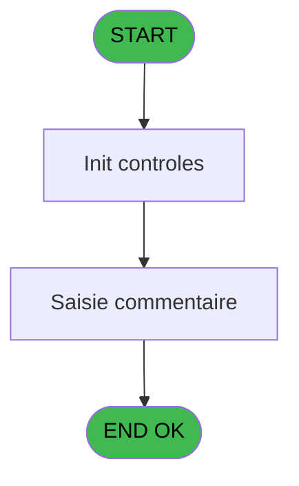
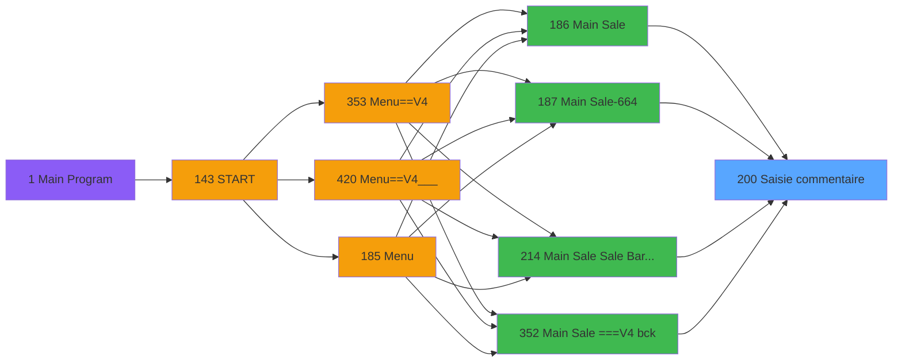
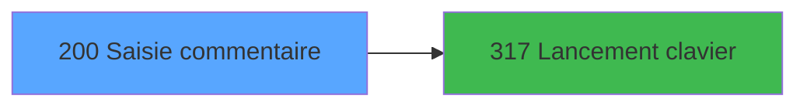

# PVE IDE 200 - Saisie commentaire

> **Analyse**: Phases 1-4 2026-02-03 18:51 -> 18:52 (12s) | Assemblage 18:52
> **Pipeline**: V7.2 Enrichi
> **Structure**: 4 onglets (Resume | Ecrans | Donnees | Connexions)

<!-- TAB:Resume -->

## 1. FICHE D'IDENTITE

| Attribut | Valeur |
|----------|--------|
| Projet | PVE |
| IDE Position | 200 |
| Nom Programme | Saisie commentaire |
| Fichier source | `Prg_200.xml` |
| Dossier IDE | Mobile |
| Taches | 2 (1 ecrans visibles) |
| Tables modifiees | 0 |
| Programmes appeles | 1 |

## 2. DESCRIPTION FONCTIONNELLE

**Saisie commentaire** assure la gestion complete de ce processus, accessible depuis [Main Sale (IDE 186)](PVE-IDE-186.md), [Main Sale Sale Bar Code (IDE 214)](PVE-IDE-214.md), [Main Sale-664 (IDE 187)](PVE-IDE-187.md), [Main Sale ===V4 (IDE 0)](PVE-IDE-0.md), [Main Sale ===V4 bck (IDE 352)](PVE-IDE-352.md), [Main Sale ===V4 (IDE 354)](PVE-IDE-354.md), [Main Sale ===V4 (IDE 359)](PVE-IDE-359.md), [Main Sale (IDE 363)](PVE-IDE-363.md), [Main Sale-664 (IDE 364)](PVE-IDE-364.md), [Main Sale ===V4 (IDE 409)](PVE-IDE-409.md), [Main Sale ===V4 (IDE 415)](PVE-IDE-415.md), [Main Sale ===V4 Booking ACTUEL (IDE 417)](PVE-IDE-417.md), [Main Sale (IDE 440)](PVE-IDE-440.md).

Le flux de traitement s'organise en **1 blocs fonctionnels** :

- **Traitement** (2 taches) : traitements metier divers

## 3. BLOCS FONCTIONNELS

### 3.1 Traitement (2 taches)

Traitements internes.

---

#### 200 - Comment [[ECRAN]](#ecran-t1)

**Role** : Traitement : Comment.
**Ecran** : 440 x 136 DLU (Type6) | [Voir mockup](#ecran-t1)
**Variables liees** : A (P.Comment), B (P.Comment Mandatory ?), C (P.Comment Modifiable ?), D (P.Commentaire KO?)
**Delegue a** : [Lancement clavier (IDE 317)](PVE-IDE-317.md)

---

#### 200.1 - Comment [[ECRAN]](#ecran-t4)

**Role** : Traitement : Comment.
**Ecran** : 440 x 136 DLU (Type6) | [Voir mockup](#ecran-t4)
**Variables liees** : A (P.Comment), B (P.Comment Mandatory ?), C (P.Comment Modifiable ?), D (P.Commentaire KO?)
**Delegue a** : [Lancement clavier (IDE 317)](PVE-IDE-317.md)

## 5. REGLES METIER

*(Aucune regle metier identifiee)*

## 6. CONTEXTE

- **Appele par**: [Main Sale (IDE 186)](PVE-IDE-186.md), [Main Sale Sale Bar Code (IDE 214)](PVE-IDE-214.md), [Main Sale-664 (IDE 187)](PVE-IDE-187.md), [Main Sale ===V4 (IDE 0)](PVE-IDE-0.md), [Main Sale ===V4 bck (IDE 352)](PVE-IDE-352.md), [Main Sale ===V4 (IDE 354)](PVE-IDE-354.md), [Main Sale ===V4 (IDE 359)](PVE-IDE-359.md), [Main Sale (IDE 363)](PVE-IDE-363.md), [Main Sale-664 (IDE 364)](PVE-IDE-364.md), [Main Sale ===V4 (IDE 409)](PVE-IDE-409.md), [Main Sale ===V4 (IDE 415)](PVE-IDE-415.md), [Main Sale ===V4 Booking ACTUEL (IDE 417)](PVE-IDE-417.md), [Main Sale (IDE 440)](PVE-IDE-440.md)
- **Appelle**: 1 programmes | **Tables**: 0 (W:0 R:0 L:0) | **Taches**: 2 | **Expressions**: 3

<!-- TAB:Ecrans -->

## 8. ECRANS

### 8.1 Forms visibles (1 / 2)

| # | Position | Tache | Nom | Type | Largeur | Hauteur | Bloc |
|---|----------|-------|-----|------|---------|---------|------|
| 1 | 200.1 | 200.1 | Comment | Type6 | 440 | 136 | Traitement |

### 8.2 Mockups Ecrans

---

#### 200.1 - Comment
**Tache** : [200.1](#t4) | **Type** : Type6 | **Dimensions** : 440 x 136 DLU
**Bloc** : Traitement | **Titre IDE** : Comment

<!-- FORM-DATA:
{
    "width":  440,
    "vFactor":  8,
    "type":  "Type6",
    "hFactor":  4,
    "controls":  [
                     {
                         "x":  4,
                         "type":  "label",
                         "var":  "",
                         "y":  102,
                         "w":  434,
                         "fmt":  "",
                         "name":  "",
                         "h":  32,
                         "color":  "6",
                         "text":  "",
                         "parent":  null
                     },
                     {
                         "x":  4,
                         "type":  "label",
                         "var":  "",
                         "y":  0,
                         "w":  434,
                         "fmt":  "",
                         "name":  "",
                         "h":  42,
                         "color":  "186",
                         "text":  "",
                         "parent":  null
                     },
                     {
                         "x":  14,
                         "type":  "label",
                         "var":  "",
                         "y":  10,
                         "w":  235,
                         "fmt":  "",
                         "name":  "",
                         "h":  22,
                         "color":  "186",
                         "text":  "Enter a comment\r\n",
                         "parent":  3
                     },
                     {
                         "x":  389,
                         "type":  "image",
                         "var":  "",
                         "y":  4,
                         "w":  48,
                         "fmt":  "",
                         "name":  "",
                         "h":  37,
                         "color":  "",
                         "text":  "",
                         "parent":  5
                     },
                     {
                         "x":  4,
                         "type":  "edit",
                         "var":  "",
                         "y":  60,
                         "w":  434,
                         "fmt":  "",
                         "name":  "Comment",
                         "h":  19,
                         "color":  "110",
                         "text":  "",
                         "parent":  null
                     },
                     {
                         "x":  5,
                         "type":  "button",
                         "var":  "",
                         "y":  107,
                         "w":  121,
                         "fmt":  "\u0026Keyboard",
                         "name":  "KEYBORD",
                         "h":  24,
                         "color":  "",
                         "text":  "",
                         "parent":  2
                     },
                     {
                         "x":  160,
                         "type":  "button",
                         "var":  "",
                         "y":  107,
                         "w":  121,
                         "fmt":  "\u0026Exit",
                         "name":  "",
                         "h":  24,
                         "color":  "",
                         "text":  "",
                         "parent":  2
                     },
                     {
                         "x":  316,
                         "type":  "button",
                         "var":  "",
                         "y":  107,
                         "w":  121,
                         "fmt":  "\u0026OK",
                         "name":  "OK",
                         "h":  24,
                         "color":  "",
                         "text":  "",
                         "parent":  2
                     }
                 ],
    "taskId":  "200.1",
    "height":  136
}
-->

<strong>Champs : 1 champs</strong>

| Pos (x,y) | Nom | Variable | Type |
|-----------|-----|----------|------|
| 4,60 | Comment | - | edit |

<strong>Boutons : 3 boutons</strong>

| Bouton | Pos (x,y) | Action |
|--------|-----------|--------|
| Keyboard | 5,107 | Bouton fonctionnel |
| Exit | 160,107 | Quitte le programme |
| OK | 316,107 | Valide la saisie et enregistre |

## 9. NAVIGATION

Ecran unique: **Comment**

### 9.3 Structure hierarchique (2 taches)

| Position | Tache | Type | Dimensions | Bloc |
|----------|-------|------|------------|------|
| **200.1** | [**Comment** (200)](#t1) [mockup](#ecran-t1) | Type6 | 440x136 | Traitement |
| 200.1.1 | [Comment (200.1)](#t4) [mockup](#ecran-t4) | Type6 | 440x136 | |

### 9.4 Algorigramme

> **Legende**: Vert = START/END OK | Rouge = END KO | Bleu = Decisions
> *Algorigramme auto-genere. Utiliser `/algorigramme` pour une synthese metier detaillee.*

<!-- TAB:Donnees -->

## 10. TABLES

### Tables utilisees (0)

| ID | Nom | Description | Type | R | W | L | Usages |
|----|-----|-------------|------|---|---|---|--------|

### Colonnes par table (0 / 0 tables avec colonnes identifiees)

## 11. VARIABLES

### 11.1 Parametres entrants (4)

Variables recues du programme appelant ([Main Sale (IDE 186)](PVE-IDE-186.md)).

| Lettre | Nom | Type | Usage dans |
|--------|-----|------|-----------|
| A | P.Comment | Alpha | 1x parametre entrant |
| B | P.Comment Mandatory ? | Logical | 1x parametre entrant |
| C | P.Comment Modifiable ? | Logical | - |
| D | P.Commentaire KO? | Logical | - |

### 11.2 Autres (1)

Variables diverses.

| Lettre | Nom | Type | Usage dans |
|--------|-----|------|-----------|
| E | B Ok | Alpha | - |

## 12. EXPRESSIONS

**3 / 3 expressions decodees (100%)**

### 12.1 Repartition par type

| Type | Expressions | Regles |
|------|-------------|--------|
| CONDITION | 1 | 0 |
| CAST_LOGIQUE | 2 | 0 |

### 12.2 Expressions cles par type

#### CONDITION (1 expressions)

| Type | IDE | Expression | Regle |
|------|-----|------------|-------|
| CONDITION | 1 | `P.Comment [A]='' AND P.Comment Mandatory ? [B]` | - |

#### CAST_LOGIQUE (2 expressions)

| Type | IDE | Expression | Regle |
|------|-----|------------|-------|
| CAST_LOGIQUE | 3 | `'TRUE'LOG` | - |
| CAST_LOGIQUE | 2 | `'FALSE'LOG` | - |

<!-- TAB:Connexions -->

## 13. GRAPHE D'APPELS

### 13.1 Chaine depuis Main (Callers)

Main -> ... -> [Main Sale (IDE 186)](PVE-IDE-186.md) -> **Saisie commentaire (IDE 200)**

Main -> ... -> [Main Sale Sale Bar Code (IDE 214)](PVE-IDE-214.md) -> **Saisie commentaire (IDE 200)**

Main -> ... -> [Main Sale-664 (IDE 187)](PVE-IDE-187.md) -> **Saisie commentaire (IDE 200)**

Main -> ... -> [Main Sale ===V4 (IDE 0)](PVE-IDE-0.md) -> **Saisie commentaire (IDE 200)**

Main -> ... -> [Main Sale ===V4 bck (IDE 352)](PVE-IDE-352.md) -> **Saisie commentaire (IDE 200)**

Main -> ... -> [Main Sale ===V4 (IDE 354)](PVE-IDE-354.md) -> **Saisie commentaire (IDE 200)**

Main -> ... -> [Main Sale ===V4 (IDE 359)](PVE-IDE-359.md) -> **Saisie commentaire (IDE 200)**

Main -> ... -> [Main Sale (IDE 363)](PVE-IDE-363.md) -> **Saisie commentaire (IDE 200)**

Main -> ... -> [Main Sale-664 (IDE 364)](PVE-IDE-364.md) -> **Saisie commentaire (IDE 200)**

Main -> ... -> [Main Sale ===V4 (IDE 409)](PVE-IDE-409.md) -> **Saisie commentaire (IDE 200)**

Main -> ... -> [Main Sale ===V4 (IDE 415)](PVE-IDE-415.md) -> **Saisie commentaire (IDE 200)**

Main -> ... -> [Main Sale ===V4 Booking ACTUEL (IDE 417)](PVE-IDE-417.md) -> **Saisie commentaire (IDE 200)**

Main -> ... -> [Main Sale (IDE 440)](PVE-IDE-440.md) -> **Saisie commentaire (IDE 200)**

### 13.2 Callers

| IDE | Nom Programme | Nb Appels |
|-----|---------------|-----------|
| [186](PVE-IDE-186.md) | Main Sale | 5 |
| [214](PVE-IDE-214.md) | Main Sale Sale Bar Code | 5 |
| [187](PVE-IDE-187.md) | Main Sale-664 | 4 |
| [0](PVE-IDE-0.md) | Main Sale ===V4 | 3 |
| [352](PVE-IDE-352.md) | Main Sale ===V4 bck | 3 |
| [354](PVE-IDE-354.md) | Main Sale ===V4 | 3 |
| [359](PVE-IDE-359.md) | Main Sale ===V4 | 3 |
| [363](PVE-IDE-363.md) | Main Sale | 3 |
| [364](PVE-IDE-364.md) | Main Sale-664 | 3 |
| [409](PVE-IDE-409.md) | Main Sale ===V4 | 3 |
| [415](PVE-IDE-415.md) | Main Sale ===V4 | 3 |
| [417](PVE-IDE-417.md) | Main Sale ===V4 Booking ACTUEL | 3 |
| [440](PVE-IDE-440.md) | Main Sale | 3 |

### 13.3 Callees (programmes appeles)

### 13.4 Detail Callees avec contexte

| IDE | Nom Programme | Appels | Contexte |
|-----|---------------|--------|----------|
| [317](PVE-IDE-317.md) | Lancement clavier | 1 | Sous-programme |

## 14. RECOMMANDATIONS MIGRATION

### 14.1 Profil du programme

| Metrique | Valeur | Impact migration |
|----------|--------|-----------------|
| Lignes de logique | 24 | Programme compact |
| Expressions | 3 | Peu de logique |
| Tables WRITE | 0 | Impact faible |
| Sous-programmes | 1 | Peu de dependances |
| Ecrans visibles | 1 | Ecran unique ou traitement batch |
| Code desactive | 0% (0 / 24) | Code sain |
| Regles metier | 0 | Pas de regle identifiee |

### 14.2 Plan de migration par bloc

#### Traitement (2 taches: 2 ecrans, 0 traitement)

- **Strategie** : 2 composant(s) UI (Razor/React) avec formulaires et validation.
- 1 sous-programme(s) a migrer ou a reutiliser depuis les services existants.
- Decomposer les taches en services unitaires testables.

### 14.3 Dependances critiques

| Dependance | Type | Appels | Impact |
|------------|------|--------|--------|
| [Lancement clavier (IDE 317)](PVE-IDE-317.md) | Sous-programme | 1x | Normale - Sous-programme |

---
*Spec DETAILED generee par Pipeline V7.2 - 2026-02-03 18:52*
