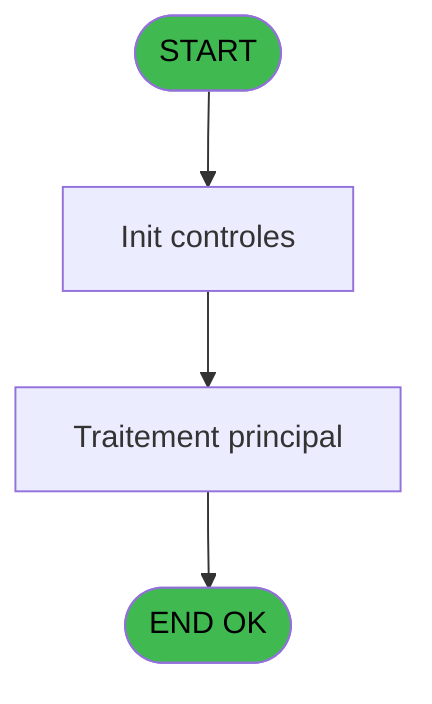
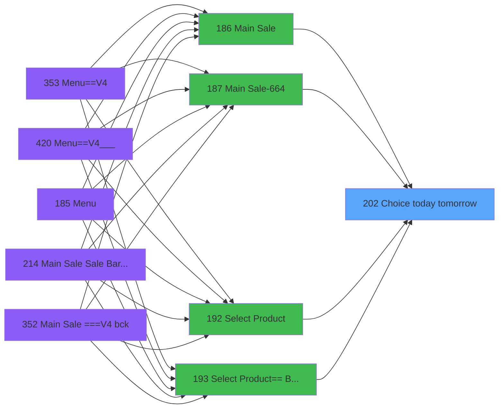

# PVE IDE 202 - Choice today tomorrow

> **Analyse**: Phases 1-4 2026-02-03 18:52 -> 18:52 (12s) | Assemblage 18:52
> **Pipeline**: V7.2 Enrichi
> **Structure**: 4 onglets (Resume | Ecrans | Donnees | Connexions)

<!-- TAB:Resume -->

## 1. FICHE D'IDENTITE

| Attribut | Valeur |
|----------|--------|
| Projet | PVE |
| IDE Position | 202 |
| Nom Programme | Choice today tomorrow |
| Fichier source | `Prg_202.xml` |
| Dossier IDE | Mobile |
| Taches | 1 (1 ecrans visibles) |
| Tables modifiees | 0 |
| Programmes appeles | 0 |

## 2. DESCRIPTION FONCTIONNELLE

**Choice today tomorrow** assure la gestion complete de ce processus, accessible depuis [Main Sale ===V4 (IDE 0)](PVE-IDE-0.md), [Main Sale (IDE 186)](PVE-IDE-186.md), [Main Sale-664 (IDE 187)](PVE-IDE-187.md), [Select Product (IDE 192)](PVE-IDE-192.md), [Select Product== Best Of (IDE 193)](PVE-IDE-193.md), [Main Sale Sale Bar Code (IDE 214)](PVE-IDE-214.md), [Main Sale ===V4 (IDE 354)](PVE-IDE-354.md), [Select Product==V4 (IDE 356)](PVE-IDE-356.md), [Main Sale ===V4 (IDE 359)](PVE-IDE-359.md), [Select Product==V4 (IDE 360)](PVE-IDE-360.md), [Main Sale (IDE 363)](PVE-IDE-363.md), [Main Sale-664 (IDE 364)](PVE-IDE-364.md), [Best Of (SALE) (IDE 372)](PVE-IDE-372.md), [Report - Revenue by Category (IDE 383)](PVE-IDE-383.md), [Report - Revenue by Place (IDE 384)](PVE-IDE-384.md), [Report - Revenue by Seller (IDE 385)](PVE-IDE-385.md), [Report - Revenue Cancelations (IDE 386)](PVE-IDE-386.md), [Report - Revenue by Day (IDE 390)](PVE-IDE-390.md), [Report - Discount & Gratuities (IDE 391)](PVE-IDE-391.md), [Report - Average basket (IDE 392)](PVE-IDE-392.md).

Le flux de traitement s'organise en **1 blocs fonctionnels** :

- **Traitement** (1 tache) : traitements metier divers

## 3. BLOCS FONCTIONNELS

### 3.1 Traitement (1 tache)

Traitements internes.

---

#### 202 - Equipment check out [[ECRAN]](#ecran-t1)

**Role** : Traitement : Equipment check out.
**Ecran** : 320 x 161 DLU (MDI) | [Voir mockup](#ecran-t1)

## 5. REGLES METIER

*(Aucune regle metier identifiee)*

## 6. CONTEXTE

- **Appele par**: [Main Sale ===V4 (IDE 0)](PVE-IDE-0.md), [Main Sale (IDE 186)](PVE-IDE-186.md), [Main Sale-664 (IDE 187)](PVE-IDE-187.md), [Select Product (IDE 192)](PVE-IDE-192.md), [Select Product== Best Of (IDE 193)](PVE-IDE-193.md), [Main Sale Sale Bar Code (IDE 214)](PVE-IDE-214.md), [Main Sale ===V4 (IDE 354)](PVE-IDE-354.md), [Select Product==V4 (IDE 356)](PVE-IDE-356.md), [Main Sale ===V4 (IDE 359)](PVE-IDE-359.md), [Select Product==V4 (IDE 360)](PVE-IDE-360.md), [Main Sale (IDE 363)](PVE-IDE-363.md), [Main Sale-664 (IDE 364)](PVE-IDE-364.md), [Best Of (SALE) (IDE 372)](PVE-IDE-372.md), [Report - Revenue by Category (IDE 383)](PVE-IDE-383.md), [Report - Revenue by Place (IDE 384)](PVE-IDE-384.md), [Report - Revenue by Seller (IDE 385)](PVE-IDE-385.md), [Report - Revenue Cancelations (IDE 386)](PVE-IDE-386.md), [Report - Revenue by Day (IDE 390)](PVE-IDE-390.md), [Report - Discount & Gratuities (IDE 391)](PVE-IDE-391.md), [Report - Average basket (IDE 392)](PVE-IDE-392.md)
- **Appelle**: 0 programmes | **Tables**: 0 (W:0 R:0 L:0) | **Taches**: 1 | **Expressions**: 2

<!-- TAB:Ecrans -->

## 8. ECRANS

### 8.1 Forms visibles (1 / 1)

| # | Position | Tache | Nom | Type | Largeur | Hauteur | Bloc |
|---|----------|-------|-----|------|---------|---------|------|
| 1 | 202 | 202 | Equipment check out | MDI | 320 | 161 | Traitement |

### 8.2 Mockups Ecrans

---

#### 202 - Equipment check out
**Tache** : [202](#t1) | **Type** : MDI | **Dimensions** : 320 x 161 DLU
**Bloc** : Traitement | **Titre IDE** : Equipment check out

<!-- FORM-DATA:
{
    "width":  320,
    "vFactor":  8,
    "type":  "MDI",
    "hFactor":  4,
    "controls":  [
                     {
                         "x":  82,
                         "type":  "label",
                         "var":  "",
                         "y":  61,
                         "w":  156,
                         "fmt":  "",
                         "name":  "",
                         "h":  11,
                         "color":  "187",
                         "text":  "Choose start day of location",
                         "parent":  null
                     },
                     {
                         "x":  0,
                         "type":  "label",
                         "var":  "",
                         "y":  0,
                         "w":  319,
                         "fmt":  "",
                         "name":  "",
                         "h":  42,
                         "color":  "182",
                         "text":  "",
                         "parent":  null
                     },
                     {
                         "x":  175,
                         "type":  "button",
                         "var":  "",
                         "y":  99,
                         "w":  77,
                         "fmt":  "\u0026Tomorrow",
                         "name":  "bt tomorrow",
                         "h":  24,
                         "color":  "",
                         "text":  "",
                         "parent":  null
                     },
                     {
                         "x":  270,
                         "type":  "image",
                         "var":  "",
                         "y":  4,
                         "w":  48,
                         "fmt":  "",
                         "name":  "",
                         "h":  37,
                         "color":  "",
                         "text":  "",
                         "parent":  2
                     },
                     {
                         "x":  68,
                         "type":  "button",
                         "var":  "",
                         "y":  99,
                         "w":  77,
                         "fmt":  "To\u0026day",
                         "name":  "bt.today",
                         "h":  24,
                         "color":  "",
                         "text":  "",
                         "parent":  null
                     }
                 ],
    "taskId":  "202",
    "height":  161
}
-->

<strong>Boutons : 2 boutons</strong>

| Bouton | Pos (x,y) | Action |
|--------|-----------|--------|
| Tomorrow | 175,99 | Bouton fonctionnel |
| Today | 68,99 | Bouton fonctionnel |

## 9. NAVIGATION

Ecran unique: **Equipment check out**

### 9.3 Structure hierarchique (1 tache)

| Position | Tache | Type | Dimensions | Bloc |
|----------|-------|------|------------|------|
| **202.1** | [**Equipment check out** (202)](#t1) [mockup](#ecran-t1) | MDI | 320x161 | Traitement |

### 9.4 Algorigramme

> **Legende**: Vert = START/END OK | Rouge = END KO | Bleu = Decisions
> *Algorigramme auto-genere. Utiliser `/algorigramme` pour une synthese metier detaillee.*

<!-- TAB:Donnees -->

## 10. TABLES

### Tables utilisees (0)

| ID | Nom | Description | Type | R | W | L | Usages |
|----|-----|-------------|------|---|---|---|--------|

### Colonnes par table (0 / 0 tables avec colonnes identifiees)

## 11. VARIABLES

*(Programme sans variables locales mappees)*

## 12. EXPRESSIONS

**2 / 2 expressions decodees (100%)**

### 12.1 Repartition par type

| Type | Expressions | Regles |
|------|-------------|--------|
| CAST_LOGIQUE | 2 | 0 |

### 12.2 Expressions cles par type

#### CAST_LOGIQUE (2 expressions)

| Type | IDE | Expression | Regle |
|------|-----|------------|-------|
| CAST_LOGIQUE | 2 | `'FALSE'LOG` | - |
| CAST_LOGIQUE | 1 | `'TRUE'LOG` | - |

<!-- TAB:Connexions -->

## 13. GRAPHE D'APPELS

### 13.1 Chaine depuis Main (Callers)

Main -> ... -> [Main Sale ===V4 (IDE 0)](PVE-IDE-0.md) -> **Choice today tomorrow (IDE 202)**

Main -> ... -> [Main Sale (IDE 186)](PVE-IDE-186.md) -> **Choice today tomorrow (IDE 202)**

Main -> ... -> [Main Sale-664 (IDE 187)](PVE-IDE-187.md) -> **Choice today tomorrow (IDE 202)**

Main -> ... -> [Select Product (IDE 192)](PVE-IDE-192.md) -> **Choice today tomorrow (IDE 202)**

Main -> ... -> [Select Product== Best Of (IDE 193)](PVE-IDE-193.md) -> **Choice today tomorrow (IDE 202)**

Main -> ... -> [Main Sale Sale Bar Code (IDE 214)](PVE-IDE-214.md) -> **Choice today tomorrow (IDE 202)**

Main -> ... -> [Main Sale ===V4 (IDE 354)](PVE-IDE-354.md) -> **Choice today tomorrow (IDE 202)**

Main -> ... -> [Select Product==V4 (IDE 356)](PVE-IDE-356.md) -> **Choice today tomorrow (IDE 202)**

Main -> ... -> [Main Sale ===V4 (IDE 359)](PVE-IDE-359.md) -> **Choice today tomorrow (IDE 202)**

Main -> ... -> [Select Product==V4 (IDE 360)](PVE-IDE-360.md) -> **Choice today tomorrow (IDE 202)**

Main -> ... -> [Main Sale (IDE 363)](PVE-IDE-363.md) -> **Choice today tomorrow (IDE 202)**

Main -> ... -> [Main Sale-664 (IDE 364)](PVE-IDE-364.md) -> **Choice today tomorrow (IDE 202)**

Main -> ... -> [Best Of (SALE) (IDE 372)](PVE-IDE-372.md) -> **Choice today tomorrow (IDE 202)**

Main -> ... -> [Report - Revenue by Category (IDE 383)](PVE-IDE-383.md) -> **Choice today tomorrow (IDE 202)**

Main -> ... -> [Report - Revenue by Place (IDE 384)](PVE-IDE-384.md) -> **Choice today tomorrow (IDE 202)**

Main -> ... -> [Report - Revenue by Seller (IDE 385)](PVE-IDE-385.md) -> **Choice today tomorrow (IDE 202)**

Main -> ... -> [Report - Revenue Cancelations (IDE 386)](PVE-IDE-386.md) -> **Choice today tomorrow (IDE 202)**

Main -> ... -> [Report - Revenue by Day (IDE 390)](PVE-IDE-390.md) -> **Choice today tomorrow (IDE 202)**

Main -> ... -> [Report - Discount & Gratuities (IDE 391)](PVE-IDE-391.md) -> **Choice today tomorrow (IDE 202)**

Main -> ... -> [Report - Average basket (IDE 392)](PVE-IDE-392.md) -> **Choice today tomorrow (IDE 202)**

### 13.2 Callers

| IDE | Nom Programme | Nb Appels |
|-----|---------------|-----------|
| [0](PVE-IDE-0.md) | Main Sale ===V4 | 1 |
| [186](PVE-IDE-186.md) | Main Sale | 1 |
| [187](PVE-IDE-187.md) | Main Sale-664 | 1 |
| [192](PVE-IDE-192.md) | Select Product | 1 |
| [193](PVE-IDE-193.md) | Select Product== Best Of | 1 |
| [214](PVE-IDE-214.md) | Main Sale Sale Bar Code | 1 |
| [354](PVE-IDE-354.md) | Main Sale ===V4 | 1 |
| [356](PVE-IDE-356.md) | Select Product==V4 | 1 |
| [359](PVE-IDE-359.md) | Main Sale ===V4 | 1 |
| [360](PVE-IDE-360.md) | Select Product==V4 | 1 |
| [363](PVE-IDE-363.md) | Main Sale | 1 |
| [364](PVE-IDE-364.md) | Main Sale-664 | 1 |
| [372](PVE-IDE-372.md) | Best Of (SALE) | 1 |
| [383](PVE-IDE-383.md) | Report - Revenue by Category | 1 |
| [384](PVE-IDE-384.md) | Report - Revenue by Place | 1 |
| [385](PVE-IDE-385.md) | Report - Revenue by Seller | 1 |
| [386](PVE-IDE-386.md) | Report - Revenue Cancelations | 1 |
| [390](PVE-IDE-390.md) | Report - Revenue by Day | 1 |
| [391](PVE-IDE-391.md) | Report - Discount & Gratuities | 1 |
| [392](PVE-IDE-392.md) | Report - Average basket | 1 |

### 13.3 Callees (programmes appeles)

### 13.4 Detail Callees avec contexte

| IDE | Nom Programme | Appels | Contexte |
|-----|---------------|--------|----------|
| - | (aucun) | - | - |

## 14. RECOMMANDATIONS MIGRATION

### 14.1 Profil du programme

| Metrique | Valeur | Impact migration |
|----------|--------|-----------------|
| Lignes de logique | 10 | Programme compact |
| Expressions | 2 | Peu de logique |
| Tables WRITE | 0 | Impact faible |
| Sous-programmes | 0 | Peu de dependances |
| Ecrans visibles | 1 | Ecran unique ou traitement batch |
| Code desactive | 0% (0 / 10) | Code sain |
| Regles metier | 0 | Pas de regle identifiee |

### 14.2 Plan de migration par bloc

#### Traitement (1 tache: 1 ecran, 0 traitement)

- **Strategie** : 1 composant(s) UI (Razor/React) avec formulaires et validation.
- Decomposer les taches en services unitaires testables.

### 14.3 Dependances critiques

| Dependance | Type | Appels | Impact |
|------------|------|--------|--------|

---
*Spec DETAILED generee par Pipeline V7.2 - 2026-02-03 18:52*
