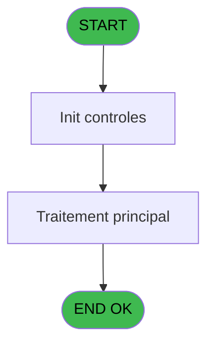
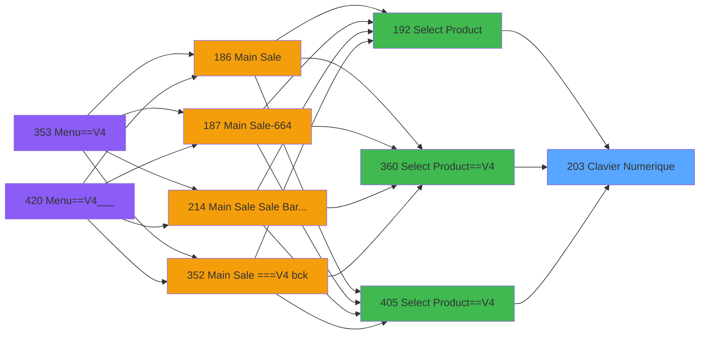
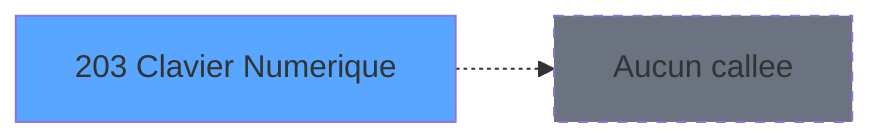

# PVE IDE 203 - Clavier Numerique

> **Analyse**: Phases 1-4 2026-02-03 18:52 -> 18:53 (14s) | Assemblage 18:53
> **Pipeline**: V7.2 Enrichi
> **Structure**: 4 onglets (Resume | Ecrans | Donnees | Connexions)

<!-- TAB:Resume -->

## 1. FICHE D'IDENTITE

| Attribut | Valeur |
|----------|--------|
| Projet | PVE |
| IDE Position | 203 |
| Nom Programme | Clavier Numerique |
| Fichier source | `Prg_203.xml` |
| Dossier IDE | Mobile |
| Taches | 1 (1 ecrans visibles) |
| Tables modifiees | 0 |
| Programmes appeles | 0 |

## 2. DESCRIPTION FONCTIONNELLE

**Clavier Numerique** assure la gestion complete de ce processus, accessible depuis [Select Product (IDE 192)](PVE-IDE-192.md), [Select Product==V4 (IDE 360)](PVE-IDE-360.md), [Select Product==V4 (IDE 405)](PVE-IDE-405.md).

Le flux de traitement s'organise en **1 blocs fonctionnels** :

- **Consultation** (1 tache) : ecrans de recherche, selection et consultation

## 3. BLOCS FONCTIONNELS

### 3.1 Consultation (1 tache)

Ecrans de recherche et consultation.

---

#### 203 - Select Product [[ECRAN]](#ecran-t1)

**Role** : Traitement : Select Product.
**Ecran** : 419 x 255 DLU (Type6) | [Voir mockup](#ecran-t1)

## 5. REGLES METIER

*(Aucune regle metier identifiee)*

## 6. CONTEXTE

- **Appele par**: [Select Product (IDE 192)](PVE-IDE-192.md), [Select Product==V4 (IDE 360)](PVE-IDE-360.md), [Select Product==V4 (IDE 405)](PVE-IDE-405.md)
- **Appelle**: 0 programmes | **Tables**: 0 (W:0 R:0 L:0) | **Taches**: 1 | **Expressions**: 15

<!-- TAB:Ecrans -->

## 8. ECRANS

### 8.1 Forms visibles (1 / 1)

| # | Position | Tache | Nom | Type | Largeur | Hauteur | Bloc |
|---|----------|-------|-----|------|---------|---------|------|
| 1 | 203 | 203 | Select Product | Type6 | 419 | 255 | Consultation |

### 8.2 Mockups Ecrans

---

#### 203 - Select Product
**Tache** : [203](#t1) | **Type** : Type6 | **Dimensions** : 419 x 255 DLU
**Bloc** : Consultation | **Titre IDE** : Select Product

<!-- FORM-DATA:
{
    "width":  419,
    "vFactor":  8,
    "type":  "Type6",
    "hFactor":  8,
    "controls":  [
                     {
                         "x":  19,
                         "type":  "label",
                         "var":  "",
                         "y":  10,
                         "w":  375,
                         "fmt":  "",
                         "name":  "",
                         "h":  30,
                         "color":  "189",
                         "text":  "",
                         "parent":  null
                     },
                     {
                         "x":  38,
                         "type":  "label",
                         "var":  "",
                         "y":  18,
                         "w":  70,
                         "fmt":  "",
                         "name":  "",
                         "h":  15,
                         "color":  "189",
                         "text":  "Price",
                         "parent":  4
                     },
                     {
                         "x":  19,
                         "type":  "label",
                         "var":  "",
                         "y":  41,
                         "w":  375,
                         "fmt":  "",
                         "name":  "",
                         "h":  176,
                         "color":  "183",
                         "text":  "",
                         "parent":  null
                     },
                     {
                         "x":  19,
                         "type":  "label",
                         "var":  "",
                         "y":  218,
                         "w":  375,
                         "fmt":  "",
                         "name":  "",
                         "h":  26,
                         "color":  "6",
                         "text":  "",
                         "parent":  null
                     },
                     {
                         "x":  119,
                         "type":  "edit",
                         "var":  "",
                         "y":  18,
                         "w":  258,
                         "fmt":  "12",
                         "name":  "v.PrixSaisie",
                         "h":  15,
                         "color":  "",
                         "text":  "",
                         "parent":  4
                     },
                     {
                         "x":  45,
                         "type":  "button",
                         "var":  "",
                         "y":  45,
                         "w":  85,
                         "fmt":  "1",
                         "name":  "1",
                         "h":  31,
                         "color":  "",
                         "text":  "",
                         "parent":  4
                     },
                     {
                         "x":  166,
                         "type":  "button",
                         "var":  "",
                         "y":  45,
                         "w":  85,
                         "fmt":  "2",
                         "name":  "2",
                         "h":  31,
                         "color":  "",
                         "text":  "",
                         "parent":  4
                     },
                     {
                         "x":  294,
                         "type":  "button",
                         "var":  "",
                         "y":  45,
                         "w":  85,
                         "fmt":  "3",
                         "name":  "3",
                         "h":  31,
                         "color":  "",
                         "text":  "",
                         "parent":  4
                     },
                     {
                         "x":  45,
                         "type":  "button",
                         "var":  "",
                         "y":  79,
                         "w":  85,
                         "fmt":  "4",
                         "name":  "4",
                         "h":  31,
                         "color":  "",
                         "text":  "",
                         "parent":  4
                     },
                     {
                         "x":  166,
                         "type":  "button",
                         "var":  "",
                         "y":  79,
                         "w":  85,
                         "fmt":  "5",
                         "name":  "5",
                         "h":  31,
                         "color":  "",
                         "text":  "",
                         "parent":  4
                     },
                     {
                         "x":  294,
                         "type":  "button",
                         "var":  "",
                         "y":  79,
                         "w":  85,
                         "fmt":  "6",
                         "name":  "6",
                         "h":  31,
                         "color":  "",
                         "text":  "",
                         "parent":  4
                     },
                     {
                         "x":  45,
                         "type":  "button",
                         "var":  "",
                         "y":  113,
                         "w":  85,
                         "fmt":  "7",
                         "name":  "7",
                         "h":  31,
                         "color":  "",
                         "text":  "",
                         "parent":  4
                     },
                     {
                         "x":  166,
                         "type":  "button",
                         "var":  "",
                         "y":  113,
                         "w":  85,
                         "fmt":  "8",
                         "name":  "8",
                         "h":  31,
                         "color":  "",
                         "text":  "",
                         "parent":  4
                     },
                     {
                         "x":  294,
                         "type":  "button",
                         "var":  "",
                         "y":  113,
                         "w":  85,
                         "fmt":  "9",
                         "name":  "9",
                         "h":  31,
                         "color":  "",
                         "text":  "",
                         "parent":  4
                     },
                     {
                         "x":  45,
                         "type":  "button",
                         "var":  "",
                         "y":  147,
                         "w":  85,
                         "fmt":  "Clear",
                         "name":  "Clear",
                         "h":  66,
                         "color":  "",
                         "text":  "",
                         "parent":  4
                     },
                     {
                         "x":  166,
                         "type":  "button",
                         "var":  "",
                         "y":  147,
                         "w":  85,
                         "fmt":  "0",
                         "name":  "0",
                         "h":  31,
                         "color":  "",
                         "text":  "",
                         "parent":  4
                     },
                     {
                         "x":  294,
                         "type":  "button",
                         "var":  "",
                         "y":  147,
                         "w":  85,
                         "fmt":  "Del",
                         "name":  "Del",
                         "h":  66,
                         "color":  "",
                         "text":  "",
                         "parent":  4
                     },
                     {
                         "x":  166,
                         "type":  "button",
                         "var":  "",
                         "y":  182,
                         "w":  85,
                         "fmt":  ".",
                         "name":  "POINT",
                         "h":  31,
                         "color":  "",
                         "text":  "",
                         "parent":  4
                     },
                     {
                         "x":  33,
                         "type":  "button",
                         "var":  "",
                         "y":  222,
                         "w":  163,
                         "fmt":  "Cancel",
                         "name":  "CANCEL",
                         "h":  18,
                         "color":  "",
                         "text":  "",
                         "parent":  null
                     },
                     {
                         "x":  221,
                         "type":  "button",
                         "var":  "",
                         "y":  222,
                         "w":  163,
                         "fmt":  "Validate",
                         "name":  "VALID",
                         "h":  18,
                         "color":  "",
                         "text":  "",
                         "parent":  null
                     }
                 ],
    "taskId":  "203",
    "height":  255
}
-->

<strong>Champs : 1 champs</strong>

| Pos (x,y) | Nom | Variable | Type |
|-----------|-----|----------|------|
| 119,18 | v.PrixSaisie | - | edit |

<strong>Boutons : 15 boutons</strong>

| Bouton | Pos (x,y) | Action |
|--------|-----------|--------|
| 1 | 45,45 | Bouton fonctionnel |
| 2 | 166,45 | Bouton fonctionnel |
| 3 | 294,45 | Bouton fonctionnel |
| 4 | 45,79 | Bouton fonctionnel |
| 5 | 166,79 | Bouton fonctionnel |
| 6 | 294,79 | Bouton fonctionnel |
| 7 | 45,113 | Bouton fonctionnel |
| 8 | 166,113 | Bouton fonctionnel |
| 9 | 294,113 | Bouton fonctionnel |
| Clear | 45,147 | Bouton fonctionnel |
| 0 | 166,147 | Bouton fonctionnel |
| Del | 294,147 | Bouton fonctionnel |
| . | 166,182 | Bouton fonctionnel |
| Cancel | 33,222 | Annule et retour au menu |
| Validate | 221,222 | Valide la saisie et enregistre |

## 9. NAVIGATION

Ecran unique: **Select Product**

### 9.3 Structure hierarchique (1 tache)

| Position | Tache | Type | Dimensions | Bloc |
|----------|-------|------|------------|------|
| **203.1** | [**Select Product** (203)](#t1) [mockup](#ecran-t1) | Type6 | 419x255 | Consultation |

### 9.4 Algorigramme

> **Legende**: Vert = START/END OK | Rouge = END KO | Bleu = Decisions
> *Algorigramme auto-genere. Utiliser `/algorigramme` pour une synthese metier detaillee.*

<!-- TAB:Donnees -->

## 10. TABLES

### Tables utilisees (0)

| ID | Nom | Description | Type | R | W | L | Usages |
|----|-----|-------------|------|---|---|---|--------|

### Colonnes par table (0 / 0 tables avec colonnes identifiees)

## 11. VARIABLES

### 11.1 Parametres entrants (1)

Variables recues du programme appelant ([Select Product (IDE 192)](PVE-IDE-192.md)).

| Lettre | Nom | Type | Usage dans |
|--------|-----|------|-----------|
| A | P.PrixParam | Alpha | - |

### 11.2 Variables de session (1)

Variables persistantes pendant toute la session.

| Lettre | Nom | Type | Usage dans |
|--------|-----|------|-----------|
| B | v.PrixSaisie | Alpha | 13x session |

## 12. EXPRESSIONS

**15 / 15 expressions decodees (100%)**

### 12.1 Repartition par type

| Type | Expressions | Regles |
|------|-------------|--------|
| CONSTANTE | 2 | 0 |
| STRING | 2 | 0 |
| CONCATENATION | 11 | 0 |

### 12.2 Expressions cles par type

#### CONSTANTE (2 expressions)

| Type | IDE | Expression | Regle |
|------|-----|------------|-------|
| CONSTANTE | 14 | `''` | - |
| CONSTANTE | 2 | `''` | - |

#### STRING (2 expressions)

| Type | IDE | Expression | Regle |
|------|-----|------------|-------|
| STRING | 15 | `Del (v.PrixSaisie [B],Len (Trim(v.PrixSaisie [B])),1)` | - |
| STRING | 1 | `Trim(v.PrixSaisie [B])` | - |

#### CONCATENATION (11 expressions)

| Type | IDE | Expression | Regle |
|------|-----|------------|-------|
| CONCATENATION | 10 | `Trim(v.PrixSaisie [B])&'7'` | - |
| CONCATENATION | 9 | `Trim(v.PrixSaisie [B])&'6'` | - |
| CONCATENATION | 11 | `Trim(v.PrixSaisie [B])&'8'` | - |
| CONCATENATION | 13 | `Trim(v.PrixSaisie [B])&'.'` | - |
| CONCATENATION | 12 | `Trim(v.PrixSaisie [B])&'9'` | - |
| ... | | *+6 autres* | |

<!-- TAB:Connexions -->

## 13. GRAPHE D'APPELS

### 13.1 Chaine depuis Main (Callers)

Main -> ... -> [Select Product (IDE 192)](PVE-IDE-192.md) -> **Clavier Numerique (IDE 203)**

Main -> ... -> [Select Product==V4 (IDE 360)](PVE-IDE-360.md) -> **Clavier Numerique (IDE 203)**

Main -> ... -> [Select Product==V4 (IDE 405)](PVE-IDE-405.md) -> **Clavier Numerique (IDE 203)**

### 13.2 Callers

| IDE | Nom Programme | Nb Appels |
|-----|---------------|-----------|
| [192](PVE-IDE-192.md) | Select Product | 1 |
| [360](PVE-IDE-360.md) | Select Product==V4 | 1 |
| [405](PVE-IDE-405.md) | Select Product==V4 | 1 |

### 13.3 Callees (programmes appeles)

### 13.4 Detail Callees avec contexte

| IDE | Nom Programme | Appels | Contexte |
|-----|---------------|--------|----------|
| - | (aucun) | - | - |

## 14. RECOMMANDATIONS MIGRATION

### 14.1 Profil du programme

| Metrique | Valeur | Impact migration |
|----------|--------|-----------------|
| Lignes de logique | 21 | Programme compact |
| Expressions | 15 | Peu de logique |
| Tables WRITE | 0 | Impact faible |
| Sous-programmes | 0 | Peu de dependances |
| Ecrans visibles | 1 | Ecran unique ou traitement batch |
| Code desactive | 0% (0 / 21) | Code sain |
| Regles metier | 0 | Pas de regle identifiee |

### 14.2 Plan de migration par bloc

#### Consultation (1 tache: 1 ecran, 0 traitement)

- **Strategie** : Composants de recherche/selection en modales.
- 1 ecran : Select Product

### 14.3 Dependances critiques

| Dependance | Type | Appels | Impact |
|------------|------|--------|--------|

---
*Spec DETAILED generee par Pipeline V7.2 - 2026-02-03 18:53*
