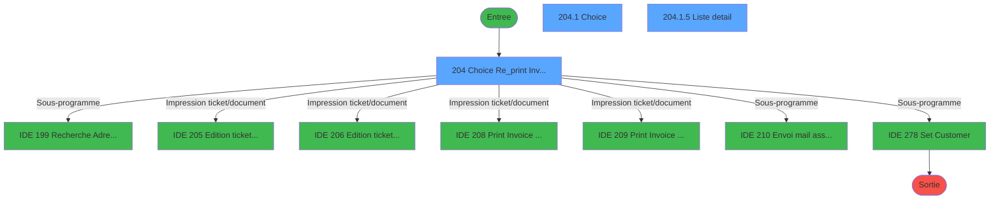
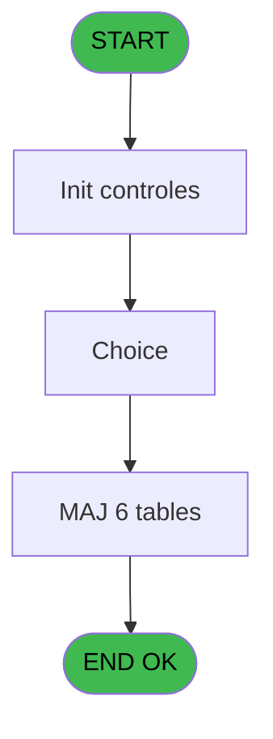
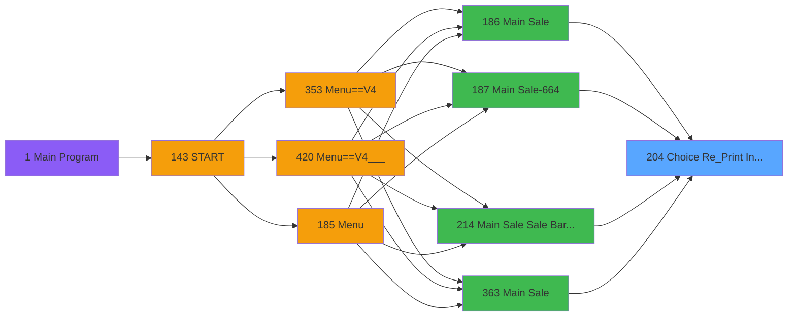
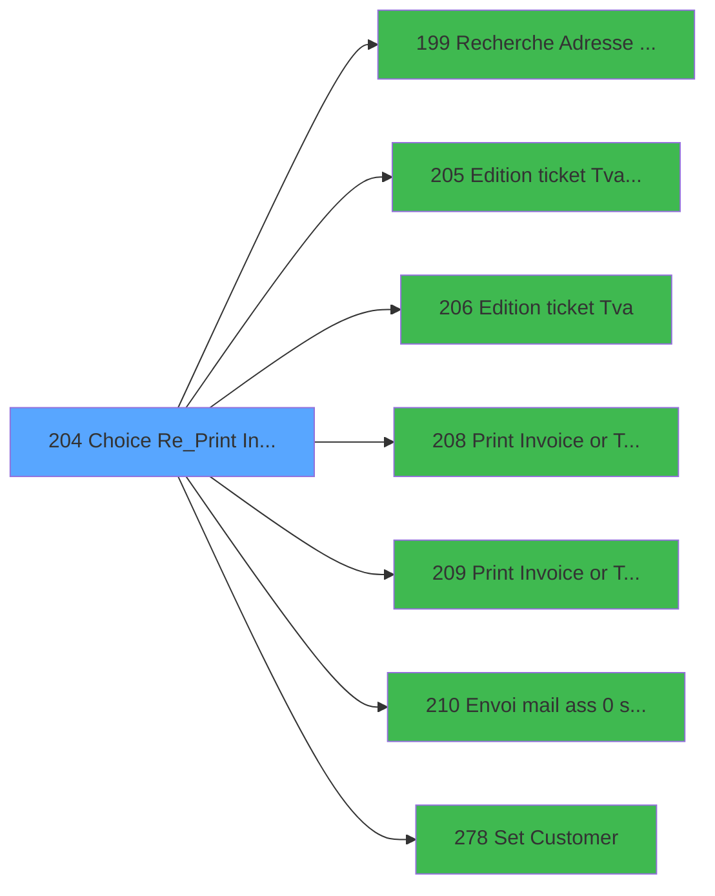

# PVE IDE 204 - Choice Re_Print Invoice

> **Analyse**: Phases 1-4 2026-02-03 18:53 -> 18:53 (14s) | Assemblage 18:53
> **Pipeline**: V7.2 Enrichi
> **Structure**: 4 onglets (Resume | Ecrans | Donnees | Connexions)

<!-- TAB:Resume -->

## 1. FICHE D'IDENTITE

| Attribut | Valeur |
|----------|--------|
| Projet | PVE |
| IDE Position | 204 |
| Nom Programme | Choice Re_Print Invoice |
| Fichier source | `Prg_204.xml` |
| Dossier IDE | Mobile |
| Taches | 17 (3 ecrans visibles) |
| Tables modifiees | 6 |
| Programmes appeles | 7 |

## 2. DESCRIPTION FONCTIONNELLE

**Choice Re_Print Invoice** assure la gestion complete de ce processus, accessible depuis [Main Sale ===V4 (IDE 0)](PVE-IDE-0.md), [Main Sale (IDE 186)](PVE-IDE-186.md), [Main Sale-664 (IDE 187)](PVE-IDE-187.md), [Main Sale Sale Bar Code (IDE 214)](PVE-IDE-214.md), [Main Sale (IDE 363)](PVE-IDE-363.md), [Main Sale-664 (IDE 364)](PVE-IDE-364.md), [Main Sale ===V4 (IDE 409)](PVE-IDE-409.md), [Main Sale ===V4 (IDE 415)](PVE-IDE-415.md), [Main Sale ===V4 Booking ACTUEL (IDE 417)](PVE-IDE-417.md), [Main Sale (IDE 440)](PVE-IDE-440.md).

Le flux de traitement s'organise en **8 blocs fonctionnels** :

- **Traitement** (7 taches) : traitements metier divers
- **Initialisation** (2 taches) : reinitialisation d'etats et de variables de travail
- **Creation** (2 taches) : insertion d'enregistrements en base (mouvements, prestations)
- **Impression** (2 taches) : generation de tickets et documents
- **Validation** (1 tache) : controles et verifications de coherence
- **Saisie** (1 tache) : ecrans de saisie utilisateur (formulaires, champs, donnees)
- **Calcul** (1 tache) : calculs de montants, stocks ou compteurs
- **Consultation** (1 tache) : ecrans de recherche, selection et consultation

**Donnees modifiees** : 6 tables en ecriture (pv_ownership, pv_package_composants, village_a_traiter, import_avertiss__an_val, cumul_mvt_stock_histo, Table_1501).

**Logique metier** : 1 regles identifiees couvrant conditions metier.

Detail : phases du traitement

#### Phase 1 : Impression (2 taches)

- **204** - Choice Re_print Invoice **[[ECRAN]](#ecran-t1)**
- **204.1.1** - Print Again Gener

Delegue a : [Edition ticket (Tva) LEX (IDE 205)](PVE-IDE-205.md), [Edition ticket (Tva) (IDE 206)](PVE-IDE-206.md), [Print Invoice or Ticket (IDE 208)](PVE-IDE-208.md), [Print Invoice or Ticket-664 (IDE 209)](PVE-IDE-209.md)

#### Phase 2 : Traitement (7 taches)

- **204.1** - Choice **[[ECRAN]](#ecran-t2)**
- **204.1.1.2.1** - Temp generation
- **204.1.2** - Trace Again
- **204.1.3** - Package line
- **204.1.5** - Liste detail **[[ECRAN]](#ecran-t10)**
- **204.1.8** - Check recu detail
- **204.2** - Liste des services

Delegue a : [Envoi mail ass 0 soucis (IDE 210)](PVE-IDE-210.md), [Set Customer (IDE 278)](PVE-IDE-278.md)

#### Phase 3 : Calcul (1 tache)

- **204.1.1.1** - Load temp compta

#### Phase 4 : Consultation (1 tache)

- **204.1.1.2** - Selection Filiations

Delegue a : [Recherche Adresse Mail (IDE 199)](PVE-IDE-199.md)

#### Phase 5 : Initialisation (2 taches)

- **204.1.4** - Raz Tempo
- **204.4** - Init adresse mail

#### Phase 6 : Creation (2 taches)

- **204.1.6** - CreationMail pour File Traitem
- **204.1.7** - CreationMail File Traitem 2

#### Phase 7 : Saisie (1 tache)

- **204.1.9** - Check vente 0 soucis **[[ECRAN]](#ecran-t14)**

#### Phase 8 : Validation (1 tache)

- **204.3** - Controle existance Ligne à aff

#### Tables impactees

| Table | Operations | Role metier |
|-------|-----------|-------------|
| pv_ownership | R/**W**/L (3 usages) |  |
| cumul_mvt_stock_histo | **W**/L (3 usages) | Articles et stock |
| village_a_traiter | **W**/L (2 usages) |  |
| Table_1501 | **W** (2 usages) |  |
| pv_package_composants | **W** (1 usages) |  |
| import_avertiss__an_val | **W** (1 usages) |  |

## 3. BLOCS FONCTIONNELS

### 3.1 Impression (2 taches)

Generation des documents et tickets.

---

#### 204 - Choice Re_print Invoice [[ECRAN]](#ecran-t1)

**Role** : Generation du document : Choice Re_print Invoice.
**Ecran** : 992 x 431 DLU (Type6) | [Voir mockup](#ecran-t1)
**Variables liees** : BA (v.Flag existe invoice file)
**Delegue a** : [Edition ticket (Tva) LEX (IDE 205)](PVE-IDE-205.md), [Edition ticket (Tva) (IDE 206)](PVE-IDE-206.md), [Print Invoice or Ticket (IDE 208)](PVE-IDE-208.md)

---

#### 204.1.1 - Print Again Gener

**Role** : Generation du document : Print Again Gener.
**Variables liees** : L (V Print Preview)
**Delegue a** : [Edition ticket (Tva) LEX (IDE 205)](PVE-IDE-205.md), [Edition ticket (Tva) (IDE 206)](PVE-IDE-206.md), [Print Invoice or Ticket (IDE 208)](PVE-IDE-208.md)

### 3.2 Traitement (7 taches)

Traitements internes.

---

#### 204.1 - Choice [[ECRAN]](#ecran-t2)

**Role** : Traitement : Choice.
**Ecran** : 992 x 331 DLU (MDI) | [Voir mockup](#ecran-t2)
**Delegue a** : [Envoi mail ass 0 soucis (IDE 210)](PVE-IDE-210.md), [Set Customer (IDE 278)](PVE-IDE-278.md)

---

#### 204.1.1.2.1 - Temp generation

**Role** : Traitement : Temp generation.
**Delegue a** : [Envoi mail ass 0 soucis (IDE 210)](PVE-IDE-210.md), [Set Customer (IDE 278)](PVE-IDE-278.md)

---

#### 204.1.2 - Trace Again

**Role** : Traitement : Trace Again.
**Delegue a** : [Envoi mail ass 0 soucis (IDE 210)](PVE-IDE-210.md), [Set Customer (IDE 278)](PVE-IDE-278.md)

---

#### 204.1.3 - Package line

**Role** : Traitement : Package line.
**Delegue a** : [Envoi mail ass 0 soucis (IDE 210)](PVE-IDE-210.md), [Set Customer (IDE 278)](PVE-IDE-278.md)

---

#### 204.1.5 - Liste detail [[ECRAN]](#ecran-t10)

**Role** : Traitement : Liste detail.
**Ecran** : 819 x 236 DLU | [Voir mockup](#ecran-t10)
**Variables liees** : C (v.Liste_Services), F (v.AfficheListe)
**Delegue a** : [Envoi mail ass 0 soucis (IDE 210)](PVE-IDE-210.md), [Set Customer (IDE 278)](PVE-IDE-278.md)

---

#### 204.1.8 - Check recu detail

**Role** : Traitement : Check recu detail.
**Delegue a** : [Envoi mail ass 0 soucis (IDE 210)](PVE-IDE-210.md), [Set Customer (IDE 278)](PVE-IDE-278.md)

---

#### 204.2 - Liste des services

**Role** : Traitement : Liste des services.
**Variables liees** : C (v.Liste_Services), D (v.Combo_Services), F (v.AfficheListe)
**Delegue a** : [Envoi mail ass 0 soucis (IDE 210)](PVE-IDE-210.md), [Set Customer (IDE 278)](PVE-IDE-278.md)

### 3.3 Calcul (1 tache)

Calculs metier : montants, stocks, compteurs.

---

#### 204.1.1.1 - Load temp compta

**Role** : Traitement : Load temp compta.

### 3.4 Consultation (1 tache)

Ecrans de recherche et consultation.

---

#### 204.1.1.2 - Selection Filiations

**Role** : Selection par l'operateur : Selection Filiations.
**Delegue a** : [Recherche Adresse Mail (IDE 199)](PVE-IDE-199.md)

### 3.5 Initialisation (2 taches)

Reinitialisation d'etats et variables de travail.

---

#### 204.1.4 - Raz Tempo

**Role** : Reinitialisation : Raz Tempo.

---

#### 204.4 - Init adresse mail

**Role** : Reinitialisation : Init adresse mail.
**Variables liees** : G (v.adresse mail ass-0-soucis), P (v.Adresse Mail), R (v.Envoi Email), Y (v.Mail), BD (v.mailadress ass 0 soucis MODIF)

### 3.6 Creation (2 taches)

Insertion de nouveaux enregistrements en base.

---

#### 204.1.6 - CreationMail pour File Traitem

**Role** : Creation d'enregistrement : CreationMail pour File Traitem.
**Variables liees** : BA (v.Flag existe invoice file)

---

#### 204.1.7 - CreationMail File Traitem 2

**Role** : Creation d'enregistrement : CreationMail File Traitem 2.
**Variables liees** : BA (v.Flag existe invoice file)

### 3.7 Saisie (1 tache)

L'operateur saisit les donnees de la transaction via 1 ecran (Check vente 0 soucis).

---

#### 204.1.9 - Check vente 0 soucis [[ECRAN]](#ecran-t14)

**Role** : Saisie des donnees : Check vente 0 soucis.
**Ecran** : 2080 x 0 DLU | [Voir mockup](#ecran-t14)
**Variables liees** : G (v.adresse mail ass-0-soucis), BC (v.ligne de vente ass 0 soucis?), BD (v.mailadress ass 0 soucis MODIF)

### 3.8 Validation (1 tache)

Controles de coherence : 1 tache verifie les donnees et conditions.

---

#### 204.3 - Controle existance Ligne à aff

**Role** : Verification : Controle existance Ligne à aff.
**Variables liees** : BC (v.ligne de vente ass 0 soucis?)

## 5. REGLES METIER

1 regles identifiees:

### Autres (1 regles)

#### [RM-001] Si VG41 alors 'v.Liste_Services [C]'FORM sinon 'P.i.CustomerPayer [B]'FORM)

| Element | Detail |
|---------|--------|
| **Condition** | `VG41` |
| **Si vrai** | 'v.Liste_Services [C]'FORM |
| **Si faux** | 'P.i.CustomerPayer [B]'FORM) |
| **Variables** | B (P.i.CustomerPayer), C (v.Liste_Services) |
| **Expression source** | Expression 5 : `IF(VG41,'v.Liste_Services [C]'FORM,'P.i.CustomerPayer [B]'FO` |
| **Exemple** | Si VG41 → 'v.Liste_Services [C]'FORM. Sinon → 'P.i.CustomerPayer [B]'FORM) |
| **Impact** | [204.1.5 - Liste detail](#t10) |

## 6. CONTEXTE

- **Appele par**: [Main Sale ===V4 (IDE 0)](PVE-IDE-0.md), [Main Sale (IDE 186)](PVE-IDE-186.md), [Main Sale-664 (IDE 187)](PVE-IDE-187.md), [Main Sale Sale Bar Code (IDE 214)](PVE-IDE-214.md), [Main Sale (IDE 363)](PVE-IDE-363.md), [Main Sale-664 (IDE 364)](PVE-IDE-364.md), [Main Sale ===V4 (IDE 409)](PVE-IDE-409.md), [Main Sale ===V4 (IDE 415)](PVE-IDE-415.md), [Main Sale ===V4 Booking ACTUEL (IDE 417)](PVE-IDE-417.md), [Main Sale (IDE 440)](PVE-IDE-440.md)
- **Appelle**: 7 programmes | **Tables**: 15 (W:6 R:5 L:10) | **Taches**: 17 | **Expressions**: 5

<!-- TAB:Ecrans -->

## 8. ECRANS

### 8.1 Forms visibles (3 / 17)

| # | Position | Tache | Nom | Type | Largeur | Hauteur | Bloc |
|---|----------|-------|-----|------|---------|---------|------|
| 1 | 204 | 204 | Choice Re_print Invoice | Type6 | 992 | 431 | Impression |
| 2 | 204.1 | 204.1 | Choice | MDI | 992 | 331 | Traitement |
| 3 | 204.1.5 | 204.1.5 | Liste detail | Type0 | 819 | 236 | Traitement |

### 8.2 Mockups Ecrans

---

#### 204 - Choice Re_print Invoice
**Tache** : [204](#t1) | **Type** : Type6 | **Dimensions** : 992 x 431 DLU
**Bloc** : Impression | **Titre IDE** : Choice Re_print Invoice

<!-- FORM-DATA:
{
    "width":  992,
    "vFactor":  8,
    "type":  "Type6",
    "hFactor":  4,
    "controls":  [
                     {
                         "x":  3,
                         "type":  "label",
                         "var":  "",
                         "y":  2,
                         "w":  989,
                         "fmt":  "",
                         "name":  "",
                         "h":  47,
                         "color":  "189",
                         "text":  "",
                         "parent":  null
                     },
                     {
                         "x":  26,
                         "type":  "label",
                         "var":  "",
                         "y":  17,
                         "w":  245,
                         "fmt":  "",
                         "name":  "",
                         "h":  17,
                         "color":  "186",
                         "text":  "Select the receipt you want to print",
                         "parent":  1
                     },
                     {
                         "x":  340,
                         "type":  "label",
                         "var":  "",
                         "y":  54,
                         "w":  313,
                         "fmt":  "",
                         "name":  "",
                         "h":  41,
                         "color":  "187",
                         "text":  "Filter by service",
                         "parent":  null
                     },
                     {
                         "x":  938,
                         "type":  "image",
                         "var":  "",
                         "y":  7,
                         "w":  49,
                         "fmt":  "",
                         "name":  "",
                         "h":  37,
                         "color":  "",
                         "text":  "",
                         "parent":  1
                     },
                     {
                         "x":  464,
                         "type":  "combobox",
                         "var":  "",
                         "y":  65,
                         "w":  142,
                         "fmt":  "",
                         "name":  "v.Combo_Services",
                         "h":  12,
                         "color":  "",
                         "text":  "ALL",
                         "parent":  null
                     },
                     {
                         "x":  0,
                         "type":  "subform",
                         "var":  "",
                         "y":  99,
                         "w":  992,
                         "fmt":  "",
                         "name":  "Choice Re_print Invoice",
                         "h":  331,
                         "color":  "",
                         "text":  "",
                         "parent":  null
                     }
                 ],
    "taskId":  "204",
    "height":  431
}
-->

<strong>Champs : 1 champs</strong>

| Pos (x,y) | Nom | Variable | Type |
|-----------|-----|----------|------|
| 464,65 | v.Combo_Services | - | combobox |

---

#### 204.1 - Choice
**Tache** : [204.1](#t2) | **Type** : MDI | **Dimensions** : 992 x 331 DLU
**Bloc** : Traitement | **Titre IDE** : Choice

<!-- FORM-DATA:
{
    "width":  992,
    "vFactor":  8,
    "type":  "MDI",
    "hFactor":  4,
    "controls":  [
                     {
                         "x":  566,
                         "type":  "label",
                         "var":  "",
                         "y":  260,
                         "w":  412,
                         "fmt":  "",
                         "name":  "",
                         "h":  37,
                         "color":  "186",
                         "text":  "",
                         "parent":  null
                     },
                     {
                         "x":  806,
                         "type":  "label",
                         "var":  "",
                         "y":  269,
                         "w":  45,
                         "fmt":  "",
                         "name":  "",
                         "h":  19,
                         "color":  "186",
                         "text":  "Copy :",
                         "parent":  1
                     },
                     {
                         "x":  7,
                         "type":  "table",
                         "var":  "",
                         "name":  "",
                         "titleH":  12,
                         "color":  "110",
                         "w":  499,
                         "y":  32,
                         "fmt":  "",
                         "parent":  null,
                         "text":  "",
                         "rowH":  24,
                         "h":  264,
                         "cols":  [
                                      {
                                          "title":  "Print Date",
                                          "layer":  1,
                                          "w":  68
                                      },
                                      {
                                          "title":  "Print Time",
                                          "layer":  2,
                                          "w":  60
                                      },
                                      {
                                          "title":  "# Receipt",
                                          "layer":  3,
                                          "w":  64
                                      },
                                      {
                                          "title":  "Service",
                                          "layer":  4,
                                          "w":  52
                                      },
                                      {
                                          "title":  "Custumer Name",
                                          "layer":  5,
                                          "w":  203
                                      },
                                      {
                                          "title":  "hpph_vente_en_mobilite",
                                          "layer":  6,
                                          "w":  48
                                      }
                                  ],
                         "rows":  6
                     },
                     {
                         "x":  0,
                         "type":  "label",
                         "var":  "",
                         "y":  299,
                         "w":  992,
                         "fmt":  "",
                         "name":  "",
                         "h":  32,
                         "color":  "6",
                         "text":  "",
                         "parent":  null
                     },
                     {
                         "x":  13,
                         "type":  "label",
                         "var":  "",
                         "y":  6,
                         "w":  76,
                         "fmt":  "",
                         "name":  "",
                         "h":  13,
                         "color":  "183",
                         "text":  "Receipt",
                         "parent":  null
                     },
                     {
                         "x":  566,
                         "type":  "label",
                         "var":  "",
                         "y":  6,
                         "w":  117,
                         "fmt":  "",
                         "name":  "",
                         "h":  13,
                         "color":  "183",
                         "text":  "Detail of Receipt",
                         "parent":  null
                     },
                     {
                         "x":  668,
                         "type":  "label",
                         "var":  "",
                         "y":  269,
                         "w":  73,
                         "fmt":  "",
                         "name":  "",
                         "h":  19,
                         "color":  "186",
                         "text":  "Preview",
                         "parent":  1
                     },
                     {
                         "x":  13,
                         "type":  "label",
                         "var":  "",
                         "y":  20,
                         "w":  56,
                         "fmt":  "",
                         "name":  "",
                         "h":  10,
                         "color":  "181",
                         "text":  "Print Date",
                         "parent":  null
                     },
                     {
                         "x":  84,
                         "type":  "label",
                         "var":  "",
                         "y":  20,
                         "w":  50,
                         "fmt":  "",
                         "name":  "",
                         "h":  10,
                         "color":  "181",
                         "text":  "Print Time",
                         "parent":  null
                     },
                     {
                         "x":  145,
                         "type":  "label",
                         "var":  "",
                         "y":  20,
                         "w":  52,
                         "fmt":  "",
                         "name":  "",
                         "h":  10,
                         "color":  "181",
                         "text":  "# Receipt",
                         "parent":  null
                     },
                     {
                         "x":  205,
                         "type":  "label",
                         "var":  "",
                         "y":  20,
                         "w":  46,
                         "fmt":  "",
                         "name":  "",
                         "h":  10,
                         "color":  "181",
                         "text":  "Service",
                         "parent":  null
                     },
                     {
                         "x":  257,
                         "type":  "label",
                         "var":  "",
                         "y":  20,
                         "w":  56,
                         "fmt":  "",
                         "name":  "",
                         "h":  10,
                         "color":  "181",
                         "text":  "Customer",
                         "parent":  null
                     },
                     {
                         "x":  461,
                         "type":  "label",
                         "var":  "",
                         "y":  19,
                         "w":  46,
                         "fmt":  "",
                         "name":  "",
                         "h":  10,
                         "color":  "181",
                         "text":  "Mobility",
                         "parent":  null
                     },
                     {
                         "x":  13,
                         "type":  "edit",
                         "var":  "",
                         "y":  35,
                         "w":  56,
                         "fmt":  "##/##/##Z",
                         "name":  "CTRL_001",
                         "h":  20,
                         "color":  "110",
                         "text":  "",
                         "parent":  4
                     },
                     {
                         "x":  82,
                         "type":  "edit",
                         "var":  "",
                         "y":  35,
                         "w":  50,
                         "fmt":  "HH:MMZ",
                         "name":  "CTRL_002",
                         "h":  20,
                         "color":  "110",
                         "text":  "",
                         "parent":  4
                     },
                     {
                         "x":  635,
                         "type":  "checkbox",
                         "var":  "",
                         "y":  269,
                         "w":  26,
                         "fmt":  "",
                         "name":  "Print Preview",
                         "h":  19,
                         "color":  "186",
                         "text":  "",
                         "parent":  1
                     },
                     {
                         "x":  853,
                         "type":  "edit",
                         "var":  "",
                         "y":  271,
                         "w":  21,
                         "fmt":  "4",
                         "name":  "Copy",
                         "h":  16,
                         "color":  "186",
                         "text":  "",
                         "parent":  1
                     },
                     {
                         "x":  507,
                         "type":  "button",
                         "var":  "",
                         "y":  32,
                         "w":  48,
                         "fmt":  "ñ",
                         "name":  "",
                         "h":  132,
                         "color":  "",
                         "text":  "",
                         "parent":  null
                     },
                     {
                         "x":  507,
                         "type":  "button",
                         "var":  "",
                         "y":  164,
                         "w":  48,
                         "fmt":  "ò",
                         "name":  "",
                         "h":  133,
                         "color":  "",
                         "text":  "",
                         "parent":  null
                     },
                     {
                         "x":  660,
                         "type":  "button",
                         "var":  "",
                         "y":  303,
                         "w":  100,
                         "fmt":  "\u0026Cancel",
                         "name":  "BTEXIT",
                         "h":  24,
                         "color":  "",
                         "text":  "",
                         "parent":  20
                     },
                     {
                         "x":  884,
                         "type":  "button",
                         "var":  "",
                         "y":  303,
                         "w":  100,
                         "fmt":  "\u0026Print",
                         "name":  "BTPRINT",
                         "h":  24,
                         "color":  "",
                         "text":  "",
                         "parent":  20
                     },
                     {
                         "x":  673,
                         "type":  "edit",
                         "var":  "",
                         "y":  6,
                         "w":  44,
                         "fmt":  "6",
                         "name":  "",
                         "h":  13,
                         "color":  "183",
                         "text":  "",
                         "parent":  null
                     },
                     {
                         "x":  143,
                         "type":  "edit",
                         "var":  "",
                         "y":  35,
                         "w":  52,
                         "fmt":  "6Z",
                         "name":  "hpph_chrono",
                         "h":  20,
                         "color":  "110",
                         "text":  "",
                         "parent":  4
                     },
                     {
                         "x":  203,
                         "type":  "edit",
                         "var":  "",
                         "y":  35,
                         "w":  46,
                         "fmt":  "",
                         "name":  "pv_service",
                         "h":  20,
                         "color":  "110",
                         "text":  "",
                         "parent":  4
                     },
                     {
                         "x":  566,
                         "type":  "subform",
                         "var":  "",
                         "y":  22,
                         "w":  412,
                         "fmt":  "",
                         "name":  "DETAIL",
                         "h":  238,
                         "color":  "",
                         "text":  "",
                         "parent":  null
                     },
                     {
                         "x":  255,
                         "type":  "edit",
                         "var":  "",
                         "y":  35,
                         "w":  197,
                         "fmt":  "30",
                         "name":  "gm_nom",
                         "h":  20,
                         "color":  "110",
                         "text":  "",
                         "parent":  4
                     },
                     {
                         "x":  458,
                         "type":  "edit",
                         "var":  "",
                         "y":  35,
                         "w":  44,
                         "fmt":  "3",
                         "name":  "hpph_vente_en_mobilite",
                         "h":  20,
                         "color":  "110",
                         "text":  "",
                         "parent":  4
                     },
                     {
                         "x":  772,
                         "type":  "button",
                         "var":  "",
                         "y":  303,
                         "w":  100,
                         "fmt":  "\u0026Email",
                         "name":  "BTEMAIL",
                         "h":  24,
                         "color":  "",
                         "text":  "",
                         "parent":  20
                     },
                     {
                         "x":  9,
                         "type":  "button",
                         "var":  "",
                         "y":  303,
                         "w":  118,
                         "fmt":  "\u0026View Receipt",
                         "name":  "Recept_detail",
                         "h":  24,
                         "color":  "",
                         "text":  "",
                         "parent":  20
                     },
                     {
                         "x":  9,
                         "type":  "button",
                         "var":  "",
                         "y":  303,
                         "w":  189,
                         "fmt":  "\u0026Télécharger la facture",
                         "name":  "Chargement_Receipt",
                         "h":  24,
                         "color":  "",
                         "text":  "",
                         "parent":  null
                     },
                     {
                         "x":  217,
                         "type":  "button",
                         "var":  "",
                         "y":  303,
                         "w":  189,
                         "fmt":  "\u0026Resend mail 0 soucis",
                         "name":  "Resend mail 0 soucis",
                         "h":  24,
                         "color":  "",
                         "text":  "",
                         "parent":  20
                     },
                     {
                         "x":  413,
                         "type":  "combobox",
                         "var":  "",
                         "y":  307,
                         "w":  235,
                         "fmt":  "",
                         "name":  "v.mailadress ass 0 soucis MODIF",
                         "h":  12,
                         "color":  "",
                         "text":  "",
                         "parent":  null
                     }
                 ],
    "taskId":  "204.1",
    "height":  331
}
-->

<strong>Champs : 10 champs</strong>

| Pos (x,y) | Nom | Variable | Type |
|-----------|-----|----------|------|
| 13,35 | CTRL_001 | - | edit |
| 82,35 | CTRL_002 | - | edit |
| 635,269 | Print Preview | - | checkbox |
| 853,271 | Copy | - | edit |
| 673,6 | 6 | - | edit |
| 143,35 | hpph_chrono | - | edit |
| 203,35 | pv_service | - | edit |
| 255,35 | gm_nom | - | edit |
| 458,35 | hpph_vente_en_mobilite | - | edit |
| 413,307 | v.mailadress ass 0 soucis MODIF | - | combobox |

<strong>Boutons : 8 boutons</strong>

| Bouton | Pos (x,y) | Action |
|--------|-----------|--------|
| ñ | 507,32 | Bouton fonctionnel |
| ò | 507,164 | Bouton fonctionnel |
| Cancel | 660,303 | Annule et retour au menu |
| Print | 884,303 | Appel [Print Invoice or Ticket (IDE 208)](PVE-IDE-208.md) |
| Email | 772,303 | Bouton fonctionnel |
| View Receipt | 9,303 | Bouton fonctionnel |
| Télécharger la facture | 9,303 | Bouton fonctionnel |
| Resend mail 0 soucis | 217,303 | Bouton fonctionnel |

---

#### 204.1.5 - Liste detail
**Tache** : [204.1.5](#t10) | **Type** : Type0 | **Dimensions** : 819 x 236 DLU
**Bloc** : Traitement | **Titre IDE** : Liste detail

<!-- FORM-DATA:
{
    "width":  819,
    "vFactor":  8,
    "type":  "Type0",
    "hFactor":  8,
    "controls":  [
                     {
                         "x":  10,
                         "type":  "label",
                         "var":  "",
                         "y":  0,
                         "w":  122,
                         "fmt":  "",
                         "name":  "",
                         "h":  10,
                         "color":  "181",
                         "text":  "Description",
                         "parent":  null
                     },
                     {
                         "x":  403,
                         "type":  "label",
                         "var":  "",
                         "y":  0,
                         "w":  143,
                         "fmt":  "",
                         "name":  "",
                         "h":  10,
                         "color":  "181",
                         "text":  "Date Out",
                         "parent":  null
                     },
                     {
                         "x":  560,
                         "type":  "label",
                         "var":  "",
                         "y":  0,
                         "w":  119,
                         "fmt":  "",
                         "name":  "",
                         "h":  10,
                         "color":  "181",
                         "text":  "Amount",
                         "parent":  null
                     },
                     {
                         "x":  4,
                         "type":  "table",
                         "var":  "",
                         "name":  "",
                         "titleH":  12,
                         "color":  "110",
                         "w":  714,
                         "y":  12,
                         "fmt":  "",
                         "parent":  null,
                         "text":  "",
                         "rowH":  24,
                         "h":  216,
                         "cols":  [
                                      {
                                          "title":  "description",
                                          "layer":  1,
                                          "w":  416
                                      },
                                      {
                                          "title":  "Date out",
                                          "layer":  2,
                                          "w":  160
                                      },
                                      {
                                          "title":  "Amont",
                                          "layer":  3,
                                          "w":  132
                                      }
                                  ],
                         "rows":  3
                     },
                     {
                         "x":  10,
                         "type":  "edit",
                         "var":  "",
                         "y":  15,
                         "w":  408,
                         "fmt":  "30",
                         "name":  "description",
                         "h":  18,
                         "color":  "110",
                         "text":  "",
                         "parent":  4
                     },
                     {
                         "x":  429,
                         "type":  "edit",
                         "var":  "",
                         "y":  15,
                         "w":  141,
                         "fmt":  "##/##/####Z",
                         "name":  "date_create",
                         "h":  18,
                         "color":  "110",
                         "text":  "",
                         "parent":  4
                     },
                     {
                         "x":  589,
                         "type":  "edit",
                         "var":  "",
                         "y":  15,
                         "w":  119,
                         "fmt":  "N10.2CZ",
                         "name":  "hppl_amount",
                         "h":  18,
                         "color":  "110",
                         "text":  "",
                         "parent":  4
                     },
                     {
                         "x":  720,
                         "type":  "button",
                         "var":  "",
                         "y":  12,
                         "w":  96,
                         "fmt":  "ñ",
                         "name":  "",
                         "h":  108,
                         "color":  "",
                         "text":  "",
                         "parent":  null
                     },
                     {
                         "x":  718,
                         "type":  "button",
                         "var":  "",
                         "y":  120,
                         "w":  96,
                         "fmt":  "ò",
                         "name":  "",
                         "h":  109,
                         "color":  "",
                         "text":  "",
                         "parent":  null
                     }
                 ],
    "taskId":  "204.1.5",
    "height":  236
}
-->

<strong>Champs : 3 champs</strong>

| Pos (x,y) | Nom | Variable | Type |
|-----------|-----|----------|------|
| 10,15 | description | - | edit |
| 429,15 | date_create | - | edit |
| 589,15 | hppl_amount | - | edit |

<strong>Boutons : 2 boutons</strong>

| Bouton | Pos (x,y) | Action |
|--------|-----------|--------|
| ñ | 720,12 | Bouton fonctionnel |
| ò | 718,120 | Bouton fonctionnel |

## 9. NAVIGATION

### 9.1 Enchainement des ecrans

**Detail par enchainement :**

| Depuis | Action | Vers | Retour |
|--------|--------|------|--------|
| Choice Re_print Invoice | Sous-programme | [Recherche Adresse Mail (IDE 199)](PVE-IDE-199.md) | Retour ecran |
| Choice Re_print Invoice | Impression ticket/document | [Edition ticket (Tva) LEX (IDE 205)](PVE-IDE-205.md) | Retour ecran |
| Choice Re_print Invoice | Impression ticket/document | [Edition ticket (Tva) (IDE 206)](PVE-IDE-206.md) | Retour ecran |
| Choice Re_print Invoice | Impression ticket/document | [Print Invoice or Ticket (IDE 208)](PVE-IDE-208.md) | Retour ecran |
| Choice Re_print Invoice | Impression ticket/document | [Print Invoice or Ticket-664 (IDE 209)](PVE-IDE-209.md) | Retour ecran |
| Choice Re_print Invoice | Sous-programme | [Envoi mail ass 0 soucis (IDE 210)](PVE-IDE-210.md) | Retour ecran |
| Choice Re_print Invoice | Sous-programme | [Set Customer (IDE 278)](PVE-IDE-278.md) | Retour ecran |

### 9.3 Structure hierarchique (17 taches)

| Position | Tache | Type | Dimensions | Bloc |
|----------|-------|------|------------|------|
| **204.1** | [**Choice Re_print Invoice** (204)](#t1) [mockup](#ecran-t1) | Type6 | 992x431 | Impression |
| 204.1.1 | [Print Again Gener (204.1.1)](#t3) | MDI | - | |
| **204.2** | [**Choice** (204.1)](#t2) [mockup](#ecran-t2) | MDI | 992x331 | Traitement |
| 204.2.1 | [Temp generation (204.1.1.2.1)](#t6) | MDI | - | |
| 204.2.2 | [Trace Again (204.1.2)](#t7) | MDI | - | |
| 204.2.3 | [Package line (204.1.3)](#t8) | MDI | - | |
| 204.2.4 | [Liste detail (204.1.5)](#t10) [mockup](#ecran-t10) | - | 819x236 | |
| 204.2.5 | [Check recu detail (204.1.8)](#t13) | - | - | |
| 204.2.6 | [Liste des services (204.2)](#t15) | - | - | |
| **204.3** | [**Load temp compta** (204.1.1.1)](#t4) | MDI | - | Calcul |
| **204.4** | [**Selection Filiations** (204.1.1.2)](#t5) | MDI | - | Consultation |
| **204.5** | [**Raz Tempo** (204.1.4)](#t9) | MDI | - | Initialisation |
| 204.5.1 | [Init adresse mail (204.4)](#t17) | - | - | |
| **204.6** | [**CreationMail pour File Traitem** (204.1.6)](#t11) | - | - | Creation |
| 204.6.1 | [CreationMail File Traitem 2 (204.1.7)](#t12) | - | - | |
| **204.7** | [**Check vente 0 soucis** (204.1.9)](#t14) [mockup](#ecran-t14) | - | 2080x0 | Saisie |
| **204.8** | [**Controle existance Ligne à aff** (204.3)](#t16) | - | - | Validation |

### 9.4 Algorigramme

> **Legende**: Vert = START/END OK | Rouge = END KO | Bleu = Decisions
> *Algorigramme auto-genere. Utiliser `/algorigramme` pour une synthese metier detaillee.*

<!-- TAB:Donnees -->

## 10. TABLES

### Tables utilisees (15)

| ID | Nom | Description | Type | R | W | L | Usages |
|----|-----|-------------|------|---|---|---|--------|
| 67 | tables___________tab |  | DB | R |   |   | 2 |
| 263 | vente | Donnees de ventes | DB |   |   | L | 1 |
| 285 | email |  | DB | R |   |   | 1 |
| 382 | pv_discount_reasons |  | DB | R |   | L | 4 |
| 395 | pv_ownership |  | DB | R | **W** | L | 3 |
| 396 | pv_cust_packages |  | DB | R |   | L | 4 |
| 397 | pv_package_composants |  | DB |   | **W** |   | 1 |
| 400 | pv_cust_rentals |  | DB |   |   | L | 4 |
| 404 | pv_sellers_by_week |  | DB |   |   | L | 1 |
| 419 | realise_articles_caution | Articles et stock | DB |   |   | L | 1 |
| 529 | village_a_traiter |  | TMP |   | **W** | L | 2 |
| 531 | import_avertiss__an_val |  | DB |   | **W** |   | 1 |
| 533 | cumul_mvt_stock_histo | Articles et stock | TMP |   | **W** | L | 3 |
| 765 | tranche_age |  | DB |   |   | L | 1 |
| 1501 | Table_1501 |  | MEM |   | **W** |   | 2 |

### Colonnes par table (8 / 10 tables avec colonnes identifiees)

Table 67 - tables___________tab (R) - 2 usages

| Lettre | Variable | Acces | Type |
|--------|----------|-------|------|
| A | p.Service | R | Alpha |
| B | v.Vente T+1? | R | Logical |
| C | V.package_id_T+1 existe? | R | Logical |
| D | v.Vente T+2? | R | Logical |
| E | V.package_id_T+2 existe? | R | Logical |
| F | v.ven_Moyen_de_paiement | R | Unicode |
| G | v.ven_id_transaction Axis | R | Unicode |
| H | v.ven_id_acceptation | R | Unicode |
| I | v.ven_token_id | R | Unicode |
| J | v.ven_transaction_id | R | Unicode |
| K | B Mobiles Sales | R | Alpha |
| L | V Print Preview | R | Logical |
| M | V Copy | R | Numeric |
| N | V Reedtion Mobilité | R | Logical |
| O | V xcustId Reedtion Mobilite | R | Numeric |
| P | v.Adresse Mail | R | Alpha |
| Q | v.Langue | R | Alpha |
| R | v.Envoi Email | R | Logical |
| S | v.RetourMessage | R | Numeric |
| T | v.Decimal | R | Numeric |
| U | v.Nom_FichierPDF | R | Alpha |
| V | v.Chemin | R | Alpha |
| W | v.Cancel | R | Logical |
| X | v.NomVendeurSurFacture | R | Alpha |
| Y | v.Mail | R | Logical |
| Z | bt.Cancel | R | Alpha |
| BA | v.Flag existe invoice file | R | Logical |
| BB | v.Fichier receipt | R | Alpha |
| BC | v.ligne de vente ass 0 soucis? | R | Logical |
| BD | v.mailadress ass 0 soucis MODIF | R | Unicode |
| BE | v.erreur message email | R | Alpha |
| BF | CHG_REASON_v.mailadress ass 0 | R | Numeric |
| BG | CHG_PRV_v.mailadress ass 0 sou | R | Unicode |

Table 285 - email (R) - 1 usages

| Lettre | Variable | Acces | Type |
|--------|----------|-------|------|
| BE | v.erreur message email | R | Alpha |
| R | v.Envoi Email | R | Logical |

Table 382 - pv_discount_reasons (R/L) - 4 usages

| Lettre | Variable | Acces | Type |
|--------|----------|-------|------|
| A | -------------package OUT | R | Alpha |
| B | -------------rentals OUT | R | Alpha |
| C | -------------package IN | R | Alpha |
| D | -------------rentals IN | R | Alpha |
| E | Libellé | R | Alpha |
| F | StartDate | R | Date |
| G | EndDate | R | Date |
| H | Days | R | Numeric |

Table 395 - pv_ownership (R/**W**/L) - 3 usages

| Lettre | Variable | Acces | Type |
|--------|----------|-------|------|
| A | P.I existe invoice file | W | Logical |
| B | P.I. Action | W | Alpha |
| C | v.File PDF | W | Alpha |
| D | Retour Blob2Pdf | W | Logical |

Table 396 - pv_cust_packages (R/L) - 4 usages

| Lettre | Variable | Acces | Type |
|--------|----------|-------|------|
| B | P.i.CustomerPayer | R | Numeric |
| O | V xcustId Reedtion Mobilite | R | Numeric |

Table 397 - pv_package_composants (**W**) - 1 usages

| Lettre | Variable | Acces | Type |
|--------|----------|-------|------|
| A | -------------package OUT | W | Alpha |
| C | V.package_id_T+1 existe? | W | Logical |
| E | V.package_id_T+2 existe? | W | Logical |

Table 529 - village_a_traiter (**W**/L) - 2 usages

*Table utilisee uniquement en Link ou aucune colonne Real identifiee dans le DataView.*

Table 531 - import_avertiss__an_val (**W**) - 1 usages

*Table utilisee uniquement en Link ou aucune colonne Real identifiee dans le DataView.*

Table 533 - cumul_mvt_stock_histo (**W**/L) - 3 usages

*Table utilisee uniquement en Link ou aucune colonne Real identifiee dans le DataView.*

Table 1501 - Table_1501 (**W**) - 2 usages

*Table utilisee uniquement en Link ou aucune colonne Real identifiee dans le DataView.*

## 11. VARIABLES

### 11.1 Parametres entrants (2)

Variables recues du programme appelant ([Main Sale ===V4 (IDE 0)](PVE-IDE-0.md)).

| Lettre | Nom | Type | Usage dans |
|--------|-----|------|-----------|
| A | P.i.Service | Alpha | 1x parametre entrant |
| B | P.i.CustomerPayer | Numeric | 1x parametre entrant |

### 11.2 Variables de session (27)

Variables persistantes pendant toute la session.

| Lettre | Nom | Type | Usage dans |
|--------|-----|------|-----------|
| C | v.Liste_Services | Alpha | 2x session |
| D | v.Combo_Services | Alpha | - |
| E | v.Fin | Logical | 1x session |
| F | v.AfficheListe | Logical | - |
| G | v.adresse mail ass-0-soucis | Unicode | - |
| H | v.ven_id_acceptation | Unicode | - |
| I | v.ven_token_id | Unicode | - |
| J | v.ven_transaction_id | Unicode | - |
| L | V Print Preview | Logical | - |
| M | V Copy | Numeric | - |
| N | V Reedtion Mobilité | Logical | - |
| O | V xcustId Reedtion Mobilite | Numeric | - |
| P | v.Adresse Mail | Alpha | - |
| Q | v.Langue | Alpha | - |
| R | v.Envoi Email | Logical | - |
| S | v.RetourMessage | Numeric | - |
| T | v.Decimal | Numeric | - |
| U | v.Nom_FichierPDF | Alpha | - |
| V | v.Chemin | Alpha | - |
| W | v.Cancel | Logical | - |
| X | v.NomVendeurSurFacture | Alpha | - |
| Y | v.Mail | Logical | - |
| BA | v.Flag existe invoice file | Logical | - |
| BB | v.Fichier receipt | Alpha | - |
| BC | v.ligne de vente ass 0 soucis? | Logical | - |
| BD | v.mailadress ass 0 soucis MODIF | Unicode | - |
| BE | v.erreur message email | Alpha | - |

### 11.3 Autres (4)

Variables diverses.

| Lettre | Nom | Type | Usage dans |
|--------|-----|------|-----------|
| K | B Mobiles Sales | Alpha | - |
| Z | bt.Cancel | Alpha | - |
| BF | CHG_REASON_v.mailadress ass 0 | Numeric | - |
| BG | CHG_PRV_v.mailadress ass 0 sou | Unicode | - |

Toutes les 33 variables (liste complete)

| Cat | Lettre | Nom Variable | Type |
|-----|--------|--------------|------|
| P0 | **A** | P.i.Service | Alpha |
| P0 | **B** | P.i.CustomerPayer | Numeric |
| V. | **C** | v.Liste_Services | Alpha |
| V. | **D** | v.Combo_Services | Alpha |
| V. | **E** | v.Fin | Logical |
| V. | **F** | v.AfficheListe | Logical |
| V. | **G** | v.adresse mail ass-0-soucis | Unicode |
| V. | **H** | v.ven_id_acceptation | Unicode |
| V. | **I** | v.ven_token_id | Unicode |
| V. | **J** | v.ven_transaction_id | Unicode |
| V. | **L** | V Print Preview | Logical |
| V. | **M** | V Copy | Numeric |
| V. | **N** | V Reedtion Mobilité | Logical |
| V. | **O** | V xcustId Reedtion Mobilite | Numeric |
| V. | **P** | v.Adresse Mail | Alpha |
| V. | **Q** | v.Langue | Alpha |
| V. | **R** | v.Envoi Email | Logical |
| V. | **S** | v.RetourMessage | Numeric |
| V. | **T** | v.Decimal | Numeric |
| V. | **U** | v.Nom_FichierPDF | Alpha |
| V. | **V** | v.Chemin | Alpha |
| V. | **W** | v.Cancel | Logical |
| V. | **X** | v.NomVendeurSurFacture | Alpha |
| V. | **Y** | v.Mail | Logical |
| V. | **BA** | v.Flag existe invoice file | Logical |
| V. | **BB** | v.Fichier receipt | Alpha |
| V. | **BC** | v.ligne de vente ass 0 soucis? | Logical |
| V. | **BD** | v.mailadress ass 0 soucis MODIF | Unicode |
| V. | **BE** | v.erreur message email | Alpha |
| Autre | **K** | B Mobiles Sales | Alpha |
| Autre | **Z** | bt.Cancel | Alpha |
| Autre | **BF** | CHG_REASON_v.mailadress ass 0 | Numeric |
| Autre | **BG** | CHG_PRV_v.mailadress ass 0 sou | Unicode |

## 12. EXPRESSIONS

**5 / 5 expressions decodees (100%)**

### 12.1 Repartition par type

| Type | Expressions | Regles |
|------|-------------|--------|
| CONDITION | 1 | 5 |
| OTHER | 2 | 0 |
| CAST_LOGIQUE | 1 | 0 |
| STRING | 1 | 0 |

### 12.2 Expressions cles par type

#### CONDITION (1 expressions)

| Type | IDE | Expression | Regle |
|------|-----|------------|-------|
| CONDITION | 5 | `IF(VG41,'v.Liste_Services [C]'FORM,'P.i.CustomerPayer [B]'FORM)` | [RM-001](#rm-RM-001) |

#### OTHER (2 expressions)

| Type | IDE | Expression | Regle |
|------|-----|------------|-------|
| OTHER | 3 | `v.Fin [E]` | - |
| OTHER | 1 | `P.i.Service [A]` | - |

#### CAST_LOGIQUE (1 expressions)

| Type | IDE | Expression | Regle |
|------|-----|------------|-------|
| CAST_LOGIQUE | 4 | `'TRUE'LOG` | - |

#### STRING (1 expressions)

| Type | IDE | Expression | Regle |
|------|-----|------------|-------|
| STRING | 2 | `Trim(v.Liste_Services [C])` | - |

<!-- TAB:Connexions -->

## 13. GRAPHE D'APPELS

### 13.1 Chaine depuis Main (Callers)

Main -> ... -> [Main Sale ===V4 (IDE 0)](PVE-IDE-0.md) -> **Choice Re_Print Invoice (IDE 204)**

Main -> ... -> [Main Sale (IDE 186)](PVE-IDE-186.md) -> **Choice Re_Print Invoice (IDE 204)**

Main -> ... -> [Main Sale-664 (IDE 187)](PVE-IDE-187.md) -> **Choice Re_Print Invoice (IDE 204)**

Main -> ... -> [Main Sale Sale Bar Code (IDE 214)](PVE-IDE-214.md) -> **Choice Re_Print Invoice (IDE 204)**

Main -> ... -> [Main Sale (IDE 363)](PVE-IDE-363.md) -> **Choice Re_Print Invoice (IDE 204)**

Main -> ... -> [Main Sale-664 (IDE 364)](PVE-IDE-364.md) -> **Choice Re_Print Invoice (IDE 204)**

Main -> ... -> [Main Sale ===V4 (IDE 409)](PVE-IDE-409.md) -> **Choice Re_Print Invoice (IDE 204)**

Main -> ... -> [Main Sale ===V4 (IDE 415)](PVE-IDE-415.md) -> **Choice Re_Print Invoice (IDE 204)**

Main -> ... -> [Main Sale ===V4 Booking ACTUEL (IDE 417)](PVE-IDE-417.md) -> **Choice Re_Print Invoice (IDE 204)**

Main -> ... -> [Main Sale (IDE 440)](PVE-IDE-440.md) -> **Choice Re_Print Invoice (IDE 204)**

### 13.2 Callers

| IDE | Nom Programme | Nb Appels |
|-----|---------------|-----------|
| [0](PVE-IDE-0.md) | Main Sale ===V4 | 1 |
| [186](PVE-IDE-186.md) | Main Sale | 1 |
| [187](PVE-IDE-187.md) | Main Sale-664 | 1 |
| [214](PVE-IDE-214.md) | Main Sale Sale Bar Code | 1 |
| [363](PVE-IDE-363.md) | Main Sale | 1 |
| [364](PVE-IDE-364.md) | Main Sale-664 | 1 |
| [409](PVE-IDE-409.md) | Main Sale ===V4 | 1 |
| [415](PVE-IDE-415.md) | Main Sale ===V4 | 1 |
| [417](PVE-IDE-417.md) | Main Sale ===V4 Booking ACTUEL | 1 |
| [440](PVE-IDE-440.md) | Main Sale | 1 |

### 13.3 Callees (programmes appeles)

### 13.4 Detail Callees avec contexte

| IDE | Nom Programme | Appels | Contexte |
|-----|---------------|--------|----------|
| [199](PVE-IDE-199.md) | Recherche Adresse Mail | 1 | Sous-programme |
| [205](PVE-IDE-205.md) | Edition ticket (Tva) LEX | 1 | Impression ticket/document |
| [206](PVE-IDE-206.md) | Edition ticket (Tva) | 1 | Impression ticket/document |
| [208](PVE-IDE-208.md) | Print Invoice or Ticket | 1 | Impression ticket/document |
| [209](PVE-IDE-209.md) | Print Invoice or Ticket-664 | 1 | Impression ticket/document |
| [210](PVE-IDE-210.md) | Envoi mail ass 0 soucis | 1 | Sous-programme |
| [278](PVE-IDE-278.md) | Set Customer | 1 | Sous-programme |

## 14. RECOMMANDATIONS MIGRATION

### 14.1 Profil du programme

| Metrique | Valeur | Impact migration |
|----------|--------|-----------------|
| Lignes de logique | 587 | Programme volumineux |
| Expressions | 5 | Peu de logique |
| Tables WRITE | 6 | Fort impact donnees |
| Sous-programmes | 7 | Dependances moderees |
| Ecrans visibles | 3 | Quelques ecrans |
| Code desactive | 0.2% (1 / 587) | Code sain |
| Regles metier | 1 | Quelques regles a preserver |

### 14.2 Plan de migration par bloc

#### Impression (2 taches: 1 ecran, 1 traitement)

- **Strategie** : Templates HTML -> PDF via wkhtmltopdf ou Puppeteer.
- `PrintService` injectable avec choix imprimante

#### Traitement (7 taches: 2 ecrans, 5 traitements)

- **Strategie** : Orchestrateur avec 2 ecrans (Razor/React) et 5 traitements backend (services).
- Les ecrans deviennent des composants UI, les traitements invisibles deviennent des services injectables.
- 7 sous-programme(s) a migrer ou a reutiliser depuis les services existants.
- Decomposer les taches en services unitaires testables.

#### Calcul (1 tache: 0 ecran, 1 traitement)

- **Strategie** : Services de calcul purs (Domain Services).
- Migrer la logique de calcul (stock, compteurs, montants)

#### Consultation (1 tache: 0 ecran, 1 traitement)

- **Strategie** : Composants de recherche/selection en modales.

#### Initialisation (2 taches: 0 ecran, 2 traitements)

- **Strategie** : Constructeur/methode `InitAsync()` dans l'orchestrateur.

#### Creation (2 taches: 0 ecran, 2 traitements)

- **Strategie** : Repository pattern avec Entity Framework Core.
- Insertion via `IRepository<T>.CreateAsync()`

#### Saisie (1 tache: 1 ecran, 0 traitement)

- **Strategie** : Formulaire React/Blazor avec validation Zod/FluentValidation.
- Reproduire 1 ecran : Check vente 0 soucis
- Validation temps reel cote client + serveur

#### Validation (1 tache: 0 ecran, 1 traitement)

- **Strategie** : FluentValidation avec validators specifiques.
- Chaque tache de validation -> un validator injectable

### 14.3 Dependances critiques

| Dependance | Type | Appels | Impact |
|------------|------|--------|--------|
| pv_ownership | Table WRITE (Database) | 1x | Schema + repository |
| pv_package_composants | Table WRITE (Database) | 1x | Schema + repository |
| village_a_traiter | Table WRITE (Temp) | 1x | Schema + repository |
| import_avertiss__an_val | Table WRITE (Database) | 1x | Schema + repository |
| cumul_mvt_stock_histo | Table WRITE (Temp) | 1x | Schema + repository |
| Table_1501 | Table WRITE (Memory) | 2x | Schema + repository |
| [Print Invoice or Ticket-664 (IDE 209)](PVE-IDE-209.md) | Sous-programme | 1x | Normale - Impression ticket/document |
| [Envoi mail ass 0 soucis (IDE 210)](PVE-IDE-210.md) | Sous-programme | 1x | Normale - Sous-programme |
| [Set Customer (IDE 278)](PVE-IDE-278.md) | Sous-programme | 1x | Normale - Sous-programme |
| [Print Invoice or Ticket (IDE 208)](PVE-IDE-208.md) | Sous-programme | 1x | Normale - Impression ticket/document |
| [Recherche Adresse Mail (IDE 199)](PVE-IDE-199.md) | Sous-programme | 1x | Normale - Sous-programme |
| [Edition ticket (Tva) LEX (IDE 205)](PVE-IDE-205.md) | Sous-programme | 1x | Normale - Impression ticket/document |
| [Edition ticket (Tva) (IDE 206)](PVE-IDE-206.md) | Sous-programme | 1x | Normale - Impression ticket/document |

---
*Spec DETAILED generee par Pipeline V7.2 - 2026-02-03 18:53*
