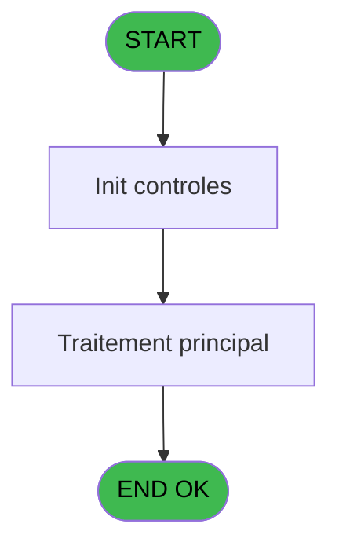
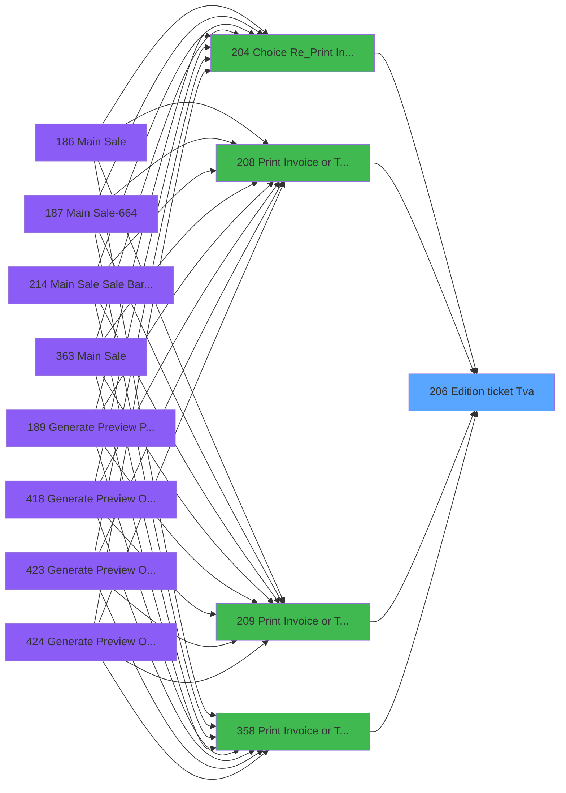
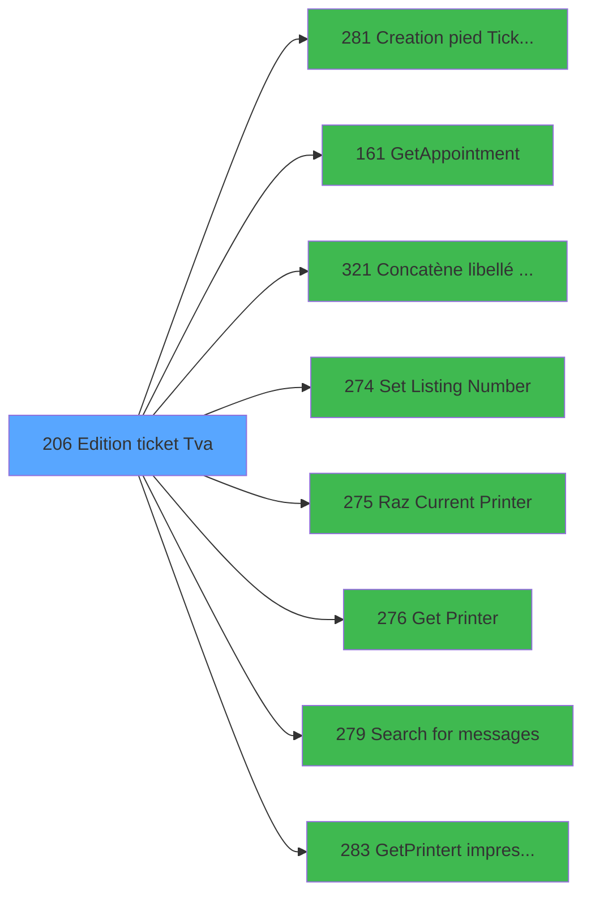

# PVE IDE 206 - Edition ticket (Tva)

> **Analyse**: Phases 1-4 2026-02-03 18:53 -> 18:54 (15s) | Assemblage 18:54
> **Pipeline**: V7.2 Enrichi
> **Structure**: 4 onglets (Resume | Ecrans | Donnees | Connexions)

<!-- TAB:Resume -->

## 1. FICHE D'IDENTITE

| Attribut | Valeur |
|----------|--------|
| Projet | PVE |
| IDE Position | 206 |
| Nom Programme | Edition ticket (Tva) |
| Fichier source | `Prg_206.xml` |
| Dossier IDE | Mobile |
| Taches | 36 (1 ecrans visibles) |
| Tables modifiees | 0 |
| Programmes appeles | 8 |

## 2. DESCRIPTION FONCTIONNELLE

**Edition ticket (Tva)** assure la gestion complete de ce processus, accessible depuis [Choice Re_Print Invoice (IDE 204)](PVE-IDE-204.md), [Print Invoice or Ticket (IDE 208)](PVE-IDE-208.md), [Print Invoice or Ticket-664 (IDE 209)](PVE-IDE-209.md), [Print Invoice or Ticket (IDE 358)](PVE-IDE-358.md).

Le flux de traitement s'organise en **2 blocs fonctionnels** :

- **Traitement** (25 taches) : traitements metier divers
- **Impression** (11 taches) : generation de tickets et documents

Detail : phases du traitement

#### Phase 1 : Traitement (25 taches)

- **206** - Please be patient ... **[[ECRAN]](#ecran-t1)**
- **206.1.1** - Impression reçu change **[[ECRAN]](#ecran-t3)**
- **206.1.2** - Impression reçu change **[[ECRAN]](#ecran-t4)**
- **206.1.2.2** - Impression reçu change **[[ECRAN]](#ecran-t6)**
- **206.1.2.3** - GetBookigsInfo
- **206.1.2.3.1** - GetBookigsInfo
- **206.2** - Counter
- **206.2.1** - Impression reçu change
- **206.2.2** - Impression reçu change
- **206.2.2.2** - Impression reçu change **[[ECRAN]](#ecran-t14)**
- **206.3.1** - Veuillez patienter ... **[[ECRAN]](#ecran-t16)**
- **206.3.2** - Veuillez patienter ... **[[ECRAN]](#ecran-t17)**
- **206.3.2.2** - Veuillez patienter ... **[[ECRAN]](#ecran-t19)**
- **206.4.1** - Veuillez patienter ... **[[ECRAN]](#ecran-t21)**
- **206.4.2** - Veuillez patienter ... **[[ECRAN]](#ecran-t22)**
- **206.4.2.2** - Veuillez patienter ... **[[ECRAN]](#ecran-t24)**
- **206.4.2.3** - GetBookigsInfo
- **206.4.2.3.1** - GetBookigsInfo
- **206.5** - Counter
- **206.5.1** - Impression reçu change **[[ECRAN]](#ecran-t29)**
- **206.5.2** - Impression reçu change **[[ECRAN]](#ecran-t30)**
- **206.5.2.2** - Impression reçu change **[[ECRAN]](#ecran-t32)**
- **206.5.2.3** - GetBookigsInfo
- **206.5.2.3.1** - GetBookigsInfo
- **206.6** - Search Gift Pass

Delegue a : [GetAppointment (IDE 161)](PVE-IDE-161.md), [Concatène libellé Cat/Ss-Cat (IDE 321)](PVE-IDE-321.md), [Set Listing Number (IDE 274)](PVE-IDE-274.md), [Search  for messages (IDE 279)](PVE-IDE-279.md)

#### Phase 2 : Impression (11 taches)

- **206.1** - Printer 1
- **206.1.2.1** - Print Tva **[[ECRAN]](#ecran-t5)**
- **206.1.2.4** - Print Appointments **[[ECRAN]](#ecran-t9)**
- **206.2.2.1** - Print Tva **[[ECRAN]](#ecran-t13)**
- **206.3** - Printer 5 **[[ECRAN]](#ecran-t15)**
- **206.3.2.1** - Print Tva **[[ECRAN]](#ecran-t18)**
- **206.4** - Printer 9 **[[ECRAN]](#ecran-t20)**
- **206.4.2.1** - Print Tva **[[ECRAN]](#ecran-t23)**
- **206.4.2.4** - Print Appointments **[[ECRAN]](#ecran-t27)**
- **206.5.2.1** - Print Tva **[[ECRAN]](#ecran-t31)**
- **206.5.2.4** - Print Appointments **[[ECRAN]](#ecran-t35)**

Delegue a : [Creation pied Ticket(Tva) (IDE 281)](PVE-IDE-281.md), [Set Listing Number (IDE 274)](PVE-IDE-274.md), [Raz Current Printer (IDE 275)](PVE-IDE-275.md), [Get Printer (IDE 276)](PVE-IDE-276.md), [GetPrinter/t impression (IDE 283)](PVE-IDE-283.md)

## 3. BLOCS FONCTIONNELS

### 3.1 Traitement (25 taches)

Traitements internes.

---

#### 206 - Please be patient ... [[ECRAN]](#ecran-t1)

**Role** : Tache d'orchestration : point d'entree du programme (25 sous-taches). Coordonne l'enchainement des traitements.
**Ecran** : 427 x 57 DLU (MDI) | [Voir mockup](#ecran-t1)

24 sous-taches directes

| Tache | Nom | Bloc |
|-------|-----|------|
| [206.1.1](#t3) | Impression reçu change **[[ECRAN]](#ecran-t3)** | Traitement |
| [206.1.2](#t4) | Impression reçu change **[[ECRAN]](#ecran-t4)** | Traitement |
| [206.1.2.2](#t6) | Impression reçu change **[[ECRAN]](#ecran-t6)** | Traitement |
| [206.1.2.3](#t7) | GetBookigsInfo | Traitement |
| [206.1.2.3.1](#t8) | GetBookigsInfo | Traitement |
| [206.2](#t10) | Counter | Traitement |
| [206.2.1](#t11) | Impression reçu change | Traitement |
| [206.2.2](#t12) | Impression reçu change | Traitement |
| [206.2.2.2](#t14) | Impression reçu change **[[ECRAN]](#ecran-t14)** | Traitement |
| [206.3.1](#t16) | Veuillez patienter ... **[[ECRAN]](#ecran-t16)** | Traitement |
| [206.3.2](#t17) | Veuillez patienter ... **[[ECRAN]](#ecran-t17)** | Traitement |
| [206.3.2.2](#t19) | Veuillez patienter ... **[[ECRAN]](#ecran-t19)** | Traitement |
| [206.4.1](#t21) | Veuillez patienter ... **[[ECRAN]](#ecran-t21)** | Traitement |
| [206.4.2](#t22) | Veuillez patienter ... **[[ECRAN]](#ecran-t22)** | Traitement |
| [206.4.2.2](#t24) | Veuillez patienter ... **[[ECRAN]](#ecran-t24)** | Traitement |
| [206.4.2.3](#t25) | GetBookigsInfo | Traitement |
| [206.4.2.3.1](#t26) | GetBookigsInfo | Traitement |
| [206.5](#t28) | Counter | Traitement |
| [206.5.1](#t29) | Impression reçu change **[[ECRAN]](#ecran-t29)** | Traitement |
| [206.5.2](#t30) | Impression reçu change **[[ECRAN]](#ecran-t30)** | Traitement |
| [206.5.2.2](#t32) | Impression reçu change **[[ECRAN]](#ecran-t32)** | Traitement |
| [206.5.2.3](#t33) | GetBookigsInfo | Traitement |
| [206.5.2.3.1](#t34) | GetBookigsInfo | Traitement |
| [206.6](#t36) | Search Gift Pass | Traitement |

---

#### 206.1.1 - Impression reçu change [[ECRAN]](#ecran-t3)

**Role** : Generation du document : Impression reçu change.
**Ecran** : 630 x 0 DLU (MDI) | [Voir mockup](#ecran-t3)

---

#### 206.1.2 - Impression reçu change [[ECRAN]](#ecran-t4)

**Role** : Generation du document : Impression reçu change.
**Ecran** : 1205 x 0 DLU (MDI) | [Voir mockup](#ecran-t4)

---

#### 206.1.2.2 - Impression reçu change [[ECRAN]](#ecran-t6)

**Role** : Generation du document : Impression reçu change.
**Ecran** : 574 x 0 DLU (MDI) | [Voir mockup](#ecran-t6)

---

#### 206.1.2.3 - GetBookigsInfo

**Role** : Consultation/chargement : GetBookigsInfo.

---

#### 206.1.2.3.1 - GetBookigsInfo

**Role** : Consultation/chargement : GetBookigsInfo.

---

#### 206.2 - Counter

**Role** : Traitement : Counter.

---

#### 206.2.1 - Impression reçu change

**Role** : Generation du document : Impression reçu change.

---

#### 206.2.2 - Impression reçu change

**Role** : Generation du document : Impression reçu change.

---

#### 206.2.2.2 - Impression reçu change [[ECRAN]](#ecran-t14)

**Role** : Generation du document : Impression reçu change.
**Ecran** : 574 x 0 DLU (MDI) | [Voir mockup](#ecran-t14)

---

#### 206.3.1 - Veuillez patienter ... [[ECRAN]](#ecran-t16)

**Role** : Traitement : Veuillez patienter ....
**Ecran** : 426 x 57 DLU (MDI) | [Voir mockup](#ecran-t16)

---

#### 206.3.2 - Veuillez patienter ... [[ECRAN]](#ecran-t17)

**Role** : Traitement : Veuillez patienter ....
**Ecran** : 424 x 56 DLU (MDI) | [Voir mockup](#ecran-t17)

---

#### 206.3.2.2 - Veuillez patienter ... [[ECRAN]](#ecran-t19)

**Role** : Traitement : Veuillez patienter ....
**Ecran** : 424 x 56 DLU (MDI) | [Voir mockup](#ecran-t19)

---

#### 206.4.1 - Veuillez patienter ... [[ECRAN]](#ecran-t21)

**Role** : Traitement : Veuillez patienter ....
**Ecran** : 424 x 56 DLU (MDI) | [Voir mockup](#ecran-t21)

---

#### 206.4.2 - Veuillez patienter ... [[ECRAN]](#ecran-t22)

**Role** : Traitement : Veuillez patienter ....
**Ecran** : 1242 x 399 DLU (MDI) | [Voir mockup](#ecran-t22)

---

#### 206.4.2.2 - Veuillez patienter ... [[ECRAN]](#ecran-t24)

**Role** : Traitement : Veuillez patienter ....
**Ecran** : 424 x 56 DLU (MDI) | [Voir mockup](#ecran-t24)

---

#### 206.4.2.3 - GetBookigsInfo

**Role** : Consultation/chargement : GetBookigsInfo.

---

#### 206.4.2.3.1 - GetBookigsInfo

**Role** : Consultation/chargement : GetBookigsInfo.

---

#### 206.5 - Counter

**Role** : Traitement : Counter.

---

#### 206.5.1 - Impression reçu change [[ECRAN]](#ecran-t29)

**Role** : Generation du document : Impression reçu change.
**Ecran** : 630 x 0 DLU (MDI) | [Voir mockup](#ecran-t29)

---

#### 206.5.2 - Impression reçu change [[ECRAN]](#ecran-t30)

**Role** : Generation du document : Impression reçu change.
**Ecran** : 574 x 0 DLU (MDI) | [Voir mockup](#ecran-t30)

---

#### 206.5.2.2 - Impression reçu change [[ECRAN]](#ecran-t32)

**Role** : Generation du document : Impression reçu change.
**Ecran** : 574 x 0 DLU (MDI) | [Voir mockup](#ecran-t32)

---

#### 206.5.2.3 - GetBookigsInfo

**Role** : Consultation/chargement : GetBookigsInfo.

---

#### 206.5.2.3.1 - GetBookigsInfo

**Role** : Consultation/chargement : GetBookigsInfo.

---

#### 206.6 - Search Gift Pass

**Role** : Calcul fidelite/avantage : Search Gift Pass.
**Variables liees** : BC (V Existe Gift Pass), BD (V.Solde  Gift Pass), BE (v.Affichage Ligne Gift Pass?), BF (V.Message Solde Gift Pass), BG (V Editer Solde Gift Pass a 0)

### 3.2 Impression (11 taches)

Generation des documents et tickets.

---

#### 206.1 - Printer 1

**Role** : Generation du document : Printer 1.

---

#### 206.1.2.1 - Print Tva [[ECRAN]](#ecran-t5)

**Role** : Generation du document : Print Tva.
**Ecran** : 506 x 0 DLU | [Voir mockup](#ecran-t5)
**Variables liees** : B (P. PrintAgainExecution), C (P. PrintAgainPreview)

---

#### 206.1.2.4 - Print Appointments [[ECRAN]](#ecran-t9)

**Role** : Generation du document : Print Appointments.
**Ecran** : 506 x 0 DLU | [Voir mockup](#ecran-t9)
**Variables liees** : B (P. PrintAgainExecution), C (P. PrintAgainPreview)

---

#### 206.2.2.1 - Print Tva [[ECRAN]](#ecran-t13)

**Role** : Generation du document : Print Tva.
**Ecran** : 127 x 0 DLU | [Voir mockup](#ecran-t13)
**Variables liees** : B (P. PrintAgainExecution), C (P. PrintAgainPreview)

---

#### 206.3 - Printer 5 [[ECRAN]](#ecran-t15)

**Role** : Generation du document : Printer 5.
**Ecran** : 424 x 56 DLU (MDI) | [Voir mockup](#ecran-t15)

---

#### 206.3.2.1 - Print Tva [[ECRAN]](#ecran-t18)

**Role** : Generation du document : Print Tva.
**Ecran** : 506 x 0 DLU | [Voir mockup](#ecran-t18)
**Variables liees** : B (P. PrintAgainExecution), C (P. PrintAgainPreview)

---

#### 206.4 - Printer 9 [[ECRAN]](#ecran-t20)

**Role** : Generation du document : Printer 9.
**Ecran** : 424 x 56 DLU (MDI) | [Voir mockup](#ecran-t20)

---

#### 206.4.2.1 - Print Tva [[ECRAN]](#ecran-t23)

**Role** : Generation du document : Print Tva.
**Ecran** : 506 x 0 DLU | [Voir mockup](#ecran-t23)
**Variables liees** : B (P. PrintAgainExecution), C (P. PrintAgainPreview)

---

#### 206.4.2.4 - Print Appointments [[ECRAN]](#ecran-t27)

**Role** : Generation du document : Print Appointments.
**Ecran** : 506 x 0 DLU | [Voir mockup](#ecran-t27)
**Variables liees** : B (P. PrintAgainExecution), C (P. PrintAgainPreview)

---

#### 206.5.2.1 - Print Tva [[ECRAN]](#ecran-t31)

**Role** : Generation du document : Print Tva.
**Ecran** : 506 x 0 DLU | [Voir mockup](#ecran-t31)
**Variables liees** : B (P. PrintAgainExecution), C (P. PrintAgainPreview)

---

#### 206.5.2.4 - Print Appointments [[ECRAN]](#ecran-t35)

**Role** : Generation du document : Print Appointments.
**Ecran** : 506 x 0 DLU | [Voir mockup](#ecran-t35)
**Variables liees** : B (P. PrintAgainExecution), C (P. PrintAgainPreview)

## 5. REGLES METIER

*(Aucune regle metier identifiee)*

## 6. CONTEXTE

- **Appele par**: [Choice Re_Print Invoice (IDE 204)](PVE-IDE-204.md), [Print Invoice or Ticket (IDE 208)](PVE-IDE-208.md), [Print Invoice or Ticket-664 (IDE 209)](PVE-IDE-209.md), [Print Invoice or Ticket (IDE 358)](PVE-IDE-358.md)
- **Appelle**: 8 programmes | **Tables**: 13 (W:0 R:7 L:9) | **Taches**: 36 | **Expressions**: 40

<!-- TAB:Ecrans -->

## 8. ECRANS

### 8.1 Forms visibles (1 / 36)

| # | Position | Tache | Nom | Type | Largeur | Hauteur | Bloc |
|---|----------|-------|-----|------|---------|---------|------|
| 1 | 206 | 206 | Please be patient ... | MDI | 427 | 57 | Traitement |

### 8.2 Mockups Ecrans

---

#### 206 - Please be patient ...
**Tache** : [206](#t1) | **Type** : MDI | **Dimensions** : 427 x 57 DLU
**Bloc** : Traitement | **Titre IDE** : Please be patient ...

<!-- FORM-DATA:
{
    "width":  427,
    "vFactor":  8,
    "type":  "MDI",
    "hFactor":  8,
    "controls":  [
                     {
                         "x":  0,
                         "type":  "label",
                         "var":  "",
                         "y":  0,
                         "w":  423,
                         "fmt":  "",
                         "name":  "",
                         "h":  29,
                         "color":  "",
                         "text":  "",
                         "parent":  null
                     },
                     {
                         "x":  120,
                         "type":  "label",
                         "var":  "",
                         "y":  10,
                         "w":  221,
                         "fmt":  "",
                         "name":  "",
                         "h":  8,
                         "color":  "7",
                         "text":  "Print in progress ...",
                         "parent":  null
                     },
                     {
                         "x":  0,
                         "type":  "label",
                         "var":  "",
                         "y":  29,
                         "w":  423,
                         "fmt":  "",
                         "name":  "",
                         "h":  27,
                         "color":  "",
                         "text":  "",
                         "parent":  null
                     },
                     {
                         "x":  114,
                         "type":  "label",
                         "var":  "",
                         "y":  38,
                         "w":  203,
                         "fmt":  "",
                         "name":  "",
                         "h":  8,
                         "color":  "",
                         "text":  "Ticket edition",
                         "parent":  null
                     },
                     {
                         "x":  4,
                         "type":  "image",
                         "var":  "",
                         "y":  2,
                         "w":  72,
                         "fmt":  "",
                         "name":  "",
                         "h":  25,
                         "color":  "",
                         "text":  "",
                         "parent":  null
                     }
                 ],
    "taskId":  "206",
    "height":  57
}
-->

## 9. NAVIGATION

Ecran unique: **Please be patient ...**

### 9.3 Structure hierarchique (36 taches)

| Position | Tache | Type | Dimensions | Bloc |
|----------|-------|------|------------|------|
| **206.1** | [**Please be patient ...** (206)](#t1) [mockup](#ecran-t1) | MDI | 427x57 | Traitement |
| 206.1.1 | [Impression reçu change (206.1.1)](#t3) [mockup](#ecran-t3) | MDI | 630x0 | |
| 206.1.2 | [Impression reçu change (206.1.2)](#t4) [mockup](#ecran-t4) | MDI | 1205x0 | |
| 206.1.3 | [Impression reçu change (206.1.2.2)](#t6) [mockup](#ecran-t6) | MDI | 574x0 | |
| 206.1.4 | [GetBookigsInfo (206.1.2.3)](#t7) | - | - | |
| 206.1.5 | [GetBookigsInfo (206.1.2.3.1)](#t8) | - | - | |
| 206.1.6 | [Counter (206.2)](#t10) | MDI | - | |
| 206.1.7 | [Impression reçu change (206.2.1)](#t11) | MDI | - | |
| 206.1.8 | [Impression reçu change (206.2.2)](#t12) | MDI | - | |
| 206.1.9 | [Impression reçu change (206.2.2.2)](#t14) [mockup](#ecran-t14) | MDI | 574x0 | |
| 206.1.10 | [Veuillez patienter ... (206.3.1)](#t16) [mockup](#ecran-t16) | MDI | 426x57 | |
| 206.1.11 | [Veuillez patienter ... (206.3.2)](#t17) [mockup](#ecran-t17) | MDI | 424x56 | |
| 206.1.12 | [Veuillez patienter ... (206.3.2.2)](#t19) [mockup](#ecran-t19) | MDI | 424x56 | |
| 206.1.13 | [Veuillez patienter ... (206.4.1)](#t21) [mockup](#ecran-t21) | MDI | 424x56 | |
| 206.1.14 | [Veuillez patienter ... (206.4.2)](#t22) [mockup](#ecran-t22) | MDI | 1242x399 | |
| 206.1.15 | [Veuillez patienter ... (206.4.2.2)](#t24) [mockup](#ecran-t24) | MDI | 424x56 | |
| 206.1.16 | [GetBookigsInfo (206.4.2.3)](#t25) | - | - | |
| 206.1.17 | [GetBookigsInfo (206.4.2.3.1)](#t26) | - | - | |
| 206.1.18 | [Counter (206.5)](#t28) | MDI | - | |
| 206.1.19 | [Impression reçu change (206.5.1)](#t29) [mockup](#ecran-t29) | MDI | 630x0 | |
| 206.1.20 | [Impression reçu change (206.5.2)](#t30) [mockup](#ecran-t30) | MDI | 574x0 | |
| 206.1.21 | [Impression reçu change (206.5.2.2)](#t32) [mockup](#ecran-t32) | MDI | 574x0 | |
| 206.1.22 | [GetBookigsInfo (206.5.2.3)](#t33) | - | - | |
| 206.1.23 | [GetBookigsInfo (206.5.2.3.1)](#t34) | - | - | |
| 206.1.24 | [Search Gift Pass (206.6)](#t36) | - | - | |
| **206.2** | [**Printer 1** (206.1)](#t2) | MDI | - | Impression |
| 206.2.1 | [Print Tva (206.1.2.1)](#t5) [mockup](#ecran-t5) | - | 506x0 | |
| 206.2.2 | [Print Appointments (206.1.2.4)](#t9) [mockup](#ecran-t9) | - | 506x0 | |
| 206.2.3 | [Print Tva (206.2.2.1)](#t13) [mockup](#ecran-t13) | - | 127x0 | |
| 206.2.4 | [Printer 5 (206.3)](#t15) [mockup](#ecran-t15) | MDI | 424x56 | |
| 206.2.5 | [Print Tva (206.3.2.1)](#t18) [mockup](#ecran-t18) | - | 506x0 | |
| 206.2.6 | [Printer 9 (206.4)](#t20) [mockup](#ecran-t20) | MDI | 424x56 | |
| 206.2.7 | [Print Tva (206.4.2.1)](#t23) [mockup](#ecran-t23) | - | 506x0 | |
| 206.2.8 | [Print Appointments (206.4.2.4)](#t27) [mockup](#ecran-t27) | - | 506x0 | |
| 206.2.9 | [Print Tva (206.5.2.1)](#t31) [mockup](#ecran-t31) | - | 506x0 | |
| 206.2.10 | [Print Appointments (206.5.2.4)](#t35) [mockup](#ecran-t35) | - | 506x0 | |

### 9.4 Algorigramme

> **Legende**: Vert = START/END OK | Rouge = END KO | Bleu = Decisions
> *Algorigramme auto-genere. Utiliser `/algorigramme` pour une synthese metier detaillee.*

<!-- TAB:Donnees -->

## 10. TABLES

### Tables utilisees (13)

| ID | Nom | Description | Type | R | W | L | Usages |
|----|-----|-------------|------|---|---|---|--------|
| 31 | gm-complet_______gmc |  | DB | R |   |   | 1 |
| 67 | tables___________tab |  | DB |   |   | L | 1 |
| 69 | initialisation___ini |  | DB |   |   | L | 1 |
| 268 | cc_total_par_type |  | DB | R |   |   | 1 |
| 378 | pv_customer |  | DB | R |   | L | 5 |
| 379 | pv_customer_temp |  | DB |   |   | L | 3 |
| 382 | pv_discount_reasons |  | DB |   |   | L | 1 |
| 400 | pv_cust_rentals |  | DB | R |   | L | 18 |
| 403 | pv_sellers |  | DB | R |   | L | 13 |
| 533 | cumul_mvt_stock_histo | Articles et stock | TMP |   |   | L | 19 |
| 868 | Affectation_Gift_Pass |  | DB | R |   |   | 5 |
| 1539 | Table_1539 |  | MEM | R |   |   | 3 |
| 1548 | Table_1548 |  | MEM |   |   | L | 3 |

### Colonnes par table (7 / 7 tables avec colonnes identifiees)

Table 31 - gm-complet_______gmc (R) - 1 usages

| Lettre | Variable | Acces | Type |
|--------|----------|-------|------|
| A | P. Decimal | R | Numeric |
| B | P. PrintAgainExecution | R | Logical |
| C | P. PrintAgainPreview | R | Logical |
| D | P. Facture | R | Numeric |
| E | P.Service | R | Alpha |
| F | P.Nom Pdf Ticket Mobilite | R | Alpha |
| G | P Viens de reedition Mobilite | R | Logical |
| H | p.File_Name_Signature | R | Numeric |
| I | p.NomVendeur | R | Alpha |
| J | p.Vente Mobility | R | Logical |
| K | p.Mail | R | Logical |
| L | p.Num transaction_Axis | R | Alpha |
| M | p.Num Id_Acceptation | R | Alpha |
| N | V Devise locale | R | Alpha |
| O | V Masque | R | Alpha |
| P | V Masque sans Z | R | Alpha |
| Q | V Date | R | Date |
| R | V Fin tâche | R | Alpha |
| S | V Imprimante 2 | R | Numeric |
| T | V Copies | R | Numeric |
| U | L Avec Réduction | R | Logical |
| V | L Annulation | R | Logical |
| W | V Type Paiement | R | Alpha |
| X | V Masque TM88III | R | Alpha |
| Y | V.Customer | R | Alpha |
| Z | V.Payer | R | Alpha |
| BA | V.Message on Ticket ? | R | Logical |
| BB | V.Message | R | Alpha |
| BC | V Existe Gift Pass | R | Logical |
| BD | V.Solde  Gift Pass | R | Numeric |
| BE | v.Affichage Ligne Gift Pass? | R | Logical |
| BF | V.Message Solde Gift Pass | R | Alpha |
| BG | V Editer Solde Gift Pass a 0 | R | Logical |
| BH | v Editer TVA | R | Logical |

Table 268 - cc_total_par_type (R) - 1 usages

| Lettre | Variable | Acces | Type |
|--------|----------|-------|------|
| A | V TOTAL | R | Numeric |
| B | v.Total | R | Numeric |
| W | V Type Paiement | R | Alpha |

Table 378 - pv_customer (R/L) - 5 usages

| Lettre | Variable | Acces | Type |
|--------|----------|-------|------|
| B | v.Total Ticket | R | Numeric |
| C | v.Ligne Montant TTC | R | Numeric |
| D | v.Ligne Montant HT | R | Numeric |

Table 400 - pv_cust_rentals (R/L) - 18 usages

| Lettre | Variable | Acces | Type |
|--------|----------|-------|------|
| A | P.CustomerID | R | Numeric |
| Y | V.Customer | R | Alpha |

Table 403 - pv_sellers (R/L) - 13 usages

| Lettre | Variable | Acces | Type |
|--------|----------|-------|------|
| A | Durée | R | Time |
| B | PassageGroupe | R | Logical |

Table 868 - Affectation_Gift_Pass (R) - 5 usages

| Lettre | Variable | Acces | Type |
|--------|----------|-------|------|
| B | PassageGroupe | R | Logical |
| BC | V Existe Gift Pass | R | Logical |
| BD | V.Solde  Gift Pass | R | Numeric |
| BE | v.Affichage Ligne Gift Pass? | R | Logical |
| BF | V.Message Solde Gift Pass | R | Alpha |
| BG | V Editer Solde Gift Pass a 0 | R | Logical |
| M | V Ecrire Ligne Gift Pass | R | Numeric |
| O | v.Editer Ligne Gift Pass | R | Logical |

Table 1539 - Table_1539 (R) - 3 usages

*Table utilisee uniquement en Link ou aucune colonne Real identifiee dans le DataView.*

## 11. VARIABLES

### 11.1 Parametres entrants (13)

Variables recues du programme appelant ([Choice Re_Print Invoice (IDE 204)](PVE-IDE-204.md)).

| Lettre | Nom | Type | Usage dans |
|--------|-----|------|-----------|
| A | P. Decimal | Numeric | - |
| B | P. PrintAgainExecution | Logical | 1x parametre entrant |
| C | P. PrintAgainPreview | Logical | - |
| D | P. Facture | Numeric | - |
| E | P.Service | Alpha | 1x parametre entrant |
| F | P.Nom Pdf Ticket Mobilite | Alpha | - |
| G | P Viens de reedition Mobilite | Logical | - |
| H | p.File_Name_Signature | Numeric | - |
| I | p.NomVendeur | Alpha | - |
| J | p.Vente Mobility | Logical | 2x parametre entrant |
| K | p.Mail | Logical | 2x parametre entrant |
| L | p.Num transaction_Axis | Alpha | - |
| M | p.Num Id_Acceptation | Alpha | - |

### 11.2 Variables de session (19)

Variables persistantes pendant toute la session.

| Lettre | Nom | Type | Usage dans |
|--------|-----|------|-----------|
| N | V Devise locale | Alpha | - |
| O | V Masque | Alpha | 2x session |
| P | V Masque sans Z | Alpha | - |
| Q | V Date | Date | - |
| R | V Fin tâche | Alpha | - |
| S | V Imprimante 2 | Numeric | - |
| T | V Copies | Numeric | - |
| W | V Type Paiement | Alpha | 1x session |
| X | V Masque TM88III | Alpha | - |
| Y | V.Customer | Alpha | - |
| Z | V.Payer | Alpha | - |
| BA | V.Message on Ticket ? | Logical | - |
| BB | V.Message | Alpha | - |
| BC | V Existe Gift Pass | Logical | - |
| BD | V.Solde  Gift Pass | Numeric | - |
| BE | v.Affichage Ligne Gift Pass? | Logical | - |
| BF | V.Message Solde Gift Pass | Alpha | - |
| BG | V Editer Solde Gift Pass a 0 | Logical | - |
| BH | v Editer TVA | Logical | - |

### 11.3 Autres (2)

Variables diverses.

| Lettre | Nom | Type | Usage dans |
|--------|-----|------|-----------|
| U | L Avec Réduction | Logical | - |
| V | L Annulation | Logical | - |

Toutes les 34 variables (liste complete)

| Cat | Lettre | Nom Variable | Type |
|-----|--------|--------------|------|
| P0 | **A** | P. Decimal | Numeric |
| P0 | **B** | P. PrintAgainExecution | Logical |
| P0 | **C** | P. PrintAgainPreview | Logical |
| P0 | **D** | P. Facture | Numeric |
| P0 | **E** | P.Service | Alpha |
| P0 | **F** | P.Nom Pdf Ticket Mobilite | Alpha |
| P0 | **G** | P Viens de reedition Mobilite | Logical |
| P0 | **H** | p.File_Name_Signature | Numeric |
| P0 | **I** | p.NomVendeur | Alpha |
| P0 | **J** | p.Vente Mobility | Logical |
| P0 | **K** | p.Mail | Logical |
| P0 | **L** | p.Num transaction_Axis | Alpha |
| P0 | **M** | p.Num Id_Acceptation | Alpha |
| V. | **N** | V Devise locale | Alpha |
| V. | **O** | V Masque | Alpha |
| V. | **P** | V Masque sans Z | Alpha |
| V. | **Q** | V Date | Date |
| V. | **R** | V Fin tâche | Alpha |
| V. | **S** | V Imprimante 2 | Numeric |
| V. | **T** | V Copies | Numeric |
| V. | **W** | V Type Paiement | Alpha |
| V. | **X** | V Masque TM88III | Alpha |
| V. | **Y** | V.Customer | Alpha |
| V. | **Z** | V.Payer | Alpha |
| V. | **BA** | V.Message on Ticket ? | Logical |
| V. | **BB** | V.Message | Alpha |
| V. | **BC** | V Existe Gift Pass | Logical |
| V. | **BD** | V.Solde  Gift Pass | Numeric |
| V. | **BE** | v.Affichage Ligne Gift Pass? | Logical |
| V. | **BF** | V.Message Solde Gift Pass | Alpha |
| V. | **BG** | V Editer Solde Gift Pass a 0 | Logical |
| V. | **BH** | v Editer TVA | Logical |
| Autre | **U** | L Avec Réduction | Logical |
| Autre | **V** | L Annulation | Logical |

## 12. EXPRESSIONS

**40 / 40 expressions decodees (100%)**

### 12.1 Repartition par type

| Type | Expressions | Regles |
|------|-------------|--------|
| CALCULATION | 1 | 0 |
| FORMAT | 3 | 0 |
| CONSTANTE | 5 | 0 |
| DATE | 1 | 0 |
| OTHER | 17 | 0 |
| CONDITION | 8 | 0 |
| CONCATENATION | 3 | 0 |
| CAST_LOGIQUE | 1 | 0 |
| REFERENCE_VG | 1 | 0 |

### 12.2 Expressions cles par type

#### CALCULATION (1 expressions)

| Type | IDE | Expression | Regle |
|------|-----|------------|-------|
| CALCULATION | 9 | `Left (Trim (V Masque [O]),Len (Trim (V Masque [O]))-1)` | - |

#### FORMAT (3 expressions)

| Type | IDE | Expression | Regle |
|------|-----|------------|-------|
| FORMAT | 32 | `'Gift Pass Balance'&' : '&Str([BJ],'N5.2')&' as of '&DStr(Date(),'DD/MM/YY')&' '&TStr(Time(),('HH:MM'))` | - |
| FORMAT | 31 | `'Gift Pass Balance'&' : '&Str([BJ],'N7.2')&' as of '&DStr(Date(),'DD/MM/YYYY')&' '&TStr(Time(),('HH:MM:SS'))` | - |
| FORMAT | 37 | `Str([AY],'##')&' / '&VG33&' / '&IF(p.Mail [K],'Mail=oui','Mail=NON')&' / '&IF(p.Vente Mobility [J],'Vente Mobility=OUI','Vente Mobility=NON')` | - |

#### CONSTANTE (5 expressions)

| Type | IDE | Expression | Regle |
|------|-----|------------|-------|
| CONSTANTE | 18 | `'O'` | - |
| CONSTANTE | 38 | `201` | - |
| CONSTANTE | 16 | `'VSERV'` | - |
| CONSTANTE | 12 | `201` | - |
| CONSTANTE | 13 | `1` | - |

#### DATE (1 expressions)

| Type | IDE | Expression | Regle |
|------|-----|------------|-------|
| DATE | 11 | `Date ()` | - |

#### OTHER (17 expressions)

| Type | IDE | Expression | Regle |
|------|-----|------------|-------|
| OTHER | 27 | `[AR]` | - |
| OTHER | 28 | `[AS]` | - |
| OTHER | 25 | `[AC]` | - |
| OTHER | 26 | `[AQ]` | - |
| OTHER | 35 | `[AA]` | - |
| ... | | *+12 autres* | |

#### CONDITION (8 expressions)

| Type | IDE | Expression | Regle |
|------|-----|------------|-------|
| CONDITION | 36 | `VG33='WS' AND NOT (p.Vente Mobility [J]) OR VG33='TB' AND NOT (p.Vente Mobility [J]) AND NOT(p.Mail [K])` | - |
| CONDITION | 14 | `[AZ]=0` | - |
| CONDITION | 10 | `Right(Trim (V Masque [O]),1)='Z'` | - |
| CONDITION | 40 | `VG29 AND [BI] AND ([BJ]>0 OR ([BJ]=0 AND [BL]))` | - |
| CONDITION | 4 | `[AY]=4` | - |
| ... | | *+3 autres* | |

#### CONCATENATION (3 expressions)

| Type | IDE | Expression | Regle |
|------|-----|------------|-------|
| CONCATENATION | 20 | `Trim([AW])&' '&Trim([AX])` | - |
| CONCATENATION | 19 | `Trim([AM])&' '&Trim([AN])` | - |
| CONCATENATION | 15 | `'N'&Right ('## ### ### ###'&Left ('.',V Type Paiement [W])&Fill ('#',V Type Paiement [W]),13)` | - |

#### CAST_LOGIQUE (1 expressions)

| Type | IDE | Expression | Regle |
|------|-----|------------|-------|
| CAST_LOGIQUE | 29 | `'TRUE'LOG` | - |

#### REFERENCE_VG (1 expressions)

| Type | IDE | Expression | Regle |
|------|-----|------------|-------|
| REFERENCE_VG | 33 | `VG29` | - |

### 12.3 Toutes les expressions (40)

Voir les 40 expressions

#### CALCULATION (1)

| IDE | Expression Decodee |
|-----|-------------------|
| 9 | `Left (Trim (V Masque [O]),Len (Trim (V Masque [O]))-1)` |

#### FORMAT (3)

| IDE | Expression Decodee |
|-----|-------------------|
| 37 | `Str([AY],'##')&' / '&VG33&' / '&IF(p.Mail [K],'Mail=oui','Mail=NON')&' / '&IF(p.Vente Mobility [J],'Vente Mobility=OUI','Vente Mobility=NON')` |
| 31 | `'Gift Pass Balance'&' : '&Str([BJ],'N7.2')&' as of '&DStr(Date(),'DD/MM/YYYY')&' '&TStr(Time(),('HH:MM:SS'))` |
| 32 | `'Gift Pass Balance'&' : '&Str([BJ],'N5.2')&' as of '&DStr(Date(),'DD/MM/YY')&' '&TStr(Time(),('HH:MM'))` |

#### CONSTANTE (5)

| IDE | Expression Decodee |
|-----|-------------------|
| 12 | `201` |
| 13 | `1` |
| 16 | `'VSERV'` |
| 18 | `'O'` |
| 38 | `201` |

#### DATE (1)

| IDE | Expression Decodee |
|-----|-------------------|
| 11 | `Date ()` |

#### OTHER (17)

| IDE | Expression Decodee |
|-----|-------------------|
| 1 | `SetCrsr (2)` |
| 2 | `SetCrsr (1)` |
| 7 | `GetParam ('CURRENCYVALUE')` |
| 8 | `GetParam ('AMOUNTFORMAT')` |
| 17 | `P.Service [E]` |
| 21 | `[AD]` |
| 22 | `[AG]` |
| 23 | `[AH]` |
| 24 | `[AI]` |
| 25 | `[AC]` |
| 26 | `[AQ]` |
| 27 | `[AR]` |
| 28 | `[AS]` |
| 30 | `DbDel('{868,3}'DSOURCE,'')` |
| 34 | `[BI]` |
| 35 | `[AA]` |
| 39 | `P. PrintAgainExecution [B] AND NOT P Viens de reedition M... [G]` |

#### CONDITION (8)

| IDE | Expression Decodee |
|-----|-------------------|
| 3 | `[AY]=1` |
| 4 | `[AY]=4` |
| 5 | `[AY]=8` |
| 6 | `[AY]=9` |
| 14 | `[AZ]=0` |
| 36 | `VG33='WS' AND NOT (p.Vente Mobility [J]) OR VG33='TB' AND NOT (p.Vente Mobility [J]) AND NOT(p.Mail [K])` |
| 40 | `VG29 AND [BI] AND ([BJ]>0 OR ([BJ]=0 AND [BL]))` |
| 10 | `Right(Trim (V Masque [O]),1)='Z'` |

#### CONCATENATION (3)

| IDE | Expression Decodee |
|-----|-------------------|
| 15 | `'N'&Right ('## ### ### ###'&Left ('.',V Type Paiement [W])&Fill ('#',V Type Paiement [W]),13)` |
| 19 | `Trim([AM])&' '&Trim([AN])` |
| 20 | `Trim([AW])&' '&Trim([AX])` |

#### CAST_LOGIQUE (1)

| IDE | Expression Decodee |
|-----|-------------------|
| 29 | `'TRUE'LOG` |

#### REFERENCE_VG (1)

| IDE | Expression Decodee |
|-----|-------------------|
| 33 | `VG29` |

<!-- TAB:Connexions -->

## 13. GRAPHE D'APPELS

### 13.1 Chaine depuis Main (Callers)

Main -> ... -> [Choice Re_Print Invoice (IDE 204)](PVE-IDE-204.md) -> **Edition ticket (Tva) (IDE 206)**

Main -> ... -> [Print Invoice or Ticket (IDE 208)](PVE-IDE-208.md) -> **Edition ticket (Tva) (IDE 206)**

Main -> ... -> [Print Invoice or Ticket-664 (IDE 209)](PVE-IDE-209.md) -> **Edition ticket (Tva) (IDE 206)**

Main -> ... -> [Print Invoice or Ticket (IDE 358)](PVE-IDE-358.md) -> **Edition ticket (Tva) (IDE 206)**

### 13.2 Callers

| IDE | Nom Programme | Nb Appels |
|-----|---------------|-----------|
| [204](PVE-IDE-204.md) | Choice Re_Print Invoice | 1 |
| [208](PVE-IDE-208.md) | Print Invoice or Ticket | 1 |
| [209](PVE-IDE-209.md) | Print Invoice or Ticket-664 | 1 |
| [358](PVE-IDE-358.md) | Print Invoice or Ticket | 1 |

### 13.3 Callees (programmes appeles)

### 13.4 Detail Callees avec contexte

| IDE | Nom Programme | Appels | Contexte |
|-----|---------------|--------|----------|
| [281](PVE-IDE-281.md) | Creation pied Ticket(Tva) | 5 | Impression ticket/document |
| [161](PVE-IDE-161.md) | GetAppointment | 3 | Recuperation donnees |
| [321](PVE-IDE-321.md) | Concatène libellé Cat/Ss-Cat | 3 | Sous-programme |
| [274](PVE-IDE-274.md) | Set Listing Number | 1 | Configuration impression |
| [275](PVE-IDE-275.md) | Raz Current Printer | 1 | Impression ticket/document |
| [276](PVE-IDE-276.md) | Get Printer | 1 | Impression ticket/document |
| [279](PVE-IDE-279.md) | Search  for messages | 1 | Sous-programme |
| [283](PVE-IDE-283.md) | GetPrinter/t impression | 1 | Impression ticket/document |

## 14. RECOMMANDATIONS MIGRATION

### 14.1 Profil du programme

| Metrique | Valeur | Impact migration |
|----------|--------|-----------------|
| Lignes de logique | 1537 | Programme volumineux |
| Expressions | 40 | Peu de logique |
| Tables WRITE | 0 | Impact faible |
| Sous-programmes | 8 | Dependances moderees |
| Ecrans visibles | 1 | Ecran unique ou traitement batch |
| Code desactive | 0.5% (8 / 1537) | Code sain |
| Regles metier | 0 | Pas de regle identifiee |

### 14.2 Plan de migration par bloc

#### Traitement (25 taches: 14 ecrans, 11 traitements)

- **Strategie** : Orchestrateur avec 14 ecrans (Razor/React) et 11 traitements backend (services).
- Les ecrans deviennent des composants UI, les traitements invisibles deviennent des services injectables.
- 8 sous-programme(s) a migrer ou a reutiliser depuis les services existants.
- Decomposer les taches en services unitaires testables.

#### Impression (11 taches: 10 ecrans, 1 traitement)

- **Strategie** : Templates HTML -> PDF via wkhtmltopdf ou Puppeteer.
- `PrintService` injectable avec choix imprimante

### 14.3 Dependances critiques

| Dependance | Type | Appels | Impact |
|------------|------|--------|--------|
| [Creation pied Ticket(Tva) (IDE 281)](PVE-IDE-281.md) | Sous-programme | 5x | **CRITIQUE** - Impression ticket/document |
| [Concatène libellé Cat/Ss-Cat (IDE 321)](PVE-IDE-321.md) | Sous-programme | 3x | **CRITIQUE** - Sous-programme |
| [GetAppointment (IDE 161)](PVE-IDE-161.md) | Sous-programme | 3x | **CRITIQUE** - Recuperation donnees |
| [Search  for messages (IDE 279)](PVE-IDE-279.md) | Sous-programme | 1x | Normale - Sous-programme |
| [GetPrinter/t impression (IDE 283)](PVE-IDE-283.md) | Sous-programme | 1x | Normale - Impression ticket/document |
| [Get Printer (IDE 276)](PVE-IDE-276.md) | Sous-programme | 1x | Normale - Impression ticket/document |
| [Set Listing Number (IDE 274)](PVE-IDE-274.md) | Sous-programme | 1x | Normale - Configuration impression |
| [Raz Current Printer (IDE 275)](PVE-IDE-275.md) | Sous-programme | 1x | Normale - Impression ticket/document |

---
*Spec DETAILED generee par Pipeline V7.2 - 2026-02-03 18:54*
