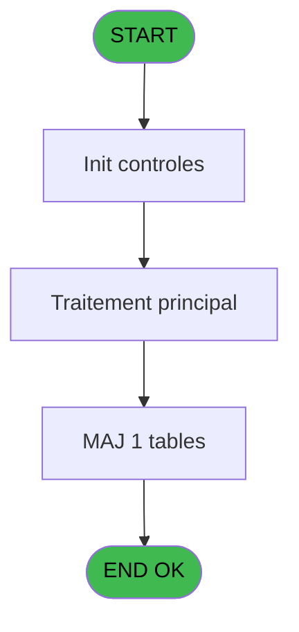
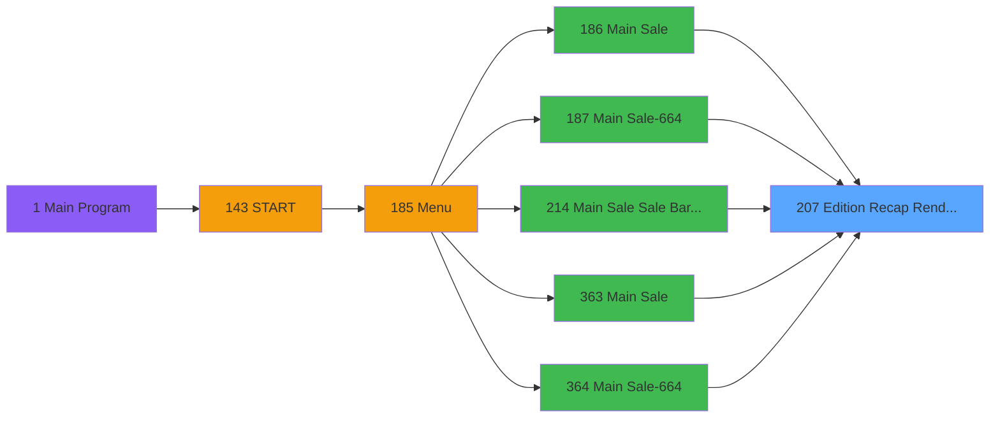
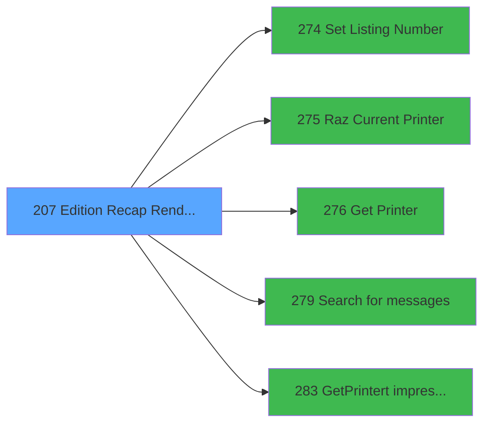

# PVE IDE 207 - Edition Recap Rendez-vous

> **Analyse**: Phases 1-4 2026-02-03 18:54 -> 18:54 (18s) | Assemblage 18:54
> **Pipeline**: V7.2 Enrichi
> **Structure**: 4 onglets (Resume | Ecrans | Donnees | Connexions)

<!-- TAB:Resume -->

## 1. FICHE D'IDENTITE

| Attribut | Valeur |
|----------|--------|
| Projet | PVE |
| IDE Position | 207 |
| Nom Programme | Edition Recap Rendez-vous |
| Fichier source | `Prg_207.xml` |
| Dossier IDE | Mobile |
| Taches | 11 (1 ecrans visibles) |
| Tables modifiees | 1 |
| Programmes appeles | 5 |

## 2. DESCRIPTION FONCTIONNELLE

**Edition Recap Rendez-vous** assure la gestion complete de ce processus, accessible depuis [Main Sale (IDE 186)](PVE-IDE-186.md), [Main Sale-664 (IDE 187)](PVE-IDE-187.md), [Main Sale Sale Bar Code (IDE 214)](PVE-IDE-214.md), [Main Sale (IDE 363)](PVE-IDE-363.md), [Main Sale-664 (IDE 364)](PVE-IDE-364.md), [Main Sale ===V4 Booking ACTUEL (IDE 417)](PVE-IDE-417.md), [Main Sale (IDE 440)](PVE-IDE-440.md).

Le flux de traitement s'organise en **2 blocs fonctionnels** :

- **Impression** (6 taches) : generation de tickets et documents
- **Traitement** (5 taches) : traitements metier divers

**Donnees modifiees** : 1 tables en ecriture (Table_1548).

Detail : phases du traitement

#### Phase 1 : Traitement (5 taches)

- **207** - Please be patient ... **[[ECRAN]](#ecran-t1)**
- **207.1.1** - Impression reçu change **[[ECRAN]](#ecran-t3)**
- **207.1.2** - Impression reçu change **[[ECRAN]](#ecran-t5)**
- **207.2.1** - Veuillez patienter ... **[[ECRAN]](#ecran-t8)**
- **207.2.2** - Veuillez patienter ... **[[ECRAN]](#ecran-t10)**

Delegue a : [Set Listing Number (IDE 274)](PVE-IDE-274.md), [Search  for messages (IDE 279)](PVE-IDE-279.md)

#### Phase 2 : Impression (6 taches)

- **207.1** - Printer 1
- **207.1.1.1** - Print Appointments **[[ECRAN]](#ecran-t4)**
- **207.1.2.1** - Print Appointments **[[ECRAN]](#ecran-t6)**
- **207.2** - Printer 9 **[[ECRAN]](#ecran-t7)**
- **207.2.1.1** - Print Appointments **[[ECRAN]](#ecran-t9)**
- **207.2.2.1** - Print Appointments **[[ECRAN]](#ecran-t11)**

Delegue a : [Set Listing Number (IDE 274)](PVE-IDE-274.md), [Raz Current Printer (IDE 275)](PVE-IDE-275.md), [Get Printer (IDE 276)](PVE-IDE-276.md), [GetPrinter/t impression (IDE 283)](PVE-IDE-283.md)

#### Tables impactees

| Table | Operations | Role metier |
|-------|-----------|-------------|
| Table_1548 | **W** (4 usages) |  |

## 3. BLOCS FONCTIONNELS

### 3.1 Traitement (5 taches)

Traitements internes.

---

#### 207 - Please be patient ... [[ECRAN]](#ecran-t1)

**Role** : Traitement : Please be patient ....
**Ecran** : 427 x 57 DLU (MDI) | [Voir mockup](#ecran-t1)

4 sous-taches directes

| Tache | Nom | Bloc |
|-------|-----|------|
| [207.1.1](#t3) | Impression reçu change **[[ECRAN]](#ecran-t3)** | Traitement |
| [207.1.2](#t5) | Impression reçu change **[[ECRAN]](#ecran-t5)** | Traitement |
| [207.2.1](#t8) | Veuillez patienter ... **[[ECRAN]](#ecran-t8)** | Traitement |
| [207.2.2](#t10) | Veuillez patienter ... **[[ECRAN]](#ecran-t10)** | Traitement |

**Delegue a** : [Set Listing Number (IDE 274)](PVE-IDE-274.md), [Search  for messages (IDE 279)](PVE-IDE-279.md)

---

#### 207.1.1 - Impression reçu change [[ECRAN]](#ecran-t3)

**Role** : Generation du document : Impression reçu change.
**Ecran** : 1205 x 0 DLU (MDI) | [Voir mockup](#ecran-t3)
**Delegue a** : [Set Listing Number (IDE 274)](PVE-IDE-274.md), [Search  for messages (IDE 279)](PVE-IDE-279.md), [GetPrinter/t impression (IDE 283)](PVE-IDE-283.md)

---

#### 207.1.2 - Impression reçu change [[ECRAN]](#ecran-t5)

**Role** : Generation du document : Impression reçu change.
**Ecran** : 1205 x 0 DLU (MDI) | [Voir mockup](#ecran-t5)
**Delegue a** : [Set Listing Number (IDE 274)](PVE-IDE-274.md), [Search  for messages (IDE 279)](PVE-IDE-279.md), [GetPrinter/t impression (IDE 283)](PVE-IDE-283.md)

---

#### 207.2.1 - Veuillez patienter ... [[ECRAN]](#ecran-t8)

**Role** : Traitement : Veuillez patienter ....
**Ecran** : 1242 x 399 DLU (MDI) | [Voir mockup](#ecran-t8)
**Delegue a** : [Set Listing Number (IDE 274)](PVE-IDE-274.md), [Search  for messages (IDE 279)](PVE-IDE-279.md)

---

#### 207.2.2 - Veuillez patienter ... [[ECRAN]](#ecran-t10)

**Role** : Traitement : Veuillez patienter ....
**Ecran** : 1242 x 399 DLU (MDI) | [Voir mockup](#ecran-t10)
**Delegue a** : [Set Listing Number (IDE 274)](PVE-IDE-274.md), [Search  for messages (IDE 279)](PVE-IDE-279.md)

### 3.2 Impression (6 taches)

Generation des documents et tickets.

---

#### 207.1 - Printer 1

**Role** : Generation du document : Printer 1.
**Delegue a** : [Raz Current Printer (IDE 275)](PVE-IDE-275.md), [Get Printer (IDE 276)](PVE-IDE-276.md), [GetPrinter/t impression (IDE 283)](PVE-IDE-283.md)

---

#### 207.1.1.1 - Print Appointments [[ECRAN]](#ecran-t4)

**Role** : Generation du document : Print Appointments.
**Ecran** : 506 x 0 DLU | [Voir mockup](#ecran-t4)
**Variables liees** : C (P. PrintAgainExecution), D (P. PrintAgainPreview)
**Delegue a** : [Raz Current Printer (IDE 275)](PVE-IDE-275.md), [Get Printer (IDE 276)](PVE-IDE-276.md), [GetPrinter/t impression (IDE 283)](PVE-IDE-283.md)

---

#### 207.1.2.1 - Print Appointments [[ECRAN]](#ecran-t6)

**Role** : Generation du document : Print Appointments.
**Ecran** : 506 x 0 DLU | [Voir mockup](#ecran-t6)
**Variables liees** : C (P. PrintAgainExecution), D (P. PrintAgainPreview)
**Delegue a** : [Raz Current Printer (IDE 275)](PVE-IDE-275.md), [Get Printer (IDE 276)](PVE-IDE-276.md), [GetPrinter/t impression (IDE 283)](PVE-IDE-283.md)

---

#### 207.2 - Printer 9 [[ECRAN]](#ecran-t7)

**Role** : Generation du document : Printer 9.
**Ecran** : 424 x 56 DLU (MDI) | [Voir mockup](#ecran-t7)
**Delegue a** : [Raz Current Printer (IDE 275)](PVE-IDE-275.md), [Get Printer (IDE 276)](PVE-IDE-276.md), [GetPrinter/t impression (IDE 283)](PVE-IDE-283.md)

---

#### 207.2.1.1 - Print Appointments [[ECRAN]](#ecran-t9)

**Role** : Generation du document : Print Appointments.
**Ecran** : 506 x 0 DLU | [Voir mockup](#ecran-t9)
**Variables liees** : C (P. PrintAgainExecution), D (P. PrintAgainPreview)
**Delegue a** : [Raz Current Printer (IDE 275)](PVE-IDE-275.md), [Get Printer (IDE 276)](PVE-IDE-276.md), [GetPrinter/t impression (IDE 283)](PVE-IDE-283.md)

---

#### 207.2.2.1 - Print Appointments [[ECRAN]](#ecran-t11)

**Role** : Generation du document : Print Appointments.
**Ecran** : 506 x 0 DLU | [Voir mockup](#ecran-t11)
**Variables liees** : C (P. PrintAgainExecution), D (P. PrintAgainPreview)
**Delegue a** : [Raz Current Printer (IDE 275)](PVE-IDE-275.md), [Get Printer (IDE 276)](PVE-IDE-276.md), [GetPrinter/t impression (IDE 283)](PVE-IDE-283.md)

## 5. REGLES METIER

*(Aucune regle metier identifiee)*

## 6. CONTEXTE

- **Appele par**: [Main Sale (IDE 186)](PVE-IDE-186.md), [Main Sale-664 (IDE 187)](PVE-IDE-187.md), [Main Sale Sale Bar Code (IDE 214)](PVE-IDE-214.md), [Main Sale (IDE 363)](PVE-IDE-363.md), [Main Sale-664 (IDE 364)](PVE-IDE-364.md), [Main Sale ===V4 Booking ACTUEL (IDE 417)](PVE-IDE-417.md), [Main Sale (IDE 440)](PVE-IDE-440.md)
- **Appelle**: 5 programmes | **Tables**: 7 (W:1 R:1 L:5) | **Taches**: 11 | **Expressions**: 32

<!-- TAB:Ecrans -->

## 8. ECRANS

### 8.1 Forms visibles (1 / 11)

| # | Position | Tache | Nom | Type | Largeur | Hauteur | Bloc |
|---|----------|-------|-----|------|---------|---------|------|
| 1 | 207 | 207 | Please be patient ... | MDI | 427 | 57 | Traitement |

### 8.2 Mockups Ecrans

---

#### 207 - Please be patient ...
**Tache** : [207](#t1) | **Type** : MDI | **Dimensions** : 427 x 57 DLU
**Bloc** : Traitement | **Titre IDE** : Please be patient ...

<!-- FORM-DATA:
{
    "width":  427,
    "vFactor":  8,
    "type":  "MDI",
    "hFactor":  8,
    "controls":  [
                     {
                         "x":  0,
                         "type":  "label",
                         "var":  "",
                         "y":  0,
                         "w":  423,
                         "fmt":  "",
                         "name":  "",
                         "h":  29,
                         "color":  "",
                         "text":  "",
                         "parent":  null
                     },
                     {
                         "x":  120,
                         "type":  "label",
                         "var":  "",
                         "y":  10,
                         "w":  221,
                         "fmt":  "",
                         "name":  "",
                         "h":  8,
                         "color":  "7",
                         "text":  "Print in progress ...",
                         "parent":  null
                     },
                     {
                         "x":  0,
                         "type":  "label",
                         "var":  "",
                         "y":  29,
                         "w":  423,
                         "fmt":  "",
                         "name":  "",
                         "h":  27,
                         "color":  "",
                         "text":  "",
                         "parent":  null
                     },
                     {
                         "x":  114,
                         "type":  "label",
                         "var":  "",
                         "y":  38,
                         "w":  203,
                         "fmt":  "",
                         "name":  "",
                         "h":  8,
                         "color":  "",
                         "text":  "Appointment edition",
                         "parent":  null
                     },
                     {
                         "x":  4,
                         "type":  "image",
                         "var":  "",
                         "y":  2,
                         "w":  72,
                         "fmt":  "",
                         "name":  "",
                         "h":  25,
                         "color":  "",
                         "text":  "",
                         "parent":  null
                     }
                 ],
    "taskId":  "207",
    "height":  57
}
-->

## 9. NAVIGATION

Ecran unique: **Please be patient ...**

### 9.3 Structure hierarchique (11 taches)

| Position | Tache | Type | Dimensions | Bloc |
|----------|-------|------|------------|------|
| **207.1** | [**Please be patient ...** (207)](#t1) [mockup](#ecran-t1) | MDI | 427x57 | Traitement |
| 207.1.1 | [Impression reçu change (207.1.1)](#t3) [mockup](#ecran-t3) | MDI | 1205x0 | |
| 207.1.2 | [Impression reçu change (207.1.2)](#t5) [mockup](#ecran-t5) | MDI | 1205x0 | |
| 207.1.3 | [Veuillez patienter ... (207.2.1)](#t8) [mockup](#ecran-t8) | MDI | 1242x399 | |
| 207.1.4 | [Veuillez patienter ... (207.2.2)](#t10) [mockup](#ecran-t10) | MDI | 1242x399 | |
| **207.2** | [**Printer 1** (207.1)](#t2) | MDI | - | Impression |
| 207.2.1 | [Print Appointments (207.1.1.1)](#t4) [mockup](#ecran-t4) | - | 506x0 | |
| 207.2.2 | [Print Appointments (207.1.2.1)](#t6) [mockup](#ecran-t6) | - | 506x0 | |
| 207.2.3 | [Printer 9 (207.2)](#t7) [mockup](#ecran-t7) | MDI | 424x56 | |
| 207.2.4 | [Print Appointments (207.2.1.1)](#t9) [mockup](#ecran-t9) | - | 506x0 | |
| 207.2.5 | [Print Appointments (207.2.2.1)](#t11) [mockup](#ecran-t11) | - | 506x0 | |

### 9.4 Algorigramme

> **Legende**: Vert = START/END OK | Rouge = END KO | Bleu = Decisions
> *Algorigramme auto-genere. Utiliser `/algorigramme` pour une synthese metier detaillee.*

<!-- TAB:Donnees -->

## 10. TABLES

### Tables utilisees (7)

| ID | Nom | Description | Type | R | W | L | Usages |
|----|-----|-------------|------|---|---|---|--------|
| 30 | gm-recherche_____gmr | Index de recherche | DB | R |   |   | 1 |
| 31 | gm-complet_______gmc |  | DB |   |   | L | 1 |
| 67 | tables___________tab |  | DB |   |   | L | 1 |
| 69 | initialisation___ini |  | DB |   |   | L | 1 |
| 382 | pv_discount_reasons |  | DB |   |   | L | 1 |
| 533 | cumul_mvt_stock_histo | Articles et stock | TMP |   |   | L | 1 |
| 1548 | Table_1548 |  | MEM |   | **W** |   | 4 |

### Colonnes par table (1 / 2 tables avec colonnes identifiees)

Table 30 - gm-recherche_____gmr (R) - 1 usages

| Lettre | Variable | Acces | Type |
|--------|----------|-------|------|
| A | P.PosID | R | Numeric |
| B | P. Decimal | R | Numeric |
| C | P. PrintAgainExecution | R | Logical |
| D | P. PrintAgainPreview | R | Logical |
| E | P. Facture | R | Numeric |
| F | P.Service | R | Alpha |
| G | P.Nom Pdf Ticket Mobilite | R | Alpha |
| H | P Viens de reedition Mobilite | R | Logical |
| I | p.NomVendeur | R | Alpha |
| J | p.Vente Mobility | R | Logical |
| K | p.Mail | R | Logical |
| L | V Devise locale | R | Alpha |
| M | V Masque | R | Alpha |
| N | V Masque sans Z | R | Alpha |
| O | V Date | R | Date |
| P | V Fin tâche | R | Alpha |
| Q | V Imprimante 2 | R | Numeric |
| R | V Copies | R | Numeric |
| S | L Avec Réduction | R | Logical |
| T | L Annulation | R | Logical |
| U | V Type Paiement | R | Alpha |
| V | V Masque TM88III | R | Alpha |
| W | V.Customer | R | Alpha |
| X | V.Payer | R | Alpha |
| Y | V.Message on Ticket ? | R | Logical |
| Z | V.Message | R | Alpha |
| BA | V Existe Gift Pass | R | Logical |
| BB | V.Solde  Gift Pass | R | Numeric |
| BC | V.Message Solde Gift Pass | R | Alpha |
| BD | V Editer Solde Gift Pass a 0 | R | Logical |
| BE | v Editer TVA | R | Logical |

Table 1548 - Table_1548 (**W**) - 4 usages

*Table utilisee uniquement en Link ou aucune colonne Real identifiee dans le DataView.*

## 11. VARIABLES

### 11.1 Parametres entrants (11)

Variables recues du programme appelant ([Main Sale (IDE 186)](PVE-IDE-186.md)).

| Lettre | Nom | Type | Usage dans |
|--------|-----|------|-----------|
| A | P.PosID | Numeric | - |
| B | P. Decimal | Numeric | - |
| C | P. PrintAgainExecution | Logical | 1x parametre entrant |
| D | P. PrintAgainPreview | Logical | - |
| E | P. Facture | Numeric | - |
| F | P.Service | Alpha | 1x parametre entrant |
| G | P.Nom Pdf Ticket Mobilite | Alpha | - |
| H | P Viens de reedition Mobilite | Logical | - |
| I | p.NomVendeur | Alpha | - |
| J | p.Vente Mobility | Logical | 1x parametre entrant |
| K | p.Mail | Logical | 3x parametre entrant |

### 11.2 Variables de session (18)

Variables persistantes pendant toute la session.

| Lettre | Nom | Type | Usage dans |
|--------|-----|------|-----------|
| L | V Devise locale | Alpha | - |
| M | V Masque | Alpha | 1x session |
| N | V Masque sans Z | Alpha | - |
| O | V Date | Date | - |
| P | V Fin tâche | Alpha | - |
| Q | V Imprimante 2 | Numeric | - |
| R | V Copies | Numeric | - |
| U | V Type Paiement | Alpha | 1x session |
| V | V Masque TM88III | Alpha | - |
| W | V.Customer | Alpha | - |
| X | V.Payer | Alpha | - |
| Y | V.Message on Ticket ? | Logical | - |
| Z | V.Message | Alpha | 1x session |
| BA | V Existe Gift Pass | Logical | 1x session |
| BB | V.Solde  Gift Pass | Numeric | 2x session |
| BC | V.Message Solde Gift Pass | Alpha | 1x session |
| BD | V Editer Solde Gift Pass a 0 | Logical | - |
| BE | v Editer TVA | Logical | - |

### 11.3 Autres (2)

Variables diverses.

| Lettre | Nom | Type | Usage dans |
|--------|-----|------|-----------|
| S | L Avec Réduction | Logical | - |
| T | L Annulation | Logical | - |

Toutes les 31 variables (liste complete)

| Cat | Lettre | Nom Variable | Type |
|-----|--------|--------------|------|
| P0 | **A** | P.PosID | Numeric |
| P0 | **B** | P. Decimal | Numeric |
| P0 | **C** | P. PrintAgainExecution | Logical |
| P0 | **D** | P. PrintAgainPreview | Logical |
| P0 | **E** | P. Facture | Numeric |
| P0 | **F** | P.Service | Alpha |
| P0 | **G** | P.Nom Pdf Ticket Mobilite | Alpha |
| P0 | **H** | P Viens de reedition Mobilite | Logical |
| P0 | **I** | p.NomVendeur | Alpha |
| P0 | **J** | p.Vente Mobility | Logical |
| P0 | **K** | p.Mail | Logical |
| V. | **L** | V Devise locale | Alpha |
| V. | **M** | V Masque | Alpha |
| V. | **N** | V Masque sans Z | Alpha |
| V. | **O** | V Date | Date |
| V. | **P** | V Fin tâche | Alpha |
| V. | **Q** | V Imprimante 2 | Numeric |
| V. | **R** | V Copies | Numeric |
| V. | **U** | V Type Paiement | Alpha |
| V. | **V** | V Masque TM88III | Alpha |
| V. | **W** | V.Customer | Alpha |
| V. | **X** | V.Payer | Alpha |
| V. | **Y** | V.Message on Ticket ? | Logical |
| V. | **Z** | V.Message | Alpha |
| V. | **BA** | V Existe Gift Pass | Logical |
| V. | **BB** | V.Solde  Gift Pass | Numeric |
| V. | **BC** | V.Message Solde Gift Pass | Alpha |
| V. | **BD** | V Editer Solde Gift Pass a 0 | Logical |
| V. | **BE** | v Editer TVA | Logical |
| Autre | **S** | L Avec Réduction | Logical |
| Autre | **T** | L Annulation | Logical |

## 12. EXPRESSIONS

**32 / 32 expressions decodees (100%)**

### 12.1 Repartition par type

| Type | Expressions | Regles |
|------|-------------|--------|
| CALCULATION | 1 | 0 |
| CONSTANTE | 6 | 0 |
| DATE | 1 | 0 |
| OTHER | 16 | 0 |
| CONDITION | 4 | 0 |
| CONCATENATION | 3 | 0 |
| CAST_LOGIQUE | 1 | 0 |

### 12.2 Expressions cles par type

#### CALCULATION (1 expressions)

| Type | IDE | Expression | Regle |
|------|-----|------------|-------|
| CALCULATION | 7 | `Left (Trim (V Masque [M]),Len (Trim (V Masque [M]))-1)` | - |

#### CONSTANTE (6 expressions)

| Type | IDE | Expression | Regle |
|------|-----|------------|-------|
| CONSTANTE | 15 | `'O'` | - |
| CONSTANTE | 29 | `1` | - |
| CONSTANTE | 31 | `305` | - |
| CONSTANTE | 9 | `305` | - |
| CONSTANTE | 10 | `1` | - |
| ... | | *+1 autres* | |

#### DATE (1 expressions)

| Type | IDE | Expression | Regle |
|------|-----|------------|-------|
| DATE | 8 | `Date ()` | - |

#### OTHER (16 expressions)

| Type | IDE | Expression | Regle |
|------|-----|------------|-------|
| OTHER | 23 | `[AT]` | - |
| OTHER | 24 | `[AU]` | - |
| OTHER | 21 | `[AG]` | - |
| OTHER | 22 | `[AA]` | - |
| OTHER | 30 | `p.Mail [K]` | - |
| ... | | *+11 autres* | |

#### CONDITION (4 expressions)

| Type | IDE | Expression | Regle |
|------|-----|------------|-------|
| CONDITION | 11 | `V.Message Solde Gift Pass [BC]=0` | - |
| CONDITION | 27 | `VG33='WS' AND NOT (p.Vente Mobility [J]) OR VG33='TB' AND NOT (p.Vente Mobility [J]) AND NOT(p.Mail [K])` | - |
| CONDITION | 3 | `V.Solde  Gift Pass [BB]=1` | - |
| CONDITION | 4 | `V.Solde  Gift Pass [BB]=9` | - |

#### CONCATENATION (3 expressions)

| Type | IDE | Expression | Regle |
|------|-----|------------|-------|
| CONCATENATION | 17 | `Trim([AZ])&' '&Trim(V Existe Gift Pass [BA])` | - |
| CONCATENATION | 16 | `Trim([AK])&' '&Trim([AL])` | - |
| CONCATENATION | 12 | `'N'&Right ('## ### ### ###'&Left ('.',V Type Paiement [U])&Fill ('#',V Type Paiement [U]),13)` | - |

#### CAST_LOGIQUE (1 expressions)

| Type | IDE | Expression | Regle |
|------|-----|------------|-------|
| CAST_LOGIQUE | 26 | `'TRUE'LOG` | - |

### 12.3 Toutes les expressions (32)

Voir les 32 expressions

#### CALCULATION (1)

| IDE | Expression Decodee |
|-----|-------------------|
| 7 | `Left (Trim (V Masque [M]),Len (Trim (V Masque [M]))-1)` |

#### CONSTANTE (6)

| IDE | Expression Decodee |
|-----|-------------------|
| 9 | `305` |
| 10 | `1` |
| 13 | `'VSERV'` |
| 15 | `'O'` |
| 29 | `1` |
| 31 | `305` |

#### DATE (1)

| IDE | Expression Decodee |
|-----|-------------------|
| 8 | `Date ()` |

#### OTHER (16)

| IDE | Expression Decodee |
|-----|-------------------|
| 1 | `SetCrsr (2)` |
| 2 | `SetCrsr (1)` |
| 5 | `GetParam ('CURRENCYVALUE')` |
| 6 | `GetParam ('AMOUNTFORMAT')` |
| 14 | `P.Service [F]` |
| 18 | `[AB]` |
| 19 | `[AE]` |
| 20 | `[AF]` |
| 21 | `[AG]` |
| 22 | `[AA]` |
| 23 | `[AT]` |
| 24 | `[AU]` |
| 25 | `[AV]` |
| 28 | `NOT(p.Mail [K])` |
| 30 | `p.Mail [K]` |
| 32 | `P. PrintAgainExecution [C] AND NOT P Viens de reedition M... [H]` |

#### CONDITION (4)

| IDE | Expression Decodee |
|-----|-------------------|
| 3 | `V.Solde  Gift Pass [BB]=1` |
| 4 | `V.Solde  Gift Pass [BB]=9` |
| 11 | `V.Message Solde Gift Pass [BC]=0` |
| 27 | `VG33='WS' AND NOT (p.Vente Mobility [J]) OR VG33='TB' AND NOT (p.Vente Mobility [J]) AND NOT(p.Mail [K])` |

#### CONCATENATION (3)

| IDE | Expression Decodee |
|-----|-------------------|
| 12 | `'N'&Right ('## ### ### ###'&Left ('.',V Type Paiement [U])&Fill ('#',V Type Paiement [U]),13)` |
| 16 | `Trim([AK])&' '&Trim([AL])` |
| 17 | `Trim([AZ])&' '&Trim(V Existe Gift Pass [BA])` |

#### CAST_LOGIQUE (1)

| IDE | Expression Decodee |
|-----|-------------------|
| 26 | `'TRUE'LOG` |

<!-- TAB:Connexions -->

## 13. GRAPHE D'APPELS

### 13.1 Chaine depuis Main (Callers)

Main -> ... -> [Main Sale (IDE 186)](PVE-IDE-186.md) -> **Edition Recap Rendez-vous (IDE 207)**

Main -> ... -> [Main Sale-664 (IDE 187)](PVE-IDE-187.md) -> **Edition Recap Rendez-vous (IDE 207)**

Main -> ... -> [Main Sale Sale Bar Code (IDE 214)](PVE-IDE-214.md) -> **Edition Recap Rendez-vous (IDE 207)**

Main -> ... -> [Main Sale (IDE 363)](PVE-IDE-363.md) -> **Edition Recap Rendez-vous (IDE 207)**

Main -> ... -> [Main Sale-664 (IDE 364)](PVE-IDE-364.md) -> **Edition Recap Rendez-vous (IDE 207)**

Main -> ... -> [Main Sale ===V4 Booking ACTUEL (IDE 417)](PVE-IDE-417.md) -> **Edition Recap Rendez-vous (IDE 207)**

Main -> ... -> [Main Sale (IDE 440)](PVE-IDE-440.md) -> **Edition Recap Rendez-vous (IDE 207)**

### 13.2 Callers

| IDE | Nom Programme | Nb Appels |
|-----|---------------|-----------|
| [186](PVE-IDE-186.md) | Main Sale | 4 |
| [187](PVE-IDE-187.md) | Main Sale-664 | 4 |
| [214](PVE-IDE-214.md) | Main Sale Sale Bar Code | 4 |
| [363](PVE-IDE-363.md) | Main Sale | 4 |
| [364](PVE-IDE-364.md) | Main Sale-664 | 4 |
| [417](PVE-IDE-417.md) | Main Sale ===V4 Booking ACTUEL | 4 |
| [440](PVE-IDE-440.md) | Main Sale | 4 |

### 13.3 Callees (programmes appeles)

### 13.4 Detail Callees avec contexte

| IDE | Nom Programme | Appels | Contexte |
|-----|---------------|--------|----------|
| [274](PVE-IDE-274.md) | Set Listing Number | 1 | Configuration impression |
| [275](PVE-IDE-275.md) | Raz Current Printer | 1 | Impression ticket/document |
| [276](PVE-IDE-276.md) | Get Printer | 1 | Impression ticket/document |
| [279](PVE-IDE-279.md) | Search  for messages | 1 | Sous-programme |
| [283](PVE-IDE-283.md) | GetPrinter/t impression | 1 | Impression ticket/document |

## 14. RECOMMANDATIONS MIGRATION

### 14.1 Profil du programme

| Metrique | Valeur | Impact migration |
|----------|--------|-----------------|
| Lignes de logique | 216 | Taille moyenne |
| Expressions | 32 | Peu de logique |
| Tables WRITE | 1 | Impact faible |
| Sous-programmes | 5 | Peu de dependances |
| Ecrans visibles | 1 | Ecran unique ou traitement batch |
| Code desactive | 0% (0 / 216) | Code sain |
| Regles metier | 0 | Pas de regle identifiee |

### 14.2 Plan de migration par bloc

#### Traitement (5 taches: 5 ecrans, 0 traitement)

- **Strategie** : 5 composant(s) UI (Razor/React) avec formulaires et validation.
- 5 sous-programme(s) a migrer ou a reutiliser depuis les services existants.
- Decomposer les taches en services unitaires testables.

#### Impression (6 taches: 5 ecrans, 1 traitement)

- **Strategie** : Templates HTML -> PDF via wkhtmltopdf ou Puppeteer.
- `PrintService` injectable avec choix imprimante

### 14.3 Dependances critiques

| Dependance | Type | Appels | Impact |
|------------|------|--------|--------|
| Table_1548 | Table WRITE (Memory) | 4x | Schema + repository |
| [Search  for messages (IDE 279)](PVE-IDE-279.md) | Sous-programme | 1x | Normale - Sous-programme |
| [GetPrinter/t impression (IDE 283)](PVE-IDE-283.md) | Sous-programme | 1x | Normale - Impression ticket/document |
| [Get Printer (IDE 276)](PVE-IDE-276.md) | Sous-programme | 1x | Normale - Impression ticket/document |
| [Set Listing Number (IDE 274)](PVE-IDE-274.md) | Sous-programme | 1x | Normale - Configuration impression |
| [Raz Current Printer (IDE 275)](PVE-IDE-275.md) | Sous-programme | 1x | Normale - Impression ticket/document |

---
*Spec DETAILED generee par Pipeline V7.2 - 2026-02-03 18:54*
