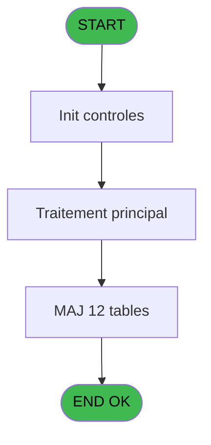
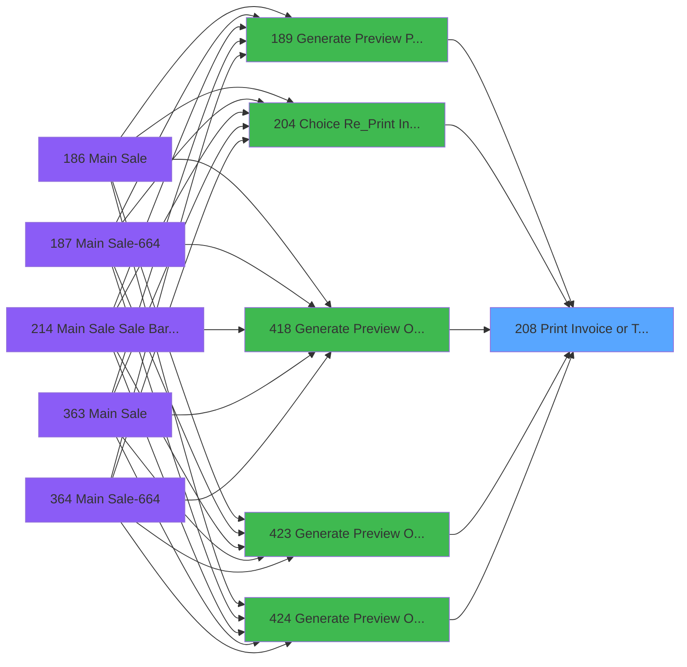
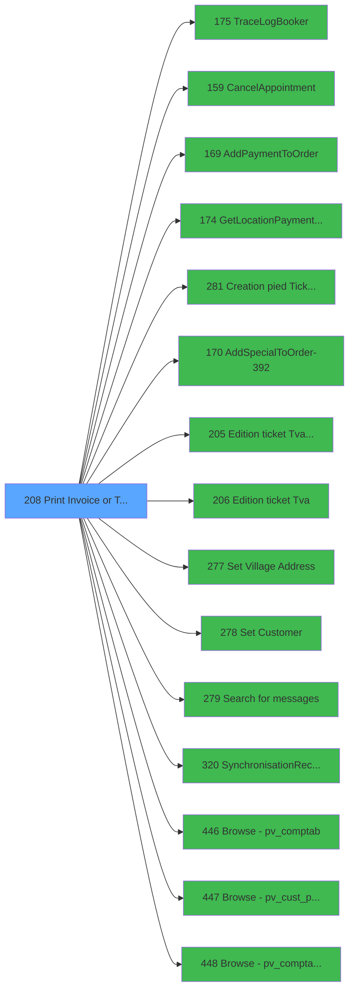

# PVE IDE 208 - Print Invoice or Ticket

> **Analyse**: Phases 1-4 2026-02-03 18:54 -> 18:54 (14s) | Assemblage 18:54
> **Pipeline**: V7.2 Enrichi
> **Structure**: 4 onglets (Resume | Ecrans | Donnees | Connexions)

<!-- TAB:Resume -->

## 1. FICHE D'IDENTITE

| Attribut | Valeur |
|----------|--------|
| Projet | PVE |
| IDE Position | 208 |
| Nom Programme | Print Invoice or Ticket |
| Fichier source | `Prg_208.xml` |
| Dossier IDE | Mobile |
| Taches | 47 (0 ecrans visibles) |
| Tables modifiees | 12 |
| Programmes appeles | 15 |

## 2. DESCRIPTION FONCTIONNELLE

**Print Invoice or Ticket** assure la gestion complete de ce processus, accessible depuis [Generate Preview Payments (IDE 189)](PVE-IDE-189.md), [Choice Re_Print Invoice (IDE 204)](PVE-IDE-204.md), [Generate Preview OD==LEX Book (IDE 418)](PVE-IDE-418.md), [Generate Preview OD==V4 (IDE 423)](PVE-IDE-423.md), [Generate Preview OD==LEX (IDE 424)](PVE-IDE-424.md), [Generate Preview Payments 1212 (IDE 434)](PVE-IDE-434.md), [Generate Preview Payments 1112 (IDE 435)](PVE-IDE-435.md), [Generate Preview Payments 1012 (IDE 436)](PVE-IDE-436.md), [Generate Preview Payment 1212E (IDE 437)](PVE-IDE-437.md), [Generate Preview Payments (IDE 441)](PVE-IDE-441.md).

Le flux de traitement s'organise en **7 blocs fonctionnels** :

- **Traitement** (31 taches) : traitements metier divers
- **Consultation** (5 taches) : ecrans de recherche, selection et consultation
- **Impression** (4 taches) : generation de tickets et documents
- **Validation** (2 taches) : controles et verifications de coherence
- **Creation** (2 taches) : insertion d'enregistrements en base (mouvements, prestations)
- **Calcul** (2 taches) : calculs de montants, stocks ou compteurs
- **Initialisation** (1 tache) : reinitialisation d'etats et de variables de travail

**Donnees modifiees** : 12 tables en ecriture (transac_detail_bar, transac_entete_bar, comptable________cte, pv_ownership, pv_cust_packages, pv_package_composants, import_avertiss__an_val, cumul_mvt_stock_histo, arc_tai_gm, Affectation_Gift_Pass, Table_1501, Table_1548).

**Logique metier** : 1 regles identifiees couvrant conditions metier.

Detail : phases du traitement

#### Phase 1 : Impression (4 taches)

- **208** - Print Invoice **[[ECRAN]](#ecran-t1)**
- **208.11.1** - EDITION
- **208.9** - PRINT AGAIN **[[ECRAN]](#ecran-t38)**
- **208.9.1** - Print Again Gener

Delegue a : [Creation pied Ticket(Tva) (IDE 281)](PVE-IDE-281.md), [Edition ticket (Tva) LEX (IDE 205)](PVE-IDE-205.md), [Edition ticket (Tva) (IDE 206)](PVE-IDE-206.md)

#### Phase 2 : Traitement (31 taches)

- **208.1** - PARAMETERS
- **208.2.1** - Package
- **208.2.2** - Filiation
- **208.3.1.1.1** - Temp generation Gift Pass
- **208.3.1.1.2** - Temp generation
- **208.3.1.1.3** - Temp generation
- **208.3.1.1.4** - Temp generation Gift Pass
- **208.3.1.2** - AddAppointmentToList
- **208.3.1.4.1** - AddAppointmentToList
- **208.3.2.1** - Temp generation
- **208.4** - HISTO
- **208.4.1** - Generation
- **208.4.1.1** - Get header Id
- **208.4.1.3** - Entete Club Med Pass
- **208.4.1.4** - Lines
- **208.4.2** - Package line
- **208.4.2.1** - Club Med Pass
- **208.11.1.1** - Package line **[[ECRAN]](#ecran-t28)**
- **208.11.1.1.1** - Package line
- **208.11.1.2** - Package blank line
- **208.11.1.3** - Filiations
- **208.11.1.3.1** - Ski Shoes Name
- **208.11.1.4** - Editer TVA
- **208.5** - Save File in DB
- **208.6** - Generation CGV Files
- **208.8** - CHECK HISTO
- **208.9.1.2.1** - Temp generation
- **208.9.2** - Trace Again
- **208.10** - Search for Gift Pass
- **208.11** - (sans nom)
- **208.3.1.1.5** - Temp generation Gift Pass

Delegue a : [TraceLogBooker (IDE 175)](PVE-IDE-175.md), [CancelAppointment (IDE 159)](PVE-IDE-159.md), [AddPaymentToOrder (IDE 169)](PVE-IDE-169.md), [GetLocationPaymentSettings (IDE 174)](PVE-IDE-174.md), [AddSpecialToOrder-392 (IDE 170)](PVE-IDE-170.md), [Set Village Address (IDE 277)](PVE-IDE-277.md), [Set Customer (IDE 278)](PVE-IDE-278.md), [Search  for messages (IDE 279)](PVE-IDE-279.md), [SynchronisationRecuPDF (IDE 320)](PVE-IDE-320.md), [Browse - pv_cust_package (IDE 447)](PVE-IDE-447.md)

#### Phase 3 : Initialisation (1 tache)

- **208.2** - RAZ TEMPO

#### Phase 4 : Consultation (5 taches)

- **208.3** - SELECTION **[[ECRAN]](#ecran-t6)**
- **208.3.1** - Selection Packages **[[ECRAN]](#ecran-t7)**
- **208.3.1.4** - Selection Packages **[[ECRAN]](#ecran-t15)**
- **208.3.2** - Selection Filiations
- **208.9.1.2** - Selection Filiations

Delegue a : [GetLocationPaymentSettings (IDE 174)](PVE-IDE-174.md), [SynchronisationRecuPDF (IDE 320)](PVE-IDE-320.md)

#### Phase 5 : Calcul (2 taches)

- **208.3.1.1** - Selection Pv_Compta
- **208.9.1.1** - Load temp compta

Delegue a : [Browse - pv_comptab (IDE 446)](PVE-IDE-446.md), [Browse - pv_comptab_temp (IDE 448)](PVE-IDE-448.md)

#### Phase 6 : Validation (2 taches)

- **208.3.1.3** - Validate/Cancel Booker
- **208.11.2** - Si message en cours de validit **[[ECRAN]](#ecran-t375)**

#### Phase 7 : Creation (2 taches)

- **208.4.1.2** - Create Header SQL
- **208.7** - CreationMail File Traitem 2

#### Tables impactees

| Table | Operations | Role metier |
|-------|-----------|-------------|
| cumul_mvt_stock_histo | **W**/L (14 usages) | Articles et stock |
| import_avertiss__an_val | **W**/L (4 usages) |  |
| Table_1548 | **W** (3 usages) |  |
| arc_tai_gm | **W**/L (2 usages) |  |
| pv_ownership | R/**W** (2 usages) |  |
| pv_cust_packages | **W**/L (2 usages) |  |
| transac_entete_bar | **W** (1 usages) |  |
| Table_1501 | **W** (1 usages) |  |
| comptable________cte | **W** (1 usages) |  |
| Affectation_Gift_Pass | **W** (1 usages) |  |
| transac_detail_bar | **W** (1 usages) |  |
| pv_package_composants | **W** (1 usages) |  |

## 3. BLOCS FONCTIONNELS

### 3.1 Impression (4 taches)

Generation des documents et tickets.

---

#### 208 - Print Invoice [[ECRAN]](#ecran-t1)

**Role** : Generation du document : Print Invoice.
**Ecran** : 869 x 291 DLU (MDI) | [Voir mockup](#ecran-t1)

3 sous-taches directes

| Tache | Nom | Bloc |
|-------|-----|------|
| [208.11.1](#t27) | EDITION | Impression |
| [208.9](#t38) | PRINT AGAIN **[[ECRAN]](#ecran-t38)** | Impression |
| [208.9.1](#t39) | Print Again Gener | Impression |

**Variables liees** : G (P. PrintAgain), T (P.PrintAgainPreview), BF (PrintAgainExecution), BG (PrintAgainCopy)
**Delegue a** : [Creation pied Ticket(Tva) (IDE 281)](PVE-IDE-281.md), [Edition ticket (Tva) LEX (IDE 205)](PVE-IDE-205.md), [Edition ticket (Tva) (IDE 206)](PVE-IDE-206.md)

---

#### 208.11.1 - EDITION

**Role** : Generation du document : EDITION.
**Variables liees** : CG (v.Edition mobilité ?)
**Delegue a** : [Creation pied Ticket(Tva) (IDE 281)](PVE-IDE-281.md), [Edition ticket (Tva) LEX (IDE 205)](PVE-IDE-205.md), [Edition ticket (Tva) (IDE 206)](PVE-IDE-206.md)

---

#### 208.9 - PRINT AGAIN [[ECRAN]](#ecran-t38)

**Role** : Generation du document : PRINT AGAIN.
**Ecran** : 375 x 240 DLU (MDI) | [Voir mockup](#ecran-t38)
**Variables liees** : G (P. PrintAgain), T (P.PrintAgainPreview), BF (PrintAgainExecution), BG (PrintAgainCopy)
**Delegue a** : [Creation pied Ticket(Tva) (IDE 281)](PVE-IDE-281.md), [Edition ticket (Tva) LEX (IDE 205)](PVE-IDE-205.md), [Edition ticket (Tva) (IDE 206)](PVE-IDE-206.md)

---

#### 208.9.1 - Print Again Gener

**Role** : Generation du document : Print Again Gener.
**Variables liees** : G (P. PrintAgain), T (P.PrintAgainPreview), BF (PrintAgainExecution), BG (PrintAgainCopy)
**Delegue a** : [Creation pied Ticket(Tva) (IDE 281)](PVE-IDE-281.md), [Edition ticket (Tva) LEX (IDE 205)](PVE-IDE-205.md), [Edition ticket (Tva) (IDE 206)](PVE-IDE-206.md)

### 3.2 Traitement (31 taches)

Traitements internes.

---

#### 208.1 - PARAMETERS

**Role** : Traitement : PARAMETERS.

---

#### 208.2.1 - Package

**Role** : Traitement : Package.
**Variables liees** : F (P. Package id)

---

#### 208.2.2 - Filiation

**Role** : Traitement : Filiation.
**Variables liees** : E (P. Filiation), O (P.Filiation)

---

#### 208.3.1.1.1 - Temp generation Gift Pass

**Role** : Calcul fidelite/avantage : Temp generation Gift Pass.
**Variables liees** : J (P. Club Med Pass), BU (v Solde Gift Pass), BV (v Existe Gift Pass), BW (v.Message Solde Gift Pass)

---

#### 208.3.1.1.2 - Temp generation

**Role** : Traitement : Temp generation.

---

#### 208.3.1.1.3 - Temp generation

**Role** : Traitement : Temp generation.

---

#### 208.3.1.1.4 - Temp generation Gift Pass

**Role** : Calcul fidelite/avantage : Temp generation Gift Pass.
**Variables liees** : J (P. Club Med Pass), BU (v Solde Gift Pass), BV (v Existe Gift Pass), BW (v.Message Solde Gift Pass)

---

#### 208.3.1.2 - AddAppointmentToList

**Role** : Traitement : AddAppointmentToList.

---

#### 208.3.1.4.1 - AddAppointmentToList

**Role** : Traitement : AddAppointmentToList.

---

#### 208.3.2.1 - Temp generation

**Role** : Traitement : Temp generation.

---

#### 208.4 - HISTO

**Role** : Traitement : HISTO.
**Variables liees** : BH (L ExistHistoric ?)

---

#### 208.4.1 - Generation

**Role** : Traitement : Generation.

---

#### 208.4.1.1 - Get header Id

**Role** : Consultation/chargement : Get header Id.
**Variables liees** : CE (V.header_chrono), BI (HeaderLine01), BJ (HeaderLine02), BK (HeaderLine03), BL (HeaderLine04)

---

#### 208.4.1.3 - Entete Club Med Pass

**Role** : Traitement : Entete Club Med Pass.
**Variables liees** : J (P. Club Med Pass), BU (v Solde Gift Pass), BV (v Existe Gift Pass), BW (v.Message Solde Gift Pass)

---

#### 208.4.1.4 - Lines

**Role** : Traitement : Lines.

---

#### 208.4.2 - Package line

**Role** : Traitement : Package line.
**Variables liees** : F (P. Package id), BI (HeaderLine01), BJ (HeaderLine02), BK (HeaderLine03), BL (HeaderLine04)

---

#### 208.4.2.1 - Club Med Pass

**Role** : Traitement : Club Med Pass.
**Variables liees** : J (P. Club Med Pass), BU (v Solde Gift Pass), BV (v Existe Gift Pass), BW (v.Message Solde Gift Pass)

---

#### 208.11.1.1 - Package line [[ECRAN]](#ecran-t28)

**Role** : Traitement : Package line.
**Ecran** : 557 x 327 DLU (MDI) | [Voir mockup](#ecran-t28)
**Variables liees** : F (P. Package id), BI (HeaderLine01), BJ (HeaderLine02), BK (HeaderLine03), BL (HeaderLine04)

---

#### 208.11.1.1.1 - Package line

**Role** : Traitement : Package line.
**Variables liees** : F (P. Package id), BI (HeaderLine01), BJ (HeaderLine02), BK (HeaderLine03), BL (HeaderLine04)

---

#### 208.11.1.2 - Package blank line

**Role** : Traitement : Package blank line.
**Variables liees** : F (P. Package id), BI (HeaderLine01), BJ (HeaderLine02), BK (HeaderLine03), BL (HeaderLine04)

---

#### 208.11.1.3 - Filiations

**Role** : Traitement : Filiations.

---

#### 208.11.1.3.1 - Ski Shoes Name

**Role** : Traitement : Ski Shoes Name.
**Variables liees** : P (P.File Name Signature mobilité), CD (v.CGV_FileName)

---

#### 208.11.1.4 - Editer TVA

**Role** : Traitement : Editer TVA.

---

#### 208.5 - Save File in DB

**Role** : Traitement : Save File in DB.
**Variables liees** : P (P.File Name Signature mobilité), CD (v.CGV_FileName), CF (V.receipt_file)

---

#### 208.6 - Generation CGV Files

**Role** : Traitement : Generation CGV Files.

---

#### 208.8 - CHECK HISTO

**Role** : Traitement : CHECK HISTO.
**Variables liees** : BH (L ExistHistoric ?)

---

#### 208.9.1.2.1 - Temp generation

**Role** : Traitement : Temp generation.

---

#### 208.9.2 - Trace Again

**Role** : Traitement : Trace Again.
**Variables liees** : G (P. PrintAgain), T (P.PrintAgainPreview), BF (PrintAgainExecution), BG (PrintAgainCopy)

---

#### 208.10 - Search for Gift Pass

**Role** : Calcul fidelite/avantage : Search for Gift Pass.
**Variables liees** : J (P. Club Med Pass), BU (v Solde Gift Pass), BV (v Existe Gift Pass), BW (v.Message Solde Gift Pass)

---

#### 208.11 - (sans nom)

**Role** : Traitement interne.

---

#### 208.3.1.1.5 - Temp generation Gift Pass

**Role** : Calcul fidelite/avantage : Temp generation Gift Pass.
**Variables liees** : J (P. Club Med Pass), BU (v Solde Gift Pass), BV (v Existe Gift Pass), BW (v.Message Solde Gift Pass)

### 3.3 Initialisation (1 tache)

Reinitialisation d'etats et variables de travail.

---

#### 208.2 - RAZ TEMPO

**Role** : Reinitialisation : RAZ TEMPO.

### 3.4 Consultation (5 taches)

Ecrans de recherche et consultation.

---

#### 208.3 - SELECTION [[ECRAN]](#ecran-t6)

**Role** : Selection par l'operateur : SELECTION.
**Ecran** : 640 x 0 DLU (MDI) | [Voir mockup](#ecran-t6)

---

#### 208.3.1 - Selection Packages [[ECRAN]](#ecran-t7)

**Role** : Selection par l'operateur : Selection Packages.
**Ecran** : 814 x 0 DLU (MDI) | [Voir mockup](#ecran-t7)

---

#### 208.3.1.4 - Selection Packages [[ECRAN]](#ecran-t15)

**Role** : Selection par l'operateur : Selection Packages.
**Ecran** : 814 x 0 DLU (MDI) | [Voir mockup](#ecran-t15)

---

#### 208.3.2 - Selection Filiations

**Role** : Selection par l'operateur : Selection Filiations.

---

#### 208.9.1.2 - Selection Filiations

**Role** : Selection par l'operateur : Selection Filiations.

### 3.5 Calcul (2 taches)

Calculs metier : montants, stocks, compteurs.

---

#### 208.3.1.1 - Selection Pv_Compta

**Role** : Selection par l'operateur : Selection Pv_Compta.
**Delegue a** : [Browse - pv_comptab (IDE 446)](PVE-IDE-446.md), [Browse - pv_comptab_temp (IDE 448)](PVE-IDE-448.md)

---

#### 208.9.1.1 - Load temp compta

**Role** : Traitement : Load temp compta.
**Delegue a** : [Browse - pv_comptab (IDE 446)](PVE-IDE-446.md), [Browse - pv_comptab_temp (IDE 448)](PVE-IDE-448.md)

### 3.6 Validation (2 taches)

Controles de coherence : 2 taches verifient les donnees et conditions.

---

#### 208.3.1.3 - Validate/Cancel Booker

**Role** : Verification : Validate/Cancel Booker.

---

#### 208.11.2 - Si message en cours de validit [[ECRAN]](#ecran-t375)

**Role** : Verification : Si message en cours de validit.
**Ecran** : 536 x 0 DLU | [Voir mockup](#ecran-t375)
**Variables liees** : BW (v.Message Solde Gift Pass), CM (v.message)

### 3.7 Creation (2 taches)

Insertion de nouveaux enregistrements en base.

---

#### 208.4.1.2 - Create Header SQL

**Role** : Traitement : Create Header SQL.
**Variables liees** : CE (V.header_chrono), BI (HeaderLine01), BJ (HeaderLine02), BK (HeaderLine03), BL (HeaderLine04)

---

#### 208.7 - CreationMail File Traitem 2

**Role** : Creation d'enregistrement : CreationMail File Traitem 2.
**Variables liees** : P (P.File Name Signature mobilité), CD (v.CGV_FileName), CF (V.receipt_file)
**Delegue a** : [Creation pied Ticket(Tva) (IDE 281)](PVE-IDE-281.md)

## 5. REGLES METIER

1 regles identifiees:

### Autres (1 regles)

#### [RM-001] Si VG33='TB' alors v Existe Gift Pass [BV] sinon '')

| Element | Detail |
|---------|--------|
| **Condition** | `VG33='TB'` |
| **Si vrai** | v Existe Gift Pass [BV] |
| **Si faux** | '') |
| **Variables** | BV (v Existe Gift Pass) |
| **Expression source** | Expression 17 : `IF(VG33='TB',v Existe Gift Pass [BV],'')
` |
| **Exemple** | Si VG33='TB' → v Existe Gift Pass [BV]. Sinon → '') |

## 6. CONTEXTE

- **Appele par**: [Generate Preview Payments (IDE 189)](PVE-IDE-189.md), [Choice Re_Print Invoice (IDE 204)](PVE-IDE-204.md), [Generate Preview OD==LEX Book (IDE 418)](PVE-IDE-418.md), [Generate Preview OD==V4 (IDE 423)](PVE-IDE-423.md), [Generate Preview OD==LEX (IDE 424)](PVE-IDE-424.md), [Generate Preview Payments 1212 (IDE 434)](PVE-IDE-434.md), [Generate Preview Payments 1112 (IDE 435)](PVE-IDE-435.md), [Generate Preview Payments 1012 (IDE 436)](PVE-IDE-436.md), [Generate Preview Payment 1212E (IDE 437)](PVE-IDE-437.md), [Generate Preview Payments (IDE 441)](PVE-IDE-441.md)
- **Appelle**: 15 programmes | **Tables**: 30 (W:12 R:10 L:17) | **Taches**: 47 | **Expressions**: 40

<!-- TAB:Ecrans -->

## 8. ECRANS

*(Programme sans ecran visible)*

## 9. NAVIGATION

### 9.3 Structure hierarchique (47 taches)

| Position | Tache | Type | Dimensions | Bloc |
|----------|-------|------|------------|------|
| **208.1** | [**Print Invoice** (208)](#t1) [mockup](#ecran-t1) | MDI | 869x291 | Impression |
| 208.1.1 | [EDITION (208.11.1)](#t27) | MDI | - | |
| 208.1.2 | [PRINT AGAIN (208.9)](#t38) [mockup](#ecran-t38) | MDI | 375x240 | |
| 208.1.3 | [Print Again Gener (208.9.1)](#t39) | MDI | - | |
| **208.2** | [**PARAMETERS** (208.1)](#t2) | MDI | - | Traitement |
| 208.2.1 | [Package (208.2.1)](#t4) | MDI | - | |
| 208.2.2 | [Filiation (208.2.2)](#t5) | MDI | - | |
| 208.2.3 | [Temp generation Gift Pass (208.3.1.1.1)](#t9) | MDI | - | |
| 208.2.4 | [Temp generation (208.3.1.1.2)](#t10) | MDI | - | |
| 208.2.5 | [Temp generation (208.3.1.1.3)](#t11) | MDI | - | |
| 208.2.6 | [Temp generation Gift Pass (208.3.1.1.4)](#t12) | MDI | - | |
| 208.2.7 | [AddAppointmentToList (208.3.1.2)](#t13) | MDI | - | |
| 208.2.8 | [AddAppointmentToList (208.3.1.4.1)](#t16) | MDI | - | |
| 208.2.9 | [Temp generation (208.3.2.1)](#t18) | MDI | - | |
| 208.2.10 | [HISTO (208.4)](#t19) | MDI | - | |
| 208.2.11 | [Generation (208.4.1)](#t20) | MDI | - | |
| 208.2.12 | [Get header Id (208.4.1.1)](#t21) | - | - | |
| 208.2.13 | [Entete Club Med Pass (208.4.1.3)](#t23) | MDI | - | |
| 208.2.14 | [Lines (208.4.1.4)](#t24) | MDI | - | |
| 208.2.15 | [Package line (208.4.2)](#t25) | MDI | - | |
| 208.2.16 | [Club Med Pass (208.4.2.1)](#t26) | MDI | - | |
| 208.2.17 | [Package line (208.11.1.1)](#t28) [mockup](#ecran-t28) | MDI | 557x327 | |
| 208.2.18 | [Package line (208.11.1.1.1)](#t29) | MDI | - | |
| 208.2.19 | [Package blank line (208.11.1.2)](#t30) | MDI | - | |
| 208.2.20 | [Filiations (208.11.1.3)](#t31) | MDI | - | |
| 208.2.21 | [Ski Shoes Name (208.11.1.3.1)](#t32) | MDI | - | |
| 208.2.22 | [Editer TVA (208.11.1.4)](#t33) | - | - | |
| 208.2.23 | [Save File in DB (208.5)](#t34) | - | - | |
| 208.2.24 | [Generation CGV Files (208.6)](#t35) | - | - | |
| 208.2.25 | [CHECK HISTO (208.8)](#t37) | MDI | - | |
| 208.2.26 | [Temp generation (208.9.1.2.1)](#t42) | MDI | - | |
| 208.2.27 | [Trace Again (208.9.2)](#t43) | MDI | - | |
| 208.2.28 | [Search for Gift Pass (208.10)](#t44) | - | - | |
| 208.2.29 | [(sans nom) (208.11)](#t56) | - | - | |
| 208.2.30 | [Temp generation Gift Pass (208.3.1.1.5)](#t59) | MDI | - | |
| **208.3** | [**RAZ TEMPO** (208.2)](#t3) | MDI | - | Initialisation |
| **208.4** | [**SELECTION** (208.3)](#t6) [mockup](#ecran-t6) | MDI | 640x0 | Consultation |
| 208.4.1 | [Selection Packages (208.3.1)](#t7) [mockup](#ecran-t7) | MDI | 814x0 | |
| 208.4.2 | [Selection Packages (208.3.1.4)](#t15) [mockup](#ecran-t15) | MDI | 814x0 | |
| 208.4.3 | [Selection Filiations (208.3.2)](#t17) | MDI | - | |
| 208.4.4 | [Selection Filiations (208.9.1.2)](#t41) | MDI | - | |
| **208.5** | [**Selection Pv_Compta** (208.3.1.1)](#t8) | MDI | - | Calcul |
| 208.5.1 | [Load temp compta (208.9.1.1)](#t40) | MDI | - | |
| **208.6** | [**Validate/Cancel Booker** (208.3.1.3)](#t14) | MDI | - | Validation |
| 208.6.1 | [Si message en cours de validit (208.11.2)](#t375) [mockup](#ecran-t375) | - | 536x0 | |
| **208.7** | [**Create Header SQL** (208.4.1.2)](#t22) | - | - | Creation |
| 208.7.1 | [CreationMail File Traitem 2 (208.7)](#t36) | - | - | |

### 9.4 Algorigramme

> **Legende**: Vert = START/END OK | Rouge = END KO | Bleu = Decisions
> *Algorigramme auto-genere. Utiliser `/algorigramme` pour une synthese metier detaillee.*

<!-- TAB:Donnees -->

## 10. TABLES

### Tables utilisees (30)

| ID | Nom | Description | Type | R | W | L | Usages |
|----|-----|-------------|------|---|---|---|--------|
| 14 | transac_detail_bar |  | DB |   | **W** |   | 1 |
| 15 | transac_entete_bar |  | DB |   | **W** |   | 1 |
| 31 | gm-complet_______gmc |  | DB | R |   |   | 2 |
| 34 | hebergement______heb | Hebergement (chambres) | DB |   |   | L | 1 |
| 36 | client_gm |  | DB | R |   |   | 1 |
| 40 | comptable________cte |  | DB |   | **W** |   | 1 |
| 67 | tables___________tab |  | DB |   |   | L | 1 |
| 263 | vente | Donnees de ventes | DB |   |   | L | 1 |
| 268 | cc_total_par_type |  | DB | R |   |   | 1 |
| 377 | pv_contracts |  | DB | R |   |   | 1 |
| 379 | pv_customer_temp |  | DB | R |   | L | 2 |
| 382 | pv_discount_reasons |  | DB | R |   | L | 8 |
| 395 | pv_ownership |  | DB | R | **W** |   | 2 |
| 396 | pv_cust_packages |  | DB |   | **W** | L | 2 |
| 397 | pv_package_composants |  | DB |   | **W** |   | 1 |
| 400 | pv_cust_rentals |  | DB |   |   | L | 6 |
| 403 | pv_sellers |  | DB | R |   | L | 3 |
| 404 | pv_sellers_by_week |  | DB | R |   | L | 4 |
| 413 | pv_tva |  | DB |   |   | L | 2 |
| 417 | pv_weight |  | DB |   |   | L | 1 |
| 419 | realise_articles_caution | Articles et stock | DB |   |   | L | 3 |
| 531 | import_avertiss__an_val |  | DB |   | **W** | L | 4 |
| 533 | cumul_mvt_stock_histo | Articles et stock | TMP |   | **W** | L | 14 |
| 731 | arc_tai_gm |  | DB |   | **W** | L | 2 |
| 820 | Commentaire supprime |  | DB |   |   | L | 1 |
| 866 | maj_appli_tpe |  | DB | R |   |   | 1 |
| 868 | Affectation_Gift_Pass |  | DB |   | **W** |   | 1 |
| 1501 | Table_1501 |  | MEM |   | **W** |   | 1 |
| 1539 | Table_1539 |  | MEM |   |   | L | 2 |
| 1548 | Table_1548 |  | MEM |   | **W** |   | 3 |

### Colonnes par table (17 / 21 tables avec colonnes identifiees)

Table 14 - transac_detail_bar (**W**) - 1 usages

| Lettre | Variable | Acces | Type |
|--------|----------|-------|------|
| V | P.Num transaction_Axis | W | Alpha |

Table 15 - transac_entete_bar (**W**) - 1 usages

| Lettre | Variable | Acces | Type |
|--------|----------|-------|------|
| V | P.Num transaction_Axis | W | Alpha |

Table 31 - gm-complet_______gmc (R) - 2 usages

| Lettre | Variable | Acces | Type |
|--------|----------|-------|------|
| A | CautionExist | R | Logical |
| B | v.texte_contions_gen_F | R | Unicode |
| C | v.texte_contions_gen_E | R | Unicode |
| D | PrintLinePackagesInCurrentPage | R | Numeric |
| E | CurrentLinePackagesChrono | R | Numeric |
| F | TotalLinePackagesChrono | R | Numeric |
| G | PageNumber | R | Numeric |
| H | TotalLinePackages | R | Numeric |
| I | TotalTVA | R | Numeric |
| J | TotalTTCDiscounted | R | Numeric |
| K | TotalTo Pay | R | Numeric |
| L | TotalOnAccount | R | Numeric |
| M | ExisteMontantTva | R | Logical |
| N | AssuranceOnly | R | Logical |
| O | v.N°Chrono GP Cancel | R | Numeric |
| P | v.Liste des TVA taux Réduit | R | Unicode |
| Q | v.Nombre de taux réduit | R | Numeric |
| R | v.N° Taux reduit en cours | R | Numeric |
| S | v.Taux réduit en cours | R | Unicode |
| T | v.Text à éditer si pdt tx redu | R | Unicode |
| U | v.Libelle TVA | R | Unicode |
| V | v.Libelle Montant HT | R | Unicode |

Table 36 - client_gm (R) - 1 usages

| Lettre | Variable | Acces | Type |
|--------|----------|-------|------|
| A | P. Payer XCust Id | R | Numeric |
| B | P. Customer Id | R | Numeric |
| C | P. Societe | R | Alpha |
| D | P. Compte | R | Numeric |
| E | P. Filiation | R | Numeric |
| F | P. Package id | R | Numeric |
| G | P. PrintAgain | R | Logical |
| H | P. Total Ticket | R | Numeric |
| I | P. Total Crédit Conso | R | Numeric |
| J | P. Club Med Pass | R | Alpha |
| K | P. Card type | R | Alpha |
| L | P. Service | R | Alpha |
| M | P.Societe | R | Alpha |
| N | P.Adherent | R | Numeric |
| O | P.Filiation | R | Numeric |
| P | P.File Name Signature mobilité | R | Numeric |
| Q | p.ValidationMail | R | Logical |
| R | P Adresse Mail (MOB) | R | Alpha |
| S | p.No_Facture | R | Numeric |
| T | P.PrintAgainPreview | R | Logical |
| U | P.NomFichierPdf | R | Alpha |
| V | P.Num transaction_Axis | R | Alpha |
| W | P.Num_Id_Acceptation | R | Alpha |
| X | P.NotCancelBooking | R | Logical |
| Y | P.O N° Chrono | R | Numeric |
| Z | V VillageCode | R | Alpha |
| BA | V AmountFormat | R | Alpha |
| BB | V AmountFormat SANS Z | R | Alpha |
| BC | V VatValue | R | Numeric |
| BD | V Currency | R | Alpha |
| BE | V Decimal | R | Numeric |
| BF | PrintAgainExecution | R | Logical |
| BG | PrintAgainCopy | R | Numeric |
| BH | L ExistHistoric ? | R | Logical |
| BI | HeaderLine01 | R | Alpha |
| BJ | HeaderLine02 | R | Alpha |
| BK | HeaderLine03 | R | Alpha |
| BL | HeaderLine04 | R | Alpha |
| BM | HeaderLine05 | R | Alpha |
| BN | HeaderLine06 | R | Alpha |
| BO | HeaderLine07 | R | Alpha |
| BP | HeaderLine08 | R | Alpha |
| BQ | HeaderLine09 | R | Alpha |
| BR | HeaderLine10 | R | Alpha |
| BS | HeaderLine11 | R | Alpha |
| BT | V Facture | R | Numeric |
| BU | v Solde Gift Pass | R | Numeric |
| BV | v Existe Gift Pass | R | Logical |
| BW | v.Message Solde Gift Pass | R | Alpha |
| BX | V Nom Fic Pdf Ticket Mobilit | R | Alpha |
| BY | v Langue Mail | R | Alpha |
| BZ | v Validation envoi mail ? | R | Logical |
| CA | V.Fait parti d'un séminaire? | R | Logical |
| CB | v.NbrSales | R | Numeric |
| CC | v.NbrRentals | R | Numeric |
| CD | v.CGV_FileName | R | Alpha |
| CE | V.header_chrono | R | Numeric |
| CF | V.receipt_file | R | Unicode |
| CG | v.Edition mobilité ? | R | Logical |
| CH | v.Support Initial | R | Unicode |
| CI | v.Montant Product | R | Numeric |
| CJ | v.Montant Service | R | Numeric |
| CK | v.Article forcé? | R | Logical |
| CL | v. Copies | R | Numeric |
| CM | v.message | R | Alpha |
| CN | v.Total pour affich M&E | R | Numeric |

Table 40 - comptable________cte (**W**) - 1 usages

| Lettre | Variable | Acces | Type |
|--------|----------|-------|------|
| A | T OD ? | W | Logical |
| B | T Vente ? | W | Logical |

Table 268 - cc_total_par_type (R) - 1 usages

| Lettre | Variable | Acces | Type |
|--------|----------|-------|------|
| A | v.total tva | R | Numeric |
| CN | v.Total pour affich M&E | R | Numeric |
| F | TotalLinePackagesChrono | R | Numeric |
| H | P. Total Ticket | R | Numeric |
| I | P. Total Crédit Conso | R | Numeric |
| J | TotalTTCDiscounted | R | Numeric |
| K | P. Card type | R | Alpha |
| L | TotalOnAccount | R | Numeric |
| R | v.Montant total Ligne | R | Numeric |

Table 377 - pv_contracts (R) - 1 usages

*Table utilisee uniquement en Link ou aucune colonne Real identifiee dans le DataView.*

Table 379 - pv_customer_temp (R/L) - 2 usages

| Lettre | Variable | Acces | Type |
|--------|----------|-------|------|
| A | V.packageID | R | Numeric |
| B | V.PaymentMethodeID | R | Numeric |
| C | FirstRecord | R | Logical |

Table 382 - pv_discount_reasons (R/L) - 8 usages

| Lettre | Variable | Acces | Type |
|--------|----------|-------|------|
| A | v.existe ligne suivante | R | Logical |
| B | -------------package OUT | R | Alpha |
| C | v lien Package Out | R | Logical |
| D | v.Coef multiplicateur | R | Numeric |
| E | -------------rentals OUT | R | Alpha |
| F | -------------package IN | R | Alpha |
| G | v lien Package In? | R | Logical |
| H | v.Exchange? | R | Logical |
| I | v.Early Return? | R | Logical |
| J | -------------rentals IN | R | Alpha |
| K | v.Montant article | R | Numeric |
| L | StartDate | R | Date |
| M | EndDate | R | Date |
| N | Days | R | Numeric |
| O | LibelléAssurance | R | Alpha |
| P | Iteration Edit Gift Pass | R | Numeric |
| Q | v.Taxes Multiples | R | Logical |
| R | v.Montant total Ligne | R | Numeric |
| S | v.TVA taux reduit ? | R | Logical |
| T | v.Edition Blanc apres Ligne GP? | R | Logical |
| U | v.Cas RETURN | R | Logical |
| V | v.Cas EXCHANGE materiel | R | Logical |
| W | v.Cas EXCHANGE mat+dur | R | Logical |
| X | v.Prix pour EXCH mat+dur | R | Numeric |
| Y | v.Montant de la ligne pour M&E | R | Numeric |

Table 395 - pv_ownership (R/**W**) - 2 usages

*Table utilisee uniquement en Link ou aucune colonne Real identifiee dans le DataView.*

Table 396 - pv_cust_packages (**W**/L) - 2 usages

| Lettre | Variable | Acces | Type |
|--------|----------|-------|------|
| A | P. Payer XCust Id | W | Numeric |
| B | P. Customer Id | W | Numeric |
| D | PrintLinePackagesInCurrentPage | W | Numeric |
| E | CurrentLinePackagesChrono | W | Numeric |
| F | TotalLinePackagesChrono | W | Numeric |
| H | TotalLinePackages | W | Numeric |

Table 397 - pv_package_composants (**W**) - 1 usages

| Lettre | Variable | Acces | Type |
|--------|----------|-------|------|
| A | V.packageID | W | Numeric |
| B | V.packageID | W | Numeric |
| C | v lien Package Out | W | Logical |
| D | PrintLinePackagesInCurrentPage | W | Numeric |
| E | L.Forfait/Package existe | W | Logical |
| F | P. Package id | W | Numeric |
| G | v lien Package In? | W | Logical |
| H | TotalLinePackages | W | Numeric |

Table 403 - pv_sellers (R/L) - 3 usages

| Lettre | Variable | Acces | Type |
|--------|----------|-------|------|
| A | v.Update pour booker | R | Unicode |
| B | V.packageID | R | Numeric |
| C | V.PaymentMethodeID | R | Numeric |
| D | FirstRecord | R | Logical |
| E | L.Forfait/Package existe | R | Logical |
| F | v.Log | R | Unicode |

Table 404 - pv_sellers_by_week (R/L) - 4 usages

*Table utilisee uniquement en Link ou aucune colonne Real identifiee dans le DataView.*

Table 531 - import_avertiss__an_val (**W**/L) - 4 usages

*Table utilisee uniquement en Link ou aucune colonne Real identifiee dans le DataView.*

Table 533 - cumul_mvt_stock_histo (**W**/L) - 14 usages

| Lettre | Variable | Acces | Type |
|--------|----------|-------|------|
| A | V.Chrono TENV10 | W | Numeric |
| B | v.Date Ticket | W | Date |
| C | v.Heure Ticket | W | Time |

Table 731 - arc_tai_gm (**W**/L) - 2 usages

| Lettre | Variable | Acces | Type |
|--------|----------|-------|------|
| A | v.sales_cgv_file_name | W | Alpha |
| B | v.rentals_cgv_file_name | W | Alpha |
| C | v.RepertoireCGV | W | Alpha |

Table 866 - maj_appli_tpe (R) - 1 usages

*Table utilisee uniquement en Link ou aucune colonne Real identifiee dans le DataView.*

Table 868 - Affectation_Gift_Pass (**W**) - 1 usages

| Lettre | Variable | Acces | Type |
|--------|----------|-------|------|
| BU | v Solde Gift Pass | W | Numeric |
| BV | v Existe Gift Pass | W | Logical |
| BW | v.Message Solde Gift Pass | W | Alpha |
| J | P. Club Med Pass | W | Alpha |
| P | Iteration Edit Gift Pass | W | Numeric |

Table 1501 - Table_1501 (**W**) - 1 usages

*Table utilisee uniquement en Link ou aucune colonne Real identifiee dans le DataView.*

Table 1548 - Table_1548 (**W**) - 3 usages

*Table utilisee uniquement en Link ou aucune colonne Real identifiee dans le DataView.*

## 11. VARIABLES

### 11.1 Parametres entrants (25)

Variables recues du programme appelant ([Generate Preview Payments (IDE 189)](PVE-IDE-189.md)).

| Lettre | Nom | Type | Usage dans |
|--------|-----|------|-----------|
| A | P. Payer XCust Id | Numeric | 3x parametre entrant |
| B | P. Customer Id | Numeric | 2x parametre entrant |
| C | P. Societe | Alpha | - |
| D | P. Compte | Numeric | 1x parametre entrant |
| E | P. Filiation | Numeric | [208.2.2](#t5), [208.3.2](#t17), [208.11.1.3](#t31) |
| F | P. Package id | Numeric | [208.2.1](#t4), [208.3.1](#t7), [208.3.1.4](#t15) |
| G | P. PrintAgain | Logical | 3x parametre entrant |
| H | P. Total Ticket | Numeric | - |
| I | P. Total Crédit Conso | Numeric | 1x parametre entrant |
| J | P. Club Med Pass | Alpha | - |
| K | P. Card type | Alpha | - |
| L | P. Service | Alpha | - |
| M | P.Societe | Alpha | 2x parametre entrant |
| N | P.Adherent | Numeric | - |
| O | P.Filiation | Numeric | - |
| P | P.File Name Signature mobilité | Numeric | - |
| Q | p.ValidationMail | Logical | 1x parametre entrant |
| R | P Adresse Mail (MOB) | Alpha | [208.7](#t36) |
| S | p.No_Facture | Numeric | - |
| T | P.PrintAgainPreview | Logical | - |
| U | P.NomFichierPdf | Alpha | - |
| V | P.Num transaction_Axis | Alpha | - |
| W | P.Num_Id_Acceptation | Alpha | - |
| X | P.NotCancelBooking | Logical | - |
| Y | P.O N° Chrono | Numeric | - |

### 11.2 Variables de session (27)

Variables persistantes pendant toute la session.

| Lettre | Nom | Type | Usage dans |
|--------|-----|------|-----------|
| Z | V VillageCode | Alpha | - |
| BA | V AmountFormat | Alpha | 1x session |
| BB | V AmountFormat SANS Z | Alpha | - |
| BC | V VatValue | Numeric | 1x session |
| BD | V Currency | Alpha | - |
| BE | V Decimal | Numeric | - |
| BT | V Facture | Numeric | - |
| BU | v Solde Gift Pass | Numeric | - |
| BV | v Existe Gift Pass | Logical | [208.3.1.1.1](#t9), [208.3.1.1.4](#t12), [208.4.1.3](#t23) |
| BW | v.Message Solde Gift Pass | Alpha | - |
| BX | V Nom Fic Pdf Ticket Mobilit | Alpha | - |
| BY | v Langue Mail | Alpha | - |
| BZ | v Validation envoi mail ? | Logical | - |
| CA | V.Fait parti d'un séminaire? | Logical | - |
| CB | v.NbrSales | Numeric | - |
| CC | v.NbrRentals | Numeric | - |
| CD | v.CGV_FileName | Alpha | - |
| CE | V.header_chrono | Numeric | - |
| CF | V.receipt_file | Unicode | 1x session |
| CG | v.Edition mobilité ? | Logical | - |
| CH | v.Support Initial | Unicode | - |
| CI | v.Montant Product | Numeric | - |
| CJ | v.Montant Service | Numeric | - |
| CK | v.Article forcé? | Logical | - |
| CL | v. Copies | Numeric | - |
| CM | v.message | Alpha | - |
| CN | v.Total pour affich M&E | Numeric | - |

### 11.3 Autres (14)

Variables diverses.

| Lettre | Nom | Type | Usage dans |
|--------|-----|------|-----------|
| BF | PrintAgainExecution | Logical | - |
| BG | PrintAgainCopy | Numeric | - |
| BH | L ExistHistoric ? | Logical | - |
| BI | HeaderLine01 | Alpha | - |
| BJ | HeaderLine02 | Alpha | 1x refs |
| BK | HeaderLine03 | Alpha | 1x refs |
| BL | HeaderLine04 | Alpha | - |
| BM | HeaderLine05 | Alpha | 1x refs |
| BN | HeaderLine06 | Alpha | 1x refs |
| BO | HeaderLine07 | Alpha | 1x refs |
| BP | HeaderLine08 | Alpha | - |
| BQ | HeaderLine09 | Alpha | - |
| BR | HeaderLine10 | Alpha | 1x refs |
| BS | HeaderLine11 | Alpha | 1x refs |

Toutes les 66 variables (liste complete)

| Cat | Lettre | Nom Variable | Type |
|-----|--------|--------------|------|
| P0 | **A** | P. Payer XCust Id | Numeric |
| P0 | **B** | P. Customer Id | Numeric |
| P0 | **C** | P. Societe | Alpha |
| P0 | **D** | P. Compte | Numeric |
| P0 | **E** | P. Filiation | Numeric |
| P0 | **F** | P. Package id | Numeric |
| P0 | **G** | P. PrintAgain | Logical |
| P0 | **H** | P. Total Ticket | Numeric |
| P0 | **I** | P. Total Crédit Conso | Numeric |
| P0 | **J** | P. Club Med Pass | Alpha |
| P0 | **K** | P. Card type | Alpha |
| P0 | **L** | P. Service | Alpha |
| P0 | **M** | P.Societe | Alpha |
| P0 | **N** | P.Adherent | Numeric |
| P0 | **O** | P.Filiation | Numeric |
| P0 | **P** | P.File Name Signature mobilité | Numeric |
| P0 | **Q** | p.ValidationMail | Logical |
| P0 | **R** | P Adresse Mail (MOB) | Alpha |
| P0 | **S** | p.No_Facture | Numeric |
| P0 | **T** | P.PrintAgainPreview | Logical |
| P0 | **U** | P.NomFichierPdf | Alpha |
| P0 | **V** | P.Num transaction_Axis | Alpha |
| P0 | **W** | P.Num_Id_Acceptation | Alpha |
| P0 | **X** | P.NotCancelBooking | Logical |
| P0 | **Y** | P.O N° Chrono | Numeric |
| V. | **Z** | V VillageCode | Alpha |
| V. | **BA** | V AmountFormat | Alpha |
| V. | **BB** | V AmountFormat SANS Z | Alpha |
| V. | **BC** | V VatValue | Numeric |
| V. | **BD** | V Currency | Alpha |
| V. | **BE** | V Decimal | Numeric |
| V. | **BT** | V Facture | Numeric |
| V. | **BU** | v Solde Gift Pass | Numeric |
| V. | **BV** | v Existe Gift Pass | Logical |
| V. | **BW** | v.Message Solde Gift Pass | Alpha |
| V. | **BX** | V Nom Fic Pdf Ticket Mobilit | Alpha |
| V. | **BY** | v Langue Mail | Alpha |
| V. | **BZ** | v Validation envoi mail ? | Logical |
| V. | **CA** | V.Fait parti d'un séminaire? | Logical |
| V. | **CB** | v.NbrSales | Numeric |
| V. | **CC** | v.NbrRentals | Numeric |
| V. | **CD** | v.CGV_FileName | Alpha |
| V. | **CE** | V.header_chrono | Numeric |
| V. | **CF** | V.receipt_file | Unicode |
| V. | **CG** | v.Edition mobilité ? | Logical |
| V. | **CH** | v.Support Initial | Unicode |
| V. | **CI** | v.Montant Product | Numeric |
| V. | **CJ** | v.Montant Service | Numeric |
| V. | **CK** | v.Article forcé? | Logical |
| V. | **CL** | v. Copies | Numeric |
| V. | **CM** | v.message | Alpha |
| V. | **CN** | v.Total pour affich M&E | Numeric |
| Autre | **BF** | PrintAgainExecution | Logical |
| Autre | **BG** | PrintAgainCopy | Numeric |
| Autre | **BH** | L ExistHistoric ? | Logical |
| Autre | **BI** | HeaderLine01 | Alpha |
| Autre | **BJ** | HeaderLine02 | Alpha |
| Autre | **BK** | HeaderLine03 | Alpha |
| Autre | **BL** | HeaderLine04 | Alpha |
| Autre | **BM** | HeaderLine05 | Alpha |
| Autre | **BN** | HeaderLine06 | Alpha |
| Autre | **BO** | HeaderLine07 | Alpha |
| Autre | **BP** | HeaderLine08 | Alpha |
| Autre | **BQ** | HeaderLine09 | Alpha |
| Autre | **BR** | HeaderLine10 | Alpha |
| Autre | **BS** | HeaderLine11 | Alpha |

## 12. EXPRESSIONS

**40 / 40 expressions decodees (100%)**

### 12.1 Repartition par type

| Type | Expressions | Regles |
|------|-------------|--------|
| FORMAT | 4 | 0 |
| CONDITION | 9 | 5 |
| CONSTANTE | 6 | 0 |
| NEGATION | 2 | 0 |
| OTHER | 13 | 0 |
| CAST_LOGIQUE | 1 | 0 |
| REFERENCE_VG | 3 | 0 |
| STRING | 1 | 0 |
| CONCATENATION | 1 | 0 |

### 12.2 Expressions cles par type

#### FORMAT (4 expressions)

| Type | IDE | Expression | Regle |
|------|-----|------------|-------|
| FORMAT | 18 | `'Receipt_'&Trim(P.Societe [M])&'_'&Trim(Str([AU],'6Z'))&'_'&DStr(Date(),'YYYYMMDD')&'.pdf'` | - |
| FORMAT | 23 | `'Error during the sale receipt generation.
Please contact the support with the following information :
Payer Id : '&Str(P. Payer XCust Id [A],'9')&ASCIIChr(13)
&'Customer Id : '&IF(P. Customer Id [B]=0,'All Filiations',Str(P. Customer Id [B],'9'))&ASCIIChr(13)
&'Package Id : '&IF(P. Package id [F]=0,'All Packages',Str(P. Package id [F],'9'))&ASCIIChr(13)
&'Date : '&DStr(Date(),'DD/MM/YYYY')&ASCIIChr(13)
&'Time : '&TStr(Time(),'HH:MM:SS')` | - |
| FORMAT | 31 | `StrBuild('Ticket @1@ @2@ @3@ (@4@/@5@, package @6@)', HeaderLine03 [BK], HeaderLine02 [BJ], Str(P. Total Crédit Conso [I], 'N10.2'), Str(P. Compte [D], '8'), Str(P. Filiation [E], '3'), IF(P. Package id [F]=0, '(all)',Str(P. Package id [F], '10')))` | - |
| FORMAT | 12 | `'Solde Gift Pass au : '&DStr(Date(),'DD/MM/YYYY')&' à : '&TStr(Time(),('HH:MM:SS'))` | - |

#### CONDITION (9 expressions)

| Type | IDE | Expression | Regle |
|------|-----|------------|-------|
| CONDITION | 17 | `IF(VG33='TB',v Existe Gift Pass [BV],'')
` | [RM-001](#rm-RM-001) |
| CONDITION | 26 | `HeaderLine10 [BR] > 0 OR HeaderLine11 [BS] > 0` | - |
| CONDITION | 16 | `VG33='TB' OR (VG115 AND P Adresse Mail (MOB) [R])` | - |
| CONDITION | 40 | `Trim([CR])<>''` | - |
| CONDITION | 32 | `(VG33='TB' OR VG33='WS' AND  VG115) 
AND 
p.ValidationMail [Q]<>0 
AND 
NOT P. PrintAgain [G]` | - |
| ... | | *+4 autres* | |

#### CONSTANTE (6 expressions)

| Type | IDE | Expression | Regle |
|------|-----|------------|-------|
| CONSTANTE | 28 | `'ERROR'` | - |
| CONSTANTE | 29 | `'PRINT INVOICE/TICKET'` | - |
| CONSTANTE | 30 | `'ERR'` | - |
| CONSTANTE | 2 | `1` | - |
| CONSTANTE | 9 | `'VSERV'` | - |
| ... | | *+1 autres* | |

#### NEGATION (2 expressions)

| Type | IDE | Expression | Regle |
|------|-----|------------|-------|
| NEGATION | 7 | `NOT ([AI])` | - |
| NEGATION | 5 | `NOT (P. PrintAgain [G])` | - |

#### OTHER (13 expressions)

| Type | IDE | Expression | Regle |
|------|-----|------------|-------|
| OTHER | 36 | `MAX(V.receipt_file [CF],1)` | - |
| OTHER | 35 | `P.Societe [M]` | - |
| OTHER | 34 | `NULL()` | - |
| OTHER | 39 | `HeaderLine07 [BO]` | - |
| OTHER | 38 | `HeaderLine06 [BN]` | - |
| ... | | *+8 autres* | |

#### CAST_LOGIQUE (1 expressions)

| Type | IDE | Expression | Regle |
|------|-----|------------|-------|
| CAST_LOGIQUE | 8 | `GetParam ('RENTAL')='TRUE'LOG` | - |

#### REFERENCE_VG (3 expressions)

| Type | IDE | Expression | Regle |
|------|-----|------------|-------|
| REFERENCE_VG | 33 | `VG33` | - |
| REFERENCE_VG | 25 | `VG83` | - |
| REFERENCE_VG | 13 | `VG29` | - |

#### STRING (1 expressions)

| Type | IDE | Expression | Regle |
|------|-----|------------|-------|
| STRING | 24 | `FileExist(Trim(v Existe Gift Pass [BV]))` | - |

#### CONCATENATION (1 expressions)

| Type | IDE | Expression | Regle |
|------|-----|------------|-------|
| CONCATENATION | 27 | `Trim(VG79)&Trim(V VatValue [BC])` | - |

### 12.3 Toutes les expressions (40)

Voir les 40 expressions

#### FORMAT (4)

| IDE | Expression Decodee |
|-----|-------------------|
| 31 | `StrBuild('Ticket @1@ @2@ @3@ (@4@/@5@, package @6@)', HeaderLine03 [BK], HeaderLine02 [BJ], Str(P. Total Crédit Conso [I], 'N10.2'), Str(P. Compte [D], '8'), Str(P. Filiation [E], '3'), IF(P. Package id [F]=0, '(all)',Str(P. Package id [F], '10')))` |
| 12 | `'Solde Gift Pass au : '&DStr(Date(),'DD/MM/YYYY')&' à : '&TStr(Time(),('HH:MM:SS'))` |
| 18 | `'Receipt_'&Trim(P.Societe [M])&'_'&Trim(Str([AU],'6Z'))&'_'&DStr(Date(),'YYYYMMDD')&'.pdf'` |
| 23 | `'Error during the sale receipt generation.
Please contact the support with the following information :
Payer Id : '&Str(P. Payer XCust Id [A],'9')&ASCIIChr(13)
&'Customer Id : '&IF(P. Customer Id [B]=0,'All Filiations',Str(P. Customer Id [B],'9'))&ASCIIChr(13)
&'Package Id : '&IF(P. Package id [F]=0,'All Packages',Str(P. Package id [F],'9'))&ASCIIChr(13)
&'Date : '&DStr(Date(),'DD/MM/YYYY')&ASCIIChr(13)
&'Time : '&TStr(Time(),'HH:MM:SS')` |

#### CONDITION (9)

| IDE | Expression Decodee |
|-----|-------------------|
| 17 | `IF(VG33='TB',v Existe Gift Pass [BV],'')
` |
| 1 | `P. Payer XCust Id [A]=0` |
| 3 | `DbRecs ('{533,3}'DSOURCE,'')=0` |
| 4 | `DbRecs ('{533,3}'DSOURCE,'')>0` |
| 15 | `VG33='TB'` |
| 16 | `VG33='TB' OR (VG115 AND P Adresse Mail (MOB) [R])` |
| 26 | `HeaderLine10 [BR] > 0 OR HeaderLine11 [BS] > 0` |
| 32 | `(VG33='TB' OR VG33='WS' AND  VG115) 
AND 
p.ValidationMail [Q]<>0 
AND 
NOT P. PrintAgain [G]` |
| 40 | `Trim([CR])<>''` |

#### CONSTANTE (6)

| IDE | Expression Decodee |
|-----|-------------------|
| 2 | `1` |
| 9 | `'VSERV'` |
| 10 | `'O'` |
| 28 | `'ERROR'` |
| 29 | `'PRINT INVOICE/TICKET'` |
| 30 | `'ERR'` |

#### NEGATION (2)

| IDE | Expression Decodee |
|-----|-------------------|
| 5 | `NOT (P. PrintAgain [G])` |
| 7 | `NOT ([AI])` |

#### OTHER (13)

| IDE | Expression Decodee |
|-----|-------------------|
| 6 | `P. PrintAgain [G]` |
| 11 | `GetParam('SERVICE')` |
| 14 | `V AmountFormat [BA]` |
| 19 | `SetCrsr (1)` |
| 20 | `P. Payer XCust Id [A]` |
| 21 | `P. Customer Id [B]` |
| 22 | `P Adresse Mail (MOB) [R]` |
| 34 | `NULL()` |
| 35 | `P.Societe [M]` |
| 36 | `MAX(V.receipt_file [CF],1)` |
| 37 | `HeaderLine05 [BM]` |
| 38 | `HeaderLine06 [BN]` |
| 39 | `HeaderLine07 [BO]` |

#### CAST_LOGIQUE (1)

| IDE | Expression Decodee |
|-----|-------------------|
| 8 | `GetParam ('RENTAL')='TRUE'LOG` |

#### REFERENCE_VG (3)

| IDE | Expression Decodee |
|-----|-------------------|
| 13 | `VG29` |
| 25 | `VG83` |
| 33 | `VG33` |

#### STRING (1)

| IDE | Expression Decodee |
|-----|-------------------|
| 24 | `FileExist(Trim(v Existe Gift Pass [BV]))` |

#### CONCATENATION (1)

| IDE | Expression Decodee |
|-----|-------------------|
| 27 | `Trim(VG79)&Trim(V VatValue [BC])` |

<!-- TAB:Connexions -->

## 13. GRAPHE D'APPELS

### 13.1 Chaine depuis Main (Callers)

Main -> ... -> [Generate Preview Payments (IDE 189)](PVE-IDE-189.md) -> **Print Invoice or Ticket (IDE 208)**

Main -> ... -> [Choice Re_Print Invoice (IDE 204)](PVE-IDE-204.md) -> **Print Invoice or Ticket (IDE 208)**

Main -> ... -> [Generate Preview OD==LEX Book (IDE 418)](PVE-IDE-418.md) -> **Print Invoice or Ticket (IDE 208)**

Main -> ... -> [Generate Preview OD==V4 (IDE 423)](PVE-IDE-423.md) -> **Print Invoice or Ticket (IDE 208)**

Main -> ... -> [Generate Preview OD==LEX (IDE 424)](PVE-IDE-424.md) -> **Print Invoice or Ticket (IDE 208)**

Main -> ... -> [Generate Preview Payments 1212 (IDE 434)](PVE-IDE-434.md) -> **Print Invoice or Ticket (IDE 208)**

Main -> ... -> [Generate Preview Payments 1112 (IDE 435)](PVE-IDE-435.md) -> **Print Invoice or Ticket (IDE 208)**

Main -> ... -> [Generate Preview Payments 1012 (IDE 436)](PVE-IDE-436.md) -> **Print Invoice or Ticket (IDE 208)**

Main -> ... -> [Generate Preview Payment 1212E (IDE 437)](PVE-IDE-437.md) -> **Print Invoice or Ticket (IDE 208)**

Main -> ... -> [Generate Preview Payments (IDE 441)](PVE-IDE-441.md) -> **Print Invoice or Ticket (IDE 208)**

### 13.2 Callers

| IDE | Nom Programme | Nb Appels |
|-----|---------------|-----------|
| [189](PVE-IDE-189.md) | Generate Preview Payments | 1 |
| [204](PVE-IDE-204.md) | Choice Re_Print Invoice | 1 |
| [418](PVE-IDE-418.md) | Generate Preview OD==LEX Book | 1 |
| [423](PVE-IDE-423.md) | Generate Preview OD==V4 | 1 |
| [424](PVE-IDE-424.md) | Generate Preview OD==LEX | 1 |
| [434](PVE-IDE-434.md) | Generate Preview Payments 1212 | 1 |
| [435](PVE-IDE-435.md) | Generate Preview Payments 1112 | 1 |
| [436](PVE-IDE-436.md) | Generate Preview Payments 1012 | 1 |
| [437](PVE-IDE-437.md) | Generate Preview Payment 1212E | 1 |
| [441](PVE-IDE-441.md) | Generate Preview Payments | 1 |

### 13.3 Callees (programmes appeles)

### 13.4 Detail Callees avec contexte

| IDE | Nom Programme | Appels | Contexte |
|-----|---------------|--------|----------|
| [175](PVE-IDE-175.md) | TraceLogBooker | 3 | Sous-programme |
| [159](PVE-IDE-159.md) | CancelAppointment | 2 | Sous-programme |
| [169](PVE-IDE-169.md) | AddPaymentToOrder | 2 | Sous-programme |
| [174](PVE-IDE-174.md) | GetLocationPaymentSettings | 2 | Recuperation donnees |
| [281](PVE-IDE-281.md) | Creation pied Ticket(Tva) | 2 | Impression ticket/document |
| [170](PVE-IDE-170.md) | AddSpecialToOrder-392 | 1 | Sous-programme |
| [205](PVE-IDE-205.md) | Edition ticket (Tva) LEX | 1 | Impression ticket/document |
| [206](PVE-IDE-206.md) | Edition ticket (Tva) | 1 | Impression ticket/document |
| [277](PVE-IDE-277.md) | Set Village Address | 1 | Sous-programme |
| [278](PVE-IDE-278.md) | Set Customer | 1 | Sous-programme |
| [279](PVE-IDE-279.md) | Search  for messages | 1 | Sous-programme |
| [320](PVE-IDE-320.md) | SynchronisationRecuPDF | 1 | Recuperation donnees |
| [446](PVE-IDE-446.md) | Browse - pv_comptab | 1 | Sous-programme |
| [447](PVE-IDE-447.md) | Browse - pv_cust_package | 1 | Sous-programme |
| [448](PVE-IDE-448.md) | Browse - pv_comptab_temp | 1 | Sous-programme |

## 14. RECOMMANDATIONS MIGRATION

### 14.1 Profil du programme

| Metrique | Valeur | Impact migration |
|----------|--------|-----------------|
| Lignes de logique | 1694 | Programme volumineux |
| Expressions | 40 | Peu de logique |
| Tables WRITE | 12 | Fort impact donnees |
| Sous-programmes | 15 | Forte dependance |
| Ecrans visibles | 0 | Ecran unique ou traitement batch |
| Code desactive | 3.6% (61 / 1694) | Code sain |
| Regles metier | 1 | Quelques regles a preserver |

### 14.2 Plan de migration par bloc

#### Impression (4 taches: 2 ecrans, 2 traitements)

- **Strategie** : Templates HTML -> PDF via wkhtmltopdf ou Puppeteer.
- `PrintService` injectable avec choix imprimante

#### Traitement (31 taches: 1 ecran, 30 traitements)

- **Strategie** : Orchestrateur avec 1 ecrans (Razor/React) et 30 traitements backend (services).
- Les ecrans deviennent des composants UI, les traitements invisibles deviennent des services injectables.
- 15 sous-programme(s) a migrer ou a reutiliser depuis les services existants.
- Decomposer les taches en services unitaires testables.

#### Initialisation (1 tache: 0 ecran, 1 traitement)

- **Strategie** : Constructeur/methode `InitAsync()` dans l'orchestrateur.

#### Consultation (5 taches: 3 ecrans, 2 traitements)

- **Strategie** : Composants de recherche/selection en modales.
- 3 ecrans : SELECTION, Selection Packages, Selection Packages

#### Calcul (2 taches: 0 ecran, 2 traitements)

- **Strategie** : Services de calcul purs (Domain Services).
- Migrer la logique de calcul (stock, compteurs, montants)

#### Validation (2 taches: 1 ecran, 1 traitement)

- **Strategie** : FluentValidation avec validators specifiques.
- Chaque tache de validation -> un validator injectable

#### Creation (2 taches: 0 ecran, 2 traitements)

- **Strategie** : Repository pattern avec Entity Framework Core.
- Insertion via `IRepository<T>.CreateAsync()`

### 14.3 Dependances critiques

| Dependance | Type | Appels | Impact |
|------------|------|--------|--------|
| transac_detail_bar | Table WRITE (Database) | 1x | Schema + repository |
| transac_entete_bar | Table WRITE (Database) | 1x | Schema + repository |
| comptable________cte | Table WRITE (Database) | 1x | Schema + repository |
| pv_ownership | Table WRITE (Database) | 1x | Schema + repository |
| pv_cust_packages | Table WRITE (Database) | 1x | Schema + repository |
| pv_package_composants | Table WRITE (Database) | 1x | Schema + repository |
| import_avertiss__an_val | Table WRITE (Database) | 3x | Schema + repository |
| cumul_mvt_stock_histo | Table WRITE (Temp) | 8x | Schema + repository |
| arc_tai_gm | Table WRITE (Database) | 1x | Schema + repository |
| Affectation_Gift_Pass | Table WRITE (Database) | 1x | Schema + repository |
| Table_1501 | Table WRITE (Memory) | 1x | Schema + repository |
| Table_1548 | Table WRITE (Memory) | 3x | Schema + repository |
| [TraceLogBooker (IDE 175)](PVE-IDE-175.md) | Sous-programme | 3x | **CRITIQUE** - Sous-programme |
| [GetLocationPaymentSettings (IDE 174)](PVE-IDE-174.md) | Sous-programme | 2x | Haute - Recuperation donnees |
| [Creation pied Ticket(Tva) (IDE 281)](PVE-IDE-281.md) | Sous-programme | 2x | Haute - Impression ticket/document |
| [CancelAppointment (IDE 159)](PVE-IDE-159.md) | Sous-programme | 2x | Haute - Sous-programme |
| [AddPaymentToOrder (IDE 169)](PVE-IDE-169.md) | Sous-programme | 2x | Haute - Sous-programme |
| [SynchronisationRecuPDF (IDE 320)](PVE-IDE-320.md) | Sous-programme | 1x | Normale - Recuperation donnees |
| [Search  for messages (IDE 279)](PVE-IDE-279.md) | Sous-programme | 1x | Normale - Sous-programme |
| [Browse - pv_comptab (IDE 446)](PVE-IDE-446.md) | Sous-programme | 1x | Normale - Sous-programme |
| [Browse - pv_comptab_temp (IDE 448)](PVE-IDE-448.md) | Sous-programme | 1x | Normale - Sous-programme |
| [Browse - pv_cust_package (IDE 447)](PVE-IDE-447.md) | Sous-programme | 1x | Normale - Sous-programme |

---
*Spec DETAILED generee par Pipeline V7.2 - 2026-02-03 18:54*
