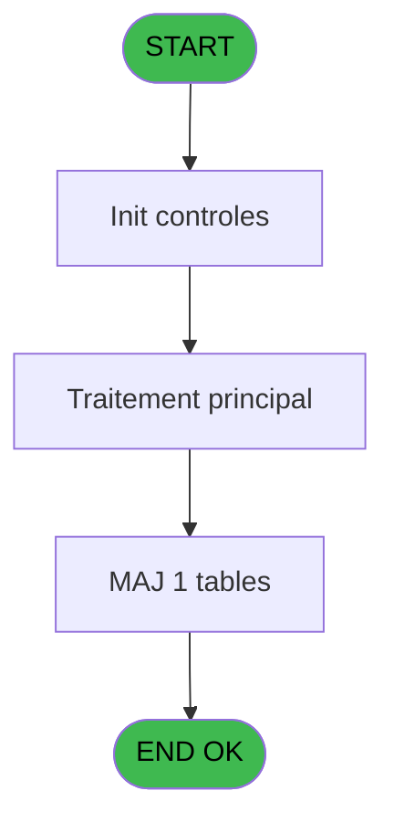
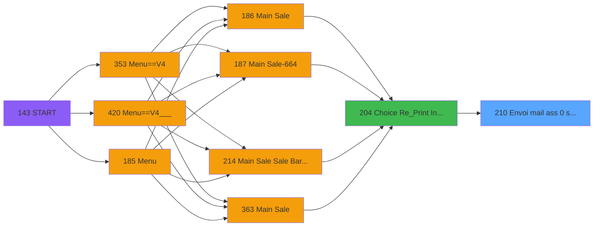

# PVE IDE 210 - Envoi mail ass 0 soucis

> **Analyse**: Phases 1-4 2026-02-03 18:55 -> 18:55 (20s) | Assemblage 18:55
> **Pipeline**: V7.2 Enrichi
> **Structure**: 4 onglets (Resume | Ecrans | Donnees | Connexions)

<!-- TAB:Resume -->

## 1. FICHE D'IDENTITE

| Attribut | Valeur |
|----------|--------|
| Projet | PVE |
| IDE Position | 210 |
| Nom Programme | Envoi mail ass 0 soucis |
| Fichier source | `Prg_210.xml` |
| Dossier IDE | Mobile |
| Taches | 2 (0 ecrans visibles) |
| Tables modifiees | 1 |
| Programmes appeles | 0 |

## 2. DESCRIPTION FONCTIONNELLE

**Envoi mail ass 0 soucis** assure la gestion complete de ce processus, accessible depuis [Choice Re_Print Invoice (IDE 204)](PVE-IDE-204.md).

Le flux de traitement s'organise en **1 blocs fonctionnels** :

- **Traitement** (2 taches) : traitements metier divers

**Donnees modifiees** : 1 tables en ecriture (email).

## 3. BLOCS FONCTIONNELS

### 3.1 Traitement (2 taches)

Traitements internes.

---

#### 210 - Envoi mail ass 0 soucis

**Role** : Traitement : Envoi mail ass 0 soucis.
**Variables liees** : B (P.i.Adresse mail), C (v.adresse email existe déjà?)

---

#### 210.1 - Sauvegarder adresse mail

**Role** : Traitement : Sauvegarder adresse mail.
**Variables liees** : B (P.i.Adresse mail), C (v.adresse email existe déjà?)

## 5. REGLES METIER

*(Aucune regle metier identifiee)*

## 6. CONTEXTE

- **Appele par**: [Choice Re_Print Invoice (IDE 204)](PVE-IDE-204.md)
- **Appelle**: 0 programmes | **Tables**: 8 (W:1 R:1 L:7) | **Taches**: 2 | **Expressions**: 17

<!-- TAB:Ecrans -->

## 8. ECRANS

*(Programme sans ecran visible)*

## 9. NAVIGATION

### 9.3 Structure hierarchique (2 taches)

| Position | Tache | Type | Dimensions | Bloc |
|----------|-------|------|------------|------|
| **210.1** | [**Envoi mail ass 0 soucis** (210)](#t1) | - | - | Traitement |
| 210.1.1 | [Sauvegarder adresse mail (210.1)](#t2) | - | - | |

### 9.4 Algorigramme

> **Legende**: Vert = START/END OK | Rouge = END KO | Bleu = Decisions
> *Algorigramme auto-genere. Utiliser `/algorigramme` pour une synthese metier detaillee.*

<!-- TAB:Donnees -->

## 10. TABLES

### Tables utilisees (8)

| ID | Nom | Description | Type | R | W | L | Usages |
|----|-----|-------------|------|---|---|---|--------|
| 30 | gm-recherche_____gmr | Index de recherche | DB |   |   | L | 1 |
| 34 | hebergement______heb | Hebergement (chambres) | DB |   |   | L | 1 |
| 130 | fichier_langue |  | DB |   |   | L | 1 |
| 285 | email |  | DB |   | **W** | L | 2 |
| 372 | pv_budget |  | DB | R |   |   | 1 |
| 382 | pv_discount_reasons |  | DB |   |   | L | 1 |
| 400 | pv_cust_rentals |  | DB |   |   | L | 1 |
| 533 | cumul_mvt_stock_histo | Articles et stock | TMP |   |   | L | 1 |

### Colonnes par table (3 / 2 tables avec colonnes identifiees)

Table 285 - email (**W**/L) - 2 usages

| Lettre | Variable | Acces | Type |
|--------|----------|-------|------|
| C | v.adresse email existe déjà? | W | Logical |

Table 372 - pv_budget (R) - 1 usages

| Lettre | Variable | Acces | Type |
|--------|----------|-------|------|
| A | P.i.customer_payer | R | Numeric |
| B | P.i.Adresse mail | R | Unicode |
| C | v.adresse email existe déjà? | R | Logical |
| D | v.répertoire cartes démat | R | Alpha |
| E | v.file pdf carte dématérialisé | R | Alpha |
| F | v.répertoire annexes fixes | R | Alpha |

## 11. VARIABLES

### 11.1 Parametres entrants (2)

Variables recues du programme appelant ([Choice Re_Print Invoice (IDE 204)](PVE-IDE-204.md)).

| Lettre | Nom | Type | Usage dans |
|--------|-----|------|-----------|
| A | P.i.customer_payer | Numeric | 1x parametre entrant |
| B | P.i.Adresse mail | Unicode | [210](#t1), [210.1](#t2) |

### 11.2 Variables de session (4)

Variables persistantes pendant toute la session.

| Lettre | Nom | Type | Usage dans |
|--------|-----|------|-----------|
| C | v.adresse email existe déjà? | Logical | - |
| D | v.répertoire cartes démat | Alpha | - |
| E | v.file pdf carte dématérialisé | Alpha | - |
| F | v.répertoire annexes fixes | Alpha | - |

## 12. EXPRESSIONS

**17 / 17 expressions decodees (100%)**

### 12.1 Repartition par type

| Type | Expressions | Regles |
|------|-------------|--------|
| CONSTANTE | 2 | 0 |
| OTHER | 12 | 0 |
| CONDITION | 1 | 0 |
| REFERENCE_VG | 1 | 0 |
| NEGATION | 1 | 0 |

### 12.2 Expressions cles par type

#### CONSTANTE (2 expressions)

| Type | IDE | Expression | Regle |
|------|-----|------------|-------|
| CONSTANTE | 10 | `'H'` | - |
| CONSTANTE | 9 | `0` | - |

#### OTHER (12 expressions)

| Type | IDE | Expression | Regle |
|------|-----|------------|-------|
| OTHER | 14 | `P.i.customer_payer [A]` | - |
| OTHER | 11 | `[AB]` | - |
| OTHER | 8 | `[V]` | - |
| OTHER | 17 | `GetParam('SERVICE')` | - |
| OTHER | 16 | `P.i.Adresse mail [B]` | - |
| ... | | *+7 autres* | |

#### CONDITION (1 expressions)

| Type | IDE | Expression | Regle |
|------|-----|------------|-------|
| CONDITION | 4 | `[Q]=GetParam ('INSCATEG') AND [R]='SALE'` | - |

#### REFERENCE_VG (1 expressions)

| Type | IDE | Expression | Regle |
|------|-----|------------|-------|
| REFERENCE_VG | 12 | `VG23` | - |

#### NEGATION (1 expressions)

| Type | IDE | Expression | Regle |
|------|-----|------------|-------|
| NEGATION | 13 | `NOT [AT] OR [AS]<>P.i.Adresse mail [B] AND P.i.Adresse mail [B]<>''` | - |

<!-- TAB:Connexions -->

## 13. GRAPHE D'APPELS

### 13.1 Chaine depuis Main (Callers)

Main -> ... -> [Choice Re_Print Invoice (IDE 204)](PVE-IDE-204.md) -> **Envoi mail ass 0 soucis (IDE 210)**

### 13.2 Callers

| IDE | Nom Programme | Nb Appels |
|-----|---------------|-----------|
| [204](PVE-IDE-204.md) | Choice Re_Print Invoice | 1 |

### 13.3 Callees (programmes appeles)

### 13.4 Detail Callees avec contexte

| IDE | Nom Programme | Appels | Contexte |
|-----|---------------|--------|----------|
| - | (aucun) | - | - |

## 14. RECOMMANDATIONS MIGRATION

### 14.1 Profil du programme

| Metrique | Valeur | Impact migration |
|----------|--------|-----------------|
| Lignes de logique | 87 | Programme compact |
| Expressions | 17 | Peu de logique |
| Tables WRITE | 1 | Impact faible |
| Sous-programmes | 0 | Peu de dependances |
| Ecrans visibles | 0 | Ecran unique ou traitement batch |
| Code desactive | 0% (0 / 87) | Code sain |
| Regles metier | 0 | Pas de regle identifiee |

### 14.2 Plan de migration par bloc

#### Traitement (2 taches: 0 ecran, 2 traitements)

- **Strategie** : 2 service(s) backend injectable(s) (Domain Services).
- Decomposer les taches en services unitaires testables.

### 14.3 Dependances critiques

| Dependance | Type | Appels | Impact |
|------------|------|--------|--------|
| email | Table WRITE (Database) | 1x | Schema + repository |

---
*Spec DETAILED generee par Pipeline V7.2 - 2026-02-03 18:55*
