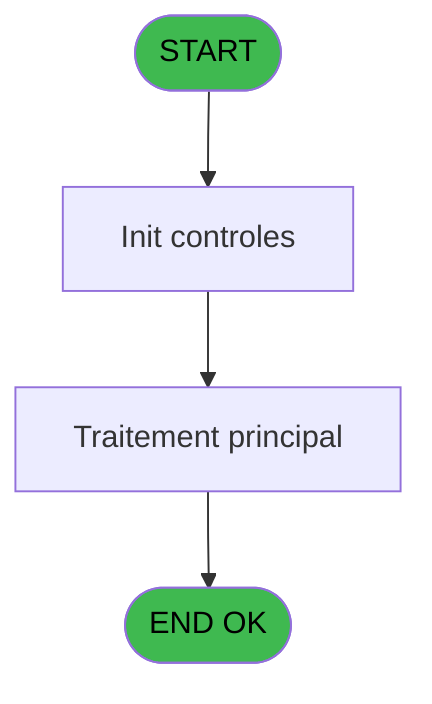
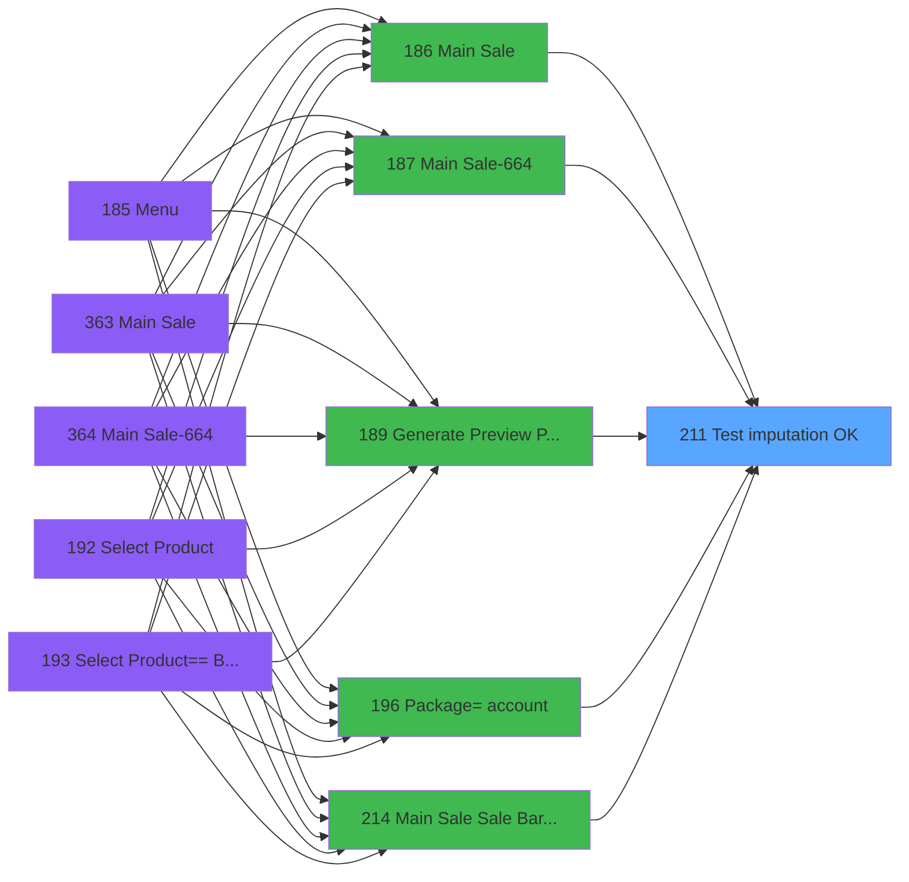

# PVE IDE 211 - Test imputation OK ?

> **Analyse**: Phases 1-4 2026-02-03 18:55 -> 18:56 (19s) | Assemblage 18:56
> **Pipeline**: V7.2 Enrichi
> **Structure**: 4 onglets (Resume | Ecrans | Donnees | Connexions)

<!-- TAB:Resume -->

## 1. FICHE D'IDENTITE

| Attribut | Valeur |
|----------|--------|
| Projet | PVE |
| IDE Position | 211 |
| Nom Programme | Test imputation OK ? |
| Fichier source | `Prg_211.xml` |
| Dossier IDE | Mobile |
| Taches | 1 (0 ecrans visibles) |
| Tables modifiees | 0 |
| Programmes appeles | 0 |

## 2. DESCRIPTION FONCTIONNELLE

**Test imputation OK ?** assure la gestion complete de ce processus, accessible depuis [Main Sale (IDE 186)](PVE-IDE-186.md), [Main Sale-664 (IDE 187)](PVE-IDE-187.md), [Generate Preview Payments (IDE 189)](PVE-IDE-189.md), [      Package=> account (IDE 196)](PVE-IDE-196.md), [Main Sale Sale Bar Code (IDE 214)](PVE-IDE-214.md), [Package Prepaid => account (IDE 219)](PVE-IDE-219.md), [Main Sale (IDE 363)](PVE-IDE-363.md), [Main Sale-664 (IDE 364)](PVE-IDE-364.md), [Generate Preview Payments 1212 (IDE 434)](PVE-IDE-434.md), [Generate Preview Payments 1112 (IDE 435)](PVE-IDE-435.md), [Generate Preview Payments 1012 (IDE 436)](PVE-IDE-436.md), [Generate Preview Payment 1212E (IDE 437)](PVE-IDE-437.md).

Le flux de traitement s'organise en **1 blocs fonctionnels** :

- **Traitement** (1 tache) : traitements metier divers

## 3. BLOCS FONCTIONNELS

### 3.1 Traitement (1 tache)

Traitements internes.

---

#### 211 - Test imputation OK ?

**Role** : Verification : Test imputation OK ?.
**Variables liees** : C (p.i.Id article imputation), G (p.i..Art imputation)

## 5. REGLES METIER

*(Aucune regle metier identifiee)*

## 6. CONTEXTE

- **Appele par**: [Main Sale (IDE 186)](PVE-IDE-186.md), [Main Sale-664 (IDE 187)](PVE-IDE-187.md), [Generate Preview Payments (IDE 189)](PVE-IDE-189.md), [      Package=> account (IDE 196)](PVE-IDE-196.md), [Main Sale Sale Bar Code (IDE 214)](PVE-IDE-214.md), [Package Prepaid => account (IDE 219)](PVE-IDE-219.md), [Main Sale (IDE 363)](PVE-IDE-363.md), [Main Sale-664 (IDE 364)](PVE-IDE-364.md), [Generate Preview Payments 1212 (IDE 434)](PVE-IDE-434.md), [Generate Preview Payments 1112 (IDE 435)](PVE-IDE-435.md), [Generate Preview Payments 1012 (IDE 436)](PVE-IDE-436.md), [Generate Preview Payment 1212E (IDE 437)](PVE-IDE-437.md)
- **Appelle**: 0 programmes | **Tables**: 0 (W:0 R:0 L:0) | **Taches**: 1 | **Expressions**: 13

<!-- TAB:Ecrans -->

## 8. ECRANS

*(Programme sans ecran visible)*

## 9. NAVIGATION

### 9.3 Structure hierarchique (1 tache)

| Position | Tache | Type | Dimensions | Bloc |
|----------|-------|------|------------|------|
| **211.1** | [**Test imputation OK ?** (211)](#t1) | - | - | Traitement |

### 9.4 Algorigramme

> **Legende**: Vert = START/END OK | Rouge = END KO | Bleu = Decisions
> *Algorigramme auto-genere. Utiliser `/algorigramme` pour une synthese metier detaillee.*

<!-- TAB:Donnees -->

## 10. TABLES

### Tables utilisees (0)

| ID | Nom | Description | Type | R | W | L | Usages |
|----|-----|-------------|------|---|---|---|--------|

### Colonnes par table (0 / 0 tables avec colonnes identifiees)

## 11. VARIABLES

### 11.1 Parametres entrants (8)

Variables recues du programme appelant ([Main Sale (IDE 186)](PVE-IDE-186.md)).

| Lettre | Nom | Type | Usage dans |
|--------|-----|------|-----------|
| A | p.i.Libellé ligne | Alpha | 1x parametre entrant |
| B | p.i.Libellé article | Alpha | 1x parametre entrant |
| C | p.i.Id article imputation | Numeric | [211](#t1) |
| D | p.i.Label sub cat | Unicode | 1x parametre entrant |
| E | p.i.Article existe ? | Logical | 1x parametre entrant |
| F | p.i.Top annulation | Alpha | 1x parametre entrant |
| G | p.i..Art imputation | Numeric | [211](#t1) |
| H | p.i.Art activite comptable | Numeric | - |

### 11.2 Autres (1)

Variables diverses.

| Lettre | Nom | Type | Usage dans |
|--------|-----|------|-----------|
| I | o.Statut OK ? | Logical | - |

## 12. EXPRESSIONS

**13 / 13 expressions decodees (100%)**

### 12.1 Repartition par type

| Type | Expressions | Regles |
|------|-------------|--------|
| CONDITION | 4 | 0 |
| CAST_LOGIQUE | 2 | 0 |
| NEGATION | 1 | 0 |
| OTHER | 1 | 0 |
| FORMAT | 5 | 0 |

### 12.2 Expressions cles par type

#### CONDITION (4 expressions)

| Type | IDE | Expression | Regle |
|------|-----|------------|-------|
| CONDITION | 5 | `p.i.Top annulation [F]='X'` | - |
| CONDITION | 6 | `p.i..Art imputation [G]=0` | - |
| CONDITION | 13 | `StrBuild('Product : @1@@2@',p.i.Libellé ligne [A], IF(p.i.Libellé article [B]='', p.i.Libellé article [B], '/' & p.i.Libellé article [B]))` | - |
| CONDITION | 1 | `p.i.Id article imputation [C]=0` | - |

#### CAST_LOGIQUE (2 expressions)

| Type | IDE | Expression | Regle |
|------|-----|------------|-------|
| CAST_LOGIQUE | 3 | `'TRUE'LOG` | - |
| CAST_LOGIQUE | 2 | `'FALSE'LOG` | - |

#### NEGATION (1 expressions)

| Type | IDE | Expression | Regle |
|------|-----|------------|-------|
| NEGATION | 4 | `NOT p.i.Article existe ? [E]` | - |

#### OTHER (1 expressions)

| Type | IDE | Expression | Regle |
|------|-----|------------|-------|
| OTHER | 8 | `StrBuild ('The account is not set up on sub category @1@, please ask the financial manager for a correction.',p.i.Label sub cat [D])` | - |

#### FORMAT (5 expressions)

| Type | IDE | Expression | Regle |
|------|-----|------------|-------|
| FORMAT | 11 | `StrBuild ('The allocation is not set up on article @1@, please ask the financial manager for a correction. ',Str(p.i.Id article imputation [C], '6P0'))` | - |
| FORMAT | 12 | `StrBuild ('The accounting activity is not set up on article @1@ for allocation @2@, please ask the financial manager for a correction.', Str(p.i.Id article imputation [C], '6P0'), Str(p.i..Art imputation [G], '10'))` | - |
| FORMAT | 10 | `StrBuild ('The article @1@ is closed, please ask the financial manager for a correction. ',Str(p.i.Id article imputation [C], '6P0'))` | - |
| FORMAT | 7 | `Left(Trim(Str(p.i..Art imputation [G], '10')), 1)='4' AND p.i.Art activite compt... [H]=0` | - |
| FORMAT | 9 | `StrBuild ('Unable to find the article @1@, please ask the financial manager for a correction. ',Str(p.i.Id article imputation [C], '6P0'))` | - |

<!-- TAB:Connexions -->

## 13. GRAPHE D'APPELS

### 13.1 Chaine depuis Main (Callers)

Main -> ... -> [Main Sale (IDE 186)](PVE-IDE-186.md) -> **Test imputation OK ? (IDE 211)**

Main -> ... -> [Main Sale-664 (IDE 187)](PVE-IDE-187.md) -> **Test imputation OK ? (IDE 211)**

Main -> ... -> [Generate Preview Payments (IDE 189)](PVE-IDE-189.md) -> **Test imputation OK ? (IDE 211)**

Main -> ... -> [      Package=> account (IDE 196)](PVE-IDE-196.md) -> **Test imputation OK ? (IDE 211)**

Main -> ... -> [Main Sale Sale Bar Code (IDE 214)](PVE-IDE-214.md) -> **Test imputation OK ? (IDE 211)**

Main -> ... -> [Package Prepaid => account (IDE 219)](PVE-IDE-219.md) -> **Test imputation OK ? (IDE 211)**

Main -> ... -> [Main Sale (IDE 363)](PVE-IDE-363.md) -> **Test imputation OK ? (IDE 211)**

Main -> ... -> [Main Sale-664 (IDE 364)](PVE-IDE-364.md) -> **Test imputation OK ? (IDE 211)**

Main -> ... -> [Generate Preview Payments 1212 (IDE 434)](PVE-IDE-434.md) -> **Test imputation OK ? (IDE 211)**

Main -> ... -> [Generate Preview Payments 1112 (IDE 435)](PVE-IDE-435.md) -> **Test imputation OK ? (IDE 211)**

Main -> ... -> [Generate Preview Payments 1012 (IDE 436)](PVE-IDE-436.md) -> **Test imputation OK ? (IDE 211)**

Main -> ... -> [Generate Preview Payment 1212E (IDE 437)](PVE-IDE-437.md) -> **Test imputation OK ? (IDE 211)**

### 13.2 Callers

| IDE | Nom Programme | Nb Appels |
|-----|---------------|-----------|
| [186](PVE-IDE-186.md) | Main Sale | 1 |
| [187](PVE-IDE-187.md) | Main Sale-664 | 1 |
| [189](PVE-IDE-189.md) | Generate Preview Payments | 1 |
| [196](PVE-IDE-196.md) |       Package=> account | 1 |
| [214](PVE-IDE-214.md) | Main Sale Sale Bar Code | 1 |
| [219](PVE-IDE-219.md) | Package Prepaid => account | 1 |
| [363](PVE-IDE-363.md) | Main Sale | 1 |
| [364](PVE-IDE-364.md) | Main Sale-664 | 1 |
| [434](PVE-IDE-434.md) | Generate Preview Payments 1212 | 1 |
| [435](PVE-IDE-435.md) | Generate Preview Payments 1112 | 1 |
| [436](PVE-IDE-436.md) | Generate Preview Payments 1012 | 1 |
| [437](PVE-IDE-437.md) | Generate Preview Payment 1212E | 1 |

### 13.3 Callees (programmes appeles)

### 13.4 Detail Callees avec contexte

| IDE | Nom Programme | Appels | Contexte |
|-----|---------------|--------|----------|
| - | (aucun) | - | - |

## 14. RECOMMANDATIONS MIGRATION

### 14.1 Profil du programme

| Metrique | Valeur | Impact migration |
|----------|--------|-----------------|
| Lignes de logique | 36 | Programme compact |
| Expressions | 13 | Peu de logique |
| Tables WRITE | 0 | Impact faible |
| Sous-programmes | 0 | Peu de dependances |
| Ecrans visibles | 0 | Ecran unique ou traitement batch |
| Code desactive | 0% (0 / 36) | Code sain |
| Regles metier | 0 | Pas de regle identifiee |

### 14.2 Plan de migration par bloc

#### Traitement (1 tache: 0 ecran, 1 traitement)

- **Strategie** : 1 service(s) backend injectable(s) (Domain Services).
- Decomposer les taches en services unitaires testables.

### 14.3 Dependances critiques

| Dependance | Type | Appels | Impact |
|------------|------|--------|--------|

---
*Spec DETAILED generee par Pipeline V7.2 - 2026-02-03 18:56*
