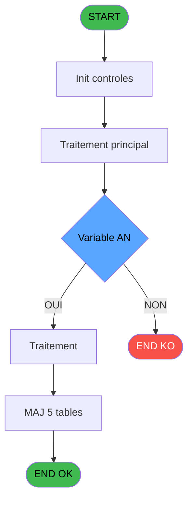
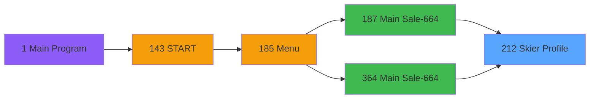
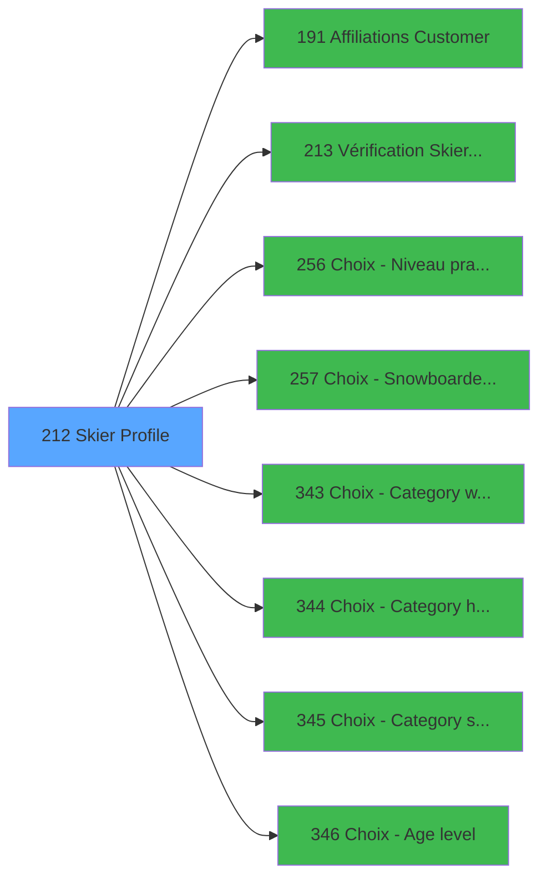

# PVE IDE 212 - Skier Profile

> **Analyse**: Phases 1-4 2026-02-03 18:56 -> 18:56 (19s) | Assemblage 18:56
> **Pipeline**: V7.2 Enrichi
> **Structure**: 4 onglets (Resume | Ecrans | Donnees | Connexions)

<!-- TAB:Resume -->

## 1. FICHE D'IDENTITE

| Attribut | Valeur |
|----------|--------|
| Projet | PVE |
| IDE Position | 212 |
| Nom Programme | Skier Profile |
| Fichier source | `Prg_212.xml` |
| Dossier IDE | Mobile |
| Taches | 8 (1 ecrans visibles) |
| Tables modifiees | 5 |
| Programmes appeles | 8 |

## 2. DESCRIPTION FONCTIONNELLE

**Skier Profile** assure la gestion complete de ce processus, accessible depuis [Main Sale-664 (IDE 187)](PVE-IDE-187.md), [Main Sale-664 (IDE 364)](PVE-IDE-364.md).

Le flux de traitement s'organise en **2 blocs fonctionnels** :

- **Traitement** (6 taches) : traitements metier divers
- **Initialisation** (2 taches) : reinitialisation d'etats et de variables de travail

**Donnees modifiees** : 5 tables en ecriture (pv_discount_reasons, pv_invoicehistoheader, req_location, Table_1620, Table_1621).

**Logique metier** : 3 regles identifiees couvrant conditions metier, valeurs par defaut.

Detail : phases du traitement

#### Phase 1 : Traitement (6 taches)

- **212** - Skier profile **[[ECRAN]](#ecran-t1)**
- **212.1.1** - Height
- **212.2.1** - Height
- **212.2.2** - Height
- **212.2.3** - Shoe Size
- **212.2.4** - Shoe Size

Delegue a : [Affiliations Customer (IDE 191)](PVE-IDE-191.md), [Vérification Skier Profile (IDE 213)](PVE-IDE-213.md)

#### Phase 2 : Initialisation (2 taches)

- **212.1** - Initialisation
- **212.2** - Initialisation

#### Tables impactees

| Table | Operations | Role metier |
|-------|-----------|-------------|
| Table_1621 | **W**/L (3 usages) |  |
| pv_discount_reasons | **W**/L (2 usages) |  |
| Table_1620 | **W**/L (2 usages) |  |
| pv_invoicehistoheader | **W**/L (2 usages) | Historique / journal |
| req_location | **W**/L (2 usages) |  |

## 3. BLOCS FONCTIONNELS

### 3.1 Traitement (6 taches)

Traitements internes.

---

#### 212 - Skier profile [[ECRAN]](#ecran-t1)

**Role** : Tache d'orchestration : point d'entree du programme (6 sous-taches). Coordonne l'enchainement des traitements.
**Ecran** : 1462 x 302 DLU (Type6) | [Voir mockup](#ecran-t1)

5 sous-taches directes

| Tache | Nom | Bloc |
|-------|-----|------|
| [212.1.1](#t3) | Height | Traitement |
| [212.2.1](#t5) | Height | Traitement |
| [212.2.2](#t6) | Height | Traitement |
| [212.2.3](#t7) | Shoe Size | Traitement |
| [212.2.4](#t8) | Shoe Size | Traitement |

**Variables liees** : J (v.Skier Type), O (v.Skier Profile ok?), Q (CHG_REASON_v.Skier Type), R (CHG_PRV_v.Skier Type)
**Delegue a** : [Affiliations Customer (IDE 191)](PVE-IDE-191.md), [Vérification Skier Profile (IDE 213)](PVE-IDE-213.md)

---

#### 212.1.1 - Height

**Role** : Traitement : Height.
**Variables liees** : H (v.Height)
**Delegue a** : [Affiliations Customer (IDE 191)](PVE-IDE-191.md), [Vérification Skier Profile (IDE 213)](PVE-IDE-213.md), [Choix - Category height (IDE 344)](PVE-IDE-344.md)

---

#### 212.2.1 - Height

**Role** : Traitement : Height.
**Variables liees** : H (v.Height)
**Delegue a** : [Affiliations Customer (IDE 191)](PVE-IDE-191.md), [Vérification Skier Profile (IDE 213)](PVE-IDE-213.md), [Choix - Category height (IDE 344)](PVE-IDE-344.md)

---

#### 212.2.2 - Height

**Role** : Traitement : Height.
**Variables liees** : H (v.Height)
**Delegue a** : [Affiliations Customer (IDE 191)](PVE-IDE-191.md), [Vérification Skier Profile (IDE 213)](PVE-IDE-213.md), [Choix - Category height (IDE 344)](PVE-IDE-344.md)

---

#### 212.2.3 - Shoe Size

**Role** : Traitement : Shoe Size.
**Variables liees** : I (v.Shoe Size)
**Delegue a** : [Affiliations Customer (IDE 191)](PVE-IDE-191.md), [Vérification Skier Profile (IDE 213)](PVE-IDE-213.md), [Choix - Category shoe size (IDE 345)](PVE-IDE-345.md)

---

#### 212.2.4 - Shoe Size

**Role** : Traitement : Shoe Size.
**Variables liees** : I (v.Shoe Size)
**Delegue a** : [Affiliations Customer (IDE 191)](PVE-IDE-191.md), [Vérification Skier Profile (IDE 213)](PVE-IDE-213.md), [Choix - Category shoe size (IDE 345)](PVE-IDE-345.md)

### 3.2 Initialisation (2 taches)

Reinitialisation d'etats et variables de travail.

---

#### 212.1 - Initialisation

**Role** : Reinitialisation : Initialisation.

---

#### 212.2 - Initialisation

**Role** : Reinitialisation : Initialisation.

## 5. REGLES METIER

3 regles identifiees:

### Autres (3 regles)

#### [RM-001] Traitement si [AN] est renseigne

| Element | Detail |
|---------|--------|
| **Condition** | `[AN]<>''` |
| **Si vrai** | 'B' |
| **Si faux** | 'S') |
| **Expression source** | Expression 5 : `IF([AN]<>'','B','S')` |
| **Exemple** | Si [AN]<>'' → 'B'. Sinon → 'S') |

#### [RM-002] Si VG142 alors [BD] sinon [AG])

| Element | Detail |
|---------|--------|
| **Condition** | `VG142` |
| **Si vrai** | [BD] |
| **Si faux** | [AG]) |
| **Expression source** | Expression 15 : `IF(VG142,[BD],[AG])` |
| **Exemple** | Si VG142 → [BD]. Sinon → [AG]) |

#### [RM-003] Traitement si NOT(VG142),([W]=0 OR [AA]=0 OR [AE]=0 OR [AS]='' OR [AT]=0) AND ([AI] est renseigne

| Element | Detail |
|---------|--------|
| **Condition** | `NOT(VG142)` |
| **Si vrai** | ([W]=0 OR [AA]=0 OR [AE]=0 OR [AS]='' OR [AT]=0) AND ([AI]<>'' OR [AN]<>'') |
| **Si faux** | (([W]=0 OR [AA]=0 OR [AE]=0 OR [AI]='' OR [AS]='' OR [AT]=0) AND [AN]='') OR [AN]='') |
| **Expression source** | Expression 22 : `IF(NOT(VG142),([W]=0 OR [AA]=0 OR [AE]=0 OR [AS]='' OR [AT]=` |
| **Exemple** | Si NOT(VG142) → ([W]=0 OR [AA]=0 OR [AE]=0 OR [AS]='' OR [AT]=0) AND ([AI]<>'' OR [AN]<>'') |

## 6. CONTEXTE

- **Appele par**: [Main Sale-664 (IDE 187)](PVE-IDE-187.md), [Main Sale-664 (IDE 364)](PVE-IDE-364.md)
- **Appelle**: 8 programmes | **Tables**: 7 (W:5 R:1 L:6) | **Taches**: 8 | **Expressions**: 49

<!-- TAB:Ecrans -->

## 8. ECRANS

### 8.1 Forms visibles (1 / 8)

| # | Position | Tache | Nom | Type | Largeur | Hauteur | Bloc |
|---|----------|-------|-----|------|---------|---------|------|
| 1 | 212 | 212 | Skier profile | Type6 | 1462 | 302 | Traitement |

### 8.2 Mockups Ecrans

---

#### 212 - Skier profile
**Tache** : [212](#t1) | **Type** : Type6 | **Dimensions** : 1462 x 302 DLU
**Bloc** : Traitement | **Titre IDE** : Skier profile

<!-- FORM-DATA:
{
    "width":  1462,
    "vFactor":  8,
    "type":  "Type6",
    "hFactor":  8,
    "controls":  [
                     {
                         "x":  106,
                         "type":  "label",
                         "var":  "",
                         "y":  110,
                         "w":  118,
                         "fmt":  "",
                         "name":  "",
                         "h":  17,
                         "color":  "132",
                         "text":  "Weight",
                         "parent":  null
                     },
                     {
                         "x":  106,
                         "type":  "label",
                         "var":  "",
                         "y":  131,
                         "w":  118,
                         "fmt":  "",
                         "name":  "",
                         "h":  17,
                         "color":  "132",
                         "text":  "Height",
                         "parent":  null
                     },
                     {
                         "x":  106,
                         "type":  "label",
                         "var":  "",
                         "y":  152,
                         "w":  118,
                         "fmt":  "",
                         "name":  "",
                         "h":  17,
                         "color":  "132",
                         "text":  "Shoe Size",
                         "parent":  null
                     },
                     {
                         "x":  988,
                         "type":  "label",
                         "var":  "",
                         "y":  172,
                         "w":  151,
                         "fmt":  "",
                         "name":  "",
                         "h":  28,
                         "color":  "132",
                         "text":  "DIN",
                         "parent":  null
                     },
                     {
                         "x":  106,
                         "type":  "label",
                         "var":  "",
                         "y":  173,
                         "w":  118,
                         "fmt":  "",
                         "name":  "",
                         "h":  17,
                         "color":  "132",
                         "text":  "Skier Type",
                         "parent":  null
                     },
                     {
                         "x":  106,
                         "type":  "label",
                         "var":  "",
                         "y":  194,
                         "w":  147,
                         "fmt":  "",
                         "name":  "",
                         "h":  17,
                         "color":  "132",
                         "text":  "Snowboard stance",
                         "parent":  null
                     },
                     {
                         "x":  1000,
                         "type":  "label",
                         "var":  "",
                         "y":  210,
                         "w":  447,
                         "fmt":  "",
                         "name":  "",
                         "h":  19,
                         "color":  "186",
                         "text":  "Please complete all necessary fields",
                         "parent":  null
                     },
                     {
                         "x":  106,
                         "type":  "label",
                         "var":  "",
                         "y":  215,
                         "w":  118,
                         "fmt":  "",
                         "name":  "",
                         "h":  17,
                         "color":  "132",
                         "text":  "Sex",
                         "parent":  null
                     },
                     {
                         "x":  106,
                         "type":  "label",
                         "var":  "",
                         "y":  236,
                         "w":  118,
                         "fmt":  "",
                         "name":  "",
                         "h":  17,
                         "color":  "132",
                         "text":  "Age",
                         "parent":  null
                     },
                     {
                         "x":  0,
                         "type":  "label",
                         "var":  "",
                         "y":  268,
                         "w":  1462,
                         "fmt":  "",
                         "name":  "",
                         "h":  33,
                         "color":  "",
                         "text":  "",
                         "parent":  null
                     },
                     {
                         "x":  17,
                         "type":  "label",
                         "var":  "",
                         "y":  2,
                         "w":  1445,
                         "fmt":  "",
                         "name":  "",
                         "h":  42,
                         "color":  "182",
                         "text":  "",
                         "parent":  null
                     },
                     {
                         "x":  66,
                         "type":  "label",
                         "var":  "",
                         "y":  15,
                         "w":  1047,
                         "fmt":  "",
                         "name":  "",
                         "h":  14,
                         "color":  "186",
                         "text":  "Insert all the GM information for binding\u0027s settings",
                         "parent":  14
                     },
                     {
                         "x":  77,
                         "type":  "label",
                         "var":  "",
                         "y":  46,
                         "w":  1314,
                         "fmt":  "",
                         "name":  "",
                         "h":  60,
                         "color":  "132",
                         "text":  "Person paying",
                         "parent":  null
                     },
                     {
                         "x":  101,
                         "type":  "label",
                         "var":  "",
                         "y":  60,
                         "w":  784,
                         "fmt":  "",
                         "name":  "",
                         "h":  29,
                         "color":  "186",
                         "text":  "",
                         "parent":  17
                     },
                     {
                         "x":  1359,
                         "type":  "image",
                         "var":  "",
                         "y":  6,
                         "w":  96,
                         "fmt":  "",
                         "name":  "",
                         "h":  37,
                         "color":  "",
                         "text":  "",
                         "parent":  16
                     },
                     {
                         "x":  1072,
                         "type":  "button",
                         "var":  "",
                         "y":  60,
                         "w":  283,
                         "fmt":  "FILIATIONS",
                         "name":  "",
                         "h":  29,
                         "color":  "",
                         "text":  "",
                         "parent":  17
                     },
                     {
                         "x":  104,
                         "type":  "edit",
                         "var":  "",
                         "y":  63,
                         "w":  774,
                         "fmt":  "50",
                         "name":  "v.Titre Bt Customer",
                         "h":  24,
                         "color":  "191",
                         "text":  "",
                         "parent":  17
                     },
                     {
                         "x":  259,
                         "type":  "button",
                         "var":  "",
                         "y":  110,
                         "w":  574,
                         "fmt":  "Weight",
                         "name":  "Weight",
                         "h":  17,
                         "color":  "",
                         "text":  "",
                         "parent":  null
                     },
                     {
                         "x":  259,
                         "type":  "button",
                         "var":  "",
                         "y":  131,
                         "w":  574,
                         "fmt":  "Height",
                         "name":  "Height",
                         "h":  17,
                         "color":  "",
                         "text":  "",
                         "parent":  null
                     },
                     {
                         "x":  259,
                         "type":  "button",
                         "var":  "",
                         "y":  152,
                         "w":  574,
                         "fmt":  "Shoe Size",
                         "name":  "Shoe Size",
                         "h":  17,
                         "color":  "",
                         "text":  "",
                         "parent":  null
                     },
                     {
                         "x":  1176,
                         "type":  "edit",
                         "var":  "",
                         "y":  172,
                         "w":  192,
                         "fmt":  "",
                         "name":  "v.DIN code",
                         "h":  28,
                         "color":  "186",
                         "text":  "",
                         "parent":  null
                     },
                     {
                         "x":  259,
                         "type":  "button",
                         "var":  "",
                         "y":  173,
                         "w":  574,
                         "fmt":  "Skier Type",
                         "name":  "Skier Type",
                         "h":  17,
                         "color":  "",
                         "text":  "",
                         "parent":  null
                     },
                     {
                         "x":  259,
                         "type":  "button",
                         "var":  "",
                         "y":  194,
                         "w":  574,
                         "fmt":  "Snowboard stance",
                         "name":  "Snowboard stance",
                         "h":  17,
                         "color":  "",
                         "text":  "",
                         "parent":  null
                     },
                     {
                         "x":  259,
                         "type":  "edit",
                         "var":  "",
                         "y":  215,
                         "w":  574,
                         "fmt":  "30",
                         "name":  "",
                         "h":  17,
                         "color":  "2",
                         "text":  "",
                         "parent":  null
                     },
                     {
                         "x":  259,
                         "type":  "edit",
                         "var":  "",
                         "y":  236,
                         "w":  574,
                         "fmt":  "30",
                         "name":  "",
                         "h":  17,
                         "color":  "2",
                         "text":  "",
                         "parent":  null
                     },
                     {
                         "x":  1071,
                         "type":  "button",
                         "var":  "",
                         "y":  271,
                         "w":  172,
                         "fmt":  "\u0026Validate",
                         "name":  "Validate",
                         "h":  27,
                         "color":  "",
                         "text":  "",
                         "parent":  13
                     },
                     {
                         "x":  1283,
                         "type":  "button",
                         "var":  "",
                         "y":  271,
                         "w":  172,
                         "fmt":  "\u0026Quit",
                         "name":  "Exit",
                         "h":  27,
                         "color":  "",
                         "text":  "",
                         "parent":  13
                     }
                 ],
    "taskId":  "212",
    "height":  302
}
-->

<strong>Champs : 4 champs</strong>

| Pos (x,y) | Nom | Variable | Type |
|-----------|-----|----------|------|
| 104,63 | v.Titre Bt Customer | - | edit |
| 1176,172 | v.DIN code | - | edit |
| 259,215 | 30 | - | edit |
| 259,236 | 30 | - | edit |

<strong>Boutons : 8 boutons</strong>

| Bouton | Pos (x,y) | Action |
|--------|-----------|--------|
| FILIATIONS | 1072,60 | Appel [Affiliations Customer (IDE 191)](PVE-IDE-191.md) |
| Weight | 259,110 | Appel [Choix - Category weight (IDE 343)](PVE-IDE-343.md) |
| Height | 259,131 | Appel [Choix - Category height (IDE 344)](PVE-IDE-344.md) |
| Shoe Size | 259,152 | Appel [Choix - Category shoe size (IDE 345)](PVE-IDE-345.md) |
| Skier Type | 259,173 | Appel [Vérification Skier Profile (IDE 213)](PVE-IDE-213.md) |
| Snowboard stance | 259,194 | Appel [Choix - Snowboarder Stance (IDE 257)](PVE-IDE-257.md) |
| Validate | 1071,271 | Valide la saisie et enregistre |
| Quit | 1283,271 | Bouton fonctionnel |

## 9. NAVIGATION

Ecran unique: **Skier profile**

### 9.3 Structure hierarchique (8 taches)

| Position | Tache | Type | Dimensions | Bloc |
|----------|-------|------|------------|------|
| **212.1** | [**Skier profile** (212)](#t1) [mockup](#ecran-t1) | Type6 | 1462x302 | Traitement |
| 212.1.1 | [Height (212.1.1)](#t3) | - | - | |
| 212.1.2 | [Height (212.2.1)](#t5) | - | - | |
| 212.1.3 | [Height (212.2.2)](#t6) | - | - | |
| 212.1.4 | [Shoe Size (212.2.3)](#t7) | - | - | |
| 212.1.5 | [Shoe Size (212.2.4)](#t8) | - | - | |
| **212.2** | [**Initialisation** (212.1)](#t2) | - | - | Initialisation |
| 212.2.1 | [Initialisation (212.2)](#t4) | - | - | |

### 9.4 Algorigramme

> **Legende**: Vert = START/END OK | Rouge = END KO | Bleu = Decisions
> *Algorigramme auto-genere. Utiliser `/algorigramme` pour une synthese metier detaillee.*

<!-- TAB:Donnees -->

## 10. TABLES

### Tables utilisees (7)

| ID | Nom | Description | Type | R | W | L | Usages |
|----|-----|-------------|------|---|---|---|--------|
| 30 | gm-recherche_____gmr | Index de recherche | DB | R |   |   | 1 |
| 382 | pv_discount_reasons |  | DB |   | **W** | L | 2 |
| 391 | pv_invoicehistoheader | Historique / journal | DB |   | **W** | L | 2 |
| 421 | req_location |  | DB |   | **W** | L | 2 |
| 808 | Selection des noms a supprimer |  | DB |   |   | L | 1 |
| 1620 | Table_1620 |  | MEM |   | **W** | L | 2 |
| 1621 | Table_1621 |  | MEM |   | **W** | L | 3 |

### Colonnes par table (1 / 6 tables avec colonnes identifiees)

Table 30 - gm-recherche_____gmr (R) - 1 usages

| Lettre | Variable | Acces | Type |
|--------|----------|-------|------|
| A | P.i.gm_societe | R | Unicode |
| B | P.i.gm_compte | R | Numeric |
| C | P.i.gm_filiation | R | Numeric |
| D | P.o.Validé | R | Logical |
| E | P.i.Ski or board (S/B) | R | Alpha |
| F | v.gm_filiation | R | Numeric |
| G | v.Weight | R | Numeric |
| H | v.Height | R | Numeric |
| I | v.Shoe Size | R | Numeric |
| J | v.Skier Type | R | Unicode |
| K | v.Snowboard stance | R | Unicode |
| L | v.Sexe | R | Alpha |
| M | v.Age | R | Numeric |
| N | v.message erreur | R | Alpha |
| O | v.Skier Profile ok? | R | Logical |
| P | v.DIN code num | R | Numeric |
| Q | CHG_REASON_v.Skier Type | R | Numeric |
| R | CHG_PRV_v.Skier Type | R | Unicode |
| S | CHG_REASON_v.Snowboard stance | R | Numeric |
| T | CHG_PRV_v.Snowboard stance | R | Unicode |

Table 382 - pv_discount_reasons (**W**/L) - 2 usages

*Table utilisee uniquement en Link ou aucune colonne Real identifiee dans le DataView.*

Table 391 - pv_invoicehistoheader (**W**/L) - 2 usages

*Table utilisee uniquement en Link ou aucune colonne Real identifiee dans le DataView.*

Table 421 - req_location (**W**/L) - 2 usages

*Table utilisee uniquement en Link ou aucune colonne Real identifiee dans le DataView.*

Table 1620 - Table_1620 (**W**/L) - 2 usages

*Table utilisee uniquement en Link ou aucune colonne Real identifiee dans le DataView.*

Table 1621 - Table_1621 (**W**/L) - 3 usages

*Table utilisee uniquement en Link ou aucune colonne Real identifiee dans le DataView.*

## 11. VARIABLES

### 11.1 Parametres entrants (5)

Variables recues du programme appelant ([Main Sale-664 (IDE 187)](PVE-IDE-187.md)).

| Lettre | Nom | Type | Usage dans |
|--------|-----|------|-----------|
| A | P.i.gm_societe | Unicode | 1x parametre entrant |
| B | P.i.gm_compte | Numeric | 1x parametre entrant |
| C | P.i.gm_filiation | Numeric | 1x parametre entrant |
| D | P.o.Validé | Logical | 1x parametre entrant |
| E | P.i.Ski or board (S/B) | Alpha | 3x parametre entrant |

### 11.2 Variables de session (11)

Variables persistantes pendant toute la session.

| Lettre | Nom | Type | Usage dans |
|--------|-----|------|-----------|
| F | v.gm_filiation | Numeric | 1x session |
| G | v.Weight | Numeric | - |
| H | v.Height | Numeric | - |
| I | v.Shoe Size | Numeric | - |
| J | v.Skier Type | Unicode | 2x session |
| K | v.Snowboard stance | Unicode | 3x session |
| L | v.Sexe | Alpha | 3x session |
| M | v.Age | Numeric | 1x session |
| N | v.message erreur | Alpha | - |
| O | v.Skier Profile ok? | Logical | - |
| P | v.DIN code num | Numeric | 1x session |

### 11.3 Autres (4)

Variables diverses.

| Lettre | Nom | Type | Usage dans |
|--------|-----|------|-----------|
| Q | CHG_REASON_v.Skier Type | Numeric | - |
| R | CHG_PRV_v.Skier Type | Unicode | - |
| S | CHG_REASON_v.Snowboard stance | Numeric | - |
| T | CHG_PRV_v.Snowboard stance | Unicode | - |

Toutes les 20 variables (liste complete)

| Cat | Lettre | Nom Variable | Type |
|-----|--------|--------------|------|
| P0 | **A** | P.i.gm_societe | Unicode |
| P0 | **B** | P.i.gm_compte | Numeric |
| P0 | **C** | P.i.gm_filiation | Numeric |
| P0 | **D** | P.o.Validé | Logical |
| P0 | **E** | P.i.Ski or board (S/B) | Alpha |
| V. | **F** | v.gm_filiation | Numeric |
| V. | **G** | v.Weight | Numeric |
| V. | **H** | v.Height | Numeric |
| V. | **I** | v.Shoe Size | Numeric |
| V. | **J** | v.Skier Type | Unicode |
| V. | **K** | v.Snowboard stance | Unicode |
| V. | **L** | v.Sexe | Alpha |
| V. | **M** | v.Age | Numeric |
| V. | **N** | v.message erreur | Alpha |
| V. | **O** | v.Skier Profile ok? | Logical |
| V. | **P** | v.DIN code num | Numeric |
| Autre | **Q** | CHG_REASON_v.Skier Type | Numeric |
| Autre | **R** | CHG_PRV_v.Skier Type | Unicode |
| Autre | **S** | CHG_REASON_v.Snowboard stance | Numeric |
| Autre | **T** | CHG_PRV_v.Snowboard stance | Unicode |

## 12. EXPRESSIONS

**49 / 49 expressions decodees (100%)**

### 12.1 Repartition par type

| Type | Expressions | Regles |
|------|-------------|--------|
| CONCATENATION | 2 | 0 |
| CONDITION | 13 | 3 |
| CONSTANTE | 5 | 0 |
| OTHER | 19 | 0 |
| CAST_LOGIQUE | 5 | 0 |
| NEGATION | 1 | 0 |
| STRING | 2 | 0 |
| FORMAT | 2 | 0 |

### 12.2 Expressions cles par type

#### CONCATENATION (2 expressions)

| Type | IDE | Expression | Regle |
|------|-----|------------|-------|
| CONCATENATION | 39 | `Trim(v.Snowboard stance [K])&' '&Trim(v.Sexe [L])` | - |
| CONCATENATION | 48 | `'ski/board='&P.i.Ski or board (S/B) [E]&' =>'&IF(P.o.Validé [D],'OUI','NON')` | - |

#### CONDITION (13 expressions)

| Type | IDE | Expression | Regle |
|------|-----|------------|-------|
| CONDITION | 22 | `IF(NOT(VG142),([W]=0 OR [AA]=0 OR [AE]=0 OR [AS]='' OR [AT]=0) AND ([AI]<>'' OR [AN]<>''),(([W]=0 OR [AA]=0 OR [AE]=0 OR [AI]='' OR [AS]='' OR [AT]=0) AND [AN]='') OR [AN]='')` | [RM-003](#rm-RM-003) |
| CONDITION | 15 | `IF(VG142,[BD],[AG])` | [RM-002](#rm-RM-002) |
| CONDITION | 5 | `IF([AN]<>'','B','S')` | [RM-001](#rm-RM-001) |
| CONDITION | 40 | `[V]>0` | - |
| CONDITION | 29 | `[AW]<>''` | - |
| ... | | *+8 autres* | |

#### CONSTANTE (5 expressions)

| Type | IDE | Expression | Regle |
|------|-----|------------|-------|
| CONSTANTE | 41 | `0` | - |
| CONSTANTE | 45 | `''` | - |
| CONSTANTE | 8 | `'0'` | - |
| CONSTANTE | 6 | `'NIVPRA'` | - |
| CONSTANTE | 7 | `'POSPLA'` | - |

#### OTHER (19 expressions)

| Type | IDE | Expression | Regle |
|------|-----|------------|-------|
| OTHER | 18 | `[AT]` | - |
| OTHER | 19 | `[AM]` | - |
| OTHER | 16 | `[AI]` | - |
| OTHER | 17 | `[AN]` | - |
| OTHER | 20 | `[AR]` | - |
| ... | | *+14 autres* | |

#### CAST_LOGIQUE (5 expressions)

| Type | IDE | Expression | Regle |
|------|-----|------------|-------|
| CAST_LOGIQUE | 43 | `P.i.Ski or board (S/B) [E]='' OR P.i.Ski or board (S/B) [E]='S' OR 'TRUE'LOG` | - |
| CAST_LOGIQUE | 44 | `P.i.Ski or board (S/B) [E]='' OR P.i.Ski or board (S/B) [E]='B' OR 'TRUE'LOG` | - |
| CAST_LOGIQUE | 38 | `'FALSE'LOG` | - |
| CAST_LOGIQUE | 26 | `[AN]<>'' AND IF(NOT(VG142),NOT([W]=0 OR [AA]=0 OR [AE]=0 OR [AS]='' OR [AT]=0),'TRUE'LOG)` | - |
| CAST_LOGIQUE | 27 | `'TRUE'LOG` | - |

#### NEGATION (1 expressions)

| Type | IDE | Expression | Regle |
|------|-----|------------|-------|
| NEGATION | 32 | `NOT [AX]` | - |

#### STRING (2 expressions)

| Type | IDE | Expression | Regle |
|------|-----|------------|-------|
| STRING | 42 | `Trim([AV])` | - |
| STRING | 30 | `Trim([AW])` | - |

#### FORMAT (2 expressions)

| Type | IDE | Expression | Regle |
|------|-----|------------|-------|
| FORMAT | 33 | `'Skier profile updated '&' for '&Trim(v.Snowboard stance [K])&' '&Trim(v.Sexe [L])&' (# '&Trim(Str(v.Skier Type [J],'10L'))&')'` | - |
| FORMAT | 31 | `'Skier profile still need to be completed '&' for '&Trim(v.Snowboard stance [K])&' '&Trim(v.Sexe [L])&' (# '&Trim(Str(v.Skier Type [J],'10L'))&')'` | - |

### 12.3 Toutes les expressions (49)

Voir les 49 expressions

#### CONCATENATION (2)

| IDE | Expression Decodee |
|-----|-------------------|
| 48 | `'ski/board='&P.i.Ski or board (S/B) [E]&' =>'&IF(P.o.Validé [D],'OUI','NON')` |
| 39 | `Trim(v.Snowboard stance [K])&' '&Trim(v.Sexe [L])` |

#### CONDITION (13)

| IDE | Expression Decodee |
|-----|-------------------|
| 5 | `IF([AN]<>'','B','S')` |
| 15 | `IF(VG142,[BD],[AG])` |
| 21 | `CASE([AS],'H','Man','F','Women','')` |
| 22 | `IF(NOT(VG142),([W]=0 OR [AA]=0 OR [AE]=0 OR [AS]='' OR [AT]=0) AND ([AI]<>'' OR [AN]<>''),(([W]=0 OR [AA]=0 OR [AE]=0 OR [AI]='' OR [AS]='' OR [AT]=0) AND [AN]='') OR [AN]='')` |
| 23 | `[AN]<>'' OR NOT([W]=0 OR [AA]=0 OR [AE]=0 OR [AI]='' OR [AS]='' OR [AT]=0)` |
| 24 | `NOT([W]=0 OR [AA]=0 OR [AE]=0 OR [AI]='' OR [AS]='' OR [AT]=0)` |
| 25 | `NOT([W]=0 OR [AA]=0 OR [AE]=0 OR [AI]='' OR [AS]='' OR [AT]=0)` |
| 28 | `NOT([W]=0 OR [AA]=0 OR [AE]=0 OR [AS]='' OR [AI]='' OR [AT]=0) AND ([AN]='')` |
| 29 | `[AW]<>''` |
| 40 | `[V]>0` |
| 46 | `[AI]<>''` |
| 47 | `[AN]<>''` |
| 49 | `(Trim([AN])='' AND VG142) OR NOT(VG142)` |

#### CONSTANTE (5)

| IDE | Expression Decodee |
|-----|-------------------|
| 6 | `'NIVPRA'` |
| 7 | `'POSPLA'` |
| 8 | `'0'` |
| 41 | `0` |
| 45 | `''` |

#### OTHER (19)

| IDE | Expression Decodee |
|-----|-------------------|
| 1 | `P.i.gm_societe [A]` |
| 2 | `P.i.gm_compte [B]` |
| 3 | `P.i.gm_filiation [C]` |
| 4 | `v.gm_filiation [F]` |
| 9 | `[W]` |
| 10 | `[Y]` |
| 11 | `[AA]` |
| 12 | `[AD]` |
| 13 | `[AC]` |
| 14 | `[AE]` |
| 16 | `[AI]` |
| 17 | `[AN]` |
| 18 | `[AT]` |
| 19 | `[AM]` |
| 20 | `[AR]` |
| 34 | `v.Age [M]` |
| 35 | `v.DIN code num [P]` |
| 36 | `[Z]` |
| 37 | `[AH]` |

#### CAST_LOGIQUE (5)

| IDE | Expression Decodee |
|-----|-------------------|
| 26 | `[AN]<>'' AND IF(NOT(VG142),NOT([W]=0 OR [AA]=0 OR [AE]=0 OR [AS]='' OR [AT]=0),'TRUE'LOG)` |
| 27 | `'TRUE'LOG` |
| 38 | `'FALSE'LOG` |
| 43 | `P.i.Ski or board (S/B) [E]='' OR P.i.Ski or board (S/B) [E]='S' OR 'TRUE'LOG` |
| 44 | `P.i.Ski or board (S/B) [E]='' OR P.i.Ski or board (S/B) [E]='B' OR 'TRUE'LOG` |

#### NEGATION (1)

| IDE | Expression Decodee |
|-----|-------------------|
| 32 | `NOT [AX]` |

#### STRING (2)

| IDE | Expression Decodee |
|-----|-------------------|
| 30 | `Trim([AW])` |
| 42 | `Trim([AV])` |

#### FORMAT (2)

| IDE | Expression Decodee |
|-----|-------------------|
| 31 | `'Skier profile still need to be completed '&' for '&Trim(v.Snowboard stance [K])&' '&Trim(v.Sexe [L])&' (# '&Trim(Str(v.Skier Type [J],'10L'))&')'` |
| 33 | `'Skier profile updated '&' for '&Trim(v.Snowboard stance [K])&' '&Trim(v.Sexe [L])&' (# '&Trim(Str(v.Skier Type [J],'10L'))&')'` |

<!-- TAB:Connexions -->

## 13. GRAPHE D'APPELS

### 13.1 Chaine depuis Main (Callers)

Main -> ... -> [Main Sale-664 (IDE 187)](PVE-IDE-187.md) -> **Skier Profile (IDE 212)**

Main -> ... -> [Main Sale-664 (IDE 364)](PVE-IDE-364.md) -> **Skier Profile (IDE 212)**

### 13.2 Callers

| IDE | Nom Programme | Nb Appels |
|-----|---------------|-----------|
| [187](PVE-IDE-187.md) | Main Sale-664 | 2 |
| [364](PVE-IDE-364.md) | Main Sale-664 | 2 |

### 13.3 Callees (programmes appeles)

### 13.4 Detail Callees avec contexte

| IDE | Nom Programme | Appels | Contexte |
|-----|---------------|--------|----------|
| [191](PVE-IDE-191.md) | Affiliations Customer | 1 | Sous-programme |
| [213](PVE-IDE-213.md) | Vérification Skier Profile | 1 | Sous-programme |
| [256](PVE-IDE-256.md) | Choix - Niveau pratique | 1 | Selection/consultation |
| [257](PVE-IDE-257.md) | Choix - Snowboarder Stance | 1 | Selection/consultation |
| [343](PVE-IDE-343.md) | Choix - Category weight | 1 | Selection/consultation |
| [344](PVE-IDE-344.md) | Choix - Category height | 1 | Selection/consultation |
| [345](PVE-IDE-345.md) | Choix - Category shoe size | 1 | Selection/consultation |
| [346](PVE-IDE-346.md) | Choix - Age level | 1 | Selection/consultation |

## 14. RECOMMANDATIONS MIGRATION

### 14.1 Profil du programme

| Metrique | Valeur | Impact migration |
|----------|--------|-----------------|
| Lignes de logique | 211 | Taille moyenne |
| Expressions | 49 | Peu de logique |
| Tables WRITE | 5 | Impact modere |
| Sous-programmes | 8 | Dependances moderees |
| Ecrans visibles | 1 | Ecran unique ou traitement batch |
| Code desactive | 0% (0 / 211) | Code sain |
| Regles metier | 3 | Quelques regles a preserver |

### 14.2 Plan de migration par bloc

#### Traitement (6 taches: 1 ecran, 5 traitements)

- **Strategie** : Orchestrateur avec 1 ecrans (Razor/React) et 5 traitements backend (services).
- Les ecrans deviennent des composants UI, les traitements invisibles deviennent des services injectables.
- 8 sous-programme(s) a migrer ou a reutiliser depuis les services existants.
- Decomposer les taches en services unitaires testables.

#### Initialisation (2 taches: 0 ecran, 2 traitements)

- **Strategie** : Constructeur/methode `InitAsync()` dans l'orchestrateur.

### 14.3 Dependances critiques

| Dependance | Type | Appels | Impact |
|------------|------|--------|--------|
| pv_discount_reasons | Table WRITE (Database) | 1x | Schema + repository |
| pv_invoicehistoheader | Table WRITE (Database) | 1x | Schema + repository |
| req_location | Table WRITE (Database) | 1x | Schema + repository |
| Table_1620 | Table WRITE (Memory) | 1x | Schema + repository |
| Table_1621 | Table WRITE (Memory) | 2x | Schema + repository |
| [Choix - Category height (IDE 344)](PVE-IDE-344.md) | Sous-programme | 1x | Normale - Selection/consultation |
| [Choix - Category weight (IDE 343)](PVE-IDE-343.md) | Sous-programme | 1x | Normale - Selection/consultation |
| [Choix - Age level (IDE 346)](PVE-IDE-346.md) | Sous-programme | 1x | Normale - Selection/consultation |
| [Choix - Category shoe size (IDE 345)](PVE-IDE-345.md) | Sous-programme | 1x | Normale - Selection/consultation |
| [Vérification Skier Profile (IDE 213)](PVE-IDE-213.md) | Sous-programme | 1x | Normale - Sous-programme |
| [Affiliations Customer (IDE 191)](PVE-IDE-191.md) | Sous-programme | 1x | Normale - Sous-programme |
| [Choix - Snowboarder Stance (IDE 257)](PVE-IDE-257.md) | Sous-programme | 1x | Normale - Selection/consultation |
| [Choix - Niveau pratique (IDE 256)](PVE-IDE-256.md) | Sous-programme | 1x | Normale - Selection/consultation |

---
*Spec DETAILED generee par Pipeline V7.2 - 2026-02-03 18:56*
