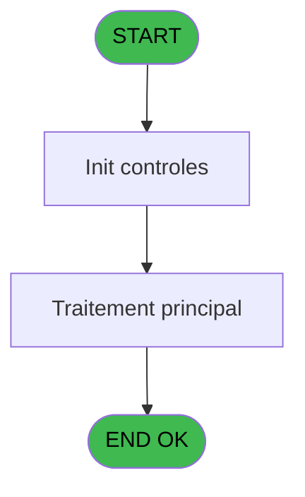
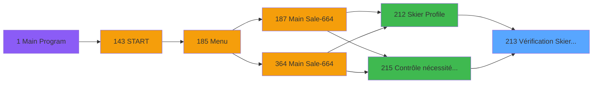

# PVE IDE 213 - Vérification Skier Profile

> **Analyse**: Phases 1-4 2026-02-03 18:56 -> 18:57 (18s) | Assemblage 18:57
> **Pipeline**: V7.2 Enrichi
> **Structure**: 4 onglets (Resume | Ecrans | Donnees | Connexions)

<!-- TAB:Resume -->

## 1. FICHE D'IDENTITE

| Attribut | Valeur |
|----------|--------|
| Projet | PVE |
| IDE Position | 213 |
| Nom Programme | Vérification Skier Profile |
| Fichier source | `Prg_213.xml` |
| Dossier IDE | Mobile |
| Taches | 1 (0 ecrans visibles) |
| Tables modifiees | 0 |
| Programmes appeles | 0 |

## 2. DESCRIPTION FONCTIONNELLE

**Vérification Skier Profile** assure la gestion complete de ce processus, accessible depuis [Contrôle nécessité calcul DIN (IDE 215)](PVE-IDE-215.md), [Skier Profile (IDE 212)](PVE-IDE-212.md).

Le flux de traitement s'organise en **1 blocs fonctionnels** :

- **Traitement** (1 tache) : traitements metier divers

## 3. BLOCS FONCTIONNELS

### 3.1 Traitement (1 tache)

Traitements internes.

---

#### 213 - Vérification des zones

**Role** : Traitement : Vérification des zones.

## 5. REGLES METIER

*(Aucune regle metier identifiee)*

## 6. CONTEXTE

- **Appele par**: [Contrôle nécessité calcul DIN (IDE 215)](PVE-IDE-215.md), [Skier Profile (IDE 212)](PVE-IDE-212.md)
- **Appelle**: 0 programmes | **Tables**: 1 (W:0 R:1 L:0) | **Taches**: 1 | **Expressions**: 32

<!-- TAB:Ecrans -->

## 8. ECRANS

*(Programme sans ecran visible)*

## 9. NAVIGATION

### 9.3 Structure hierarchique (1 tache)

| Position | Tache | Type | Dimensions | Bloc |
|----------|-------|------|------------|------|
| **213.1** | [**Vérification des zones** (213)](#t1) | - | - | Traitement |

### 9.4 Algorigramme

> **Legende**: Vert = START/END OK | Rouge = END KO | Bleu = Decisions
> *Algorigramme auto-genere. Utiliser `/algorigramme` pour une synthese metier detaillee.*

<!-- TAB:Donnees -->

## 10. TABLES

### Tables utilisees (1)

| ID | Nom | Description | Type | R | W | L | Usages |
|----|-----|-------------|------|---|---|---|--------|
| 382 | pv_discount_reasons |  | DB | R |   |   | 1 |

### Colonnes par table (1 / 1 tables avec colonnes identifiees)

Table 382 - pv_discount_reasons (R) - 1 usages

| Lettre | Variable | Acces | Type |
|--------|----------|-------|------|
| A | P.i.gm_société | R | Unicode |
| B | P.i.gm_compte | R | Numeric |
| C | P.i.gm_filiation | R | Numeric |
| D | P.i.Ski or Board | R | Alpha |
| E | P.o.message_erreurs | R | Alpha |
| F | P.o.skier profile ok? | R | Logical |
| G | v.nombre d'erreurs | R | Numeric |

## 11. VARIABLES

### 11.1 Parametres entrants (6)

Variables recues du programme appelant ([Contrôle nécessité calcul DIN (IDE 215)](PVE-IDE-215.md)).

| Lettre | Nom | Type | Usage dans |
|--------|-----|------|-----------|
| A | P.i.gm_société | Unicode | 1x parametre entrant |
| B | P.i.gm_compte | Numeric | 1x parametre entrant |
| C | P.i.gm_filiation | Numeric | 1x parametre entrant |
| D | P.i.Ski or Board | Alpha | - |
| E | P.o.message_erreurs | Alpha | 10x parametre entrant |
| F | P.o.skier profile ok? | Logical | - |

### 11.2 Variables de session (1)

Variables persistantes pendant toute la session.

| Lettre | Nom | Type | Usage dans |
|--------|-----|------|-----------|
| G | v.nombre d'erreurs | Numeric | - |

## 12. EXPRESSIONS

**32 / 32 expressions decodees (100%)**

### 12.1 Repartition par type

| Type | Expressions | Regles |
|------|-------------|--------|
| CALCULATION | 1 | 0 |
| CONCATENATION | 8 | 0 |
| CONSTANTE | 3 | 0 |
| OTHER | 5 | 0 |
| CONDITION | 14 | 0 |
| CAST_LOGIQUE | 1 | 0 |

### 12.2 Expressions cles par type

#### CALCULATION (1 expressions)

| Type | IDE | Expression | Regle |
|------|-----|------------|-------|
| CALCULATION | 14 | `[Q]+1` | - |

#### CONCATENATION (8 expressions)

| Type | IDE | Expression | Regle |
|------|-----|------------|-------|
| CONCATENATION | 20 | `Trim(P.o.message_erreurs [E])&IF([Q]>0,',','')&' sex'` | - |
| CONCATENATION | 19 | `Trim(P.o.message_erreurs [E])&IF([Q]>0,',','')&' skier type'` | - |
| CONCATENATION | 22 | `Trim(P.o.message_erreurs [E])&IF([Q]>0,',','')&' snowboard stance'` | - |
| CONCATENATION | 21 | `Trim(P.o.message_erreurs [E])&IF([Q]>0,',','')&' age level'` | - |
| CONCATENATION | 16 | `Trim(P.o.message_erreurs [E])&IF([Q]>0,',','')&' weight category'` | - |
| ... | | *+3 autres* | |

#### CONSTANTE (3 expressions)

| Type | IDE | Expression | Regle |
|------|-----|------------|-------|
| CONSTANTE | 30 | `0` | - |
| CONSTANTE | 5 | `0` | - |
| CONSTANTE | 4 | `''` | - |

#### OTHER (5 expressions)

| Type | IDE | Expression | Regle |
|------|-----|------------|-------|
| OTHER | 6 | `'Please fill in the following field : '&P.o.message_erreurs [E]` | - |
| OTHER | 7 | `'Please fill in the following fields : '&P.o.message_erreurs [E]` | - |
| OTHER | 3 | `P.i.gm_filiation [C]` | - |
| OTHER | 1 | `P.i.gm_société [A]` | - |
| OTHER | 2 | `P.i.gm_compte [B]` | - |

#### CONDITION (14 expressions)

| Type | IDE | Expression | Regle |
|------|-----|------------|-------|
| CONDITION | 27 | `[N]<>''` | - |
| CONDITION | 25 | `[Q]>1` | - |
| CONDITION | 24 | `[Q]=1` | - |
| CONDITION | 28 | `[O]<>''` | - |
| CONDITION | 32 | `[N]='' AND [O]=''` | - |
| ... | | *+9 autres* | |

#### CAST_LOGIQUE (1 expressions)

| Type | IDE | Expression | Regle |
|------|-----|------------|-------|
| CAST_LOGIQUE | 26 | `'TRUE'LOG` | - |

### 12.3 Toutes les expressions (32)

Voir les 32 expressions

#### CALCULATION (1)

| IDE | Expression Decodee |
|-----|-------------------|
| 14 | `[Q]+1` |

#### CONCATENATION (8)

| IDE | Expression Decodee |
|-----|-------------------|
| 15 | `Trim(P.o.message_erreurs [E])&IF([Q]>0,',','')&' ski / snow'` |
| 16 | `Trim(P.o.message_erreurs [E])&IF([Q]>0,',','')&' weight category'` |
| 17 | `Trim(P.o.message_erreurs [E])&IF([Q]>0,',','')&' height category'` |
| 18 | `Trim(P.o.message_erreurs [E])&IF([Q]>0,',','')&' shoe size category'` |
| 19 | `Trim(P.o.message_erreurs [E])&IF([Q]>0,',','')&' skier type'` |
| 20 | `Trim(P.o.message_erreurs [E])&IF([Q]>0,',','')&' sex'` |
| 21 | `Trim(P.o.message_erreurs [E])&IF([Q]>0,',','')&' age level'` |
| 22 | `Trim(P.o.message_erreurs [E])&IF([Q]>0,',','')&' snowboard stance'` |

#### CONSTANTE (3)

| IDE | Expression Decodee |
|-----|-------------------|
| 4 | `''` |
| 5 | `0` |
| 30 | `0` |

#### OTHER (5)

| IDE | Expression Decodee |
|-----|-------------------|
| 1 | `P.i.gm_société [A]` |
| 2 | `P.i.gm_compte [B]` |
| 3 | `P.i.gm_filiation [C]` |
| 6 | `'Please fill in the following field : '&P.o.message_erreurs [E]` |
| 7 | `'Please fill in the following fields : '&P.o.message_erreurs [E]` |

#### CONDITION (14)

| IDE | Expression Decodee |
|-----|-------------------|
| 8 | `[K]=0` |
| 9 | `[L]=0` |
| 10 | `[P]=0` |
| 11 | `[N]=''` |
| 12 | `[J]=''` |
| 13 | `[M]=0` |
| 23 | `[Q]=0` |
| 24 | `[Q]=1` |
| 25 | `[Q]>1` |
| 27 | `[N]<>''` |
| 28 | `[O]<>''` |
| 29 | `[O]=''` |
| 31 | `[O]<>''` |
| 32 | `[N]='' AND [O]=''` |

#### CAST_LOGIQUE (1)

| IDE | Expression Decodee |
|-----|-------------------|
| 26 | `'TRUE'LOG` |

<!-- TAB:Connexions -->

## 13. GRAPHE D'APPELS

### 13.1 Chaine depuis Main (Callers)

Main -> ... -> [Contrôle nécessité calcul DIN (IDE 215)](PVE-IDE-215.md) -> **Vérification Skier Profile (IDE 213)**

Main -> ... -> [Skier Profile (IDE 212)](PVE-IDE-212.md) -> **Vérification Skier Profile (IDE 213)**

### 13.2 Callers

| IDE | Nom Programme | Nb Appels |
|-----|---------------|-----------|
| [215](PVE-IDE-215.md) | Contrôle nécessité calcul DIN | 2 |
| [212](PVE-IDE-212.md) | Skier Profile | 1 |

### 13.3 Callees (programmes appeles)

### 13.4 Detail Callees avec contexte

| IDE | Nom Programme | Appels | Contexte |
|-----|---------------|--------|----------|
| - | (aucun) | - | - |

## 14. RECOMMANDATIONS MIGRATION

### 14.1 Profil du programme

| Metrique | Valeur | Impact migration |
|----------|--------|-----------------|
| Lignes de logique | 75 | Programme compact |
| Expressions | 32 | Peu de logique |
| Tables WRITE | 0 | Impact faible |
| Sous-programmes | 0 | Peu de dependances |
| Ecrans visibles | 0 | Ecran unique ou traitement batch |
| Code desactive | 0% (0 / 75) | Code sain |
| Regles metier | 0 | Pas de regle identifiee |

### 14.2 Plan de migration par bloc

#### Traitement (1 tache: 0 ecran, 1 traitement)

- **Strategie** : 1 service(s) backend injectable(s) (Domain Services).
- Decomposer les taches en services unitaires testables.

### 14.3 Dependances critiques

| Dependance | Type | Appels | Impact |
|------------|------|--------|--------|

---
*Spec DETAILED generee par Pipeline V7.2 - 2026-02-03 18:57*
