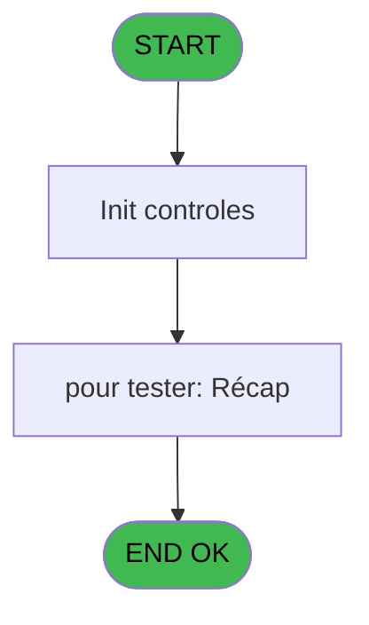
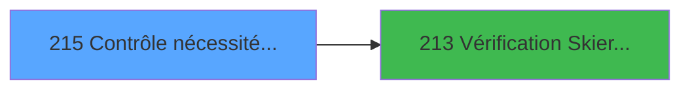

# PVE IDE 215 - Contrôle nécessité calcul DIN

> **Analyse**: Phases 1-4 2026-02-03 18:57 -> 18:58 (19s) | Assemblage 18:58
> **Pipeline**: V7.2 Enrichi
> **Structure**: 4 onglets (Resume | Ecrans | Donnees | Connexions)

<!-- TAB:Resume -->

## 1. FICHE D'IDENTITE

| Attribut | Valeur |
|----------|--------|
| Projet | PVE |
| IDE Position | 215 |
| Nom Programme | Contrôle nécessité calcul DIN |
| Fichier source | `Prg_215.xml` |
| Dossier IDE | Packages |
| Taches | 3 (1 ecrans visibles) |
| Tables modifiees | 0 |
| Programmes appeles | 1 |

## 2. DESCRIPTION FONCTIONNELLE

**Contrôle nécessité calcul DIN** assure la gestion complete de ce processus, accessible depuis [Main Sale-664 (IDE 187)](PVE-IDE-187.md), [Main Sale-664 (IDE 364)](PVE-IDE-364.md).

Le flux de traitement s'organise en **2 blocs fonctionnels** :

- **Calcul** (2 taches) : calculs de montants, stocks ou compteurs
- **Traitement** (1 tache) : traitements metier divers

**Logique metier** : 1 regles identifiees couvrant conditions metier.

Detail : phases du traitement

#### Phase 1 : Calcul (2 taches)

- **215** - Contrôle nécessité calcul DIN **[[ECRAN]](#ecran-t1)**
- **215.1** - Contrôle nécessité calcul DIN **[[ECRAN]](#ecran-t2)**

#### Phase 2 : Traitement (1 tache)

- **215.2** - Récap **[[ECRAN]](#ecran-t3)**

Delegue a : [Vérification Skier Profile (IDE 213)](PVE-IDE-213.md)

## 3. BLOCS FONCTIONNELS

### 3.1 Calcul (2 taches)

Calculs metier : montants, stocks, compteurs.

---

#### 215 - Contrôle nécessité calcul DIN [[ECRAN]](#ecran-t1)

**Role** : Calcul : Contrôle nécessité calcul DIN.
**Ecran** : 383 x 194 DLU (Type6) | [Voir mockup](#ecran-t1)

---

#### 215.1 - Contrôle nécessité calcul DIN [[ECRAN]](#ecran-t2)

**Role** : Calcul : Contrôle nécessité calcul DIN.
**Ecran** : 170 x 46 DLU (MDI) | [Voir mockup](#ecran-t2)

### 3.2 Traitement (1 tache)

Traitements internes.

---

#### 215.2 - Récap [[ECRAN]](#ecran-t3)

**Role** : Traitement : Récap.
**Ecran** : 382 x 194 DLU | [Voir mockup](#ecran-t3)
**Delegue a** : [Vérification Skier Profile (IDE 213)](PVE-IDE-213.md)

## 5. REGLES METIER

1 regles identifiees:

### Autres (1 regles)

#### [RM-001] Si P.i.ALL filiations ? [D] alors 0 sinon P.i.Filiation [C])

| Element | Detail |
|---------|--------|
| **Condition** | `P.i.ALL filiations ? [D]` |
| **Si vrai** | 0 |
| **Si faux** | P.i.Filiation [C]) |
| **Variables** | C (P.i.Filiation), D (P.i.ALL filiations ?) |
| **Expression source** | Expression 5 : `IF(P.i.ALL filiations ? [D],0,P.i.Filiation [C])` |
| **Exemple** | Si P.i.ALL filiations ? [D] → 0. Sinon → P.i.Filiation [C]) |

## 6. CONTEXTE

- **Appele par**: [Main Sale-664 (IDE 187)](PVE-IDE-187.md), [Main Sale-664 (IDE 364)](PVE-IDE-364.md)
- **Appelle**: 1 programmes | **Tables**: 3 (W:0 R:2 L:1) | **Taches**: 3 | **Expressions**: 10

<!-- TAB:Ecrans -->

## 8. ECRANS

### 8.1 Forms visibles (1 / 3)

| # | Position | Tache | Nom | Type | Largeur | Hauteur | Bloc |
|---|----------|-------|-----|------|---------|---------|------|
| 1 | 215.2 | 215.2 | Récap | Type0 | 382 | 194 | Traitement |

### 8.2 Mockups Ecrans

---

#### 215.2 - Récap
**Tache** : [215.2](#t3) | **Type** : Type0 | **Dimensions** : 382 x 194 DLU
**Bloc** : Traitement | **Titre IDE** : Récap

<!-- FORM-DATA:
{
    "width":  382,
    "vFactor":  8,
    "type":  "Type0",
    "hFactor":  4,
    "controls":  [
                     {
                         "x":  9,
                         "type":  "label",
                         "var":  "",
                         "y":  4,
                         "w":  58,
                         "fmt":  "",
                         "name":  "",
                         "h":  9,
                         "color":  "189",
                         "text":  "n° à compléter",
                         "parent":  null
                     },
                     {
                         "x":  9,
                         "type":  "label",
                         "var":  "",
                         "y":  26,
                         "w":  120,
                         "fmt":  "",
                         "name":  "",
                         "h":  9,
                         "color":  "189",
                         "text":  "# filiations total",
                         "parent":  null
                     },
                     {
                         "x":  9,
                         "type":  "label",
                         "var":  "",
                         "y":  48,
                         "w":  120,
                         "fmt":  "",
                         "name":  "",
                         "h":  9,
                         "color":  "189",
                         "text":  "# filiations PAS ok",
                         "parent":  null
                     },
                     {
                         "x":  249,
                         "type":  "label",
                         "var":  "",
                         "y":  48,
                         "w":  58,
                         "fmt":  "",
                         "name":  "",
                         "h":  9,
                         "color":  "189",
                         "text":  "n° à compléter",
                         "parent":  null
                     },
                     {
                         "x":  9,
                         "type":  "label",
                         "var":  "",
                         "y":  70,
                         "w":  120,
                         "fmt":  "",
                         "name":  "",
                         "h":  9,
                         "color":  "189",
                         "text":  "# filiations OK",
                         "parent":  null
                     },
                     {
                         "x":  6,
                         "type":  "label",
                         "var":  "",
                         "y":  96,
                         "w":  150,
                         "fmt":  "",
                         "name":  "",
                         "h":  9,
                         "color":  "189",
                         "text":  "noms filiations Skier Profile PAS ok",
                         "parent":  null
                     },
                     {
                         "x":  165,
                         "type":  "edit",
                         "var":  "",
                         "y":  4,
                         "w":  60,
                         "fmt":  "",
                         "name":  "P.i.Filiation_0001",
                         "h":  9,
                         "color":  "",
                         "text":  "",
                         "parent":  null
                     },
                     {
                         "x":  165,
                         "type":  "edit",
                         "var":  "",
                         "y":  26,
                         "w":  60,
                         "fmt":  "",
                         "name":  "v.# de filiations total",
                         "h":  9,
                         "color":  "",
                         "text":  "",
                         "parent":  null
                     },
                     {
                         "x":  165,
                         "type":  "edit",
                         "var":  "",
                         "y":  48,
                         "w":  60,
                         "fmt":  "",
                         "name":  "v.# de filiations à vérifier",
                         "h":  9,
                         "color":  "",
                         "text":  "",
                         "parent":  null
                     },
                     {
                         "x":  311,
                         "type":  "edit",
                         "var":  "",
                         "y":  48,
                         "w":  60,
                         "fmt":  "",
                         "name":  "v.n° Filiation à compléte_0001",
                         "h":  9,
                         "color":  "",
                         "text":  "",
                         "parent":  null
                     },
                     {
                         "x":  165,
                         "type":  "edit",
                         "var":  "",
                         "y":  70,
                         "w":  60,
                         "fmt":  "",
                         "name":  "v.# de filiations à vérifier OK",
                         "h":  9,
                         "color":  "",
                         "text":  "",
                         "parent":  null
                     },
                     {
                         "x":  165,
                         "type":  "edit",
                         "var":  "",
                         "y":  96,
                         "w":  210,
                         "fmt":  "",
                         "name":  "v.noms filiations à compléter",
                         "h":  72,
                         "color":  "",
                         "text":  "",
                         "parent":  null
                     },
                     {
                         "x":  333,
                         "type":  "button",
                         "var":  "",
                         "y":  174,
                         "w":  28,
                         "fmt":  "Fin",
                         "name":  "",
                         "h":  10,
                         "color":  "",
                         "text":  "",
                         "parent":  null
                     }
                 ],
    "taskId":  "215.2",
    "height":  194
}
-->

<strong>Champs : 6 champs</strong>

| Pos (x,y) | Nom | Variable | Type |
|-----------|-----|----------|------|
| 165,4 | P.i.Filiation_0001 | - | edit |
| 165,26 | v.# de filiations total | - | edit |
| 165,48 | v.# de filiations à vérifier | - | edit |
| 311,48 | v.n° Filiation à compléte_0001 | - | edit |
| 165,70 | v.# de filiations à vérifier OK | - | edit |
| 165,96 | v.noms filiations à compléter | - | edit |

<strong>Boutons : 1 boutons</strong>

| Bouton | Pos (x,y) | Action |
|--------|-----------|--------|
| Fin | 333,174 | Bouton fonctionnel |

## 9. NAVIGATION

Ecran unique: **Récap**

### 9.3 Structure hierarchique (3 taches)

| Position | Tache | Type | Dimensions | Bloc |
|----------|-------|------|------------|------|
| **215.1** | [**Contrôle nécessité calcul DIN** (215)](#t1) [mockup](#ecran-t1) | Type6 | 383x194 | Calcul |
| 215.1.1 | [Contrôle nécessité calcul DIN (215.1)](#t2) [mockup](#ecran-t2) | MDI | 170x46 | |
| **215.2** | [**Récap** (215.2)](#t3) [mockup](#ecran-t3) | - | 382x194 | Traitement |

### 9.4 Algorigramme

> **Legende**: Vert = START/END OK | Rouge = END KO | Bleu = Decisions
> *Algorigramme auto-genere. Utiliser `/algorigramme` pour une synthese metier detaillee.*

<!-- TAB:Donnees -->

## 10. TABLES

### Tables utilisees (3)

| ID | Nom | Description | Type | R | W | L | Usages |
|----|-----|-------------|------|---|---|---|--------|
| 382 | pv_discount_reasons |  | DB | R |   |   | 1 |
| 404 | pv_sellers_by_week |  | DB | R |   |   | 1 |
| 419 | realise_articles_caution | Articles et stock | DB |   |   | L | 1 |

### Colonnes par table (1 / 2 tables avec colonnes identifiees)

Table 382 - pv_discount_reasons (R) - 1 usages

| Lettre | Variable | Acces | Type |
|--------|----------|-------|------|
| A | P.i.Societe | R | Unicode |
| B | P.i.Compte | R | Numeric |
| C | P.i.Filiation | R | Numeric |
| D | P.i.ALL filiations ? | R | Logical |
| E | P.o.n° Filiation à compléter | R | Numeric |
| F | P.o.noms filiations à compléter | R | Alpha |
| G | P.o.# de filiations pas OK | R | Numeric |
| H | P.o.filiat. à compl Ski/Board | R | Alpha |
| I | v.# de filiations total | R | Numeric |
| J | v.# de filiations pas OK | R | Numeric |
| K | v.# de filiations OK | R | Numeric |
| L | v.n° Filiation à compléter | R | Numeric |
| M | v.noms filiations à compléter | R | Alpha |

Table 404 - pv_sellers_by_week (R) - 1 usages

*Table utilisee uniquement en Link ou aucune colonne Real identifiee dans le DataView.*

## 11. VARIABLES

### 11.1 Parametres entrants (8)

Variables recues du programme appelant ([Main Sale-664 (IDE 187)](PVE-IDE-187.md)).

| Lettre | Nom | Type | Usage dans |
|--------|-----|------|-----------|
| A | P.i.Societe | Unicode | 1x parametre entrant |
| B | P.i.Compte | Numeric | 1x parametre entrant |
| C | P.i.Filiation | Numeric | 2x parametre entrant |
| D | P.i.ALL filiations ? | Logical | 2x parametre entrant |
| E | P.o.n° Filiation à compléter | Numeric | - |
| F | P.o.noms filiations à compléter | Alpha | - |
| G | P.o.# de filiations pas OK | Numeric | - |
| H | P.o.filiat. à compl Ski/Board | Alpha | - |

### 11.2 Variables de session (5)

Variables persistantes pendant toute la session.

| Lettre | Nom | Type | Usage dans |
|--------|-----|------|-----------|
| I | v.# de filiations total | Numeric | - |
| J | v.# de filiations pas OK | Numeric | - |
| K | v.# de filiations OK | Numeric | - |
| L | v.n° Filiation à compléter | Numeric | - |
| M | v.noms filiations à compléter | Alpha | - |

## 12. EXPRESSIONS

**10 / 10 expressions decodees (100%)**

### 12.1 Repartition par type

| Type | Expressions | Regles |
|------|-------------|--------|
| CALCULATION | 1 | 0 |
| CONDITION | 2 | 5 |
| CONSTANTE | 2 | 0 |
| OTHER | 5 | 0 |

### 12.2 Expressions cles par type

#### CALCULATION (1 expressions)

| Type | IDE | Expression | Regle |
|------|-----|------------|-------|
| CALCULATION | 7 | `[O]+1` | - |

#### CONDITION (2 expressions)

| Type | IDE | Expression | Regle |
|------|-----|------------|-------|
| CONDITION | 5 | `IF(P.i.ALL filiations ? [D],0,P.i.Filiation [C])` | [RM-001](#rm-RM-001) |
| CONDITION | 6 | `IF(P.i.ALL filiations ? [D],999,P.i.Filiation [C])` | - |

#### CONSTANTE (2 expressions)

| Type | IDE | Expression | Regle |
|------|-----|------------|-------|
| CONSTANTE | 2 | `''` | - |
| CONSTANTE | 1 | `0` | - |

#### OTHER (5 expressions)

| Type | IDE | Expression | Regle |
|------|-----|------------|-------|
| OTHER | 9 | `[S]` | - |
| OTHER | 10 | `[P]` | - |
| OTHER | 8 | `[R]` | - |
| OTHER | 3 | `P.i.Societe [A]` | - |
| OTHER | 4 | `P.i.Compte [B]` | - |

<!-- TAB:Connexions -->

## 13. GRAPHE D'APPELS

### 13.1 Chaine depuis Main (Callers)

Main -> ... -> [Main Sale-664 (IDE 187)](PVE-IDE-187.md) -> **Contrôle nécessité calcul DIN (IDE 215)**

Main -> ... -> [Main Sale-664 (IDE 364)](PVE-IDE-364.md) -> **Contrôle nécessité calcul DIN (IDE 215)**

### 13.2 Callers

| IDE | Nom Programme | Nb Appels |
|-----|---------------|-----------|
| [187](PVE-IDE-187.md) | Main Sale-664 | 1 |
| [364](PVE-IDE-364.md) | Main Sale-664 | 1 |

### 13.3 Callees (programmes appeles)

### 13.4 Detail Callees avec contexte

| IDE | Nom Programme | Appels | Contexte |
|-----|---------------|--------|----------|
| [213](PVE-IDE-213.md) | Vérification Skier Profile | 2 | Sous-programme |

## 14. RECOMMANDATIONS MIGRATION

### 14.1 Profil du programme

| Metrique | Valeur | Impact migration |
|----------|--------|-----------------|
| Lignes de logique | 80 | Programme compact |
| Expressions | 10 | Peu de logique |
| Tables WRITE | 0 | Impact faible |
| Sous-programmes | 1 | Peu de dependances |
| Ecrans visibles | 1 | Ecran unique ou traitement batch |
| Code desactive | 0% (0 / 80) | Code sain |
| Regles metier | 1 | Quelques regles a preserver |

### 14.2 Plan de migration par bloc

#### Calcul (2 taches: 2 ecrans, 0 traitement)

- **Strategie** : Services de calcul purs (Domain Services).
- Migrer la logique de calcul (stock, compteurs, montants)

#### Traitement (1 tache: 1 ecran, 0 traitement)

- **Strategie** : 1 composant(s) UI (Razor/React) avec formulaires et validation.
- 1 sous-programme(s) a migrer ou a reutiliser depuis les services existants.
- Decomposer les taches en services unitaires testables.

### 14.3 Dependances critiques

| Dependance | Type | Appels | Impact |
|------------|------|--------|--------|
| [Vérification Skier Profile (IDE 213)](PVE-IDE-213.md) | Sous-programme | 2x | Haute - Sous-programme |

---
*Spec DETAILED generee par Pipeline V7.2 - 2026-02-03 18:58*
