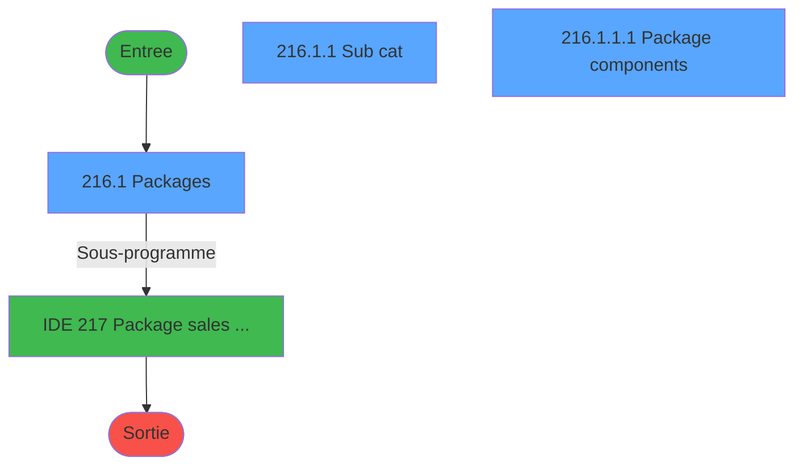
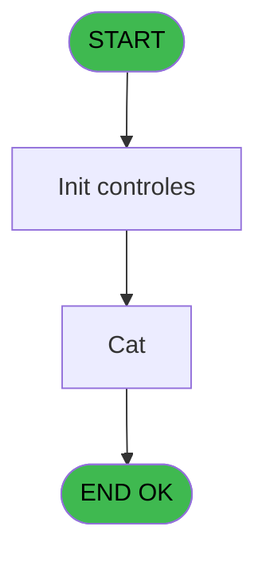
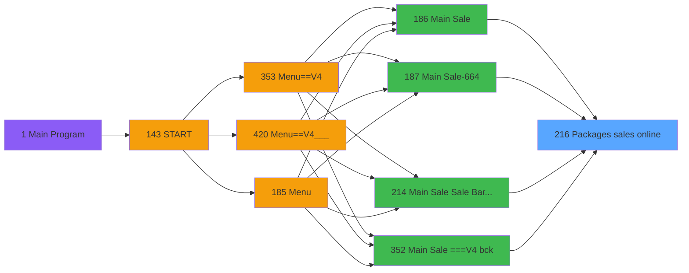
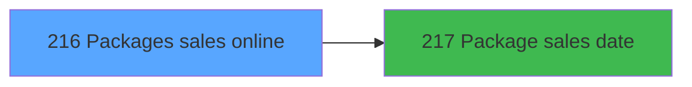

# PVE IDE 216 - Packages sales online

> **Analyse**: Phases 1-4 2026-02-03 18:58 -> 18:58 (17s) | Assemblage 18:58
> **Pipeline**: V7.2 Enrichi
> **Structure**: 4 onglets (Resume | Ecrans | Donnees | Connexions)

<!-- TAB:Resume -->

## 1. FICHE D'IDENTITE

| Attribut | Valeur |
|----------|--------|
| Projet | PVE |
| IDE Position | 216 |
| Nom Programme | Packages sales online |
| Fichier source | `Prg_216.xml` |
| Dossier IDE | Packages |
| Taches | 4 (3 ecrans visibles) |
| Tables modifiees | 0 |
| Programmes appeles | 1 |

## 2. DESCRIPTION FONCTIONNELLE

**Packages sales online** assure la gestion complete de ce processus, accessible depuis [Menu Main (TPE) (IDE 403)](PVE-IDE-403.md), [Main Sale ===V4 (IDE 0)](PVE-IDE-0.md), [Main Sale (IDE 186)](PVE-IDE-186.md), [Main Sale-664 (IDE 187)](PVE-IDE-187.md), [Main Sale Sale Bar Code (IDE 214)](PVE-IDE-214.md), [Main Sale ===V4 bck (IDE 352)](PVE-IDE-352.md), [Main Sale ===V4 (IDE 354)](PVE-IDE-354.md), [Main Sale ===V4 (IDE 359)](PVE-IDE-359.md), [Main Sale (IDE 363)](PVE-IDE-363.md), [Main Sale-664 (IDE 364)](PVE-IDE-364.md), [Main Sale ===V4 (IDE 409)](PVE-IDE-409.md), [Main Sale ===V4 (IDE 415)](PVE-IDE-415.md), [Main Sale ===V4 Booking ACTUEL (IDE 417)](PVE-IDE-417.md), [Main Sale (IDE 440)](PVE-IDE-440.md).

Le flux de traitement s'organise en **1 blocs fonctionnels** :

- **Traitement** (4 taches) : traitements metier divers

Detail : phases du traitement

#### Phase 1 : Traitement (4 taches)

- **216** - Packages sales online **[[ECRAN]](#ecran-t1)**
- **216.1** - Packages **[[ECRAN]](#ecran-t2)**
- **216.1.1** - Sub cat **[[ECRAN]](#ecran-t3)**
- **216.1.1.1** - Package components **[[ECRAN]](#ecran-t4)**

Delegue a : [  Package sales date (IDE 217)](PVE-IDE-217.md)

## 3. BLOCS FONCTIONNELS

### 3.1 Traitement (4 taches)

Traitements internes.

---

#### 216 - Packages sales online [[ECRAN]](#ecran-t1)

**Role** : Traitement : Packages sales online.
**Ecran** : 809 x 394 DLU (MDI) | [Voir mockup](#ecran-t1)

3 sous-taches directes

| Tache | Nom | Bloc |
|-------|-----|------|
| [216.1](#t2) | Packages **[[ECRAN]](#ecran-t2)** | Traitement |
| [216.1.1](#t3) | Sub cat **[[ECRAN]](#ecran-t3)** | Traitement |
| [216.1.1.1](#t4) | Package components **[[ECRAN]](#ecran-t4)** | Traitement |

**Delegue a** : [  Package sales date (IDE 217)](PVE-IDE-217.md)

---

#### 216.1 - Packages [[ECRAN]](#ecran-t2)

**Role** : Traitement : Packages.
**Ecran** : 586 x 367 DLU (MDI) | [Voir mockup](#ecran-t2)
**Delegue a** : [  Package sales date (IDE 217)](PVE-IDE-217.md)

---

#### 216.1.1 - Sub cat [[ECRAN]](#ecran-t3)

**Role** : Traitement : Sub cat.
**Ecran** : 396 x 279 DLU (Modal) | [Voir mockup](#ecran-t3)
**Delegue a** : [  Package sales date (IDE 217)](PVE-IDE-217.md)

---

#### 216.1.1.1 - Package components [[ECRAN]](#ecran-t4)

**Role** : Traitement : Package components.
**Ecran** : 187 x 173 DLU (Modal) | [Voir mockup](#ecran-t4)
**Variables liees** : B (P. Package id)
**Delegue a** : [  Package sales date (IDE 217)](PVE-IDE-217.md)

## 5. REGLES METIER

*(Aucune regle metier identifiee)*

## 6. CONTEXTE

- **Appele par**: [Menu Main (TPE) (IDE 403)](PVE-IDE-403.md), [Main Sale ===V4 (IDE 0)](PVE-IDE-0.md), [Main Sale (IDE 186)](PVE-IDE-186.md), [Main Sale-664 (IDE 187)](PVE-IDE-187.md), [Main Sale Sale Bar Code (IDE 214)](PVE-IDE-214.md), [Main Sale ===V4 bck (IDE 352)](PVE-IDE-352.md), [Main Sale ===V4 (IDE 354)](PVE-IDE-354.md), [Main Sale ===V4 (IDE 359)](PVE-IDE-359.md), [Main Sale (IDE 363)](PVE-IDE-363.md), [Main Sale-664 (IDE 364)](PVE-IDE-364.md), [Main Sale ===V4 (IDE 409)](PVE-IDE-409.md), [Main Sale ===V4 (IDE 415)](PVE-IDE-415.md), [Main Sale ===V4 Booking ACTUEL (IDE 417)](PVE-IDE-417.md), [Main Sale (IDE 440)](PVE-IDE-440.md)
- **Appelle**: 1 programmes | **Tables**: 7 (W:0 R:3 L:4) | **Taches**: 4 | **Expressions**: 1

<!-- TAB:Ecrans -->

## 8. ECRANS

### 8.1 Forms visibles (3 / 4)

| # | Position | Tache | Nom | Type | Largeur | Hauteur | Bloc |
|---|----------|-------|-----|------|---------|---------|------|
| 1 | 216.1 | 216.1 | Packages | MDI | 586 | 367 | Traitement |
| 2 | 216.1.1 | 216.1.1 | Sub cat | Modal | 396 | 279 | Traitement |
| 3 | 216.1.1.1 | 216.1.1.1 | Package components | Modal | 187 | 173 | Traitement |

### 8.2 Mockups Ecrans

---

#### 216.1 - Packages
**Tache** : [216.1](#t2) | **Type** : MDI | **Dimensions** : 586 x 367 DLU
**Bloc** : Traitement | **Titre IDE** : Packages

<!-- FORM-DATA:
{
    "width":  586,
    "vFactor":  8,
    "type":  "MDI",
    "hFactor":  4,
    "controls":  [
                     {
                         "x":  10,
                         "type":  "label",
                         "var":  "",
                         "y":  48,
                         "w":  160,
                         "fmt":  "",
                         "name":  "",
                         "h":  17,
                         "color":  "183",
                         "text":  "Category",
                         "parent":  null
                     },
                     {
                         "x":  0,
                         "type":  "label",
                         "var":  "",
                         "y":  0,
                         "w":  584,
                         "fmt":  "",
                         "name":  "",
                         "h":  42,
                         "color":  "182",
                         "text":  "",
                         "parent":  null
                     },
                     {
                         "x":  14,
                         "type":  "label",
                         "var":  "",
                         "y":  16,
                         "w":  148,
                         "fmt":  "",
                         "name":  "",
                         "h":  8,
                         "color":  "186",
                         "text":  "Select the appropriate package",
                         "parent":  2
                     },
                     {
                         "x":  10,
                         "type":  "table",
                         "var":  "",
                         "name":  "",
                         "titleH":  12,
                         "color":  "110",
                         "w":  125,
                         "y":  66,
                         "fmt":  "",
                         "parent":  null,
                         "text":  "",
                         "rowH":  25,
                         "h":  252,
                         "cols":  [
                                      {
                                          "title":  "",
                                          "layer":  1,
                                          "w":  125
                                      }
                                  ],
                         "rows":  1
                     },
                     {
                         "x":  118,
                         "type":  "label",
                         "var":  "",
                         "y":  67,
                         "w":  14,
                         "fmt":  "",
                         "name":  "",
                         "h":  24,
                         "color":  "144",
                         "text":  "ü",
                         "parent":  6
                     },
                     {
                         "x":  0,
                         "type":  "label",
                         "var":  "",
                         "y":  331,
                         "w":  584,
                         "fmt":  "",
                         "name":  "",
                         "h":  33,
                         "color":  "6",
                         "text":  "",
                         "parent":  null
                     },
                     {
                         "x":  12,
                         "type":  "button",
                         "var":  "",
                         "y":  67,
                         "w":  104,
                         "fmt":  "",
                         "name":  "CTRL_001",
                         "h":  25,
                         "color":  "",
                         "text":  "",
                         "parent":  6
                     },
                     {
                         "x":  534,
                         "type":  "image",
                         "var":  "",
                         "y":  4,
                         "w":  48,
                         "fmt":  "",
                         "name":  "",
                         "h":  37,
                         "color":  "",
                         "text":  "",
                         "parent":  2
                     },
                     {
                         "x":  139,
                         "type":  "button",
                         "var":  "",
                         "y":  67,
                         "w":  36,
                         "fmt":  "ñ",
                         "name":  "",
                         "h":  126,
                         "color":  "",
                         "text":  "",
                         "parent":  null
                     },
                     {
                         "x":  139,
                         "type":  "button",
                         "var":  "",
                         "y":  193,
                         "w":  36,
                         "fmt":  "ò",
                         "name":  "",
                         "h":  126,
                         "color":  "",
                         "text":  "",
                         "parent":  null
                     },
                     {
                         "x":  506,
                         "type":  "button",
                         "var":  "",
                         "y":  336,
                         "w":  77,
                         "fmt":  "\u0026Exit",
                         "name":  "",
                         "h":  28,
                         "color":  "",
                         "text":  "",
                         "parent":  null
                     },
                     {
                         "x":  177,
                         "type":  "subform",
                         "var":  "",
                         "y":  43,
                         "w":  407,
                         "fmt":  "",
                         "name":  "Sub cat",
                         "h":  286,
                         "color":  "",
                         "text":  "",
                         "parent":  null
                     }
                 ],
    "taskId":  "216.1",
    "height":  367
}
-->

<strong>Boutons : 4 boutons</strong>

| Bouton | Pos (x,y) | Action |
|--------|-----------|--------|
| CTRL_001 | 12,67 | Bouton fonctionnel |
| ñ | 139,67 | Bouton fonctionnel |
| ò | 139,193 | Bouton fonctionnel |
| Exit | 506,336 | Quitte le programme |

---

#### 216.1.1 - Sub cat
**Tache** : [216.1.1](#t3) | **Type** : Modal | **Dimensions** : 396 x 279 DLU
**Bloc** : Traitement | **Titre IDE** : Sub cat

<!-- FORM-DATA:
{
    "width":  396,
    "vFactor":  8,
    "type":  "Modal",
    "hFactor":  4,
    "controls":  [
                     {
                         "x":  6,
                         "type":  "label",
                         "var":  "",
                         "y":  5,
                         "w":  161,
                         "fmt":  "",
                         "name":  "",
                         "h":  17,
                         "color":  "183",
                         "text":  "Sub category",
                         "parent":  null
                     },
                     {
                         "x":  185,
                         "type":  "label",
                         "var":  "",
                         "y":  18,
                         "w":  202,
                         "fmt":  "",
                         "name":  "",
                         "h":  51,
                         "color":  "183",
                         "text":  "Classification",
                         "parent":  null
                     },
                     {
                         "x":  6,
                         "type":  "table",
                         "var":  "",
                         "name":  "",
                         "titleH":  12,
                         "color":  "110",
                         "w":  128,
                         "y":  23,
                         "fmt":  "",
                         "parent":  null,
                         "text":  "",
                         "rowH":  25,
                         "h":  252,
                         "cols":  [
                                      {
                                          "title":  "",
                                          "layer":  1,
                                          "w":  125
                                      }
                                  ],
                         "rows":  1
                     },
                     {
                         "x":  114,
                         "type":  "label",
                         "var":  "",
                         "y":  24,
                         "w":  14,
                         "fmt":  "",
                         "name":  "",
                         "h":  24,
                         "color":  "144",
                         "text":  "ü",
                         "parent":  4
                     },
                     {
                         "x":  185,
                         "type":  "label",
                         "var":  "",
                         "y":  82,
                         "w":  202,
                         "fmt":  "",
                         "name":  "",
                         "h":  191,
                         "color":  "183",
                         "text":  "Equipments",
                         "parent":  null
                     },
                     {
                         "x":  7,
                         "type":  "button",
                         "var":  "",
                         "y":  24,
                         "w":  107,
                         "fmt":  "",
                         "name":  "CTRL_001",
                         "h":  25,
                         "color":  "",
                         "text":  "",
                         "parent":  4
                     },
                     {
                         "x":  199,
                         "type":  "edit",
                         "var":  "",
                         "y":  39,
                         "w":  175,
                         "fmt":  "",
                         "name":  "",
                         "h":  19,
                         "color":  "",
                         "text":  "",
                         "parent":  2
                     },
                     {
                         "x":  134,
                         "type":  "button",
                         "var":  "",
                         "y":  24,
                         "w":  36,
                         "fmt":  "ñ",
                         "name":  "",
                         "h":  126,
                         "color":  "",
                         "text":  "",
                         "parent":  null
                     },
                     {
                         "x":  134,
                         "type":  "button",
                         "var":  "",
                         "y":  150,
                         "w":  36,
                         "fmt":  "ò",
                         "name":  "",
                         "h":  127,
                         "color":  "",
                         "text":  "",
                         "parent":  null
                     }
                 ],
    "taskId":  "216.1.1",
    "height":  279
}
-->

<strong>Champs : 1 champs</strong>

| Pos (x,y) | Nom | Variable | Type |
|-----------|-----|----------|------|
| 199,39 | (sans nom) | - | edit |

<strong>Boutons : 3 boutons</strong>

| Bouton | Pos (x,y) | Action |
|--------|-----------|--------|
| CTRL_001 | 7,24 | Bouton fonctionnel |
| ñ | 134,24 | Bouton fonctionnel |
| ò | 134,150 | Bouton fonctionnel |

---

#### 216.1.1.1 - Package components
**Tache** : [216.1.1.1](#t4) | **Type** : Modal | **Dimensions** : 187 x 173 DLU
**Bloc** : Traitement | **Titre IDE** : Package components

<!-- FORM-DATA:
{
    "width":  187,
    "vFactor":  8,
    "type":  "Modal",
    "hFactor":  4,
    "controls":  [
                     {
                         "x":  4,
                         "type":  "table",
                         "var":  "",
                         "name":  "",
                         "titleH":  12,
                         "color":  "110",
                         "w":  180,
                         "y":  8,
                         "fmt":  "",
                         "parent":  null,
                         "text":  "",
                         "rowH":  27,
                         "h":  163,
                         "cols":  [
                                      {
                                          "title":  "",
                                          "layer":  1,
                                          "w":  180
                                      }
                                  ],
                         "rows":  1
                     },
                     {
                         "x":  7,
                         "type":  "edit",
                         "var":  "",
                         "y":  10,
                         "w":  174,
                         "fmt":  "30",
                         "name":  "",
                         "h":  22,
                         "color":  "110",
                         "text":  "",
                         "parent":  1
                     }
                 ],
    "taskId":  "216.1.1.1",
    "height":  173
}
-->

<strong>Champs : 1 champs</strong>

| Pos (x,y) | Nom | Variable | Type |
|-----------|-----|----------|------|
| 7,10 | 30 | - | edit |

## 9. NAVIGATION

### 9.1 Enchainement des ecrans

**Detail par enchainement :**

| Depuis | Action | Vers | Retour |
|--------|--------|------|--------|
| Packages | Sous-programme | [  Package sales date (IDE 217)](PVE-IDE-217.md) | Retour ecran |

### 9.3 Structure hierarchique (4 taches)

| Position | Tache | Type | Dimensions | Bloc |
|----------|-------|------|------------|------|
| **216.1** | [**Packages sales online** (216)](#t1) [mockup](#ecran-t1) | MDI | 809x394 | Traitement |
| 216.1.1 | [Packages (216.1)](#t2) [mockup](#ecran-t2) | MDI | 586x367 | |
| 216.1.2 | [Sub cat (216.1.1)](#t3) [mockup](#ecran-t3) | Modal | 396x279 | |
| 216.1.3 | [Package components (216.1.1.1)](#t4) [mockup](#ecran-t4) | Modal | 187x173 | |

### 9.4 Algorigramme

> **Legende**: Vert = START/END OK | Rouge = END KO | Bleu = Decisions
> *Algorigramme auto-genere. Utiliser `/algorigramme` pour une synthese metier detaillee.*

<!-- TAB:Donnees -->

## 10. TABLES

### Tables utilisees (7)

| ID | Nom | Description | Type | R | W | L | Usages |
|----|-----|-------------|------|---|---|---|--------|
| 77 | articles_________art | Articles et stock | DB | R |   |   | 1 |
| 379 | pv_customer_temp |  | DB | R |   |   | 1 |
| 380 | pv_day_modes |  | DB |   |   | L | 1 |
| 401 | pv_cust_rentals_histo | Historique / journal | DB | R |   |   | 1 |
| 403 | pv_sellers |  | DB |   |   | L | 1 |
| 413 | pv_tva |  | DB |   |   | L | 2 |
| 419 | realise_articles_caution | Articles et stock | DB |   |   | L | 1 |

### Colonnes par table (3 / 3 tables avec colonnes identifiees)

Table 77 - articles_________art (R) - 1 usages

| Lettre | Variable | Acces | Type |
|--------|----------|-------|------|
| A | P.Service | R | Unicode |
| B | P.cat | R | Numeric |
| C | v.visible 2 | R | Logical |
| D | v.font 2 | R | Numeric |
| E | T Article | R | Logical |
| F | T Product | R | Logical |

Table 379 - pv_customer_temp (R) - 1 usages

| Lettre | Variable | Acces | Type |
|--------|----------|-------|------|
| A | v.visible 1 | R | Logical |
| B | v.font 1 | R | Numeric |
| C | T S/Catégorie | R | Logical |

Table 401 - pv_cust_rentals_histo (R) - 1 usages

| Lettre | Variable | Acces | Type |
|--------|----------|-------|------|
| A | P. Customer id | R | Numeric |

## 11. VARIABLES

### 11.1 Parametres entrants (6)

Variables recues du programme appelant ([Menu Main (TPE) (IDE 403)](PVE-IDE-403.md)).

| Lettre | Nom | Type | Usage dans |
|--------|-----|------|-----------|
| A | P. Customer id | Numeric | - |
| B | P. Package id | Numeric | - |
| C | P. Action type | Alpha | - |
| D | P. Date debut | Date | - |
| E | P. Date fin | Date | - |
| F | P.Code Fidelisation | Alpha | - |

### 11.2 Variables de session (1)

Variables persistantes pendant toute la session.

| Lettre | Nom | Type | Usage dans |
|--------|-----|------|-----------|
| G | V no exit | Logical | 1x session |

## 12. EXPRESSIONS

**1 / 1 expressions decodees (100%)**

### 12.1 Repartition par type

| Type | Expressions | Regles |
|------|-------------|--------|
| NEGATION | 1 | 0 |

### 12.2 Expressions cles par type

#### NEGATION (1 expressions)

| Type | IDE | Expression | Regle |
|------|-----|------------|-------|
| NEGATION | 1 | `NOT (V no exit [G])` | - |

<!-- TAB:Connexions -->

## 13. GRAPHE D'APPELS

### 13.1 Chaine depuis Main (Callers)

Main -> ... -> [Menu Main (TPE) (IDE 403)](PVE-IDE-403.md) -> **Packages sales online (IDE 216)**

Main -> ... -> [Main Sale ===V4 (IDE 0)](PVE-IDE-0.md) -> **Packages sales online (IDE 216)**

Main -> ... -> [Main Sale (IDE 186)](PVE-IDE-186.md) -> **Packages sales online (IDE 216)**

Main -> ... -> [Main Sale-664 (IDE 187)](PVE-IDE-187.md) -> **Packages sales online (IDE 216)**

Main -> ... -> [Main Sale Sale Bar Code (IDE 214)](PVE-IDE-214.md) -> **Packages sales online (IDE 216)**

Main -> ... -> [Main Sale ===V4 bck (IDE 352)](PVE-IDE-352.md) -> **Packages sales online (IDE 216)**

Main -> ... -> [Main Sale ===V4 (IDE 354)](PVE-IDE-354.md) -> **Packages sales online (IDE 216)**

Main -> ... -> [Main Sale ===V4 (IDE 359)](PVE-IDE-359.md) -> **Packages sales online (IDE 216)**

Main -> ... -> [Main Sale (IDE 363)](PVE-IDE-363.md) -> **Packages sales online (IDE 216)**

Main -> ... -> [Main Sale-664 (IDE 364)](PVE-IDE-364.md) -> **Packages sales online (IDE 216)**

Main -> ... -> [Main Sale ===V4 (IDE 409)](PVE-IDE-409.md) -> **Packages sales online (IDE 216)**

Main -> ... -> [Main Sale ===V4 (IDE 415)](PVE-IDE-415.md) -> **Packages sales online (IDE 216)**

Main -> ... -> [Main Sale ===V4 Booking ACTUEL (IDE 417)](PVE-IDE-417.md) -> **Packages sales online (IDE 216)**

Main -> ... -> [Main Sale (IDE 440)](PVE-IDE-440.md) -> **Packages sales online (IDE 216)**

### 13.2 Callers

| IDE | Nom Programme | Nb Appels |
|-----|---------------|-----------|
| [403](PVE-IDE-403.md) | Menu Main (TPE) | 2 |
| [0](PVE-IDE-0.md) | Main Sale ===V4 | 1 |
| [186](PVE-IDE-186.md) | Main Sale | 1 |
| [187](PVE-IDE-187.md) | Main Sale-664 | 1 |
| [214](PVE-IDE-214.md) | Main Sale Sale Bar Code | 1 |
| [352](PVE-IDE-352.md) | Main Sale ===V4 bck | 1 |
| [354](PVE-IDE-354.md) | Main Sale ===V4 | 1 |
| [359](PVE-IDE-359.md) | Main Sale ===V4 | 1 |
| [363](PVE-IDE-363.md) | Main Sale | 1 |
| [364](PVE-IDE-364.md) | Main Sale-664 | 1 |
| [409](PVE-IDE-409.md) | Main Sale ===V4 | 1 |
| [415](PVE-IDE-415.md) | Main Sale ===V4 | 1 |
| [417](PVE-IDE-417.md) | Main Sale ===V4 Booking ACTUEL | 1 |
| [440](PVE-IDE-440.md) | Main Sale | 1 |

### 13.3 Callees (programmes appeles)

### 13.4 Detail Callees avec contexte

| IDE | Nom Programme | Appels | Contexte |
|-----|---------------|--------|----------|
| [217](PVE-IDE-217.md) |   Package sales date | 1 | Sous-programme |

## 14. RECOMMANDATIONS MIGRATION

### 14.1 Profil du programme

| Metrique | Valeur | Impact migration |
|----------|--------|-----------------|
| Lignes de logique | 82 | Programme compact |
| Expressions | 1 | Peu de logique |
| Tables WRITE | 0 | Impact faible |
| Sous-programmes | 1 | Peu de dependances |
| Ecrans visibles | 3 | Quelques ecrans |
| Code desactive | 0% (0 / 82) | Code sain |
| Regles metier | 0 | Pas de regle identifiee |

### 14.2 Plan de migration par bloc

#### Traitement (4 taches: 4 ecrans, 0 traitement)

- **Strategie** : 4 composant(s) UI (Razor/React) avec formulaires et validation.
- 1 sous-programme(s) a migrer ou a reutiliser depuis les services existants.
- Decomposer les taches en services unitaires testables.

### 14.3 Dependances critiques

| Dependance | Type | Appels | Impact |
|------------|------|--------|--------|
| [  Package sales date (IDE 217)](PVE-IDE-217.md) | Sous-programme | 1x | Normale - Sous-programme |

---
*Spec DETAILED generee par Pipeline V7.2 - 2026-02-03 18:58*
