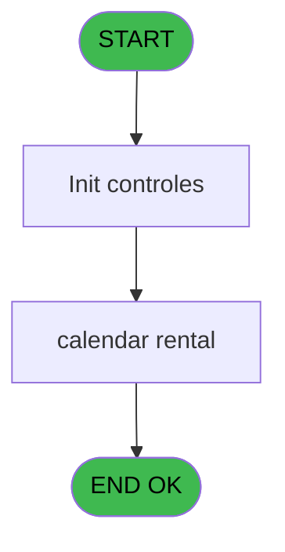
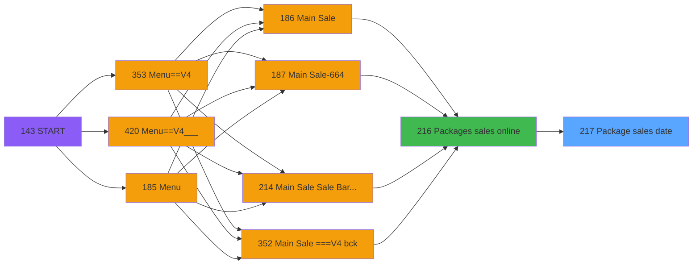
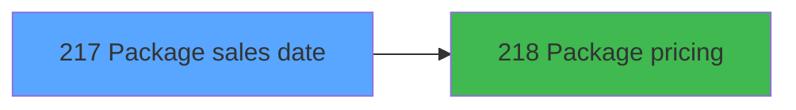

# PVE IDE 217 - Package sales date

> **Analyse**: Phases 1-4 2026-02-03 18:58 -> 18:58 (17s) | Assemblage 18:58
> **Pipeline**: V7.2 Enrichi
> **Structure**: 4 onglets (Resume | Ecrans | Donnees | Connexions)

<!-- TAB:Resume -->

## 1. FICHE D'IDENTITE

| Attribut | Valeur |
|----------|--------|
| Projet | PVE |
| IDE Position | 217 |
| Nom Programme | Package sales date |
| Fichier source | `Prg_217.xml` |
| Dossier IDE | Packages |
| Taches | 3 (1 ecrans visibles) |
| Tables modifiees | 0 |
| Programmes appeles | 1 |

## 2. DESCRIPTION FONCTIONNELLE

**Package sales date** assure la gestion complete de ce processus, accessible depuis [Packages sales online (IDE 216)](PVE-IDE-216.md).

Le flux de traitement s'organise en **1 blocs fonctionnels** :

- **Traitement** (3 taches) : traitements metier divers

## 3. BLOCS FONCTIONNELS

### 3.1 Traitement (3 taches)

Traitements internes.

---

#### 217 - Package sales calendar

**Role** : Traitement : Package sales calendar.
**Variables liees** : B (p.Xtrack package Id)
**Delegue a** : [    Package pricing (IDE 218)](PVE-IDE-218.md)

---

#### 217.1 - Sale & Rental [[ECRAN]](#ecran-t2)

**Role** : Traitement : Sale & Rental.
**Ecran** : 586 x 327 DLU (MDI) | [Voir mockup](#ecran-t2)
**Delegue a** : [    Package pricing (IDE 218)](PVE-IDE-218.md)

---

#### 217.2 - Sale & Rental [[ECRAN]](#ecran-t3)

**Role** : Traitement : Sale & Rental.
**Ecran** : 586 x 319 DLU (MDI) | [Voir mockup](#ecran-t3)
**Delegue a** : [    Package pricing (IDE 218)](PVE-IDE-218.md)

## 5. REGLES METIER

*(Aucune regle metier identifiee)*

## 6. CONTEXTE

- **Appele par**: [Packages sales online (IDE 216)](PVE-IDE-216.md)
- **Appelle**: 1 programmes | **Tables**: 1 (W:0 R:1 L:0) | **Taches**: 3 | **Expressions**: 2

<!-- TAB:Ecrans -->

## 8. ECRANS

### 8.1 Forms visibles (1 / 3)

| # | Position | Tache | Nom | Type | Largeur | Hauteur | Bloc |
|---|----------|-------|-----|------|---------|---------|------|
| 1 | 217.1 | 217.1 | Sale & Rental | MDI | 586 | 327 | Traitement |

### 8.2 Mockups Ecrans

---

#### 217.1 - Sale & Rental
**Tache** : [217.1](#t2) | **Type** : MDI | **Dimensions** : 586 x 327 DLU
**Bloc** : Traitement | **Titre IDE** : Sale & Rental

<!-- FORM-DATA:
{
    "width":  586,
    "vFactor":  8,
    "type":  "MDI",
    "hFactor":  4,
    "controls":  [
                     {
                         "x":  20,
                         "type":  "label",
                         "var":  "",
                         "y":  245,
                         "w":  87,
                         "fmt":  "",
                         "name":  "",
                         "h":  19,
                         "color":  "189",
                         "text":  "# Days",
                         "parent":  null
                     },
                     {
                         "x":  106,
                         "type":  "label",
                         "var":  "",
                         "y":  245,
                         "w":  87,
                         "fmt":  "",
                         "name":  "",
                         "h":  19,
                         "color":  "189",
                         "text":  "",
                         "parent":  null
                     },
                     {
                         "x":  1,
                         "type":  "label",
                         "var":  "",
                         "y":  0,
                         "w":  583,
                         "fmt":  "",
                         "name":  "",
                         "h":  42,
                         "color":  "182",
                         "text":  "",
                         "parent":  null
                     },
                     {
                         "x":  25,
                         "type":  "label",
                         "var":  "",
                         "y":  10,
                         "w":  487,
                         "fmt":  "",
                         "name":  "",
                         "h":  21,
                         "color":  "186",
                         "text":  "Select the appropriate RENTAL package according to the end of stay or proceed with a regular SALE",
                         "parent":  5
                     },
                     {
                         "x":  25,
                         "type":  "label",
                         "var":  "",
                         "y":  14,
                         "w":  487,
                         "fmt":  "",
                         "name":  "",
                         "h":  13,
                         "color":  "186",
                         "text":  "Select the product",
                         "parent":  5
                     },
                     {
                         "x":  20,
                         "type":  "table",
                         "var":  "",
                         "name":  "",
                         "titleH":  12,
                         "color":  "110",
                         "w":  179,
                         "y":  68,
                         "fmt":  "",
                         "parent":  null,
                         "text":  "",
                         "rowH":  25,
                         "h":  177,
                         "cols":  [
                                      {
                                          "title":  "",
                                          "layer":  1,
                                          "w":  174
                                      }
                                  ],
                         "rows":  1
                     },
                     {
                         "x":  25,
                         "type":  "label",
                         "var":  "",
                         "y":  69,
                         "w":  21,
                         "fmt":  "",
                         "name":  "",
                         "h":  24,
                         "color":  "144",
                         "text":  "Ø",
                         "parent":  10
                     },
                     {
                         "x":  1,
                         "type":  "label",
                         "var":  "",
                         "y":  294,
                         "w":  583,
                         "fmt":  "",
                         "name":  "",
                         "h":  33,
                         "color":  "6",
                         "text":  "",
                         "parent":  null
                     },
                     {
                         "x":  153,
                         "type":  "label",
                         "var":  "",
                         "y":  302,
                         "w":  87,
                         "fmt":  "",
                         "name":  "",
                         "h":  18,
                         "color":  "148",
                         "text":  "Today :",
                         "parent":  16
                     },
                     {
                         "x":  43,
                         "type":  "button",
                         "var":  "",
                         "y":  69,
                         "w":  151,
                         "fmt":  "",
                         "name":  "BP. Date",
                         "h":  25,
                         "color":  "",
                         "text":  "",
                         "parent":  10
                     },
                     {
                         "x":  535,
                         "type":  "image",
                         "var":  "",
                         "y":  4,
                         "w":  48,
                         "fmt":  "",
                         "name":  "",
                         "h":  37,
                         "color":  "",
                         "text":  "",
                         "parent":  5
                     },
                     {
                         "x":  20,
                         "type":  "edit",
                         "var":  "",
                         "y":  49,
                         "w":  174,
                         "fmt":  "30",
                         "name":  "",
                         "h":  20,
                         "color":  "190",
                         "text":  "",
                         "parent":  null
                     },
                     {
                         "x":  198,
                         "type":  "button",
                         "var":  "",
                         "y":  69,
                         "w":  44,
                         "fmt":  "ñ",
                         "name":  "",
                         "h":  88,
                         "color":  "",
                         "text":  "",
                         "parent":  null
                     },
                     {
                         "x":  198,
                         "type":  "button",
                         "var":  "",
                         "y":  157,
                         "w":  44,
                         "fmt":  "ò",
                         "name":  "",
                         "h":  88,
                         "color":  "",
                         "text":  "",
                         "parent":  null
                     },
                     {
                         "x":  128,
                         "type":  "edit",
                         "var":  "",
                         "y":  248,
                         "w":  46,
                         "fmt":  "N4",
                         "name":  "",
                         "h":  13,
                         "color":  "192",
                         "text":  "",
                         "parent":  null
                     },
                     {
                         "x":  506,
                         "type":  "button",
                         "var":  "",
                         "y":  298,
                         "w":  77,
                         "fmt":  "\u0026Cancel",
                         "name":  "",
                         "h":  28,
                         "color":  "",
                         "text":  "",
                         "parent":  null
                     },
                     {
                         "x":  246,
                         "type":  "edit",
                         "var":  "",
                         "y":  302,
                         "w":  202,
                         "fmt":  "WWWWWWWWW DDDD (MMMMMMMM YYT)",
                         "name":  "",
                         "h":  18,
                         "color":  "148",
                         "text":  "",
                         "parent":  16
                     },
                     {
                         "x":  257,
                         "type":  "subform",
                         "var":  "",
                         "y":  42,
                         "w":  326,
                         "fmt":  "",
                         "name":  "Pricing",
                         "h":  252,
                         "color":  "",
                         "text":  "",
                         "parent":  null
                     }
                 ],
    "taskId":  "217.1",
    "height":  327
}
-->

<strong>Champs : 3 champs</strong>

| Pos (x,y) | Nom | Variable | Type |
|-----------|-----|----------|------|
| 20,49 | 30 | - | edit |
| 128,248 | N4 | - | edit |
| 246,302 | WWWWWWWWW DDDD (MMMMMMMM YYT) | - | edit |

<strong>Boutons : 4 boutons</strong>

| Bouton | Pos (x,y) | Action |
|--------|-----------|--------|
| BP. Date | 43,69 | Bouton fonctionnel |
| ñ | 198,69 | Bouton fonctionnel |
| ò | 198,157 | Bouton fonctionnel |
| Cancel | 506,298 | Annule et retour au menu |

## 9. NAVIGATION

Ecran unique: **Sale & Rental**

### 9.3 Structure hierarchique (3 taches)

| Position | Tache | Type | Dimensions | Bloc |
|----------|-------|------|------------|------|
| **217.1** | [**Package sales calendar** (217)](#t1) | Modal | - | Traitement |
| 217.1.1 | [Sale & Rental (217.1)](#t2) [mockup](#ecran-t2) | MDI | 586x327 | |
| 217.1.2 | [Sale & Rental (217.2)](#t3) [mockup](#ecran-t3) | MDI | 586x319 | |

### 9.4 Algorigramme

> **Legende**: Vert = START/END OK | Rouge = END KO | Bleu = Decisions
> *Algorigramme auto-genere. Utiliser `/algorigramme` pour une synthese metier detaillee.*

<!-- TAB:Donnees -->

## 10. TABLES

### Tables utilisees (1)

| ID | Nom | Description | Type | R | W | L | Usages |
|----|-----|-------------|------|---|---|---|--------|
| 385 | pv_equipment |  | DB | R |   |   | 2 |

### Colonnes par table (0 / 1 tables avec colonnes identifiees)

Table 385 - pv_equipment (R) - 2 usages

*Table utilisee uniquement en Link ou aucune colonne Real identifiee dans le DataView.*

## 11. VARIABLES

### 11.1 Parametres entrants (8)

Variables recues du programme appelant ([Packages sales online (IDE 216)](PVE-IDE-216.md)).

| Lettre | Nom | Type | Usage dans |
|--------|-----|------|-----------|
| A | p.xtrack id | Numeric | - |
| B | p.Xtrack package Id | Numeric | - |
| C | p.action type | Alpha | 2x parametre entrant |
| D | p.date start | Date | - |
| E | p.date end | Date | - |
| F | p.cat | Numeric | - |
| G | p.sub cat | Numeric | - |
| H | p.code fidelisation | Alpha | - |

## 12. EXPRESSIONS

**2 / 2 expressions decodees (100%)**

### 12.1 Repartition par type

| Type | Expressions | Regles |
|------|-------------|--------|
| CONDITION | 2 | 0 |

### 12.2 Expressions cles par type

#### CONDITION (2 expressions)

| Type | IDE | Expression | Regle |
|------|-----|------------|-------|
| CONDITION | 2 | `p.action type [C]='SALE'` | - |
| CONDITION | 1 | `p.action type [C]='RENTAL'` | - |

<!-- TAB:Connexions -->

## 13. GRAPHE D'APPELS

### 13.1 Chaine depuis Main (Callers)

Main -> ... -> [Packages sales online (IDE 216)](PVE-IDE-216.md) -> **Package sales date (IDE 217)**

### 13.2 Callers

| IDE | Nom Programme | Nb Appels |
|-----|---------------|-----------|
| [216](PVE-IDE-216.md) | Packages sales online | 1 |

### 13.3 Callees (programmes appeles)

### 13.4 Detail Callees avec contexte

| IDE | Nom Programme | Appels | Contexte |
|-----|---------------|--------|----------|
| [218](PVE-IDE-218.md) |     Package pricing | 4 | Sous-programme |

## 14. RECOMMANDATIONS MIGRATION

### 14.1 Profil du programme

| Metrique | Valeur | Impact migration |
|----------|--------|-----------------|
| Lignes de logique | 32 | Programme compact |
| Expressions | 2 | Peu de logique |
| Tables WRITE | 0 | Impact faible |
| Sous-programmes | 1 | Peu de dependances |
| Ecrans visibles | 1 | Ecran unique ou traitement batch |
| Code desactive | 0% (0 / 32) | Code sain |
| Regles metier | 0 | Pas de regle identifiee |

### 14.2 Plan de migration par bloc

#### Traitement (3 taches: 2 ecrans, 1 traitement)

- **Strategie** : Orchestrateur avec 2 ecrans (Razor/React) et 1 traitements backend (services).
- Les ecrans deviennent des composants UI, les traitements invisibles deviennent des services injectables.
- 1 sous-programme(s) a migrer ou a reutiliser depuis les services existants.
- Decomposer les taches en services unitaires testables.

### 14.3 Dependances critiques

| Dependance | Type | Appels | Impact |
|------------|------|--------|--------|
| [    Package pricing (IDE 218)](PVE-IDE-218.md) | Sous-programme | 4x | **CRITIQUE** - Sous-programme |

---
*Spec DETAILED generee par Pipeline V7.2 - 2026-02-03 18:58*
