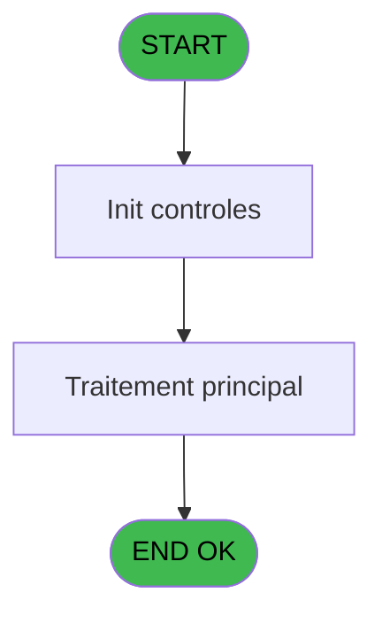
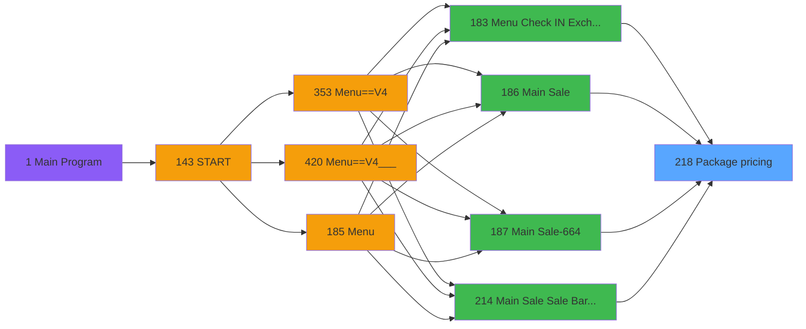
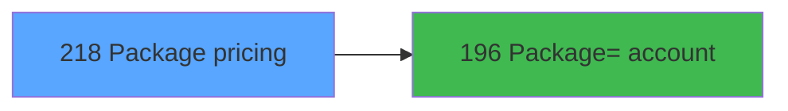

# PVE IDE 218 - Package pricing

> **Analyse**: Phases 1-4 2026-02-03 18:59 -> 18:59 (17s) | Assemblage 18:59
> **Pipeline**: V7.2 Enrichi
> **Structure**: 4 onglets (Resume | Ecrans | Donnees | Connexions)

<!-- TAB:Resume -->

## 1. FICHE D'IDENTITE

| Attribut | Valeur |
|----------|--------|
| Projet | PVE |
| IDE Position | 218 |
| Nom Programme | Package pricing |
| Fichier source | `Prg_218.xml` |
| Dossier IDE | Packages |
| Taches | 2 (1 ecrans visibles) |
| Tables modifiees | 0 |
| Programmes appeles | 1 |

## 2. DESCRIPTION FONCTIONNELLE

**Package pricing** assure la gestion complete de ce processus, accessible depuis [Menu Check IN / Exchange (IDE 183)](PVE-IDE-183.md), [Menu Check IN / Exchange V4 (IDE 401)](PVE-IDE-401.md), [Menu Check IN / Exchange (IDE 410)](PVE-IDE-410.md), [  Package sales date (IDE 217)](PVE-IDE-217.md), [Main Sale (IDE 186)](PVE-IDE-186.md), [Main Sale-664 (IDE 187)](PVE-IDE-187.md), [Main Sale ===V4 (IDE 0)](PVE-IDE-0.md), [Main Sale Sale Bar Code (IDE 214)](PVE-IDE-214.md), [Main Sale ===V4 bck (IDE 352)](PVE-IDE-352.md), [Main Sale ===V4 (IDE 354)](PVE-IDE-354.md), [Main Sale ===V4 (IDE 359)](PVE-IDE-359.md), [Main Sale (IDE 363)](PVE-IDE-363.md), [Main Sale-664 (IDE 364)](PVE-IDE-364.md), [Menu Main (TPE) (IDE 403)](PVE-IDE-403.md), [Main Sale ===V4 (IDE 409)](PVE-IDE-409.md), [Main Sale ===V4 (IDE 415)](PVE-IDE-415.md), [Main Sale ===V4 Booking ACTUEL (IDE 417)](PVE-IDE-417.md), [Main Sale (IDE 440)](PVE-IDE-440.md).

Le flux de traitement s'organise en **1 blocs fonctionnels** :

- **Traitement** (2 taches) : traitements metier divers

**Logique metier** : 8 regles identifiees couvrant conditions metier, valeurs par defaut.

## 3. BLOCS FONCTIONNELS

### 3.1 Traitement (2 taches)

Traitements internes.

---

#### 218 - Package pricing [[ECRAN]](#ecran-t1)

**Role** : Traitement : Package pricing.
**Ecran** : 440 x 244 DLU (MDI) | [Voir mockup](#ecran-t1)
**Variables liees** : B (P. Package Id)
**Delegue a** : [      Package=> account (IDE 196)](PVE-IDE-196.md)

---

#### 218.1 - Keyboard

**Role** : Traitement : Keyboard.
**Delegue a** : [      Package=> account (IDE 196)](PVE-IDE-196.md)

## 5. REGLES METIER

8 regles identifiees:

### Autres (8 regles)

#### [RM-001] Si P. Action [C]='SALE' alors 'Select the product for sale' sinon 'Number of days to be charged')

| Element | Detail |
|---------|--------|
| **Condition** | `P. Action [C]='SALE'` |
| **Si vrai** | 'Select the product for sale' |
| **Si faux** | 'Number of days to be charged') |
| **Variables** | C (P. Action) |
| **Expression source** | Expression 9 : `IF (P. Action [C]='SALE','Select the product for sale','Numb` |
| **Exemple** | Si P. Action [C]='SALE' → 'Select the product for sale'. Sinon → 'Number of days to be charged') |

#### [RM-002] Si P. FlagDate [J]=2 alors P. NbreDaysExtend [K] sinon V.Prix [S])

| Element | Detail |
|---------|--------|
| **Condition** | `P. FlagDate [J]=2` |
| **Si vrai** | P. NbreDaysExtend [K] |
| **Si faux** | V.Prix [S]) |
| **Variables** | J (P. FlagDate), K (P. NbreDaysExtend), S (V.Prix) |
| **Expression source** | Expression 14 : `IF (P. FlagDate [J]=2,P. NbreDaysExtend [K],V.Prix [S])` |
| **Exemple** | Si P. FlagDate [J]=2 → P. NbreDaysExtend [K]. Sinon → V.Prix [S]) |

#### [RM-003] Valeur par defaut si [AN] est vide

| Element | Detail |
|---------|--------|
| **Condition** | `[AN]=''` |
| **Si vrai** | 1 |
| **Si faux** | Val ([AN],'#8'&IF ([W]=0,'#','#.'&Fill ('#',[W])))) |
| **Expression source** | Expression 15 : `IF ([AN]='',1,Val ([AN],'#8'&IF ([W]=0,'#','#.'&Fill ('#',[W` |
| **Exemple** | Si [AN]='' → 1. Sinon → Val ([AN],'#8'&IF ([W]=0,'#','#.'&Fill ('#',[W])))) |

#### [RM-004] Si P. Action [C]='SALE' AND v.isM&E price [V]=0 AND [AK] alors [AM] sinon ExpCalc('44'EXP))

| Element | Detail |
|---------|--------|
| **Condition** | `P. Action [C]='SALE' AND v.isM&E price [V]=0 AND [AK]` |
| **Si vrai** | [AM] |
| **Si faux** | ExpCalc('44'EXP)) |
| **Variables** | C (P. Action), V (v.isM&E price) |
| **Expression source** | Expression 35 : `IF(P. Action [C]='SALE' AND v.isM&E price [V]=0 AND [AK],[AM` |
| **Exemple** | Si P. Action [C]='SALE' AND v.isM&E price [V]=0 AND [AK] → [AM]. Sinon → ExpCalc('44'EXP)) |

#### [RM-005] Si Trim(P. Action [C])='RETURN-' alors P. Date [D]-V Quantité alpha [T] sinon P. Date [D]-V Quantité alpha [T]+1)

| Element | Detail |
|---------|--------|
| **Condition** | `Trim(P. Action [C])='RETURN-'` |
| **Si vrai** | P. Date [D]-V Quantité alpha [T] |
| **Si faux** | P. Date [D]-V Quantité alpha [T]+1) |
| **Variables** | C (P. Action), D (P. Date), T (V Quantité alpha), U (V Quantité) |
| **Expression source** | Expression 39 : `IF(Trim(P. Action [C])='RETURN-',P. Date [D]-V Quantité alph` |
| **Exemple** | Si Trim(P. Action [C])='RETURN-' → P. Date [D]-V Quantité alpha [T]. Sinon → P. Date [D]-V Quantité alpha [T]+1) |

#### [RM-006] Si ExpCalc('49'EXP) alors [BH] sinon v.isM&E price [V])

| Element | Detail |
|---------|--------|
| **Condition** | `ExpCalc('49'EXP)` |
| **Si vrai** | [BH] |
| **Si faux** | v.isM&E price [V]) |
| **Variables** | V (v.isM&E price) |
| **Expression source** | Expression 44 : `IF(ExpCalc('49'EXP),[BH],v.isM&E price [V])` |
| **Exemple** | Si ExpCalc('49'EXP) → [BH]. Sinon → v.isM&E price [V]) |

#### [RM-007] Si ExpCalc('65'EXP) alors [CQ] sinon P. Equipment id [I])

| Element | Detail |
|---------|--------|
| **Condition** | `ExpCalc('65'EXP)` |
| **Si vrai** | [CQ] |
| **Si faux** | P. Equipment id [I]) |
| **Variables** | I (P. Equipment id) |
| **Expression source** | Expression 59 : `IF(ExpCalc('65'EXP),[CQ],P. Equipment id [I])` |
| **Exemple** | Si ExpCalc('65'EXP) → [CQ]. Sinon → P. Equipment id [I]) |

#### [RM-008] Si Left([CY] alors 6)='RETURN' sinon [CX],P. Package Id [B])

| Element | Detail |
|---------|--------|
| **Condition** | `Left([CY]` |
| **Si vrai** | 6)='RETURN' |
| **Si faux** | [CX],P. Package Id [B]) |
| **Variables** | B (P. Package Id) |
| **Expression source** | Expression 66 : `IF(Left([CY],6)='RETURN',[CX],P. Package Id [B])` |
| **Exemple** | Si Left([CY] → 6)='RETURN'. Sinon → [CX],P. Package Id [B]) |
| **Impact** | [218 - Package pricing](#t1) |

## 6. CONTEXTE

- **Appele par**: [Menu Check IN / Exchange (IDE 183)](PVE-IDE-183.md), [Menu Check IN / Exchange V4 (IDE 401)](PVE-IDE-401.md), [Menu Check IN / Exchange (IDE 410)](PVE-IDE-410.md), [  Package sales date (IDE 217)](PVE-IDE-217.md), [Main Sale (IDE 186)](PVE-IDE-186.md), [Main Sale-664 (IDE 187)](PVE-IDE-187.md), [Main Sale ===V4 (IDE 0)](PVE-IDE-0.md), [Main Sale Sale Bar Code (IDE 214)](PVE-IDE-214.md), [Main Sale ===V4 bck (IDE 352)](PVE-IDE-352.md), [Main Sale ===V4 (IDE 354)](PVE-IDE-354.md), [Main Sale ===V4 (IDE 359)](PVE-IDE-359.md), [Main Sale (IDE 363)](PVE-IDE-363.md), [Main Sale-664 (IDE 364)](PVE-IDE-364.md), [Menu Main (TPE) (IDE 403)](PVE-IDE-403.md), [Main Sale ===V4 (IDE 409)](PVE-IDE-409.md), [Main Sale ===V4 (IDE 415)](PVE-IDE-415.md), [Main Sale ===V4 Booking ACTUEL (IDE 417)](PVE-IDE-417.md), [Main Sale (IDE 440)](PVE-IDE-440.md)
- **Appelle**: 1 programmes | **Tables**: 10 (W:0 R:1 L:9) | **Taches**: 2 | **Expressions**: 66

<!-- TAB:Ecrans -->

## 8. ECRANS

### 8.1 Forms visibles (1 / 2)

| # | Position | Tache | Nom | Type | Largeur | Hauteur | Bloc |
|---|----------|-------|-----|------|---------|---------|------|
| 1 | 218 | 218 | Package pricing | MDI | 440 | 244 | Traitement |

### 8.2 Mockups Ecrans

---

#### 218 - Package pricing
**Tache** : [218](#t1) | **Type** : MDI | **Dimensions** : 440 x 244 DLU
**Bloc** : Traitement | **Titre IDE** : Package pricing

<!-- FORM-DATA:
{
    "width":  440,
    "vFactor":  8,
    "type":  "MDI",
    "hFactor":  4,
    "controls":  [
                     {
                         "x":  272,
                         "type":  "label",
                         "var":  "",
                         "y":  6,
                         "w":  74,
                         "fmt":  "",
                         "name":  "",
                         "h":  12,
                         "color":  "183",
                         "text":  "Quantity",
                         "parent":  null
                     },
                     {
                         "x":  273,
                         "type":  "label",
                         "var":  "",
                         "y":  6,
                         "w":  73,
                         "fmt":  "",
                         "name":  "",
                         "h":  12,
                         "color":  "183",
                         "text":  "Price",
                         "parent":  null
                     },
                     {
                         "x":  374,
                         "type":  "label",
                         "var":  "",
                         "y":  8,
                         "w":  51,
                         "fmt":  "",
                         "name":  "",
                         "h":  12,
                         "color":  "183",
                         "text":  "Stock",
                         "parent":  null
                     },
                     {
                         "x":  10,
                         "type":  "table",
                         "var":  "",
                         "name":  "",
                         "titleH":  12,
                         "color":  "110",
                         "w":  210,
                         "y":  27,
                         "fmt":  "",
                         "parent":  null,
                         "text":  "",
                         "rowH":  25,
                         "h":  178,
                         "cols":  [
                                      {
                                          "title":  "",
                                          "layer":  1,
                                          "w":  187
                                      }
                                  ],
                         "rows":  1
                     },
                     {
                         "x":  15,
                         "type":  "label",
                         "var":  "",
                         "y":  28,
                         "w":  21,
                         "fmt":  "",
                         "name":  "",
                         "h":  25,
                         "color":  "144",
                         "text":  "Ø",
                         "parent":  8
                     },
                     {
                         "x":  1,
                         "type":  "label",
                         "var":  "",
                         "y":  211,
                         "w":  436,
                         "fmt":  "",
                         "name":  "",
                         "h":  31,
                         "color":  "6",
                         "text":  "",
                         "parent":  null
                     },
                     {
                         "x":  271,
                         "type":  "label",
                         "var":  "",
                         "y":  45,
                         "w":  160,
                         "fmt":  "",
                         "name":  "",
                         "h":  16,
                         "color":  "183",
                         "text":  "Name",
                         "parent":  null
                     },
                     {
                         "x":  271,
                         "type":  "label",
                         "var":  "",
                         "y":  65,
                         "w":  160,
                         "fmt":  "",
                         "name":  "",
                         "h":  16,
                         "color":  "183",
                         "text":  "First Name",
                         "parent":  null
                     },
                     {
                         "x":  271,
                         "type":  "label",
                         "var":  "",
                         "y":  96,
                         "w":  160,
                         "fmt":  "",
                         "name":  "",
                         "h":  16,
                         "color":  "183",
                         "text":  "Equipment ID",
                         "parent":  null
                     },
                     {
                         "x":  271,
                         "type":  "label",
                         "var":  "",
                         "y":  116,
                         "w":  160,
                         "fmt":  "",
                         "name":  "",
                         "h":  16,
                         "color":  "183",
                         "text":  "Classification",
                         "parent":  null
                     },
                     {
                         "x":  271,
                         "type":  "label",
                         "var":  "",
                         "y":  147,
                         "w":  160,
                         "fmt":  "",
                         "name":  "",
                         "h":  16,
                         "color":  "183",
                         "text":  "Original Rental",
                         "parent":  null
                     },
                     {
                         "x":  271,
                         "type":  "label",
                         "var":  "",
                         "y":  167,
                         "w":  160,
                         "fmt":  "",
                         "name":  "",
                         "h":  16,
                         "color":  "183",
                         "text":  "Start :",
                         "parent":  null
                     },
                     {
                         "x":  271,
                         "type":  "label",
                         "var":  "",
                         "y":  187,
                         "w":  160,
                         "fmt":  "",
                         "name":  "",
                         "h":  16,
                         "color":  "183",
                         "text":  "End :",
                         "parent":  null
                     },
                     {
                         "x":  34,
                         "type":  "button",
                         "var":  "",
                         "y":  28,
                         "w":  102,
                         "fmt":  "",
                         "name":  "",
                         "h":  25,
                         "color":  "",
                         "text":  "",
                         "parent":  8
                     },
                     {
                         "x":  160,
                         "type":  "edit",
                         "var":  "",
                         "y":  28,
                         "w":  57,
                         "fmt":  "4",
                         "name":  "",
                         "h":  23,
                         "color":  "110",
                         "text":  "",
                         "parent":  8
                     },
                     {
                         "x":  357,
                         "type":  "edit",
                         "var":  "",
                         "y":  21,
                         "w":  69,
                         "fmt":  "N9.3C",
                         "name":  "",
                         "h":  16,
                         "color":  "110",
                         "text":  "",
                         "parent":  null
                     },
                     {
                         "x":  271,
                         "type":  "edit",
                         "var":  "",
                         "y":  21,
                         "w":  76,
                         "fmt":  "13",
                         "name":  "V.Prix alpha",
                         "h":  16,
                         "color":  "144",
                         "text":  "",
                         "parent":  null
                     },
                     {
                         "x":  10,
                         "type":  "edit",
                         "var":  "",
                         "y":  8,
                         "w":  150,
                         "fmt":  "30",
                         "name":  "",
                         "h":  20,
                         "color":  "190",
                         "text":  "",
                         "parent":  null
                     },
                     {
                         "x":  220,
                         "type":  "button",
                         "var":  "",
                         "y":  28,
                         "w":  44,
                         "fmt":  "Ù",
                         "name":  "",
                         "h":  84,
                         "color":  "",
                         "text":  "",
                         "parent":  null
                     },
                     {
                         "x":  271,
                         "type":  "button",
                         "var":  "",
                         "y":  43,
                         "w":  53,
                         "fmt":  "1",
                         "name":  "*1",
                         "h":  42,
                         "color":  "",
                         "text":  "",
                         "parent":  null
                     },
                     {
                         "x":  323,
                         "type":  "button",
                         "var":  "",
                         "y":  43,
                         "w":  53,
                         "fmt":  "2",
                         "name":  "*2",
                         "h":  42,
                         "color":  "",
                         "text":  "",
                         "parent":  null
                     },
                     {
                         "x":  375,
                         "type":  "button",
                         "var":  "",
                         "y":  43,
                         "w":  53,
                         "fmt":  "3",
                         "name":  "*3",
                         "h":  42,
                         "color":  "",
                         "text":  "",
                         "parent":  null
                     },
                     {
                         "x":  271,
                         "type":  "button",
                         "var":  "",
                         "y":  85,
                         "w":  53,
                         "fmt":  "4",
                         "name":  "*4",
                         "h":  42,
                         "color":  "",
                         "text":  "",
                         "parent":  null
                     },
                     {
                         "x":  323,
                         "type":  "button",
                         "var":  "",
                         "y":  85,
                         "w":  53,
                         "fmt":  "5",
                         "name":  "*5",
                         "h":  42,
                         "color":  "",
                         "text":  "",
                         "parent":  null
                     },
                     {
                         "x":  375,
                         "type":  "button",
                         "var":  "",
                         "y":  85,
                         "w":  53,
                         "fmt":  "6",
                         "name":  "*6",
                         "h":  42,
                         "color":  "",
                         "text":  "",
                         "parent":  null
                     },
                     {
                         "x":  220,
                         "type":  "button",
                         "var":  "",
                         "y":  112,
                         "w":  44,
                         "fmt":  "Ú",
                         "name":  "",
                         "h":  93,
                         "color":  "",
                         "text":  "",
                         "parent":  null
                     },
                     {
                         "x":  271,
                         "type":  "button",
                         "var":  "",
                         "y":  127,
                         "w":  53,
                         "fmt":  "7",
                         "name":  "*7",
                         "h":  42,
                         "color":  "",
                         "text":  "",
                         "parent":  null
                     },
                     {
                         "x":  323,
                         "type":  "button",
                         "var":  "",
                         "y":  127,
                         "w":  53,
                         "fmt":  "8",
                         "name":  "*8",
                         "h":  42,
                         "color":  "",
                         "text":  "",
                         "parent":  null
                     },
                     {
                         "x":  375,
                         "type":  "button",
                         "var":  "",
                         "y":  127,
                         "w":  53,
                         "fmt":  "9",
                         "name":  "*9",
                         "h":  42,
                         "color":  "",
                         "text":  "",
                         "parent":  null
                     },
                     {
                         "x":  271,
                         "type":  "button",
                         "var":  "",
                         "y":  169,
                         "w":  53,
                         "fmt":  "Clear",
                         "name":  "+CLEAR",
                         "h":  41,
                         "color":  "",
                         "text":  "",
                         "parent":  null
                     },
                     {
                         "x":  324,
                         "type":  "button",
                         "var":  "",
                         "y":  169,
                         "w":  52,
                         "fmt":  "0",
                         "name":  "*0",
                         "h":  21,
                         "color":  "",
                         "text":  "",
                         "parent":  null
                     },
                     {
                         "x":  377,
                         "type":  "button",
                         "var":  "",
                         "y":  169,
                         "w":  51,
                         "fmt":  "Del",
                         "name":  "+BACKSPACE",
                         "h":  41,
                         "color":  "",
                         "text":  "",
                         "parent":  null
                     },
                     {
                         "x":  324,
                         "type":  "button",
                         "var":  "",
                         "y":  190,
                         "w":  52,
                         "fmt":  ".",
                         "name":  "*.",
                         "h":  20,
                         "color":  "",
                         "text":  "",
                         "parent":  null
                     },
                     {
                         "x":  23,
                         "type":  "button",
                         "var":  "",
                         "y":  216,
                         "w":  102,
                         "fmt":  "\u0026Cancel",
                         "name":  "",
                         "h":  25,
                         "color":  "",
                         "text":  "",
                         "parent":  null
                     },
                     {
                         "x":  125,
                         "type":  "button",
                         "var":  "",
                         "y":  216,
                         "w":  102,
                         "fmt":  "\u0026Free",
                         "name":  "",
                         "h":  25,
                         "color":  "",
                         "text":  "",
                         "parent":  null
                     },
                     {
                         "x":  228,
                         "type":  "button",
                         "var":  "",
                         "y":  216,
                         "w":  102,
                         "fmt":  "\u0026Select",
                         "name":  "",
                         "h":  25,
                         "color":  "",
                         "text":  "",
                         "parent":  null
                     },
                     {
                         "x":  271,
                         "type":  "edit",
                         "var":  "",
                         "y":  21,
                         "w":  76,
                         "fmt":  "13",
                         "name":  "V Quantité alpha",
                         "h":  16,
                         "color":  "144",
                         "text":  "",
                         "parent":  null
                     },
                     {
                         "x":  160,
                         "type":  "edit",
                         "var":  "",
                         "y":  8,
                         "w":  61,
                         "fmt":  "30",
                         "name":  "",
                         "h":  20,
                         "color":  "190",
                         "text":  "",
                         "parent":  null
                     }
                 ],
    "taskId":  "218",
    "height":  244
}
-->

<strong>Champs : 6 champs</strong>

| Pos (x,y) | Nom | Variable | Type |
|-----------|-----|----------|------|
| 160,28 | 4 | - | edit |
| 357,21 | N9.3C | - | edit |
| 271,21 | V.Prix alpha | - | edit |
| 10,8 | 30 | - | edit |
| 271,21 | V Quantité alpha | - | edit |
| 160,8 | 30 | - | edit |

<strong>Boutons : 19 boutons</strong>

| Bouton | Pos (x,y) | Action |
|--------|-----------|--------|
| (sans nom) | 34,28 | Action declenchee |
| Ù | 220,28 | Bouton fonctionnel |
| 1 | 271,43 | Bouton fonctionnel |
| 2 | 323,43 | Bouton fonctionnel |
| 3 | 375,43 | Bouton fonctionnel |
| 4 | 271,85 | Bouton fonctionnel |
| 5 | 323,85 | Bouton fonctionnel |
| 6 | 375,85 | Bouton fonctionnel |
| Ú | 220,112 | Bouton fonctionnel |
| 7 | 271,127 | Bouton fonctionnel |
| 8 | 323,127 | Bouton fonctionnel |
| 9 | 375,127 | Bouton fonctionnel |
| Clear | 271,169 | Bouton fonctionnel |
| 0 | 324,169 | Bouton fonctionnel |
| Del | 377,169 | Bouton fonctionnel |
| . | 324,190 | Bouton fonctionnel |
| Cancel | 23,216 | Annule et retour au menu |
| Free | 125,216 | Bouton fonctionnel |
| Select | 228,216 | Ouvre la selection |

## 9. NAVIGATION

Ecran unique: **    Package pricing**

### 9.3 Structure hierarchique (2 taches)

| Position | Tache | Type | Dimensions | Bloc |
|----------|-------|------|------------|------|
| **218.1** | [**Package pricing** (218)](#t1) [mockup](#ecran-t1) | MDI | 440x244 | Traitement |
| 218.1.1 | [Keyboard (218.1)](#t2) | MDI | - | |

### 9.4 Algorigramme

> **Legende**: Vert = START/END OK | Rouge = END KO | Bleu = Decisions
> *Algorigramme auto-genere. Utiliser `/algorigramme` pour une synthese metier detaillee.*

<!-- TAB:Donnees -->

## 10. TABLES

### Tables utilisees (10)

| ID | Nom | Description | Type | R | W | L | Usages |
|----|-----|-------------|------|---|---|---|--------|
| 36 | client_gm |  | DB | R |   |   | 1 |
| 67 | tables___________tab |  | DB |   |   | L | 1 |
| 77 | articles_________art | Articles et stock | DB |   |   | L | 1 |
| 380 | pv_day_modes |  | DB |   |   | L | 1 |
| 382 | pv_discount_reasons |  | DB |   |   | L | 1 |
| 389 | pv_equipment_inventory |  | DB |   |   | L | 1 |
| 400 | pv_cust_rentals |  | DB |   |   | L | 1 |
| 403 | pv_sellers |  | DB |   |   | L | 1 |
| 404 | pv_sellers_by_week |  | DB |   |   | L | 1 |
| 413 | pv_tva |  | DB |   |   | L | 1 |

### Colonnes par table (3 / 1 tables avec colonnes identifiees)

Table 36 - client_gm (R) - 1 usages

| Lettre | Variable | Acces | Type |
|--------|----------|-------|------|
| A | P. Customer Id | R | Numeric |
| B | P. Package Id | R | Numeric |
| C | P. Action | R | Alpha |
| D | P. Date | R | Date |
| E | P. Category | R | Numeric |
| F | P. Sub cat | R | Numeric |
| G | P. No end task condition ? | R | Logical |
| H | P. Cancel requested | R | Logical |
| I | P. Equipment id | R | Alpha |
| J | P. FlagDate | R | Numeric |
| K | P. NbreDaysExtend | R | Numeric |
| L | P.Code Fidelisation | R | Alpha |
| M | P.without invoicing | R | Logical |
| N | P.payment type | R | Unicode |
| O | P.isSeminar? | R | Logical |
| P | V Masque | R | Alpha |
| Q | V Masque sans Z | R | Alpha |
| R | V.Prix alpha | R | Alpha |
| S | V.Prix | R | Numeric |
| T | V Quantité alpha | R | Alpha |
| U | V Quantité | R | Numeric |
| V | v.isM&E price | R | Logical |

## 11. VARIABLES

### 11.1 Parametres entrants (15)

Variables recues du programme appelant ([Menu Check IN / Exchange (IDE 183)](PVE-IDE-183.md)).

| Lettre | Nom | Type | Usage dans |
|--------|-----|------|-----------|
| A | P. Customer Id | Numeric | 1x parametre entrant |
| B | P. Package Id | Numeric | [218](#t1) |
| C | P. Action | Alpha | 17x parametre entrant |
| D | P. Date | Date | 3x parametre entrant |
| E | P. Category | Numeric | 1x parametre entrant |
| F | P. Sub cat | Numeric | 1x parametre entrant |
| G | P. No end task condition ? | Logical | - |
| H | P. Cancel requested | Logical | - |
| I | P. Equipment id | Alpha | 2x parametre entrant |
| J | P. FlagDate | Numeric | 3x parametre entrant |
| K | P. NbreDaysExtend | Numeric | 1x parametre entrant |
| L | P.Code Fidelisation | Alpha | - |
| M | P.without invoicing | Logical | - |
| N | P.payment type | Unicode | 1x parametre entrant |
| O | P.isSeminar? | Logical | 2x parametre entrant |

### 11.2 Variables de session (7)

Variables persistantes pendant toute la session.

| Lettre | Nom | Type | Usage dans |
|--------|-----|------|-----------|
| P | V Masque | Alpha | - |
| Q | V Masque sans Z | Alpha | - |
| R | V.Prix alpha | Alpha | - |
| S | V.Prix | Numeric | 1x session |
| T | V Quantité alpha | Alpha | 2x session |
| U | V Quantité | Numeric | 2x session |
| V | v.isM&E price | Logical | 5x session |

Toutes les 22 variables (liste complete)

| Cat | Lettre | Nom Variable | Type |
|-----|--------|--------------|------|
| P0 | **A** | P. Customer Id | Numeric |
| P0 | **B** | P. Package Id | Numeric |
| P0 | **C** | P. Action | Alpha |
| P0 | **D** | P. Date | Date |
| P0 | **E** | P. Category | Numeric |
| P0 | **F** | P. Sub cat | Numeric |
| P0 | **G** | P. No end task condition ? | Logical |
| P0 | **H** | P. Cancel requested | Logical |
| P0 | **I** | P. Equipment id | Alpha |
| P0 | **J** | P. FlagDate | Numeric |
| P0 | **K** | P. NbreDaysExtend | Numeric |
| P0 | **L** | P.Code Fidelisation | Alpha |
| P0 | **M** | P.without invoicing | Logical |
| P0 | **N** | P.payment type | Unicode |
| P0 | **O** | P.isSeminar? | Logical |
| V. | **P** | V Masque | Alpha |
| V. | **Q** | V Masque sans Z | Alpha |
| V. | **R** | V.Prix alpha | Alpha |
| V. | **S** | V.Prix | Numeric |
| V. | **T** | V Quantité alpha | Alpha |
| V. | **U** | V Quantité | Numeric |
| V. | **V** | v.isM&E price | Logical |

## 12. EXPRESSIONS

**66 / 66 expressions decodees (100%)**

### 12.1 Repartition par type

| Type | Expressions | Regles |
|------|-------------|--------|
| CALCULATION | 1 | 0 |
| CONDITION | 31 | 7 |
| CONCATENATION | 3 | 5 |
| CONSTANTE | 3 | 0 |
| FORMAT | 2 | 0 |
| OTHER | 22 | 0 |
| CAST_LOGIQUE | 2 | 0 |
| NEGATION | 1 | 0 |
| STRING | 1 | 0 |

### 12.2 Expressions cles par type

#### CALCULATION (1 expressions)

| Type | IDE | Expression | Regle |
|------|-----|------------|-------|
| CALCULATION | 25 | `Left (P.payment type [N],Len (Trim (P.payment type [N]))-1)` | - |

#### CONDITION (31 expressions)

| Type | IDE | Expression | Regle |
|------|-----|------------|-------|
| CONDITION | 39 | `IF(Trim(P. Action [C])='RETURN-',P. Date [D]-V Quantité alpha [T],P. Date [D]-V Quantité alpha [T]+1)` | [RM-005](#rm-RM-005) |
| CONDITION | 35 | `IF(P. Action [C]='SALE' AND v.isM&E price [V]=0 AND [AK],[AM],ExpCalc('44'EXP))` | [RM-004](#rm-RM-004) |
| CONDITION | 44 | `IF(ExpCalc('49'EXP),[BH],v.isM&E price [V])` | [RM-006](#rm-RM-006) |
| CONDITION | 66 | `IF(Left([CY],6)='RETURN',[CX],P. Package Id [B])` | [RM-008](#rm-RM-008) |
| CONDITION | 59 | `IF(ExpCalc('65'EXP),[CQ],P. Equipment id [I])` | [RM-007](#rm-RM-007) |
| ... | | *+26 autres* | |

#### CONCATENATION (3 expressions)

| Type | IDE | Expression | Regle |
|------|-----|------------|-------|
| CONCATENATION | 15 | `IF ([AN]='',1,Val ([AN],'#8'&IF ([W]=0,'#','#.'&Fill ('#',[W]))))` | [RM-003](#rm-RM-003) |
| CONCATENATION | 18 | `'N#9'&IF ([W]=0,'#','#.'&Fill ('#',[W]))` | - |
| CONCATENATION | 17 | `'#8'&IF ([W]=0,'#','#.'&Fill ('#',[W]))` | - |

#### CONSTANTE (3 expressions)

| Type | IDE | Expression | Regle |
|------|-----|------------|-------|
| CONSTANTE | 38 | `'O'` | - |
| CONSTANTE | 33 | `'VSERV'` | - |
| CONSTANTE | 32 | `'O'` | - |

#### FORMAT (2 expressions)

| Type | IDE | Expression | Regle |
|------|-----|------------|-------|
| FORMAT | 62 | `'End : '&DStr([CO],'DD/MM/YYYYZ')` | - |
| FORMAT | 61 | `'Start : '&DStr([CN],'DD/MM/YYYYZ')` | - |

#### OTHER (22 expressions)

| Type | IDE | Expression | Regle |
|------|-----|------------|-------|
| OTHER | 48 | `[BV]` | - |
| OTHER | 49 | `[BW]` | - |
| OTHER | 47 | `[BU]` | - |
| OTHER | 43 | `[AT]` | - |
| OTHER | 46 | `P. Package Id [B]` | - |
| ... | | *+17 autres* | |

#### CAST_LOGIQUE (2 expressions)

| Type | IDE | Expression | Regle |
|------|-----|------------|-------|
| CAST_LOGIQUE | 30 | `'FALSE'LOG` | - |
| CAST_LOGIQUE | 10 | `'TRUE'LOG` | - |

#### NEGATION (1 expressions)

| Type | IDE | Expression | Regle |
|------|-----|------------|-------|
| NEGATION | 23 | `NOT ([X])` | - |

#### STRING (1 expressions)

| Type | IDE | Expression | Regle |
|------|-----|------------|-------|
| STRING | 34 | `Val([AL],P.isSeminar? [O])` | - |

### 12.3 Toutes les expressions (66)

Voir les 66 expressions

#### CALCULATION (1)

| IDE | Expression Decodee |
|-----|-------------------|
| 25 | `Left (P.payment type [N],Len (Trim (P.payment type [N]))-1)` |

#### CONDITION (31)

| IDE | Expression Decodee |
|-----|-------------------|
| 9 | `IF (P. Action [C]='SALE','Select the product for sale','Number of days to be charged')` |
| 14 | `IF (P. FlagDate [J]=2,P. NbreDaysExtend [K],V.Prix [S])` |
| 27 | `IF (P. Action [C]='SALE',62,92)` |
| 28 | `IF (P. Action [C]='SALE',80.75,31.25)` |
| 29 | `IF (P. Action [C]='SALE',11.5,15)` |
| 35 | `IF(P. Action [C]='SALE' AND v.isM&E price [V]=0 AND [AK],[AM],ExpCalc('44'EXP))` |
| 39 | `IF(Trim(P. Action [C])='RETURN-',P. Date [D]-V Quantité alpha [T],P. Date [D]-V Quantité alpha [T]+1)` |
| 44 | `IF(ExpCalc('49'EXP),[BH],v.isM&E price [V])` |
| 50 | `IF(ExpCalc('49'EXP),ExpCalc('44'EXP),0)` |
| 51 | `IF(ExpCalc('49'EXP),'PREPAID',ExpCalc('11'EXP))` |
| 52 | `IF(ExpCalc('49'EXP),'M&E Price','Price')` |
| 59 | `IF(ExpCalc('65'EXP),[CQ],P. Equipment id [I])` |
| 66 | `IF(Left([CY],6)='RETURN',[CX],P. Package Id [B])` |
| 1 | `V Quantité alpha [T]=GetParam ('MODEDAYINC')+P. Date [D]-Date ()` |
| 2 | `CndRange (P. Action [C]<>'SALE' AND (P. Action [C]<>'EXTEND' OR P. Action [C]='EXTEND' AND Date ()>P. Date [D]),IF (P. FlagDate [J]=1 OR P. FlagDate [J]=3 OR P. FlagDate [J]=5,Date ()-P. Date [D]+1-IF (GetParam ('MODEDAY')='AM',1,0),IF (P. FlagDate [J]=4,Date ()-P. Date [D]-GetParam ('MODEDAYINC'),GetParam ('MODEDAYINC')+ABS (P. Date [D]-Date ()))))` |
| 6 | `P. Action [C]='RENTAL' OR P. Action [C]='SALE'` |
| 7 | `P. Action [C]<>'RENTAL' AND P. Action [C]<>'SALE'` |
| 12 | `P. Action [C]<>'EXTEND' AND P. Action [C]<>'EXCHANGE'` |
| 13 | `P. FlagDate [J]=2` |
| 16 | `[AO]=0` |
| 19 | `P. Action [C]='SALE'` |
| 20 | `P. Action [C]='SALE' AND (NOT [AK] OR [AK] AND v.isM&E price [V]<>0)` |
| 21 | `P. Action [C]='SALE' AND v.isM&E price [V]=0 AND [AK]` |
| 22 | `P. Action [C]='SALE' AND ([W]<>0 OR v.isM&E price [V]=0 AND [AK])` |
| 31 | `P. Action [C]='RENTAL'` |
| 37 | `[AG]<>'X'` |
| 58 | `[CJ]<>0` |
| 64 | `P. Action [C]='EXTEND' OR ExpCalc('66'EXP)` |
| 65 | `Left(P. Action [C],6)='RETURN'` |
| 45 | `VG140 AND Trim([BG])<>'' AND [BY] AND [BX]=[BL]` |
| 56 | `Trim(P. Equipment id [I])<>'' OR ExpCalc('65'EXP)` |

#### CONCATENATION (3)

| IDE | Expression Decodee |
|-----|-------------------|
| 15 | `IF ([AN]='',1,Val ([AN],'#8'&IF ([W]=0,'#','#.'&Fill ('#',[W]))))` |
| 17 | `'#8'&IF ([W]=0,'#','#.'&Fill ('#',[W]))` |
| 18 | `'N#9'&IF ([W]=0,'#','#.'&Fill ('#',[W]))` |

#### CONSTANTE (3)

| IDE | Expression Decodee |
|-----|-------------------|
| 32 | `'O'` |
| 33 | `'VSERV'` |
| 38 | `'O'` |

#### FORMAT (2)

| IDE | Expression Decodee |
|-----|-------------------|
| 61 | `'Start : '&DStr([CN],'DD/MM/YYYYZ')` |
| 62 | `'End : '&DStr([CO],'DD/MM/YYYYZ')` |

#### OTHER (22)

| IDE | Expression Decodee |
|-----|-------------------|
| 3 | `GetParam ('SERVICE')` |
| 4 | `P. Category [E]` |
| 5 | `P. Sub cat [F]` |
| 8 | `P. No end task conditi... [G]` |
| 11 | `[AP]` |
| 24 | `GetParam ('AMOUNTFORMAT')` |
| 26 | `P.isSeminar? [O]` |
| 36 | `[AD]` |
| 40 | `P. Customer Id [A]` |
| 41 | `[AV]` |
| 42 | `[AU]` |
| 43 | `[AT]` |
| 46 | `P. Package Id [B]` |
| 47 | `[BU]` |
| 48 | `[BV]` |
| 49 | `[BW]` |
| 53 | `[BZ] AND [BY]` |
| 54 | `[CA]` |
| 55 | `[CB]` |
| 57 | `[CJ]` |
| 60 | `[CM]` |
| 63 | `NOT(ExpCalc('19'EXP))` |

#### CAST_LOGIQUE (2)

| IDE | Expression Decodee |
|-----|-------------------|
| 10 | `'TRUE'LOG` |
| 30 | `'FALSE'LOG` |

#### NEGATION (1)

| IDE | Expression Decodee |
|-----|-------------------|
| 23 | `NOT ([X])` |

#### STRING (1)

| IDE | Expression Decodee |
|-----|-------------------|
| 34 | `Val([AL],P.isSeminar? [O])` |

<!-- TAB:Connexions -->

## 13. GRAPHE D'APPELS

### 13.1 Chaine depuis Main (Callers)

Main -> ... -> [Menu Check IN / Exchange (IDE 183)](PVE-IDE-183.md) -> **Package pricing (IDE 218)**

Main -> ... -> [Menu Check IN / Exchange V4 (IDE 401)](PVE-IDE-401.md) -> **Package pricing (IDE 218)**

Main -> ... -> [Menu Check IN / Exchange (IDE 410)](PVE-IDE-410.md) -> **Package pricing (IDE 218)**

Main -> ... -> [  Package sales date (IDE 217)](PVE-IDE-217.md) -> **Package pricing (IDE 218)**

Main -> ... -> [Main Sale (IDE 186)](PVE-IDE-186.md) -> **Package pricing (IDE 218)**

Main -> ... -> [Main Sale-664 (IDE 187)](PVE-IDE-187.md) -> **Package pricing (IDE 218)**

Main -> ... -> [Main Sale ===V4 (IDE 0)](PVE-IDE-0.md) -> **Package pricing (IDE 218)**

Main -> ... -> [Main Sale Sale Bar Code (IDE 214)](PVE-IDE-214.md) -> **Package pricing (IDE 218)**

Main -> ... -> [Main Sale ===V4 bck (IDE 352)](PVE-IDE-352.md) -> **Package pricing (IDE 218)**

Main -> ... -> [Main Sale ===V4 (IDE 354)](PVE-IDE-354.md) -> **Package pricing (IDE 218)**

Main -> ... -> [Main Sale ===V4 (IDE 359)](PVE-IDE-359.md) -> **Package pricing (IDE 218)**

Main -> ... -> [Main Sale (IDE 363)](PVE-IDE-363.md) -> **Package pricing (IDE 218)**

Main -> ... -> [Main Sale-664 (IDE 364)](PVE-IDE-364.md) -> **Package pricing (IDE 218)**

Main -> ... -> [Menu Main (TPE) (IDE 403)](PVE-IDE-403.md) -> **Package pricing (IDE 218)**

Main -> ... -> [Main Sale ===V4 (IDE 409)](PVE-IDE-409.md) -> **Package pricing (IDE 218)**

Main -> ... -> [Main Sale ===V4 (IDE 415)](PVE-IDE-415.md) -> **Package pricing (IDE 218)**

Main -> ... -> [Main Sale ===V4 Booking ACTUEL (IDE 417)](PVE-IDE-417.md) -> **Package pricing (IDE 218)**

Main -> ... -> [Main Sale (IDE 440)](PVE-IDE-440.md) -> **Package pricing (IDE 218)**

### 13.2 Callers

| IDE | Nom Programme | Nb Appels |
|-----|---------------|-----------|
| [183](PVE-IDE-183.md) | Menu Check IN / Exchange | 6 |
| [401](PVE-IDE-401.md) | Menu Check IN / Exchange V4 | 6 |
| [410](PVE-IDE-410.md) | Menu Check IN / Exchange | 6 |
| [217](PVE-IDE-217.md) |   Package sales date | 4 |
| [186](PVE-IDE-186.md) | Main Sale | 2 |
| [187](PVE-IDE-187.md) | Main Sale-664 | 2 |
| [0](PVE-IDE-0.md) | Main Sale ===V4 | 1 |
| [214](PVE-IDE-214.md) | Main Sale Sale Bar Code | 1 |
| [352](PVE-IDE-352.md) | Main Sale ===V4 bck | 1 |
| [354](PVE-IDE-354.md) | Main Sale ===V4 | 1 |
| [359](PVE-IDE-359.md) | Main Sale ===V4 | 1 |
| [363](PVE-IDE-363.md) | Main Sale | 1 |
| [364](PVE-IDE-364.md) | Main Sale-664 | 1 |
| [403](PVE-IDE-403.md) | Menu Main (TPE) | 1 |
| [409](PVE-IDE-409.md) | Main Sale ===V4 | 1 |
| [415](PVE-IDE-415.md) | Main Sale ===V4 | 1 |
| [417](PVE-IDE-417.md) | Main Sale ===V4 Booking ACTUEL | 1 |
| [440](PVE-IDE-440.md) | Main Sale | 1 |

### 13.3 Callees (programmes appeles)

### 13.4 Detail Callees avec contexte

| IDE | Nom Programme | Appels | Contexte |
|-----|---------------|--------|----------|
| [196](PVE-IDE-196.md) |       Package=> account | 1 | Sous-programme |

## 14. RECOMMANDATIONS MIGRATION

### 14.1 Profil du programme

| Metrique | Valeur | Impact migration |
|----------|--------|-----------------|
| Lignes de logique | 156 | Programme compact |
| Expressions | 66 | Logique moderee |
| Tables WRITE | 0 | Impact faible |
| Sous-programmes | 1 | Peu de dependances |
| Ecrans visibles | 1 | Ecran unique ou traitement batch |
| Code desactive | 0% (0 / 156) | Code sain |
| Regles metier | 8 | Quelques regles a preserver |

### 14.2 Plan de migration par bloc

#### Traitement (2 taches: 1 ecran, 1 traitement)

- **Strategie** : Orchestrateur avec 1 ecrans (Razor/React) et 1 traitements backend (services).
- Les ecrans deviennent des composants UI, les traitements invisibles deviennent des services injectables.
- 1 sous-programme(s) a migrer ou a reutiliser depuis les services existants.
- Decomposer les taches en services unitaires testables.

### 14.3 Dependances critiques

| Dependance | Type | Appels | Impact |
|------------|------|--------|--------|
| [      Package=> account (IDE 196)](PVE-IDE-196.md) | Sous-programme | 1x | Normale - Sous-programme |

---
*Spec DETAILED generee par Pipeline V7.2 - 2026-02-03 18:59*
