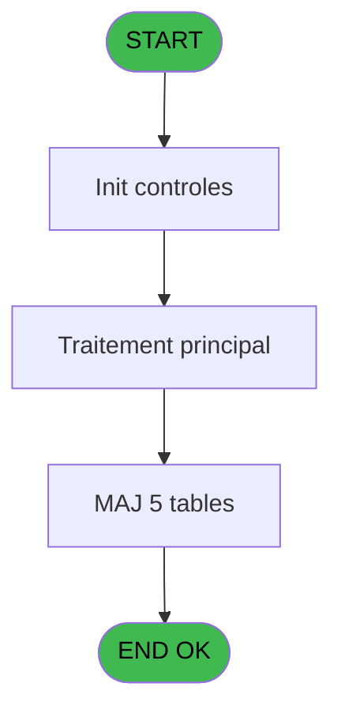
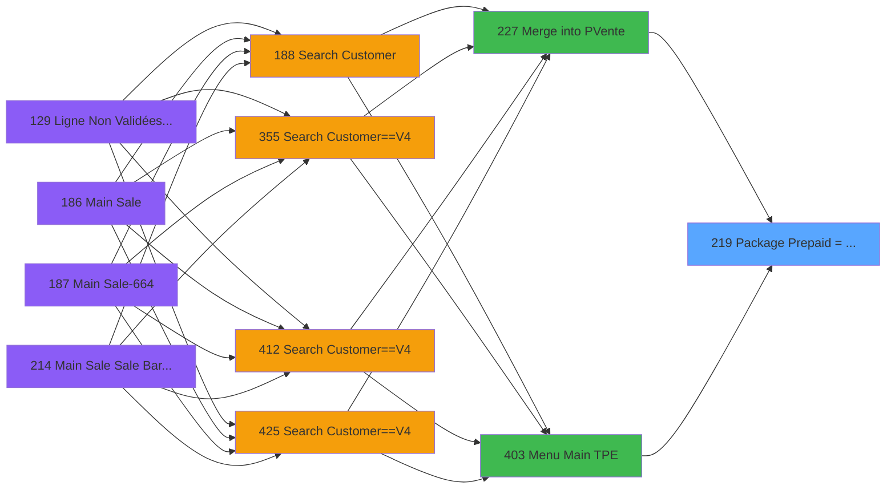

# PVE IDE 219 - Package Prepaid => account

> **Analyse**: Phases 1-4 2026-02-03 18:59 -> 18:59 (21s) | Assemblage 18:59
> **Pipeline**: V7.2 Enrichi
> **Structure**: 4 onglets (Resume | Ecrans | Donnees | Connexions)

<!-- TAB:Resume -->

## 1. FICHE D'IDENTITE

| Attribut | Valeur |
|----------|--------|
| Projet | PVE |
| IDE Position | 219 |
| Nom Programme | Package Prepaid => account |
| Fichier source | `Prg_219.xml` |
| Dossier IDE | Packages |
| Taches | 9 (0 ecrans visibles) |
| Tables modifiees | 5 |
| Programmes appeles | 1 |

## 2. DESCRIPTION FONCTIONNELLE

**Package Prepaid => account** assure la gestion complete de ce processus, accessible depuis [Merge into PVente (IDE 227)](PVE-IDE-227.md), [Menu Main (TPE) (IDE 403)](PVE-IDE-403.md).

Le flux de traitement s'organise en **2 blocs fonctionnels** :

- **Creation** (7 taches) : insertion d'enregistrements en base (mouvements, prestations)
- **Traitement** (2 taches) : traitements metier divers

**Donnees modifiees** : 5 tables en ecriture (pv_customer, pv_discount_reasons, pv_cust_rentals, pv_sellers_by_week, Table_1539).

Detail : phases du traitement

#### Phase 1 : Traitement (2 taches)

- **219** - Package=> cust account **[[ECRAN]](#ecran-t1)**
- **219.1** - Get last package id

Delegue a : [  Test imputation OK ? (IDE 211)](PVE-IDE-211.md)

#### Phase 2 : Creation (7 taches)

- **219.2** - create cust package **[[ECRAN]](#ecran-t3)**
- **219.3** - create cust package **[[ECRAN]](#ecran-t4)**
- **219.4** - create cust package **[[ECRAN]](#ecran-t5)**
- **219.5** - create cust package **[[ECRAN]](#ecran-t6)**
- **219.6** - Create cust rentals **[[ECRAN]](#ecran-t7)**
- **219.7** - Create Card Type
- **219.8** - create cust package **[[ECRAN]](#ecran-t9)**

#### Tables impactees

| Table | Operations | Role metier |
|-------|-----------|-------------|
| pv_cust_rentals | R/**W**/L (6 usages) |  |
| pv_discount_reasons | **W**/L (2 usages) |  |
| pv_customer | **W**/L (2 usages) |  |
| Table_1539 | **W** (1 usages) |  |
| pv_sellers_by_week | **W** (1 usages) |  |

## 3. BLOCS FONCTIONNELS

### 3.1 Traitement (2 taches)

Traitements internes.

---

#### 219 - Package=> cust account [[ECRAN]](#ecran-t1)

**Role** : Traitement : Package=> cust account.
**Ecran** : 344 x 227 DLU (MDI) | [Voir mockup](#ecran-t1)
**Variables liees** : A (P. Customer)
**Delegue a** : [  Test imputation OK ? (IDE 211)](PVE-IDE-211.md)

---

#### 219.1 - Get last package id

**Role** : Consultation/chargement : Get last package id.
**Variables liees** : B (P. Package Id OUT), R (V New package id), S (V Package Id IN)
**Delegue a** : [  Test imputation OK ? (IDE 211)](PVE-IDE-211.md)

### 3.2 Creation (7 taches)

Insertion de nouveaux enregistrements en base.

---

#### 219.2 - create cust package [[ECRAN]](#ecran-t3)

**Role** : Traitement : create cust package.
**Ecran** : 123 x 85 DLU (MDI) | [Voir mockup](#ecran-t3)
**Variables liees** : A (P. Customer), B (P. Package Id OUT), R (V New package id), S (V Package Id IN)

---

#### 219.3 - create cust package [[ECRAN]](#ecran-t4)

**Role** : Traitement : create cust package.
**Ecran** : 123 x 85 DLU (MDI) | [Voir mockup](#ecran-t4)
**Variables liees** : A (P. Customer), B (P. Package Id OUT), R (V New package id), S (V Package Id IN)

---

#### 219.4 - create cust package [[ECRAN]](#ecran-t5)

**Role** : Traitement : create cust package.
**Ecran** : 123 x 85 DLU (MDI) | [Voir mockup](#ecran-t5)
**Variables liees** : A (P. Customer), B (P. Package Id OUT), R (V New package id), S (V Package Id IN)

---

#### 219.5 - create cust package [[ECRAN]](#ecran-t6)

**Role** : Traitement : create cust package.
**Ecran** : 123 x 85 DLU (MDI) | [Voir mockup](#ecran-t6)
**Variables liees** : A (P. Customer), B (P. Package Id OUT), R (V New package id), S (V Package Id IN)

---

#### 219.6 - Create cust rentals [[ECRAN]](#ecran-t7)

**Role** : Traitement : Create cust rentals.
**Ecran** : 173 x 115 DLU (MDI) | [Voir mockup](#ecran-t7)
**Variables liees** : A (P. Customer)

---

#### 219.7 - Create Card Type

**Role** : Traitement : Create Card Type.
**Variables liees** : C (P. Action type), H (P. Payment type), T (T Credit Card)

---

#### 219.8 - create cust package [[ECRAN]](#ecran-t9)

**Role** : Traitement : create cust package.
**Ecran** : 123 x 85 DLU (MDI) | [Voir mockup](#ecran-t9)
**Variables liees** : A (P. Customer), B (P. Package Id OUT), R (V New package id), S (V Package Id IN)

## 5. REGLES METIER

*(Aucune regle metier identifiee)*

## 6. CONTEXTE

- **Appele par**: [Merge into PVente (IDE 227)](PVE-IDE-227.md), [Menu Main (TPE) (IDE 403)](PVE-IDE-403.md)
- **Appelle**: 1 programmes | **Tables**: 16 (W:5 R:2 L:13) | **Taches**: 9 | **Expressions**: 27

<!-- TAB:Ecrans -->

## 8. ECRANS

*(Programme sans ecran visible)*

## 9. NAVIGATION

### 9.3 Structure hierarchique (9 taches)

| Position | Tache | Type | Dimensions | Bloc |
|----------|-------|------|------------|------|
| **219.1** | [**Package=> cust account** (219)](#t1) [mockup](#ecran-t1) | MDI | 344x227 | Traitement |
| 219.1.1 | [Get last package id (219.1)](#t2) | MDI | - | |
| **219.2** | [**create cust package** (219.2)](#t3) [mockup](#ecran-t3) | MDI | 123x85 | Creation |
| 219.2.1 | [create cust package (219.3)](#t4) [mockup](#ecran-t4) | MDI | 123x85 | |
| 219.2.2 | [create cust package (219.4)](#t5) [mockup](#ecran-t5) | MDI | 123x85 | |
| 219.2.3 | [create cust package (219.5)](#t6) [mockup](#ecran-t6) | MDI | 123x85 | |
| 219.2.4 | [Create cust rentals (219.6)](#t7) [mockup](#ecran-t7) | MDI | 173x115 | |
| 219.2.5 | [Create Card Type (219.7)](#t8) | MDI | - | |
| 219.2.6 | [create cust package (219.8)](#t9) [mockup](#ecran-t9) | MDI | 123x85 | |

### 9.4 Algorigramme

> **Legende**: Vert = START/END OK | Rouge = END KO | Bleu = Decisions
> *Algorigramme auto-genere. Utiliser `/algorigramme` pour une synthese metier detaillee.*

<!-- TAB:Donnees -->

## 10. TABLES

### Tables utilisees (16)

| ID | Nom | Description | Type | R | W | L | Usages |
|----|-----|-------------|------|---|---|---|--------|
| 34 | hebergement______heb | Hebergement (chambres) | DB |   |   | L | 1 |
| 47 | compte_gm________cgm | Comptes GM (generaux) | DB |   |   | L | 1 |
| 77 | articles_________art | Articles et stock | DB |   |   | L | 1 |
| 378 | pv_customer |  | DB |   | **W** | L | 2 |
| 379 | pv_customer_temp |  | DB |   |   | L | 1 |
| 382 | pv_discount_reasons |  | DB |   | **W** | L | 2 |
| 389 | pv_equipment_inventory |  | DB |   |   | L | 1 |
| 400 | pv_cust_rentals |  | DB | R | **W** | L | 6 |
| 401 | pv_cust_rentals_histo | Historique / journal | DB |   |   | L | 1 |
| 403 | pv_sellers |  | DB |   |   | L | 1 |
| 404 | pv_sellers_by_week |  | DB |   | **W** |   | 1 |
| 413 | pv_tva |  | DB |   |   | L | 1 |
| 418 | pv_years |  | DB |   |   | L | 1 |
| 731 | arc_tai_gm |  | DB |   |   | L | 1 |
| 1488 | Table_1488 |  | MEM | R |   |   | 1 |
| 1539 | Table_1539 |  | MEM |   | **W** |   | 1 |

### Colonnes par table (6 / 6 tables avec colonnes identifiees)

Table 378 - pv_customer (**W**/L) - 2 usages

| Lettre | Variable | Acces | Type |
|--------|----------|-------|------|
| A | P. Customer | W | Numeric |

Table 382 - pv_discount_reasons (**W**/L) - 2 usages

*Table utilisee uniquement en Link ou aucune colonne Real identifiee dans le DataView.*

Table 400 - pv_cust_rentals (R/**W**/L) - 6 usages

| Lettre | Variable | Acces | Type |
|--------|----------|-------|------|
| A | P. Customer | W | Numeric |

Table 404 - pv_sellers_by_week (**W**) - 1 usages

*Table utilisee uniquement en Link ou aucune colonne Real identifiee dans le DataView.*

Table 1488 - Table_1488 (R) - 1 usages

| Lettre | Variable | Acces | Type |
|--------|----------|-------|------|
| A | P. Customer | R | Numeric |
| B | P. Package Id OUT | R | Numeric |
| C | P. Action type | R | Alpha |
| D | P. Date | R | Date |
| E | P. Category | R | Numeric |
| F | P. Sub cat | R | Numeric |
| G | P. Product | R | Numeric |
| H | P. Payment type | R | Alpha |
| I | P. Equipment id | R | Alpha |
| J | P. FlagDate | R | Numeric |
| K | P. Quantity | R | Numeric |
| L | P. ART Quantité en stock | R | Numeric |
| M | P.Prix | R | Numeric |
| N | P.Montant PrePaid | R | Numeric |
| O | P.Service | R | Alpha |
| P | P.Code Fidelisation | R | Alpha |
| Q | P.Code Prestation | R | Unicode |
| R | V New package id | R | Numeric |
| S | V Package Id IN | R | Numeric |
| T | T Credit Card | R | Logical |
| U | v Lien Remise Great Members | R | Logical |
| V | v.Article imputation existe ? | R | Logical |

Table 1539 - Table_1539 (**W**) - 1 usages

*Table utilisee uniquement en Link ou aucune colonne Real identifiee dans le DataView.*

## 11. VARIABLES

### 11.1 Parametres entrants (17)

Variables recues du programme appelant ([Merge into PVente (IDE 227)](PVE-IDE-227.md)).

| Lettre | Nom | Type | Usage dans |
|--------|-----|------|-----------|
| A | P. Customer | Numeric | 2x parametre entrant |
| B | P. Package Id OUT | Numeric | [219](#t1), [219.1](#t2), [219.2](#t3) |
| C | P. Action type | Alpha | [219.7](#t8) |
| D | P. Date | Date | - |
| E | P. Category | Numeric | 1x parametre entrant |
| F | P. Sub cat | Numeric | 1x parametre entrant |
| G | P. Product | Numeric | 1x parametre entrant |
| H | P. Payment type | Alpha | - |
| I | P. Equipment id | Alpha | - |
| J | P. FlagDate | Numeric | - |
| K | P. Quantity | Numeric | - |
| L | P. ART Quantité en stock | Numeric | - |
| M | P.Prix | Numeric | - |
| N | P.Montant PrePaid | Numeric | - |
| O | P.Service | Alpha | 1x parametre entrant |
| P | P.Code Fidelisation | Alpha | 1x parametre entrant |
| Q | P.Code Prestation | Unicode | - |

### 11.2 Variables de session (4)

Variables persistantes pendant toute la session.

| Lettre | Nom | Type | Usage dans |
|--------|-----|------|-----------|
| R | V New package id | Numeric | - |
| S | V Package Id IN | Numeric | - |
| U | v Lien Remise Great Members | Logical | - |
| V | v.Article imputation existe ? | Logical | - |

### 11.3 Autres (1)

Variables diverses.

| Lettre | Nom | Type | Usage dans |
|--------|-----|------|-----------|
| T | T Credit Card | Logical | [219.7](#t8) |

Toutes les 22 variables (liste complete)

| Cat | Lettre | Nom Variable | Type |
|-----|--------|--------------|------|
| P0 | **A** | P. Customer | Numeric |
| P0 | **B** | P. Package Id OUT | Numeric |
| P0 | **C** | P. Action type | Alpha |
| P0 | **D** | P. Date | Date |
| P0 | **E** | P. Category | Numeric |
| P0 | **F** | P. Sub cat | Numeric |
| P0 | **G** | P. Product | Numeric |
| P0 | **H** | P. Payment type | Alpha |
| P0 | **I** | P. Equipment id | Alpha |
| P0 | **J** | P. FlagDate | Numeric |
| P0 | **K** | P. Quantity | Numeric |
| P0 | **L** | P. ART Quantité en stock | Numeric |
| P0 | **M** | P.Prix | Numeric |
| P0 | **N** | P.Montant PrePaid | Numeric |
| P0 | **O** | P.Service | Alpha |
| P0 | **P** | P.Code Fidelisation | Alpha |
| P0 | **Q** | P.Code Prestation | Unicode |
| V. | **R** | V New package id | Numeric |
| V. | **S** | V Package Id IN | Numeric |
| V. | **U** | v Lien Remise Great Members | Logical |
| V. | **V** | v.Article imputation existe ? | Logical |
| Autre | **T** | T Credit Card | Logical |

## 12. EXPRESSIONS

**27 / 27 expressions decodees (100%)**

### 12.1 Repartition par type

| Type | Expressions | Regles |
|------|-------------|--------|
| CONSTANTE | 2 | 0 |
| DATE | 1 | 0 |
| OTHER | 19 | 0 |
| CONDITION | 5 | 0 |

### 12.2 Expressions cles par type

#### CONSTANTE (2 expressions)

| Type | IDE | Expression | Regle |
|------|-----|------------|-------|
| CONSTANTE | 22 | `'H'` | - |
| CONSTANTE | 2 | `''` | - |

#### DATE (1 expressions)

| Type | IDE | Expression | Regle |
|------|-----|------------|-------|
| DATE | 21 | `Date ()` | - |

#### OTHER (19 expressions)

| Type | IDE | Expression | Regle |
|------|-----|------------|-------|
| OTHER | 14 | `P. Customer [A]` | - |
| OTHER | 15 | `[AE]` | - |
| OTHER | 12 | `[AW]` | - |
| OTHER | 13 | `P. Action type [C]` | - |
| OTHER | 23 | `[AP]` | - |
| ... | | *+14 autres* | |

#### CONDITION (5 expressions)

| Type | IDE | Expression | Regle |
|------|-----|------------|-------|
| CONDITION | 19 | `P. Action type [C]<>'SALE'` | - |
| CONDITION | 20 | `P. Action type [C]='SALE'` | - |
| CONDITION | 18 | `[BT]=0` | - |
| CONDITION | 16 | `[BT]<0` | - |
| CONDITION | 17 | `[BT]>0` | - |

### 12.3 Toutes les expressions (27)

Voir les 27 expressions

#### CONSTANTE (2)

| IDE | Expression Decodee |
|-----|-------------------|
| 2 | `''` |
| 22 | `'H'` |

#### DATE (1)

| IDE | Expression Decodee |
|-----|-------------------|
| 21 | `Date ()` |

#### OTHER (19)

| IDE | Expression Decodee |
|-----|-------------------|
| 1 | `P.Service [O]` |
| 3 | `P. Customer [A]` |
| 4 | `T Credit Card [T]` |
| 5 | `v Lien Remise Great Me... [U]` |
| 6 | `P. Category [E]` |
| 7 | `P. Sub cat [F]` |
| 8 | `P. Product [G]` |
| 9 | `P. Package Id OUT [B]` |
| 10 | `[BR]` |
| 11 | `[AV]` |
| 12 | `[AW]` |
| 13 | `P. Action type [C]` |
| 14 | `P. Customer [A]` |
| 15 | `[AE]` |
| 23 | `[AP]` |
| 24 | `[BM]` |
| 25 | `P.Code Fidelisation [P]` |
| 26 | `[CH] AND [BH] AND VG62` |
| 27 | `[BM]` |

#### CONDITION (5)

| IDE | Expression Decodee |
|-----|-------------------|
| 16 | `[BT]<0` |
| 17 | `[BT]>0` |
| 18 | `[BT]=0` |
| 19 | `P. Action type [C]<>'SALE'` |
| 20 | `P. Action type [C]='SALE'` |

<!-- TAB:Connexions -->

## 13. GRAPHE D'APPELS

### 13.1 Chaine depuis Main (Callers)

Main -> ... -> [Merge into PVente (IDE 227)](PVE-IDE-227.md) -> **Package Prepaid => account (IDE 219)**

Main -> ... -> [Menu Main (TPE) (IDE 403)](PVE-IDE-403.md) -> **Package Prepaid => account (IDE 219)**

### 13.2 Callers

| IDE | Nom Programme | Nb Appels |
|-----|---------------|-----------|
| [227](PVE-IDE-227.md) | Merge into PVente | 1 |
| [403](PVE-IDE-403.md) | Menu Main (TPE) | 1 |

### 13.3 Callees (programmes appeles)

### 13.4 Detail Callees avec contexte

| IDE | Nom Programme | Appels | Contexte |
|-----|---------------|--------|----------|
| [211](PVE-IDE-211.md) |   Test imputation OK ? | 1 | Sous-programme |

## 14. RECOMMANDATIONS MIGRATION

### 14.1 Profil du programme

| Metrique | Valeur | Impact migration |
|----------|--------|-----------------|
| Lignes de logique | 361 | Taille moyenne |
| Expressions | 27 | Peu de logique |
| Tables WRITE | 5 | Impact modere |
| Sous-programmes | 1 | Peu de dependances |
| Ecrans visibles | 0 | Ecran unique ou traitement batch |
| Code desactive | 0% (0 / 361) | Code sain |
| Regles metier | 0 | Pas de regle identifiee |

### 14.2 Plan de migration par bloc

#### Traitement (2 taches: 1 ecran, 1 traitement)

- **Strategie** : Orchestrateur avec 1 ecrans (Razor/React) et 1 traitements backend (services).
- Les ecrans deviennent des composants UI, les traitements invisibles deviennent des services injectables.
- 1 sous-programme(s) a migrer ou a reutiliser depuis les services existants.
- Decomposer les taches en services unitaires testables.

#### Creation (7 taches: 6 ecrans, 1 traitement)

- **Strategie** : Repository pattern avec Entity Framework Core.
- Insertion via `IRepository<T>.CreateAsync()`

### 14.3 Dependances critiques

| Dependance | Type | Appels | Impact |
|------------|------|--------|--------|
| pv_customer | Table WRITE (Database) | 1x | Schema + repository |
| pv_discount_reasons | Table WRITE (Database) | 1x | Schema + repository |
| pv_cust_rentals | Table WRITE (Database) | 3x | Schema + repository |
| pv_sellers_by_week | Table WRITE (Database) | 1x | Schema + repository |
| Table_1539 | Table WRITE (Memory) | 1x | Schema + repository |
| [  Test imputation OK ? (IDE 211)](PVE-IDE-211.md) | Sous-programme | 1x | Normale - Sous-programme |

---
*Spec DETAILED generee par Pipeline V7.2 - 2026-02-03 18:59*
