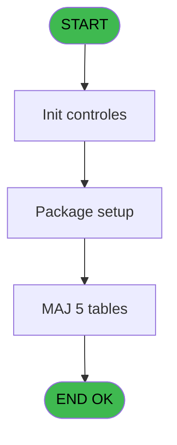
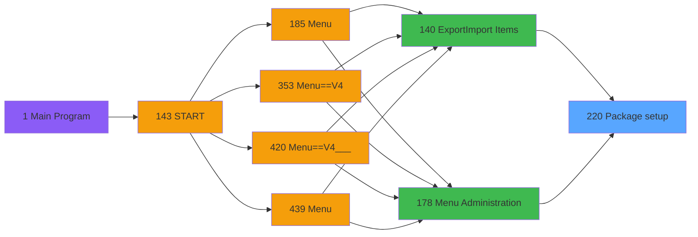
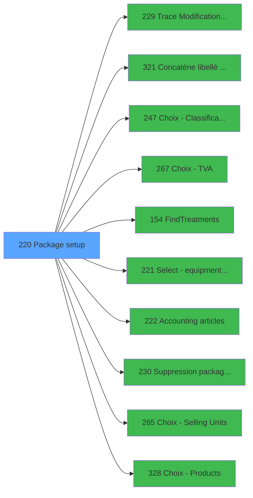

# PVE IDE 220 - Package setup

> **Analyse**: Phases 1-4 2026-02-03 18:59 -> 19:00 (17s) | Assemblage 19:00
> **Pipeline**: V7.2 Enrichi
> **Structure**: 4 onglets (Resume | Ecrans | Donnees | Connexions)

<!-- TAB:Resume -->

## 1. FICHE D'IDENTITE

| Attribut | Valeur |
|----------|--------|
| Projet | PVE |
| IDE Position | 220 |
| Nom Programme | Package setup |
| Fichier source | `Prg_220.xml` |
| Dossier IDE | Packages |
| Taches | 42 (9 ecrans visibles) |
| Tables modifiees | 5 |
| Programmes appeles | 10 |

## 2. DESCRIPTION FONCTIONNELLE

**Package setup** assure la gestion complete de ce processus, accessible depuis [Export/Import Items (IDE 140)](PVE-IDE-140.md), [Menu Administration (IDE 178)](PVE-IDE-178.md).

Le flux de traitement s'organise en **4 blocs fonctionnels** :

- **Traitement** (30 taches) : traitements metier divers
- **Creation** (9 taches) : insertion d'enregistrements en base (mouvements, prestations)
- **Consultation** (2 taches) : ecrans de recherche, selection et consultation
- **Calcul** (1 tache) : calculs de montants, stocks ou compteurs

**Donnees modifiees** : 5 tables en ecriture (pv_customer_temp, pv_cust_rentals_histo, pv_sellers, pv_tva, Temp_service_cash).

**Logique metier** : 2 regles identifiees couvrant conditions metier.

Detail : phases du traitement

#### Phase 1 : Traitement (30 taches)

- **220** - Package setup
- **220.1** - Packages **[[ECRAN]](#ecran-t2)**
- **220.1.1** - Sub cat **[[ECRAN]](#ecran-t3)**
- **220.1.1.1** - Products **[[ECRAN]](#ecran-t4)**
- **220.1.1.1.2.2** - Package Detail **[[ECRAN]](#ecran-t9)**
- **220.1.1.1.2.3** - Package Detail **[[ECRAN]](#ecran-t10)**
- **220.1.1.1.2.4** - Package Detail **[[ECRAN]](#ecran-t11)**
- **220.1.1.1.3** - compute 1/2 day auto
- **220.1.1.1.5.1** - Read File
- **220.1.1.2** - matos components **[[ECRAN]](#ecran-t17)**
- **220.1.1.4** - delete
- **220.1.1.4.1** - Delete prod
- **220.1.1.4.2** - Delete components
- **220.1.1.5** - Discount
- **220.1.1.5.1** - Maj products
- **220.1.1.6** - Upd Sub Category
- **220.1.3** - delete
- **220.1.3.1** - Delete subcat
- **220.1.3.2** - Delete prod
- **220.1.3.3** - Delete components
- **220.1.4** - Desactiver Cat
- **220.1.5** - Existe actif et inactif ?
- **220.1.6** - Package inactif ?
- **220.1.7** - Existe sub cat ?
- **220.2** - Crédit Conso Actif ?
- **220.3** - Test Création Categorie
- **220.3.1** - Categorie 1
- **220.4** - Desactiver Cat
- **220.5** - Existe actif et inactif ?
- **220.1.1.3.3** - (sans nom)

Delegue a : [Trace Modification package (IDE 229)](PVE-IDE-229.md), [Concatène libellé Cat/Ss-Cat (IDE 321)](PVE-IDE-321.md), [FindTreatments (IDE 154)](PVE-IDE-154.md), [   Accounting articles (IDE 222)](PVE-IDE-222.md), [Suppression packages orphelins (IDE 230)](PVE-IDE-230.md)

#### Phase 2 : Creation (9 taches)

- **220.1.1.1.1** - Create **[[ECRAN]](#ecran-t5)**
- **220.1.1.1.1.1** - create subsubcat batch
- **220.1.1.1.2** - Create **[[ECRAN]](#ecran-t7)**
- **220.1.1.1.2.1** - create subsubcat batch
- **220.1.1.3** - Create **[[ECRAN]](#ecran-t18)**
- **220.1.1.3.1** - create subcat batch
- **220.1.1.3.2** - Create prices auto
- **220.1.2** - Create **[[ECRAN]](#ecran-t27)**
- **220.1.2.1** - create cat batch

#### Phase 3 : Consultation (2 taches)

- **220.1.1.1.4** - Recherche Existence Article +1
- **220.1.1.1.5** - Recherche Trou

Delegue a : [Choix - Classification (IDE 247)](PVE-IDE-247.md), [Choix - TVA (IDE 267)](PVE-IDE-267.md), [   Select - equipment type (IDE 221)](PVE-IDE-221.md), [Choix - Selling Units (IDE 265)](PVE-IDE-265.md), [Choix - Products (IDE 328)](PVE-IDE-328.md)

#### Phase 4 : Calcul (1 tache)

- **220.1.1.1.6** - Compte Taxes

#### Tables impactees

| Table | Operations | Role metier |
|-------|-----------|-------------|
| pv_sellers | R/**W**/L (15 usages) |  |
| pv_tva | R/**W**/L (9 usages) |  |
| pv_customer_temp | R/**W**/L (5 usages) |  |
| pv_cust_rentals_histo | **W** (3 usages) | Historique / journal |
| Temp_service_cash | **W**/L (3 usages) | Services / filieres |

## 3. BLOCS FONCTIONNELS

### 3.1 Traitement (30 taches)

Traitements internes.

---

#### 220 - Package setup

**Role** : Tache d'orchestration : point d'entree du programme (30 sous-taches). Coordonne l'enchainement des traitements.

29 sous-taches directes

| Tache | Nom | Bloc |
|-------|-----|------|
| [220.1](#t2) | Packages **[[ECRAN]](#ecran-t2)** | Traitement |
| [220.1.1](#t3) | Sub cat **[[ECRAN]](#ecran-t3)** | Traitement |
| [220.1.1.1](#t4) | Products **[[ECRAN]](#ecran-t4)** | Traitement |
| [220.1.1.1.2.2](#t9) | Package Detail **[[ECRAN]](#ecran-t9)** | Traitement |
| [220.1.1.1.2.3](#t10) | Package Detail **[[ECRAN]](#ecran-t10)** | Traitement |
| [220.1.1.1.2.4](#t11) | Package Detail **[[ECRAN]](#ecran-t11)** | Traitement |
| [220.1.1.1.3](#t12) | compute 1/2 day auto | Traitement |
| [220.1.1.1.5.1](#t15) | Read File | Traitement |
| [220.1.1.2](#t17) | matos components **[[ECRAN]](#ecran-t17)** | Traitement |
| [220.1.1.4](#t21) | delete | Traitement |
| [220.1.1.4.1](#t22) | Delete prod | Traitement |
| [220.1.1.4.2](#t23) | Delete components | Traitement |
| [220.1.1.5](#t24) | Discount | Traitement |
| [220.1.1.5.1](#t25) | Maj products | Traitement |
| [220.1.1.6](#t26) | Upd Sub Category | Traitement |
| [220.1.3](#t29) | delete | Traitement |
| [220.1.3.1](#t30) | Delete subcat | Traitement |
| [220.1.3.2](#t31) | Delete prod | Traitement |
| [220.1.3.3](#t32) | Delete components | Traitement |
| [220.1.4](#t33) | Desactiver Cat | Traitement |
| [220.1.5](#t34) | Existe actif et inactif ? | Traitement |
| [220.1.6](#t35) | Package inactif ? | Traitement |
| [220.1.7](#t36) | Existe sub cat ? | Traitement |
| [220.2](#t37) | Crédit Conso Actif ? | Traitement |
| [220.3](#t38) | Test Création Categorie | Traitement |
| [220.3.1](#t39) | Categorie 1 | Traitement |
| [220.4](#t40) | Desactiver Cat | Traitement |
| [220.5](#t41) | Existe actif et inactif ? | Traitement |
| [220.1.1.3.3](#t42) | (sans nom) | Traitement |

**Variables liees** : O (v.Cat ou package inactif ?)

---

#### 220.1 - Packages [[ECRAN]](#ecran-t2)

**Role** : Traitement : Packages.
**Ecran** : 811 x 398 DLU (MDI) | [Voir mockup](#ecran-t2)

---

#### 220.1.1 - Sub cat [[ECRAN]](#ecran-t3)

**Role** : Traitement : Sub cat.
**Ecran** : 634 x 324 DLU (Modal) | [Voir mockup](#ecran-t3)

---

#### 220.1.1.1 - Products [[ECRAN]](#ecran-t4)

**Role** : Traitement : Products.
**Ecran** : 182 x 314 DLU (Modal) | [Voir mockup](#ecran-t4)

---

#### 220.1.1.1.2.2 - Package Detail [[ECRAN]](#ecran-t9)

**Role** : Traitement : Package Detail.
**Ecran** : 365 x 269 DLU (MDI) | [Voir mockup](#ecran-t9)
**Variables liees** : O (v.Cat ou package inactif ?)

---

#### 220.1.1.1.2.3 - Package Detail [[ECRAN]](#ecran-t10)

**Role** : Traitement : Package Detail.
**Ecran** : 365 x 241 DLU (MDI) | [Voir mockup](#ecran-t10)
**Variables liees** : O (v.Cat ou package inactif ?)

---

#### 220.1.1.1.2.4 - Package Detail [[ECRAN]](#ecran-t11)

**Role** : Traitement : Package Detail.
**Ecran** : 365 x 241 DLU (MDI) | [Voir mockup](#ecran-t11)
**Variables liees** : O (v.Cat ou package inactif ?)

---

#### 220.1.1.1.3 - compute 1/2 day auto

**Role** : Traitement : compute 1/2 day auto.

---

#### 220.1.1.1.5.1 - Read File

**Role** : Traitement : Read File.

---

#### 220.1.1.2 - matos components [[ECRAN]](#ecran-t17)

**Role** : Traitement : matos components.
**Ecran** : 242 x 169 DLU (Modal) | [Voir mockup](#ecran-t17)

---

#### 220.1.1.4 - delete

**Role** : Traitement : delete.
**Variables liees** : T (v.Confirm Delete), Z (v.Confirm Delete), H (BP. Delete)

---

#### 220.1.1.4.1 - Delete prod

**Role** : Traitement : Delete prod.
**Variables liees** : T (v.Confirm Delete), Z (v.Confirm Delete), BB (V.Service ou Produit), H (BP. Delete)

---

#### 220.1.1.4.2 - Delete components

**Role** : Traitement : Delete components.
**Variables liees** : T (v.Confirm Delete), Z (v.Confirm Delete), H (BP. Delete)

---

#### 220.1.1.5 - Discount

**Role** : Traitement : Discount.
**Variables liees** : BG (CHG_REASON_V Block Discount), BH (CHG_PRV_V Block Discount)

---

#### 220.1.1.5.1 - Maj products

**Role** : Traitement : Maj products.

---

#### 220.1.1.6 - Upd Sub Category

**Role** : Traitement : Upd Sub Category.
**Variables liees** : M (v.Category), G (L S/Category ?)

---

#### 220.1.3 - delete

**Role** : Traitement : delete.
**Variables liees** : T (v.Confirm Delete), Z (v.Confirm Delete), H (BP. Delete)

---

#### 220.1.3.1 - Delete subcat

**Role** : Traitement : Delete subcat.
**Variables liees** : T (v.Confirm Delete), Z (v.Confirm Delete), H (BP. Delete)

---

#### 220.1.3.2 - Delete prod

**Role** : Traitement : Delete prod.
**Variables liees** : T (v.Confirm Delete), Z (v.Confirm Delete), BB (V.Service ou Produit), H (BP. Delete)

---

#### 220.1.3.3 - Delete components

**Role** : Traitement : Delete components.
**Variables liees** : T (v.Confirm Delete), Z (v.Confirm Delete), H (BP. Delete)

---

#### 220.1.4 - Desactiver Cat

**Role** : Traitement : Desactiver Cat.

---

#### 220.1.5 - Existe actif et inactif ?

**Role** : Traitement : Existe actif et inactif ?.
**Variables liees** : B (v.Existe actif ?), C (v.Existe inactif ?), O (v.Cat ou package inactif ?), S (v.Inactif ?), N (L.Existe sous cat ?)

---

#### 220.1.6 - Package inactif ?

**Role** : Traitement : Package inactif ?.
**Variables liees** : C (v.Existe inactif ?), O (v.Cat ou package inactif ?), S (v.Inactif ?)

---

#### 220.1.7 - Existe sub cat ?

**Role** : Traitement : Existe sub cat ?.
**Variables liees** : B (v.Existe actif ?), C (v.Existe inactif ?), N (L.Existe sous cat ?)

---

#### 220.2 - Crédit Conso Actif ?

**Role** : Traitement : Crédit Conso Actif ?.
**Variables liees** : B (v.Existe actif ?), C (v.Existe inactif ?), O (v.Cat ou package inactif ?), S (v.Inactif ?)

---

#### 220.3 - Test Création Categorie

**Role** : Verification : Test Création Categorie.
**Variables liees** : R (P.i.Categorie)

---

#### 220.3.1 - Categorie 1

**Role** : Traitement : Categorie 1.
**Variables liees** : R (P.i.Categorie)

---

#### 220.4 - Desactiver Cat

**Role** : Traitement : Desactiver Cat.

---

#### 220.5 - Existe actif et inactif ?

**Role** : Traitement : Existe actif et inactif ?.
**Variables liees** : B (v.Existe actif ?), C (v.Existe inactif ?), O (v.Cat ou package inactif ?), S (v.Inactif ?), N (L.Existe sous cat ?)

---

#### 220.1.1.3.3 - (sans nom)

**Role** : Traitement interne.

### 3.2 Creation (9 taches)

Insertion de nouveaux enregistrements en base.

---

#### 220.1.1.1.1 - Create [[ECRAN]](#ecran-t5)

**Role** : Traitement : Create.
**Ecran** : 314 x 319 DLU (MDI) | [Voir mockup](#ecran-t5)
**Variables liees** : E (BP. Create)

---

#### 220.1.1.1.1.1 - create subsubcat batch

**Role** : Traitement : create subsubcat batch.
**Variables liees** : E (BP. Create)

---

#### 220.1.1.1.2 - Create [[ECRAN]](#ecran-t7)

**Role** : Traitement : Create.
**Ecran** : 384 x 369 DLU (MDI) | [Voir mockup](#ecran-t7)
**Variables liees** : E (BP. Create)

---

#### 220.1.1.1.2.1 - create subsubcat batch

**Role** : Traitement : create subsubcat batch.
**Variables liees** : E (BP. Create)

---

#### 220.1.1.3 - Create [[ECRAN]](#ecran-t18)

**Role** : Traitement : Create.
**Ecran** : 302 x 160 DLU (MDI) | [Voir mockup](#ecran-t18)
**Variables liees** : E (BP. Create)

---

#### 220.1.1.3.1 - create subcat batch

**Role** : Traitement : create subcat batch.
**Variables liees** : E (BP. Create)

---

#### 220.1.1.3.2 - Create prices auto

**Role** : Traitement : Create prices auto.
**Variables liees** : E (BP. Create)

---

#### 220.1.2 - Create [[ECRAN]](#ecran-t27)

**Role** : Traitement : Create.
**Ecran** : 282 x 191 DLU (MDI) | [Voir mockup](#ecran-t27)
**Variables liees** : E (BP. Create)

---

#### 220.1.2.1 - create cat batch

**Role** : Traitement : create cat batch.
**Variables liees** : E (BP. Create)

### 3.3 Consultation (2 taches)

Ecrans de recherche et consultation.

---

#### 220.1.1.1.4 - Recherche Existence Article +1

**Role** : Traitement : Recherche Existence Article +1.
**Delegue a** : [Choix - Classification (IDE 247)](PVE-IDE-247.md), [Choix - TVA (IDE 267)](PVE-IDE-267.md), [   Select - equipment type (IDE 221)](PVE-IDE-221.md)

---

#### 220.1.1.1.5 - Recherche Trou

**Role** : Traitement : Recherche Trou.
**Delegue a** : [Choix - Classification (IDE 247)](PVE-IDE-247.md), [Choix - TVA (IDE 267)](PVE-IDE-267.md), [   Select - equipment type (IDE 221)](PVE-IDE-221.md)

### 3.4 Calcul (1 tache)

Calculs metier : montants, stocks, compteurs.

---

#### 220.1.1.1.6 - Compte Taxes

**Role** : Traitement : Compte Taxes.

## 5. REGLES METIER

2 regles identifiees:

### Autres (2 regles)

#### [RM-001] Si {1 alors 2} sinon 'O','A')

| Element | Detail |
|---------|--------|
| **Condition** | `{1` |
| **Si vrai** | 2} |
| **Si faux** | 'O','A') |
| **Expression source** | Expression 4 : `IF({1,2},'O','A')` |
| **Exemple** | Si {1 → 2}. Sinon → 'O','A') |

#### [RM-002] Si BP. Exit [I] alors 110 sinon 208)

| Element | Detail |
|---------|--------|
| **Condition** | `BP. Exit [I]` |
| **Si vrai** | 110 |
| **Si faux** | 208) |
| **Variables** | I (BP. Exit) |
| **Expression source** | Expression 27 : `IF(BP. Exit [I],110,208)` |
| **Exemple** | Si BP. Exit [I] → 110. Sinon → 208) |

## 6. CONTEXTE

- **Appele par**: [Export/Import Items (IDE 140)](PVE-IDE-140.md), [Menu Administration (IDE 178)](PVE-IDE-178.md)
- **Appelle**: 10 programmes | **Tables**: 11 (W:5 R:4 L:9) | **Taches**: 42 | **Expressions**: 35

<!-- TAB:Ecrans -->

## 8. ECRANS

### 8.1 Forms visibles (9 / 42)

| # | Position | Tache | Nom | Type | Largeur | Hauteur | Bloc |
|---|----------|-------|-----|------|---------|---------|------|
| 1 | 220.1 | 220.1 | Packages | MDI | 811 | 398 | Traitement |
| 2 | 220.1.1 | 220.1.1 | Sub cat | Modal | 634 | 324 | Traitement |
| 3 | 220.1.1.1 | 220.1.1.1 | Products | Modal | 182 | 314 | Traitement |
| 4 | 220.1.1.1.1 | 220.1.1.1.1 | Create | MDI | 314 | 319 | Creation |
| 5 | 220.1.1.1.2 | 220.1.1.1.2 | Create | MDI | 384 | 369 | Creation |
| 6 | 220.1.1.1.2.2 | 220.1.1.1.2.2 | Package Detail | MDI | 365 | 269 | Traitement |
| 7 | 220.1.1.2 | 220.1.1.2 | matos components | Modal | 242 | 169 | Traitement |
| 8 | 220.1.1.3 | 220.1.1.3 | Create | MDI | 302 | 160 | Creation |
| 9 | 220.1.2 | 220.1.2 | Create | MDI | 282 | 191 | Creation |

### 8.2 Mockups Ecrans

---

#### 220.1 - Packages
**Tache** : [220.1](#t2) | **Type** : MDI | **Dimensions** : 811 x 398 DLU
**Bloc** : Traitement | **Titre IDE** : Packages

<!-- FORM-DATA:
{
    "width":  811,
    "vFactor":  8,
    "type":  "MDI",
    "hFactor":  4,
    "controls":  [
                     {
                         "x":  10,
                         "type":  "label",
                         "var":  "",
                         "y":  64,
                         "w":  116,
                         "fmt":  "",
                         "name":  "",
                         "h":  13,
                         "color":  "183",
                         "text":  "Category",
                         "parent":  null
                     },
                     {
                         "x":  0,
                         "type":  "label",
                         "var":  "",
                         "y":  0,
                         "w":  808,
                         "fmt":  "",
                         "name":  "",
                         "h":  42,
                         "color":  "186",
                         "text":  "",
                         "parent":  null
                     },
                     {
                         "x":  20,
                         "type":  "label",
                         "var":  "",
                         "y":  15,
                         "w":  725,
                         "fmt":  "",
                         "name":  "",
                         "h":  10,
                         "color":  "186",
                         "text":  "Create all items or services \u0026 products for sale in your service shop. Then configure them with the appropriate attributes",
                         "parent":  2
                     },
                     {
                         "x":  10,
                         "type":  "table",
                         "var":  "",
                         "name":  "",
                         "titleH":  12,
                         "color":  "110",
                         "w":  121,
                         "y":  78,
                         "fmt":  "",
                         "parent":  null,
                         "text":  "",
                         "rowH":  25,
                         "h":  258,
                         "cols":  [
                                      {
                                          "title":  "",
                                          "layer":  1,
                                          "w":  117
                                      }
                                  ],
                         "rows":  1
                     },
                     {
                         "x":  114,
                         "type":  "label",
                         "var":  "",
                         "y":  86,
                         "w":  11,
                         "fmt":  "",
                         "name":  "",
                         "h":  12,
                         "color":  "144",
                         "text":  "ü",
                         "parent":  7
                     },
                     {
                         "x":  0,
                         "type":  "label",
                         "var":  "",
                         "y":  366,
                         "w":  808,
                         "fmt":  "",
                         "name":  "",
                         "h":  29,
                         "color":  "6",
                         "text":  "",
                         "parent":  null
                     },
                     {
                         "x":  16,
                         "type":  "edit",
                         "var":  "",
                         "y":  86,
                         "w":  97,
                         "fmt":  "",
                         "name":  "CTRL_001",
                         "h":  12,
                         "color":  "110",
                         "text":  "",
                         "parent":  7
                     },
                     {
                         "x":  11,
                         "type":  "button",
                         "var":  "",
                         "y":  332,
                         "w":  55,
                         "fmt":  "\u0026Create",
                         "name":  "BP. Create",
                         "h":  25,
                         "color":  "",
                         "text":  "",
                         "parent":  null
                     },
                     {
                         "x":  66,
                         "type":  "button",
                         "var":  "",
                         "y":  332,
                         "w":  55,
                         "fmt":  "\u0026Modify",
                         "name":  "BP. Modif",
                         "h":  25,
                         "color":  "",
                         "text":  "",
                         "parent":  null
                     },
                     {
                         "x":  120,
                         "type":  "button",
                         "var":  "",
                         "y":  332,
                         "w":  54,
                         "fmt":  "\u0026Delete",
                         "name":  "BP. Delete",
                         "h":  25,
                         "color":  "",
                         "text":  "",
                         "parent":  null
                     },
                     {
                         "x":  758,
                         "type":  "image",
                         "var":  "",
                         "y":  4,
                         "w":  48,
                         "fmt":  "",
                         "name":  "",
                         "h":  37,
                         "color":  "",
                         "text":  "",
                         "parent":  4
                     },
                     {
                         "x":  130,
                         "type":  "button",
                         "var":  "",
                         "y":  79,
                         "w":  44,
                         "fmt":  "ñ",
                         "name":  "",
                         "h":  127,
                         "color":  "",
                         "text":  "",
                         "parent":  null
                     },
                     {
                         "x":  130,
                         "type":  "button",
                         "var":  "",
                         "y":  206,
                         "w":  44,
                         "fmt":  "ò",
                         "name":  "",
                         "h":  126,
                         "color":  "",
                         "text":  "",
                         "parent":  null
                     },
                     {
                         "x":  730,
                         "type":  "button",
                         "var":  "",
                         "y":  370,
                         "w":  77,
                         "fmt":  "\u0026Exit",
                         "name":  "BP. Exit",
                         "h":  24,
                         "color":  "",
                         "text":  "",
                         "parent":  null
                     },
                     {
                         "x":  174,
                         "type":  "subform",
                         "var":  "",
                         "y":  42,
                         "w":  637,
                         "fmt":  "",
                         "name":  "Sub cat",
                         "h":  317,
                         "color":  "",
                         "text":  "",
                         "parent":  null
                     },
                     {
                         "x":  10,
                         "type":  "combobox",
                         "var":  "",
                         "y":  43,
                         "w":  121,
                         "fmt":  "",
                         "name":  "v.STATUT",
                         "h":  23,
                         "color":  "183",
                         "text":  "A,O,N",
                         "parent":  null
                     }
                 ],
    "taskId":  "220.1",
    "height":  398
}
-->

<strong>Champs : 2 champs</strong>

| Pos (x,y) | Nom | Variable | Type |
|-----------|-----|----------|------|
| 16,86 | CTRL_001 | - | edit |
| 10,43 | v.STATUT | - | combobox |

<strong>Boutons : 6 boutons</strong>

| Bouton | Pos (x,y) | Action |
|--------|-----------|--------|
| Create | 11,332 | Bouton fonctionnel |
| Modify | 66,332 | Appel [Trace Modification package (IDE 229)](PVE-IDE-229.md) |
| Delete | 120,332 | Supprime l'element selectionne |
| ñ | 130,79 | Bouton fonctionnel |
| ò | 130,206 | Bouton fonctionnel |
| Exit | 730,370 | Quitte le programme |

---

#### 220.1.1 - Sub cat
**Tache** : [220.1.1](#t3) | **Type** : Modal | **Dimensions** : 634 x 324 DLU
**Bloc** : Traitement | **Titre IDE** : Sub cat

<!-- FORM-DATA:
{
    "width":  634,
    "vFactor":  8,
    "type":  "Modal",
    "hFactor":  4,
    "controls":  [
                     {
                         "x":  2,
                         "type":  "label",
                         "var":  "",
                         "y":  24,
                         "w":  118,
                         "fmt":  "",
                         "name":  "",
                         "h":  13,
                         "color":  "183",
                         "text":  "Sub category",
                         "parent":  null
                     },
                     {
                         "x":  178,
                         "type":  "label",
                         "var":  "",
                         "y":  0,
                         "w":  454,
                         "fmt":  "",
                         "name":  "",
                         "h":  323,
                         "color":  "189",
                         "text":  "",
                         "parent":  null
                     },
                     {
                         "x":  385,
                         "type":  "label",
                         "var":  "",
                         "y":  8,
                         "w":  232,
                         "fmt":  "",
                         "name":  "",
                         "h":  50,
                         "color":  "189",
                         "text":  "Classification",
                         "parent":  2
                     },
                     {
                         "x":  385,
                         "type":  "label",
                         "var":  "",
                         "y":  66,
                         "w":  110,
                         "fmt":  "",
                         "name":  "",
                         "h":  50,
                         "color":  "189",
                         "text":  "Imputation",
                         "parent":  2
                     },
                     {
                         "x":  507,
                         "type":  "label",
                         "var":  "",
                         "y":  66,
                         "w":  110,
                         "fmt":  "",
                         "name":  "",
                         "h":  50,
                         "color":  "189",
                         "text":  "Action",
                         "parent":  2
                     },
                     {
                         "x":  2,
                         "type":  "table",
                         "var":  "",
                         "name":  "",
                         "titleH":  12,
                         "color":  "110",
                         "w":  121,
                         "y":  37,
                         "fmt":  "",
                         "parent":  null,
                         "text":  "",
                         "rowH":  25,
                         "h":  252,
                         "cols":  [
                                      {
                                          "title":  "",
                                          "layer":  1,
                                          "w":  117
                                      }
                                  ],
                         "rows":  1
                     },
                     {
                         "x":  105,
                         "type":  "label",
                         "var":  "",
                         "y":  45,
                         "w":  11,
                         "fmt":  "",
                         "name":  "",
                         "h":  10,
                         "color":  "144",
                         "text":  "ü",
                         "parent":  13
                     },
                     {
                         "x":  5,
                         "type":  "edit",
                         "var":  "",
                         "y":  45,
                         "w":  98,
                         "fmt":  "",
                         "name":  "CTRL_001",
                         "h":  10,
                         "color":  "110",
                         "text":  "",
                         "parent":  13
                     },
                     {
                         "x":  517,
                         "type":  "combobox",
                         "var":  "",
                         "y":  85,
                         "w":  89,
                         "fmt":  "",
                         "name":  "CTRL_002",
                         "h":  12,
                         "color":  "110",
                         "text":  "SALE,RENTAL",
                         "parent":  7
                     },
                     {
                         "x":  2,
                         "type":  "button",
                         "var":  "",
                         "y":  291,
                         "w":  55,
                         "fmt":  "\u0026Create",
                         "name":  "BP. Create",
                         "h":  25,
                         "color":  "",
                         "text":  "",
                         "parent":  null
                     },
                     {
                         "x":  56,
                         "type":  "button",
                         "var":  "",
                         "y":  291,
                         "w":  55,
                         "fmt":  "\u0026Modify",
                         "name":  "BP. Modify",
                         "h":  25,
                         "color":  "",
                         "text":  "",
                         "parent":  null
                     },
                     {
                         "x":  110,
                         "type":  "button",
                         "var":  "",
                         "y":  291,
                         "w":  54,
                         "fmt":  "\u0026Delete",
                         "name":  "BP. Delete",
                         "h":  25,
                         "color":  "",
                         "text":  "",
                         "parent":  null
                     },
                     {
                         "x":  399,
                         "type":  "button",
                         "var":  "",
                         "y":  22,
                         "w":  205,
                         "fmt":  "Classification",
                         "name":  "BP. Classification",
                         "h":  25,
                         "color":  "",
                         "text":  "",
                         "parent":  2
                     },
                     {
                         "x":  395,
                         "type":  "button",
                         "var":  "",
                         "y":  81,
                         "w":  89,
                         "fmt":  "",
                         "name":  "BP. Article id",
                         "h":  25,
                         "color":  "",
                         "text":  "",
                         "parent":  2
                     },
                     {
                         "x":  383,
                         "type":  "button",
                         "var":  "",
                         "y":  7,
                         "w":  232,
                         "fmt":  "Authorize",
                         "name":  "AUTHO",
                         "h":  24,
                         "color":  "",
                         "text":  "",
                         "parent":  null
                     },
                     {
                         "x":  121,
                         "type":  "button",
                         "var":  "",
                         "y":  38,
                         "w":  44,
                         "fmt":  "ñ",
                         "name":  "",
                         "h":  126,
                         "color":  "",
                         "text":  "",
                         "parent":  null
                     },
                     {
                         "x":  383,
                         "type":  "button",
                         "var":  "",
                         "y":  35,
                         "w":  232,
                         "fmt":  "Forbid",
                         "name":  "FORBID",
                         "h":  24,
                         "color":  "",
                         "text":  "",
                         "parent":  null
                     },
                     {
                         "x":  121,
                         "type":  "button",
                         "var":  "",
                         "y":  164,
                         "w":  44,
                         "fmt":  "ò",
                         "name":  "",
                         "h":  127,
                         "color":  "",
                         "text":  "",
                         "parent":  null
                     },
                     {
                         "x":  180,
                         "type":  "subform",
                         "var":  "",
                         "y":  4,
                         "w":  200,
                         "fmt":  "",
                         "name":  "Products",
                         "h":  316,
                         "color":  "",
                         "text":  "",
                         "parent":  2
                     },
                     {
                         "x":  383,
                         "type":  "subform",
                         "var":  "",
                         "y":  118,
                         "w":  242,
                         "fmt":  "",
                         "name":  "matos components",
                         "h":  194,
                         "color":  "",
                         "text":  "",
                         "parent":  2
                     }
                 ],
    "taskId":  "220.1.1",
    "height":  324
}
-->

<strong>Champs : 2 champs</strong>

| Pos (x,y) | Nom | Variable | Type |
|-----------|-----|----------|------|
| 5,45 | CTRL_001 | - | edit |
| 517,85 | CTRL_002 | - | combobox |

<strong>Boutons : 9 boutons</strong>

| Bouton | Pos (x,y) | Action |
|--------|-----------|--------|
| Create | 2,291 | Bouton fonctionnel |
| Modify | 56,291 | Appel [Trace Modification package (IDE 229)](PVE-IDE-229.md) |
| Delete | 110,291 | Supprime l'element selectionne |
| Classification | 399,22 | Appel [Choix - Classification (IDE 247)](PVE-IDE-247.md) |
| BP. Article id | 395,81 | Bouton fonctionnel |
| Authorize | 383,7 | Bouton fonctionnel |
| ñ | 121,38 | Bouton fonctionnel |
| Forbid | 383,35 | Bouton fonctionnel |
| ò | 121,164 | Bouton fonctionnel |

---

#### 220.1.1.1 - Products
**Tache** : [220.1.1.1](#t4) | **Type** : Modal | **Dimensions** : 182 x 314 DLU
**Bloc** : Traitement | **Titre IDE** : Products

<!-- FORM-DATA:
{
    "width":  182,
    "vFactor":  8,
    "type":  "Modal",
    "hFactor":  4,
    "controls":  [
                     {
                         "x":  0,
                         "type":  "label",
                         "var":  "",
                         "y":  20,
                         "w":  131,
                         "fmt":  "",
                         "name":  "",
                         "h":  13,
                         "color":  "181",
                         "text":  "Pricing",
                         "parent":  null
                     },
                     {
                         "x":  1,
                         "type":  "table",
                         "var":  "",
                         "name":  "",
                         "titleH":  12,
                         "color":  "110",
                         "w":  133,
                         "y":  35,
                         "fmt":  "",
                         "parent":  null,
                         "text":  "",
                         "rowH":  25,
                         "h":  252,
                         "cols":  [
                                      {
                                          "title":  "",
                                          "layer":  1,
                                          "w":  129
                                      }
                                  ],
                         "rows":  1
                     },
                     {
                         "x":  118,
                         "type":  "label",
                         "var":  "",
                         "y":  42,
                         "w":  10,
                         "fmt":  "",
                         "name":  "",
                         "h":  10,
                         "color":  "208",
                         "text":  "ü",
                         "parent":  3
                     },
                     {
                         "x":  3,
                         "type":  "edit",
                         "var":  "",
                         "y":  43,
                         "w":  69,
                         "fmt":  "",
                         "name":  "CTRL_001",
                         "h":  16,
                         "color":  "110",
                         "text":  "",
                         "parent":  3
                     },
                     {
                         "x":  75,
                         "type":  "edit",
                         "var":  "",
                         "y":  42,
                         "w":  41,
                         "fmt":  "N12.3C",
                         "name":  "CTRL_002",
                         "h":  10,
                         "color":  "110",
                         "text":  "",
                         "parent":  3
                     },
                     {
                         "x":  1,
                         "type":  "button",
                         "var":  "",
                         "y":  288,
                         "w":  59,
                         "fmt":  "\u0026Create",
                         "name":  "BP. Create",
                         "h":  25,
                         "color":  "",
                         "text":  "",
                         "parent":  null
                     },
                     {
                         "x":  59,
                         "type":  "button",
                         "var":  "",
                         "y":  288,
                         "w":  59,
                         "fmt":  "\u0026Modify",
                         "name":  "BP. Modify",
                         "h":  25,
                         "color":  "",
                         "text":  "",
                         "parent":  null
                     },
                     {
                         "x":  118,
                         "type":  "button",
                         "var":  "",
                         "y":  288,
                         "w":  58,
                         "fmt":  "\u0026Delete",
                         "name":  "BP. Delete",
                         "h":  25,
                         "color":  "",
                         "text":  "",
                         "parent":  null
                     },
                     {
                         "x":  133,
                         "type":  "button",
                         "var":  "",
                         "y":  15,
                         "w":  44,
                         "fmt":  "1/2",
                         "name":  "",
                         "h":  23,
                         "color":  "",
                         "text":  "",
                         "parent":  null
                     },
                     {
                         "x":  132,
                         "type":  "button",
                         "var":  "",
                         "y":  37,
                         "w":  44,
                         "fmt":  "ñ",
                         "name":  "",
                         "h":  127,
                         "color":  "",
                         "text":  "",
                         "parent":  null
                     },
                     {
                         "x":  132,
                         "type":  "button",
                         "var":  "",
                         "y":  164,
                         "w":  44,
                         "fmt":  "ò",
                         "name":  "",
                         "h":  125,
                         "color":  "",
                         "text":  "",
                         "parent":  null
                     }
                 ],
    "taskId":  "220.1.1.1",
    "height":  314
}
-->

<strong>Champs : 2 champs</strong>

| Pos (x,y) | Nom | Variable | Type |
|-----------|-----|----------|------|
| 3,43 | CTRL_001 | - | edit |
| 75,42 | CTRL_002 | - | edit |

<strong>Boutons : 6 boutons</strong>

| Bouton | Pos (x,y) | Action |
|--------|-----------|--------|
| Create | 1,288 | Bouton fonctionnel |
| Modify | 59,288 | Appel [Trace Modification package (IDE 229)](PVE-IDE-229.md) |
| Delete | 118,288 | Supprime l'element selectionne |
| 1/2 | 133,15 | Bouton fonctionnel |
| ñ | 132,37 | Bouton fonctionnel |
| ò | 132,164 | Bouton fonctionnel |

---

#### 220.1.1.1.1 - Create
**Tache** : [220.1.1.1.1](#t5) | **Type** : MDI | **Dimensions** : 314 x 319 DLU
**Bloc** : Creation | **Titre IDE** : Create

<!-- FORM-DATA:
{
    "width":  314,
    "vFactor":  8,
    "type":  "MDI",
    "hFactor":  4,
    "controls":  [
                     {
                         "x":  180,
                         "type":  "label",
                         "var":  "",
                         "y":  45,
                         "w":  76,
                         "fmt":  "",
                         "name":  "",
                         "h":  10,
                         "color":  "183",
                         "text":  "Block Discount",
                         "parent":  null
                     },
                     {
                         "x":  11,
                         "type":  "label",
                         "var":  "",
                         "y":  46,
                         "w":  60,
                         "fmt":  "",
                         "name":  "",
                         "h":  10,
                         "color":  "183",
                         "text":  "Description",
                         "parent":  null
                     },
                     {
                         "x":  180,
                         "type":  "label",
                         "var":  "",
                         "y":  75,
                         "w":  76,
                         "fmt":  "",
                         "name":  "",
                         "h":  10,
                         "color":  "183",
                         "text":  "Block Free",
                         "parent":  null
                     },
                     {
                         "x":  11,
                         "type":  "label",
                         "var":  "",
                         "y":  76,
                         "w":  38,
                         "fmt":  "",
                         "name":  "",
                         "h":  10,
                         "color":  "183",
                         "text":  "# days",
                         "parent":  null
                     },
                     {
                         "x":  11,
                         "type":  "label",
                         "var":  "",
                         "y":  129,
                         "w":  40,
                         "fmt":  "",
                         "name":  "",
                         "h":  10,
                         "color":  "183",
                         "text":  "VAT",
                         "parent":  null
                     },
                     {
                         "x":  180,
                         "type":  "label",
                         "var":  "",
                         "y":  105,
                         "w":  86,
                         "fmt":  "",
                         "name":  "",
                         "h":  10,
                         "color":  "183",
                         "text":  "Non-stock item",
                         "parent":  null
                     },
                     {
                         "x":  12,
                         "type":  "label",
                         "var":  "",
                         "y":  159,
                         "w":  84,
                         "fmt":  "",
                         "name":  "",
                         "h":  10,
                         "color":  "183",
                         "text":  "Active Product ?",
                         "parent":  null
                     },
                     {
                         "x":  180,
                         "type":  "label",
                         "var":  "",
                         "y":  135,
                         "w":  132,
                         "fmt":  "",
                         "name":  "",
                         "h":  10,
                         "color":  "183",
                         "text":  "Sales Place Independant ?",
                         "parent":  null
                     },
                     {
                         "x":  12,
                         "type":  "label",
                         "var":  "",
                         "y":  195,
                         "w":  84,
                         "fmt":  "",
                         "name":  "",
                         "h":  10,
                         "color":  "183",
                         "text":  "Gift Pass ?",
                         "parent":  null
                     },
                     {
                         "x":  0,
                         "type":  "label",
                         "var":  "",
                         "y":  0,
                         "w":  311,
                         "fmt":  "",
                         "name":  "",
                         "h":  40,
                         "color":  "186",
                         "text":  "",
                         "parent":  null
                     },
                     {
                         "x":  18,
                         "type":  "label",
                         "var":  "",
                         "y":  13,
                         "w":  183,
                         "fmt":  "",
                         "name":  "",
                         "h":  14,
                         "color":  "186",
                         "text":  "?",
                         "parent":  13
                     },
                     {
                         "x":  2,
                         "type":  "label",
                         "var":  "",
                         "y":  288,
                         "w":  307,
                         "fmt":  "",
                         "name":  "",
                         "h":  29,
                         "color":  "6",
                         "text":  "",
                         "parent":  null
                     },
                     {
                         "x":  12,
                         "type":  "label",
                         "var":  "",
                         "y":  227,
                         "w":  99,
                         "fmt":  "",
                         "name":  "",
                         "h":  10,
                         "color":  "183",
                         "text":  "Nature (OGEC)",
                         "parent":  null
                     },
                     {
                         "x":  180,
                         "type":  "label",
                         "var":  "",
                         "y":  203,
                         "w":  111,
                         "fmt":  "",
                         "name":  "",
                         "h":  11,
                         "color":  "183",
                         "text":  "Ticket forcing (OGEC)",
                         "parent":  null
                     },
                     {
                         "x":  12,
                         "type":  "label",
                         "var":  "",
                         "y":  259,
                         "w":  53,
                         "fmt":  "",
                         "name":  "",
                         "h":  10,
                         "color":  "183",
                         "text":  "M\u0026E Price",
                         "parent":  null
                     },
                     {
                         "x":  68,
                         "type":  "label",
                         "var":  "",
                         "y":  259,
                         "w":  43,
                         "fmt":  "",
                         "name":  "",
                         "h":  10,
                         "color":  "183",
                         "text":  "Tax Included",
                         "parent":  null
                     },
                     {
                         "x":  11,
                         "type":  "label",
                         "var":  "",
                         "y":  103,
                         "w":  62,
                         "fmt":  "",
                         "name":  "",
                         "h":  10,
                         "color":  "183",
                         "text":  "Selling Price",
                         "parent":  null
                     },
                     {
                         "x":  75,
                         "type":  "label",
                         "var":  "",
                         "y":  103,
                         "w":  43,
                         "fmt":  "",
                         "name":  "",
                         "h":  10,
                         "color":  "183",
                         "text":  "Tax Included",
                         "parent":  null
                     },
                     {
                         "x":  11,
                         "type":  "edit",
                         "var":  "",
                         "y":  57,
                         "w":  142,
                         "fmt":  "",
                         "name":  "V Label",
                         "h":  12,
                         "color":  "110",
                         "text":  "",
                         "parent":  null
                     },
                     {
                         "x":  11,
                         "type":  "edit",
                         "var":  "",
                         "y":  86,
                         "w":  28,
                         "fmt":  "",
                         "name":  "V # days",
                         "h":  12,
                         "color":  "110",
                         "text":  "",
                         "parent":  null
                     },
                     {
                         "x":  180,
                         "type":  "combobox",
                         "var":  "",
                         "y":  57,
                         "w":  55,
                         "fmt":  "",
                         "name":  "V Block Discount",
                         "h":  12,
                         "color":  "183",
                         "text":  "",
                         "parent":  null
                     },
                     {
                         "x":  180,
                         "type":  "combobox",
                         "var":  "",
                         "y":  85,
                         "w":  55,
                         "fmt":  "",
                         "name":  "V Block Free",
                         "h":  12,
                         "color":  "183",
                         "text":  "",
                         "parent":  null
                     },
                     {
                         "x":  11,
                         "type":  "button",
                         "var":  "",
                         "y":  140,
                         "w":  53,
                         "fmt":  "",
                         "name":  "BP. VAT",
                         "h":  14,
                         "color":  "",
                         "text":  "",
                         "parent":  null
                     },
                     {
                         "x":  180,
                         "type":  "combobox",
                         "var":  "",
                         "y":  116,
                         "w":  55,
                         "fmt":  "",
                         "name":  "V Non géré en stock",
                         "h":  12,
                         "color":  "183",
                         "text":  "",
                         "parent":  null
                     },
                     {
                         "x":  227,
                         "type":  "image",
                         "var":  "",
                         "y":  1,
                         "w":  48,
                         "fmt":  "",
                         "name":  "",
                         "h":  37,
                         "color":  "",
                         "text":  "",
                         "parent":  null
                     },
                     {
                         "x":  153,
                         "type":  "button",
                         "var":  "",
                         "y":  293,
                         "w":  77,
                         "fmt":  "\u0026Cancel",
                         "name":  "",
                         "h":  24,
                         "color":  "",
                         "text":  "",
                         "parent":  23
                     },
                     {
                         "x":  230,
                         "type":  "button",
                         "var":  "",
                         "y":  293,
                         "w":  77,
                         "fmt":  "\u0026Validate",
                         "name":  "",
                         "h":  24,
                         "color":  "",
                         "text":  "",
                         "parent":  23
                     },
                     {
                         "x":  12,
                         "type":  "combobox",
                         "var":  "",
                         "y":  172,
                         "w":  56,
                         "fmt":  "",
                         "name":  "V Produit Actif ?",
                         "h":  12,
                         "color":  "110",
                         "text":  "Yes,No",
                         "parent":  null
                     },
                     {
                         "x":  180,
                         "type":  "combobox",
                         "var":  "",
                         "y":  148,
                         "w":  56,
                         "fmt":  "",
                         "name":  "V Sales Place Independant",
                         "h":  12,
                         "color":  "110",
                         "text":  "Yes,No",
                         "parent":  null
                     },
                     {
                         "x":  12,
                         "type":  "combobox",
                         "var":  "",
                         "y":  208,
                         "w":  56,
                         "fmt":  "",
                         "name":  "V.Gift Pass_0001",
                         "h":  12,
                         "color":  "110",
                         "text":  "Yes,No",
                         "parent":  null
                     },
                     {
                         "x":  73,
                         "type":  "button",
                         "var":  "",
                         "y":  140,
                         "w":  103,
                         "fmt":  "Additionnal Taxes",
                         "name":  "",
                         "h":  14,
                         "color":  "",
                         "text":  "",
                         "parent":  null
                     },
                     {
                         "x":  12,
                         "type":  "combobox",
                         "var":  "",
                         "y":  240,
                         "w":  56,
                         "fmt":  "",
                         "name":  "V.Service ou Produit_0001",
                         "h":  12,
                         "color":  "110",
                         "text":  "S,P",
                         "parent":  null
                     },
                     {
                         "x":  180,
                         "type":  "combobox",
                         "var":  "",
                         "y":  216,
                         "w":  56,
                         "fmt":  "",
                         "name":  "V Eligible Credit GO",
                         "h":  12,
                         "color":  "110",
                         "text":  "Yes,No",
                         "parent":  null
                     },
                     {
                         "x":  11,
                         "type":  "edit",
                         "var":  "",
                         "y":  271,
                         "w":  96,
                         "fmt":  "N12.3C",
                         "name":  "V. M\u0026E Price",
                         "h":  12,
                         "color":  "146",
                         "text":  "",
                         "parent":  null
                     },
                     {
                         "x":  11,
                         "type":  "edit",
                         "var":  "",
                         "y":  114,
                         "w":  83,
                         "fmt":  "N12.3C",
                         "name":  "V Vente prix",
                         "h":  12,
                         "color":  "146",
                         "text":  "",
                         "parent":  null
                     }
                 ],
    "taskId":  "220.1.1.1.1",
    "height":  319
}
-->

<strong>Champs : 12 champs</strong>

| Pos (x,y) | Nom | Variable | Type |
|-----------|-----|----------|------|
| 11,57 | V Label | - | edit |
| 11,86 | V # days | - | edit |
| 180,57 | V Block Discount | - | combobox |
| 180,85 | V Block Free | - | combobox |
| 180,116 | V Non géré en stock | - | combobox |
| 12,172 | V Produit Actif ? | - | combobox |
| 180,148 | V Sales Place Independant | - | combobox |
| 12,208 | V.Gift Pass_0001 | - | combobox |
| 12,240 | V.Service ou Produit_0001 | - | combobox |
| 180,216 | V Eligible Credit GO | - | combobox |
| 11,271 | V. M&E Price | - | edit |
| 11,114 | V Vente prix | - | edit |

<strong>Boutons : 4 boutons</strong>

| Bouton | Pos (x,y) | Action |
|--------|-----------|--------|
| BP. VAT | 11,140 | Bouton fonctionnel |
| Cancel | 153,293 | Annule et retour au menu |
| Validate | 230,293 | Valide la saisie et enregistre |
| Additionnal Taxes | 73,140 | Ajoute un element |

---

#### 220.1.1.1.2 - Create
**Tache** : [220.1.1.1.2](#t7) | **Type** : MDI | **Dimensions** : 384 x 369 DLU
**Bloc** : Creation | **Titre IDE** : Create

<!-- FORM-DATA:
{
    "width":  384,
    "vFactor":  8,
    "type":  "MDI",
    "hFactor":  4,
    "controls":  [
                     {
                         "x":  13,
                         "type":  "label",
                         "var":  "",
                         "y":  45,
                         "w":  60,
                         "fmt":  "",
                         "name":  "",
                         "h":  10,
                         "color":  "183",
                         "text":  "Description",
                         "parent":  null
                     },
                     {
                         "x":  202,
                         "type":  "label",
                         "var":  "",
                         "y":  45,
                         "w":  76,
                         "fmt":  "",
                         "name":  "",
                         "h":  10,
                         "color":  "183",
                         "text":  "Product code",
                         "parent":  null
                     },
                     {
                         "x":  12,
                         "type":  "label",
                         "var":  "",
                         "y":  75,
                         "w":  60,
                         "fmt":  "",
                         "name":  "",
                         "h":  10,
                         "color":  "183",
                         "text":  "Sale Label",
                         "parent":  null
                     },
                     {
                         "x":  12,
                         "type":  "label",
                         "var":  "",
                         "y":  106,
                         "w":  62,
                         "fmt":  "",
                         "name":  "",
                         "h":  10,
                         "color":  "183",
                         "text":  "Selling Price",
                         "parent":  null
                     },
                     {
                         "x":  76,
                         "type":  "label",
                         "var":  "",
                         "y":  106,
                         "w":  43,
                         "fmt":  "",
                         "name":  "",
                         "h":  10,
                         "color":  "183",
                         "text":  "Tax Included",
                         "parent":  null
                     },
                     {
                         "x":  129,
                         "type":  "label",
                         "var":  "",
                         "y":  106,
                         "w":  59,
                         "fmt":  "",
                         "name":  "",
                         "h":  10,
                         "color":  "183",
                         "text":  "Selling Unit",
                         "parent":  null
                     },
                     {
                         "x":  203,
                         "type":  "label",
                         "var":  "",
                         "y":  106,
                         "w":  77,
                         "fmt":  "",
                         "name":  "",
                         "h":  10,
                         "color":  "183",
                         "text":  "Selling Quantity",
                         "parent":  null
                     },
                     {
                         "x":  294,
                         "type":  "label",
                         "var":  "",
                         "y":  107,
                         "w":  48,
                         "fmt":  "",
                         "name":  "",
                         "h":  10,
                         "color":  "183",
                         "text":  "Decimals",
                         "parent":  null
                     },
                     {
                         "x":  12,
                         "type":  "label",
                         "var":  "",
                         "y":  136,
                         "w":  76,
                         "fmt":  "",
                         "name":  "",
                         "h":  10,
                         "color":  "183",
                         "text":  "Block Discount",
                         "parent":  null
                     },
                     {
                         "x":  115,
                         "type":  "label",
                         "var":  "",
                         "y":  136,
                         "w":  68,
                         "fmt":  "",
                         "name":  "",
                         "h":  10,
                         "color":  "183",
                         "text":  "Block Free",
                         "parent":  null
                     },
                     {
                         "x":  203,
                         "type":  "label",
                         "var":  "",
                         "y":  136,
                         "w":  86,
                         "fmt":  "",
                         "name":  "",
                         "h":  10,
                         "color":  "183",
                         "text":  "VAT",
                         "parent":  null
                     },
                     {
                         "x":  12,
                         "type":  "label",
                         "var":  "",
                         "y":  167,
                         "w":  97,
                         "fmt":  "",
                         "name":  "",
                         "h":  10,
                         "color":  "183",
                         "text":  "Purchasing Volume",
                         "parent":  null
                     },
                     {
                         "x":  202,
                         "type":  "label",
                         "var":  "",
                         "y":  167,
                         "w":  86,
                         "fmt":  "",
                         "name":  "",
                         "h":  10,
                         "color":  "183",
                         "text":  "Purchasing Price",
                         "parent":  null
                     },
                     {
                         "x":  289,
                         "type":  "label",
                         "var":  "",
                         "y":  167,
                         "w":  43,
                         "fmt":  "",
                         "name":  "",
                         "h":  10,
                         "color":  "183",
                         "text":  "Before Tax",
                         "parent":  null
                     },
                     {
                         "x":  12,
                         "type":  "label",
                         "var":  "",
                         "y":  198,
                         "w":  105,
                         "fmt":  "",
                         "name":  "",
                         "h":  10,
                         "color":  "183",
                         "text":  "Unit Purchasing Price",
                         "parent":  null
                     },
                     {
                         "x":  120,
                         "type":  "label",
                         "var":  "",
                         "y":  198,
                         "w":  43,
                         "fmt":  "",
                         "name":  "",
                         "h":  10,
                         "color":  "183",
                         "text":  "Before Tax",
                         "parent":  null
                     },
                     {
                         "x":  202,
                         "type":  "label",
                         "var":  "",
                         "y":  198,
                         "w":  110,
                         "fmt":  "",
                         "name":  "",
                         "h":  10,
                         "color":  "183",
                         "text":  "Stock Management",
                         "parent":  null
                     },
                     {
                         "x":  316,
                         "type":  "label",
                         "var":  "",
                         "y":  198,
                         "w":  38,
                         "fmt":  "",
                         "name":  "",
                         "h":  10,
                         "color":  "183",
                         "text":  "# days",
                         "parent":  null
                     },
                     {
                         "x":  12,
                         "type":  "label",
                         "var":  "",
                         "y":  225,
                         "w":  105,
                         "fmt":  "",
                         "name":  "",
                         "h":  10,
                         "color":  "183",
                         "text":  "Active Product ?",
                         "parent":  null
                     },
                     {
                         "x":  202,
                         "type":  "label",
                         "var":  "",
                         "y":  225,
                         "w":  56,
                         "fmt":  "",
                         "name":  "",
                         "h":  10,
                         "color":  "183",
                         "text":  "Gift Pass ?",
                         "parent":  null
                     },
                     {
                         "x":  12,
                         "type":  "label",
                         "var":  "",
                         "y":  255,
                         "w":  132,
                         "fmt":  "",
                         "name":  "",
                         "h":  10,
                         "color":  "183",
                         "text":  "Sales Place Independant ?",
                         "parent":  null
                     },
                     {
                         "x":  202,
                         "type":  "label",
                         "var":  "",
                         "y":  255,
                         "w":  94,
                         "fmt":  "",
                         "name":  "",
                         "h":  11,
                         "color":  "183",
                         "text":  "Eligible Credit GO ?",
                         "parent":  null
                     },
                     {
                         "x":  0,
                         "type":  "label",
                         "var":  "",
                         "y":  0,
                         "w":  382,
                         "fmt":  "",
                         "name":  "",
                         "h":  42,
                         "color":  "186",
                         "text":  "",
                         "parent":  null
                     },
                     {
                         "x":  18,
                         "type":  "label",
                         "var":  "",
                         "y":  13,
                         "w":  183,
                         "fmt":  "",
                         "name":  "",
                         "h":  14,
                         "color":  "186",
                         "text":  "?",
                         "parent":  33
                     },
                     {
                         "x":  0,
                         "type":  "label",
                         "var":  "",
                         "y":  339,
                         "w":  384,
                         "fmt":  "",
                         "name":  "",
                         "h":  29,
                         "color":  "6",
                         "text":  "",
                         "parent":  null
                     },
                     {
                         "x":  202,
                         "type":  "label",
                         "var":  "",
                         "y":  284,
                         "w":  111,
                         "fmt":  "",
                         "name":  "",
                         "h":  11,
                         "color":  "183",
                         "text":  "Ticket forcing (OGEC)",
                         "parent":  null
                     },
                     {
                         "x":  12,
                         "type":  "label",
                         "var":  "",
                         "y":  284,
                         "w":  132,
                         "fmt":  "",
                         "name":  "",
                         "h":  10,
                         "color":  "183",
                         "text":  "Nature (OGEC)",
                         "parent":  null
                     },
                     {
                         "x":  12,
                         "type":  "label",
                         "var":  "",
                         "y":  315,
                         "w":  62,
                         "fmt":  "",
                         "name":  "",
                         "h":  10,
                         "color":  "183",
                         "text":  "M\u0026E Price",
                         "parent":  null
                     },
                     {
                         "x":  76,
                         "type":  "label",
                         "var":  "",
                         "y":  315,
                         "w":  43,
                         "fmt":  "",
                         "name":  "",
                         "h":  10,
                         "color":  "183",
                         "text":  "Tax Included",
                         "parent":  null
                     },
                     {
                         "x":  12,
                         "type":  "edit",
                         "var":  "",
                         "y":  56,
                         "w":  173,
                         "fmt":  "",
                         "name":  "V Label",
                         "h":  12,
                         "color":  "110",
                         "text":  "",
                         "parent":  null
                     },
                     {
                         "x":  202,
                         "type":  "edit",
                         "var":  "",
                         "y":  56,
                         "w":  137,
                         "fmt":  "",
                         "name":  "V Product code",
                         "h":  12,
                         "color":  "110",
                         "text":  "",
                         "parent":  null
                     },
                     {
                         "x":  12,
                         "type":  "edit",
                         "var":  "",
                         "y":  85,
                         "w":  173,
                         "fmt":  "",
                         "name":  "V Sale Label",
                         "h":  12,
                         "color":  "110",
                         "text":  "",
                         "parent":  null
                     },
                     {
                         "x":  12,
                         "type":  "edit",
                         "var":  "",
                         "y":  117,
                         "w":  83,
                         "fmt":  "N12.3C",
                         "name":  "V Vente prix",
                         "h":  12,
                         "color":  "146",
                         "text":  "",
                         "parent":  null
                     },
                     {
                         "x":  139,
                         "type":  "button",
                         "var":  "",
                         "y":  117,
                         "w":  46,
                         "fmt":  "",
                         "name":  "BP. Selling Unit",
                         "h":  14,
                         "color":  "",
                         "text":  "",
                         "parent":  null
                     },
                     {
                         "x":  202,
                         "type":  "edit",
                         "var":  "",
                         "y":  117,
                         "w":  78,
                         "fmt":  "6.2",
                         "name":  "V Vente volume",
                         "h":  12,
                         "color":  "110",
                         "text":  "",
                         "parent":  null
                     },
                     {
                         "x":  318,
                         "type":  "edit",
                         "var":  "",
                         "y":  118,
                         "w":  21,
                         "fmt":  "",
                         "name":  "V Décimales",
                         "h":  12,
                         "color":  "110",
                         "text":  "",
                         "parent":  null
                     },
                     {
                         "x":  12,
                         "type":  "combobox",
                         "var":  "",
                         "y":  147,
                         "w":  55,
                         "fmt":  "",
                         "name":  "V Block Discount",
                         "h":  12,
                         "color":  "110",
                         "text":  "",
                         "parent":  null
                     },
                     {
                         "x":  116,
                         "type":  "combobox",
                         "var":  "",
                         "y":  147,
                         "w":  55,
                         "fmt":  "",
                         "name":  "V Block Free",
                         "h":  12,
                         "color":  "110",
                         "text":  "",
                         "parent":  null
                     },
                     {
                         "x":  202,
                         "type":  "button",
                         "var":  "",
                         "y":  147,
                         "w":  53,
                         "fmt":  "",
                         "name":  "VAT",
                         "h":  14,
                         "color":  "",
                         "text":  "",
                         "parent":  null
                     },
                     {
                         "x":  12,
                         "type":  "edit",
                         "var":  "",
                         "y":  178,
                         "w":  85,
                         "fmt":  "6.2",
                         "name":  "V Achat volume",
                         "h":  12,
                         "color":  "110",
                         "text":  "",
                         "parent":  null
                     },
                     {
                         "x":  202,
                         "type":  "edit",
                         "var":  "",
                         "y":  178,
                         "w":  85,
                         "fmt":  "N12.3C",
                         "name":  "V Achat prix (bottle)",
                         "h":  12,
                         "color":  "110",
                         "text":  "",
                         "parent":  null
                     },
                     {
                         "x":  12,
                         "type":  "edit",
                         "var":  "",
                         "y":  209,
                         "w":  85,
                         "fmt":  "N12.3C",
                         "name":  "V Achat prix unitaire",
                         "h":  12,
                         "color":  "146",
                         "text":  "",
                         "parent":  null
                     },
                     {
                         "x":  201,
                         "type":  "combobox",
                         "var":  "",
                         "y":  209,
                         "w":  55,
                         "fmt":  "",
                         "name":  "V Géré en stock",
                         "h":  12,
                         "color":  "110",
                         "text":  "Yes,No",
                         "parent":  null
                     },
                     {
                         "x":  316,
                         "type":  "edit",
                         "var":  "",
                         "y":  209,
                         "w":  28,
                         "fmt":  "",
                         "name":  "V # days",
                         "h":  12,
                         "color":  "6",
                         "text":  "",
                         "parent":  null
                     },
                     {
                         "x":  333,
                         "type":  "image",
                         "var":  "",
                         "y":  4,
                         "w":  48,
                         "fmt":  "",
                         "name":  "",
                         "h":  37,
                         "color":  "",
                         "text":  "",
                         "parent":  33
                     },
                     {
                         "x":  2,
                         "type":  "button",
                         "var":  "",
                         "y":  343,
                         "w":  139,
                         "fmt":  "\u0026Package detail",
                         "name":  "",
                         "h":  24,
                         "color":  "",
                         "text":  "",
                         "parent":  null
                     },
                     {
                         "x":  227,
                         "type":  "button",
                         "var":  "",
                         "y":  343,
                         "w":  77,
                         "fmt":  "\u0026Cancel",
                         "name":  "",
                         "h":  24,
                         "color":  "",
                         "text":  "",
                         "parent":  null
                     },
                     {
                         "x":  304,
                         "type":  "button",
                         "var":  "",
                         "y":  343,
                         "w":  77,
                         "fmt":  "\u0026Validate",
                         "name":  "V Validation",
                         "h":  24,
                         "color":  "",
                         "text":  "",
                         "parent":  null
                     },
                     {
                         "x":  12,
                         "type":  "combobox",
                         "var":  "",
                         "y":  238,
                         "w":  56,
                         "fmt":  "",
                         "name":  "V Produit Actif ?",
                         "h":  12,
                         "color":  "110",
                         "text":  "Yes,No",
                         "parent":  null
                     },
                     {
                         "x":  201,
                         "type":  "combobox",
                         "var":  "",
                         "y":  238,
                         "w":  56,
                         "fmt":  "",
                         "name":  "V Gift Pass",
                         "h":  12,
                         "color":  "110",
                         "text":  "Yes,No",
                         "parent":  null
                     },
                     {
                         "x":  12,
                         "type":  "combobox",
                         "var":  "",
                         "y":  268,
                         "w":  56,
                         "fmt":  "",
                         "name":  "v Sales Place Independant",
                         "h":  12,
                         "color":  "110",
                         "text":  "Yes,No",
                         "parent":  null
                     },
                     {
                         "x":  201,
                         "type":  "combobox",
                         "var":  "",
                         "y":  268,
                         "w":  56,
                         "fmt":  "",
                         "name":  "V Eligible Credit GO",
                         "h":  12,
                         "color":  "110",
                         "text":  "Yes,No",
                         "parent":  null
                     },
                     {
                         "x":  204,
                         "type":  "checkbox",
                         "var":  "",
                         "y":  85,
                         "w":  100,
                         "fmt":  "",
                         "name":  "Copy Cat \u0026 Sub Cat",
                         "h":  12,
                         "color":  "183",
                         "text":  " Copy Cat and Sub Cat",
                         "parent":  null
                     },
                     {
                         "x":  262,
                         "type":  "button",
                         "var":  "",
                         "y":  147,
                         "w":  113,
                         "fmt":  "Additionnal Taxes",
                         "name":  "",
                         "h":  14,
                         "color":  "",
                         "text":  "",
                         "parent":  null
                     },
                     {
                         "x":  202,
                         "type":  "combobox",
                         "var":  "",
                         "y":  297,
                         "w":  56,
                         "fmt":  "",
                         "name":  "V.Forçage sortie du Ticke_0001",
                         "h":  12,
                         "color":  "110",
                         "text":  "Yes,No",
                         "parent":  null
                     },
                     {
                         "x":  12,
                         "type":  "combobox",
                         "var":  "",
                         "y":  297,
                         "w":  56,
                         "fmt":  "",
                         "name":  "V.Service ou Produit_0001",
                         "h":  12,
                         "color":  "110",
                         "text":  "S,P",
                         "parent":  null
                     },
                     {
                         "x":  12,
                         "type":  "edit",
                         "var":  "",
                         "y":  326,
                         "w":  83,
                         "fmt":  "N12.3C",
                         "name":  "V. M\u0026E Price",
                         "h":  12,
                         "color":  "146",
                         "text":  "",
                         "parent":  null
                     }
                 ],
    "taskId":  "220.1.1.1.2",
    "height":  369
}
-->

<strong>Champs : 21 champs</strong>

| Pos (x,y) | Nom | Variable | Type |
|-----------|-----|----------|------|
| 12,56 | V Label | - | edit |
| 202,56 | V Product code | - | edit |
| 12,85 | V Sale Label | - | edit |
| 12,117 | V Vente prix | - | edit |
| 202,117 | V Vente volume | - | edit |
| 318,118 | V Décimales | - | edit |
| 12,147 | V Block Discount | - | combobox |
| 116,147 | V Block Free | - | combobox |
| 12,178 | V Achat volume | - | edit |
| 202,178 | V Achat prix (bottle) | - | edit |
| 12,209 | V Achat prix unitaire | - | edit |
| 201,209 | V Géré en stock | - | combobox |
| 316,209 | V # days | - | edit |
| 12,238 | V Produit Actif ? | - | combobox |
| 201,238 | V Gift Pass | - | combobox |
| 12,268 | v Sales Place Independant | - | combobox |
| 201,268 | V Eligible Credit GO | - | combobox |
| 204,85 | Copy Cat & Sub Cat | - | checkbox |
| 202,297 | V.Forçage sortie du Ticke_0001 | - | combobox |
| 12,297 | V.Service ou Produit_0001 | - | combobox |
| 12,326 | V. M&E Price | - | edit |

<strong>Boutons : 6 boutons</strong>

| Bouton | Pos (x,y) | Action |
|--------|-----------|--------|
| BP. Selling Unit | 139,117 | Bouton fonctionnel |
| VAT | 202,147 | Bouton fonctionnel |
| Package detail | 2,343 | Appel [Trace Modification package (IDE 229)](PVE-IDE-229.md) |
| Cancel | 227,343 | Annule et retour au menu |
| Validate | 304,343 | Valide la saisie et enregistre |
| Additionnal Taxes | 262,147 | Ajoute un element |

---

#### 220.1.1.1.2.2 - Package Detail
**Tache** : [220.1.1.1.2.2](#t9) | **Type** : MDI | **Dimensions** : 365 x 269 DLU
**Bloc** : Traitement | **Titre IDE** : Package Detail

<!-- FORM-DATA:
{
    "width":  365,
    "vFactor":  8,
    "type":  "MDI",
    "hFactor":  4,
    "controls":  [
                     {
                         "x":  100,
                         "type":  "label",
                         "var":  "",
                         "y":  201,
                         "w":  73,
                         "fmt":  "",
                         "name":  "",
                         "h":  14,
                         "color":  "183",
                         "text":  "Total",
                         "parent":  null
                     },
                     {
                         "x":  100,
                         "type":  "label",
                         "var":  "",
                         "y":  216,
                         "w":  73,
                         "fmt":  "",
                         "name":  "",
                         "h":  14,
                         "color":  "183",
                         "text":  "Product",
                         "parent":  null
                     },
                     {
                         "x":  0,
                         "type":  "label",
                         "var":  "",
                         "y":  0,
                         "w":  362,
                         "fmt":  "",
                         "name":  "",
                         "h":  42,
                         "color":  "186",
                         "text":  "",
                         "parent":  null
                     },
                     {
                         "x":  18,
                         "type":  "label",
                         "var":  "",
                         "y":  13,
                         "w":  183,
                         "fmt":  "",
                         "name":  "",
                         "h":  14,
                         "color":  "186",
                         "text":  "Input the detail of the package",
                         "parent":  7
                     },
                     {
                         "x":  30,
                         "type":  "table",
                         "var":  "",
                         "name":  "",
                         "titleH":  16,
                         "color":  "110",
                         "w":  300,
                         "y":  58,
                         "fmt":  "",
                         "parent":  null,
                         "text":  "",
                         "rowH":  18,
                         "h":  138,
                         "cols":  [
                                      {
                                          "title":  "Product",
                                          "layer":  1,
                                          "w":  163
                                      },
                                      {
                                          "title":  "Quantity in package",
                                          "layer":  2,
                                          "w":  133
                                      }
                                  ],
                         "rows":  2
                     },
                     {
                         "x":  0,
                         "type":  "label",
                         "var":  "",
                         "y":  237,
                         "w":  363,
                         "fmt":  "",
                         "name":  "",
                         "h":  31,
                         "color":  "6",
                         "text":  "",
                         "parent":  null
                     },
                     {
                         "x":  289,
                         "type":  "edit",
                         "var":  "",
                         "y":  76,
                         "w":  27,
                         "fmt":  "",
                         "name":  "",
                         "h":  14,
                         "color":  "110",
                         "text":  "",
                         "parent":  10
                     },
                     {
                         "x":  33,
                         "type":  "button",
                         "var":  "",
                         "y":  76,
                         "w":  158,
                         "fmt":  "",
                         "name":  "DETAIL",
                         "h":  14,
                         "color":  "",
                         "text":  "",
                         "parent":  10
                     },
                     {
                         "x":  196,
                         "type":  "edit",
                         "var":  "",
                         "y":  76,
                         "w":  87,
                         "fmt":  "6.2",
                         "name":  "CTRL_001",
                         "h":  14,
                         "color":  "110",
                         "text":  "",
                         "parent":  10
                     },
                     {
                         "x":  313,
                         "type":  "image",
                         "var":  "",
                         "y":  4,
                         "w":  48,
                         "fmt":  "",
                         "name":  "",
                         "h":  37,
                         "color":  "",
                         "text":  "",
                         "parent":  7
                     },
                     {
                         "x":  284,
                         "type":  "button",
                         "var":  "",
                         "y":  243,
                         "w":  77,
                         "fmt":  "\u0026Exit",
                         "name":  "",
                         "h":  24,
                         "color":  "",
                         "text":  "",
                         "parent":  null
                     },
                     {
                         "x":  2,
                         "type":  "button",
                         "var":  "",
                         "y":  243,
                         "w":  77,
                         "fmt":  "\u0026Create line",
                         "name":  "",
                         "h":  24,
                         "color":  "",
                         "text":  "",
                         "parent":  null
                     },
                     {
                         "x":  80,
                         "type":  "button",
                         "var":  "",
                         "y":  243,
                         "w":  77,
                         "fmt":  "\u0026Delete line",
                         "name":  "",
                         "h":  24,
                         "color":  "",
                         "text":  "",
                         "parent":  null
                     },
                     {
                         "x":  157,
                         "type":  "button",
                         "var":  "",
                         "y":  243,
                         "w":  77,
                         "fmt":  "\u0026Modify",
                         "name":  "",
                         "h":  24,
                         "color":  "",
                         "text":  "",
                         "parent":  null
                     },
                     {
                         "x":  196,
                         "type":  "edit",
                         "var":  "",
                         "y":  201,
                         "w":  87,
                         "fmt":  "",
                         "name":  "V Total detail quantité",
                         "h":  14,
                         "color":  "183",
                         "text":  "",
                         "parent":  null
                     },
                     {
                         "x":  289,
                         "type":  "edit",
                         "var":  "",
                         "y":  201,
                         "w":  26,
                         "fmt":  "",
                         "name":  "V Vente unité",
                         "h":  14,
                         "color":  "183",
                         "text":  "",
                         "parent":  null
                     },
                     {
                         "x":  196,
                         "type":  "edit",
                         "var":  "",
                         "y":  216,
                         "w":  87,
                         "fmt":  "N10.2",
                         "name":  "V Vente volume_0001",
                         "h":  14,
                         "color":  "183",
                         "text":  "",
                         "parent":  null
                     },
                     {
                         "x":  289,
                         "type":  "edit",
                         "var":  "",
                         "y":  216,
                         "w":  26,
                         "fmt":  "",
                         "name":  "V Vente unité_0001",
                         "h":  14,
                         "color":  "183",
                         "text":  "",
                         "parent":  null
                     }
                 ],
    "taskId":  "220.1.1.1.2.2",
    "height":  269
}
-->

<strong>Champs : 6 champs</strong>

| Pos (x,y) | Nom | Variable | Type |
|-----------|-----|----------|------|
| 289,76 | (sans nom) | - | edit |
| 196,76 | CTRL_001 | - | edit |
| 196,201 | V Total detail quantité | - | edit |
| 289,201 | V Vente unité | - | edit |
| 196,216 | V Vente volume_0001 | - | edit |
| 289,216 | V Vente unité_0001 | - | edit |

<strong>Boutons : 5 boutons</strong>

| Bouton | Pos (x,y) | Action |
|--------|-----------|--------|
| DETAIL | 33,76 | Affiche les details |
| Exit | 284,243 | Quitte le programme |
| Create line | 2,243 | Bouton fonctionnel |
| Delete line | 80,243 | Supprime l'element selectionne |
| Modify | 157,243 | Appel [Trace Modification package (IDE 229)](PVE-IDE-229.md) |

---

#### 220.1.1.2 - matos components
**Tache** : [220.1.1.2](#t17) | **Type** : Modal | **Dimensions** : 242 x 169 DLU
**Bloc** : Traitement | **Titre IDE** : matos components

<!-- FORM-DATA:
{
    "width":  242,
    "vFactor":  8,
    "type":  "Modal",
    "hFactor":  4,
    "controls":  [
                     {
                         "x":  3,
                         "type":  "label",
                         "var":  "",
                         "y":  0,
                         "w":  81,
                         "fmt":  "",
                         "name":  "",
                         "h":  12,
                         "color":  "181",
                         "text":  "Equipment",
                         "parent":  null
                     },
                     {
                         "x":  90,
                         "type":  "label",
                         "var":  "",
                         "y":  0,
                         "w":  86,
                         "fmt":  "",
                         "name":  "",
                         "h":  12,
                         "color":  "181",
                         "text":  "Classification",
                         "parent":  null
                     },
                     {
                         "x":  193,
                         "type":  "label",
                         "var":  "",
                         "y":  0,
                         "w":  46,
                         "fmt":  "",
                         "name":  "",
                         "h":  12,
                         "color":  "181",
                         "text":  "Appear ?",
                         "parent":  null
                     },
                     {
                         "x":  1,
                         "type":  "table",
                         "var":  "",
                         "name":  "",
                         "titleH":  12,
                         "color":  "110",
                         "w":  239,
                         "y":  13,
                         "fmt":  "",
                         "parent":  null,
                         "text":  "",
                         "rowH":  27,
                         "h":  153,
                         "cols":  [
                                      {
                                          "title":  "",
                                          "layer":  1,
                                          "w":  232
                                      }
                                  ],
                         "rows":  1
                     },
                     {
                         "x":  91,
                         "type":  "button",
                         "var":  "",
                         "y":  14,
                         "w":  113,
                         "fmt":  "Classification",
                         "name":  "btn classification",
                         "h":  25,
                         "color":  "",
                         "text":  "",
                         "parent":  4
                     },
                     {
                         "x":  205,
                         "type":  "button",
                         "var":  "",
                         "y":  14,
                         "w":  32,
                         "fmt":  "o",
                         "name":  "btn auto generate",
                         "h":  25,
                         "color":  "",
                         "text":  "",
                         "parent":  4
                     },
                     {
                         "x":  3,
                         "type":  "button",
                         "var":  "",
                         "y":  14,
                         "w":  87,
                         "fmt":  "10",
                         "name":  "btn matos",
                         "h":  25,
                         "color":  "",
                         "text":  "",
                         "parent":  4
                     }
                 ],
    "taskId":  "220.1.1.2",
    "height":  169
}
-->

<strong>Boutons : 3 boutons</strong>

| Bouton | Pos (x,y) | Action |
|--------|-----------|--------|
| Classification | 91,14 | Appel [Choix - Classification (IDE 247)](PVE-IDE-247.md) |
| o | 205,14 | Bouton fonctionnel |
| 10 | 3,14 | Bouton fonctionnel |

---

#### 220.1.1.3 - Create
**Tache** : [220.1.1.3](#t18) | **Type** : MDI | **Dimensions** : 302 x 160 DLU
**Bloc** : Creation | **Titre IDE** : Create

<!-- FORM-DATA:
{
    "width":  302,
    "vFactor":  8,
    "type":  "MDI",
    "hFactor":  4,
    "controls":  [
                     {
                         "x":  13,
                         "type":  "label",
                         "var":  "",
                         "y":  43,
                         "w":  120,
                         "fmt":  "",
                         "name":  "",
                         "h":  13,
                         "color":  "183",
                         "text":  "Description",
                         "parent":  null
                     },
                     {
                         "x":  13,
                         "type":  "label",
                         "var":  "",
                         "y":  57,
                         "w":  120,
                         "fmt":  "",
                         "name":  "",
                         "h":  13,
                         "color":  "183",
                         "text":  "Free under (years old)",
                         "parent":  null
                     },
                     {
                         "x":  13,
                         "type":  "label",
                         "var":  "",
                         "y":  70,
                         "w":  120,
                         "fmt":  "",
                         "name":  "",
                         "h":  11,
                         "color":  "183",
                         "text":  "Alcooholic products",
                         "parent":  null
                     },
                     {
                         "x":  13,
                         "type":  "label",
                         "var":  "",
                         "y":  86,
                         "w":  30,
                         "fmt":  "",
                         "name":  "",
                         "h":  11,
                         "color":  "183",
                         "text":  "Active",
                         "parent":  null
                     },
                     {
                         "x":  0,
                         "type":  "label",
                         "var":  "",
                         "y":  0,
                         "w":  301,
                         "fmt":  "",
                         "name":  "",
                         "h":  41,
                         "color":  "186",
                         "text":  "",
                         "parent":  null
                     },
                     {
                         "x":  13,
                         "type":  "label",
                         "var":  "",
                         "y":  13,
                         "w":  201,
                         "fmt":  "",
                         "name":  "",
                         "h":  13,
                         "color":  "186",
                         "text":  "Enter the name of the sub category",
                         "parent":  7
                     },
                     {
                         "x":  0,
                         "type":  "label",
                         "var":  "",
                         "y":  130,
                         "w":  301,
                         "fmt":  "",
                         "name":  "",
                         "h":  29,
                         "color":  "6",
                         "text":  "",
                         "parent":  null
                     },
                     {
                         "x":  13,
                         "type":  "label",
                         "var":  "",
                         "y":  100,
                         "w":  118,
                         "fmt":  "",
                         "name":  "",
                         "h":  11,
                         "color":  "183",
                         "text":  "M\u0026E Price",
                         "parent":  null
                     },
                     {
                         "x":  13,
                         "type":  "label",
                         "var":  "",
                         "y":  113,
                         "w":  136,
                         "fmt":  "",
                         "name":  "",
                         "h":  11,
                         "color":  "183",
                         "text":  "M\u0026E reduction percentage",
                         "parent":  null
                     },
                     {
                         "x":  201,
                         "type":  "label",
                         "var":  "",
                         "y":  112,
                         "w":  17,
                         "fmt":  "",
                         "name":  "",
                         "h":  11,
                         "color":  "183",
                         "text":  "%",
                         "parent":  null
                     },
                     {
                         "x":  152,
                         "type":  "edit",
                         "var":  "",
                         "y":  43,
                         "w":  137,
                         "fmt":  "",
                         "name":  "SUB CAT",
                         "h":  13,
                         "color":  "110",
                         "text":  "",
                         "parent":  null
                     },
                     {
                         "x":  147,
                         "type":  "button",
                         "var":  "",
                         "y":  135,
                         "w":  77,
                         "fmt":  "\u0026Cancel",
                         "name":  "",
                         "h":  24,
                         "color":  "",
                         "text":  "",
                         "parent":  null
                     },
                     {
                         "x":  224,
                         "type":  "button",
                         "var":  "",
                         "y":  135,
                         "w":  77,
                         "fmt":  "\u0026Validate",
                         "name":  "",
                         "h":  24,
                         "color":  "",
                         "text":  "",
                         "parent":  null
                     },
                     {
                         "x":  251,
                         "type":  "image",
                         "var":  "",
                         "y":  3,
                         "w":  48,
                         "fmt":  "",
                         "name":  "",
                         "h":  37,
                         "color":  "",
                         "text":  "",
                         "parent":  7
                     },
                     {
                         "x":  152,
                         "type":  "edit",
                         "var":  "",
                         "y":  57,
                         "w":  22,
                         "fmt":  "",
                         "name":  "V.maximum_age_for_gratuity",
                         "h":  12,
                         "color":  "110",
                         "text":  "",
                         "parent":  null
                     },
                     {
                         "x":  152,
                         "type":  "checkbox",
                         "var":  "",
                         "y":  70,
                         "w":  18,
                         "fmt":  "",
                         "name":  "V.alcooholic_products",
                         "h":  13,
                         "color":  "183",
                         "text":  "",
                         "parent":  null
                     },
                     {
                         "x":  152,
                         "type":  "checkbox",
                         "var":  "",
                         "y":  85,
                         "w":  18,
                         "fmt":  "",
                         "name":  "active",
                         "h":  13,
                         "color":  "183",
                         "text":  "",
                         "parent":  null
                     },
                     {
                         "x":  152,
                         "type":  "checkbox",
                         "var":  "",
                         "y":  99,
                         "w":  18,
                         "fmt":  "",
                         "name":  "mandeonly",
                         "h":  13,
                         "color":  "183",
                         "text":  "",
                         "parent":  null
                     },
                     {
                         "x":  152,
                         "type":  "edit",
                         "var":  "",
                         "y":  112,
                         "w":  45,
                         "fmt":  "",
                         "name":  "reductpercentage",
                         "h":  13,
                         "color":  "110",
                         "text":  "",
                         "parent":  null
                     }
                 ],
    "taskId":  "220.1.1.3",
    "height":  160
}
-->

<strong>Champs : 6 champs</strong>

| Pos (x,y) | Nom | Variable | Type |
|-----------|-----|----------|------|
| 152,43 | SUB CAT | - | edit |
| 152,57 | V.maximum_age_for_gratuity | - | edit |
| 152,70 | V.alcooholic_products | - | checkbox |
| 152,85 | active | - | checkbox |
| 152,99 | mandeonly | - | checkbox |
| 152,112 | reductpercentage | - | edit |

<strong>Boutons : 2 boutons</strong>

| Bouton | Pos (x,y) | Action |
|--------|-----------|--------|
| Cancel | 147,135 | Annule et retour au menu |
| Validate | 224,135 | Valide la saisie et enregistre |

---

#### 220.1.2 - Create
**Tache** : [220.1.2](#t27) | **Type** : MDI | **Dimensions** : 282 x 191 DLU
**Bloc** : Creation | **Titre IDE** : Create

<!-- FORM-DATA:
{
    "width":  282,
    "vFactor":  8,
    "type":  "MDI",
    "hFactor":  4,
    "controls":  [
                     {
                         "x":  70,
                         "type":  "label",
                         "var":  "",
                         "y":  51,
                         "w":  137,
                         "fmt":  "",
                         "name":  "",
                         "h":  11,
                         "color":  "183",
                         "text":  "Description",
                         "parent":  null
                     },
                     {
                         "x":  70,
                         "type":  "label",
                         "var":  "",
                         "y":  81,
                         "w":  48,
                         "fmt":  "",
                         "name":  "",
                         "h":  11,
                         "color":  "183",
                         "text":  "Id Booker",
                         "parent":  null
                     },
                     {
                         "x":  70,
                         "type":  "label",
                         "var":  "",
                         "y":  116,
                         "w":  30,
                         "fmt":  "",
                         "name":  "",
                         "h":  11,
                         "color":  "183",
                         "text":  "Active",
                         "parent":  null
                     },
                     {
                         "x":  27,
                         "type":  "label",
                         "var":  "",
                         "y":  139,
                         "w":  85,
                         "fmt":  "",
                         "name":  "",
                         "h":  11,
                         "color":  "183",
                         "text":  "Forfait / Package",
                         "parent":  null
                     },
                     {
                         "x":  0,
                         "type":  "label",
                         "var":  "",
                         "y":  0,
                         "w":  277,
                         "fmt":  "",
                         "name":  "",
                         "h":  42,
                         "color":  "186",
                         "text":  "",
                         "parent":  null
                     },
                     {
                         "x":  14,
                         "type":  "label",
                         "var":  "",
                         "y":  13,
                         "w":  186,
                         "fmt":  "",
                         "name":  "",
                         "h":  12,
                         "color":  "186",
                         "text":  "Enter the name of the category",
                         "parent":  7
                     },
                     {
                         "x":  2,
                         "type":  "label",
                         "var":  "",
                         "y":  160,
                         "w":  277,
                         "fmt":  "",
                         "name":  "",
                         "h":  31,
                         "color":  "6",
                         "text":  "",
                         "parent":  null
                     },
                     {
                         "x":  70,
                         "type":  "edit",
                         "var":  "",
                         "y":  63,
                         "w":  137,
                         "fmt":  "",
                         "name":  "label",
                         "h":  12,
                         "color":  "110",
                         "text":  "",
                         "parent":  null
                     },
                     {
                         "x":  123,
                         "type":  "button",
                         "var":  "",
                         "y":  165,
                         "w":  77,
                         "fmt":  "\u0026Cancel",
                         "name":  "",
                         "h":  24,
                         "color":  "",
                         "text":  "",
                         "parent":  null
                     },
                     {
                         "x":  200,
                         "type":  "button",
                         "var":  "",
                         "y":  165,
                         "w":  77,
                         "fmt":  "\u0026Validate",
                         "name":  "",
                         "h":  24,
                         "color":  "",
                         "text":  "",
                         "parent":  null
                     },
                     {
                         "x":  227,
                         "type":  "image",
                         "var":  "",
                         "y":  4,
                         "w":  48,
                         "fmt":  "",
                         "name":  "",
                         "h":  37,
                         "color":  "",
                         "text":  "",
                         "parent":  7
                     },
                     {
                         "x":  114,
                         "type":  "checkbox",
                         "var":  "",
                         "y":  113,
                         "w":  20,
                         "fmt":  "",
                         "name":  "v.active",
                         "h":  16,
                         "color":  "2",
                         "text":  "o",
                         "parent":  null
                     },
                     {
                         "x":  70,
                         "type":  "edit",
                         "var":  "",
                         "y":  93,
                         "w":  137,
                         "fmt":  "10Z",
                         "name":  "IdBooker",
                         "h":  12,
                         "color":  "183",
                         "text":  "",
                         "parent":  null
                     },
                     {
                         "x":  114,
                         "type":  "checkbox",
                         "var":  "",
                         "y":  136,
                         "w":  20,
                         "fmt":  "",
                         "name":  "v.Forfait/Package active",
                         "h":  16,
                         "color":  "",
                         "text":  "o",
                         "parent":  null
                     }
                 ],
    "taskId":  "220.1.2",
    "height":  191
}
-->

<strong>Champs : 4 champs</strong>

| Pos (x,y) | Nom | Variable | Type |
|-----------|-----|----------|------|
| 70,63 | label | - | edit |
| 114,113 | v.active | - | checkbox |
| 70,93 | IdBooker | - | edit |
| 114,136 | v.Forfait/Package active | - | checkbox |

<strong>Boutons : 2 boutons</strong>

| Bouton | Pos (x,y) | Action |
|--------|-----------|--------|
| Cancel | 123,165 | Annule et retour au menu |
| Validate | 200,165 | Valide la saisie et enregistre |

## 9. NAVIGATION

### 9.1 Enchainement des ecrans

```mermaid
flowchart TD
    START([Entree])
    style START fill:#3fb950
    VF2[220.1 Packages]
    style VF2 fill:#58a6ff
    VF3[220.1.1 Sub cat]
    style VF3 fill:#58a6ff
    VF4[220.1.1.1 Products]
    style VF4 fill:#58a6ff
    VF5[220.1.1.1.1 Create]
    style VF5 fill:#58a6ff
    VF7[220.1.1.1.2 Create]
    style VF7 fill:#58a6ff
    VF9[220.1.1.1.2.2 Package Detail]
    style VF9 fill:#58a6ff
    VF17[220.1.1.2 matos components]
    style VF17 fill:#58a6ff
    VF18[220.1.1.3 Create]
    style VF18 fill:#58a6ff
    VF27[220.1.2 Create]
    style VF27 fill:#58a6ff
    EXT229[IDE 229 Trace Modifica...]
    style EXT229 fill:#3fb950
    EXT321[IDE 321 Concatène libe...]
    style EXT321 fill:#3fb950
    EXT247[IDE 247 Choix - Classi...]
    style EXT247 fill:#3fb950
    EXT267[IDE 267 Choix - TVA]
    style EXT267 fill:#3fb950
    EXT154[IDE 154 FindTreatments]
    style EXT154 fill:#3fb950
    EXT221[IDE 221 Select - equip...]
    style EXT221 fill:#3fb950
    EXT222[IDE 222 Accounting art...]
    style EXT222 fill:#3fb950
    EXT230[IDE 230 Suppression pa...]
    style EXT230 fill:#3fb950
    EXT265[IDE 265 Choix - Sellin...]
    style EXT265 fill:#3fb950
    EXT328[IDE 328 Choix - Products]
    style EXT328 fill:#3fb950
    FIN([Sortie])
    style FIN fill:#f85149
    START --> VF2
    VF2 -->|Sous-programme| EXT229
    VF2 -->|Sous-programme| EXT321
    VF2 -->|Selection/consultation| EXT247
    VF2 -->|Selection/consultation| EXT267
    VF2 -->|Sous-programme| EXT154
    VF2 -->|Selection/consultation| EXT221
    VF2 -->|Sous-programme| EXT222
    VF2 -->|Sous-programme| EXT230
    EXT328 --> FIN
```

**Detail par enchainement :**

| Depuis | Action | Vers | Retour |
|--------|--------|------|--------|
| Packages | Sous-programme | [Trace Modification package (IDE 229)](PVE-IDE-229.md) | Retour ecran |
| Packages | Sous-programme | [Concatène libellé Cat/Ss-Cat (IDE 321)](PVE-IDE-321.md) | Retour ecran |
| Packages | Selection/consultation | [Choix - Classification (IDE 247)](PVE-IDE-247.md) | Retour ecran |
| Packages | Selection/consultation | [Choix - TVA (IDE 267)](PVE-IDE-267.md) | Retour ecran |
| Packages | Sous-programme | [FindTreatments (IDE 154)](PVE-IDE-154.md) | Retour ecran |
| Packages | Selection/consultation | [   Select - equipment type (IDE 221)](PVE-IDE-221.md) | Retour ecran |
| Packages | Sous-programme | [   Accounting articles (IDE 222)](PVE-IDE-222.md) | Retour ecran |
| Packages | Sous-programme | [Suppression packages orphelins (IDE 230)](PVE-IDE-230.md) | Retour ecran |
| Packages | Selection/consultation | [Choix - Selling Units (IDE 265)](PVE-IDE-265.md) | Retour ecran |
| Packages | Selection/consultation | [Choix - Products (IDE 328)](PVE-IDE-328.md) | Retour ecran |

### 9.3 Structure hierarchique (42 taches)

| Position | Tache | Type | Dimensions | Bloc |
|----------|-------|------|------------|------|
| **220.1** | [**Package setup** (220)](#t1) | - | - | Traitement |
| 220.1.1 | [Packages (220.1)](#t2) [mockup](#ecran-t2) | MDI | 811x398 | |
| 220.1.2 | [Sub cat (220.1.1)](#t3) [mockup](#ecran-t3) | Modal | 634x324 | |
| 220.1.3 | [Products (220.1.1.1)](#t4) [mockup](#ecran-t4) | Modal | 182x314 | |
| 220.1.4 | [Package Detail (220.1.1.1.2.2)](#t9) [mockup](#ecran-t9) | MDI | 365x269 | |
| 220.1.5 | [Package Detail (220.1.1.1.2.3)](#t10) [mockup](#ecran-t10) | MDI | 365x241 | |
| 220.1.6 | [Package Detail (220.1.1.1.2.4)](#t11) [mockup](#ecran-t11) | MDI | 365x241 | |
| 220.1.7 | [compute 1/2 day auto (220.1.1.1.3)](#t12) | MDI | - | |
| 220.1.8 | [Read File (220.1.1.1.5.1)](#t15) | - | - | |
| 220.1.9 | [matos components (220.1.1.2)](#t17) [mockup](#ecran-t17) | Modal | 242x169 | |
| 220.1.10 | [delete (220.1.1.4)](#t21) | MDI | - | |
| 220.1.11 | [Delete prod (220.1.1.4.1)](#t22) | MDI | - | |
| 220.1.12 | [Delete components (220.1.1.4.2)](#t23) | MDI | - | |
| 220.1.13 | [Discount (220.1.1.5)](#t24) | MDI | - | |
| 220.1.14 | [Maj products (220.1.1.5.1)](#t25) | MDI | - | |
| 220.1.15 | [Upd Sub Category (220.1.1.6)](#t26) | - | - | |
| 220.1.16 | [delete (220.1.3)](#t29) | MDI | - | |
| 220.1.17 | [Delete subcat (220.1.3.1)](#t30) | MDI | - | |
| 220.1.18 | [Delete prod (220.1.3.2)](#t31) | MDI | - | |
| 220.1.19 | [Delete components (220.1.3.3)](#t32) | MDI | - | |
| 220.1.20 | [Desactiver Cat (220.1.4)](#t33) | - | - | |
| 220.1.21 | [Existe actif et inactif ? (220.1.5)](#t34) | - | - | |
| 220.1.22 | [Package inactif ? (220.1.6)](#t35) | - | - | |
| 220.1.23 | [Existe sub cat ? (220.1.7)](#t36) | - | - | |
| 220.1.24 | [Crédit Conso Actif ? (220.2)](#t37) | - | - | |
| 220.1.25 | [Test Création Categorie (220.3)](#t38) | - | - | |
| 220.1.26 | [Categorie 1 (220.3.1)](#t39) | - | - | |
| 220.1.27 | [Desactiver Cat (220.4)](#t40) | - | - | |
| 220.1.28 | [Existe actif et inactif ? (220.5)](#t41) | - | - | |
| 220.1.29 | [(sans nom) (220.1.1.3.3)](#t42) | - | - | |
| **220.2** | [**Create** (220.1.1.1.1)](#t5) [mockup](#ecran-t5) | MDI | 314x319 | Creation |
| 220.2.1 | [create subsubcat batch (220.1.1.1.1.1)](#t6) | MDI | - | |
| 220.2.2 | [Create (220.1.1.1.2)](#t7) [mockup](#ecran-t7) | MDI | 384x369 | |
| 220.2.3 | [create subsubcat batch (220.1.1.1.2.1)](#t8) | MDI | - | |
| 220.2.4 | [Create (220.1.1.3)](#t18) [mockup](#ecran-t18) | MDI | 302x160 | |
| 220.2.5 | [create subcat batch (220.1.1.3.1)](#t19) | MDI | - | |
| 220.2.6 | [Create prices auto (220.1.1.3.2)](#t20) | MDI | - | |
| 220.2.7 | [Create (220.1.2)](#t27) [mockup](#ecran-t27) | MDI | 282x191 | |
| 220.2.8 | [create cat batch (220.1.2.1)](#t28) | MDI | - | |
| **220.3** | [**Recherche Existence Article +1** (220.1.1.1.4)](#t13) | - | - | Consultation |
| 220.3.1 | [Recherche Trou (220.1.1.1.5)](#t14) | - | - | |
| **220.4** | [**Compte Taxes** (220.1.1.1.6)](#t16) | - | - | Calcul |

### 9.4 Algorigramme

> **Legende**: Vert = START/END OK | Rouge = END KO | Bleu = Decisions
> *Algorigramme auto-genere. Utiliser `/algorigramme` pour une synthese metier detaillee.*

<!-- TAB:Donnees -->

## 10. TABLES

### Tables utilisees (11)

| ID | Nom | Description | Type | R | W | L | Usages |
|----|-----|-------------|------|---|---|---|--------|
| 67 | tables___________tab |  | DB | R |   |   | 4 |
| 77 | articles_________art | Articles et stock | DB |   |   | L | 1 |
| 379 | pv_customer_temp |  | DB | R | **W** | L | 5 |
| 380 | pv_day_modes |  | DB |   |   | L | 2 |
| 400 | pv_cust_rentals |  | DB |   |   | L | 1 |
| 401 | pv_cust_rentals_histo | Historique / journal | DB |   | **W** |   | 3 |
| 403 | pv_sellers |  | DB | R | **W** | L | 15 |
| 413 | pv_tva |  | DB | R | **W** | L | 9 |
| 419 | realise_articles_caution | Articles et stock | DB |   |   | L | 1 |
| 756 | Country_ISO |  | DB |   |   | L | 1 |
| 759 | Temp_service_cash | Services / filieres | DB |   | **W** | L | 3 |

### Colonnes par table (6 / 6 tables avec colonnes identifiees)

Table 67 - tables___________tab (R) - 4 usages

| Lettre | Variable | Acces | Type |
|--------|----------|-------|------|
| I | V Vente volume | R | Numeric |
| O | V Achat volume | R | Numeric |

Table 379 - pv_customer_temp (R/**W**/L) - 5 usages

| Lettre | Variable | Acces | Type |
|--------|----------|-------|------|
| A | p.mode | W | Alpha |
| B | v.label cat | W | Alpha |
| C | IdBooker | W | Numeric |
| D | L.modify | W | Logical |
| E | v.Active | W | Logical |
| F | V.SubCatActive | W | Logical |
| G | v.Forfait/Package active | W | Logical |

Table 401 - pv_cust_rentals_histo (**W**) - 3 usages

| Lettre | Variable | Acces | Type |
|--------|----------|-------|------|
| A | P.i.Categorie | W | Numeric |
| B | P.i.Sous categorie | W | Numeric |
| C | P.i.Matos Modif | W | Logical |
| D | btn classification | W | Alpha |
| E | btn auto generate | W | Alpha |
| F | btn matos | W | Alpha |
| G | Save_expression | W | Numeric |
| H | v.count | W | Numeric |
| I | v.calssif | W | Numeric |

Table 403 - pv_sellers (R/**W**/L) - 15 usages

| Lettre | Variable | Acces | Type |
|--------|----------|-------|------|
| A | P(0) Mode | W | Alpha |
| B | V Label | W | Alpha |
| C | V # days | W | Numeric |
| D | V Block Discount | W | Logical |
| E | V Block Free | W | Logical |
| F | V VAT | W | Numeric |
| G | BP. VAT | W | Alpha |
| H | V Non géré en stock | W | Logical |
| I | V.Produit Actif ? | W | Logical |
| J | V Sales Place Independant... | W | Logical |
| K | V.Gift Pass | W | Logical |
| L | V.Forçage sortie du Ticket | W | Logical |
| M | V.Service ou Produit | W | Unicode |
| N | V. M&E Price | W | Numeric |
| O | v. prix vente | W | Numeric |
| P | v.Confirmer TVA | W | Numeric |

Table 413 - pv_tva (R/**W**/L) - 9 usages

| Lettre | Variable | Acces | Type |
|--------|----------|-------|------|
| A | P.Categorie | W | Numeric |
| B | v.visible 2 | W | Logical |
| C | v.font 2 | W | Numeric |
| D | L Indicateur | W | Logical |
| E | BP. Create | W | Alpha |
| F | BP. Modify | W | Alpha |
| G | L Product ? | W | Logical |
| H | BP. Delete | W | Alpha |
| I | BP. Classification | W | Alpha |
| J | BP. Matos | W | Alpha |
| K | L Discount article | W | Logical |
| L | BP. Article id | W | Alpha |
| M | BP. Authorize | W | Alpha |
| N | L.Sub cat | W | Numeric |
| O | V.Existe produit ? | W | Logical |
| P | v.Existe package inactif  ? | W | Logical |
| Q | CHG_PRV_V.alcooholic_products | W | Logical |
| R | CHG_REASON_V.Active | W | Numeric |
| S | CHG_PRV_V.Active | W | Logical |
| T | CHG_REASON_V. M&E Only | W | Numeric |
| U | CHG_PRV_V. M&E Only | W | Logical |
| V | CHG_REASON_v.Action Type | W | Numeric |
| W | CHG_PRV_v.Action Type | W | Unicode |
| X | CHG_REASON_v.classification | W | Numeric |
| Y | CHG_PRV_v.classification | W | Numeric |
| Z | v.Confirm Delete | W | Numeric |

Table 759 - Temp_service_cash (**W**/L) - 3 usages

| Lettre | Variable | Acces | Type |
|--------|----------|-------|------|
| BB | V.Service ou Produit | W | Unicode |
| M | V.Service ou Produit | W | Unicode |

## 11. VARIABLES

### 11.1 Parametres entrants (1)

Variables recues du programme appelant ([Export/Import Items (IDE 140)](PVE-IDE-140.md)).

| Lettre | Nom | Type | Usage dans |
|--------|-----|------|-----------|
| R | P.i.Categorie | Numeric | - |

### 11.2 Variables de session (17)

Variables persistantes pendant toute la session.

| Lettre | Nom | Type | Usage dans |
|--------|-----|------|-----------|
| A | v.Eligible Credit GO - VISIBLE? | Logical | - |
| B | v.Existe actif ? | Logical | [220.1.5](#t34), [220.1.6](#t35), [220.2](#t37) |
| C | v.Existe inactif ? | Logical | [220.1.5](#t34), [220.1.6](#t35), [220.5](#t41) |
| J | v.Masque | Alpha | 4x session |
| K | v.Masque sans Z | Alpha | 4x session |
| L | v.Decimals | Numeric | - |
| M | v.Category | Numeric | - |
| O | v.Cat ou package inactif ? | Logical | - |
| S | v.Inactif ? | Logical | - |
| T | v.Confirm Delete | Numeric | - |
| U | v.classification | Numeric | 2x session |
| Z | v.Confirm Delete | Numeric | - |
| BA | V.Forçage sortie du Ticket | Logical | - |
| BB | V.Service ou Produit | Unicode | - |
| BC | V. M&E Price | Numeric | - |
| BF | V return value stock | Numeric | - |
| BK | v.Confirmer TVA | Numeric | - |

### 11.3 Autres (19)

Variables diverses.

| Lettre | Nom | Type | Usage dans |
|--------|-----|------|-----------|
| D | L Indicateur | Logical | - |
| E | BP. Create | Alpha | - |
| F | BP. Modif | Alpha | - |
| G | L S/Category ? | Logical | 3x refs |
| H | BP. Delete | Alpha | - |
| I | BP. Exit | Alpha | 1x refs |
| N | L.Existe sous cat ? | Logical | - |
| P | CHG_REASON_v.Combo Active | Numeric | - |
| Q | CHG_PRV_v.Combo Active | Alpha | [220.1.4](#t33), [220.4](#t40) |
| V | CHG_REASON_v.Action Type | Numeric | - |
| W | CHG_PRV_v.Action Type | Unicode | - |
| X | CHG_REASON_v.classification | Numeric | - |
| Y | CHG_PRV_v.classification | Numeric | - |
| BD | CHG_REASON_V Géré en stock | Numeric | - |
| BE | CHG_PRV_V Géré en stock | Logical | - |
| BG | CHG_REASON_V Block Discount | Numeric | - |
| BH | CHG_PRV_V Block Discount | Logical | - |
| BI | CHG_REASON_V Vente prix | Numeric | - |
| BJ | CHG_PRV_V Vente prix | Numeric | - |

Toutes les 37 variables (liste complete)

| Cat | Lettre | Nom Variable | Type |
|-----|--------|--------------|------|
| P0 | **R** | P.i.Categorie | Numeric |
| V. | **A** | v.Eligible Credit GO - VISIBLE? | Logical |
| V. | **B** | v.Existe actif ? | Logical |
| V. | **C** | v.Existe inactif ? | Logical |
| V. | **J** | v.Masque | Alpha |
| V. | **K** | v.Masque sans Z | Alpha |
| V. | **L** | v.Decimals | Numeric |
| V. | **M** | v.Category | Numeric |
| V. | **O** | v.Cat ou package inactif ? | Logical |
| V. | **S** | v.Inactif ? | Logical |
| V. | **T** | v.Confirm Delete | Numeric |
| V. | **U** | v.classification | Numeric |
| V. | **Z** | v.Confirm Delete | Numeric |
| V. | **BA** | V.Forçage sortie du Ticket | Logical |
| V. | **BB** | V.Service ou Produit | Unicode |
| V. | **BC** | V. M&E Price | Numeric |
| V. | **BF** | V return value stock | Numeric |
| V. | **BK** | v.Confirmer TVA | Numeric |
| Autre | **D** | L Indicateur | Logical |
| Autre | **E** | BP. Create | Alpha |
| Autre | **F** | BP. Modif | Alpha |
| Autre | **G** | L S/Category ? | Logical |
| Autre | **H** | BP. Delete | Alpha |
| Autre | **I** | BP. Exit | Alpha |
| Autre | **N** | L.Existe sous cat ? | Logical |
| Autre | **P** | CHG_REASON_v.Combo Active | Numeric |
| Autre | **Q** | CHG_PRV_v.Combo Active | Alpha |
| Autre | **V** | CHG_REASON_v.Action Type | Numeric |
| Autre | **W** | CHG_PRV_v.Action Type | Unicode |
| Autre | **X** | CHG_REASON_v.classification | Numeric |
| Autre | **Y** | CHG_PRV_v.classification | Numeric |
| Autre | **BD** | CHG_REASON_V Géré en stock | Numeric |
| Autre | **BE** | CHG_PRV_V Géré en stock | Logical |
| Autre | **BG** | CHG_REASON_V Block Discount | Numeric |
| Autre | **BH** | CHG_PRV_V Block Discount | Logical |
| Autre | **BI** | CHG_REASON_V Vente prix | Numeric |
| Autre | **BJ** | CHG_PRV_V Vente prix | Numeric |

## 12. EXPRESSIONS

**35 / 35 expressions decodees (100%)**

### 12.1 Repartition par type

| Type | Expressions | Regles |
|------|-------------|--------|
| CALCULATION | 1 | 0 |
| CONDITION | 6 | 2 |
| CONSTANTE | 7 | 0 |
| CAST_LOGIQUE | 6 | 0 |
| OTHER | 11 | 0 |
| NEGATION | 3 | 0 |
| REFERENCE_VG | 1 | 0 |

### 12.2 Expressions cles par type

#### CALCULATION (1 expressions)

| Type | IDE | Expression | Regle |
|------|-----|------------|-------|
| CALCULATION | 20 | `Left (Trim (CHG_PRV_v.Combo Active [Q]),Len (Trim (CHG_PRV_v.Combo Active [Q]))-1)` | - |

#### CONDITION (6 expressions)

| Type | IDE | Expression | Regle |
|------|-----|------------|-------|
| CONDITION | 27 | `IF(BP. Exit [I],110,208)` | [RM-002](#rm-RM-002) |
| CONDITION | 4 | `IF({1,2},'O','A')` | [RM-001](#rm-RM-001) |
| CONDITION | 34 | `v.Existe inactif ? [C]='N'` | - |
| CONDITION | 35 | `[AE]=6` | - |
| CONDITION | 15 | `L S/Category ? [G]<>1 AND NOT (v.classification [U]) AND NOT v.Masque sans Z [K]` | - |
| ... | | *+1 autres* | |

#### CONSTANTE (7 expressions)

| Type | IDE | Expression | Regle |
|------|-----|------------|-------|
| CONSTANTE | 28 | `'Sub cat'` | - |
| CONSTANTE | 29 | `'VSERV'` | - |
| CONSTANTE | 30 | `'O'` | - |
| CONSTANTE | 14 | `8` | - |
| CONSTANTE | 9 | `'C'` | - |
| ... | | *+2 autres* | |

#### CAST_LOGIQUE (6 expressions)

| Type | IDE | Expression | Regle |
|------|-----|------------|-------|
| CAST_LOGIQUE | 6 | `CndRange(v.Existe inactif ? [C]='N','TRUE'LOG)` | - |
| CAST_LOGIQUE | 11 | `'TRUE'LOG` | - |
| CAST_LOGIQUE | 13 | `'FALSE'LOG` | - |
| CAST_LOGIQUE | 1 | `INIPut ('[MAGIC_ENV]AllowCreateInModify=N','FALSE'LOG)` | - |
| CAST_LOGIQUE | 2 | `INIPut ('[MAGIC_ENV]AllowCreateInModify=Y','FALSE'LOG)` | - |
| ... | | *+1 autres* | |

#### OTHER (11 expressions)

| Type | IDE | Expression | Regle |
|------|-----|------------|-------|
| OTHER | 25 | `SetCrsr (1)` | - |
| OTHER | 23 | `SetCrsr (2)` | - |
| OTHER | 26 | `ExisteInactif (L S/Category ? [G])` | - |
| OTHER | 33 | `[AD]` | - |
| OTHER | 32 | `[AC]` | - |
| ... | | *+6 autres* | |

#### NEGATION (3 expressions)

| Type | IDE | Expression | Regle |
|------|-----|------------|-------|
| NEGATION | 31 | `NOT Stat(0, 'C'MODE)` | - |
| NEGATION | 18 | `NOT (v.Masque sans Z [K]) AND NOT(VG119)` | - |
| NEGATION | 17 | `NOT (v.Masque sans Z [K])` | - |

#### REFERENCE_VG (1 expressions)

| Type | IDE | Expression | Regle |
|------|-----|------------|-------|
| REFERENCE_VG | 24 | `VG65` | - |

### 12.3 Toutes les expressions (35)

Voir les 35 expressions

#### CALCULATION (1)

| IDE | Expression Decodee |
|-----|-------------------|
| 20 | `Left (Trim (CHG_PRV_v.Combo Active [Q]),Len (Trim (CHG_PRV_v.Combo Active [Q]))-1)` |

#### CONDITION (6)

| IDE | Expression Decodee |
|-----|-------------------|
| 4 | `IF({1,2},'O','A')` |
| 27 | `IF(BP. Exit [I],110,208)` |
| 15 | `L S/Category ? [G]<>1 AND NOT (v.classification [U]) AND NOT v.Masque sans Z [K]` |
| 16 | `L S/Category ? [G]<>1 AND NOT (v.classification [U]) AND NOT v.Masque sans Z [K] AND NOT(VG119)` |
| 34 | `v.Existe inactif ? [C]='N'` |
| 35 | `[AE]=6` |

#### CONSTANTE (7)

| IDE | Expression Decodee |
|-----|-------------------|
| 9 | `'C'` |
| 10 | `'M'` |
| 12 | `9` |
| 14 | `8` |
| 28 | `'Sub cat'` |
| 29 | `'VSERV'` |
| 30 | `'O'` |

#### CAST_LOGIQUE (6)

| IDE | Expression Decodee |
|-----|-------------------|
| 1 | `INIPut ('[MAGIC_ENV]AllowCreateInModify=N','FALSE'LOG)` |
| 2 | `INIPut ('[MAGIC_ENV]AllowCreateInModify=Y','FALSE'LOG)` |
| 5 | `CndRange(v.Existe inactif ? [C]='O','TRUE'LOG)` |
| 6 | `CndRange(v.Existe inactif ? [C]='N','TRUE'LOG)` |
| 11 | `'TRUE'LOG` |
| 13 | `'FALSE'LOG` |

#### OTHER (11)

| IDE | Expression Decodee |
|-----|-------------------|
| 3 | `GetParam ('SERVICE')` |
| 7 | `v.Existe actif ? [B]` |
| 8 | `v.Eligible Credit GO -... [A]` |
| 19 | `GetParam ('AMOUNTFORMAT')` |
| 21 | `GetParam ('DECIMALNUMBER')` |
| 22 | `CtrlGoto('Sub cat',0,0)` |
| 23 | `SetCrsr (2)` |
| 25 | `SetCrsr (1)` |
| 26 | `ExisteInactif (L S/Category ? [G])` |
| 32 | `[AC]` |
| 33 | `[AD]` |

#### NEGATION (3)

| IDE | Expression Decodee |
|-----|-------------------|
| 17 | `NOT (v.Masque sans Z [K])` |
| 18 | `NOT (v.Masque sans Z [K]) AND NOT(VG119)` |
| 31 | `NOT Stat(0, 'C'MODE)` |

#### REFERENCE_VG (1)

| IDE | Expression Decodee |
|-----|-------------------|
| 24 | `VG65` |

<!-- TAB:Connexions -->

## 13. GRAPHE D'APPELS

### 13.1 Chaine depuis Main (Callers)

Main -> ... -> [Export/Import Items (IDE 140)](PVE-IDE-140.md) -> **Package setup (IDE 220)**

Main -> ... -> [Menu Administration (IDE 178)](PVE-IDE-178.md) -> **Package setup (IDE 220)**

### 13.2 Callers

| IDE | Nom Programme | Nb Appels |
|-----|---------------|-----------|
| [140](PVE-IDE-140.md) | Export/Import Items | 1 |
| [178](PVE-IDE-178.md) | Menu Administration | 1 |

### 13.3 Callees (programmes appeles)

### 13.4 Detail Callees avec contexte

| IDE | Nom Programme | Appels | Contexte |
|-----|---------------|--------|----------|
| [229](PVE-IDE-229.md) | Trace Modification package | 10 | Sous-programme |
| [321](PVE-IDE-321.md) | Concatène libellé Cat/Ss-Cat | 3 | Sous-programme |
| [247](PVE-IDE-247.md) | Choix - Classification | 2 | Selection/consultation |
| [267](PVE-IDE-267.md) | Choix - TVA | 2 | Selection/consultation |
| [154](PVE-IDE-154.md) | FindTreatments | 1 | Sous-programme |
| [221](PVE-IDE-221.md) |    Select - equipment type | 1 | Selection/consultation |
| [222](PVE-IDE-222.md) |    Accounting articles | 1 | Sous-programme |
| [230](PVE-IDE-230.md) | Suppression packages orphelins | 1 | Sous-programme |
| [265](PVE-IDE-265.md) | Choix - Selling Units | 1 | Selection/consultation |
| [328](PVE-IDE-328.md) | Choix - Products | 1 | Selection/consultation |

## 14. RECOMMANDATIONS MIGRATION

### 14.1 Profil du programme

| Metrique | Valeur | Impact migration |
|----------|--------|-----------------|
| Lignes de logique | 1283 | Programme volumineux |
| Expressions | 35 | Peu de logique |
| Tables WRITE | 5 | Impact modere |
| Sous-programmes | 10 | Dependances moderees |
| Ecrans visibles | 9 | Interface complexe multi-ecrans |
| Code desactive | 0.8% (10 / 1283) | Code sain |
| Regles metier | 2 | Quelques regles a preserver |

### 14.2 Plan de migration par bloc

#### Traitement (30 taches: 7 ecrans, 23 traitements)

- **Strategie** : Orchestrateur avec 7 ecrans (Razor/React) et 23 traitements backend (services).
- Les ecrans deviennent des composants UI, les traitements invisibles deviennent des services injectables.
- 10 sous-programme(s) a migrer ou a reutiliser depuis les services existants.
- Decomposer les taches en services unitaires testables.

#### Creation (9 taches: 4 ecrans, 5 traitements)

- **Strategie** : Repository pattern avec Entity Framework Core.
- Insertion via `IRepository<T>.CreateAsync()`

#### Consultation (2 taches: 0 ecran, 2 traitements)

- **Strategie** : Composants de recherche/selection en modales.

#### Calcul (1 tache: 0 ecran, 1 traitement)

- **Strategie** : Services de calcul purs (Domain Services).
- Migrer la logique de calcul (stock, compteurs, montants)

### 14.3 Dependances critiques

| Dependance | Type | Appels | Impact |
|------------|------|--------|--------|
| pv_customer_temp | Table WRITE (Database) | 3x | Schema + repository |
| pv_cust_rentals_histo | Table WRITE (Database) | 3x | Schema + repository |
| pv_sellers | Table WRITE (Database) | 8x | Schema + repository |
| pv_tva | Table WRITE (Database) | 5x | Schema + repository |
| Temp_service_cash | Table WRITE (Database) | 1x | Schema + repository |
| [Trace Modification package (IDE 229)](PVE-IDE-229.md) | Sous-programme | 10x | **CRITIQUE** - Sous-programme |
| [Concatène libellé Cat/Ss-Cat (IDE 321)](PVE-IDE-321.md) | Sous-programme | 3x | **CRITIQUE** - Sous-programme |
| [Choix - TVA (IDE 267)](PVE-IDE-267.md) | Sous-programme | 2x | Haute - Selection/consultation |
| [Choix - Classification (IDE 247)](PVE-IDE-247.md) | Sous-programme | 2x | Haute - Selection/consultation |
| [Suppression packages orphelins (IDE 230)](PVE-IDE-230.md) | Sous-programme | 1x | Normale - Sous-programme |
| [Choix - Selling Units (IDE 265)](PVE-IDE-265.md) | Sous-programme | 1x | Normale - Selection/consultation |
| [Choix - Products (IDE 328)](PVE-IDE-328.md) | Sous-programme | 1x | Normale - Selection/consultation |
| [FindTreatments (IDE 154)](PVE-IDE-154.md) | Sous-programme | 1x | Normale - Sous-programme |
| [   Select - equipment type (IDE 221)](PVE-IDE-221.md) | Sous-programme | 1x | Normale - Selection/consultation |
| [   Accounting articles (IDE 222)](PVE-IDE-222.md) | Sous-programme | 1x | Normale - Sous-programme |

---
*Spec DETAILED generee par Pipeline V7.2 - 2026-02-03 19:00*
