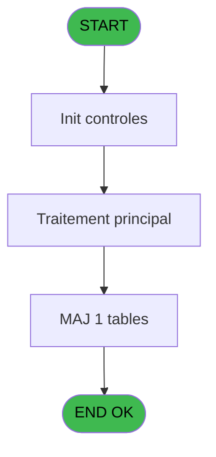
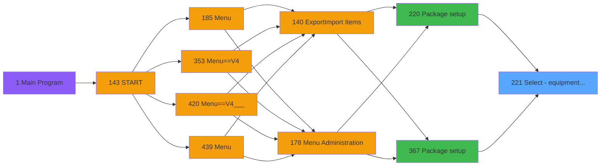
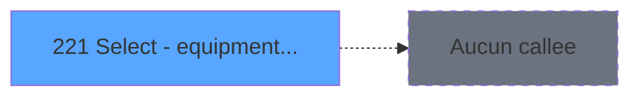

# PVE IDE 221 - Select - equipment type

> **Analyse**: Phases 1-4 2026-02-03 19:00 -> 19:00 (18s) | Assemblage 19:00
> **Pipeline**: V7.2 Enrichi
> **Structure**: 4 onglets (Resume | Ecrans | Donnees | Connexions)

<!-- TAB:Resume -->

## 1. FICHE D'IDENTITE

| Attribut | Valeur |
|----------|--------|
| Projet | PVE |
| IDE Position | 221 |
| Nom Programme | Select - equipment type |
| Fichier source | `Prg_221.xml` |
| Dossier IDE | Packages |
| Taches | 12 (1 ecrans visibles) |
| Tables modifiees | 1 |
| Programmes appeles | 0 |

## 2. DESCRIPTION FONCTIONNELLE

**Select - equipment type** assure la gestion complete de ce processus, accessible depuis [Package setup (IDE 220)](PVE-IDE-220.md), [Package setup (IDE 367)](PVE-IDE-367.md).

Le flux de traitement s'organise en **2 blocs fonctionnels** :

- **Traitement** (11 taches) : traitements metier divers
- **Consultation** (1 tache) : ecrans de recherche, selection et consultation

**Donnees modifiees** : 1 tables en ecriture (pv_cust_rentals_histo).

Detail : phases du traitement

#### Phase 1 : Traitement (11 taches)

- **221** - Types of equipment **[[ECRAN]](#ecran-t1)**
- **221.1** - send right **[[ECRAN]](#ecran-t2)**
- **221.2** - send all right **[[ECRAN]](#ecran-t3)**
- **221.3** - send left **[[ECRAN]](#ecran-t4)**
- **221.4** - send all left **[[ECRAN]](#ecran-t5)**
- **221.5** - get package composant
- **221.6.1** - add
- **221.6.1.1** - SQL Total payement **[[ECRAN]](#ecran-t9)**
- **221.6.1.2** - SQL Total payement **[[ECRAN]](#ecran-t10)**
- **221.6.2** - del
- **221.6.3** - del

#### Phase 2 : Consultation (1 tache)

- **221.6** - select **[[ECRAN]](#ecran-t7)**

#### Tables impactees

| Table | Operations | Role metier |
|-------|-----------|-------------|
| pv_cust_rentals_histo | R/**W** (4 usages) | Historique / journal |

## 3. BLOCS FONCTIONNELS

### 3.1 Traitement (11 taches)

Traitements internes.

---

#### 221 - Types of equipment [[ECRAN]](#ecran-t1)

**Role** : Tache d'orchestration : point d'entree du programme (11 sous-taches). Coordonne l'enchainement des traitements.
**Ecran** : 454 x 293 DLU (MDI) | [Voir mockup](#ecran-t1)

10 sous-taches directes

| Tache | Nom | Bloc |
|-------|-----|------|
| [221.1](#t2) | send right **[[ECRAN]](#ecran-t2)** | Traitement |
| [221.2](#t3) | send all right **[[ECRAN]](#ecran-t3)** | Traitement |
| [221.3](#t4) | send left **[[ECRAN]](#ecran-t4)** | Traitement |
| [221.4](#t5) | send all left **[[ECRAN]](#ecran-t5)** | Traitement |
| [221.5](#t6) | get package composant | Traitement |
| [221.6.1](#t8) | add | Traitement |
| [221.6.1.1](#t9) | SQL Total payement **[[ECRAN]](#ecran-t9)** | Traitement |
| [221.6.1.2](#t10) | SQL Total payement **[[ECRAN]](#ecran-t10)** | Traitement |
| [221.6.2](#t11) | del | Traitement |
| [221.6.3](#t12) | del | Traitement |

---

#### 221.1 - send right [[ECRAN]](#ecran-t2)

**Role** : Traitement : send right.
**Ecran** : 714 x 195 DLU (MDI) | [Voir mockup](#ecran-t2)
**Variables liees** : E (v.combo right), G (v.combo list right), H (btn right), J (btn all right)

---

#### 221.2 - send all right [[ECRAN]](#ecran-t3)

**Role** : Traitement : send all right.
**Ecran** : 714 x 195 DLU (MDI) | [Voir mockup](#ecran-t3)
**Variables liees** : E (v.combo right), G (v.combo list right), H (btn right), J (btn all right)

---

#### 221.3 - send left [[ECRAN]](#ecran-t4)

**Role** : Traitement : send left.
**Ecran** : 114 x 58 DLU (MDI) | [Voir mockup](#ecran-t4)
**Variables liees** : D (v.combo left), F (v.combo list left), I (btn left), K (btn all left)

---

#### 221.4 - send all left [[ECRAN]](#ecran-t5)

**Role** : Traitement : send all left.
**Ecran** : 114 x 58 DLU (MDI) | [Voir mockup](#ecran-t5)
**Variables liees** : D (v.combo left), F (v.combo list left), I (btn left), K (btn all left)

---

#### 221.5 - get package composant

**Role** : Consultation/chargement : get package composant.

---

#### 221.6.1 - add

**Role** : Traitement interne.

---

#### 221.6.1.1 - SQL Total payement [[ECRAN]](#ecran-t9)

**Role** : Traitement : SQL Total payement.
**Ecran** : 115 x 195 DLU | [Voir mockup](#ecran-t9)

---

#### 221.6.1.2 - SQL Total payement [[ECRAN]](#ecran-t10)

**Role** : Traitement : SQL Total payement.
**Ecran** : 115 x 195 DLU | [Voir mockup](#ecran-t10)

---

#### 221.6.2 - del

**Role** : Traitement interne.

---

#### 221.6.3 - del

**Role** : Traitement interne.

### 3.2 Consultation (1 tache)

Ecrans de recherche et consultation.

---

#### 221.6 - select [[ECRAN]](#ecran-t7)

**Role** : Traitement : select.
**Ecran** : 114 x 58 DLU (MDI) | [Voir mockup](#ecran-t7)

## 5. REGLES METIER

*(Aucune regle metier identifiee)*

## 6. CONTEXTE

- **Appele par**: [Package setup (IDE 220)](PVE-IDE-220.md), [Package setup (IDE 367)](PVE-IDE-367.md)
- **Appelle**: 0 programmes | **Tables**: 2 (W:1 R:2 L:1) | **Taches**: 12 | **Expressions**: 8

<!-- TAB:Ecrans -->

## 8. ECRANS

### 8.1 Forms visibles (1 / 12)

| # | Position | Tache | Nom | Type | Largeur | Hauteur | Bloc |
|---|----------|-------|-----|------|---------|---------|------|
| 1 | 221 | 221 | Types of equipment | MDI | 454 | 293 | Traitement |

### 8.2 Mockups Ecrans

---

#### 221 - Types of equipment
**Tache** : [221](#t1) | **Type** : MDI | **Dimensions** : 454 x 293 DLU
**Bloc** : Traitement | **Titre IDE** : Types of equipment

<!-- FORM-DATA:
{
    "width":  454,
    "vFactor":  8,
    "type":  "MDI",
    "hFactor":  4,
    "controls":  [
                     {
                         "x":  0,
                         "type":  "label",
                         "var":  "",
                         "y":  0,
                         "w":  453,
                         "fmt":  "",
                         "name":  "",
                         "h":  42,
                         "color":  "182",
                         "text":  "",
                         "parent":  null
                     },
                     {
                         "x":  14,
                         "type":  "label",
                         "var":  "",
                         "y":  15,
                         "w":  345,
                         "fmt":  "",
                         "name":  "",
                         "h":  10,
                         "color":  "186",
                         "text":  "Add equipments for this packages into the list on the right",
                         "parent":  1
                     },
                     {
                         "x":  0,
                         "type":  "label",
                         "var":  "",
                         "y":  258,
                         "w":  453,
                         "fmt":  "",
                         "name":  "",
                         "h":  33,
                         "color":  "6",
                         "text":  "",
                         "parent":  null
                     },
                     {
                         "x":  20,
                         "type":  "listbox",
                         "var":  "",
                         "y":  63,
                         "w":  149,
                         "fmt":  "",
                         "name":  "v.combo left",
                         "h":  168,
                         "color":  "110",
                         "text":  "matos left",
                         "parent":  null
                     },
                     {
                         "x":  285,
                         "type":  "listbox",
                         "var":  "",
                         "y":  63,
                         "w":  149,
                         "fmt":  "",
                         "name":  "v.combo right",
                         "h":  168,
                         "color":  "110",
                         "text":  "matos right",
                         "parent":  null
                     },
                     {
                         "x":  189,
                         "type":  "button",
                         "var":  "",
                         "y":  76,
                         "w":  77,
                         "fmt":  "\u003e",
                         "name":  "btn right",
                         "h":  28,
                         "color":  "",
                         "text":  "",
                         "parent":  null
                     },
                     {
                         "x":  189,
                         "type":  "button",
                         "var":  "",
                         "y":  115,
                         "w":  77,
                         "fmt":  "\u003c",
                         "name":  "btn left",
                         "h":  28,
                         "color":  "",
                         "text":  "",
                         "parent":  null
                     },
                     {
                         "x":  189,
                         "type":  "button",
                         "var":  "",
                         "y":  154,
                         "w":  77,
                         "fmt":  "\u003e\u003e",
                         "name":  "btn all right",
                         "h":  28,
                         "color":  "",
                         "text":  "",
                         "parent":  null
                     },
                     {
                         "x":  189,
                         "type":  "button",
                         "var":  "",
                         "y":  193,
                         "w":  77,
                         "fmt":  "\u003c\u003c",
                         "name":  "btn all left",
                         "h":  28,
                         "color":  "",
                         "text":  "",
                         "parent":  null
                     },
                     {
                         "x":  403,
                         "type":  "image",
                         "var":  "",
                         "y":  4,
                         "w":  48,
                         "fmt":  "",
                         "name":  "",
                         "h":  37,
                         "color":  "",
                         "text":  "",
                         "parent":  1
                     },
                     {
                         "x":  299,
                         "type":  "button",
                         "var":  "",
                         "y":  263,
                         "w":  77,
                         "fmt":  "\u0026Select",
                         "name":  "",
                         "h":  28,
                         "color":  "",
                         "text":  "",
                         "parent":  null
                     },
                     {
                         "x":  375,
                         "type":  "button",
                         "var":  "",
                         "y":  263,
                         "w":  77,
                         "fmt":  "\u0026Cancel",
                         "name":  "",
                         "h":  28,
                         "color":  "",
                         "text":  "",
                         "parent":  null
                     }
                 ],
    "taskId":  "221",
    "height":  293
}
-->

<strong>Boutons : 6 boutons</strong>

| Bouton | Pos (x,y) | Action |
|--------|-----------|--------|
| > | 189,76 | Bouton fonctionnel |
| < | 189,115 | Bouton fonctionnel |
| >> | 189,154 | Bouton fonctionnel |
| << | 189,193 | Bouton fonctionnel |
| Select | 299,263 | Ouvre la selection |
| Cancel | 375,263 | Annule et retour au menu |

## 9. NAVIGATION

Ecran unique: **Types of equipment**

### 9.3 Structure hierarchique (12 taches)

| Position | Tache | Type | Dimensions | Bloc |
|----------|-------|------|------------|------|
| **221.1** | [**Types of equipment** (221)](#t1) [mockup](#ecran-t1) | MDI | 454x293 | Traitement |
| 221.1.1 | [send right (221.1)](#t2) [mockup](#ecran-t2) | MDI | 714x195 | |
| 221.1.2 | [send all right (221.2)](#t3) [mockup](#ecran-t3) | MDI | 714x195 | |
| 221.1.3 | [send left (221.3)](#t4) [mockup](#ecran-t4) | MDI | 114x58 | |
| 221.1.4 | [send all left (221.4)](#t5) [mockup](#ecran-t5) | MDI | 114x58 | |
| 221.1.5 | [get package composant (221.5)](#t6) | MDI | - | |
| 221.1.6 | [add (221.6.1)](#t8) | MDI | - | |
| 221.1.7 | [SQL Total payement (221.6.1.1)](#t9) [mockup](#ecran-t9) | - | 115x195 | |
| 221.1.8 | [SQL Total payement (221.6.1.2)](#t10) [mockup](#ecran-t10) | - | 115x195 | |
| 221.1.9 | [del (221.6.2)](#t11) | MDI | - | |
| 221.1.10 | [del (221.6.3)](#t12) | MDI | - | |
| **221.2** | [**select** (221.6)](#t7) [mockup](#ecran-t7) | MDI | 114x58 | Consultation |

### 9.4 Algorigramme

> **Legende**: Vert = START/END OK | Rouge = END KO | Bleu = Decisions
> *Algorigramme auto-genere. Utiliser `/algorigramme` pour une synthese metier detaillee.*

<!-- TAB:Donnees -->

## 10. TABLES

### Tables utilisees (2)

| ID | Nom | Description | Type | R | W | L | Usages |
|----|-----|-------------|------|---|---|---|--------|
| 401 | pv_cust_rentals_histo | Historique / journal | DB | R | **W** |   | 4 |
| 419 | realise_articles_caution | Articles et stock | DB | R |   | L | 8 |

### Colonnes par table (2 / 2 tables avec colonnes identifiees)

Table 401 - pv_cust_rentals_histo (R/**W**) - 4 usages

| Lettre | Variable | Acces | Type |
|--------|----------|-------|------|
| A | v.count | W | Numeric |
| B | v.classification | W | Numeric |

Table 419 - realise_articles_caution (R/L) - 8 usages

| Lettre | Variable | Acces | Type |
|--------|----------|-------|------|
| A | p.cat | R | Numeric |
| B | p.sub cat | R | Numeric |
| C | p.default classif | R | Numeric |
| D | v.combo left | R | Alpha |
| E | v.combo right | R | Alpha |
| F | v.combo list left | R | Alpha |
| G | v.combo list right | R | Alpha |
| H | btn right | R | Alpha |
| I | btn left | R | Alpha |
| J | btn all right | R | Alpha |
| K | btn all left | R | Alpha |

## 11. VARIABLES

### 11.1 Parametres entrants (3)

Variables recues du programme appelant ([Package setup (IDE 220)](PVE-IDE-220.md)).

| Lettre | Nom | Type | Usage dans |
|--------|-----|------|-----------|
| A | p.cat | Numeric | - |
| B | p.sub cat | Numeric | - |
| C | p.default classif | Numeric | - |

### 11.2 Variables de session (4)

Variables persistantes pendant toute la session.

| Lettre | Nom | Type | Usage dans |
|--------|-----|------|-----------|
| D | v.combo left | Alpha | [221.3](#t4), [221.4](#t5) |
| E | v.combo right | Alpha | [221.1](#t2), [221.2](#t3) |
| F | v.combo list left | Alpha | [221.3](#t4), [221.4](#t5) |
| G | v.combo list right | Alpha | [221.1](#t2), [221.2](#t3) |

### 11.3 Autres (4)

Variables diverses.

| Lettre | Nom | Type | Usage dans |
|--------|-----|------|-----------|
| H | btn right | Alpha | - |
| I | btn left | Alpha | - |
| J | btn all right | Alpha | - |
| K | btn all left | Alpha | - |

## 12. EXPRESSIONS

**8 / 8 expressions decodees (100%)**

### 12.1 Repartition par type

| Type | Expressions | Regles |
|------|-------------|--------|
| OTHER | 6 | 0 |
| CONCATENATION | 2 | 0 |

### 12.2 Expressions cles par type

#### OTHER (6 expressions)

| Type | IDE | Expression | Regle |
|------|-----|------------|-------|
| OTHER | 4 | `v.combo right [E]` | - |
| OTHER | 5 | `v.combo list left [F]` | - |
| OTHER | 6 | `v.combo list right [G]` | - |
| OTHER | 1 | `GetParam ('SERVICE')` | - |
| OTHER | 2 | `GetParam ('COMBOMATOS')` | - |
| ... | | *+1 autres* | |

#### CONCATENATION (2 expressions)

| Type | IDE | Expression | Regle |
|------|-----|------------|-------|
| CONCATENATION | 8 | `','&Trim(v.combo list right [G])&','` | - |
| CONCATENATION | 7 | `','&Trim(v.combo list left [F])&','` | - |

<!-- TAB:Connexions -->

## 13. GRAPHE D'APPELS

### 13.1 Chaine depuis Main (Callers)

Main -> ... -> [Package setup (IDE 220)](PVE-IDE-220.md) -> **Select - equipment type (IDE 221)**

Main -> ... -> [Package setup (IDE 367)](PVE-IDE-367.md) -> **Select - equipment type (IDE 221)**

### 13.2 Callers

| IDE | Nom Programme | Nb Appels |
|-----|---------------|-----------|
| [220](PVE-IDE-220.md) | Package setup | 1 |
| [367](PVE-IDE-367.md) | Package setup | 1 |

### 13.3 Callees (programmes appeles)

### 13.4 Detail Callees avec contexte

| IDE | Nom Programme | Appels | Contexte |
|-----|---------------|--------|----------|
| - | (aucun) | - | - |

## 14. RECOMMANDATIONS MIGRATION

### 14.1 Profil du programme

| Metrique | Valeur | Impact migration |
|----------|--------|-----------------|
| Lignes de logique | 153 | Programme compact |
| Expressions | 8 | Peu de logique |
| Tables WRITE | 1 | Impact faible |
| Sous-programmes | 0 | Peu de dependances |
| Ecrans visibles | 1 | Ecran unique ou traitement batch |
| Code desactive | 0% (0 / 153) | Code sain |
| Regles metier | 0 | Pas de regle identifiee |

### 14.2 Plan de migration par bloc

#### Traitement (11 taches: 7 ecrans, 4 traitements)

- **Strategie** : Orchestrateur avec 7 ecrans (Razor/React) et 4 traitements backend (services).
- Les ecrans deviennent des composants UI, les traitements invisibles deviennent des services injectables.
- Decomposer les taches en services unitaires testables.

#### Consultation (1 tache: 1 ecran, 0 traitement)

- **Strategie** : Composants de recherche/selection en modales.
- 1 ecran : select

### 14.3 Dependances critiques

| Dependance | Type | Appels | Impact |
|------------|------|--------|--------|
| pv_cust_rentals_histo | Table WRITE (Database) | 3x | Schema + repository |

---
*Spec DETAILED generee par Pipeline V7.2 - 2026-02-03 19:00*
