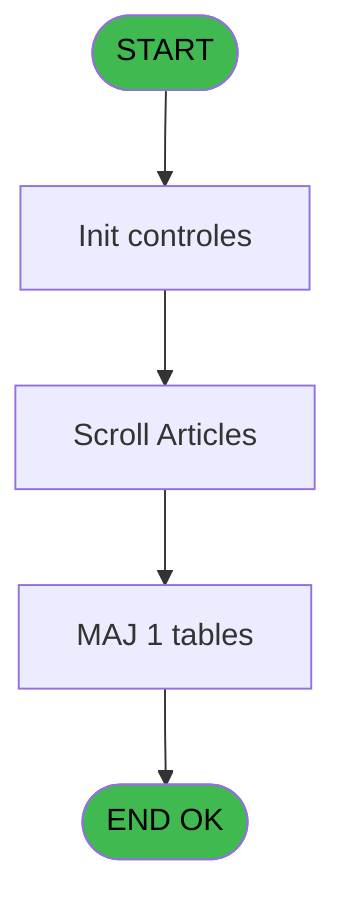
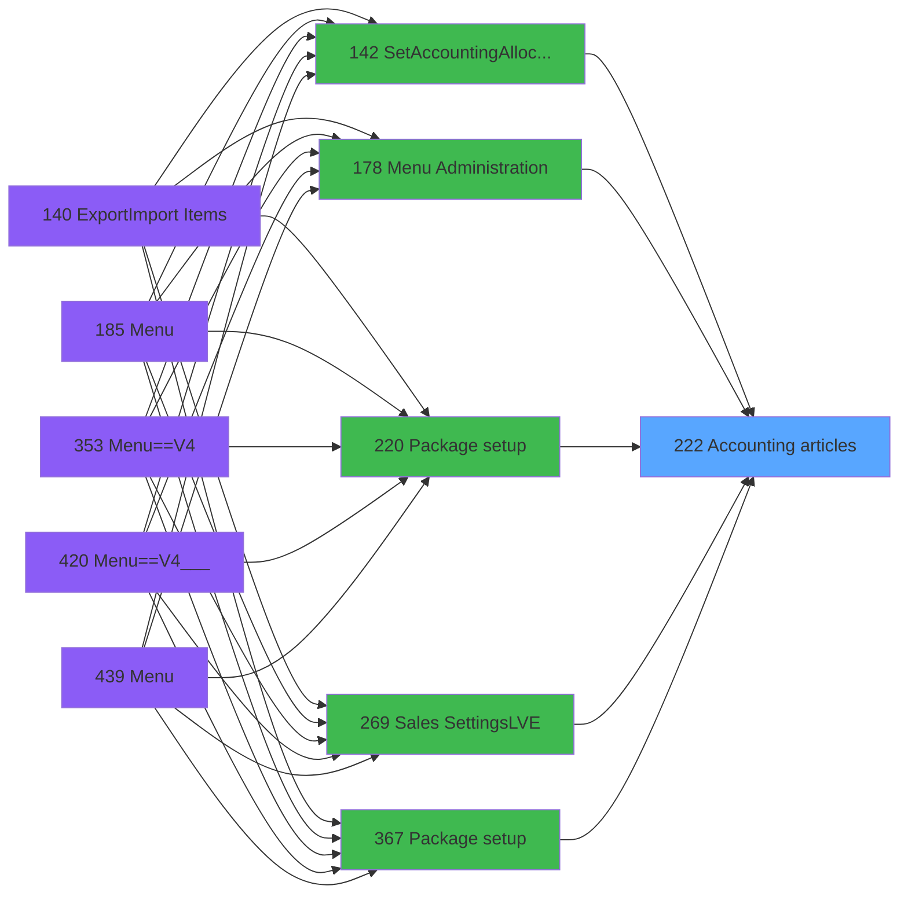
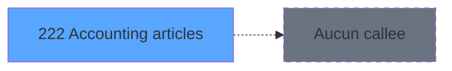

# PVE IDE 222 - Accounting articles

> **Analyse**: Phases 1-4 2026-02-03 19:00 -> 19:01 (19s) | Assemblage 19:01
> **Pipeline**: V7.2 Enrichi
> **Structure**: 4 onglets (Resume | Ecrans | Donnees | Connexions)

<!-- TAB:Resume -->

## 1. FICHE D'IDENTITE

| Attribut | Valeur |
|----------|--------|
| Projet | PVE |
| IDE Position | 222 |
| Nom Programme | Accounting articles |
| Fichier source | `Prg_222.xml` |
| Dossier IDE | Packages |
| Taches | 2 (1 ecrans visibles) |
| Tables modifiees | 1 |
| Programmes appeles | 0 |

## 2. DESCRIPTION FONCTIONNELLE

**Accounting articles** assure la gestion complete de ce processus, accessible depuis [SetAccountingAllocations (IDE 142)](PVE-IDE-142.md), [Menu Administration (IDE 178)](PVE-IDE-178.md), [Package setup (IDE 220)](PVE-IDE-220.md), [Sales Settings(LVE) (IDE 269)](PVE-IDE-269.md), [Package setup (IDE 367)](PVE-IDE-367.md).

Le flux de traitement s'organise en **1 blocs fonctionnels** :

- **Traitement** (2 taches) : traitements metier divers

**Donnees modifiees** : 1 tables en ecriture (articles_________art).

## 3. BLOCS FONCTIONNELS

### 3.1 Traitement (2 taches)

Traitements internes.

---

#### 222 - MAJ base articles [[ECRAN]](#ecran-t1)

**Role** : Traitement : MAJ base articles.
**Ecran** : 154 x -7 DLU (MDI) | [Voir mockup](#ecran-t1)

---

#### 222.1 - Accounting articles [[ECRAN]](#ecran-t2)

**Role** : Traitement : Accounting articles.
**Ecran** : 640 x 305 DLU (MDI) | [Voir mockup](#ecran-t2)

## 5. REGLES METIER

*(Aucune regle metier identifiee)*

## 6. CONTEXTE

- **Appele par**: [SetAccountingAllocations (IDE 142)](PVE-IDE-142.md), [Menu Administration (IDE 178)](PVE-IDE-178.md), [Package setup (IDE 220)](PVE-IDE-220.md), [Sales Settings(LVE) (IDE 269)](PVE-IDE-269.md), [Package setup (IDE 367)](PVE-IDE-367.md)
- **Appelle**: 0 programmes | **Tables**: 1 (W:1 R:0 L:0) | **Taches**: 2 | **Expressions**: 1

<!-- TAB:Ecrans -->

## 8. ECRANS

### 8.1 Forms visibles (1 / 2)

| # | Position | Tache | Nom | Type | Largeur | Hauteur | Bloc |
|---|----------|-------|-----|------|---------|---------|------|
| 1 | 222.1 | 222.1 | Accounting articles | MDI | 640 | 305 | Traitement |

### 8.2 Mockups Ecrans

---

#### 222.1 - Accounting articles
**Tache** : [222.1](#t2) | **Type** : MDI | **Dimensions** : 640 x 305 DLU
**Bloc** : Traitement | **Titre IDE** : Accounting articles

<!-- FORM-DATA:
{
    "width":  640,
    "vFactor":  8,
    "type":  "MDI",
    "hFactor":  4,
    "controls":  [
                     {
                         "x":  6,
                         "type":  "label",
                         "var":  "",
                         "y":  53,
                         "w":  628,
                         "fmt":  "",
                         "name":  "",
                         "h":  216,
                         "color":  "141",
                         "text":  "",
                         "parent":  null
                     },
                     {
                         "x":  0,
                         "type":  "label",
                         "var":  "",
                         "y":  0,
                         "w":  640,
                         "fmt":  "",
                         "name":  "",
                         "h":  41,
                         "color":  "182",
                         "text":  "",
                         "parent":  null
                     },
                     {
                         "x":  21,
                         "type":  "label",
                         "var":  "",
                         "y":  15,
                         "w":  459,
                         "fmt":  "",
                         "name":  "",
                         "h":  10,
                         "color":  "186",
                         "text":  "Select the appropriate accounting code for your service or package",
                         "parent":  4
                     },
                     {
                         "x":  77,
                         "type":  "table",
                         "var":  "",
                         "name":  "",
                         "titleH":  12,
                         "color":  "110",
                         "w":  551,
                         "y":  74,
                         "fmt":  "",
                         "parent":  null,
                         "text":  "",
                         "rowH":  25,
                         "h":  190,
                         "cols":  [
                                      {
                                          "title":  "Code",
                                          "layer":  1,
                                          "w":  47
                                      },
                                      {
                                          "title":  "Product",
                                          "layer":  2,
                                          "w":  123
                                      },
                                      {
                                          "title":  "Price",
                                          "layer":  3,
                                          "w":  114
                                      },
                                      {
                                          "title":  "Imputation",
                                          "layer":  4,
                                          "w":  248
                                      }
                                  ],
                         "rows":  4
                     },
                     {
                         "x":  0,
                         "type":  "label",
                         "var":  "",
                         "y":  275,
                         "w":  640,
                         "fmt":  "",
                         "name":  "",
                         "h":  30,
                         "color":  "6",
                         "text":  "",
                         "parent":  null
                     },
                     {
                         "x":  82,
                         "type":  "edit",
                         "var":  "",
                         "y":  89,
                         "w":  38,
                         "fmt":  "",
                         "name":  "",
                         "h":  19,
                         "color":  "110",
                         "text":  "",
                         "parent":  7
                     },
                     {
                         "x":  128,
                         "type":  "edit",
                         "var":  "",
                         "y":  89,
                         "w":  112,
                         "fmt":  "",
                         "name":  "",
                         "h":  22,
                         "color":  "110",
                         "text":  "",
                         "parent":  7
                     },
                     {
                         "x":  365,
                         "type":  "edit",
                         "var":  "",
                         "y":  89,
                         "w":  88,
                         "fmt":  "",
                         "name":  "",
                         "h":  19,
                         "color":  "110",
                         "text":  "",
                         "parent":  7
                     },
                     {
                         "x":  457,
                         "type":  "edit",
                         "var":  "",
                         "y":  89,
                         "w":  60,
                         "fmt":  "",
                         "name":  "",
                         "h":  19,
                         "color":  "110",
                         "text":  "",
                         "parent":  7
                     },
                     {
                         "x":  530,
                         "type":  "edit",
                         "var":  "",
                         "y":  89,
                         "w":  21,
                         "fmt":  "",
                         "name":  "",
                         "h":  19,
                         "color":  "110",
                         "text":  "",
                         "parent":  7
                     },
                     {
                         "x":  252,
                         "type":  "edit",
                         "var":  "",
                         "y":  89,
                         "w":  105,
                         "fmt":  "## ### ### ###.##Z",
                         "name":  "",
                         "h":  19,
                         "color":  "110",
                         "text":  "",
                         "parent":  7
                     },
                     {
                         "x":  10,
                         "type":  "image",
                         "var":  "",
                         "y":  55,
                         "w":  63,
                         "fmt":  "",
                         "name":  "",
                         "h":  43,
                         "color":  "",
                         "text":  "",
                         "parent":  1
                     },
                     {
                         "x":  180,
                         "type":  "edit",
                         "var":  "",
                         "y":  57,
                         "w":  355,
                         "fmt":  "60",
                         "name":  "",
                         "h":  12,
                         "color":  "7",
                         "text":  "",
                         "parent":  null
                     },
                     {
                         "x":  517,
                         "type":  "edit",
                         "var":  "",
                         "y":  89,
                         "w":  10,
                         "fmt":  "1",
                         "name":  "",
                         "h":  19,
                         "color":  "6",
                         "text":  "",
                         "parent":  7
                     },
                     {
                         "x":  557,
                         "type":  "edit",
                         "var":  "",
                         "y":  89,
                         "w":  10,
                         "fmt":  "1",
                         "name":  "",
                         "h":  19,
                         "color":  "110",
                         "text":  "",
                         "parent":  7
                     },
                     {
                         "x":  572,
                         "type":  "edit",
                         "var":  "",
                         "y":  89,
                         "w":  32,
                         "fmt":  "5",
                         "name":  "",
                         "h":  19,
                         "color":  "110",
                         "text":  "",
                         "parent":  7
                     },
                     {
                         "x":  484,
                         "type":  "button",
                         "var":  "",
                         "y":  280,
                         "w":  77,
                         "fmt":  "\u0026Select",
                         "name":  "",
                         "h":  25,
                         "color":  "",
                         "text":  "",
                         "parent":  null
                     },
                     {
                         "x":  561,
                         "type":  "button",
                         "var":  "",
                         "y":  280,
                         "w":  77,
                         "fmt":  "\u0026Cancel",
                         "name":  "",
                         "h":  25,
                         "color":  "",
                         "text":  "",
                         "parent":  null
                     },
                     {
                         "x":  590,
                         "type":  "image",
                         "var":  "",
                         "y":  4,
                         "w":  48,
                         "fmt":  "",
                         "name":  "",
                         "h":  36,
                         "color":  "",
                         "text":  "",
                         "parent":  4
                     }
                 ],
    "taskId":  "222.1",
    "height":  305
}
-->

<strong>Champs : 10 champs</strong>

| Pos (x,y) | Nom | Variable | Type |
|-----------|-----|----------|------|
| 82,89 | (sans nom) | - | edit |
| 128,89 | (sans nom) | - | edit |
| 365,89 | (sans nom) | - | edit |
| 457,89 | (sans nom) | - | edit |
| 530,89 | (sans nom) | - | edit |
| 252,89 | ## ### ### ###.##Z | - | edit |
| 180,57 | 60 | - | edit |
| 517,89 | 1 | - | edit |
| 557,89 | 1 | - | edit |
| 572,89 | 5 | - | edit |

<strong>Boutons : 2 boutons</strong>

| Bouton | Pos (x,y) | Action |
|--------|-----------|--------|
| Select | 484,280 | Ouvre la selection |
| Cancel | 561,280 | Annule et retour au menu |

## 9. NAVIGATION

Ecran unique: **Accounting articles**

### 9.3 Structure hierarchique (2 taches)

| Position | Tache | Type | Dimensions | Bloc |
|----------|-------|------|------------|------|
| **222.1** | [**MAJ base articles** (222)](#t1) [mockup](#ecran-t1) | MDI | 154x-7 | Traitement |
| 222.1.1 | [Accounting articles (222.1)](#t2) [mockup](#ecran-t2) | MDI | 640x305 | |

### 9.4 Algorigramme

> **Legende**: Vert = START/END OK | Rouge = END KO | Bleu = Decisions
> *Algorigramme auto-genere. Utiliser `/algorigramme` pour une synthese metier detaillee.*

<!-- TAB:Donnees -->

## 10. TABLES

### Tables utilisees (1)

| ID | Nom | Description | Type | R | W | L | Usages |
|----|-----|-------------|------|---|---|---|--------|
| 77 | articles_________art | Articles et stock | DB |   | **W** |   | 1 |

### Colonnes par table (0 / 1 tables avec colonnes identifiees)

Table 77 - articles_________art (**W**) - 1 usages

*Table utilisee uniquement en Link ou aucune colonne Real identifiee dans le DataView.*

## 11. VARIABLES

### 11.1 Parametres entrants (4)

Variables recues du programme appelant ([SetAccountingAllocations (IDE 142)](PVE-IDE-142.md)).

| Lettre | Nom | Type | Usage dans |
|--------|-----|------|-----------|
| A | p.article id | Numeric | - |
| B | P0 masque mtt | Alpha | - |
| C | P0 devise locale | Alpha | - |
| D | P0 nbre décimales | Numeric | - |

### 11.2 Variables de travail (1)

Variables internes au programme.

| Lettre | Nom | Type | Usage dans |
|--------|-----|------|-----------|
| E | W0 service-village | Alpha | - |

## 12. EXPRESSIONS

**1 / 1 expressions decodees (100%)**

### 12.1 Repartition par type

| Type | Expressions | Regles |
|------|-------------|--------|
| OTHER | 1 | 0 |

### 12.2 Expressions cles par type

#### OTHER (1 expressions)

| Type | IDE | Expression | Regle |
|------|-----|------------|-------|
| OTHER | 1 | `GetParam ('SERVICE')` | - |

<!-- TAB:Connexions -->

## 13. GRAPHE D'APPELS

### 13.1 Chaine depuis Main (Callers)

Main -> ... -> [SetAccountingAllocations (IDE 142)](PVE-IDE-142.md) -> **Accounting articles (IDE 222)**

Main -> ... -> [Menu Administration (IDE 178)](PVE-IDE-178.md) -> **Accounting articles (IDE 222)**

Main -> ... -> [Package setup (IDE 220)](PVE-IDE-220.md) -> **Accounting articles (IDE 222)**

Main -> ... -> [Sales Settings(LVE) (IDE 269)](PVE-IDE-269.md) -> **Accounting articles (IDE 222)**

Main -> ... -> [Package setup (IDE 367)](PVE-IDE-367.md) -> **Accounting articles (IDE 222)**

### 13.2 Callers

| IDE | Nom Programme | Nb Appels |
|-----|---------------|-----------|
| [142](PVE-IDE-142.md) | SetAccountingAllocations | 1 |
| [178](PVE-IDE-178.md) | Menu Administration | 1 |
| [220](PVE-IDE-220.md) | Package setup | 1 |
| [269](PVE-IDE-269.md) | Sales Settings(LVE) | 1 |
| [367](PVE-IDE-367.md) | Package setup | 1 |

### 13.3 Callees (programmes appeles)

### 13.4 Detail Callees avec contexte

| IDE | Nom Programme | Appels | Contexte |
|-----|---------------|--------|----------|
| - | (aucun) | - | - |

## 14. RECOMMANDATIONS MIGRATION

### 14.1 Profil du programme

| Metrique | Valeur | Impact migration |
|----------|--------|-----------------|
| Lignes de logique | 23 | Programme compact |
| Expressions | 1 | Peu de logique |
| Tables WRITE | 1 | Impact faible |
| Sous-programmes | 0 | Peu de dependances |
| Ecrans visibles | 1 | Ecran unique ou traitement batch |
| Code desactive | 0% (0 / 23) | Code sain |
| Regles metier | 0 | Pas de regle identifiee |

### 14.2 Plan de migration par bloc

#### Traitement (2 taches: 2 ecrans, 0 traitement)

- **Strategie** : 2 composant(s) UI (Razor/React) avec formulaires et validation.
- Decomposer les taches en services unitaires testables.

### 14.3 Dependances critiques

| Dependance | Type | Appels | Impact |
|------------|------|--------|--------|
| articles_________art | Table WRITE (Database) | 1x | Schema + repository |

---
*Spec DETAILED generee par Pipeline V7.2 - 2026-02-03 19:01*
