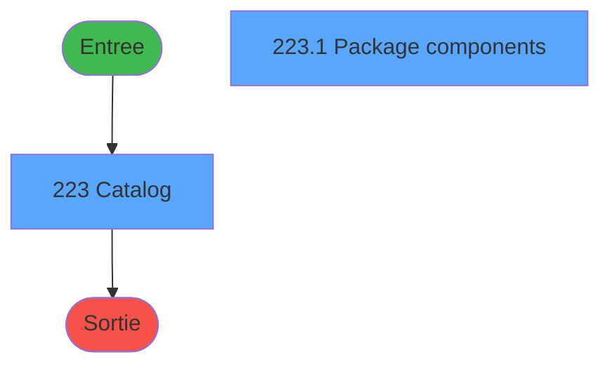
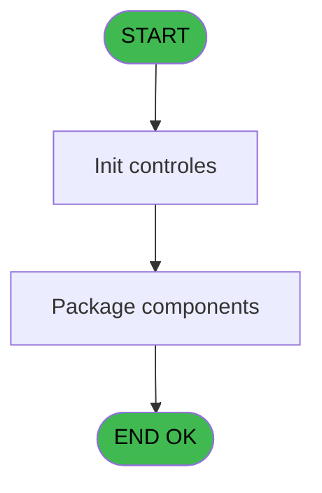
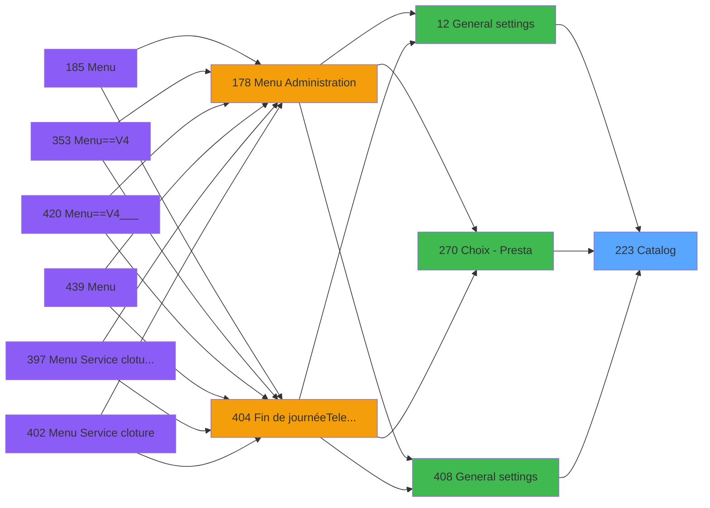
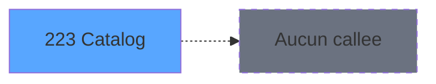

# PVE IDE 223 - Catalog

> **Analyse**: Phases 1-4 2026-02-03 19:01 -> 19:01 (19s) | Assemblage 19:01
> **Pipeline**: V7.2 Enrichi
> **Structure**: 4 onglets (Resume | Ecrans | Donnees | Connexions)

<!-- TAB:Resume -->

## 1. FICHE D'IDENTITE

| Attribut | Valeur |
|----------|--------|
| Projet | PVE |
| IDE Position | 223 |
| Nom Programme | Catalog |
| Fichier source | `Prg_223.xml` |
| Dossier IDE | Packages |
| Taches | 2 (2 ecrans visibles) |
| Tables modifiees | 0 |
| Programmes appeles | 0 |

## 2. DESCRIPTION FONCTIONNELLE

**Catalog** assure la gestion complete de ce processus, accessible depuis [General settings (IDE 12)](PVE-IDE-12.md), [Choix - Presta (IDE 270)](PVE-IDE-270.md), [General settings (IDE 408)](PVE-IDE-408.md).

Le flux de traitement s'organise en **1 blocs fonctionnels** :

- **Traitement** (2 taches) : traitements metier divers

## 3. BLOCS FONCTIONNELS

### 3.1 Traitement (2 taches)

Traitements internes.

---

#### 223 - Catalog [[ECRAN]](#ecran-t1)

**Role** : Traitement : Catalog.
**Ecran** : 640 x 347 DLU (MDI) | [Voir mockup](#ecran-t1)

---

#### 223.1 - Package components [[ECRAN]](#ecran-t2)

**Role** : Traitement : Package components.
**Ecran** : 185 x 162 DLU (Modal) | [Voir mockup](#ecran-t2)

## 5. REGLES METIER

*(Aucune regle metier identifiee)*

## 6. CONTEXTE

- **Appele par**: [General settings (IDE 12)](PVE-IDE-12.md), [Choix - Presta (IDE 270)](PVE-IDE-270.md), [General settings (IDE 408)](PVE-IDE-408.md)
- **Appelle**: 0 programmes | **Tables**: 6 (W:0 R:2 L:4) | **Taches**: 2 | **Expressions**: 23

<!-- TAB:Ecrans -->

## 8. ECRANS

### 8.1 Forms visibles (2 / 2)

| # | Position | Tache | Nom | Type | Largeur | Hauteur | Bloc |
|---|----------|-------|-----|------|---------|---------|------|
| 1 | 223 | 223 | Catalog | MDI | 640 | 347 | Traitement |
| 2 | 223.1 | 223.1 | Package components | Modal | 185 | 162 | Traitement |

### 8.2 Mockups Ecrans

---

#### 223 - Catalog
**Tache** : [223](#t1) | **Type** : MDI | **Dimensions** : 640 x 347 DLU
**Bloc** : Traitement | **Titre IDE** : Catalog

<!-- FORM-DATA:
{
    "width":  640,
    "vFactor":  8,
    "type":  "MDI",
    "hFactor":  4,
    "controls":  [
                     {
                         "x":  12,
                         "type":  "label",
                         "var":  "",
                         "y":  43,
                         "w":  113,
                         "fmt":  "",
                         "name":  "",
                         "h":  13,
                         "color":  "183",
                         "text":  "Category",
                         "parent":  null
                     },
                     {
                         "x":  145,
                         "type":  "label",
                         "var":  "",
                         "y":  43,
                         "w":  116,
                         "fmt":  "",
                         "name":  "",
                         "h":  13,
                         "color":  "183",
                         "text":  "Sub category",
                         "parent":  null
                     },
                     {
                         "x":  267,
                         "type":  "label",
                         "var":  "",
                         "y":  43,
                         "w":  116,
                         "fmt":  "",
                         "name":  "",
                         "h":  13,
                         "color":  "183",
                         "text":  "Article",
                         "parent":  null
                     },
                     {
                         "x":  2,
                         "type":  "label",
                         "var":  "",
                         "y":  0,
                         "w":  638,
                         "fmt":  "",
                         "name":  "",
                         "h":  42,
                         "color":  "182",
                         "text":  "",
                         "parent":  null
                     },
                     {
                         "x":  4,
                         "type":  "table",
                         "var":  "",
                         "name":  "",
                         "titleH":  12,
                         "color":  "110",
                         "w":  386,
                         "y":  72,
                         "fmt":  "",
                         "parent":  null,
                         "text":  "",
                         "rowH":  27,
                         "h":  246,
                         "cols":  [
                                      {
                                          "title":  "",
                                          "layer":  1,
                                          "w":  137
                                      },
                                      {
                                          "title":  "",
                                          "layer":  2,
                                          "w":  121
                                      },
                                      {
                                          "title":  "",
                                          "layer":  3,
                                          "w":  124
                                      }
                                  ],
                         "rows":  3
                     },
                     {
                         "x":  6,
                         "type":  "label",
                         "var":  "",
                         "y":  74,
                         "w":  14,
                         "fmt":  "",
                         "name":  "",
                         "h":  24,
                         "color":  "144",
                         "text":  "ü",
                         "parent":  7
                     },
                     {
                         "x":  436,
                         "type":  "label",
                         "var":  "",
                         "y":  81,
                         "w":  198,
                         "fmt":  "",
                         "name":  "",
                         "h":  51,
                         "color":  "183",
                         "text":  "Classification",
                         "parent":  null
                     },
                     {
                         "x":  450,
                         "type":  "label",
                         "var":  "",
                         "y":  101,
                         "w":  175,
                         "fmt":  "",
                         "name":  "",
                         "h":  19,
                         "color":  "",
                         "text":  "30",
                         "parent":  15
                     },
                     {
                         "x":  436,
                         "type":  "label",
                         "var":  "",
                         "y":  134,
                         "w":  198,
                         "fmt":  "",
                         "name":  "",
                         "h":  184,
                         "color":  "183",
                         "text":  "Equipments",
                         "parent":  null
                     },
                     {
                         "x":  4,
                         "type":  "label",
                         "var":  "",
                         "y":  318,
                         "w":  632,
                         "fmt":  "",
                         "name":  "",
                         "h":  29,
                         "color":  "183",
                         "text":  "",
                         "parent":  null
                     },
                     {
                         "x":  22,
                         "type":  "edit",
                         "var":  "",
                         "y":  74,
                         "w":  116,
                         "fmt":  "",
                         "name":  "",
                         "h":  24,
                         "color":  "110",
                         "text":  "",
                         "parent":  7
                     },
                     {
                         "x":  145,
                         "type":  "edit",
                         "var":  "",
                         "y":  74,
                         "w":  116,
                         "fmt":  "",
                         "name":  "",
                         "h":  24,
                         "color":  "110",
                         "text":  "",
                         "parent":  7
                     },
                     {
                         "x":  264,
                         "type":  "button",
                         "var":  "",
                         "y":  74,
                         "w":  122,
                         "fmt":  "",
                         "name":  "",
                         "h":  24,
                         "color":  "",
                         "text":  "",
                         "parent":  7
                     },
                     {
                         "x":  7,
                         "type":  "edit",
                         "var":  "",
                         "y":  16,
                         "w":  519,
                         "fmt":  "100",
                         "name":  "",
                         "h":  10,
                         "color":  "186",
                         "text":  "",
                         "parent":  4
                     },
                     {
                         "x":  390,
                         "type":  "button",
                         "var":  "",
                         "y":  72,
                         "w":  44,
                         "fmt":  "ñ",
                         "name":  "",
                         "h":  123,
                         "color":  "",
                         "text":  "",
                         "parent":  null
                     },
                     {
                         "x":  390,
                         "type":  "button",
                         "var":  "",
                         "y":  195,
                         "w":  44,
                         "fmt":  "ò",
                         "name":  "",
                         "h":  123,
                         "color":  "",
                         "text":  "",
                         "parent":  null
                     },
                     {
                         "x":  558,
                         "type":  "button",
                         "var":  "",
                         "y":  322,
                         "w":  77,
                         "fmt":  "\u0026Exit",
                         "name":  "",
                         "h":  24,
                         "color":  "",
                         "text":  "",
                         "parent":  null
                     },
                     {
                         "x":  591,
                         "type":  "image",
                         "var":  "",
                         "y":  4,
                         "w":  48,
                         "fmt":  "",
                         "name":  "",
                         "h":  37,
                         "color":  "",
                         "text":  "",
                         "parent":  4
                     },
                     {
                         "x":  4,
                         "type":  "combobox",
                         "var":  "",
                         "y":  58,
                         "w":  121,
                         "fmt":  "",
                         "name":  "p.i.o Filtre Cat",
                         "h":  12,
                         "color":  "",
                         "text":  "0",
                         "parent":  null
                     },
                     {
                         "x":  142,
                         "type":  "combobox",
                         "var":  "",
                         "y":  58,
                         "w":  121,
                         "fmt":  "",
                         "name":  "p.i.o Filtre Sub_Cat",
                         "h":  12,
                         "color":  "",
                         "text":  "0",
                         "parent":  null
                     },
                     {
                         "x":  440,
                         "type":  "subform",
                         "var":  "",
                         "y":  147,
                         "w":  190,
                         "fmt":  "",
                         "name":  "Package components",
                         "h":  166,
                         "color":  "",
                         "text":  "",
                         "parent":  18
                     }
                 ],
    "taskId":  "223",
    "height":  347
}
-->

<strong>Champs : 5 champs</strong>

| Pos (x,y) | Nom | Variable | Type |
|-----------|-----|----------|------|
| 22,74 | (sans nom) | - | edit |
| 145,74 | (sans nom) | - | edit |
| 7,16 | 100 | - | edit |
| 4,58 | p.i.o Filtre Cat | - | combobox |
| 142,58 | p.i.o Filtre Sub_Cat | - | combobox |

<strong>Boutons : 4 boutons</strong>

| Bouton | Pos (x,y) | Action |
|--------|-----------|--------|
| (sans nom) | 264,74 | Action declenchee |
| ñ | 390,72 | Bouton fonctionnel |
| ò | 390,195 | Bouton fonctionnel |
| Exit | 558,322 | Quitte le programme |

---

#### 223.1 - Package components
**Tache** : [223.1](#t2) | **Type** : Modal | **Dimensions** : 185 x 162 DLU
**Bloc** : Traitement | **Titre IDE** : Package components

<!-- FORM-DATA:
{
    "width":  185,
    "vFactor":  8,
    "type":  "Modal",
    "hFactor":  4,
    "controls":  [
                     {
                         "x":  0,
                         "type":  "table",
                         "var":  "",
                         "name":  "",
                         "titleH":  12,
                         "color":  "110",
                         "w":  180,
                         "y":  0,
                         "fmt":  "",
                         "parent":  null,
                         "text":  "",
                         "rowH":  27,
                         "h":  159,
                         "cols":  [
                                      {
                                          "title":  "",
                                          "layer":  1,
                                          "w":  180
                                      }
                                  ],
                         "rows":  1
                     },
                     {
                         "x":  3,
                         "type":  "edit",
                         "var":  "",
                         "y":  2,
                         "w":  174,
                         "fmt":  "30",
                         "name":  "",
                         "h":  22,
                         "color":  "110",
                         "text":  "",
                         "parent":  1
                     }
                 ],
    "taskId":  "223.1",
    "height":  162
}
-->

<strong>Champs : 1 champs</strong>

| Pos (x,y) | Nom | Variable | Type |
|-----------|-----|----------|------|
| 3,2 | 30 | - | edit |

## 9. NAVIGATION

### 9.1 Enchainement des ecrans

**Detail par enchainement :**

| Depuis | Action | Vers | Retour |
|--------|--------|------|--------|

### 9.3 Structure hierarchique (2 taches)

| Position | Tache | Type | Dimensions | Bloc |
|----------|-------|------|------------|------|
| **223.1** | [**Catalog** (223)](#t1) [mockup](#ecran-t1) | MDI | 640x347 | Traitement |
| 223.1.1 | [Package components (223.1)](#t2) [mockup](#ecran-t2) | Modal | 185x162 | |

### 9.4 Algorigramme

> **Legende**: Vert = START/END OK | Rouge = END KO | Bleu = Decisions
> *Algorigramme auto-genere. Utiliser `/algorigramme` pour une synthese metier detaillee.*

<!-- TAB:Donnees -->

## 10. TABLES

### Tables utilisees (6)

| ID | Nom | Description | Type | R | W | L | Usages |
|----|-----|-------------|------|---|---|---|--------|
| 379 | pv_customer_temp |  | DB | R |   |   | 1 |
| 380 | pv_day_modes |  | DB |   |   | L | 1 |
| 401 | pv_cust_rentals_histo | Historique / journal | DB | R |   |   | 1 |
| 403 | pv_sellers |  | DB |   |   | L | 1 |
| 413 | pv_tva |  | DB |   |   | L | 1 |
| 419 | realise_articles_caution | Articles et stock | DB |   |   | L | 1 |

### Colonnes par table (2 / 2 tables avec colonnes identifiees)

Table 379 - pv_customer_temp (R) - 1 usages

| Lettre | Variable | Acces | Type |
|--------|----------|-------|------|
| A | p.cat | R | Numeric |
| B | p.sub cat | R | Numeric |
| C | p. subsub cat | R | Numeric |
| D | p.prod id | R | Numeric |
| E | p.service | R | Unicode |
| F | p.i.o Filtre Cat | R | Numeric |
| G | p.i.o Filtre Sub_Cat | R | Numeric |
| H | v.visible 2 | R | Logical |
| I | v.font 2 | R | Numeric |
| J | CHG_REASON_p.i.o Filtre Cat | R | Numeric |
| K | CHG_PRV_p.i.o Filtre Cat | R | Numeric |
| L | CHG_REASON_p.i.o Filtre Sub_Ca | R | Numeric |
| M | CHG_PRV_p.i.o Filtre Sub_Cat | R | Numeric |

Table 401 - pv_cust_rentals_histo (R) - 1 usages

| Lettre | Variable | Acces | Type |
|--------|----------|-------|------|
| A | p. pv_service | R | Unicode |
| B | p. cat | R | Numeric |
| C | p. sub_cat | R | Numeric |

## 11. VARIABLES

### 11.1 Parametres entrants (7)

Variables recues du programme appelant ([General settings (IDE 12)](PVE-IDE-12.md)).

| Lettre | Nom | Type | Usage dans |
|--------|-----|------|-----------|
| A | p.cat | Numeric | 1x parametre entrant |
| B | p.sub cat | Numeric | 1x parametre entrant |
| C | p. subsub cat | Numeric | - |
| D | p.prod id | Numeric | 1x parametre entrant |
| E | p.service | Unicode | 1x parametre entrant |
| F | p.i.o Filtre Cat | Numeric | 1x parametre entrant |
| G | p.i.o Filtre Sub_Cat | Numeric | 1x parametre entrant |

### 11.2 Variables de session (2)

Variables persistantes pendant toute la session.

| Lettre | Nom | Type | Usage dans |
|--------|-----|------|-----------|
| H | v.visible 2 | Logical | - |
| I | v.font 2 | Numeric | 3x session |

### 11.3 Autres (4)

Variables diverses.

| Lettre | Nom | Type | Usage dans |
|--------|-----|------|-----------|
| J | CHG_REASON_p.i.o Filtre Cat | Numeric | - |
| K | CHG_PRV_p.i.o Filtre Cat | Numeric | - |
| L | CHG_REASON_p.i.o Filtre Sub_Ca | Numeric | - |
| M | CHG_PRV_p.i.o Filtre Sub_Cat | Numeric | - |

## 12. EXPRESSIONS

**23 / 23 expressions decodees (100%)**

### 12.1 Repartition par type

| Type | Expressions | Regles |
|------|-------------|--------|
| CONSTANTE | 3 | 0 |
| OTHER | 14 | 0 |
| CONDITION | 3 | 0 |
| CAST_LOGIQUE | 3 | 0 |

### 12.2 Expressions cles par type

#### CONSTANTE (3 expressions)

| Type | IDE | Expression | Regle |
|------|-----|------------|-------|
| CONSTANTE | 23 | `0` | - |
| CONSTANTE | 14 | `8` | - |
| CONSTANTE | 13 | `9` | - |

#### OTHER (14 expressions)

| Type | IDE | Expression | Regle |
|------|-----|------------|-------|
| OTHER | 15 | `v.font 2 [I]` | - |
| OTHER | 10 | `[R]` | - |
| OTHER | 9 | `p.i.o Filtre Sub_Cat [G]` | - |
| OTHER | 16 | `CHG_PRV_p.i.o Filtre S... [M]` | - |
| OTHER | 20 | `p.prod id [D]` | - |
| ... | | *+9 autres* | |

#### CONDITION (3 expressions)

| Type | IDE | Expression | Regle |
|------|-----|------------|-------|
| CONDITION | 22 | `CndRange(NOT ISNULL([Y]) AND [Y]<>0,[Y])` | - |
| CONDITION | 21 | `CndRange(NOT ISNULL([X]) AND [X]<>0,[X])` | - |
| CONDITION | 7 | `Level (1)='RP'` | - |

#### CAST_LOGIQUE (3 expressions)

| Type | IDE | Expression | Regle |
|------|-----|------------|-------|
| CAST_LOGIQUE | 18 | `'Catalog or services or '&IF (GetParam ('RENTAL')='TRUE'LOG,'equipments','products')&' for rent or sale in your shop'` | - |
| CAST_LOGIQUE | 12 | `'FALSE'LOG` | - |
| CAST_LOGIQUE | 11 | `'TRUE'LOG` | - |

### 12.3 Toutes les expressions (23)

Voir les 23 expressions

#### CONSTANTE (3)

| IDE | Expression Decodee |
|-----|-------------------|
| 13 | `9` |
| 14 | `8` |
| 23 | `0` |

#### OTHER (14)

| IDE | Expression Decodee |
|-----|-------------------|
| 1 | `p.sub cat [B]` |
| 2 | `p.cat [A]` |
| 3 | `p.service [E]` |
| 4 | `v.font 2 [I]` |
| 5 | `v.font 2 [I]` |
| 6 | `CHG_PRV_p.i.o Filtre S... [M]` |
| 8 | `p.i.o Filtre Cat [F]` |
| 9 | `p.i.o Filtre Sub_Cat [G]` |
| 10 | `[R]` |
| 15 | `v.font 2 [I]` |
| 16 | `CHG_PRV_p.i.o Filtre S... [M]` |
| 17 | `[S]` |
| 19 | `[W]` |
| 20 | `p.prod id [D]` |

#### CONDITION (3)

| IDE | Expression Decodee |
|-----|-------------------|
| 7 | `Level (1)='RP'` |
| 21 | `CndRange(NOT ISNULL([X]) AND [X]<>0,[X])` |
| 22 | `CndRange(NOT ISNULL([Y]) AND [Y]<>0,[Y])` |

#### CAST_LOGIQUE (3)

| IDE | Expression Decodee |
|-----|-------------------|
| 11 | `'TRUE'LOG` |
| 12 | `'FALSE'LOG` |
| 18 | `'Catalog or services or '&IF (GetParam ('RENTAL')='TRUE'LOG,'equipments','products')&' for rent or sale in your shop'` |

<!-- TAB:Connexions -->

## 13. GRAPHE D'APPELS

### 13.1 Chaine depuis Main (Callers)

Main -> ... -> [General settings (IDE 12)](PVE-IDE-12.md) -> **Catalog (IDE 223)**

Main -> ... -> [Choix - Presta (IDE 270)](PVE-IDE-270.md) -> **Catalog (IDE 223)**

Main -> ... -> [General settings (IDE 408)](PVE-IDE-408.md) -> **Catalog (IDE 223)**

### 13.2 Callers

| IDE | Nom Programme | Nb Appels |
|-----|---------------|-----------|
| [12](PVE-IDE-12.md) | General settings | 1 |
| [270](PVE-IDE-270.md) | Choix - Presta | 1 |
| [408](PVE-IDE-408.md) | General settings | 1 |

### 13.3 Callees (programmes appeles)

### 13.4 Detail Callees avec contexte

| IDE | Nom Programme | Appels | Contexte |
|-----|---------------|--------|----------|
| - | (aucun) | - | - |

## 14. RECOMMANDATIONS MIGRATION

### 14.1 Profil du programme

| Metrique | Valeur | Impact migration |
|----------|--------|-----------------|
| Lignes de logique | 63 | Programme compact |
| Expressions | 23 | Peu de logique |
| Tables WRITE | 0 | Impact faible |
| Sous-programmes | 0 | Peu de dependances |
| Ecrans visibles | 2 | Quelques ecrans |
| Code desactive | 0% (0 / 63) | Code sain |
| Regles metier | 0 | Pas de regle identifiee |

### 14.2 Plan de migration par bloc

#### Traitement (2 taches: 2 ecrans, 0 traitement)

- **Strategie** : 2 composant(s) UI (Razor/React) avec formulaires et validation.
- Decomposer les taches en services unitaires testables.

### 14.3 Dependances critiques

| Dependance | Type | Appels | Impact |
|------------|------|--------|--------|

---
*Spec DETAILED generee par Pipeline V7.2 - 2026-02-03 19:01*
