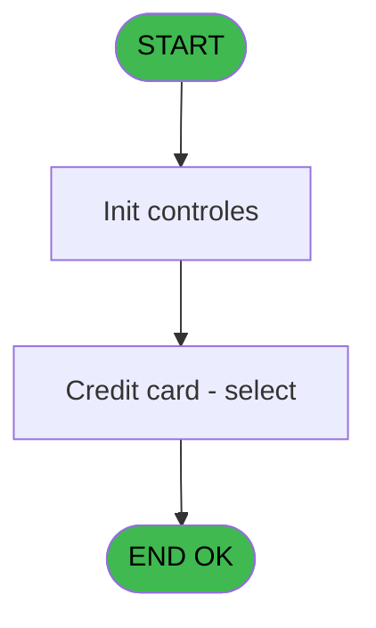
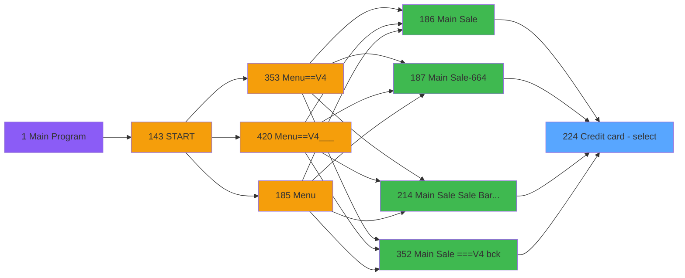

# PVE IDE 224 - Credit card - select

> **Analyse**: Phases 1-4 2026-02-03 19:01 -> 19:02 (17s) | Assemblage 19:02
> **Pipeline**: V7.2 Enrichi
> **Structure**: 4 onglets (Resume | Ecrans | Donnees | Connexions)

<!-- TAB:Resume -->

## 1. FICHE D'IDENTITE

| Attribut | Valeur |
|----------|--------|
| Projet | PVE |
| IDE Position | 224 |
| Nom Programme | Credit card - select |
| Fichier source | `Prg_224.xml` |
| Dossier IDE | Packages |
| Taches | 3 (1 ecrans visibles) |
| Tables modifiees | 0 |
| Programmes appeles | 0 |

## 2. DESCRIPTION FONCTIONNELLE

**Credit card - select** assure la gestion complete de ce processus, accessible depuis [Main Sale ===V4 (IDE 0)](PVE-IDE-0.md), [Main Sale (IDE 186)](PVE-IDE-186.md), [Main Sale-664 (IDE 187)](PVE-IDE-187.md), [Main Sale Sale Bar Code (IDE 214)](PVE-IDE-214.md), [Main Sale ===V4 bck (IDE 352)](PVE-IDE-352.md), [Main Sale ===V4 (IDE 354)](PVE-IDE-354.md), [Main Sale ===V4 (IDE 359)](PVE-IDE-359.md), [Main Sale (IDE 363)](PVE-IDE-363.md), [Main Sale-664 (IDE 364)](PVE-IDE-364.md), [Menu Main (TPE) (IDE 403)](PVE-IDE-403.md), [Main Sale ===V4 (IDE 409)](PVE-IDE-409.md), [Main Sale ===V4 (IDE 415)](PVE-IDE-415.md), [Main Sale ===V4 Booking ACTUEL (IDE 417)](PVE-IDE-417.md), [Main Sale (IDE 440)](PVE-IDE-440.md).

Le flux de traitement s'organise en **2 blocs fonctionnels** :

- **Traitement** (2 taches) : traitements metier divers
- **Consultation** (1 tache) : ecrans de recherche, selection et consultation

Detail : phases du traitement

#### Phase 1 : Consultation (1 tache)

- **224** - Credit card - select **[[ECRAN]](#ecran-t1)**

#### Phase 2 : Traitement (2 taches)

- **224.1** - Payment **[[ECRAN]](#ecran-t2)**
- **224.2** - Payment **[[ECRAN]](#ecran-t3)**

## 3. BLOCS FONCTIONNELS

### 3.1 Consultation (1 tache)

Ecrans de recherche et consultation.

---

#### 224 - Credit card - select [[ECRAN]](#ecran-t1)

**Role** : Calcul fidelite/avantage : Credit card - select.
**Ecran** : 471 x 334 DLU (MDI) | [Voir mockup](#ecran-t1)
**Variables liees** : B (param type card)

### 3.2 Traitement (2 taches)

Traitements internes.

---

#### 224.1 - Payment [[ECRAN]](#ecran-t2)

**Role** : Traitement : Payment.
**Ecran** : 471 x 334 DLU (MDI) | [Voir mockup](#ecran-t2)

---

#### 224.2 - Payment [[ECRAN]](#ecran-t3)

**Role** : Traitement : Payment.
**Ecran** : 473 x 335 DLU (MDI) | [Voir mockup](#ecran-t3)

## 5. REGLES METIER

*(Aucune regle metier identifiee)*

## 6. CONTEXTE

- **Appele par**: [Main Sale ===V4 (IDE 0)](PVE-IDE-0.md), [Main Sale (IDE 186)](PVE-IDE-186.md), [Main Sale-664 (IDE 187)](PVE-IDE-187.md), [Main Sale Sale Bar Code (IDE 214)](PVE-IDE-214.md), [Main Sale ===V4 bck (IDE 352)](PVE-IDE-352.md), [Main Sale ===V4 (IDE 354)](PVE-IDE-354.md), [Main Sale ===V4 (IDE 359)](PVE-IDE-359.md), [Main Sale (IDE 363)](PVE-IDE-363.md), [Main Sale-664 (IDE 364)](PVE-IDE-364.md), [Menu Main (TPE) (IDE 403)](PVE-IDE-403.md), [Main Sale ===V4 (IDE 409)](PVE-IDE-409.md), [Main Sale ===V4 (IDE 415)](PVE-IDE-415.md), [Main Sale ===V4 Booking ACTUEL (IDE 417)](PVE-IDE-417.md), [Main Sale (IDE 440)](PVE-IDE-440.md)
- **Appelle**: 0 programmes | **Tables**: 2 (W:0 R:2 L:0) | **Taches**: 3 | **Expressions**: 4

<!-- TAB:Ecrans -->

## 8. ECRANS

### 8.1 Forms visibles (1 / 3)

| # | Position | Tache | Nom | Type | Largeur | Hauteur | Bloc |
|---|----------|-------|-----|------|---------|---------|------|
| 1 | 224.2 | 224.2 | Payment | MDI | 473 | 335 | Traitement |

### 8.2 Mockups Ecrans

---

#### 224.2 - Payment
**Tache** : [224.2](#t3) | **Type** : MDI | **Dimensions** : 473 x 335 DLU
**Bloc** : Traitement | **Titre IDE** : Payment

<!-- FORM-DATA:
{
    "width":  473,
    "vFactor":  8,
    "type":  "MDI",
    "hFactor":  4,
    "controls":  [
                     {
                         "x":  0,
                         "type":  "label",
                         "var":  "",
                         "y":  0,
                         "w":  471,
                         "fmt":  "",
                         "name":  "",
                         "h":  42,
                         "color":  "182",
                         "text":  "",
                         "parent":  null
                     },
                     {
                         "x":  16,
                         "type":  "label",
                         "var":  "",
                         "y":  15,
                         "w":  367,
                         "fmt":  "",
                         "name":  "",
                         "h":  10,
                         "color":  "186",
                         "text":  "Select the type of card for this sale",
                         "parent":  2
                     },
                     {
                         "x":  25,
                         "type":  "label",
                         "var":  "",
                         "y":  47,
                         "w":  423,
                         "fmt":  "",
                         "name":  "",
                         "h":  52,
                         "color":  "183",
                         "text":  "Person paying",
                         "parent":  null
                     },
                     {
                         "x":  37,
                         "type":  "label",
                         "var":  "",
                         "y":  64,
                         "w":  253,
                         "fmt":  "",
                         "name":  "",
                         "h":  28,
                         "color":  "189",
                         "text":  "",
                         "parent":  5
                     },
                     {
                         "x":  25,
                         "type":  "label",
                         "var":  "",
                         "y":  109,
                         "w":  423,
                         "fmt":  "",
                         "name":  "",
                         "h":  183,
                         "color":  "183",
                         "text":  "Type of card",
                         "parent":  null
                     },
                     {
                         "x":  215,
                         "type":  "table",
                         "var":  "",
                         "name":  "",
                         "titleH":  12,
                         "color":  "110",
                         "w":  159,
                         "y":  133,
                         "fmt":  "",
                         "parent":  null,
                         "text":  "",
                         "rowH":  28,
                         "h":  142,
                         "cols":  [
                                      {
                                          "title":  "",
                                          "layer":  1,
                                          "w":  155
                                      }
                                  ],
                         "rows":  1
                     },
                     {
                         "x":  0,
                         "type":  "label",
                         "var":  "",
                         "y":  300,
                         "w":  471,
                         "fmt":  "",
                         "name":  "",
                         "h":  34,
                         "color":  "6",
                         "text":  "",
                         "parent":  null
                     },
                     {
                         "x":  216,
                         "type":  "button",
                         "var":  "",
                         "y":  134,
                         "w":  154,
                         "fmt":  "",
                         "name":  "PAYMENT",
                         "h":  28,
                         "color":  "",
                         "text":  "",
                         "parent":  9
                     },
                     {
                         "x":  41,
                         "type":  "edit",
                         "var":  "",
                         "y":  67,
                         "w":  245,
                         "fmt":  "30",
                         "name":  "",
                         "h":  21,
                         "color":  "191",
                         "text":  "",
                         "parent":  5
                     },
                     {
                         "x":  57,
                         "type":  "image",
                         "var":  "",
                         "y":  134,
                         "w":  82,
                         "fmt":  "",
                         "name":  "",
                         "h":  44,
                         "color":  "",
                         "text":  "",
                         "parent":  null
                     },
                     {
                         "x":  371,
                         "type":  "button",
                         "var":  "",
                         "y":  134,
                         "w":  52,
                         "fmt":  "ñ",
                         "name":  "",
                         "h":  72,
                         "color":  "",
                         "text":  "",
                         "parent":  null
                     },
                     {
                         "x":  371,
                         "type":  "button",
                         "var":  "",
                         "y":  205,
                         "w":  52,
                         "fmt":  "ò",
                         "name":  "",
                         "h":  71,
                         "color":  "",
                         "text":  "",
                         "parent":  null
                     },
                     {
                         "x":  393,
                         "type":  "button",
                         "var":  "",
                         "y":  305,
                         "w":  77,
                         "fmt":  "\u0026Cancel",
                         "name":  "",
                         "h":  28,
                         "color":  "",
                         "text":  "",
                         "parent":  null
                     },
                     {
                         "x":  422,
                         "type":  "image",
                         "var":  "",
                         "y":  4,
                         "w":  48,
                         "fmt":  "",
                         "name":  "",
                         "h":  37,
                         "color":  "",
                         "text":  "",
                         "parent":  2
                     }
                 ],
    "taskId":  "224.2",
    "height":  335
}
-->

<strong>Champs : 1 champs</strong>

| Pos (x,y) | Nom | Variable | Type |
|-----------|-----|----------|------|
| 41,67 | 30 | - | edit |

<strong>Boutons : 4 boutons</strong>

| Bouton | Pos (x,y) | Action |
|--------|-----------|--------|
| PAYMENT | 216,134 | Bouton fonctionnel |
| ñ | 371,134 | Bouton fonctionnel |
| ò | 371,205 | Bouton fonctionnel |
| Cancel | 393,305 | Annule et retour au menu |

## 9. NAVIGATION

Ecran unique: **Payment**

### 9.3 Structure hierarchique (3 taches)

| Position | Tache | Type | Dimensions | Bloc |
|----------|-------|------|------------|------|
| **224.1** | [**Credit card - select** (224)](#t1) [mockup](#ecran-t1) | MDI | 471x334 | Consultation |
| **224.2** | [**Payment** (224.1)](#t2) [mockup](#ecran-t2) | MDI | 471x334 | Traitement |
| 224.2.1 | [Payment (224.2)](#t3) [mockup](#ecran-t3) | MDI | 473x335 | |

### 9.4 Algorigramme

> **Legende**: Vert = START/END OK | Rouge = END KO | Bleu = Decisions
> *Algorigramme auto-genere. Utiliser `/algorigramme` pour une synthese metier detaillee.*

<!-- TAB:Donnees -->

## 10. TABLES

### Tables utilisees (2)

| ID | Nom | Description | Type | R | W | L | Usages |
|----|-----|-------------|------|---|---|---|--------|
| 89 | moyen_paiement___mop |  | DB | R |   |   | 1 |
| 382 | pv_discount_reasons |  | DB | R |   |   | 1 |

### Colonnes par table (0 / 2 tables avec colonnes identifiees)

Table 89 - moyen_paiement___mop (R) - 1 usages

*Table utilisee uniquement en Link ou aucune colonne Real identifiee dans le DataView.*

Table 382 - pv_discount_reasons (R) - 1 usages

*Table utilisee uniquement en Link ou aucune colonne Real identifiee dans le DataView.*

## 11. VARIABLES

### 11.1 Variables de session (3)

Variables persistantes pendant toute la session.

| Lettre | Nom | Type | Usage dans |
|--------|-----|------|-----------|
| C | v nom | Alpha | 1x session |
| D | v prenom | Alpha | 1x session |
| E | v societe | Alpha | - |

### 11.2 Autres (2)

Variables diverses.

| Lettre | Nom | Type | Usage dans |
|--------|-----|------|-----------|
| A | param Xtrack id payer | Numeric | - |
| B | param type card | Alpha | [224](#t1) |

## 12. EXPRESSIONS

**4 / 4 expressions decodees (100%)**

### 12.1 Repartition par type

| Type | Expressions | Regles |
|------|-------------|--------|
| OTHER | 4 | 0 |

### 12.2 Expressions cles par type

#### OTHER (4 expressions)

| Type | IDE | Expression | Regle |
|------|-----|------------|-------|
| OTHER | 3 | `v nom [C]` | - |
| OTHER | 4 | `v prenom [D]` | - |
| OTHER | 1 | `{1,1}` | - |
| OTHER | 2 | `param type card [B]` | - |

<!-- TAB:Connexions -->

## 13. GRAPHE D'APPELS

### 13.1 Chaine depuis Main (Callers)

Main -> ... -> [Main Sale ===V4 (IDE 0)](PVE-IDE-0.md) -> **Credit card - select (IDE 224)**

Main -> ... -> [Main Sale (IDE 186)](PVE-IDE-186.md) -> **Credit card - select (IDE 224)**

Main -> ... -> [Main Sale-664 (IDE 187)](PVE-IDE-187.md) -> **Credit card - select (IDE 224)**

Main -> ... -> [Main Sale Sale Bar Code (IDE 214)](PVE-IDE-214.md) -> **Credit card - select (IDE 224)**

Main -> ... -> [Main Sale ===V4 bck (IDE 352)](PVE-IDE-352.md) -> **Credit card - select (IDE 224)**

Main -> ... -> [Main Sale ===V4 (IDE 354)](PVE-IDE-354.md) -> **Credit card - select (IDE 224)**

Main -> ... -> [Main Sale ===V4 (IDE 359)](PVE-IDE-359.md) -> **Credit card - select (IDE 224)**

Main -> ... -> [Main Sale (IDE 363)](PVE-IDE-363.md) -> **Credit card - select (IDE 224)**

Main -> ... -> [Main Sale-664 (IDE 364)](PVE-IDE-364.md) -> **Credit card - select (IDE 224)**

Main -> ... -> [Menu Main (TPE) (IDE 403)](PVE-IDE-403.md) -> **Credit card - select (IDE 224)**

Main -> ... -> [Main Sale ===V4 (IDE 409)](PVE-IDE-409.md) -> **Credit card - select (IDE 224)**

Main -> ... -> [Main Sale ===V4 (IDE 415)](PVE-IDE-415.md) -> **Credit card - select (IDE 224)**

Main -> ... -> [Main Sale ===V4 Booking ACTUEL (IDE 417)](PVE-IDE-417.md) -> **Credit card - select (IDE 224)**

Main -> ... -> [Main Sale (IDE 440)](PVE-IDE-440.md) -> **Credit card - select (IDE 224)**

### 13.2 Callers

| IDE | Nom Programme | Nb Appels |
|-----|---------------|-----------|
| [0](PVE-IDE-0.md) | Main Sale ===V4 | 1 |
| [186](PVE-IDE-186.md) | Main Sale | 1 |
| [187](PVE-IDE-187.md) | Main Sale-664 | 1 |
| [214](PVE-IDE-214.md) | Main Sale Sale Bar Code | 1 |
| [352](PVE-IDE-352.md) | Main Sale ===V4 bck | 1 |
| [354](PVE-IDE-354.md) | Main Sale ===V4 | 1 |
| [359](PVE-IDE-359.md) | Main Sale ===V4 | 1 |
| [363](PVE-IDE-363.md) | Main Sale | 1 |
| [364](PVE-IDE-364.md) | Main Sale-664 | 1 |
| [403](PVE-IDE-403.md) | Menu Main (TPE) | 1 |
| [409](PVE-IDE-409.md) | Main Sale ===V4 | 1 |
| [415](PVE-IDE-415.md) | Main Sale ===V4 | 1 |
| [417](PVE-IDE-417.md) | Main Sale ===V4 Booking ACTUEL | 1 |
| [440](PVE-IDE-440.md) | Main Sale | 1 |

### 13.3 Callees (programmes appeles)

### 13.4 Detail Callees avec contexte

| IDE | Nom Programme | Appels | Contexte |
|-----|---------------|--------|----------|
| - | (aucun) | - | - |

## 14. RECOMMANDATIONS MIGRATION

### 14.1 Profil du programme

| Metrique | Valeur | Impact migration |
|----------|--------|-----------------|
| Lignes de logique | 25 | Programme compact |
| Expressions | 4 | Peu de logique |
| Tables WRITE | 0 | Impact faible |
| Sous-programmes | 0 | Peu de dependances |
| Ecrans visibles | 1 | Ecran unique ou traitement batch |
| Code desactive | 0% (0 / 25) | Code sain |
| Regles metier | 0 | Pas de regle identifiee |

### 14.2 Plan de migration par bloc

#### Consultation (1 tache: 1 ecran, 0 traitement)

- **Strategie** : Composants de recherche/selection en modales.
- 1 ecran : Credit card - select

#### Traitement (2 taches: 2 ecrans, 0 traitement)

- **Strategie** : 2 composant(s) UI (Razor/React) avec formulaires et validation.
- Decomposer les taches en services unitaires testables.

### 14.3 Dependances critiques

| Dependance | Type | Appels | Impact |
|------------|------|--------|--------|

---
*Spec DETAILED generee par Pipeline V7.2 - 2026-02-03 19:02*
