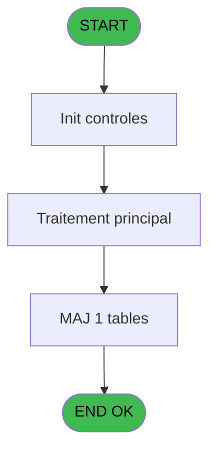
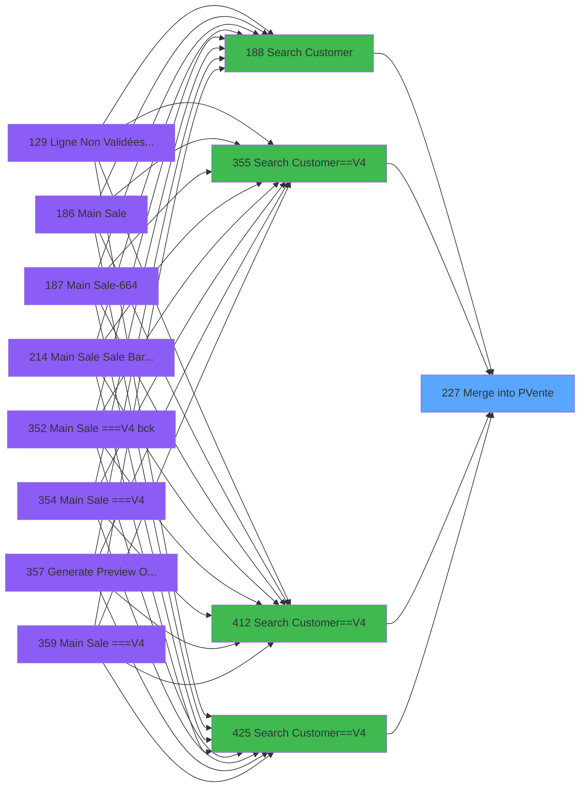
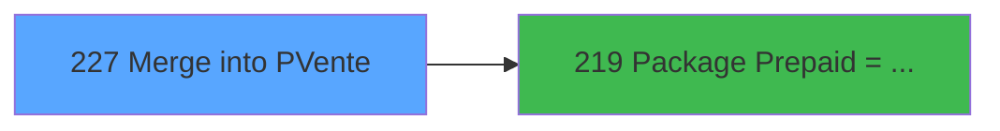

# PVE IDE 227 - Merge into PVente

> **Analyse**: Phases 1-4 2026-02-03 19:03 -> 19:03 (16s) | Assemblage 19:03
> **Pipeline**: V7.2 Enrichi
> **Structure**: 4 onglets (Resume | Ecrans | Donnees | Connexions)

<!-- TAB:Resume -->

## 1. FICHE D'IDENTITE

| Attribut | Valeur |
|----------|--------|
| Projet | PVE |
| IDE Position | 227 |
| Nom Programme | Merge into PVente |
| Fichier source | `Prg_227.xml` |
| Dossier IDE | Packages |
| Taches | 8 (0 ecrans visibles) |
| Tables modifiees | 1 |
| Programmes appeles | 1 |

## 2. DESCRIPTION FONCTIONNELLE

**Merge into PVente** assure la gestion complete de ce processus, accessible depuis [Search Customer (IDE 188)](PVE-IDE-188.md), [Search Customer==V4 (IDE 355)](PVE-IDE-355.md), [Search Customer==V4 (IDE 412)](PVE-IDE-412.md), [Search Customer==V4 (IDE 425)](PVE-IDE-425.md).

Le flux de traitement s'organise en **5 blocs fonctionnels** :

- **Traitement** (4 taches) : traitements metier divers
- **Initialisation** (1 tache) : reinitialisation d'etats et de variables de travail
- **Creation** (1 tache) : insertion d'enregistrements en base (mouvements, prestations)
- **Consultation** (1 tache) : ecrans de recherche, selection et consultation
- **Saisie** (1 tache) : ecrans de saisie utilisateur (formulaires, champs, donnees)

**Donnees modifiees** : 1 tables en ecriture (pv_discount_reasons).

Detail : phases du traitement

#### Phase 1 : Saisie (1 tache)

- **227** - Merge into PVente

#### Phase 2 : Consultation (1 tache)

- **227.1** - Select Customer

#### Phase 3 : Traitement (4 taches)

- **227.1.1** - send to package
- **227.1.1.1** - send to package
- **227.3** - Get max xcustid
- **227.1.2** - aaaa

Delegue a : [Package Prepaid => account (IDE 219)](PVE-IDE-219.md)

#### Phase 4 : Initialisation (1 tache)

- **227.2** - Init from Easy Arrival

#### Phase 5 : Creation (1 tache)

- **227.4** - Create pv customer

#### Tables impactees

| Table | Operations | Role metier |
|-------|-----------|-------------|
| pv_discount_reasons | R/**W**/L (4 usages) |  |

## 3. BLOCS FONCTIONNELS

### 3.1 Saisie (1 tache)

Ce bloc traite la saisie des donnees de la transaction.

---

#### 227 - Merge into PVente

**Role** : Saisie des donnees : Merge into PVente.

### 3.2 Consultation (1 tache)

Ecrans de recherche et consultation.

---

#### 227.1 - Select Customer

**Role** : Traitement : Select Customer.
**Variables liees** : D (P.i.o.Customer Id)

### 3.3 Traitement (4 taches)

Traitements internes.

---

#### 227.1.1 - send to package

**Role** : Traitement : send to package.
**Delegue a** : [Package Prepaid => account (IDE 219)](PVE-IDE-219.md)

---

#### 227.1.1.1 - send to package

**Role** : Traitement : send to package.
**Delegue a** : [Package Prepaid => account (IDE 219)](PVE-IDE-219.md)

---

#### 227.3 - Get max xcustid

**Role** : Consultation/chargement : Get max xcustid.
**Delegue a** : [Package Prepaid => account (IDE 219)](PVE-IDE-219.md)

---

#### 227.1.2 - aaaa

**Role** : Traitement : aaaa.
**Delegue a** : [Package Prepaid => account (IDE 219)](PVE-IDE-219.md)

### 3.4 Initialisation (1 tache)

Reinitialisation d'etats et variables de travail.

---

#### 227.2 - Init from Easy Arrival

**Role** : Reinitialisation : Init from Easy Arrival.

### 3.5 Creation (1 tache)

Insertion de nouveaux enregistrements en base.

---

#### 227.4 - Create pv customer

**Role** : Traitement : Create pv customer.
**Variables liees** : D (P.i.o.Customer Id)

## 5. REGLES METIER

*(Aucune regle metier identifiee)*

## 6. CONTEXTE

- **Appele par**: [Search Customer (IDE 188)](PVE-IDE-188.md), [Search Customer==V4 (IDE 355)](PVE-IDE-355.md), [Search Customer==V4 (IDE 412)](PVE-IDE-412.md), [Search Customer==V4 (IDE 425)](PVE-IDE-425.md)
- **Appelle**: 1 programmes | **Tables**: 11 (W:1 R:4 L:8) | **Taches**: 8 | **Expressions**: 19

<!-- TAB:Ecrans -->

## 8. ECRANS

*(Programme sans ecran visible)*

## 9. NAVIGATION

### 9.3 Structure hierarchique (8 taches)

| Position | Tache | Type | Dimensions | Bloc |
|----------|-------|------|------------|------|
| **227.1** | [**Merge into PVente** (227)](#t1) | MDI | - | Saisie |
| **227.2** | [**Select Customer** (227.1)](#t2) | MDI | - | Consultation |
| **227.3** | [**send to package** (227.1.1)](#t3) | MDI | - | Traitement |
| 227.3.1 | [send to package (227.1.1.1)](#t4) | MDI | - | |
| 227.3.2 | [Get max xcustid (227.3)](#t6) | - | - | |
| 227.3.3 | [aaaa (227.1.2)](#t7) | - | - | |
| **227.4** | [**Init from Easy Arrival** (227.2)](#t5) | - | - | Initialisation |
| **227.5** | [**Create pv customer** (227.4)](#t8) | - | - | Creation |

### 9.4 Algorigramme

> **Legende**: Vert = START/END OK | Rouge = END KO | Bleu = Decisions
> *Algorigramme auto-genere. Utiliser `/algorigramme` pour une synthese metier detaillee.*

<!-- TAB:Donnees -->

## 10. TABLES

### Tables utilisees (11)

| ID | Nom | Description | Type | R | W | L | Usages |
|----|-----|-------------|------|---|---|---|--------|
| 30 | gm-recherche_____gmr | Index de recherche | DB | R |   |   | 1 |
| 31 | gm-complet_______gmc |  | DB |   |   | L | 1 |
| 33 | prestations______pre | Prestations/services vendus | DB | R |   |   | 1 |
| 382 | pv_discount_reasons |  | DB | R | **W** | L | 4 |
| 391 | pv_invoicehistoheader | Historique / journal | DB |   |   | L | 1 |
| 400 | pv_cust_rentals |  | DB | R |   |   | 1 |
| 402 | pv_sboarder_types |  | DB |   |   | L | 1 |
| 413 | pv_tva |  | DB |   |   | L | 1 |
| 421 | req_location |  | DB |   |   | L | 1 |
| 805 | vente_par_moyen_paiement | Donnees de ventes | DB |   |   | L | 1 |
| 1620 | Table_1620 |  | MEM |   |   | L | 1 |

### Colonnes par table (2 / 4 tables avec colonnes identifiees)

Table 30 - gm-recherche_____gmr (R) - 1 usages

| Lettre | Variable | Acces | Type |
|--------|----------|-------|------|
| A | P.i.Societe | R | Alpha |
| B | P.i.Compte | R | Numeric |
| C | P.i.Filiation | R | Numeric |
| D | P.i.o.Customer Id | R | Numeric |
| E | P.i.Avec message | R | Logical |
| F | P.i.Toutes les filiations ? | R | Logical |
| G | P.i.Code Fidelisation | R | Alpha |
| H | L Point of Sale | R | Logical |
| I | Duree Sejour | R | Numeric |
| J | v.xcust id | R | Numeric |

Table 33 - prestations______pre (R) - 1 usages

*Table utilisee uniquement en Link ou aucune colonne Real identifiee dans le DataView.*

Table 382 - pv_discount_reasons (R/**W**/L) - 4 usages

*Table utilisee uniquement en Link ou aucune colonne Real identifiee dans le DataView.*

Table 400 - pv_cust_rentals (R) - 1 usages

| Lettre | Variable | Acces | Type |
|--------|----------|-------|------|
| D | P.i.o.Customer Id | R | Numeric |
| J | v.xcust id | R | Numeric |

## 11. VARIABLES

### 11.1 Parametres entrants (7)

Variables recues du programme appelant ([Search Customer (IDE 188)](PVE-IDE-188.md)).

| Lettre | Nom | Type | Usage dans |
|--------|-----|------|-----------|
| A | P.i.Societe | Alpha | 1x parametre entrant |
| B | P.i.Compte | Numeric | 1x parametre entrant |
| C | P.i.Filiation | Numeric | 2x parametre entrant |
| D | P.i.o.Customer Id | Numeric | - |
| E | P.i.Avec message | Logical | - |
| F | P.i.Toutes les filiations ? | Logical | - |
| G | P.i.Code Fidelisation | Alpha | - |

### 11.2 Variables de session (1)

Variables persistantes pendant toute la session.

| Lettre | Nom | Type | Usage dans |
|--------|-----|------|-----------|
| J | v.xcust id | Numeric | 1x session |

### 11.3 Autres (2)

Variables diverses.

| Lettre | Nom | Type | Usage dans |
|--------|-----|------|-----------|
| H | L Point of Sale | Logical | 1x refs |
| I | Duree Sejour | Numeric | 1x refs |

## 12. EXPRESSIONS

**19 / 19 expressions decodees (100%)**

### 12.1 Repartition par type

| Type | Expressions | Regles |
|------|-------------|--------|
| CALCULATION | 1 | 0 |
| CONDITION | 3 | 0 |
| OTHER | 13 | 0 |
| NEGATION | 1 | 0 |
| REFERENCE_VG | 1 | 0 |

### 12.2 Expressions cles par type

#### CALCULATION (1 expressions)

| Type | IDE | Expression | Regle |
|------|-----|------------|-------|
| CALCULATION | 16 | `[N]-[M]` | - |

#### CONDITION (3 expressions)

| Type | IDE | Expression | Regle |
|------|-----|------------|-------|
| CONDITION | 1 | `P.i.Filiation [C]=[K]` | - |
| CONDITION | 19 | `[N]>=Date()` | - |
| CONDITION | 18 | `NOT(IsComponent()) AND [N]-[M]>1 AND [AD]<>'O'` | - |

#### OTHER (13 expressions)

| Type | IDE | Expression | Regle |
|------|-----|------------|-------|
| OTHER | 12 | `[K]` | - |
| OTHER | 11 | `v.xcust id [J]` | - |
| OTHER | 10 | `Duree Sejour [I]` | - |
| OTHER | 15 | `CndRange(NOT P.i.Toutes les filiati... [F],P.i.Filiation [C])` | - |
| OTHER | 14 | `SetCrsr (1)` | - |
| ... | | *+8 autres* | |

#### NEGATION (1 expressions)

| Type | IDE | Expression | Regle |
|------|-----|------------|-------|
| NEGATION | 7 | `NOT (L Point of Sale [H])` | - |

#### REFERENCE_VG (1 expressions)

| Type | IDE | Expression | Regle |
|------|-----|------------|-------|
| REFERENCE_VG | 17 | `VG44` | - |

<!-- TAB:Connexions -->

## 13. GRAPHE D'APPELS

### 13.1 Chaine depuis Main (Callers)

Main -> ... -> [Search Customer (IDE 188)](PVE-IDE-188.md) -> **Merge into PVente (IDE 227)**

Main -> ... -> [Search Customer==V4 (IDE 355)](PVE-IDE-355.md) -> **Merge into PVente (IDE 227)**

Main -> ... -> [Search Customer==V4 (IDE 412)](PVE-IDE-412.md) -> **Merge into PVente (IDE 227)**

Main -> ... -> [Search Customer==V4 (IDE 425)](PVE-IDE-425.md) -> **Merge into PVente (IDE 227)**

### 13.2 Callers

| IDE | Nom Programme | Nb Appels |
|-----|---------------|-----------|
| [188](PVE-IDE-188.md) | Search Customer | 2 |
| [355](PVE-IDE-355.md) | Search Customer==V4 | 1 |
| [412](PVE-IDE-412.md) | Search Customer==V4 | 1 |
| [425](PVE-IDE-425.md) | Search Customer==V4 | 1 |

### 13.3 Callees (programmes appeles)

### 13.4 Detail Callees avec contexte

| IDE | Nom Programme | Appels | Contexte |
|-----|---------------|--------|----------|
| [219](PVE-IDE-219.md) | Package Prepaid => account | 1 | Sous-programme |

## 14. RECOMMANDATIONS MIGRATION

### 14.1 Profil du programme

| Metrique | Valeur | Impact migration |
|----------|--------|-----------------|
| Lignes de logique | 153 | Programme compact |
| Expressions | 19 | Peu de logique |
| Tables WRITE | 1 | Impact faible |
| Sous-programmes | 1 | Peu de dependances |
| Ecrans visibles | 0 | Ecran unique ou traitement batch |
| Code desactive | 1.3% (2 / 153) | Code sain |
| Regles metier | 0 | Pas de regle identifiee |

### 14.2 Plan de migration par bloc

#### Saisie (1 tache: 0 ecran, 1 traitement)

- **Strategie** : Formulaire React/Blazor avec validation Zod/FluentValidation.
- Validation temps reel cote client + serveur

#### Consultation (1 tache: 0 ecran, 1 traitement)

- **Strategie** : Composants de recherche/selection en modales.

#### Traitement (4 taches: 0 ecran, 4 traitements)

- **Strategie** : 4 service(s) backend injectable(s) (Domain Services).
- 1 sous-programme(s) a migrer ou a reutiliser depuis les services existants.
- Decomposer les taches en services unitaires testables.

#### Initialisation (1 tache: 0 ecran, 1 traitement)

- **Strategie** : Constructeur/methode `InitAsync()` dans l'orchestrateur.

#### Creation (1 tache: 0 ecran, 1 traitement)

- **Strategie** : Repository pattern avec Entity Framework Core.
- Insertion via `IRepository<T>.CreateAsync()`

### 14.3 Dependances critiques

| Dependance | Type | Appels | Impact |
|------------|------|--------|--------|
| pv_discount_reasons | Table WRITE (Database) | 2x | Schema + repository |
| [Package Prepaid => account (IDE 219)](PVE-IDE-219.md) | Sous-programme | 1x | Normale - Sous-programme |

---
*Spec DETAILED generee par Pipeline V7.2 - 2026-02-03 19:03*
