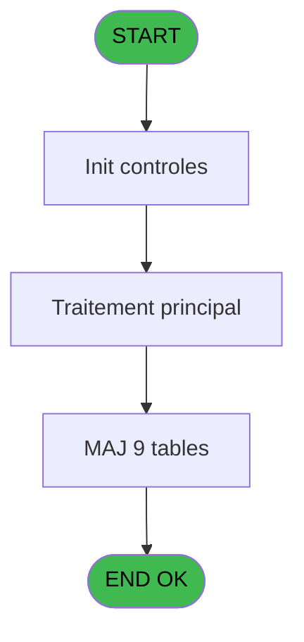
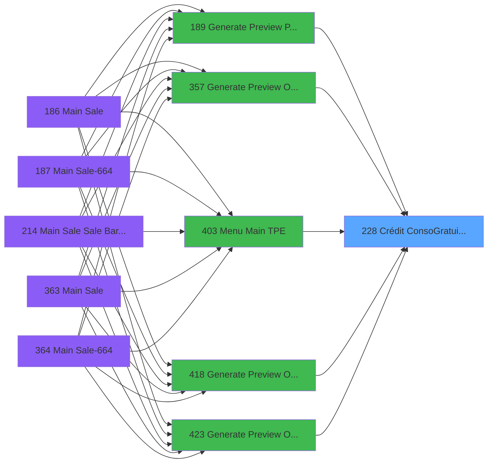

# PVE IDE 228 - Crédit Conso/Gratuité (BAR)

> **Analyse**: Phases 1-4 2026-02-03 19:03 -> 19:03 (17s) | Assemblage 19:03
> **Pipeline**: V7.2 Enrichi
> **Structure**: 4 onglets (Resume | Ecrans | Donnees | Connexions)

<!-- TAB:Resume -->

## 1. FICHE D'IDENTITE

| Attribut | Valeur |
|----------|--------|
| Projet | PVE |
| IDE Position | 228 |
| Nom Programme | Crédit Conso/Gratuité (BAR) |
| Fichier source | `Prg_228.xml` |
| Dossier IDE | Packages |
| Taches | 17 (0 ecrans visibles) |
| Tables modifiees | 9 |
| Programmes appeles | 0 |

## 2. DESCRIPTION FONCTIONNELLE

**Crédit Conso/Gratuité (BAR)** assure la gestion complete de ce processus, accessible depuis [Generate Preview OD==V4 (IDE 357)](PVE-IDE-357.md), [Menu Main (TPE) (IDE 403)](PVE-IDE-403.md), [Generate Preview OD==LEX Book (IDE 418)](PVE-IDE-418.md), [Generate Preview OD==V4 (IDE 423)](PVE-IDE-423.md), [Generate Preview OD==LEX (IDE 424)](PVE-IDE-424.md), [Generate Preview Payments (IDE 441)](PVE-IDE-441.md), [Generate Preview Payments (IDE 189)](PVE-IDE-189.md), [Generate Preview Payments 1212 (IDE 434)](PVE-IDE-434.md), [Generate Preview Payments 1112 (IDE 435)](PVE-IDE-435.md), [Generate Preview Payments 1012 (IDE 436)](PVE-IDE-436.md), [Generate Preview Payment 1212E (IDE 437)](PVE-IDE-437.md).

Le flux de traitement s'organise en **4 blocs fonctionnels** :

- **Traitement** (12 taches) : traitements metier divers
- **Saisie** (2 taches) : ecrans de saisie utilisateur (formulaires, champs, donnees)
- **Calcul** (2 taches) : calculs de montants, stocks ou compteurs
- **Consultation** (1 tache) : ecrans de recherche, selection et consultation

**Donnees modifiees** : 9 tables en ecriture (comptable_gratuite, comptable________cte, compte_gm________cgm, intermed__gratuititg, intermed_compta__ite, cc_total_par_type, cc_total, pv_inv_stock, Table_1567).

Detail : phases du traitement

#### Phase 1 : Traitement (12 taches)

- **228** - Credit Conso ./ Gratuité **[[ECRAN]](#ecran-t1)**
- **228.1** - Credit Conso > 0 **[[ECRAN]](#ecran-t2)**
- **228.2** - Credit Conso < 0 **[[ECRAN]](#ecran-t4)**
- **228.2.2** - cummul annul **[[ECRAN]](#ecran-t6)**
- **228.2.3** - update CC type
- **228.4** - Gratuity hors cloture
- **228.5** - Gratuity cloture en cours
- **228.6** - CC hors cloture v2
- **228.7** - CC hors cloture T2H
- **228.10** - CC cloture
- **228.11** - Maj CC Gift Pass
- **228.12** - Maj Resort Credit Solde

#### Phase 2 : Calcul (2 taches)

- **228.1.1** - Stocke CC
- **228.2.1** - Stocke CC

#### Phase 3 : Consultation (1 tache)

- **228.3** - Recherche gratuité

#### Phase 4 : Saisie (2 taches)

- **228.8** - Vente hors cloture v2
- **228.9** - Vente hors cloture T2H

#### Tables impactees

| Table | Operations | Role metier |
|-------|-----------|-------------|
| cc_total_par_type | **W**/L (3 usages) |  |
| cc_total | **W**/L (3 usages) |  |
| comptable________cte | **W** (2 usages) |  |
| pv_inv_stock | **W** (2 usages) | Articles et stock |
| compte_gm________cgm | **W** (2 usages) | Comptes GM (generaux) |
| intermed_compta__ite | **W** (1 usages) |  |
| intermed__gratuititg | **W** (1 usages) |  |
| comptable_gratuite | **W** (1 usages) |  |
| Table_1567 | **W** (1 usages) |  |

## 3. BLOCS FONCTIONNELS

### 3.1 Traitement (12 taches)

Traitements internes.

---

#### 228 - Credit Conso ./ Gratuité [[ECRAN]](#ecran-t1)

**Role** : Tache d'orchestration : point d'entree du programme (12 sous-taches). Coordonne l'enchainement des traitements.
**Ecran** : 1112 x 561 DLU (MDI) | [Voir mockup](#ecran-t1)

11 sous-taches directes

| Tache | Nom | Bloc |
|-------|-----|------|
| [228.1](#t2) | Credit Conso > 0 **[[ECRAN]](#ecran-t2)** | Traitement |
| [228.2](#t4) | Credit Conso < 0 **[[ECRAN]](#ecran-t4)** | Traitement |
| [228.2.2](#t6) | cummul annul **[[ECRAN]](#ecran-t6)** | Traitement |
| [228.2.3](#t7) | update CC type | Traitement |
| [228.4](#t9) | Gratuity hors cloture | Traitement |
| [228.5](#t10) | Gratuity cloture en cours | Traitement |
| [228.6](#t11) | CC hors cloture v2 | Traitement |
| [228.7](#t12) | CC hors cloture T2H | Traitement |
| [228.10](#t15) | CC cloture | Traitement |
| [228.11](#t16) | Maj CC Gift Pass | Traitement |
| [228.12](#t18) | Maj Resort Credit Solde | Traitement |

**Variables liees** : L (P. Total CréditConso), R (P.Calcul Credit conso ?), BA (V Gratuité motif), Z (L Gratuité Bar ?)

---

#### 228.1 - Credit Conso > 0 [[ECRAN]](#ecran-t2)

**Role** : Calcul fidelite/avantage : Credit Conso > 0.
**Ecran** : 545 x 298 DLU (MDI) | [Voir mockup](#ecran-t2)
**Variables liees** : L (P. Total CréditConso), R (P.Calcul Credit conso ?)

---

#### 228.2 - Credit Conso < 0 [[ECRAN]](#ecran-t4)

**Role** : Calcul fidelite/avantage : Credit Conso < 0.
**Ecran** : 527 x 344 DLU (MDI) | [Voir mockup](#ecran-t4)
**Variables liees** : L (P. Total CréditConso), R (P.Calcul Credit conso ?)

---

#### 228.2.2 - cummul annul [[ECRAN]](#ecran-t6)

**Role** : Traitement : cummul annul.
**Ecran** : 110 x 65 DLU (MDI) | [Voir mockup](#ecran-t6)

---

#### 228.2.3 - update CC type

**Role** : Traitement : update CC type.
**Variables liees** : G (P. Package Payment type), N (P.Action Type)

---

#### 228.4 - Gratuity hors cloture

**Role** : Traitement : Gratuity hors cloture.

---

#### 228.5 - Gratuity cloture en cours

**Role** : Traitement : Gratuity cloture en cours.
**Variables liees** : M (P. Clôture en cours)

---

#### 228.6 - CC hors cloture v2

**Role** : Traitement : CC hors cloture v2.

---

#### 228.7 - CC hors cloture T2H

**Role** : Traitement : CC hors cloture T2H.

---

#### 228.10 - CC cloture

**Role** : Traitement : CC cloture.

---

#### 228.11 - Maj CC Gift Pass

**Role** : Calcul fidelite/avantage : Maj CC Gift Pass.
**Variables liees** : S (P Gift Pass), T (P Montant Cancel Gift Pass), U (P Montant Gift Pass)

---

#### 228.12 - Maj Resort Credit Solde

**Role** : Consultation/chargement : Maj Resort Credit Solde.
**Variables liees** : R (P.Calcul Credit conso ?)

### 3.2 Calcul (2 taches)

Calculs metier : montants, stocks, compteurs.

---

#### 228.1.1 - Stocke CC

**Role** : Calcul : Stocke CC.

---

#### 228.2.1 - Stocke CC

**Role** : Calcul : Stocke CC.

### 3.3 Consultation (1 tache)

Ecrans de recherche et consultation.

---

#### 228.3 - Recherche gratuité

**Role** : Traitement : Recherche gratuité.
**Variables liees** : BA (V Gratuité motif), Z (L Gratuité Bar ?)

### 3.4 Saisie (2 taches)

Ce bloc traite la saisie des donnees de la transaction.

---

#### 228.8 - Vente hors cloture v2

**Role** : Saisie des donnees : Vente hors cloture v2.

---

#### 228.9 - Vente hors cloture T2H

**Role** : Saisie des donnees : Vente hors cloture T2H.

## 5. REGLES METIER

*(Aucune regle metier identifiee)*

## 6. CONTEXTE

- **Appele par**: [Generate Preview OD==V4 (IDE 357)](PVE-IDE-357.md), [Menu Main (TPE) (IDE 403)](PVE-IDE-403.md), [Generate Preview OD==LEX Book (IDE 418)](PVE-IDE-418.md), [Generate Preview OD==V4 (IDE 423)](PVE-IDE-423.md), [Generate Preview OD==LEX (IDE 424)](PVE-IDE-424.md), [Generate Preview Payments (IDE 441)](PVE-IDE-441.md), [Generate Preview Payments (IDE 189)](PVE-IDE-189.md), [Generate Preview Payments 1212 (IDE 434)](PVE-IDE-434.md), [Generate Preview Payments 1112 (IDE 435)](PVE-IDE-435.md), [Generate Preview Payments 1012 (IDE 436)](PVE-IDE-436.md), [Generate Preview Payment 1212E (IDE 437)](PVE-IDE-437.md)
- **Appelle**: 0 programmes | **Tables**: 19 (W:9 R:3 L:9) | **Taches**: 17 | **Expressions**: 39

<!-- TAB:Ecrans -->

## 8. ECRANS

*(Programme sans ecran visible)*

## 9. NAVIGATION

### 9.3 Structure hierarchique (17 taches)

| Position | Tache | Type | Dimensions | Bloc |
|----------|-------|------|------------|------|
| **228.1** | [**Credit Conso ./ Gratuité** (228)](#t1) [mockup](#ecran-t1) | MDI | 1112x561 | Traitement |
| 228.1.1 | [Credit Conso > 0 (228.1)](#t2) [mockup](#ecran-t2) | MDI | 545x298 | |
| 228.1.2 | [Credit Conso < 0 (228.2)](#t4) [mockup](#ecran-t4) | MDI | 527x344 | |
| 228.1.3 | [cummul annul (228.2.2)](#t6) [mockup](#ecran-t6) | MDI | 110x65 | |
| 228.1.4 | [update CC type (228.2.3)](#t7) | MDI | - | |
| 228.1.5 | [Gratuity hors cloture (228.4)](#t9) | MDI | - | |
| 228.1.6 | [Gratuity cloture en cours (228.5)](#t10) | MDI | - | |
| 228.1.7 | [CC hors cloture v2 (228.6)](#t11) | MDI | - | |
| 228.1.8 | [CC hors cloture T2H (228.7)](#t12) | MDI | - | |
| 228.1.9 | [CC cloture (228.10)](#t15) | MDI | - | |
| 228.1.10 | [Maj CC Gift Pass (228.11)](#t16) | - | - | |
| 228.1.11 | [Maj Resort Credit Solde (228.12)](#t18) | - | - | |
| **228.2** | [**Stocke CC** (228.1.1)](#t3) | - | - | Calcul |
| 228.2.1 | [Stocke CC (228.2.1)](#t5) | - | - | |
| **228.3** | [**Recherche gratuité** (228.3)](#t8) | MDI | - | Consultation |
| **228.4** | [**Vente hors cloture v2** (228.8)](#t13) | MDI | - | Saisie |
| 228.4.1 | [Vente hors cloture T2H (228.9)](#t14) | MDI | - | |

### 9.4 Algorigramme

> **Legende**: Vert = START/END OK | Rouge = END KO | Bleu = Decisions
> *Algorigramme auto-genere. Utiliser `/algorigramme` pour une synthese metier detaillee.*

<!-- TAB:Donnees -->

## 10. TABLES

### Tables utilisees (19)

| ID | Nom | Description | Type | R | W | L | Usages |
|----|-----|-------------|------|---|---|---|--------|
| 15 | transac_entete_bar |  | DB | R |   |   | 2 |
| 30 | gm-recherche_____gmr | Index de recherche | DB | R |   |   | 1 |
| 38 | comptable_gratuite |  | DB |   | **W** |   | 1 |
| 40 | comptable________cte |  | DB |   | **W** |   | 2 |
| 47 | compte_gm________cgm | Comptes GM (generaux) | DB |   | **W** |   | 2 |
| 77 | articles_________art | Articles et stock | DB |   |   | L | 1 |
| 79 | gratuites________gra |  | DB | R |   |   | 1 |
| 172 | intermed__gratuititg |  | DB |   | **W** |   | 1 |
| 173 | intermed_compta__ite |  | DB |   | **W** |   | 1 |
| 263 | vente | Donnees de ventes | DB |   |   | L | 2 |
| 268 | cc_total_par_type |  | DB |   | **W** | L | 3 |
| 271 | cc_total |  | DB |   | **W** | L | 3 |
| 272 | cc_type_detail |  | DB |   |   | L | 1 |
| 273 | cc_type |  | DB |   |   | L | 1 |
| 378 | pv_customer |  | DB |   |   | L | 2 |
| 400 | pv_cust_rentals |  | DB |   |   | L | 1 |
| 403 | pv_sellers |  | DB |   |   | L | 1 |
| 763 | pv_inv_stock | Articles et stock | DB |   | **W** |   | 2 |
| 1567 | Table_1567 |  | MEM |   | **W** |   | 1 |

### Colonnes par table (7 / 12 tables avec colonnes identifiees)

Table 15 - transac_entete_bar (R) - 2 usages

| Lettre | Variable | Acces | Type |
|--------|----------|-------|------|
| A | L Derniere vente ? | R | Logical |
| B | V Cumul annulation | R | Numeric |
| C | V Cumul annulation payant | R | Numeric |

Table 30 - gm-recherche_____gmr (R) - 1 usages

| Lettre | Variable | Acces | Type |
|--------|----------|-------|------|
| A | P. Societe | R | Alpha |
| B | P. Code GM | R | Numeric |
| C | P. Filiation | R | Numeric |
| D | P. Article #55 | R | Numeric |
| E | P. Package PoS Id | R | Numeric |
| F | P. Package OUT | R | Numeric |
| G | P. Package Payment type | R | Alpha |
| H | P. Package Date | R | Date |
| I | P. Package Time | R | Time |
| J | P. '' ou C ou G | R | Alpha |
| K | P. Total ticket (ligne) | R | Numeric |
| L | P. Total CréditConso | R | Numeric |
| M | P. Clôture en cours | R | Logical |
| N | P.Action Type | R | Alpha |
| O | P.Total CC | R | Numeric |
| P | P.Taux Tva | R | Numeric |
| Q | P.Montant Remisé | R | Numeric |
| R | P.Calcul Credit conso ? | R | Logical |
| S | P Gift Pass | R | Logical |
| T | P Montant Cancel Gift Pass | R | Numeric |
| U | P Montant Gift Pass | R | Numeric |
| V | P.i.Libellé | R | Unicode |
| W | P.i Libellé supp | R | Unicode |
| X | P.i.Libellé com v2 | R | Unicode |
| Y | P.i Libellé com v2 supp | R | Unicode |
| Z | L Gratuité Bar ? | R | Logical |
| BA | V Gratuité motif | R | Alpha |
| BB | V Imputation | R | Numeric |
| BC | V S/Imputation | R | Numeric |
| BD | V Imputation Label | R | Alpha |
| BE | V. Total ticket (Svg) | R | Numeric |

Table 38 - comptable_gratuite (**W**) - 1 usages

*Table utilisee uniquement en Link ou aucune colonne Real identifiee dans le DataView.*

Table 40 - comptable________cte (**W**) - 2 usages

*Table utilisee uniquement en Link ou aucune colonne Real identifiee dans le DataView.*

Table 47 - compte_gm________cgm (**W**) - 2 usages

*Table utilisee uniquement en Link ou aucune colonne Real identifiee dans le DataView.*

Table 79 - gratuites________gra (R) - 1 usages

*Table utilisee uniquement en Link ou aucune colonne Real identifiee dans le DataView.*

Table 172 - intermed__gratuititg (**W**) - 1 usages

*Table utilisee uniquement en Link ou aucune colonne Real identifiee dans le DataView.*

Table 173 - intermed_compta__ite (**W**) - 1 usages

*Table utilisee uniquement en Link ou aucune colonne Real identifiee dans le DataView.*

Table 268 - cc_total_par_type (**W**/L) - 3 usages

| Lettre | Variable | Acces | Type |
|--------|----------|-------|------|
| BE | V. Total ticket (Svg) | W | Numeric |
| G | P. Package Payment type | W | Alpha |
| K | P. Total ticket (ligne) | W | Numeric |
| L | P. Total CréditConso | W | Numeric |
| N | P.Action Type | W | Alpha |
| O | P.Total CC | W | Numeric |

Table 271 - cc_total (**W**/L) - 3 usages

| Lettre | Variable | Acces | Type |
|--------|----------|-------|------|
| BE | V. Total ticket (Svg) | W | Numeric |
| K | P. Total ticket (ligne) | W | Numeric |
| L | P. Total CréditConso | W | Numeric |
| O | P.Total CC | W | Numeric |

Table 763 - pv_inv_stock (**W**) - 2 usages

*Table utilisee uniquement en Link ou aucune colonne Real identifiee dans le DataView.*

Table 1567 - Table_1567 (**W**) - 1 usages

*Table utilisee uniquement en Link ou aucune colonne Real identifiee dans le DataView.*

## 11. VARIABLES

### 11.1 Parametres entrants (25)

Variables recues du programme appelant ([Generate Preview OD==V4 (IDE 357)](PVE-IDE-357.md)).

| Lettre | Nom | Type | Usage dans |
|--------|-----|------|-----------|
| A | P. Societe | Alpha | 1x parametre entrant |
| B | P. Code GM | Numeric | 1x parametre entrant |
| C | P. Filiation | Numeric | 1x parametre entrant |
| D | P. Article #55 | Numeric | 1x parametre entrant |
| E | P. Package PoS Id | Numeric | - |
| F | P. Package OUT | Numeric | - |
| G | P. Package Payment type | Alpha | [228.2.3](#t7) |
| H | P. Package Date | Date | - |
| I | P. Package Time | Time | - |
| J | P. '' ou C ou G | Alpha | 1x parametre entrant |
| K | P. Total ticket (ligne) | Numeric | 8x parametre entrant |
| L | P. Total CréditConso | Numeric | 3x parametre entrant |
| M | P. Clôture en cours | Logical | [228.5](#t10) |
| N | P.Action Type | Alpha | [228.2.3](#t7) |
| O | P.Total CC | Numeric | 1x parametre entrant |
| P | P.Taux Tva | Numeric | - |
| Q | P.Montant Remisé | Numeric | - |
| R | P.Calcul Credit conso ? | Logical | [228](#t1), [228.1](#t2), [228.2](#t4) |
| S | P Gift Pass | Logical | [228.11](#t16) |
| T | P Montant Cancel Gift Pass | Numeric | - |
| U | P Montant Gift Pass | Numeric | - |
| V | P.i.Libellé | Unicode | - |
| W | P.i Libellé supp | Unicode | - |
| X | P.i.Libellé com v2 | Unicode | - |
| Y | P.i Libellé com v2 supp | Unicode | - |

### 11.2 Variables de session (5)

Variables persistantes pendant toute la session.

| Lettre | Nom | Type | Usage dans |
|--------|-----|------|-----------|
| BA | V Gratuité motif | Alpha | - |
| BB | V Imputation | Numeric | - |
| BC | V S/Imputation | Numeric | - |
| BD | V Imputation Label | Alpha | - |
| BE | V. Total ticket (Svg) | Numeric | - |

### 11.3 Autres (1)

Variables diverses.

| Lettre | Nom | Type | Usage dans |
|--------|-----|------|-----------|
| Z | L Gratuité Bar ? | Logical | - |

Toutes les 31 variables (liste complete)

| Cat | Lettre | Nom Variable | Type |
|-----|--------|--------------|------|
| P0 | **A** | P. Societe | Alpha |
| P0 | **B** | P. Code GM | Numeric |
| P0 | **C** | P. Filiation | Numeric |
| P0 | **D** | P. Article #55 | Numeric |
| P0 | **E** | P. Package PoS Id | Numeric |
| P0 | **F** | P. Package OUT | Numeric |
| P0 | **G** | P. Package Payment type | Alpha |
| P0 | **H** | P. Package Date | Date |
| P0 | **I** | P. Package Time | Time |
| P0 | **J** | P. '' ou C ou G | Alpha |
| P0 | **K** | P. Total ticket (ligne) | Numeric |
| P0 | **L** | P. Total CréditConso | Numeric |
| P0 | **M** | P. Clôture en cours | Logical |
| P0 | **N** | P.Action Type | Alpha |
| P0 | **O** | P.Total CC | Numeric |
| P0 | **P** | P.Taux Tva | Numeric |
| P0 | **Q** | P.Montant Remisé | Numeric |
| P0 | **R** | P.Calcul Credit conso ? | Logical |
| P0 | **S** | P Gift Pass | Logical |
| P0 | **T** | P Montant Cancel Gift Pass | Numeric |
| P0 | **U** | P Montant Gift Pass | Numeric |
| P0 | **V** | P.i.Libellé | Unicode |
| P0 | **W** | P.i Libellé supp | Unicode |
| P0 | **X** | P.i.Libellé com v2 | Unicode |
| P0 | **Y** | P.i Libellé com v2 supp | Unicode |
| V. | **BA** | V Gratuité motif | Alpha |
| V. | **BB** | V Imputation | Numeric |
| V. | **BC** | V S/Imputation | Numeric |
| V. | **BD** | V Imputation Label | Alpha |
| V. | **BE** | V. Total ticket (Svg) | Numeric |
| Autre | **Z** | L Gratuité Bar ? | Logical |

## 12. EXPRESSIONS

**39 / 39 expressions decodees (100%)**

### 12.1 Repartition par type

| Type | Expressions | Regles |
|------|-------------|--------|
| CALCULATION | 3 | 0 |
| CONSTANTE | 4 | 0 |
| OTHER | 14 | 0 |
| CONDITION | 11 | 0 |
| NEGATION | 4 | 0 |
| CAST_LOGIQUE | 2 | 0 |
| REFERENCE_VG | 1 | 0 |

### 12.2 Expressions cles par type

#### CALCULATION (3 expressions)

| Type | IDE | Expression | Regle |
|------|-----|------------|-------|
| CALCULATION | 25 | `P.Total CC [O]+P. Total CréditConso [L]` | - |
| CALCULATION | 24 | `P. Total ticket (ligne) [K]*- (1)` | - |
| CALCULATION | 18 | `-P. Total ticket (ligne) [K]` | - |

#### CONSTANTE (4 expressions)

| Type | IDE | Expression | Regle |
|------|-----|------------|-------|
| CONSTANTE | 22 | `''` | - |
| CONSTANTE | 23 | `0` | - |
| CONSTANTE | 10 | `'C'` | - |
| CONSTANTE | 21 | `'G'` | - |

#### OTHER (14 expressions)

| Type | IDE | Expression | Regle |
|------|-----|------------|-------|
| OTHER | 20 | `P. Total ticket (ligne) [K]` | - |
| OTHER | 17 | `[AH]` | - |
| OTHER | 16 | `P. Clôture en cours [M]` | - |
| OTHER | 28 | `P.Calcul Credit conso ? [R]` | - |
| OTHER | 31 | `NOT(P Gift Pass [S])` | - |
| ... | | *+9 autres* | |

#### CONDITION (11 expressions)

| Type | IDE | Expression | Regle |
|------|-----|------------|-------|
| CONDITION | 32 | `P Gift Pass [S] AND VG29 AND P. Package Payment type [G] = 'GIFT PASS'` | - |
| CONDITION | 27 | `P. Total ticket (ligne) [K]<>0` | - |
| CONDITION | 33 | `P Gift Pass [S] AND VG91 AND P. Package Payment type [G] = 'RESORT CREDIT'` | - |
| CONDITION | 39 | `P. '' ou C ou G [J]<>'G'` | - |
| CONDITION | 36 | `P.Action Type [N]<>'CANCEL'` | - |
| ... | | *+6 autres* | |

#### NEGATION (4 expressions)

| Type | IDE | Expression | Regle |
|------|-----|------------|-------|
| NEGATION | 26 | `NOT P.Calcul Credit conso ? [R]` | - |
| NEGATION | 37 | `NOT VG104` | - |
| NEGATION | 13 | `NOT (P. Clôture en cours [M])` | - |
| NEGATION | 14 | `NOT (P. Package Payment type [G]='CREDIT CARD')` | - |

#### CAST_LOGIQUE (2 expressions)

| Type | IDE | Expression | Regle |
|------|-----|------------|-------|
| CAST_LOGIQUE | 35 | `'FALSE'LOG` | - |
| CAST_LOGIQUE | 34 | `'TRUE'LOG` | - |

#### REFERENCE_VG (1 expressions)

| Type | IDE | Expression | Regle |
|------|-----|------------|-------|
| REFERENCE_VG | 38 | `VG104` | - |

### 12.3 Toutes les expressions (39)

Voir les 39 expressions

#### CALCULATION (3)

| IDE | Expression Decodee |
|-----|-------------------|
| 18 | `-P. Total ticket (ligne) [K]` |
| 24 | `P. Total ticket (ligne) [K]*- (1)` |
| 25 | `P.Total CC [O]+P. Total CréditConso [L]` |

#### CONSTANTE (4)

| IDE | Expression Decodee |
|-----|-------------------|
| 10 | `'C'` |
| 21 | `'G'` |
| 22 | `''` |
| 23 | `0` |

#### OTHER (14)

| IDE | Expression Decodee |
|-----|-------------------|
| 1 | `P. Societe [A]` |
| 2 | `P. Code GM [B]` |
| 3 | `P. Filiation [C]` |
| 4 | `P. Article #55 [D]` |
| 5 | `[AE]` |
| 6 | `[AF]` |
| 7 | `[AG]` |
| 16 | `P. Clôture en cours [M]` |
| 17 | `[AH]` |
| 20 | `P. Total ticket (ligne) [K]` |
| 28 | `P.Calcul Credit conso ? [R]` |
| 29 | `P. Total ticket (ligne) [K]` |
| 30 | `[AM]` |
| 31 | `NOT(P Gift Pass [S])` |

#### CONDITION (11)

| IDE | Expression Decodee |
|-----|-------------------|
| 8 | `P. Total ticket (ligne) [K]>0` |
| 9 | `P. Total ticket (ligne) [K]<0` |
| 11 | `P. Total CréditConso [L]<>0` |
| 12 | `P. Total CréditConso [L]<>P. Total ticket (ligne) [K]` |
| 15 | `P. Package Payment type [G]='CREDIT CARD'` |
| 19 | `P.Action Type [N]='CANCEL'` |
| 27 | `P. Total ticket (ligne) [K]<>0` |
| 32 | `P Gift Pass [S] AND VG29 AND P. Package Payment type [G] = 'GIFT PASS'` |
| 33 | `P Gift Pass [S] AND VG91 AND P. Package Payment type [G] = 'RESORT CREDIT'` |
| 36 | `P.Action Type [N]<>'CANCEL'` |
| 39 | `P. '' ou C ou G [J]<>'G'` |

#### NEGATION (4)

| IDE | Expression Decodee |
|-----|-------------------|
| 13 | `NOT (P. Clôture en cours [M])` |
| 14 | `NOT (P. Package Payment type [G]='CREDIT CARD')` |
| 26 | `NOT P.Calcul Credit conso ? [R]` |
| 37 | `NOT VG104` |

#### CAST_LOGIQUE (2)

| IDE | Expression Decodee |
|-----|-------------------|
| 34 | `'TRUE'LOG` |
| 35 | `'FALSE'LOG` |

#### REFERENCE_VG (1)

| IDE | Expression Decodee |
|-----|-------------------|
| 38 | `VG104` |

<!-- TAB:Connexions -->

## 13. GRAPHE D'APPELS

### 13.1 Chaine depuis Main (Callers)

Main -> ... -> [Generate Preview OD==V4 (IDE 357)](PVE-IDE-357.md) -> **Crédit Conso/Gratuité (BAR) (IDE 228)**

Main -> ... -> [Menu Main (TPE) (IDE 403)](PVE-IDE-403.md) -> **Crédit Conso/Gratuité (BAR) (IDE 228)**

Main -> ... -> [Generate Preview OD==LEX Book (IDE 418)](PVE-IDE-418.md) -> **Crédit Conso/Gratuité (BAR) (IDE 228)**

Main -> ... -> [Generate Preview OD==V4 (IDE 423)](PVE-IDE-423.md) -> **Crédit Conso/Gratuité (BAR) (IDE 228)**

Main -> ... -> [Generate Preview OD==LEX (IDE 424)](PVE-IDE-424.md) -> **Crédit Conso/Gratuité (BAR) (IDE 228)**

Main -> ... -> [Generate Preview Payments (IDE 441)](PVE-IDE-441.md) -> **Crédit Conso/Gratuité (BAR) (IDE 228)**

Main -> ... -> [Generate Preview Payments (IDE 189)](PVE-IDE-189.md) -> **Crédit Conso/Gratuité (BAR) (IDE 228)**

Main -> ... -> [Generate Preview Payments 1212 (IDE 434)](PVE-IDE-434.md) -> **Crédit Conso/Gratuité (BAR) (IDE 228)**

Main -> ... -> [Generate Preview Payments 1112 (IDE 435)](PVE-IDE-435.md) -> **Crédit Conso/Gratuité (BAR) (IDE 228)**

Main -> ... -> [Generate Preview Payments 1012 (IDE 436)](PVE-IDE-436.md) -> **Crédit Conso/Gratuité (BAR) (IDE 228)**

Main -> ... -> [Generate Preview Payment 1212E (IDE 437)](PVE-IDE-437.md) -> **Crédit Conso/Gratuité (BAR) (IDE 228)**

### 13.2 Callers

| IDE | Nom Programme | Nb Appels |
|-----|---------------|-----------|
| [357](PVE-IDE-357.md) | Generate Preview OD==V4 | 8 |
| [403](PVE-IDE-403.md) | Menu Main (TPE) | 8 |
| [418](PVE-IDE-418.md) | Generate Preview OD==LEX Book | 8 |
| [423](PVE-IDE-423.md) | Generate Preview OD==V4 | 8 |
| [424](PVE-IDE-424.md) | Generate Preview OD==LEX | 8 |
| [441](PVE-IDE-441.md) | Generate Preview Payments | 8 |
| [189](PVE-IDE-189.md) | Generate Preview Payments | 7 |
| [434](PVE-IDE-434.md) | Generate Preview Payments 1212 | 6 |
| [435](PVE-IDE-435.md) | Generate Preview Payments 1112 | 6 |
| [436](PVE-IDE-436.md) | Generate Preview Payments 1012 | 6 |
| [437](PVE-IDE-437.md) | Generate Preview Payment 1212E | 6 |

### 13.3 Callees (programmes appeles)

### 13.4 Detail Callees avec contexte

| IDE | Nom Programme | Appels | Contexte |
|-----|---------------|--------|----------|
| - | (aucun) | - | - |

## 14. RECOMMANDATIONS MIGRATION

### 14.1 Profil du programme

| Metrique | Valeur | Impact migration |
|----------|--------|-----------------|
| Lignes de logique | 728 | Programme volumineux |
| Expressions | 39 | Peu de logique |
| Tables WRITE | 9 | Fort impact donnees |
| Sous-programmes | 0 | Peu de dependances |
| Ecrans visibles | 0 | Ecran unique ou traitement batch |
| Code desactive | 0.7% (5 / 728) | Code sain |
| Regles metier | 0 | Pas de regle identifiee |

### 14.2 Plan de migration par bloc

#### Traitement (12 taches: 4 ecrans, 8 traitements)

- **Strategie** : Orchestrateur avec 4 ecrans (Razor/React) et 8 traitements backend (services).
- Les ecrans deviennent des composants UI, les traitements invisibles deviennent des services injectables.
- Decomposer les taches en services unitaires testables.

#### Calcul (2 taches: 0 ecran, 2 traitements)

- **Strategie** : Services de calcul purs (Domain Services).
- Migrer la logique de calcul (stock, compteurs, montants)

#### Consultation (1 tache: 0 ecran, 1 traitement)

- **Strategie** : Composants de recherche/selection en modales.

#### Saisie (2 taches: 0 ecran, 2 traitements)

- **Strategie** : Formulaire React/Blazor avec validation Zod/FluentValidation.
- Validation temps reel cote client + serveur

### 14.3 Dependances critiques

| Dependance | Type | Appels | Impact |
|------------|------|--------|--------|
| comptable_gratuite | Table WRITE (Database) | 1x | Schema + repository |
| comptable________cte | Table WRITE (Database) | 2x | Schema + repository |
| compte_gm________cgm | Table WRITE (Database) | 2x | Schema + repository |
| intermed__gratuititg | Table WRITE (Database) | 1x | Schema + repository |
| intermed_compta__ite | Table WRITE (Database) | 1x | Schema + repository |
| cc_total_par_type | Table WRITE (Database) | 2x | Schema + repository |
| cc_total | Table WRITE (Database) | 1x | Schema + repository |
| pv_inv_stock | Table WRITE (Database) | 2x | Schema + repository |
| Table_1567 | Table WRITE (Memory) | 1x | Schema + repository |

---
*Spec DETAILED generee par Pipeline V7.2 - 2026-02-03 19:03*
