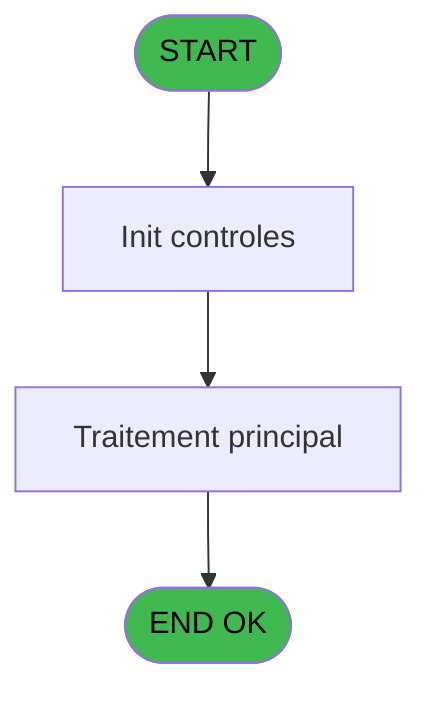
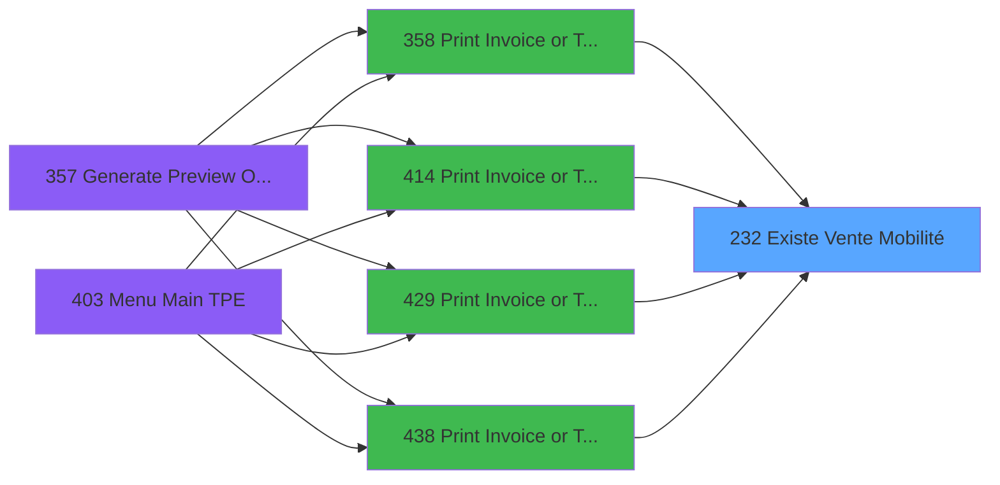

# PVE IDE 232 - Existe Vente Mobilité

> **Analyse**: Phases 1-4 2026-02-03 19:05 -> 19:05 (18s) | Assemblage 19:05
> **Pipeline**: V7.2 Enrichi
> **Structure**: 4 onglets (Resume | Ecrans | Donnees | Connexions)

<!-- TAB:Resume -->

## 1. FICHE D'IDENTITE

| Attribut | Valeur |
|----------|--------|
| Projet | PVE |
| IDE Position | 232 |
| Nom Programme | Existe Vente Mobilité |
| Fichier source | `Prg_232.xml` |
| Dossier IDE | Stocks |
| Taches | 1 (0 ecrans visibles) |
| Tables modifiees | 0 |
| Programmes appeles | 0 |

## 2. DESCRIPTION FONCTIONNELLE

**Existe Vente Mobilité** assure la gestion complete de ce processus, accessible depuis [Print Invoice or Ticket (IDE 358)](PVE-IDE-358.md), [Print Invoice or Ticket==V4 (IDE 414)](PVE-IDE-414.md), [Print Invoice or Ticket==NEW (IDE 429)](PVE-IDE-429.md), [Print Invoice or Ticket v2 (IDE 438)](PVE-IDE-438.md).

Le flux de traitement s'organise en **1 blocs fonctionnels** :

- **Saisie** (1 tache) : ecrans de saisie utilisateur (formulaires, champs, donnees)

## 3. BLOCS FONCTIONNELS

### 3.1 Saisie (1 tache)

L'operateur saisit les donnees de la transaction via 1 ecran (Existe Vente Mobilité).

---

#### 232 - Existe Vente Mobilité [[ECRAN]](#ecran-t1)

**Role** : Saisie des donnees : Existe Vente Mobilité.
**Ecran** : 126 x 195 DLU | [Voir mockup](#ecran-t1)
**Variables liees** : A (P Existe Enregistrement)

## 5. REGLES METIER

*(Aucune regle metier identifiee)*

## 6. CONTEXTE

- **Appele par**: [Print Invoice or Ticket (IDE 358)](PVE-IDE-358.md), [Print Invoice or Ticket==V4 (IDE 414)](PVE-IDE-414.md), [Print Invoice or Ticket==NEW (IDE 429)](PVE-IDE-429.md), [Print Invoice or Ticket v2 (IDE 438)](PVE-IDE-438.md)
- **Appelle**: 0 programmes | **Tables**: 0 (W:0 R:0 L:0) | **Taches**: 1 | **Expressions**: 1

<!-- TAB:Ecrans -->

## 8. ECRANS

*(Programme sans ecran visible)*

## 9. NAVIGATION

### 9.3 Structure hierarchique (1 tache)

| Position | Tache | Type | Dimensions | Bloc |
|----------|-------|------|------------|------|
| **232.1** | [**Existe Vente Mobilité** (232)](#t1) [mockup](#ecran-t1) | - | 126x195 | Saisie |

### 9.4 Algorigramme

> **Legende**: Vert = START/END OK | Rouge = END KO | Bleu = Decisions
> *Algorigramme auto-genere. Utiliser `/algorigramme` pour une synthese metier detaillee.*

<!-- TAB:Donnees -->

## 10. TABLES

### Tables utilisees (0)

| ID | Nom | Description | Type | R | W | L | Usages |
|----|-----|-------------|------|---|---|---|--------|

### Colonnes par table (0 / 0 tables avec colonnes identifiees)

## 11. VARIABLES

### 11.1 Parametres entrants (1)

Variables recues du programme appelant ([Print Invoice or Ticket (IDE 358)](PVE-IDE-358.md)).

| Lettre | Nom | Type | Usage dans |
|--------|-----|------|-----------|
| A | P Existe Enregistrement | Logical | - |

### 11.2 Variables de session (1)

Variables persistantes pendant toute la session.

| Lettre | Nom | Type | Usage dans |
|--------|-----|------|-----------|
| B | V Nb Enreg | Numeric | 1x session |

## 12. EXPRESSIONS

**1 / 1 expressions decodees (100%)**

### 12.1 Repartition par type

| Type | Expressions | Regles |
|------|-------------|--------|
| CONDITION | 1 | 0 |

### 12.2 Expressions cles par type

#### CONDITION (1 expressions)

| Type | IDE | Expression | Regle |
|------|-----|------------|-------|
| CONDITION | 1 | `V Nb Enreg [B]>0` | - |

<!-- TAB:Connexions -->

## 13. GRAPHE D'APPELS

### 13.1 Chaine depuis Main (Callers)

Main -> ... -> [Print Invoice or Ticket (IDE 358)](PVE-IDE-358.md) -> **Existe Vente Mobilité (IDE 232)**

Main -> ... -> [Print Invoice or Ticket==V4 (IDE 414)](PVE-IDE-414.md) -> **Existe Vente Mobilité (IDE 232)**

Main -> ... -> [Print Invoice or Ticket==NEW (IDE 429)](PVE-IDE-429.md) -> **Existe Vente Mobilité (IDE 232)**

Main -> ... -> [Print Invoice or Ticket v2 (IDE 438)](PVE-IDE-438.md) -> **Existe Vente Mobilité (IDE 232)**

### 13.2 Callers

| IDE | Nom Programme | Nb Appels |
|-----|---------------|-----------|
| [358](PVE-IDE-358.md) | Print Invoice or Ticket | 1 |
| [414](PVE-IDE-414.md) | Print Invoice or Ticket==V4 | 1 |
| [429](PVE-IDE-429.md) | Print Invoice or Ticket==NEW | 1 |
| [438](PVE-IDE-438.md) | Print Invoice or Ticket v2 | 1 |

### 13.3 Callees (programmes appeles)

### 13.4 Detail Callees avec contexte

| IDE | Nom Programme | Appels | Contexte |
|-----|---------------|--------|----------|
| - | (aucun) | - | - |

## 14. RECOMMANDATIONS MIGRATION

### 14.1 Profil du programme

| Metrique | Valeur | Impact migration |
|----------|--------|-----------------|
| Lignes de logique | 5 | Programme compact |
| Expressions | 1 | Peu de logique |
| Tables WRITE | 0 | Impact faible |
| Sous-programmes | 0 | Peu de dependances |
| Ecrans visibles | 0 | Ecran unique ou traitement batch |
| Code desactive | 0% (0 / 5) | Code sain |
| Regles metier | 0 | Pas de regle identifiee |

### 14.2 Plan de migration par bloc

#### Saisie (1 tache: 1 ecran, 0 traitement)

- **Strategie** : Formulaire React/Blazor avec validation Zod/FluentValidation.
- Reproduire 1 ecran : Existe Vente Mobilité
- Validation temps reel cote client + serveur

### 14.3 Dependances critiques

| Dependance | Type | Appels | Impact |
|------------|------|--------|--------|

---
*Spec DETAILED generee par Pipeline V7.2 - 2026-02-03 19:05*
