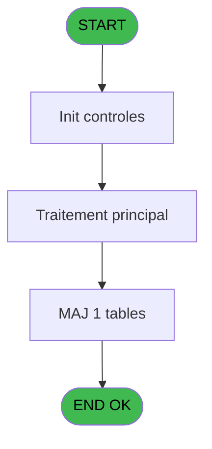
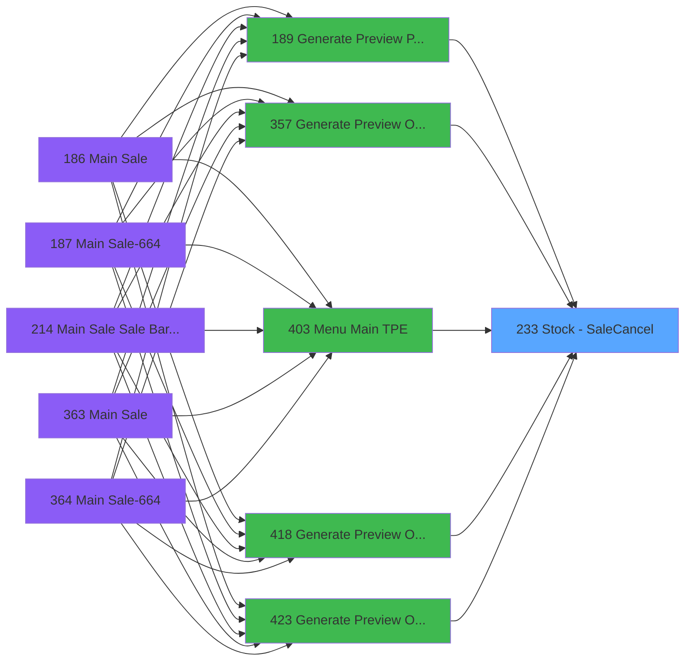
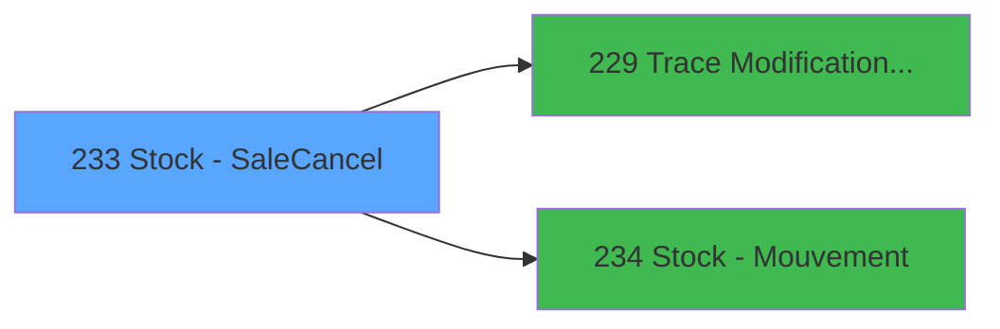

# PVE IDE 233 - Stock - Sale/Cancel

> **Analyse**: Phases 1-4 2026-02-03 19:05 -> 19:06 (17s) | Assemblage 19:06
> **Pipeline**: V7.2 Enrichi
> **Structure**: 4 onglets (Resume | Ecrans | Donnees | Connexions)

<!-- TAB:Resume -->

## 1. FICHE D'IDENTITE

| Attribut | Valeur |
|----------|--------|
| Projet | PVE |
| IDE Position | 233 |
| Nom Programme | Stock - Sale/Cancel |
| Fichier source | `Prg_233.xml` |
| Dossier IDE | Stocks |
| Taches | 3 (0 ecrans visibles) |
| Tables modifiees | 1 |
| Programmes appeles | 2 |

## 2. DESCRIPTION FONCTIONNELLE

**Stock - Sale/Cancel** assure la gestion complete de ce processus, accessible depuis [Generate Preview OD==V4 (IDE 357)](PVE-IDE-357.md), [Menu Main (TPE) (IDE 403)](PVE-IDE-403.md), [Generate Preview OD==LEX Book (IDE 418)](PVE-IDE-418.md), [Generate Preview OD==V4 (IDE 423)](PVE-IDE-423.md), [Generate Preview OD==LEX (IDE 424)](PVE-IDE-424.md), [Generate Preview Payments (IDE 441)](PVE-IDE-441.md), [Generate Preview Payments (IDE 189)](PVE-IDE-189.md), [Generate Preview Payments 1212 (IDE 434)](PVE-IDE-434.md), [Generate Preview Payments 1112 (IDE 435)](PVE-IDE-435.md), [Generate Preview Payments 1012 (IDE 436)](PVE-IDE-436.md), [Generate Preview Payment 1212E (IDE 437)](PVE-IDE-437.md).

Le flux de traitement s'organise en **1 blocs fonctionnels** :

- **Traitement** (3 taches) : traitements metier divers

**Donnees modifiees** : 1 tables en ecriture (pv_sellers).

## 3. BLOCS FONCTIONNELS

### 3.1 Traitement (3 taches)

Traitements internes.

---

#### 233 - Action Cancel Exit

**Role** : Traitement : Action Cancel Exit.
**Delegue a** : [Trace Modification package (IDE 229)](PVE-IDE-229.md)

---

#### 233.1 - Product

**Role** : Traitement : Product.
**Variables liees** : A (P. Product)
**Delegue a** : [Trace Modification package (IDE 229)](PVE-IDE-229.md)

---

#### 233.2 - Package detail

**Role** : Traitement : Package detail.
**Variables liees** : C (P. Package ID OUT)
**Delegue a** : [Trace Modification package (IDE 229)](PVE-IDE-229.md)

## 5. REGLES METIER

*(Aucune regle metier identifiee)*

## 6. CONTEXTE

- **Appele par**: [Generate Preview OD==V4 (IDE 357)](PVE-IDE-357.md), [Menu Main (TPE) (IDE 403)](PVE-IDE-403.md), [Generate Preview OD==LEX Book (IDE 418)](PVE-IDE-418.md), [Generate Preview OD==V4 (IDE 423)](PVE-IDE-423.md), [Generate Preview OD==LEX (IDE 424)](PVE-IDE-424.md), [Generate Preview Payments (IDE 441)](PVE-IDE-441.md), [Generate Preview Payments (IDE 189)](PVE-IDE-189.md), [Generate Preview Payments 1212 (IDE 434)](PVE-IDE-434.md), [Generate Preview Payments 1112 (IDE 435)](PVE-IDE-435.md), [Generate Preview Payments 1012 (IDE 436)](PVE-IDE-436.md), [Generate Preview Payment 1212E (IDE 437)](PVE-IDE-437.md)
- **Appelle**: 2 programmes | **Tables**: 2 (W:1 R:0 L:1) | **Taches**: 3 | **Expressions**: 1

<!-- TAB:Ecrans -->

## 8. ECRANS

*(Programme sans ecran visible)*

## 9. NAVIGATION

### 9.3 Structure hierarchique (3 taches)

| Position | Tache | Type | Dimensions | Bloc |
|----------|-------|------|------------|------|
| **233.1** | [**Action Cancel Exit** (233)](#t1) | MDI | - | Traitement |
| 233.1.1 | [Product (233.1)](#t2) | MDI | - | |
| 233.1.2 | [Package detail (233.2)](#t3) | MDI | - | |

### 9.4 Algorigramme

> **Legende**: Vert = START/END OK | Rouge = END KO | Bleu = Decisions
> *Algorigramme auto-genere. Utiliser `/algorigramme` pour une synthese metier detaillee.*

<!-- TAB:Donnees -->

## 10. TABLES

### Tables utilisees (2)

| ID | Nom | Description | Type | R | W | L | Usages |
|----|-----|-------------|------|---|---|---|--------|
| 403 | pv_sellers |  | DB |   | **W** |   | 2 |
| 759 | Temp_service_cash | Services / filieres | DB |   |   | L | 2 |

### Colonnes par table (1 / 1 tables avec colonnes identifiees)

Table 403 - pv_sellers (**W**) - 2 usages

| Lettre | Variable | Acces | Type |
|--------|----------|-------|------|
| A | V Quantity to destock | W | Numeric |
| B | v.Stock géré par détail ? | W | Logical |

## 11. VARIABLES

### 11.1 Parametres entrants (8)

Variables recues du programme appelant ([Generate Preview OD==V4 (IDE 357)](PVE-IDE-357.md)).

| Lettre | Nom | Type | Usage dans |
|--------|-----|------|-----------|
| A | P. Product | Numeric | - |
| B | P. Customer | Numeric | - |
| C | P. Package ID OUT | Numeric | - |
| D | P. Movement | Numeric | - |
| E | P. In/Out | Alpha | - |
| F | P. Quantity sale | Numeric | - |
| G | P. Discount sale | Numeric | - |
| H | P. TVA sale | Numeric | - |

### 11.2 Variables de session (1)

Variables persistantes pendant toute la session.

| Lettre | Nom | Type | Usage dans |
|--------|-----|------|-----------|
| I | v.Article géré en stock ? | Logical | 1x session |

## 12. EXPRESSIONS

**1 / 1 expressions decodees (100%)**

### 12.1 Repartition par type

| Type | Expressions | Regles |
|------|-------------|--------|
| NEGATION | 1 | 0 |

### 12.2 Expressions cles par type

#### NEGATION (1 expressions)

| Type | IDE | Expression | Regle |
|------|-----|------------|-------|
| NEGATION | 1 | `NOT VG110 OR v.Article géré en stock ? [I]` | - |

<!-- TAB:Connexions -->

## 13. GRAPHE D'APPELS

### 13.1 Chaine depuis Main (Callers)

Main -> ... -> [Generate Preview OD==V4 (IDE 357)](PVE-IDE-357.md) -> **Stock - Sale/Cancel (IDE 233)**

Main -> ... -> [Menu Main (TPE) (IDE 403)](PVE-IDE-403.md) -> **Stock - Sale/Cancel (IDE 233)**

Main -> ... -> [Generate Preview OD==LEX Book (IDE 418)](PVE-IDE-418.md) -> **Stock - Sale/Cancel (IDE 233)**

Main -> ... -> [Generate Preview OD==V4 (IDE 423)](PVE-IDE-423.md) -> **Stock - Sale/Cancel (IDE 233)**

Main -> ... -> [Generate Preview OD==LEX (IDE 424)](PVE-IDE-424.md) -> **Stock - Sale/Cancel (IDE 233)**

Main -> ... -> [Generate Preview Payments (IDE 441)](PVE-IDE-441.md) -> **Stock - Sale/Cancel (IDE 233)**

Main -> ... -> [Generate Preview Payments (IDE 189)](PVE-IDE-189.md) -> **Stock - Sale/Cancel (IDE 233)**

Main -> ... -> [Generate Preview Payments 1212 (IDE 434)](PVE-IDE-434.md) -> **Stock - Sale/Cancel (IDE 233)**

Main -> ... -> [Generate Preview Payments 1112 (IDE 435)](PVE-IDE-435.md) -> **Stock - Sale/Cancel (IDE 233)**

Main -> ... -> [Generate Preview Payments 1012 (IDE 436)](PVE-IDE-436.md) -> **Stock - Sale/Cancel (IDE 233)**

Main -> ... -> [Generate Preview Payment 1212E (IDE 437)](PVE-IDE-437.md) -> **Stock - Sale/Cancel (IDE 233)**

### 13.2 Callers

| IDE | Nom Programme | Nb Appels |
|-----|---------------|-----------|
| [357](PVE-IDE-357.md) | Generate Preview OD==V4 | 2 |
| [403](PVE-IDE-403.md) | Menu Main (TPE) | 2 |
| [418](PVE-IDE-418.md) | Generate Preview OD==LEX Book | 2 |
| [423](PVE-IDE-423.md) | Generate Preview OD==V4 | 2 |
| [424](PVE-IDE-424.md) | Generate Preview OD==LEX | 2 |
| [441](PVE-IDE-441.md) | Generate Preview Payments | 2 |
| [189](PVE-IDE-189.md) | Generate Preview Payments | 1 |
| [434](PVE-IDE-434.md) | Generate Preview Payments 1212 | 1 |
| [435](PVE-IDE-435.md) | Generate Preview Payments 1112 | 1 |
| [436](PVE-IDE-436.md) | Generate Preview Payments 1012 | 1 |
| [437](PVE-IDE-437.md) | Generate Preview Payment 1212E | 1 |

### 13.3 Callees (programmes appeles)

### 13.4 Detail Callees avec contexte

| IDE | Nom Programme | Appels | Contexte |
|-----|---------------|--------|----------|
| [229](PVE-IDE-229.md) | Trace Modification package | 2 | Sous-programme |
| [234](PVE-IDE-234.md) | Stock - Mouvement | 2 | Calcul de donnees |

## 14. RECOMMANDATIONS MIGRATION

### 14.1 Profil du programme

| Metrique | Valeur | Impact migration |
|----------|--------|-----------------|
| Lignes de logique | 102 | Programme compact |
| Expressions | 1 | Peu de logique |
| Tables WRITE | 1 | Impact faible |
| Sous-programmes | 2 | Peu de dependances |
| Ecrans visibles | 0 | Ecran unique ou traitement batch |
| Code desactive | 0% (0 / 102) | Code sain |
| Regles metier | 0 | Pas de regle identifiee |

### 14.2 Plan de migration par bloc

#### Traitement (3 taches: 0 ecran, 3 traitements)

- **Strategie** : 3 service(s) backend injectable(s) (Domain Services).
- 2 sous-programme(s) a migrer ou a reutiliser depuis les services existants.
- Decomposer les taches en services unitaires testables.

### 14.3 Dependances critiques

| Dependance | Type | Appels | Impact |
|------------|------|--------|--------|
| pv_sellers | Table WRITE (Database) | 2x | Schema + repository |
| [Stock - Mouvement (IDE 234)](PVE-IDE-234.md) | Sous-programme | 2x | Haute - Calcul de donnees |
| [Trace Modification package (IDE 229)](PVE-IDE-229.md) | Sous-programme | 2x | Haute - Sous-programme |

---
*Spec DETAILED generee par Pipeline V7.2 - 2026-02-03 19:06*
