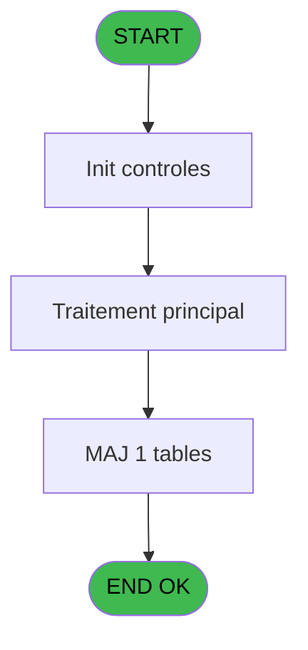
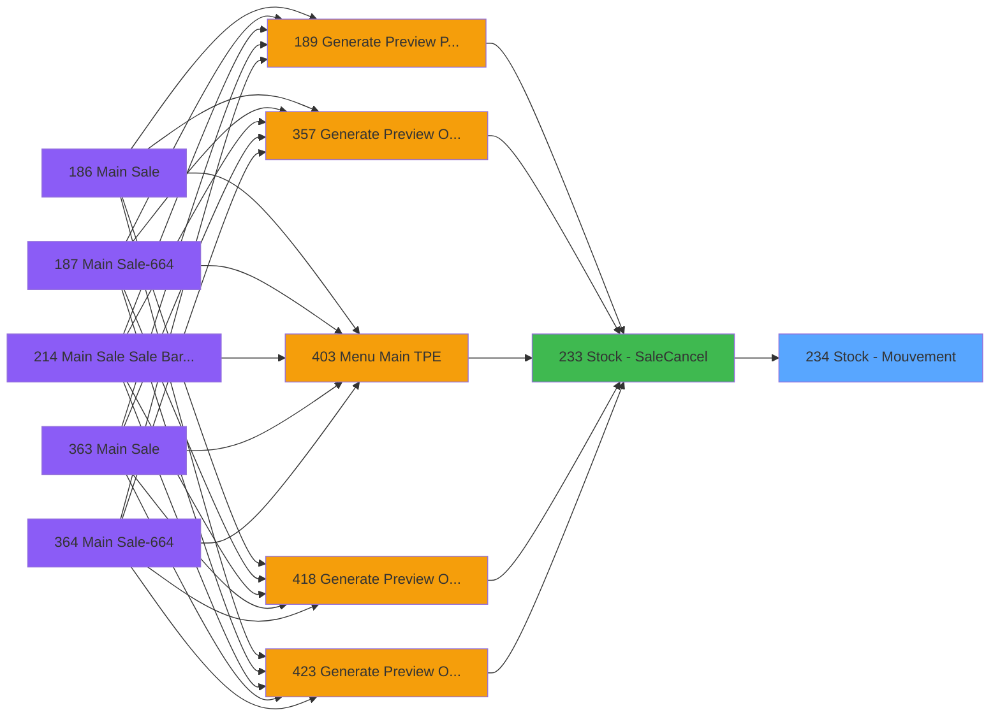

# PVE IDE 234 - Stock - Mouvement

> **Analyse**: Phases 1-4 2026-02-03 19:06 -> 19:06 (17s) | Assemblage 19:06
> **Pipeline**: V7.2 Enrichi
> **Structure**: 4 onglets (Resume | Ecrans | Donnees | Connexions)

<!-- TAB:Resume -->

## 1. FICHE D'IDENTITE

| Attribut | Valeur |
|----------|--------|
| Projet | PVE |
| IDE Position | 234 |
| Nom Programme | Stock - Mouvement |
| Fichier source | `Prg_234.xml` |
| Dossier IDE | Stocks |
| Taches | 1 (0 ecrans visibles) |
| Tables modifiees | 1 |
| Programmes appeles | 0 |

## 2. DESCRIPTION FONCTIONNELLE

**Stock - Mouvement** assure la gestion complete de ce processus, accessible depuis [Stock - Sale/Cancel (IDE 233)](PVE-IDE-233.md).

Le flux de traitement s'organise en **1 blocs fonctionnels** :

- **Traitement** (1 tache) : traitements metier divers

**Donnees modifiees** : 1 tables en ecriture (pv_mvt_stock_tempo).

## 3. BLOCS FONCTIONNELS

### 3.1 Traitement (1 tache)

Traitements internes.

---

#### 234 - Action Cancel Exit

**Role** : Traitement : Action Cancel Exit.

## 5. REGLES METIER

*(Aucune regle metier identifiee)*

## 6. CONTEXTE

- **Appele par**: [Stock - Sale/Cancel (IDE 233)](PVE-IDE-233.md)
- **Appelle**: 0 programmes | **Tables**: 1 (W:1 R:0 L:0) | **Taches**: 1 | **Expressions**: 15

<!-- TAB:Ecrans -->

## 8. ECRANS

*(Programme sans ecran visible)*

## 9. NAVIGATION

### 9.3 Structure hierarchique (1 tache)

| Position | Tache | Type | Dimensions | Bloc |
|----------|-------|------|------------|------|
| **234.1** | [**Action Cancel Exit** (234)](#t1) | MDI | - | Traitement |

### 9.4 Algorigramme

> **Legende**: Vert = START/END OK | Rouge = END KO | Bleu = Decisions
> *Algorigramme auto-genere. Utiliser `/algorigramme` pour une synthese metier detaillee.*

<!-- TAB:Donnees -->

## 10. TABLES

### Tables utilisees (1)

| ID | Nom | Description | Type | R | W | L | Usages |
|----|-----|-------------|------|---|---|---|--------|
| 762 | pv_mvt_stock_tempo | Table temporaire ecran | DB |   | **W** |   | 1 |

### Colonnes par table (1 / 1 tables avec colonnes identifiees)

Table 762 - pv_mvt_stock_tempo (**W**) - 1 usages

| Lettre | Variable | Acces | Type |
|--------|----------|-------|------|
| A | Pi. Product | W | Numeric |
| B | Pi. Customer | W | Numeric |
| C | Pi. Package ID OUT | W | Numeric |
| D | Pi. Movement | W | Numeric |
| E | Pi. Quantity to destock | W | Numeric |
| F | Pi. In ou Out | W | Alpha |
| G | Pio. Quantité stock (product) | W | Numeric |
| H | Pi. Selling Price | W | Numeric |
| I | Pi. Purchasing Price | W | Numeric |
| J | Pi. Discount | W | Numeric |
| K | Pi. VAT | W | Numeric |
| L | Pi. Volume vendu | W | Numeric |
| M | V Amount discounted | W | Numeric |

## 11. VARIABLES

### 11.1 Parametres entrants (11)

Variables recues du programme appelant ([Stock - Sale/Cancel (IDE 233)](PVE-IDE-233.md)).

| Lettre | Nom | Type | Usage dans |
|--------|-----|------|-----------|
| A | Pi. Product | Numeric | 1x parametre entrant |
| B | Pi. Customer | Numeric | 1x parametre entrant |
| C | Pi. Package ID OUT | Numeric | 1x parametre entrant |
| D | Pi. Movement | Numeric | 1x parametre entrant |
| E | Pi. Quantity to destock | Numeric | 2x parametre entrant |
| F | Pi. In ou Out | Alpha | 3x parametre entrant |
| H | Pi. Selling Price | Numeric | 2x parametre entrant |
| I | Pi. Purchasing Price | Numeric | 1x parametre entrant |
| J | Pi. Discount | Numeric | 1x parametre entrant |
| K | Pi. VAT | Numeric | - |
| L | Pi. Volume vendu | Numeric | 1x parametre entrant |

### 11.2 Variables de session (1)

Variables persistantes pendant toute la session.

| Lettre | Nom | Type | Usage dans |
|--------|-----|------|-----------|
| M | V Amount discounted | Numeric | - |

### 11.3 Autres (1)

Variables diverses.

| Lettre | Nom | Type | Usage dans |
|--------|-----|------|-----------|
| G | Pio. Quantité stock (product) | Numeric | - |

## 12. EXPRESSIONS

**15 / 15 expressions decodees (100%)**

### 12.1 Repartition par type

| Type | Expressions | Regles |
|------|-------------|--------|
| CALCUL | 1 | 0 |
| CONDITION | 2 | 0 |
| DATE | 1 | 0 |
| OTHER | 10 | 0 |
| REFERENCE_VG | 1 | 0 |

### 12.2 Expressions cles par type

#### CALCUL (1 expressions)

| Type | IDE | Expression | Regle |
|------|-----|------------|-------|
| CALCUL | 1 | `Round (Pi. Selling Price [H]*(1-Pi. Discount [J]/100),12,GetParam ('DECIMALNUMBER'))` | - |

#### CONDITION (2 expressions)

| Type | IDE | Expression | Regle |
|------|-----|------------|-------|
| CONDITION | 15 | `Pio. Quantité stock (p... [G]+IF (Pi. In ou Out [F]='In',ABS (Pi. Quantity to destock [E]),- (ABS (Pi. Quantity to destock [E])))` | - |
| CONDITION | 11 | `[W]+IF (Pi. In ou Out [F]='In',ABS (Pi. Quantity to destock [E]),- (ABS (Pi. Quantity to destock [E])))` | - |

#### DATE (1 expressions)

| Type | IDE | Expression | Regle |
|------|-----|------------|-------|
| DATE | 4 | `Date ()` | - |

#### OTHER (10 expressions)

| Type | IDE | Expression | Regle |
|------|-----|------------|-------|
| OTHER | 10 | `Pi. Customer [B]` | - |
| OTHER | 8 | `Pi. In ou Out [F]` | - |
| OTHER | 12 | `Pi. Selling Price [H]` | - |
| OTHER | 14 | `Pi. Volume vendu [L]` | - |
| OTHER | 13 | `Pi. Purchasing Price [I]` | - |
| ... | | *+5 autres* | |

#### REFERENCE_VG (1 expressions)

| Type | IDE | Expression | Regle |
|------|-----|------------|-------|
| REFERENCE_VG | 9 | `VG1` | - |

<!-- TAB:Connexions -->

## 13. GRAPHE D'APPELS

### 13.1 Chaine depuis Main (Callers)

Main -> ... -> [Stock - Sale/Cancel (IDE 233)](PVE-IDE-233.md) -> **Stock - Mouvement (IDE 234)**

### 13.2 Callers

| IDE | Nom Programme | Nb Appels |
|-----|---------------|-----------|
| [233](PVE-IDE-233.md) | Stock - Sale/Cancel | 2 |

### 13.3 Callees (programmes appeles)

### 13.4 Detail Callees avec contexte

| IDE | Nom Programme | Appels | Contexte |
|-----|---------------|--------|----------|
| - | (aucun) | - | - |

## 14. RECOMMANDATIONS MIGRATION

### 14.1 Profil du programme

| Metrique | Valeur | Impact migration |
|----------|--------|-----------------|
| Lignes de logique | 40 | Programme compact |
| Expressions | 15 | Peu de logique |
| Tables WRITE | 1 | Impact faible |
| Sous-programmes | 0 | Peu de dependances |
| Ecrans visibles | 0 | Ecran unique ou traitement batch |
| Code desactive | 0% (0 / 40) | Code sain |
| Regles metier | 0 | Pas de regle identifiee |

### 14.2 Plan de migration par bloc

#### Traitement (1 tache: 0 ecran, 1 traitement)

- **Strategie** : 1 service(s) backend injectable(s) (Domain Services).
- Decomposer les taches en services unitaires testables.

### 14.3 Dependances critiques

| Dependance | Type | Appels | Impact |
|------------|------|--------|--------|
| pv_mvt_stock_tempo | Table WRITE (Database) | 1x | Schema + repository |

---
*Spec DETAILED generee par Pipeline V7.2 - 2026-02-03 19:06*
