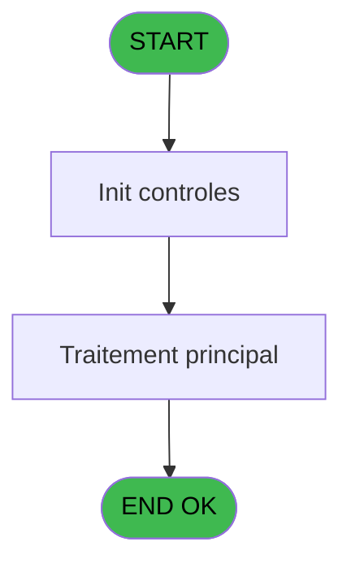
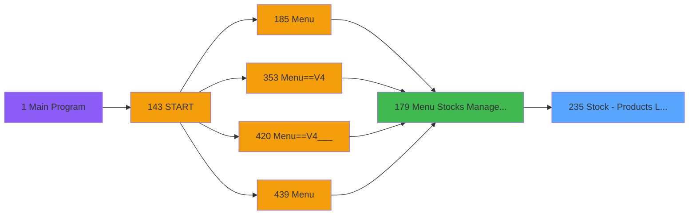

# PVE IDE 235 - Stock - Products List CSV V2

> **Analyse**: Phases 1-4 2026-02-03 19:06 -> 19:06 (17s) | Assemblage 19:06
> **Pipeline**: V7.2 Enrichi
> **Structure**: 4 onglets (Resume | Ecrans | Donnees | Connexions)

<!-- TAB:Resume -->

## 1. FICHE D'IDENTITE

| Attribut | Valeur |
|----------|--------|
| Projet | PVE |
| IDE Position | 235 |
| Nom Programme | Stock - Products List CSV V2 |
| Fichier source | `Prg_235.xml` |
| Dossier IDE | Stocks |
| Taches | 4 (0 ecrans visibles) |
| Tables modifiees | 0 |
| Programmes appeles | 0 |

## 2. DESCRIPTION FONCTIONNELLE

**Stock - Products List CSV V2** assure la gestion complete de ce processus, accessible depuis [Menu Stocks Management (IDE 179)](PVE-IDE-179.md).

Le flux de traitement s'organise en **2 blocs fonctionnels** :

- **Impression** (3 taches) : generation de tickets et documents
- **Calcul** (1 tache) : calculs de montants, stocks ou compteurs

Detail : phases du traitement

#### Phase 1 : Impression (3 taches)

- **235** - Print Best Of **[[ECRAN]](#ecran-t1)**
- **235.1** - Print
- **235.1.1** - Printing

#### Phase 2 : Calcul (1 tache)

- **235.1.1.1** - Stocks List

## 3. BLOCS FONCTIONNELS

### 3.1 Impression (3 taches)

Generation des documents et tickets.

---

#### 235 - Print Best Of [[ECRAN]](#ecran-t1)

**Role** : Generation du document : Print Best Of.
**Ecran** : 312 x 173 DLU (MDI) | [Voir mockup](#ecran-t1)

---

#### 235.1 - Print

**Role** : Generation du document : Print.

---

#### 235.1.1 - Printing

**Role** : Generation du document : Printing.

### 3.2 Calcul (1 tache)

Calculs metier : montants, stocks, compteurs.

---

#### 235.1.1.1 - Stocks List

**Role** : Calcul : Stocks List.

## 5. REGLES METIER

*(Aucune regle metier identifiee)*

## 6. CONTEXTE

- **Appele par**: [Menu Stocks Management (IDE 179)](PVE-IDE-179.md)
- **Appelle**: 0 programmes | **Tables**: 4 (W:0 R:1 L:3) | **Taches**: 4 | **Expressions**: 5

<!-- TAB:Ecrans -->

## 8. ECRANS

*(Programme sans ecran visible)*

## 9. NAVIGATION

### 9.3 Structure hierarchique (4 taches)

| Position | Tache | Type | Dimensions | Bloc |
|----------|-------|------|------------|------|
| **235.1** | [**Print Best Of** (235)](#t1) [mockup](#ecran-t1) | MDI | 312x173 | Impression |
| 235.1.1 | [Print (235.1)](#t2) | MDI | - | |
| 235.1.2 | [Printing (235.1.1)](#t3) | MDI | - | |
| **235.2** | [**Stocks List** (235.1.1.1)](#t4) | MDI | - | Calcul |

### 9.4 Algorigramme

> **Legende**: Vert = START/END OK | Rouge = END KO | Bleu = Decisions
> *Algorigramme auto-genere. Utiliser `/algorigramme` pour une synthese metier detaillee.*

<!-- TAB:Donnees -->

## 10. TABLES

### Tables utilisees (4)

| ID | Nom | Description | Type | R | W | L | Usages |
|----|-----|-------------|------|---|---|---|--------|
| 379 | pv_customer_temp |  | DB |   |   | L | 1 |
| 403 | pv_sellers |  | DB | R |   |   | 1 |
| 413 | pv_tva |  | DB |   |   | L | 1 |
| 759 | Temp_service_cash | Services / filieres | DB |   |   | L | 1 |

### Colonnes par table (2 / 1 tables avec colonnes identifiees)

Table 403 - pv_sellers (R) - 1 usages

| Lettre | Variable | Acces | Type |
|--------|----------|-------|------|
| A | V.Quantité en Stock en PC | R | Numeric |
| B | v.Produit géré par détail ? | R | Logical |
| C | V.Purchasing total | R | Numeric |
| D | V.Selling total | R | Numeric |
| E | condition 1 | R | Logical |
| F | calcul decimal | R | Unicode |
| G | calcul entier | R | Unicode |

## 11. VARIABLES

### 11.1 Parametres entrants (4)

Variables recues du programme appelant ([Menu Stocks Management (IDE 179)](PVE-IDE-179.md)).

| Lettre | Nom | Type | Usage dans |
|--------|-----|------|-----------|
| A | P.i.Village name | Alpha | - |
| B | P.i.Currency | Alpha | - |
| C | P.i.Masque | Alpha | - |
| D | P.i.automatically for service | Alpha | - |

### 11.2 Variables de session (1)

Variables persistantes pendant toute la session.

| Lettre | Nom | Type | Usage dans |
|--------|-----|------|-----------|
| F | v.fichier csv | Alpha | - |

### 11.3 Autres (2)

Variables diverses.

| Lettre | Nom | Type | Usage dans |
|--------|-----|------|-----------|
| E | ; | Alpha | 1x refs |
| G | calcul entier | Unicode | - |

## 12. EXPRESSIONS

**5 / 5 expressions decodees (100%)**

### 12.1 Repartition par type

| Type | Expressions | Regles |
|------|-------------|--------|
| CONSTANTE | 1 | 0 |
| CONDITION | 2 | 0 |
| CONCATENATION | 2 | 0 |

### 12.2 Expressions cles par type

#### CONSTANTE (1 expressions)

| Type | IDE | Expression | Regle |
|------|-----|------------|-------|
| CONSTANTE | 1 | `';'` | - |

#### CONDITION (2 expressions)

| Type | IDE | Expression | Regle |
|------|-----|------------|-------|
| CONDITION | 5 | `P.i.automatically for ... [D]<>''` | - |
| CONDITION | 4 | `P.i.automatically for ... [D]=''` | - |

#### CONCATENATION (2 expressions)

| Type | IDE | Expression | Regle |
|------|-----|------------|-------|
| CONCATENATION | 3 | `Translate('%club_exportdata%')&'ArchivagePOS\'&Trim (GetParam ('VILLAGECODE'))&Trim (P.i.automatically for ... [D])&'_StockList.csv'` | - |
| CONCATENATION | 2 | `Translate('%club_exportdata%')&Trim (GetParam ('VILLAGECODE'))&Trim (GetParam ('SERVICE'))&'_StockList.csv'` | - |

<!-- TAB:Connexions -->

## 13. GRAPHE D'APPELS

### 13.1 Chaine depuis Main (Callers)

Main -> ... -> [Menu Stocks Management (IDE 179)](PVE-IDE-179.md) -> **Stock - Products List CSV V2 (IDE 235)**

### 13.2 Callers

| IDE | Nom Programme | Nb Appels |
|-----|---------------|-----------|
| [179](PVE-IDE-179.md) | Menu Stocks Management | 1 |

### 13.3 Callees (programmes appeles)

### 13.4 Detail Callees avec contexte

| IDE | Nom Programme | Appels | Contexte |
|-----|---------------|--------|----------|
| - | (aucun) | - | - |

## 14. RECOMMANDATIONS MIGRATION

### 14.1 Profil du programme

| Metrique | Valeur | Impact migration |
|----------|--------|-----------------|
| Lignes de logique | 81 | Programme compact |
| Expressions | 5 | Peu de logique |
| Tables WRITE | 0 | Impact faible |
| Sous-programmes | 0 | Peu de dependances |
| Ecrans visibles | 0 | Ecran unique ou traitement batch |
| Code desactive | 0% (0 / 81) | Code sain |
| Regles metier | 0 | Pas de regle identifiee |

### 14.2 Plan de migration par bloc

#### Impression (3 taches: 1 ecran, 2 traitements)

- **Strategie** : Templates HTML -> PDF via wkhtmltopdf ou Puppeteer.
- `PrintService` injectable avec choix imprimante

#### Calcul (1 tache: 0 ecran, 1 traitement)

- **Strategie** : Services de calcul purs (Domain Services).
- Migrer la logique de calcul (stock, compteurs, montants)

### 14.3 Dependances critiques

| Dependance | Type | Appels | Impact |
|------------|------|--------|--------|

---
*Spec DETAILED generee par Pipeline V7.2 - 2026-02-03 19:06*
