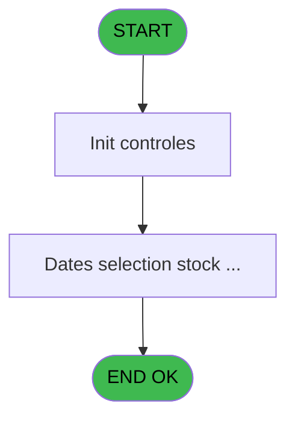
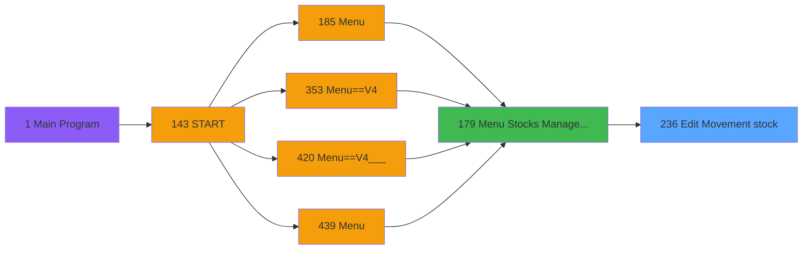

# PVE IDE 236 - Edit Movement stock

> **Analyse**: Phases 1-4 2026-02-03 19:07 -> 19:07 (17s) | Assemblage 19:07
> **Pipeline**: V7.2 Enrichi
> **Structure**: 4 onglets (Resume | Ecrans | Donnees | Connexions)

<!-- TAB:Resume -->

## 1. FICHE D'IDENTITE

| Attribut | Valeur |
|----------|--------|
| Projet | PVE |
| IDE Position | 236 |
| Nom Programme | Edit Movement stock |
| Fichier source | `Prg_236.xml` |
| Dossier IDE | Stocks |
| Taches | 5 (1 ecrans visibles) |
| Tables modifiees | 0 |
| Programmes appeles | 0 |

## 2. DESCRIPTION FONCTIONNELLE

**Edit Movement stock** assure la gestion complete de ce processus, accessible depuis [Menu Stocks Management (IDE 179)](PVE-IDE-179.md).

Le flux de traitement s'organise en **3 blocs fonctionnels** :

- **Impression** (2 taches) : generation de tickets et documents
- **Calcul** (2 taches) : calculs de montants, stocks ou compteurs
- **Consultation** (1 tache) : ecrans de recherche, selection et consultation

Detail : phases du traitement

#### Phase 1 : Calcul (2 taches)

- **236** - Dates selection stock movement
- **236.2.1.1** - Stocks List

#### Phase 2 : Consultation (1 tache)

- **236.1** - Date selection **[[ECRAN]](#ecran-t2)**

#### Phase 3 : Impression (2 taches)

- **236.2** - Print Best Of **[[ECRAN]](#ecran-t3)**
- **236.2.1** - Print

## 3. BLOCS FONCTIONNELS

### 3.1 Calcul (2 taches)

Calculs metier : montants, stocks, compteurs.

---

#### 236 - Dates selection stock movement

**Role** : Calcul : Dates selection stock movement.

---

#### 236.2.1.1 - Stocks List

**Role** : Calcul : Stocks List.

### 3.2 Consultation (1 tache)

Ecrans de recherche et consultation.

---

#### 236.1 - Date selection [[ECRAN]](#ecran-t2)

**Role** : Selection par l'operateur : Date selection.
**Ecran** : 243 x 173 DLU (MDI) | [Voir mockup](#ecran-t2)
**Variables liees** : A (V.Date Deb), B (V.Date Fin)

### 3.3 Impression (2 taches)

Generation des documents et tickets.

---

#### 236.2 - Print Best Of [[ECRAN]](#ecran-t3)

**Role** : Generation du document : Print Best Of.
**Ecran** : 312 x 173 DLU (MDI) | [Voir mockup](#ecran-t3)

---

#### 236.2.1 - Print

**Role** : Generation du document : Print.

## 5. REGLES METIER

*(Aucune regle metier identifiee)*

## 6. CONTEXTE

- **Appele par**: [Menu Stocks Management (IDE 179)](PVE-IDE-179.md)
- **Appelle**: 0 programmes | **Tables**: 6 (W:0 R:2 L:5) | **Taches**: 5 | **Expressions**: 5

<!-- TAB:Ecrans -->

## 8. ECRANS

### 8.1 Forms visibles (1 / 5)

| # | Position | Tache | Nom | Type | Largeur | Hauteur | Bloc |
|---|----------|-------|-----|------|---------|---------|------|
| 1 | 236.1 | 236.1 | Date selection | MDI | 243 | 173 | Consultation |

### 8.2 Mockups Ecrans

---

#### 236.1 - Date selection
**Tache** : [236.1](#t2) | **Type** : MDI | **Dimensions** : 243 x 173 DLU
**Bloc** : Consultation | **Titre IDE** : Date selection

<!-- FORM-DATA:
{
    "width":  243,
    "vFactor":  8,
    "type":  "MDI",
    "hFactor":  4,
    "controls":  [
                     {
                         "x":  11,
                         "type":  "label",
                         "var":  "",
                         "y":  53,
                         "w":  212,
                         "fmt":  "",
                         "name":  "",
                         "h":  9,
                         "color":  "187",
                         "text":  "Select movement type you want to print",
                         "parent":  null
                     },
                     {
                         "x":  11,
                         "type":  "label",
                         "var":  "",
                         "y":  86,
                         "w":  212,
                         "fmt":  "",
                         "name":  "",
                         "h":  9,
                         "color":  "187",
                         "text":  "Select the accounting period you want to print",
                         "parent":  null
                     },
                     {
                         "x":  36,
                         "type":  "label",
                         "var":  "",
                         "y":  101,
                         "w":  48,
                         "fmt":  "",
                         "name":  "",
                         "h":  12,
                         "color":  "183",
                         "text":  "Date min",
                         "parent":  null
                     },
                     {
                         "x":  36,
                         "type":  "label",
                         "var":  "",
                         "y":  120,
                         "w":  51,
                         "fmt":  "",
                         "name":  "",
                         "h":  12,
                         "color":  "183",
                         "text":  "Date max",
                         "parent":  null
                     },
                     {
                         "x":  0,
                         "type":  "label",
                         "var":  "",
                         "y":  0,
                         "w":  242,
                         "fmt":  "",
                         "name":  "",
                         "h":  41,
                         "color":  "182",
                         "text":  "",
                         "parent":  null
                     },
                     {
                         "x":  13,
                         "type":  "label",
                         "var":  "",
                         "y":  16,
                         "w":  169,
                         "fmt":  "",
                         "name":  "",
                         "h":  10,
                         "color":  "186",
                         "text":  "Date \u0026 movement  selection",
                         "parent":  7
                     },
                     {
                         "x":  0,
                         "type":  "label",
                         "var":  "",
                         "y":  140,
                         "w":  242,
                         "fmt":  "",
                         "name":  "",
                         "h":  33,
                         "color":  "183",
                         "text":  "",
                         "parent":  null
                     },
                     {
                         "x":  89,
                         "type":  "edit",
                         "var":  "",
                         "y":  101,
                         "w":  73,
                         "fmt":  "",
                         "name":  "",
                         "h":  12,
                         "color":  "110",
                         "text":  "",
                         "parent":  null
                     },
                     {
                         "x":  89,
                         "type":  "edit",
                         "var":  "",
                         "y":  119,
                         "w":  73,
                         "fmt":  "",
                         "name":  "",
                         "h":  12,
                         "color":  "110",
                         "text":  "",
                         "parent":  null
                     },
                     {
                         "x":  104,
                         "type":  "button",
                         "var":  "",
                         "y":  144,
                         "w":  68,
                         "fmt":  "\u0026Exit",
                         "name":  "",
                         "h":  28,
                         "color":  "",
                         "text":  "",
                         "parent":  null
                     },
                     {
                         "x":  173,
                         "type":  "button",
                         "var":  "",
                         "y":  144,
                         "w":  68,
                         "fmt":  "\u0026Validate",
                         "name":  "",
                         "h":  28,
                         "color":  "",
                         "text":  "",
                         "parent":  null
                     },
                     {
                         "x":  192,
                         "type":  "image",
                         "var":  "",
                         "y":  5,
                         "w":  48,
                         "fmt":  "",
                         "name":  "",
                         "h":  34,
                         "color":  "",
                         "text":  "",
                         "parent":  9
                     },
                     {
                         "x":  38,
                         "type":  "combobox",
                         "var":  "",
                         "y":  68,
                         "w":  124,
                         "fmt":  "",
                         "name":  "V.Type mouvement",
                         "h":  12,
                         "color":  "",
                         "text":  "",
                         "parent":  null
                     }
                 ],
    "taskId":  "236.1",
    "height":  173
}
-->

<strong>Champs : 3 champs</strong>

| Pos (x,y) | Nom | Variable | Type |
|-----------|-----|----------|------|
| 89,101 | (sans nom) | - | edit |
| 89,119 | (sans nom) | - | edit |
| 38,68 | V.Type mouvement | - | combobox |

<strong>Boutons : 2 boutons</strong>

| Bouton | Pos (x,y) | Action |
|--------|-----------|--------|
| Exit | 104,144 | Quitte le programme |
| Validate | 173,144 | Valide la saisie et enregistre |

## 9. NAVIGATION

Ecran unique: **Date selection**

### 9.3 Structure hierarchique (5 taches)

| Position | Tache | Type | Dimensions | Bloc |
|----------|-------|------|------------|------|
| **236.1** | [**Dates selection stock movement** (236)](#t1) | - | - | Calcul |
| 236.1.1 | [Stocks List (236.2.1.1)](#t5) | MDI | - | |
| **236.2** | [**Date selection** (236.1)](#t2) [mockup](#ecran-t2) | MDI | 243x173 | Consultation |
| **236.3** | [**Print Best Of** (236.2)](#t3) [mockup](#ecran-t3) | MDI | 312x173 | Impression |
| 236.3.1 | [Print (236.2.1)](#t4) | MDI | - | |

### 9.4 Algorigramme

> **Legende**: Vert = START/END OK | Rouge = END KO | Bleu = Decisions
> *Algorigramme auto-genere. Utiliser `/algorigramme` pour une synthese metier detaillee.*

<!-- TAB:Donnees -->

## 10. TABLES

### Tables utilisees (6)

| ID | Nom | Description | Type | R | W | L | Usages |
|----|-----|-------------|------|---|---|---|--------|
| 379 | pv_customer_temp |  | DB |   |   | L | 1 |
| 403 | pv_sellers |  | DB | R |   |   | 1 |
| 413 | pv_tva |  | DB |   |   | L | 1 |
| 759 | Temp_service_cash | Services / filieres | DB |   |   | L | 1 |
| 761 | pv_ligne_inv_stock | Articles et stock | DB |   |   | L | 1 |
| 762 | pv_mvt_stock_tempo | Table temporaire ecran | DB | R |   | L | 2 |

### Colonnes par table (4 / 2 tables avec colonnes identifiees)

Table 403 - pv_sellers (R) - 1 usages

| Lettre | Variable | Acces | Type |
|--------|----------|-------|------|
| A | v.Quantity en PC | R | Numeric |
| B | v.Produit géré par détail ? | R | Logical |
| C | V.Nombre total par mouveme PC | R | Numeric |
| D | V.Nombre total par mouveme CL | R | Numeric |
| E | V.Nombre total de produit PC | R | Numeric |
| F | V.Nombre total de produit CL | R | Numeric |
| G | V.Purchasing total | R | Numeric |
| H | V.Selling total | R | Numeric |
| I | v.Add Ligne entete PMS-864 | R | Unicode |
| J | v.Add Ligne detail PMS-864 | R | Unicode |
| K | v.Quantity PC | R | Numeric |

Table 762 - pv_mvt_stock_tempo (R/L) - 2 usages

| Lettre | Variable | Acces | Type |
|--------|----------|-------|------|
| A | V is item selected | R | Logical |
| B | V.Extract line | R | Unicode |
| C | v.Retour Mvt Stock avec raison | R | Logical |

## 11. VARIABLES

### 11.1 Variables de session (9)

Variables persistantes pendant toute la session.

| Lettre | Nom | Type | Usage dans |
|--------|-----|------|-----------|
| A | V.Date Deb | Date | - |
| B | V.Date Fin | Date | - |
| C | V.Type mouvement | Numeric | - |
| F | v.fichier csv | Alpha | - |
| G | V.Purchasing total | Numeric | - |
| H | V.Selling total | Numeric | - |
| I | v.Add Ligne entete PMS-864 | Unicode | - |
| J | v.Add Ligne detail PMS-864 | Unicode | - |
| K | v.Quantity PC | Numeric | - |

### 11.2 Autres (2)

Variables diverses.

| Lettre | Nom | Type | Usage dans |
|--------|-----|------|-----------|
| D | Edition ok? | Logical | 1x refs |
| E | ; | Alpha | - |

## 12. EXPRESSIONS

**5 / 5 expressions decodees (100%)**

### 12.1 Repartition par type

| Type | Expressions | Regles |
|------|-------------|--------|
| CAST_LOGIQUE | 1 | 0 |
| OTHER | 4 | 0 |

### 12.2 Expressions cles par type

#### CAST_LOGIQUE (1 expressions)

| Type | IDE | Expression | Regle |
|------|-----|------------|-------|
| CAST_LOGIQUE | 1 | `'FALSE'LOG` | - |

#### OTHER (4 expressions)

| Type | IDE | Expression | Regle |
|------|-----|------------|-------|
| OTHER | 4 | `GetParam('CURRENCYVALUE')` | - |
| OTHER | 5 | `GetParam('AMOUNTFORMAT')` | - |
| OTHER | 2 | `Edition ok? [D]` | - |
| OTHER | 3 | `GetParam('HEADERLINE01')` | - |

<!-- TAB:Connexions -->

## 13. GRAPHE D'APPELS

### 13.1 Chaine depuis Main (Callers)

Main -> ... -> [Menu Stocks Management (IDE 179)](PVE-IDE-179.md) -> **Edit Movement stock (IDE 236)**

### 13.2 Callers

| IDE | Nom Programme | Nb Appels |
|-----|---------------|-----------|
| [179](PVE-IDE-179.md) | Menu Stocks Management | 1 |

### 13.3 Callees (programmes appeles)

### 13.4 Detail Callees avec contexte

| IDE | Nom Programme | Appels | Contexte |
|-----|---------------|--------|----------|
| - | (aucun) | - | - |

## 14. RECOMMANDATIONS MIGRATION

### 14.1 Profil du programme

| Metrique | Valeur | Impact migration |
|----------|--------|-----------------|
| Lignes de logique | 154 | Programme compact |
| Expressions | 5 | Peu de logique |
| Tables WRITE | 0 | Impact faible |
| Sous-programmes | 0 | Peu de dependances |
| Ecrans visibles | 1 | Ecran unique ou traitement batch |
| Code desactive | 0% (0 / 154) | Code sain |
| Regles metier | 0 | Pas de regle identifiee |

### 14.2 Plan de migration par bloc

#### Calcul (2 taches: 0 ecran, 2 traitements)

- **Strategie** : Services de calcul purs (Domain Services).
- Migrer la logique de calcul (stock, compteurs, montants)

#### Consultation (1 tache: 1 ecran, 0 traitement)

- **Strategie** : Composants de recherche/selection en modales.
- 1 ecran : Date selection

#### Impression (2 taches: 1 ecran, 1 traitement)

- **Strategie** : Templates HTML -> PDF via wkhtmltopdf ou Puppeteer.
- `PrintService` injectable avec choix imprimante

### 14.3 Dependances critiques

| Dependance | Type | Appels | Impact |
|------------|------|--------|--------|

---
*Spec DETAILED generee par Pipeline V7.2 - 2026-02-03 19:07*
