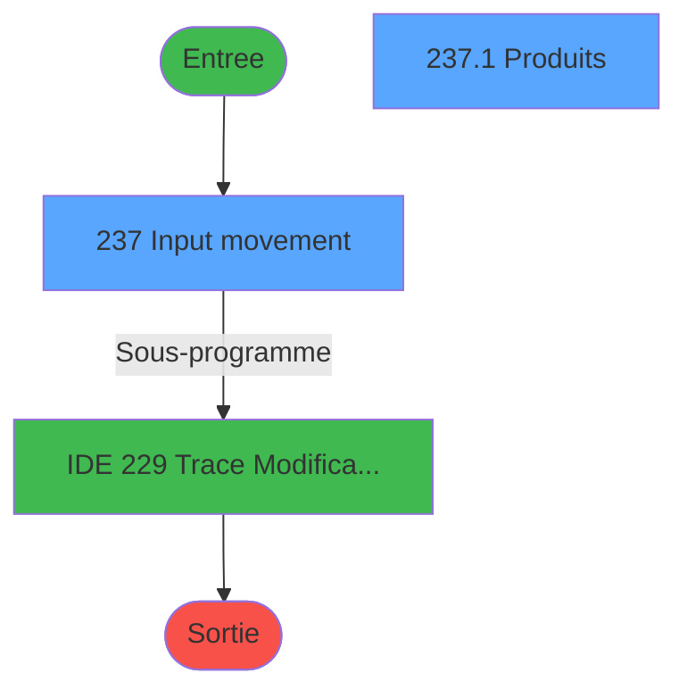
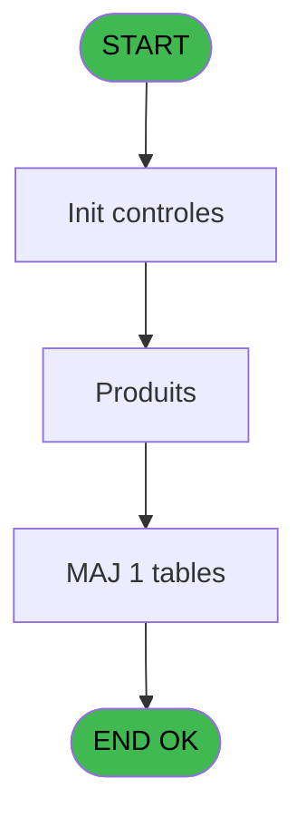
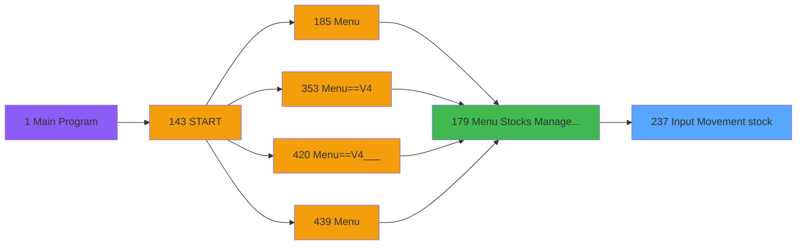

# PVE IDE 237 - Input Movement stock

> **Analyse**: Phases 1-4 2026-02-03 19:07 -> 19:07 (17s) | Assemblage 19:07
> **Pipeline**: V7.2 Enrichi
> **Structure**: 4 onglets (Resume | Ecrans | Donnees | Connexions)

<!-- TAB:Resume -->

## 1. FICHE D'IDENTITE

| Attribut | Valeur |
|----------|--------|
| Projet | PVE |
| IDE Position | 237 |
| Nom Programme | Input Movement stock |
| Fichier source | `Prg_237.xml` |
| Dossier IDE | Stocks |
| Taches | 7 (2 ecrans visibles) |
| Tables modifiees | 1 |
| Programmes appeles | 1 |

## 2. DESCRIPTION FONCTIONNELLE

**Input Movement stock** assure la gestion complete de ce processus, accessible depuis [Menu Stocks Management (IDE 179)](PVE-IDE-179.md).

Le flux de traitement s'organise en **1 blocs fonctionnels** :

- **Traitement** (7 taches) : traitements metier divers

**Donnees modifiees** : 1 tables en ecriture (pv_sellers).

**Logique metier** : 1 regles identifiees couvrant conditions metier.

Detail : phases du traitement

#### Phase 1 : Traitement (7 taches)

- **237** - Input movement **[[ECRAN]](#ecran-t1)**
- **237.1** - Produits **[[ECRAN]](#ecran-t2)**
- **237.1.1** - au moins une quantite
- **237.1.2** - Maj mvt
- **237.1.2.1** - Maj article SQL **[[ECRAN]](#ecran-t5)**
- **237.2** - Maj mvt **[[ECRAN]](#ecran-t6)**
- **237.2.1** - Maj article SQL **[[ECRAN]](#ecran-t7)**

Delegue a : [Trace Modification package (IDE 229)](PVE-IDE-229.md)

#### Tables impactees

| Table | Operations | Role metier |
|-------|-----------|-------------|
| pv_sellers | **W**/L (3 usages) |  |

## 3. BLOCS FONCTIONNELS

### 3.1 Traitement (7 taches)

Traitements internes.

---

#### 237 - Input movement [[ECRAN]](#ecran-t1)

**Role** : Tache d'orchestration : point d'entree du programme (7 sous-taches). Coordonne l'enchainement des traitements.
**Ecran** : 1294 x 273 DLU (MDI) | [Voir mockup](#ecran-t1)

6 sous-taches directes

| Tache | Nom | Bloc |
|-------|-----|------|
| [237.1](#t2) | Produits **[[ECRAN]](#ecran-t2)** | Traitement |
| [237.1.1](#t3) | au moins une quantite | Traitement |
| [237.1.2](#t4) | Maj mvt | Traitement |
| [237.1.2.1](#t5) | Maj article SQL **[[ECRAN]](#ecran-t5)** | Traitement |
| [237.2](#t6) | Maj mvt **[[ECRAN]](#ecran-t6)** | Traitement |
| [237.2.1](#t7) | Maj article SQL **[[ECRAN]](#ecran-t7)** | Traitement |

**Delegue a** : [Trace Modification package (IDE 229)](PVE-IDE-229.md)

---

#### 237.1 - Produits [[ECRAN]](#ecran-t2)

**Role** : Traitement : Produits.
**Ecran** : 792 x 346 DLU (Modal) | [Voir mockup](#ecran-t2)
**Delegue a** : [Trace Modification package (IDE 229)](PVE-IDE-229.md)

---

#### 237.1.1 - au moins une quantite

**Role** : Traitement : au moins une quantite.
**Delegue a** : [Trace Modification package (IDE 229)](PVE-IDE-229.md)

---

#### 237.1.2 - Maj mvt

**Role** : Traitement : Maj mvt.
**Delegue a** : [Trace Modification package (IDE 229)](PVE-IDE-229.md)

---

#### 237.1.2.1 - Maj article SQL [[ECRAN]](#ecran-t5)

**Role** : Traitement : Maj article SQL.
**Ecran** : 120 x 195 DLU | [Voir mockup](#ecran-t5)
**Delegue a** : [Trace Modification package (IDE 229)](PVE-IDE-229.md)

---

#### 237.2 - Maj mvt [[ECRAN]](#ecran-t6)

**Role** : Traitement : Maj mvt.
**Ecran** : 557 x 494 DLU | [Voir mockup](#ecran-t6)
**Delegue a** : [Trace Modification package (IDE 229)](PVE-IDE-229.md)

---

#### 237.2.1 - Maj article SQL [[ECRAN]](#ecran-t7)

**Role** : Traitement : Maj article SQL.
**Ecran** : 120 x 195 DLU | [Voir mockup](#ecran-t7)
**Delegue a** : [Trace Modification package (IDE 229)](PVE-IDE-229.md)

## 5. REGLES METIER

1 regles identifiees:

### Autres (1 regles)

#### [RM-001] Si VG128 alors 18.25 sinon 0)

| Element | Detail |
|---------|--------|
| **Condition** | `VG128` |
| **Si vrai** | 18.25 |
| **Si faux** | 0) |
| **Expression source** | Expression 12 : `IF(VG128,18.25,0)` |
| **Exemple** | Si VG128 → 18.25. Sinon → 0) |

## 6. CONTEXTE

- **Appele par**: [Menu Stocks Management (IDE 179)](PVE-IDE-179.md)
- **Appelle**: 1 programmes | **Tables**: 7 (W:1 R:3 L:6) | **Taches**: 7 | **Expressions**: 14

<!-- TAB:Ecrans -->

## 8. ECRANS

### 8.1 Forms visibles (2 / 7)

| # | Position | Tache | Nom | Type | Largeur | Hauteur | Bloc |
|---|----------|-------|-----|------|---------|---------|------|
| 1 | 237 | 237 | Input movement | MDI | 1294 | 273 | Traitement |
| 2 | 237.1 | 237.1 | Produits | Modal | 792 | 346 | Traitement |

### 8.2 Mockups Ecrans

---

#### 237 - Input movement
**Tache** : [237](#t1) | **Type** : MDI | **Dimensions** : 1294 x 273 DLU
**Bloc** : Traitement | **Titre IDE** : Input movement

<!-- FORM-DATA:
{
    "width":  1294,
    "vFactor":  8,
    "type":  "MDI",
    "hFactor":  8,
    "controls":  [
                     {
                         "x":  634,
                         "type":  "label",
                         "var":  "",
                         "y":  6,
                         "w":  206,
                         "fmt":  "",
                         "name":  "",
                         "h":  9,
                         "color":  "183",
                         "text":  "Re-Compute Stock Qty",
                         "parent":  null
                     },
                     {
                         "x":  14,
                         "type":  "label",
                         "var":  "",
                         "y":  7,
                         "w":  132,
                         "fmt":  "",
                         "name":  "",
                         "h":  9,
                         "color":  "183",
                         "text":  "Type Movement",
                         "parent":  null
                     },
                     {
                         "x":  146,
                         "type":  "combobox",
                         "var":  "",
                         "y":  6,
                         "w":  242,
                         "fmt":  "",
                         "name":  "TYPE_MVT",
                         "h":  8,
                         "color":  "",
                         "text":  "",
                         "parent":  null
                     },
                     {
                         "x":  4,
                         "type":  "subform",
                         "var":  "",
                         "y":  22,
                         "w":  1140,
                         "fmt":  "",
                         "name":  "PRODUITS",
                         "h":  250,
                         "color":  "",
                         "text":  "",
                         "parent":  null
                     },
                     {
                         "x":  854,
                         "type":  "button",
                         "var":  "",
                         "y":  1,
                         "w":  124,
                         "fmt":  "\u0026Validate",
                         "name":  "ComputeStock",
                         "h":  20,
                         "color":  "",
                         "text":  "",
                         "parent":  null
                     }
                 ],
    "taskId":  "237",
    "height":  273
}
-->

<strong>Champs : 1 champs</strong>

| Pos (x,y) | Nom | Variable | Type |
|-----------|-----|----------|------|
| 146,6 | TYPE_MVT | - | combobox |

<strong>Boutons : 1 boutons</strong>

| Bouton | Pos (x,y) | Action |
|--------|-----------|--------|
| Validate | 854,1 | Valide la saisie et enregistre |

---

#### 237.1 - Produits
**Tache** : [237.1](#t2) | **Type** : Modal | **Dimensions** : 792 x 346 DLU
**Bloc** : Traitement | **Titre IDE** : Produits

<!-- FORM-DATA:
{
    "width":  792,
    "vFactor":  8,
    "type":  "Modal",
    "hFactor":  4,
    "controls":  [
                     {
                         "x":  2,
                         "type":  "table",
                         "var":  "",
                         "name":  "",
                         "titleH":  24,
                         "color":  "110",
                         "w":  750,
                         "y":  0,
                         "fmt":  "",
                         "parent":  null,
                         "text":  "",
                         "rowH":  28,
                         "h":  308,
                         "cols":  [
                                      {
                                          "title":  "Category",
                                          "layer":  1,
                                          "w":  124
                                      },
                                      {
                                          "title":  "Sub category",
                                          "layer":  2,
                                          "w":  126
                                      },
                                      {
                                          "title":  "Product",
                                          "layer":  3,
                                          "w":  131
                                      },
                                      {
                                          "title":  "In stock",
                                          "layer":  4,
                                          "w":  73
                                      },
                                      {
                                          "title":  "Unit",
                                          "layer":  5,
                                          "w":  37
                                      },
                                      {
                                          "title":  "Movement",
                                          "layer":  6,
                                          "w":  72
                                      },
                                      {
                                          "title":  "Quantity",
                                          "layer":  7,
                                          "w":  80
                                      },
                                      {
                                          "title":  "Reason",
                                          "layer":  8,
                                          "w":  104
                                      }
                                  ],
                         "rows":  8
                     },
                     {
                         "x":  0,
                         "type":  "label",
                         "var":  "",
                         "y":  309,
                         "w":  681,
                         "fmt":  "",
                         "name":  "",
                         "h":  35,
                         "color":  "6",
                         "text":  "",
                         "parent":  null
                     },
                     {
                         "x":  6,
                         "type":  "edit",
                         "var":  "",
                         "y":  27,
                         "w":  118,
                         "fmt":  "",
                         "name":  "V Category",
                         "h":  16,
                         "color":  "6",
                         "text":  "",
                         "parent":  1
                     },
                     {
                         "x":  131,
                         "type":  "edit",
                         "var":  "",
                         "y":  27,
                         "w":  119,
                         "fmt":  "",
                         "name":  "V S/Category",
                         "h":  16,
                         "color":  "6",
                         "text":  "",
                         "parent":  1
                     },
                     {
                         "x":  258,
                         "type":  "edit",
                         "var":  "",
                         "y":  27,
                         "w":  121,
                         "fmt":  "",
                         "name":  "CTRL_001",
                         "h":  16,
                         "color":  "6",
                         "text":  "",
                         "parent":  1
                     },
                     {
                         "x":  386,
                         "type":  "edit",
                         "var":  "",
                         "y":  27,
                         "w":  70,
                         "fmt":  "N9.3C",
                         "name":  "CTRL_002",
                         "h":  16,
                         "color":  "6",
                         "text":  "",
                         "parent":  1
                     },
                     {
                         "x":  461,
                         "type":  "edit",
                         "var":  "",
                         "y":  27,
                         "w":  30,
                         "fmt":  "",
                         "name":  "CTRL_003",
                         "h":  16,
                         "color":  "6",
                         "text":  "",
                         "parent":  1
                     },
                     {
                         "x":  569,
                         "type":  "edit",
                         "var":  "",
                         "y":  27,
                         "w":  75,
                         "fmt":  "N10.3",
                         "name":  "Quantity",
                         "h":  16,
                         "color":  "6",
                         "text":  "",
                         "parent":  1
                     },
                     {
                         "x":  650,
                         "type":  "button",
                         "var":  "",
                         "y":  1,
                         "w":  32,
                         "fmt":  "ñ",
                         "name":  "",
                         "h":  153,
                         "color":  "",
                         "text":  "",
                         "parent":  null
                     },
                     {
                         "x":  650,
                         "type":  "button",
                         "var":  "",
                         "y":  155,
                         "w":  32,
                         "fmt":  "ò",
                         "name":  "",
                         "h":  153,
                         "color":  "",
                         "text":  "",
                         "parent":  null
                     },
                     {
                         "x":  557,
                         "type":  "button",
                         "var":  "",
                         "y":  314,
                         "w":  62,
                         "fmt":  "\u0026Validate",
                         "name":  "VALID",
                         "h":  28,
                         "color":  "",
                         "text":  "",
                         "parent":  21
                     },
                     {
                         "x":  619,
                         "type":  "button",
                         "var":  "",
                         "y":  314,
                         "w":  62,
                         "fmt":  "\u0026Cancel",
                         "name":  "CANCEL",
                         "h":  28,
                         "color":  "",
                         "text":  "",
                         "parent":  21
                     },
                     {
                         "x":  497,
                         "type":  "edit",
                         "var":  "",
                         "y":  27,
                         "w":  68,
                         "fmt":  "",
                         "name":  "MTY_Description",
                         "h":  16,
                         "color":  "6",
                         "text":  "",
                         "parent":  1
                     },
                     {
                         "x":  649,
                         "type":  "combobox",
                         "var":  "",
                         "y":  27,
                         "w":  98,
                         "fmt":  "",
                         "name":  "reason",
                         "h":  12,
                         "color":  "1",
                         "text":  "",
                         "parent":  1
                     },
                     {
                         "x":  649,
                         "type":  "edit",
                         "var":  "",
                         "y":  42,
                         "w":  100,
                         "fmt":  "",
                         "name":  "comment",
                         "h":  10,
                         "color":  "19",
                         "text":  "",
                         "parent":  1
                     }
                 ],
    "taskId":  "237.1",
    "height":  346
}
-->

<strong>Champs : 9 champs</strong>

| Pos (x,y) | Nom | Variable | Type |
|-----------|-----|----------|------|
| 6,27 | V Category | - | edit |
| 131,27 | V S/Category | - | edit |
| 258,27 | CTRL_001 | - | edit |
| 386,27 | CTRL_002 | - | edit |
| 461,27 | CTRL_003 | - | edit |
| 569,27 | Quantity | - | edit |
| 497,27 | MTY_Description | - | edit |
| 649,27 | reason | - | combobox |
| 649,42 | comment | - | edit |

<strong>Boutons : 4 boutons</strong>

| Bouton | Pos (x,y) | Action |
|--------|-----------|--------|
| ñ | 650,1 | Bouton fonctionnel |
| ò | 650,155 | Bouton fonctionnel |
| Validate | 557,314 | Valide la saisie et enregistre |
| Cancel | 619,314 | Annule et retour au menu |

## 9. NAVIGATION

### 9.1 Enchainement des ecrans

**Detail par enchainement :**

| Depuis | Action | Vers | Retour |
|--------|--------|------|--------|
| Input movement | Sous-programme | [Trace Modification package (IDE 229)](PVE-IDE-229.md) | Retour ecran |

### 9.3 Structure hierarchique (7 taches)

| Position | Tache | Type | Dimensions | Bloc |
|----------|-------|------|------------|------|
| **237.1** | [**Input movement** (237)](#t1) [mockup](#ecran-t1) | MDI | 1294x273 | Traitement |
| 237.1.1 | [Produits (237.1)](#t2) [mockup](#ecran-t2) | Modal | 792x346 | |
| 237.1.2 | [au moins une quantite (237.1.1)](#t3) | - | - | |
| 237.1.3 | [Maj mvt (237.1.2)](#t4) | - | - | |
| 237.1.4 | [Maj article SQL (237.1.2.1)](#t5) [mockup](#ecran-t5) | - | 120x195 | |
| 237.1.5 | [Maj mvt (237.2)](#t6) [mockup](#ecran-t6) | - | 557x494 | |
| 237.1.6 | [Maj article SQL (237.2.1)](#t7) [mockup](#ecran-t7) | - | 120x195 | |

### 9.4 Algorigramme

> **Legende**: Vert = START/END OK | Rouge = END KO | Bleu = Decisions
> *Algorigramme auto-genere. Utiliser `/algorigramme` pour une synthese metier detaillee.*

<!-- TAB:Donnees -->

## 10. TABLES

### Tables utilisees (7)

| ID | Nom | Description | Type | R | W | L | Usages |
|----|-----|-------------|------|---|---|---|--------|
| 379 | pv_customer_temp |  | DB | R |   |   | 1 |
| 403 | pv_sellers |  | DB |   | **W** | L | 3 |
| 413 | pv_tva |  | DB |   |   | L | 1 |
| 759 | Temp_service_cash | Services / filieres | DB |   |   | L | 1 |
| 761 | pv_ligne_inv_stock | Articles et stock | DB | R |   | L | 3 |
| 762 | pv_mvt_stock_tempo | Table temporaire ecran | DB |   |   | L | 2 |
| 795 | tranche_age_taxe |  | DB | R |   | L | 3 |

### Colonnes par table (4 / 4 tables avec colonnes identifiees)

Table 379 - pv_customer_temp (R) - 1 usages

| Lettre | Variable | Acces | Type |
|--------|----------|-------|------|
| A | V Category | R | Alpha |
| B | V S/Category | R | Alpha |
| C | v.Géré en stock par détail ? | R | Logical |
| D | v.Quantité | R | Numeric |
| E | Bt.Valider | R | Alpha |
| F | Bt.Cancel | R | Alpha |
| G | V.Au moins une qte ? | R | Logical |
| H | V.Valider ? | R | Logical |
| I | V.Confirmer cancel ? | R | Numeric |
| J | CHG_REASON_v.Quantité | R | Numeric |
| K | CHG_PRV_v.Quantité | R | Numeric |

Table 403 - pv_sellers (**W**/L) - 3 usages

| Lettre | Variable | Acces | Type |
|--------|----------|-------|------|
| A | V.Date | W | Date |
| B | V.Time | W | Time |
| C | V.Time | W | Time |

Table 761 - pv_ligne_inv_stock (R/L) - 3 usages

| Lettre | Variable | Acces | Type |
|--------|----------|-------|------|
| A | V.Code mouvement | R | Numeric |
| B | v Bt Recalcul du Stock | R | Alpha |
| C | v.Projet actif+Reason Needed? | R | Logical |
| D | v.Décalage en cas de Reason act | R | Numeric |
| E | v.Décalage aide a saisie en CL | R | Numeric |
| F | CHG_REASON_V.Code mouvement | R | Numeric |
| G | CHG_PRV_V.Code mouvement | R | Numeric |

Table 795 - tranche_age_taxe (R/L) - 3 usages

*Table utilisee uniquement en Link ou aucune colonne Real identifiee dans le DataView.*

## 11. VARIABLES

### 11.1 Variables de session (7)

Variables persistantes pendant toute la session.

| Lettre | Nom | Type | Usage dans |
|--------|-----|------|-----------|
| A | V.Code mouvement | Numeric | 2x session |
| B | v Bt Recalcul du Stock | Alpha | - |
| C | v.Projet actif+Reason Needed? | Logical | - |
| D | v.Décalage en cas de Reason act | Numeric | - |
| E | v.Décalage aide a saisie en CL | Numeric | - |
| H | V.Valider ? | Logical | 4x session |
| I | V.Confirmer cancel ? | Numeric | 4x session |

### 11.2 Autres (4)

Variables diverses.

| Lettre | Nom | Type | Usage dans |
|--------|-----|------|-----------|
| F | CHG_REASON_V.Code mouvement | Numeric | - |
| G | CHG_PRV_V.Code mouvement | Numeric | - |
| J | CHG_REASON_v.Quantité | Numeric | 4x refs |
| K | CHG_PRV_v.Quantité | Numeric | - |

## 12. EXPRESSIONS

**14 / 14 expressions decodees (100%)**

### 12.1 Repartition par type

| Type | Expressions | Regles |
|------|-------------|--------|
| CALCULATION | 4 | 0 |
| CONDITION | 2 | 5 |
| CONSTANTE | 3 | 0 |
| OTHER | 4 | 0 |
| REFERENCE_VG | 1 | 0 |

### 12.2 Expressions cles par type

#### CALCULATION (4 expressions)

| Type | IDE | Expression | Regle |
|------|-----|------------|-------|
| CALCULATION | 9 | `122.5+IF(V.Valider ? [H],V.Confirmer cancel ? [I],0)+CHG_REASON_v.Quantité [J]` | - |
| CALCULATION | 10 | `123.5+IF(V.Valider ? [H],V.Confirmer cancel ? [I],0)+CHG_REASON_v.Quantité [J]` | - |
| CALCULATION | 7 | `79.25+IF(V.Valider ? [H],V.Confirmer cancel ? [I],0)+CHG_REASON_v.Quantité [J]/2` | - |
| CALCULATION | 8 | `106.75+IF(V.Valider ? [H],V.Confirmer cancel ? [I],0)+CHG_REASON_v.Quantité [J]/2` | - |

#### CONDITION (2 expressions)

| Type | IDE | Expression | Regle |
|------|-----|------------|-------|
| CONDITION | 12 | `IF(VG128,18.25,0)` | [RM-001](#rm-RM-001) |
| CONDITION | 3 | `V.Code mouvement [A]=0 AND NOT(LastClicked ())='ComputeStock'` | - |

#### CONSTANTE (3 expressions)

| Type | IDE | Expression | Regle |
|------|-----|------------|-------|
| CONSTANTE | 14 | `'PRODUITS'` | - |
| CONSTANTE | 13 | `26` | - |
| CONSTANTE | 2 | `'M'` | - |

#### OTHER (4 expressions)

| Type | IDE | Expression | Regle |
|------|-----|------------|-------|
| OTHER | 5 | `SetCrsr (1)` | - |
| OTHER | 11 | `VG122 AND CHG_REASON_V.Code mouv... [F]` | - |
| OTHER | 1 | `V.Code mouvement [A]` | - |
| OTHER | 4 | `SetCrsr (2)` | - |

#### REFERENCE_VG (1 expressions)

| Type | IDE | Expression | Regle |
|------|-----|------------|-------|
| REFERENCE_VG | 6 | `VG10` | - |

<!-- TAB:Connexions -->

## 13. GRAPHE D'APPELS

### 13.1 Chaine depuis Main (Callers)

Main -> ... -> [Menu Stocks Management (IDE 179)](PVE-IDE-179.md) -> **Input Movement stock (IDE 237)**

### 13.2 Callers

| IDE | Nom Programme | Nb Appels |
|-----|---------------|-----------|
| [179](PVE-IDE-179.md) | Menu Stocks Management | 1 |

### 13.3 Callees (programmes appeles)

### 13.4 Detail Callees avec contexte

| IDE | Nom Programme | Appels | Contexte |
|-----|---------------|--------|----------|
| [229](PVE-IDE-229.md) | Trace Modification package | 2 | Sous-programme |

## 14. RECOMMANDATIONS MIGRATION

### 14.1 Profil du programme

| Metrique | Valeur | Impact migration |
|----------|--------|-----------------|
| Lignes de logique | 253 | Taille moyenne |
| Expressions | 14 | Peu de logique |
| Tables WRITE | 1 | Impact faible |
| Sous-programmes | 1 | Peu de dependances |
| Ecrans visibles | 2 | Quelques ecrans |
| Code desactive | 0.8% (2 / 253) | Code sain |
| Regles metier | 1 | Quelques regles a preserver |

### 14.2 Plan de migration par bloc

#### Traitement (7 taches: 5 ecrans, 2 traitements)

- **Strategie** : Orchestrateur avec 5 ecrans (Razor/React) et 2 traitements backend (services).
- Les ecrans deviennent des composants UI, les traitements invisibles deviennent des services injectables.
- 1 sous-programme(s) a migrer ou a reutiliser depuis les services existants.
- Decomposer les taches en services unitaires testables.

### 14.3 Dependances critiques

| Dependance | Type | Appels | Impact |
|------------|------|--------|--------|
| pv_sellers | Table WRITE (Database) | 2x | Schema + repository |
| [Trace Modification package (IDE 229)](PVE-IDE-229.md) | Sous-programme | 2x | Haute - Sous-programme |

---
*Spec DETAILED generee par Pipeline V7.2 - 2026-02-03 19:07*
