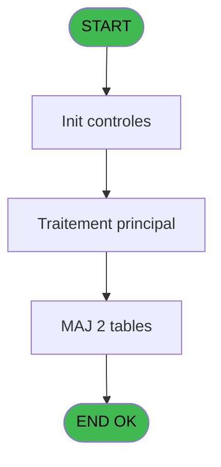
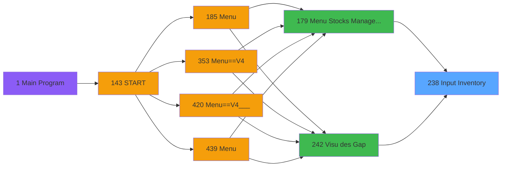
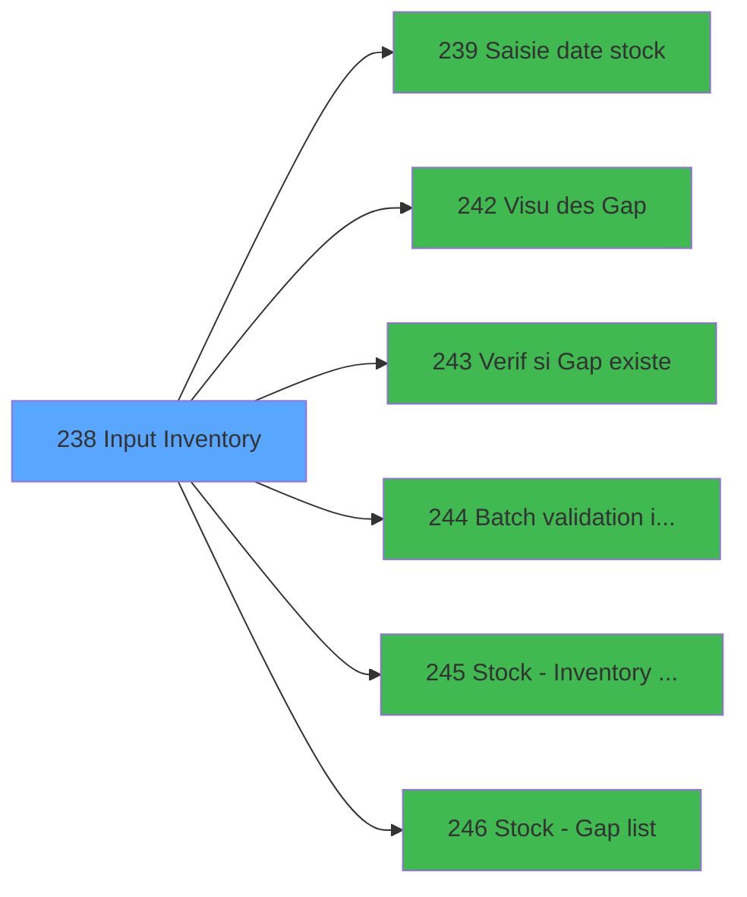

# PVE IDE 238 - Input Inventory

> **Analyse**: Phases 1-4 2026-02-03 19:07 -> 19:08 (17s) | Assemblage 19:08
> **Pipeline**: V7.2 Enrichi
> **Structure**: 4 onglets (Resume | Ecrans | Donnees | Connexions)

<!-- TAB:Resume -->

## 1. FICHE D'IDENTITE

| Attribut | Valeur |
|----------|--------|
| Projet | PVE |
| IDE Position | 238 |
| Nom Programme | Input Inventory |
| Fichier source | `Prg_238.xml` |
| Dossier IDE | Stocks |
| Taches | 5 (1 ecrans visibles) |
| Tables modifiees | 2 |
| Programmes appeles | 6 |

## 2. DESCRIPTION FONCTIONNELLE

**Input Inventory** assure la gestion complete de ce processus, accessible depuis [Menu Stocks Management (IDE 179)](PVE-IDE-179.md), [Visu des Gap (IDE 242)](PVE-IDE-242.md).

Le flux de traitement s'organise en **3 blocs fonctionnels** :

- **Traitement** (3 taches) : traitements metier divers
- **Validation** (1 tache) : controles et verifications de coherence
- **Consultation** (1 tache) : ecrans de recherche, selection et consultation

**Donnees modifiees** : 2 tables en ecriture (stat_jour, log_effectif_envoi).

**Logique metier** : 2 regles identifiees couvrant conditions metier.

Detail : phases du traitement

#### Phase 1 : Traitement (3 taches)

- **238** - Input Inventory **[[ECRAN]](#ecran-t1)**
- **238.2** - suppress inventaire en cours
- **238.2.1** - suppression ligne

Delegue a : [Visu des Gap (IDE 242)](PVE-IDE-242.md)

#### Phase 2 : Consultation (1 tache)

- **238.1** - Recherche chrono

#### Phase 3 : Validation (1 tache)

- **238.3** - Input Validate/Save Inventory **[[ECRAN]](#ecran-t5)**

Delegue a : [Verif si Gap existe (IDE 243)](PVE-IDE-243.md), [Batch validation inventory (IDE 244)](PVE-IDE-244.md)

#### Tables impactees

| Table | Operations | Role metier |
|-------|-----------|-------------|
| log_effectif_envoi | **W**/L (4 usages) |  |
| stat_jour | **W**/L (3 usages) |  |

## 3. BLOCS FONCTIONNELS

### 3.1 Traitement (3 taches)

Traitements internes.

---

#### 238 - Input Inventory [[ECRAN]](#ecran-t1)

**Role** : Traitement : Input Inventory.
**Ecran** : 542 x 413 DLU (Type6) | [Voir mockup](#ecran-t1)
**Variables liees** : F (Bt.Prin Stock Inventory)
**Delegue a** : [Visu des Gap (IDE 242)](PVE-IDE-242.md)

---

#### 238.2 - suppress inventaire en cours

**Role** : Traitement : suppress inventaire en cours.
**Variables liees** : O (V.Suppress ?), Q (V.Inventaire rouvert ?), S (v.ConfirmSuppression)
**Delegue a** : [Visu des Gap (IDE 242)](PVE-IDE-242.md)

---

#### 238.2.1 - suppression ligne

**Role** : Traitement : suppression ligne.
**Variables liees** : S (v.ConfirmSuppression)
**Delegue a** : [Visu des Gap (IDE 242)](PVE-IDE-242.md)

### 3.2 Consultation (1 tache)

Ecrans de recherche et consultation.

---

#### 238.1 - Recherche chrono

**Role** : Traitement : Recherche chrono.
**Variables liees** : J (V.Chrono)

### 3.3 Validation (1 tache)

Controles de coherence : 1 tache verifie les donnees et conditions.

---

#### 238.3 - Input Validate/Save Inventory [[ECRAN]](#ecran-t5)

**Role** : Verification : Input Validate/Save Inventory.
**Ecran** : 560 x 367 DLU (Type6) | [Voir mockup](#ecran-t5)
**Variables liees** : F (Bt.Prin Stock Inventory)
**Delegue a** : [Verif si Gap existe (IDE 243)](PVE-IDE-243.md), [Batch validation inventory (IDE 244)](PVE-IDE-244.md)

## 5. REGLES METIER

2 regles identifiees:

### Autres (2 regles)

#### [RM-001] Si [X]='O' alors 6 sinon 3)

| Element | Detail |
|---------|--------|
| **Condition** | `[X]='O'` |
| **Si vrai** | 6 |
| **Si faux** | 3) |
| **Expression source** | Expression 38 : `IF([X]='O',6,3)` |
| **Exemple** | Si [X]='O' → 6. Sinon → 3) |

#### [RM-002] Si VG128 alors 'V.Combo article Actif [C]'FORM sinon 'V S/Category [B]'FORM)

| Element | Detail |
|---------|--------|
| **Condition** | `VG128` |
| **Si vrai** | 'V.Combo article Actif [C]'FORM |
| **Si faux** | 'V S/Category [B]'FORM) |
| **Variables** | B (V S/Category), C (V.Combo article Actif) |
| **Expression source** | Expression 43 : `IF(VG128,'V.Combo article Actif [C]'FORM,'V S/Category [B]'F` |
| **Exemple** | Si VG128 → 'V.Combo article Actif [C]'FORM. Sinon → 'V S/Category [B]'FORM) |

## 6. CONTEXTE

- **Appele par**: [Menu Stocks Management (IDE 179)](PVE-IDE-179.md), [Visu des Gap (IDE 242)](PVE-IDE-242.md)
- **Appelle**: 6 programmes | **Tables**: 6 (W:2 R:2 L:5) | **Taches**: 5 | **Expressions**: 49

<!-- TAB:Ecrans -->

## 8. ECRANS

### 8.1 Forms visibles (1 / 5)

| # | Position | Tache | Nom | Type | Largeur | Hauteur | Bloc |
|---|----------|-------|-----|------|---------|---------|------|
| 1 | 238 | 238 | Input Inventory | Type6 | 542 | 413 | Traitement |

### 8.2 Mockups Ecrans

---

#### 238 - Input Inventory
**Tache** : [238](#t1) | **Type** : Type6 | **Dimensions** : 542 x 413 DLU
**Bloc** : Traitement | **Titre IDE** : Input Inventory

<!-- FORM-DATA:
{
    "width":  542,
    "vFactor":  8,
    "type":  "Type6",
    "hFactor":  4,
    "controls":  [
                     {
                         "x":  4,
                         "type":  "table",
                         "var":  "",
                         "name":  "",
                         "titleH":  24,
                         "color":  "110",
                         "w":  503,
                         "y":  75,
                         "fmt":  "",
                         "parent":  null,
                         "text":  "",
                         "rowH":  21,
                         "h":  294,
                         "cols":  [
                                      {
                                          "title":  "Category",
                                          "layer":  1,
                                          "w":  124
                                      },
                                      {
                                          "title":  "Sub category",
                                          "layer":  2,
                                          "w":  126
                                      },
                                      {
                                          "title":  "Product",
                                          "layer":  3,
                                          "w":  131
                                      },
                                      {
                                          "title":  "Unit",
                                          "layer":  4,
                                          "w":  37
                                      },
                                      {
                                          "title":  "Physical Quantity",
                                          "layer":  5,
                                          "w":  81
                                      }
                                  ],
                         "rows":  5
                     },
                     {
                         "x":  4,
                         "type":  "label",
                         "var":  "",
                         "y":  374,
                         "w":  536,
                         "fmt":  "",
                         "name":  "",
                         "h":  35,
                         "color":  "6",
                         "text":  "",
                         "parent":  null
                     },
                     {
                         "x":  4,
                         "type":  "label",
                         "var":  "",
                         "y":  0,
                         "w":  536,
                         "fmt":  "",
                         "name":  "",
                         "h":  42,
                         "color":  "186",
                         "text":  "",
                         "parent":  null
                     },
                     {
                         "x":  20,
                         "type":  "label",
                         "var":  "",
                         "y":  16,
                         "w":  235,
                         "fmt":  "",
                         "name":  "",
                         "h":  10,
                         "color":  "186",
                         "text":  "Input inventory",
                         "parent":  17
                     },
                     {
                         "x":  4,
                         "type":  "label",
                         "var":  "",
                         "y":  45,
                         "w":  536,
                         "fmt":  "",
                         "name":  "",
                         "h":  27,
                         "color":  "183",
                         "text":  "Inventory",
                         "parent":  null
                     },
                     {
                         "x":  21,
                         "type":  "label",
                         "var":  "",
                         "y":  55,
                         "w":  13,
                         "fmt":  "",
                         "name":  "",
                         "h":  12,
                         "color":  "183",
                         "text":  "#",
                         "parent":  20
                     },
                     {
                         "x":  82,
                         "type":  "label",
                         "var":  "",
                         "y":  55,
                         "w":  60,
                         "fmt":  "",
                         "name":  "",
                         "h":  12,
                         "color":  "183",
                         "text":  "Last Update",
                         "parent":  20
                     },
                     {
                         "x":  8,
                         "type":  "edit",
                         "var":  "",
                         "y":  102,
                         "w":  118,
                         "fmt":  "",
                         "name":  "V Category",
                         "h":  16,
                         "color":  "6",
                         "text":  "",
                         "parent":  1
                     },
                     {
                         "x":  133,
                         "type":  "edit",
                         "var":  "",
                         "y":  102,
                         "w":  119,
                         "fmt":  "",
                         "name":  "V S/Category",
                         "h":  16,
                         "color":  "6",
                         "text":  "",
                         "parent":  1
                     },
                     {
                         "x":  258,
                         "type":  "edit",
                         "var":  "",
                         "y":  102,
                         "w":  127,
                         "fmt":  "",
                         "name":  "CTRL_001",
                         "h":  16,
                         "color":  "6",
                         "text":  "",
                         "parent":  1
                     },
                     {
                         "x":  390,
                         "type":  "edit",
                         "var":  "",
                         "y":  102,
                         "w":  30,
                         "fmt":  "",
                         "name":  "CTRL_003",
                         "h":  16,
                         "color":  "6",
                         "text":  "",
                         "parent":  1
                     },
                     {
                         "x":  425,
                         "type":  "edit",
                         "var":  "",
                         "y":  102,
                         "w":  79,
                         "fmt":  "N10.3",
                         "name":  "Quantity",
                         "h":  16,
                         "color":  "6",
                         "text":  "",
                         "parent":  1
                     },
                     {
                         "x":  507,
                         "type":  "button",
                         "var":  "",
                         "y":  75,
                         "w":  32,
                         "fmt":  "ñ",
                         "name":  "",
                         "h":  145,
                         "color":  "",
                         "text":  "",
                         "parent":  null
                     },
                     {
                         "x":  507,
                         "type":  "button",
                         "var":  "",
                         "y":  220,
                         "w":  32,
                         "fmt":  "ò",
                         "name":  "",
                         "h":  149,
                         "color":  "",
                         "text":  "",
                         "parent":  null
                     },
                     {
                         "x":  411,
                         "type":  "button",
                         "var":  "",
                         "y":  380,
                         "w":  62,
                         "fmt":  "\u0026Validate",
                         "name":  "VALID",
                         "h":  28,
                         "color":  "",
                         "text":  "",
                         "parent":  null
                     },
                     {
                         "x":  474,
                         "type":  "button",
                         "var":  "",
                         "y":  380,
                         "w":  62,
                         "fmt":  "\u0026Exit",
                         "name":  "EXIT",
                         "h":  28,
                         "color":  "",
                         "text":  "",
                         "parent":  null
                     },
                     {
                         "x":  491,
                         "type":  "image",
                         "var":  "",
                         "y":  4,
                         "w":  48,
                         "fmt":  "",
                         "name":  "",
                         "h":  37,
                         "color":  "",
                         "text":  "",
                         "parent":  17
                     },
                     {
                         "x":  36,
                         "type":  "edit",
                         "var":  "",
                         "y":  55,
                         "w":  41,
                         "fmt":  "",
                         "name":  "inv_chrono",
                         "h":  12,
                         "color":  "187",
                         "text":  "",
                         "parent":  20
                     },
                     {
                         "x":  148,
                         "type":  "edit",
                         "var":  "",
                         "y":  55,
                         "w":  68,
                         "fmt":  "",
                         "name":  "inv_date_dern_modif",
                         "h":  12,
                         "color":  "187",
                         "text":  "",
                         "parent":  20
                     },
                     {
                         "x":  219,
                         "type":  "edit",
                         "var":  "",
                         "y":  55,
                         "w":  53,
                         "fmt":  "",
                         "name":  "inv_heure_dern_modif",
                         "h":  12,
                         "color":  "187",
                         "text":  "",
                         "parent":  20
                     },
                     {
                         "x":  5,
                         "type":  "button",
                         "var":  "",
                         "y":  380,
                         "w":  62,
                         "fmt":  "\u0026Print Stock",
                         "name":  "PRINT_STOCK",
                         "h":  28,
                         "color":  "",
                         "text":  "",
                         "parent":  null
                     },
                     {
                         "x":  66,
                         "type":  "button",
                         "var":  "",
                         "y":  380,
                         "w":  85,
                         "fmt":  "Print \u0026Stock Gap",
                         "name":  "PRINT_GAP",
                         "h":  28,
                         "color":  "",
                         "text":  "",
                         "parent":  null
                     },
                     {
                         "x":  348,
                         "type":  "button",
                         "var":  "",
                         "y":  380,
                         "w":  62,
                         "fmt":  "\u0026Save",
                         "name":  "Sauvegarder",
                         "h":  28,
                         "color":  "",
                         "text":  "",
                         "parent":  null
                     },
                     {
                         "x":  409,
                         "type":  "combobox",
                         "var":  "",
                         "y":  55,
                         "w":  95,
                         "fmt":  "",
                         "name":  "V.Combo article Actif",
                         "h":  12,
                         "color":  "183",
                         "text":  "A,O,N",
                         "parent":  20
                     },
                     {
                         "x":  285,
                         "type":  "button",
                         "var":  "",
                         "y":  380,
                         "w":  62,
                         "fmt":  "\u0026Reset",
                         "name":  "Remise a zero",
                         "h":  28,
                         "color":  "",
                         "text":  "",
                         "parent":  null
                     }
                 ],
    "taskId":  "238",
    "height":  413
}
-->

<strong>Champs : 9 champs</strong>

| Pos (x,y) | Nom | Variable | Type |
|-----------|-----|----------|------|
| 8,102 | V Category | - | edit |
| 133,102 | V S/Category | - | edit |
| 258,102 | CTRL_001 | - | edit |
| 390,102 | CTRL_003 | - | edit |
| 425,102 | Quantity | - | edit |
| 36,55 | inv_chrono | - | edit |
| 148,55 | inv_date_dern_modif | - | edit |
| 219,55 | inv_heure_dern_modif | - | edit |
| 409,55 | V.Combo article Actif | - | combobox |

<strong>Boutons : 8 boutons</strong>

| Bouton | Pos (x,y) | Action |
|--------|-----------|--------|
| ñ | 507,75 | Bouton fonctionnel |
| ò | 507,220 | Bouton fonctionnel |
| Validate | 411,380 | Appel [Batch validation inventory (IDE 244)](PVE-IDE-244.md) |
| Exit | 474,380 | Quitte le programme |
| Print Stock | 5,380 | Lance l'impression |
| Print Stock Gap | 66,380 | Lance l'impression |
| Save | 348,380 | Bouton fonctionnel |
| Reset | 285,380 | Bouton fonctionnel |

## 9. NAVIGATION

Ecran unique: **Input Inventory**

### 9.3 Structure hierarchique (5 taches)

| Position | Tache | Type | Dimensions | Bloc |
|----------|-------|------|------------|------|
| **238.1** | [**Input Inventory** (238)](#t1) [mockup](#ecran-t1) | Type6 | 542x413 | Traitement |
| 238.1.1 | [suppress inventaire en cours (238.2)](#t3) | - | - | |
| 238.1.2 | [suppression ligne (238.2.1)](#t4) | - | - | |
| **238.2** | [**Recherche chrono** (238.1)](#t2) | - | - | Consultation |
| **238.3** | [**Input Validate/Save Inventory** (238.3)](#t5) [mockup](#ecran-t5) | Type6 | 560x367 | Validation |

### 9.4 Algorigramme

> **Legende**: Vert = START/END OK | Rouge = END KO | Bleu = Decisions
> *Algorigramme auto-genere. Utiliser `/algorigramme` pour une synthese metier detaillee.*

<!-- TAB:Donnees -->

## 10. TABLES

### Tables utilisees (6)

| ID | Nom | Description | Type | R | W | L | Usages |
|----|-----|-------------|------|---|---|---|--------|
| 379 | pv_customer_temp |  | DB | R |   |   | 1 |
| 403 | pv_sellers |  | DB | R |   | L | 2 |
| 413 | pv_tva |  | DB |   |   | L | 1 |
| 759 | Temp_service_cash | Services / filieres | DB |   |   | L | 1 |
| 796 | stat_jour |  | DB |   | **W** | L | 3 |
| 797 | log_effectif_envoi |  | DB |   | **W** | L | 4 |

### Colonnes par table (2 / 4 tables avec colonnes identifiees)

Table 379 - pv_customer_temp (R) - 1 usages

| Lettre | Variable | Acces | Type |
|--------|----------|-------|------|
| A | V Category | R | Alpha |
| B | V S/Category | R | Alpha |
| C | V.Combo article Actif | R | Unicode |
| D | v.Géré en stock par détail ? | R | Logical |
| E | v.unite de PC | R | Numeric |
| F | Bt.Prin Stock Inventory | R | Alpha |
| G | Bt.Print Stock Gap | R | Alpha |
| H | Bt.Reset | R | Alpha |
| I | Bt.Valider | R | Alpha |
| J | V.Chrono | R | Numeric |
| K | V.Existe Gap ? | R | Logical |
| L | V.Valider ? | R | Logical |
| M | V.Date | R | Date |
| N | V.Heure | R | Time |
| O | V.Suppress ? | R | Logical |
| P | V.Valeur Separateur Milliers | R | Alpha |
| Q | V.Inventaire rouvert ? | R | Logical |
| R | RecordUpdated | R | Logical |
| S | v.ConfirmSuppression | R | Numeric |
| T | CHG_REASON_V.Combo article Act | R | Numeric |
| U | CHG_PRV_V.Combo article Actif | R | Unicode |

Table 403 - pv_sellers (R/L) - 2 usages

| Lettre | Variable | Acces | Type |
|--------|----------|-------|------|
| A | P.Inventory chrono | R | Numeric |
| B | V.Existe ligne inventaire ? | R | Logical |

Table 796 - stat_jour (**W**/L) - 3 usages

*Table utilisee uniquement en Link ou aucune colonne Real identifiee dans le DataView.*

Table 797 - log_effectif_envoi (**W**/L) - 4 usages

*Table utilisee uniquement en Link ou aucune colonne Real identifiee dans le DataView.*

## 11. VARIABLES

### 11.1 Variables de session (14)

Variables persistantes pendant toute la session.

| Lettre | Nom | Type | Usage dans |
|--------|-----|------|-----------|
| A | V Category | Alpha | 1x session |
| B | V S/Category | Alpha | 3x session |
| C | V.Combo article Actif | Unicode | 3x session |
| D | v.Géré en stock par détail ? | Logical | - |
| E | v.unite de PC | Numeric | - |
| J | V.Chrono | Numeric | - |
| K | V.Existe Gap ? | Logical | - |
| L | V.Valider ? | Logical | - |
| M | V.Date | Date | 1x session |
| N | V.Heure | Time | - |
| O | V.Suppress ? | Logical | - |
| P | V.Valeur Separateur Milliers | Alpha | - |
| Q | V.Inventaire rouvert ? | Logical | - |
| S | v.ConfirmSuppression | Numeric | - |

### 11.2 Autres (7)

Variables diverses.

| Lettre | Nom | Type | Usage dans |
|--------|-----|------|-----------|
| F | Bt.Prin Stock Inventory | Alpha | [238](#t1), [238.3](#t5) |
| G | Bt.Print Stock Gap | Alpha | - |
| H | Bt.Reset | Alpha | - |
| I | Bt.Valider | Alpha | - |
| R | RecordUpdated | Logical | 1x refs |
| T | CHG_REASON_V.Combo article Act | Numeric | - |
| U | CHG_PRV_V.Combo article Actif | Unicode | - |

Toutes les 21 variables (liste complete)

| Cat | Lettre | Nom Variable | Type |
|-----|--------|--------------|------|
| V. | **A** | V Category | Alpha |
| V. | **B** | V S/Category | Alpha |
| V. | **C** | V.Combo article Actif | Unicode |
| V. | **D** | v.Géré en stock par détail ? | Logical |
| V. | **E** | v.unite de PC | Numeric |
| V. | **J** | V.Chrono | Numeric |
| V. | **K** | V.Existe Gap ? | Logical |
| V. | **L** | V.Valider ? | Logical |
| V. | **M** | V.Date | Date |
| V. | **N** | V.Heure | Time |
| V. | **O** | V.Suppress ? | Logical |
| V. | **P** | V.Valeur Separateur Milliers | Alpha |
| V. | **Q** | V.Inventaire rouvert ? | Logical |
| V. | **S** | v.ConfirmSuppression | Numeric |
| Autre | **F** | Bt.Prin Stock Inventory | Alpha |
| Autre | **G** | Bt.Print Stock Gap | Alpha |
| Autre | **H** | Bt.Reset | Alpha |
| Autre | **I** | Bt.Valider | Alpha |
| Autre | **R** | RecordUpdated | Logical |
| Autre | **T** | CHG_REASON_V.Combo article Act | Numeric |
| Autre | **U** | CHG_PRV_V.Combo article Actif | Unicode |

## 12. EXPRESSIONS

**49 / 49 expressions decodees (100%)**

### 12.1 Repartition par type

| Type | Expressions | Regles |
|------|-------------|--------|
| CONCATENATION | 2 | 0 |
| CALCULATION | 2 | 0 |
| CONDITION | 7 | 2 |
| CONSTANTE | 4 | 0 |
| DATE | 1 | 0 |
| OTHER | 23 | 0 |
| CAST_LOGIQUE | 6 | 0 |
| REFERENCE_VG | 4 | 0 |

### 12.2 Expressions cles par type

#### CONCATENATION (2 expressions)

| Type | IDE | Expression | Regle |
|------|-----|------------|-------|
| CONCATENATION | 6 | `Str (V.Combo article Actif [C],'2P0')&' - '&RecordUpdated [R]` | - |
| CONCATENATION | 4 | `Str (V S/Category [B],'2P0')&' - '&V.Date [M]` | - |

#### CALCULATION (2 expressions)

| Type | IDE | Expression | Regle |
|------|-----|------------|-------|
| CALCULATION | 41 | `[AR]*[AF]` | - |
| CALCULATION | 40 | `[AQ]/[AF]` | - |

#### CONDITION (7 expressions)

| Type | IDE | Expression | Regle |
|------|-----|------------|-------|
| CONDITION | 43 | `IF(VG128,'V.Combo article Actif [C]'FORM,'V S/Category [B]'FORM)` | [RM-002](#rm-RM-002) |
| CONDITION | 38 | `IF([X]='O',6,3)` | [RM-001](#rm-RM-001) |
| CONDITION | 48 | `CndRange([BF]<>'' AND [BF]<>'A',[BF])` | - |
| CONDITION | 44 | `Trim([V])=Trim(VG130)` | - |
| CONDITION | 39 | `[X]='O'` | - |
| ... | | *+2 autres* | |

#### CONSTANTE (4 expressions)

| Type | IDE | Expression | Regle |
|------|-----|------------|-------|
| CONSTANTE | 47 | `'O'` | - |
| CONSTANTE | 49 | `0` | - |
| CONSTANTE | 24 | `'M'` | - |
| CONSTANTE | 31 | `'V'` | - |

#### DATE (1 expressions)

| Type | IDE | Expression | Regle |
|------|-----|------------|-------|
| DATE | 9 | `Date()` | - |

#### OTHER (23 expressions)

| Type | IDE | Expression | Regle |
|------|-----|------------|-------|
| OTHER | 22 | `GetParam('CURRENCYVALUE')` | - |
| OTHER | 23 | `GetParam('AMOUNTFORMAT')` | - |
| OTHER | 21 | `GetParam('HEADERLINE01')` | - |
| OTHER | 19 | `[AX]` | - |
| OTHER | 20 | `CHG_PRV_V.Combo articl... [U]` | - |
| ... | | *+18 autres* | |

#### CAST_LOGIQUE (6 expressions)

| Type | IDE | Expression | Regle |
|------|-----|------------|-------|
| CAST_LOGIQUE | 34 | `'FALSE'LOG` | - |
| CAST_LOGIQUE | 37 | `CndRange(VG110, 'FALSE'LOG)` | - |
| CAST_LOGIQUE | 46 | `Rollback('FALSE'LOG,1)` | - |
| CAST_LOGIQUE | 7 | `'FALSE'LOG` | - |
| CAST_LOGIQUE | 18 | `'TRUE'LOG` | - |
| ... | | *+1 autres* | |

#### REFERENCE_VG (4 expressions)

| Type | IDE | Expression | Regle |
|------|-----|------------|-------|
| REFERENCE_VG | 35 | `VG94` | - |
| REFERENCE_VG | 42 | `VG128` | - |
| REFERENCE_VG | 11 | `VG1` | - |
| REFERENCE_VG | 32 | `VG94` | - |

### 12.3 Toutes les expressions (49)

Voir les 49 expressions

#### CONCATENATION (2)

| IDE | Expression Decodee |
|-----|-------------------|
| 4 | `Str (V S/Category [B],'2P0')&' - '&V.Date [M]` |
| 6 | `Str (V.Combo article Actif [C],'2P0')&' - '&RecordUpdated [R]` |

#### CALCULATION (2)

| IDE | Expression Decodee |
|-----|-------------------|
| 40 | `[AQ]/[AF]` |
| 41 | `[AR]*[AF]` |

#### CONDITION (7)

| IDE | Expression Decodee |
|-----|-------------------|
| 38 | `IF([X]='O',6,3)` |
| 43 | `IF(VG128,'V.Combo article Actif [C]'FORM,'V S/Category [B]'FORM)` |
| 25 | `[AY]<>0` |
| 29 | `[BE] = 6 OR NOT ([BD])` |
| 39 | `[X]='O'` |
| 48 | `CndRange([BF]<>'' AND [BF]<>'A',[BF])` |
| 44 | `Trim([V])=Trim(VG130)` |

#### CONSTANTE (4)

| IDE | Expression Decodee |
|-----|-------------------|
| 24 | `'M'` |
| 31 | `'V'` |
| 47 | `'O'` |
| 49 | `0` |

#### DATE (1)

| IDE | Expression Decodee |
|-----|-------------------|
| 9 | `Date()` |

#### OTHER (23)

| IDE | Expression Decodee |
|-----|-------------------|
| 1 | `GetParam ('SERVICE')` |
| 2 | `V Category [A]` |
| 3 | `V S/Category [B]` |
| 5 | `V.Combo article Actif [C]` |
| 8 | `[AV]` |
| 10 | `Time()` |
| 12 | `Bt.Prin Stock Inventory [F]` |
| 13 | `v.Géré en stock par dé... [D]` |
| 14 | `CHG_REASON_V.Combo art... [T]` |
| 15 | `[AE]` |
| 16 | `[AD]` |
| 17 | `[AW]` |
| 19 | `[AX]` |
| 20 | `CHG_PRV_V.Combo articl... [U]` |
| 21 | `GetParam('HEADERLINE01')` |
| 22 | `GetParam('CURRENCYVALUE')` |
| 23 | `GetParam('AMOUNTFORMAT')` |
| 26 | `[BA]` |
| 27 | `MlsTrans('All changes will be lost ! Are you sure you want to quit ?')` |
| 28 | `[BD]` |
| 33 | `[BC]` |
| 36 | `v.Géré en stock par dé... [D]` |
| 45 | `'Quantity '&VG130` |

#### CAST_LOGIQUE (6)

| IDE | Expression Decodee |
|-----|-------------------|
| 7 | `'FALSE'LOG` |
| 18 | `'TRUE'LOG` |
| 30 | `'TRUE'LOG` |
| 34 | `'FALSE'LOG` |
| 37 | `CndRange(VG110, 'FALSE'LOG)` |
| 46 | `Rollback('FALSE'LOG,1)` |

#### REFERENCE_VG (4)

| IDE | Expression Decodee |
|-----|-------------------|
| 11 | `VG1` |
| 32 | `VG94` |
| 35 | `VG94` |
| 42 | `VG128` |

<!-- TAB:Connexions -->

## 13. GRAPHE D'APPELS

### 13.1 Chaine depuis Main (Callers)

Main -> ... -> [Menu Stocks Management (IDE 179)](PVE-IDE-179.md) -> **Input Inventory (IDE 238)**

Main -> ... -> [Visu des Gap (IDE 242)](PVE-IDE-242.md) -> **Input Inventory (IDE 238)**

### 13.2 Callers

| IDE | Nom Programme | Nb Appels |
|-----|---------------|-----------|
| [179](PVE-IDE-179.md) | Menu Stocks Management | 1 |
| [242](PVE-IDE-242.md) | Visu des Gap | 1 |

### 13.3 Callees (programmes appeles)

### 13.4 Detail Callees avec contexte

| IDE | Nom Programme | Appels | Contexte |
|-----|---------------|--------|----------|
| [239](PVE-IDE-239.md) | Saisie date stock | 2 | Calcul de donnees |
| [242](PVE-IDE-242.md) | Visu des Gap | 1 | Sous-programme |
| [243](PVE-IDE-243.md) | Verif si Gap existe | 1 | Controle/validation |
| [244](PVE-IDE-244.md) | Batch validation inventory | 1 | Sous-programme |
| [245](PVE-IDE-245.md) | Stock - Inventory list | 1 | Calcul de donnees |
| [246](PVE-IDE-246.md) | Stock - Gap list | 1 | Calcul de donnees |

## 14. RECOMMANDATIONS MIGRATION

### 14.1 Profil du programme

| Metrique | Valeur | Impact migration |
|----------|--------|-----------------|
| Lignes de logique | 205 | Taille moyenne |
| Expressions | 49 | Peu de logique |
| Tables WRITE | 2 | Impact faible |
| Sous-programmes | 6 | Dependances moderees |
| Ecrans visibles | 1 | Ecran unique ou traitement batch |
| Code desactive | 0% (0 / 205) | Code sain |
| Regles metier | 2 | Quelques regles a preserver |

### 14.2 Plan de migration par bloc

#### Traitement (3 taches: 1 ecran, 2 traitements)

- **Strategie** : Orchestrateur avec 1 ecrans (Razor/React) et 2 traitements backend (services).
- Les ecrans deviennent des composants UI, les traitements invisibles deviennent des services injectables.
- 6 sous-programme(s) a migrer ou a reutiliser depuis les services existants.
- Decomposer les taches en services unitaires testables.

#### Consultation (1 tache: 0 ecran, 1 traitement)

- **Strategie** : Composants de recherche/selection en modales.

#### Validation (1 tache: 1 ecran, 0 traitement)

- **Strategie** : FluentValidation avec validators specifiques.
- Chaque tache de validation -> un validator injectable

### 14.3 Dependances critiques

| Dependance | Type | Appels | Impact |
|------------|------|--------|--------|
| stat_jour | Table WRITE (Database) | 1x | Schema + repository |
| log_effectif_envoi | Table WRITE (Database) | 2x | Schema + repository |
| [Saisie date stock (IDE 239)](PVE-IDE-239.md) | Sous-programme | 2x | Haute - Calcul de donnees |
| [Stock - Inventory list (IDE 245)](PVE-IDE-245.md) | Sous-programme | 1x | Normale - Calcul de donnees |
| [Stock - Gap list (IDE 246)](PVE-IDE-246.md) | Sous-programme | 1x | Normale - Calcul de donnees |
| [Batch validation inventory (IDE 244)](PVE-IDE-244.md) | Sous-programme | 1x | Normale - Sous-programme |
| [Visu des Gap (IDE 242)](PVE-IDE-242.md) | Sous-programme | 1x | Normale - Sous-programme |
| [Verif si Gap existe (IDE 243)](PVE-IDE-243.md) | Sous-programme | 1x | Normale - Controle/validation |

---
*Spec DETAILED generee par Pipeline V7.2 - 2026-02-03 19:08*
