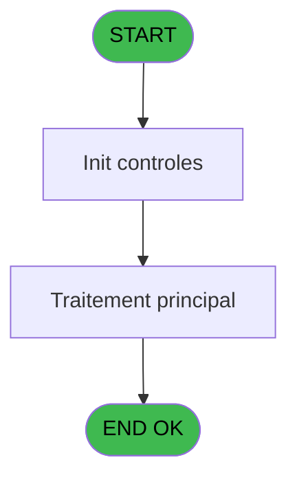
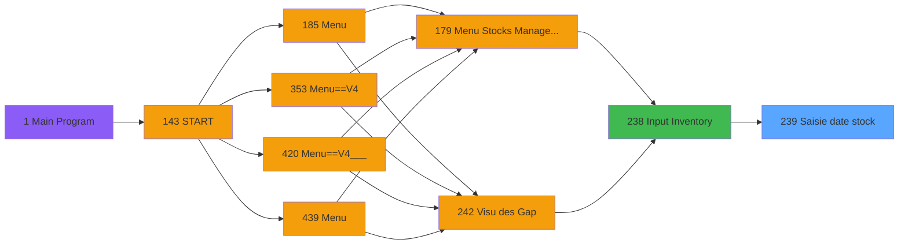
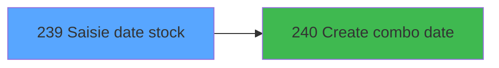

# PVE IDE 239 - Saisie date stock

> **Analyse**: Phases 1-4 2026-02-03 19:08 -> 19:08 (17s) | Assemblage 19:08
> **Pipeline**: V7.2 Enrichi
> **Structure**: 4 onglets (Resume | Ecrans | Donnees | Connexions)

<!-- TAB:Resume -->

## 1. FICHE D'IDENTITE

| Attribut | Valeur |
|----------|--------|
| Projet | PVE |
| IDE Position | 239 |
| Nom Programme | Saisie date stock |
| Fichier source | `Prg_239.xml` |
| Dossier IDE | Stocks |
| Taches | 1 (1 ecrans visibles) |
| Tables modifiees | 0 |
| Programmes appeles | 1 |

## 2. DESCRIPTION FONCTIONNELLE

**Saisie date stock** assure la gestion complete de ce processus, accessible depuis [Input Inventory (IDE 238)](PVE-IDE-238.md).

Le flux de traitement s'organise en **1 blocs fonctionnels** :

- **Saisie** (1 tache) : ecrans de saisie utilisateur (formulaires, champs, donnees)

**Logique metier** : 1 regles identifiees couvrant conditions metier.

## 3. BLOCS FONCTIONNELS

### 3.1 Saisie (1 tache)

L'operateur saisit les donnees de la transaction via 1 ecran (Saisie date stock).

---

#### 239 - Saisie date stock [[ECRAN]](#ecran-t1)

**Role** : Saisie des donnees : Saisie date stock.
**Ecran** : 237 x 138 DLU | [Voir mockup](#ecran-t1)
**Variables liees** : A (P.Type date(M:Modif,V:Valid)), B (P.Date)

## 5. REGLES METIER

1 regles identifiees:

### Autres (1 regles)

#### [RM-001] Si VG94 alors 'Date - Heure' sinon 'Date')

| Element | Detail |
|---------|--------|
| **Condition** | `VG94` |
| **Si vrai** | 'Date - Heure' |
| **Si faux** | 'Date') |
| **Expression source** | Expression 11 : `IF(VG94,'Date - Heure','Date')` |
| **Exemple** | Si VG94 → 'Date - Heure'. Sinon → 'Date') |

## 6. CONTEXTE

- **Appele par**: [Input Inventory (IDE 238)](PVE-IDE-238.md)
- **Appelle**: 1 programmes | **Tables**: 0 (W:0 R:0 L:0) | **Taches**: 1 | **Expressions**: 12

<!-- TAB:Ecrans -->

## 8. ECRANS

### 8.1 Forms visibles (1 / 1)

| # | Position | Tache | Nom | Type | Largeur | Hauteur | Bloc |
|---|----------|-------|-----|------|---------|---------|------|
| 1 | 239 | 239 | Saisie date stock | Type0 | 237 | 138 | Saisie |

### 8.2 Mockups Ecrans

---

#### 239 - Saisie date stock
**Tache** : [239](#t1) | **Type** : Type0 | **Dimensions** : 237 x 138 DLU
**Bloc** : Saisie | **Titre IDE** : Saisie date stock

<!-- FORM-DATA:
{
    "width":  237,
    "vFactor":  8,
    "type":  "Type0",
    "hFactor":  4,
    "controls":  [
                     {
                         "x":  42,
                         "type":  "label",
                         "var":  "",
                         "y":  48,
                         "w":  153,
                         "fmt":  "",
                         "name":  "",
                         "h":  10,
                         "color":  "187",
                         "text":  "Select the date you want to print",
                         "parent":  null
                     },
                     {
                         "x":  20,
                         "type":  "label",
                         "var":  "",
                         "y":  66,
                         "w":  62,
                         "fmt":  "",
                         "name":  "",
                         "h":  11,
                         "color":  "183",
                         "text":  "Date - Heure",
                         "parent":  null
                     },
                     {
                         "x":  0,
                         "type":  "label",
                         "var":  "",
                         "y":  1,
                         "w":  233,
                         "fmt":  "",
                         "name":  "",
                         "h":  42,
                         "color":  "182",
                         "text":  "",
                         "parent":  null
                     },
                     {
                         "x":  16,
                         "type":  "label",
                         "var":  "",
                         "y":  16,
                         "w":  91,
                         "fmt":  "",
                         "name":  "",
                         "h":  10,
                         "color":  "186",
                         "text":  "Date selection",
                         "parent":  3
                     },
                     {
                         "x":  0,
                         "type":  "label",
                         "var":  "",
                         "y":  103,
                         "w":  235,
                         "fmt":  "",
                         "name":  "",
                         "h":  34,
                         "color":  "6",
                         "text":  "",
                         "parent":  null
                     },
                     {
                         "x":  183,
                         "type":  "image",
                         "var":  "",
                         "y":  5,
                         "w":  48,
                         "fmt":  "",
                         "name":  "",
                         "h":  37,
                         "color":  "",
                         "text":  "",
                         "parent":  3
                     },
                     {
                         "x":  91,
                         "type":  "combobox",
                         "var":  "",
                         "y":  66,
                         "w":  138,
                         "fmt":  "",
                         "name":  "V.date",
                         "h":  12,
                         "color":  "110",
                         "text":  "",
                         "parent":  null
                     },
                     {
                         "x":  82,
                         "type":  "button",
                         "var":  "",
                         "y":  108,
                         "w":  77,
                         "fmt":  "\u0026Cancel",
                         "name":  "Bt.Cancel",
                         "h":  28,
                         "color":  "",
                         "text":  "",
                         "parent":  null
                     },
                     {
                         "x":  158,
                         "type":  "button",
                         "var":  "",
                         "y":  108,
                         "w":  77,
                         "fmt":  "\u0026Print",
                         "name":  "Bt.Print",
                         "h":  28,
                         "color":  "",
                         "text":  "",
                         "parent":  null
                     }
                 ],
    "taskId":  "239",
    "height":  138
}
-->

<strong>Champs : 1 champs</strong>

| Pos (x,y) | Nom | Variable | Type |
|-----------|-----|----------|------|
| 91,66 | V.date | - | combobox |

<strong>Boutons : 2 boutons</strong>

| Bouton | Pos (x,y) | Action |
|--------|-----------|--------|
| Cancel | 82,108 | Annule et retour au menu |
| Print | 158,108 | Lance l'impression |

## 9. NAVIGATION

Ecran unique: **Saisie date stock**

### 9.3 Structure hierarchique (1 tache)

| Position | Tache | Type | Dimensions | Bloc |
|----------|-------|------|------------|------|
| **239.1** | [**Saisie date stock** (239)](#t1) [mockup](#ecran-t1) | - | 237x138 | Saisie |

### 9.4 Algorigramme

> **Legende**: Vert = START/END OK | Rouge = END KO | Bleu = Decisions
> *Algorigramme auto-genere. Utiliser `/algorigramme` pour une synthese metier detaillee.*

<!-- TAB:Donnees -->

## 10. TABLES

### Tables utilisees (0)

| ID | Nom | Description | Type | R | W | L | Usages |
|----|-----|-------------|------|---|---|---|--------|

### Colonnes par table (0 / 0 tables avec colonnes identifiees)

## 11. VARIABLES

### 11.1 Parametres entrants (3)

Variables recues du programme appelant ([Input Inventory (IDE 238)](PVE-IDE-238.md)).

| Lettre | Nom | Type | Usage dans |
|--------|-----|------|-----------|
| A | P.Type date(M:Modif,V:Valid) | Alpha | - |
| B | P.Date | Date | - |
| C | P.Heure | Time | - |

### 11.2 Variables de session (2)

Variables persistantes pendant toute la session.

| Lettre | Nom | Type | Usage dans |
|--------|-----|------|-----------|
| D | V.Combo Affichée | Alpha | 1x session |
| E | V.Combo Values | Alpha | 2x session |

### 11.3 Autres (2)

Variables diverses.

| Lettre | Nom | Type | Usage dans |
|--------|-----|------|-----------|
| F | Bt.Cancel | Alpha | - |
| G | Bt.Print | Alpha | - |

## 12. EXPRESSIONS

**12 / 12 expressions decodees (100%)**

### 12.1 Repartition par type

| Type | Expressions | Regles |
|------|-------------|--------|
| CONDITION | 4 | 5 |
| CONSTANTE | 5 | 0 |
| DATE | 1 | 0 |
| OTHER | 1 | 0 |
| STRING | 1 | 0 |

### 12.2 Expressions cles par type

#### CONDITION (4 expressions)

| Type | IDE | Expression | Regle |
|------|-----|------------|-------|
| CONDITION | 11 | `IF(VG94,'Date - Heure','Date')` | [RM-001](#rm-RM-001) |
| CONDITION | 6 | `P.Type date(M:Modif,V:... [A]='V'` | - |
| CONDITION | 5 | `P.Type date(M:Modif,V:... [A]='M'` | - |
| CONDITION | 12 | `IF(VG94,34.5,21)` | - |

#### CONSTANTE (5 expressions)

| Type | IDE | Expression | Regle |
|------|-----|------------|-------|
| CONSTANTE | 4 | `'inv_heure_validation'` | - |
| CONSTANTE | 8 | `0` | - |
| CONSTANTE | 3 | `'inv_date_validation'` | - |
| CONSTANTE | 1 | `'inv_date_dern_modif'` | - |
| CONSTANTE | 2 | `'inv_heure_dern_modif'` | - |

#### DATE (1 expressions)

| Type | IDE | Expression | Regle |
|------|-----|------------|-------|
| DATE | 9 | `DVal(Left(V.Combo Values [E],10),'DD/MM/YYYY')` | - |

#### OTHER (1 expressions)

| Type | IDE | Expression | Regle |
|------|-----|------------|-------|
| OTHER | 7 | `V.Combo Affichée [D]` | - |

#### STRING (1 expressions)

| Type | IDE | Expression | Regle |
|------|-----|------------|-------|
| STRING | 10 | `TVal(Right(Trim(V.Combo Values [E]),8),'HH:MM:SS')` | - |

<!-- TAB:Connexions -->

## 13. GRAPHE D'APPELS

### 13.1 Chaine depuis Main (Callers)

Main -> ... -> [Input Inventory (IDE 238)](PVE-IDE-238.md) -> **Saisie date stock (IDE 239)**

### 13.2 Callers

| IDE | Nom Programme | Nb Appels |
|-----|---------------|-----------|
| [238](PVE-IDE-238.md) | Input Inventory | 2 |

### 13.3 Callees (programmes appeles)

### 13.4 Detail Callees avec contexte

| IDE | Nom Programme | Appels | Contexte |
|-----|---------------|--------|----------|
| [240](PVE-IDE-240.md) | Create combo date | 2 | Sous-programme |

## 14. RECOMMANDATIONS MIGRATION

### 14.1 Profil du programme

| Metrique | Valeur | Impact migration |
|----------|--------|-----------------|
| Lignes de logique | 14 | Programme compact |
| Expressions | 12 | Peu de logique |
| Tables WRITE | 0 | Impact faible |
| Sous-programmes | 1 | Peu de dependances |
| Ecrans visibles | 1 | Ecran unique ou traitement batch |
| Code desactive | 0% (0 / 14) | Code sain |
| Regles metier | 1 | Quelques regles a preserver |

### 14.2 Plan de migration par bloc

#### Saisie (1 tache: 1 ecran, 0 traitement)

- **Strategie** : Formulaire React/Blazor avec validation Zod/FluentValidation.
- Reproduire 1 ecran : Saisie date stock
- Validation temps reel cote client + serveur

### 14.3 Dependances critiques

| Dependance | Type | Appels | Impact |
|------------|------|--------|--------|
| [Create combo date (IDE 240)](PVE-IDE-240.md) | Sous-programme | 2x | Haute - Sous-programme |

---
*Spec DETAILED generee par Pipeline V7.2 - 2026-02-03 19:08*
