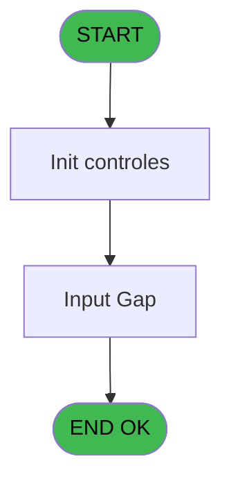
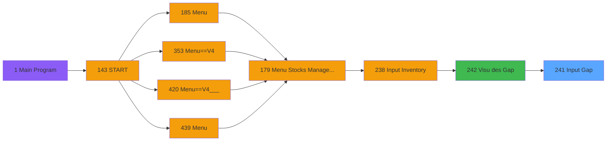

# PVE IDE 241 - Input Gap

> **Analyse**: Phases 1-4 2026-02-03 19:09 -> 19:09 (17s) | Assemblage 19:09
> **Pipeline**: V7.2 Enrichi
> **Structure**: 4 onglets (Resume | Ecrans | Donnees | Connexions)

<!-- TAB:Resume -->

## 1. FICHE D'IDENTITE

| Attribut | Valeur |
|----------|--------|
| Projet | PVE |
| IDE Position | 241 |
| Nom Programme | Input Gap |
| Fichier source | `Prg_241.xml` |
| Dossier IDE | Stocks |
| Taches | 3 (1 ecrans visibles) |
| Tables modifiees | 0 |
| Programmes appeles | 1 |

## 2. DESCRIPTION FONCTIONNELLE

**Input Gap** assure la gestion complete de ce processus, accessible depuis [Visu des Gap (IDE 242)](PVE-IDE-242.md).

Le flux de traitement s'organise en **2 blocs fonctionnels** :

- **Validation** (2 taches) : controles et verifications de coherence
- **Traitement** (1 tache) : traitements metier divers

Detail : phases du traitement

#### Phase 1 : Validation (2 taches)

- **241.1** - Input Validate Inventory **[[ECRAN]](#ecran-t1)**
- **241.2** - Verif si commentaire ok **[[ECRAN]](#ecran-t10)**

Delegue a : [Batch validation inventory (IDE 244)](PVE-IDE-244.md)

#### Phase 2 : Traitement (1 tache)

- **241** - (sans nom)

## 3. BLOCS FONCTIONNELS

### 3.1 Validation (2 taches)

Controles de coherence : 2 taches verifient les donnees et conditions.

---

#### 241.1 - Input Validate Inventory [[ECRAN]](#ecran-t1)

**Role** : Verification : Input Validate Inventory.
**Ecran** : 943 x 366 DLU (MDI) | [Voir mockup](#ecran-t1)
**Variables liees** : A (P.Inventory chrono)
**Delegue a** : [Batch validation inventory (IDE 244)](PVE-IDE-244.md)

---

#### 241.2 - Verif si commentaire ok [[ECRAN]](#ecran-t10)

**Role** : Verification : Verif si commentaire ok.
**Ecran** : 946 x 377 DLU (MDI) | [Voir mockup](#ecran-t10)
**Delegue a** : [Batch validation inventory (IDE 244)](PVE-IDE-244.md)

### 3.2 Traitement (1 tache)

Traitements internes.

---

#### 241 - (sans nom)

**Role** : Traitement interne.

## 5. REGLES METIER

*(Aucune regle metier identifiee)*

## 6. CONTEXTE

- **Appele par**: [Visu des Gap (IDE 242)](PVE-IDE-242.md)
- **Appelle**: 1 programmes | **Tables**: 5 (W:0 R:2 L:4) | **Taches**: 3 | **Expressions**: 3

<!-- TAB:Ecrans -->

## 8. ECRANS

### 8.1 Forms visibles (1 / 3)

| # | Position | Tache | Nom | Type | Largeur | Hauteur | Bloc |
|---|----------|-------|-----|------|---------|---------|------|
| 1 | 241 | 241.1 | Input Validate Inventory | MDI | 943 | 366 | Validation |

### 8.2 Mockups Ecrans

---

#### 241 - Input Validate Inventory
**Tache** : [241.1](#t1) | **Type** : MDI | **Dimensions** : 943 x 366 DLU
**Bloc** : Validation | **Titre IDE** : Input Validate Inventory

<!-- FORM-DATA:
{
    "width":  943,
    "vFactor":  8,
    "type":  "MDI",
    "hFactor":  4,
    "controls":  [
                     {
                         "x":  4,
                         "type":  "table",
                         "var":  "",
                         "name":  "",
                         "titleH":  24,
                         "color":  "110",
                         "w":  902,
                         "y":  75,
                         "fmt":  "",
                         "parent":  null,
                         "text":  "",
                         "rowH":  21,
                         "h":  252,
                         "cols":  [
                                      {
                                          "title":  "Category",
                                          "layer":  1,
                                          "w":  124
                                      },
                                      {
                                          "title":  "Sub category",
                                          "layer":  2,
                                          "w":  126
                                      },
                                      {
                                          "title":  "Product",
                                          "layer":  3,
                                          "w":  175
                                      },
                                      {
                                          "title":  "Unit",
                                          "layer":  4,
                                          "w":  37
                                      },
                                      {
                                          "title":  "Gaps Quantity",
                                          "layer":  5,
                                          "w":  68
                                      },
                                      {
                                          "title":  "Comment",
                                          "layer":  6,
                                          "w":  368
                                      }
                                  ],
                         "rows":  6
                     },
                     {
                         "x":  4,
                         "type":  "label",
                         "var":  "",
                         "y":  328,
                         "w":  936,
                         "fmt":  "",
                         "name":  "",
                         "h":  35,
                         "color":  "6",
                         "text":  "",
                         "parent":  null
                     },
                     {
                         "x":  4,
                         "type":  "label",
                         "var":  "",
                         "y":  0,
                         "w":  936,
                         "fmt":  "",
                         "name":  "",
                         "h":  42,
                         "color":  "186",
                         "text":  "",
                         "parent":  null
                     },
                     {
                         "x":  20,
                         "type":  "label",
                         "var":  "",
                         "y":  16,
                         "w":  235,
                         "fmt":  "",
                         "name":  "",
                         "h":  10,
                         "color":  "186",
                         "text":  "Please type comment of gap",
                         "parent":  16
                     },
                     {
                         "x":  4,
                         "type":  "label",
                         "var":  "",
                         "y":  45,
                         "w":  936,
                         "fmt":  "",
                         "name":  "",
                         "h":  27,
                         "color":  "183",
                         "text":  "Inventory",
                         "parent":  null
                     },
                     {
                         "x":  21,
                         "type":  "label",
                         "var":  "",
                         "y":  55,
                         "w":  13,
                         "fmt":  "",
                         "name":  "",
                         "h":  12,
                         "color":  "183",
                         "text":  "#",
                         "parent":  19
                     },
                     {
                         "x":  82,
                         "type":  "label",
                         "var":  "",
                         "y":  55,
                         "w":  60,
                         "fmt":  "",
                         "name":  "",
                         "h":  12,
                         "color":  "183",
                         "text":  "Last Update",
                         "parent":  19
                     },
                     {
                         "x":  8,
                         "type":  "edit",
                         "var":  "",
                         "y":  102,
                         "w":  118,
                         "fmt":  "",
                         "name":  "V Category",
                         "h":  16,
                         "color":  "6",
                         "text":  "",
                         "parent":  1
                     },
                     {
                         "x":  133,
                         "type":  "edit",
                         "var":  "",
                         "y":  102,
                         "w":  119,
                         "fmt":  "",
                         "name":  "V S/Category",
                         "h":  16,
                         "color":  "6",
                         "text":  "",
                         "parent":  1
                     },
                     {
                         "x":  259,
                         "type":  "edit",
                         "var":  "",
                         "y":  102,
                         "w":  169,
                         "fmt":  "30",
                         "name":  "CTRL_001",
                         "h":  16,
                         "color":  "6",
                         "text":  "",
                         "parent":  1
                     },
                     {
                         "x":  434,
                         "type":  "edit",
                         "var":  "",
                         "y":  102,
                         "w":  30,
                         "fmt":  "",
                         "name":  "CTRL_003",
                         "h":  16,
                         "color":  "6",
                         "text":  "",
                         "parent":  1
                     },
                     {
                         "x":  538,
                         "type":  "edit",
                         "var":  "",
                         "y":  102,
                         "w":  365,
                         "fmt":  "",
                         "name":  "invl_commentaire",
                         "h":  16,
                         "color":  "6",
                         "text":  "",
                         "parent":  1
                     },
                     {
                         "x":  839,
                         "type":  "button",
                         "var":  "",
                         "y":  333,
                         "w":  96,
                         "fmt":  "\u0026Validate",
                         "name":  "VALID",
                         "h":  28,
                         "color":  "",
                         "text":  "",
                         "parent":  null
                     },
                     {
                         "x":  906,
                         "type":  "button",
                         "var":  "",
                         "y":  75,
                         "w":  32,
                         "fmt":  "ñ",
                         "name":  "",
                         "h":  126,
                         "color":  "",
                         "text":  "",
                         "parent":  null
                     },
                     {
                         "x":  906,
                         "type":  "button",
                         "var":  "",
                         "y":  202,
                         "w":  32,
                         "fmt":  "ò",
                         "name":  "",
                         "h":  124,
                         "color":  "",
                         "text":  "",
                         "parent":  null
                     },
                     {
                         "x":  887,
                         "type":  "image",
                         "var":  "",
                         "y":  4,
                         "w":  48,
                         "fmt":  "",
                         "name":  "",
                         "h":  37,
                         "color":  "",
                         "text":  "",
                         "parent":  16
                     },
                     {
                         "x":  36,
                         "type":  "edit",
                         "var":  "",
                         "y":  55,
                         "w":  41,
                         "fmt":  "",
                         "name":  "inv_chrono",
                         "h":  12,
                         "color":  "187",
                         "text":  "",
                         "parent":  19
                     },
                     {
                         "x":  148,
                         "type":  "edit",
                         "var":  "",
                         "y":  55,
                         "w":  68,
                         "fmt":  "",
                         "name":  "inv_date_dern_modif",
                         "h":  12,
                         "color":  "187",
                         "text":  "",
                         "parent":  19
                     },
                     {
                         "x":  219,
                         "type":  "edit",
                         "var":  "",
                         "y":  55,
                         "w":  53,
                         "fmt":  "",
                         "name":  "inv_heure_dern_modif",
                         "h":  12,
                         "color":  "187",
                         "text":  "",
                         "parent":  19
                     },
                     {
                         "x":  469,
                         "type":  "edit",
                         "var":  "",
                         "y":  102,
                         "w":  65,
                         "fmt":  "",
                         "name":  "invl_qte_theorique",
                         "h":  16,
                         "color":  "6",
                         "text":  "",
                         "parent":  1
                     }
                 ],
    "taskId":  "241",
    "height":  366
}
-->

<strong>Champs : 9 champs</strong>

| Pos (x,y) | Nom | Variable | Type |
|-----------|-----|----------|------|
| 8,102 | V Category | - | edit |
| 133,102 | V S/Category | - | edit |
| 259,102 | CTRL_001 | - | edit |
| 434,102 | CTRL_003 | - | edit |
| 538,102 | invl_commentaire | - | edit |
| 36,55 | inv_chrono | - | edit |
| 148,55 | inv_date_dern_modif | - | edit |
| 219,55 | inv_heure_dern_modif | - | edit |
| 469,102 | invl_qte_theorique | - | edit |

<strong>Boutons : 3 boutons</strong>

| Bouton | Pos (x,y) | Action |
|--------|-----------|--------|
| Validate | 839,333 | Appel [Batch validation inventory (IDE 244)](PVE-IDE-244.md) |
| ñ | 906,75 | Bouton fonctionnel |
| ò | 906,202 | Bouton fonctionnel |

## 9. NAVIGATION

Ecran unique: **Input Validate Inventory**

### 9.3 Structure hierarchique (3 taches)

| Position | Tache | Type | Dimensions | Bloc |
|----------|-------|------|------------|------|
| **241.1** | [**Input Validate Inventory** (241.1)](#t1) [mockup](#ecran-t1) | MDI | 943x366 | Validation |
| 241.1.1 | [Verif si commentaire ok (241.2)](#t10) [mockup](#ecran-t10) | MDI | 946x377 | |
| **241.2** | [**(sans nom)** (241)](#t5) | - | - | Traitement |

### 9.4 Algorigramme

> **Legende**: Vert = START/END OK | Rouge = END KO | Bleu = Decisions
> *Algorigramme auto-genere. Utiliser `/algorigramme` pour une synthese metier detaillee.*

<!-- TAB:Donnees -->

## 10. TABLES

### Tables utilisees (5)

| ID | Nom | Description | Type | R | W | L | Usages |
|----|-----|-------------|------|---|---|---|--------|
| 379 | pv_customer_temp |  | DB | R |   |   | 1 |
| 403 | pv_sellers |  | DB | R |   | L | 2 |
| 413 | pv_tva |  | DB |   |   | L | 1 |
| 796 | stat_jour |  | DB |   |   | L | 2 |
| 797 | log_effectif_envoi |  | DB |   |   | L | 1 |

### Colonnes par table (1 / 2 tables avec colonnes identifiees)

Table 379 - pv_customer_temp (R) - 1 usages

| Lettre | Variable | Acces | Type |
|--------|----------|-------|------|
| A | P.Inventory chrono | R | Numeric |
| B | V Category | R | Alpha |
| C | V S/Category | R | Alpha |
| D | V.Gaps quantity | R | Numeric |
| E | Bt.Valider | R | Alpha |

Table 403 - pv_sellers (R/L) - 2 usages

*Table utilisee uniquement en Link ou aucune colonne Real identifiee dans le DataView.*

## 11. VARIABLES

### 11.1 Parametres entrants (1)

Variables recues du programme appelant ([Visu des Gap (IDE 242)](PVE-IDE-242.md)).

| Lettre | Nom | Type | Usage dans |
|--------|-----|------|-----------|
| A | P.Inventory chrono | Numeric | 1x parametre entrant |

### 11.2 Variables de session (4)

Variables persistantes pendant toute la session.

| Lettre | Nom | Type | Usage dans |
|--------|-----|------|-----------|
| B | V Category | Alpha | - |
| C | V S/Category | Alpha | - |
| D | V.Gaps quantity | Numeric | - |
| F | V.Label | Unicode | - |

### 11.3 Autres (1)

Variables diverses.

| Lettre | Nom | Type | Usage dans |
|--------|-----|------|-----------|
| E | Bt.Valider | Alpha | - |

## 12. EXPRESSIONS

**3 / 3 expressions decodees (100%)**

### 12.1 Repartition par type

| Type | Expressions | Regles |
|------|-------------|--------|
| OTHER | 3 | 0 |

### 12.2 Expressions cles par type

#### OTHER (3 expressions)

| Type | IDE | Expression | Regle |
|------|-----|------------|-------|
| OTHER | 3 | `SetCrsr(2)` | - |
| OTHER | 2 | `SetCrsr(1)` | - |
| OTHER | 1 | `P.Inventory chrono [A]` | - |

<!-- TAB:Connexions -->

## 13. GRAPHE D'APPELS

### 13.1 Chaine depuis Main (Callers)

Main -> ... -> [Visu des Gap (IDE 242)](PVE-IDE-242.md) -> **Input Gap (IDE 241)**

### 13.2 Callers

| IDE | Nom Programme | Nb Appels |
|-----|---------------|-----------|
| [242](PVE-IDE-242.md) | Visu des Gap | 1 |

### 13.3 Callees (programmes appeles)

### 13.4 Detail Callees avec contexte

| IDE | Nom Programme | Appels | Contexte |
|-----|---------------|--------|----------|
| [244](PVE-IDE-244.md) | Batch validation inventory | 1 | Sous-programme |

## 14. RECOMMANDATIONS MIGRATION

### 14.1 Profil du programme

| Metrique | Valeur | Impact migration |
|----------|--------|-----------------|
| Lignes de logique | 120 | Programme compact |
| Expressions | 3 | Peu de logique |
| Tables WRITE | 0 | Impact faible |
| Sous-programmes | 1 | Peu de dependances |
| Ecrans visibles | 1 | Ecran unique ou traitement batch |
| Code desactive | 0% (0 / 120) | Code sain |
| Regles metier | 0 | Pas de regle identifiee |

### 14.2 Plan de migration par bloc

#### Validation (2 taches: 2 ecrans, 0 traitement)

- **Strategie** : FluentValidation avec validators specifiques.
- Chaque tache de validation -> un validator injectable

#### Traitement (1 tache: 0 ecran, 1 traitement)

- **Strategie** : 1 service(s) backend injectable(s) (Domain Services).
- 1 sous-programme(s) a migrer ou a reutiliser depuis les services existants.
- Decomposer les taches en services unitaires testables.

### 14.3 Dependances critiques

| Dependance | Type | Appels | Impact |
|------------|------|--------|--------|
| [Batch validation inventory (IDE 244)](PVE-IDE-244.md) | Sous-programme | 1x | Normale - Sous-programme |

---
*Spec DETAILED generee par Pipeline V7.2 - 2026-02-03 19:09*
