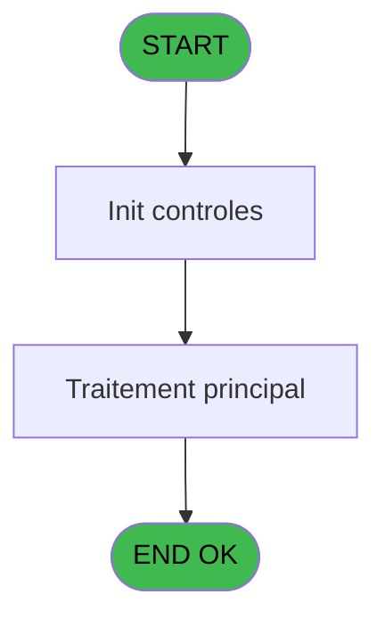
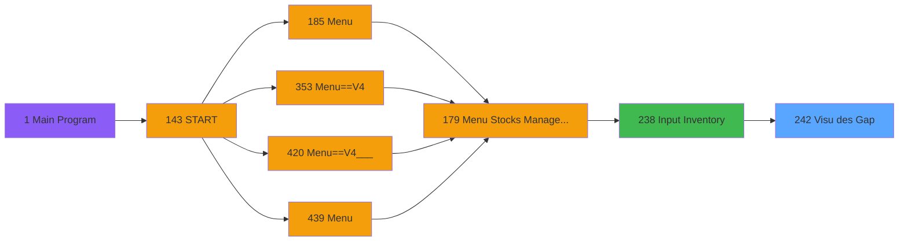
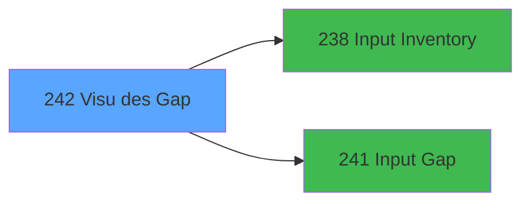

# PVE IDE 242 - Visu des Gap

> **Analyse**: Phases 1-4 2026-02-03 19:09 -> 19:09 (18s) | Assemblage 19:09
> **Pipeline**: V7.2 Enrichi
> **Structure**: 4 onglets (Resume | Ecrans | Donnees | Connexions)

<!-- TAB:Resume -->

## 1. FICHE D'IDENTITE

| Attribut | Valeur |
|----------|--------|
| Projet | PVE |
| IDE Position | 242 |
| Nom Programme | Visu des Gap |
| Fichier source | `Prg_242.xml` |
| Dossier IDE | Stocks |
| Taches | 2 (1 ecrans visibles) |
| Tables modifiees | 0 |
| Programmes appeles | 2 |

## 2. DESCRIPTION FONCTIONNELLE

**Visu des Gap** assure la gestion complete de ce processus, accessible depuis [Input Inventory (IDE 238)](PVE-IDE-238.md).

Le flux de traitement s'organise en **2 blocs fonctionnels** :

- **Creation** (1 tache) : insertion d'enregistrements en base (mouvements, prestations)
- **Validation** (1 tache) : controles et verifications de coherence

Detail : phases du traitement

#### Phase 1 : Validation (1 tache)

- **242** - Input Validate/Save Inventory **[[ECRAN]](#ecran-t1)**

#### Phase 2 : Creation (1 tache)

- **242.1** - Creat lignes inventaire à 0 **[[ECRAN]](#ecran-t12)**

## 3. BLOCS FONCTIONNELS

### 3.1 Validation (1 tache)

Controles de coherence : 1 tache verifie les donnees et conditions.

---

#### 242 - Input Validate/Save Inventory [[ECRAN]](#ecran-t1)

**Role** : Verification : Input Validate/Save Inventory.
**Ecran** : 558 x 367 DLU (Type6) | [Voir mockup](#ecran-t1)
**Variables liees** : A (P.Inventory chrono)

### 3.2 Creation (1 tache)

Insertion de nouveaux enregistrements en base.

---

#### 242.1 - Creat lignes inventaire à 0 [[ECRAN]](#ecran-t12)

**Role** : Traitement : Creat lignes inventaire à 0.
**Ecran** : 259 x 103 DLU (MDI) | [Voir mockup](#ecran-t12)
**Variables liees** : D (V.Existe ligne inventaire ?)

## 5. REGLES METIER

*(Aucune regle metier identifiee)*

## 6. CONTEXTE

- **Appele par**: [Input Inventory (IDE 238)](PVE-IDE-238.md)
- **Appelle**: 2 programmes | **Tables**: 5 (W:0 R:2 L:4) | **Taches**: 2 | **Expressions**: 17

<!-- TAB:Ecrans -->

## 8. ECRANS

### 8.1 Forms visibles (1 / 2)

| # | Position | Tache | Nom | Type | Largeur | Hauteur | Bloc |
|---|----------|-------|-----|------|---------|---------|------|
| 1 | 242 | 242 | Input Validate/Save Inventory | Type6 | 558 | 367 | Validation |

### 8.2 Mockups Ecrans

---

#### 242 - Input Validate/Save Inventory
**Tache** : [242](#t1) | **Type** : Type6 | **Dimensions** : 558 x 367 DLU
**Bloc** : Validation | **Titre IDE** : Input Validate/Save Inventory

<!-- FORM-DATA:
{
    "width":  558,
    "vFactor":  8,
    "type":  "Type6",
    "hFactor":  4,
    "controls":  [
                     {
                         "x":  4,
                         "type":  "table",
                         "var":  "",
                         "name":  "",
                         "titleH":  24,
                         "color":  "110",
                         "w":  518,
                         "y":  75,
                         "fmt":  "",
                         "parent":  null,
                         "text":  "",
                         "rowH":  21,
                         "h":  252,
                         "cols":  [
                                      {
                                          "title":  "Category",
                                          "layer":  1,
                                          "w":  124
                                      },
                                      {
                                          "title":  "Sub category",
                                          "layer":  2,
                                          "w":  126
                                      },
                                      {
                                          "title":  "Product",
                                          "layer":  3,
                                          "w":  131
                                      },
                                      {
                                          "title":  "Unit",
                                          "layer":  4,
                                          "w":  37
                                      },
                                      {
                                          "title":  "Physical Quantity",
                                          "layer":  5,
                                          "w":  96
                                      }
                                  ],
                         "rows":  5
                     },
                     {
                         "x":  4,
                         "type":  "label",
                         "var":  "",
                         "y":  328,
                         "w":  550,
                         "fmt":  "",
                         "name":  "",
                         "h":  35,
                         "color":  "6",
                         "text":  "",
                         "parent":  null
                     },
                     {
                         "x":  4,
                         "type":  "label",
                         "var":  "",
                         "y":  0,
                         "w":  548,
                         "fmt":  "",
                         "name":  "",
                         "h":  42,
                         "color":  "186",
                         "text":  "",
                         "parent":  null
                     },
                     {
                         "x":  20,
                         "type":  "label",
                         "var":  "",
                         "y":  14,
                         "w":  483,
                         "fmt":  "",
                         "name":  "",
                         "h":  12,
                         "color":  "186",
                         "text":  "Inventory Gap : If you click on Validate, you will not quit until all the gap are commented",
                         "parent":  16
                     },
                     {
                         "x":  4,
                         "type":  "label",
                         "var":  "",
                         "y":  45,
                         "w":  548,
                         "fmt":  "",
                         "name":  "",
                         "h":  27,
                         "color":  "183",
                         "text":  "Inventory",
                         "parent":  null
                     },
                     {
                         "x":  21,
                         "type":  "label",
                         "var":  "",
                         "y":  55,
                         "w":  13,
                         "fmt":  "",
                         "name":  "",
                         "h":  12,
                         "color":  "183",
                         "text":  "#",
                         "parent":  19
                     },
                     {
                         "x":  82,
                         "type":  "label",
                         "var":  "",
                         "y":  55,
                         "w":  60,
                         "fmt":  "",
                         "name":  "",
                         "h":  12,
                         "color":  "183",
                         "text":  "Last Update",
                         "parent":  19
                     },
                     {
                         "x":  8,
                         "type":  "edit",
                         "var":  "",
                         "y":  102,
                         "w":  118,
                         "fmt":  "",
                         "name":  "V Category",
                         "h":  16,
                         "color":  "6",
                         "text":  "",
                         "parent":  1
                     },
                     {
                         "x":  133,
                         "type":  "edit",
                         "var":  "",
                         "y":  102,
                         "w":  119,
                         "fmt":  "",
                         "name":  "V S/Category",
                         "h":  16,
                         "color":  "6",
                         "text":  "",
                         "parent":  1
                     },
                     {
                         "x":  258,
                         "type":  "edit",
                         "var":  "",
                         "y":  102,
                         "w":  127,
                         "fmt":  "",
                         "name":  "CTRL_001",
                         "h":  16,
                         "color":  "6",
                         "text":  "",
                         "parent":  1
                     },
                     {
                         "x":  390,
                         "type":  "edit",
                         "var":  "",
                         "y":  102,
                         "w":  30,
                         "fmt":  "",
                         "name":  "CTRL_003",
                         "h":  16,
                         "color":  "6",
                         "text":  "",
                         "parent":  1
                     },
                     {
                         "x":  426,
                         "type":  "edit",
                         "var":  "",
                         "y":  102,
                         "w":  89,
                         "fmt":  "",
                         "name":  "invl_commentaire",
                         "h":  16,
                         "color":  "6",
                         "text":  "",
                         "parent":  1
                     },
                     {
                         "x":  476,
                         "type":  "button",
                         "var":  "",
                         "y":  334,
                         "w":  75,
                         "fmt":  "\u0026Validate",
                         "name":  "VALID",
                         "h":  28,
                         "color":  "",
                         "text":  "",
                         "parent":  null
                     },
                     {
                         "x":  522,
                         "type":  "button",
                         "var":  "",
                         "y":  75,
                         "w":  31,
                         "fmt":  "ñ",
                         "name":  "",
                         "h":  126,
                         "color":  "",
                         "text":  "",
                         "parent":  null
                     },
                     {
                         "x":  522,
                         "type":  "button",
                         "var":  "",
                         "y":  202,
                         "w":  31,
                         "fmt":  "ò",
                         "name":  "",
                         "h":  124,
                         "color":  "",
                         "text":  "",
                         "parent":  null
                     },
                     {
                         "x":  504,
                         "type":  "image",
                         "var":  "",
                         "y":  4,
                         "w":  47,
                         "fmt":  "",
                         "name":  "",
                         "h":  37,
                         "color":  "",
                         "text":  "",
                         "parent":  16
                     },
                     {
                         "x":  36,
                         "type":  "edit",
                         "var":  "",
                         "y":  55,
                         "w":  41,
                         "fmt":  "",
                         "name":  "inv_chrono",
                         "h":  12,
                         "color":  "187",
                         "text":  "",
                         "parent":  19
                     },
                     {
                         "x":  148,
                         "type":  "edit",
                         "var":  "",
                         "y":  55,
                         "w":  68,
                         "fmt":  "",
                         "name":  "inv_date_dern_modif",
                         "h":  12,
                         "color":  "187",
                         "text":  "",
                         "parent":  19
                     },
                     {
                         "x":  219,
                         "type":  "edit",
                         "var":  "",
                         "y":  55,
                         "w":  53,
                         "fmt":  "",
                         "name":  "inv_heure_dern_modif",
                         "h":  12,
                         "color":  "187",
                         "text":  "",
                         "parent":  19
                     },
                     {
                         "x":  382,
                         "type":  "button",
                         "var":  "",
                         "y":  334,
                         "w":  95,
                         "fmt":  "\u0026Save and Exit",
                         "name":  "CANCEL",
                         "h":  28,
                         "color":  "",
                         "text":  "",
                         "parent":  null
                     }
                 ],
    "taskId":  "242",
    "height":  367
}
-->

<strong>Champs : 8 champs</strong>

| Pos (x,y) | Nom | Variable | Type |
|-----------|-----|----------|------|
| 8,102 | V Category | - | edit |
| 133,102 | V S/Category | - | edit |
| 258,102 | CTRL_001 | - | edit |
| 390,102 | CTRL_003 | - | edit |
| 426,102 | invl_commentaire | - | edit |
| 36,55 | inv_chrono | - | edit |
| 148,55 | inv_date_dern_modif | - | edit |
| 219,55 | inv_heure_dern_modif | - | edit |

<strong>Boutons : 4 boutons</strong>

| Bouton | Pos (x,y) | Action |
|--------|-----------|--------|
| Validate | 476,334 | Valide la saisie et enregistre |
| ñ | 522,75 | Bouton fonctionnel |
| ò | 522,202 | Bouton fonctionnel |
| Save and Exit | 382,334 | Quitte le programme |

## 9. NAVIGATION

Ecran unique: **Input Validate/Save Inventory**

### 9.3 Structure hierarchique (2 taches)

| Position | Tache | Type | Dimensions | Bloc |
|----------|-------|------|------------|------|
| **242.1** | [**Input Validate/Save Inventory** (242)](#t1) [mockup](#ecran-t1) | Type6 | 558x367 | Validation |
| **242.2** | [**Creat lignes inventaire à 0** (242.1)](#t12) [mockup](#ecran-t12) | MDI | 259x103 | Creation |

### 9.4 Algorigramme

> **Legende**: Vert = START/END OK | Rouge = END KO | Bleu = Decisions
> *Algorigramme auto-genere. Utiliser `/algorigramme` pour une synthese metier detaillee.*

<!-- TAB:Donnees -->

## 10. TABLES

### Tables utilisees (5)

| ID | Nom | Description | Type | R | W | L | Usages |
|----|-----|-------------|------|---|---|---|--------|
| 379 | pv_customer_temp |  | DB | R |   |   | 1 |
| 403 | pv_sellers |  | DB | R |   | L | 2 |
| 413 | pv_tva |  | DB |   |   | L | 1 |
| 796 | stat_jour |  | DB |   |   | L | 2 |
| 797 | log_effectif_envoi |  | DB |   |   | L | 2 |

### Colonnes par table (1 / 2 tables avec colonnes identifiees)

Table 379 - pv_customer_temp (R) - 1 usages

| Lettre | Variable | Acces | Type |
|--------|----------|-------|------|
| A | P.Inventory chrono | R | Numeric |
| B | V Category | R | Alpha |
| C | V S/Category | R | Alpha |
| D | V.Existe ligne inventaire ? | R | Logical |
| E | V.Gap quantity | R | Numeric |
| F | Bt.Valider | R | Alpha |
| G | V.Bouton dispo? | R | Logical |

Table 403 - pv_sellers (R/L) - 2 usages

*Table utilisee uniquement en Link ou aucune colonne Real identifiee dans le DataView.*

## 11. VARIABLES

### 11.1 Parametres entrants (1)

Variables recues du programme appelant ([Input Inventory (IDE 238)](PVE-IDE-238.md)).

| Lettre | Nom | Type | Usage dans |
|--------|-----|------|-----------|
| A | P.Inventory chrono | Numeric | 1x parametre entrant |

### 11.2 Variables de session (5)

Variables persistantes pendant toute la session.

| Lettre | Nom | Type | Usage dans |
|--------|-----|------|-----------|
| B | V Category | Alpha | 1x session |
| C | V S/Category | Alpha | 2x session |
| D | V.Existe ligne inventaire ? | Logical | - |
| E | V.Gap quantity | Numeric | 1x session |
| G | V.Bouton dispo? | Logical | 1x session |

### 11.3 Autres (1)

Variables diverses.

| Lettre | Nom | Type | Usage dans |
|--------|-----|------|-----------|
| F | Bt.Valider | Alpha | - |

## 12. EXPRESSIONS

**17 / 17 expressions decodees (100%)**

### 12.1 Repartition par type

| Type | Expressions | Regles |
|------|-------------|--------|
| CONCATENATION | 2 | 0 |
| CALCULATION | 1 | 0 |
| CONSTANTE | 1 | 0 |
| OTHER | 10 | 0 |
| CAST_LOGIQUE | 2 | 0 |
| CONDITION | 1 | 0 |

### 12.2 Expressions cles par type

#### CONCATENATION (2 expressions)

| Type | IDE | Expression | Regle |
|------|-----|------------|-------|
| CONCATENATION | 6 | `Str (V.Existe ligne inventa... [D],'2P0')&' - '&[R]` | - |
| CONCATENATION | 4 | `Str (V S/Category [C],'2P0')&' - '&[M]` | - |

#### CALCULATION (1 expressions)

| Type | IDE | Expression | Regle |
|------|-----|------------|-------|
| CALCULATION | 13 | `[U]-[AL]` | - |

#### CONSTANTE (1 expressions)

| Type | IDE | Expression | Regle |
|------|-----|------------|-------|
| CONSTANTE | 12 | `'Inventory Gap : If you click on Validate, you will not quit until all the gap are commented'` | - |

#### OTHER (10 expressions)

| Type | IDE | Expression | Regle |
|------|-----|------------|-------|
| OTHER | 10 | `V.Gap quantity [E]` | - |
| OTHER | 9 | `V.Bouton dispo? [G]` | - |
| OTHER | 15 | `[AR]` | - |
| OTHER | 17 | `SetCrsr(1)` | - |
| OTHER | 16 | `SetCrsr(2)` | - |
| ... | | *+5 autres* | |

#### CAST_LOGIQUE (2 expressions)

| Type | IDE | Expression | Regle |
|------|-----|------------|-------|
| CAST_LOGIQUE | 14 | `'TRUE'LOG` | - |
| CAST_LOGIQUE | 7 | `'FALSE'LOG` | - |

#### CONDITION (1 expressions)

| Type | IDE | Expression | Regle |
|------|-----|------------|-------|
| CONDITION | 11 | `[U]<>[AL]` | - |

<!-- TAB:Connexions -->

## 13. GRAPHE D'APPELS

### 13.1 Chaine depuis Main (Callers)

Main -> ... -> [Input Inventory (IDE 238)](PVE-IDE-238.md) -> **Visu des Gap (IDE 242)**

### 13.2 Callers

| IDE | Nom Programme | Nb Appels |
|-----|---------------|-----------|
| [238](PVE-IDE-238.md) | Input Inventory | 1 |

### 13.3 Callees (programmes appeles)

### 13.4 Detail Callees avec contexte

| IDE | Nom Programme | Appels | Contexte |
|-----|---------------|--------|----------|
| [238](PVE-IDE-238.md) | Input Inventory | 1 | Sous-programme |
| [241](PVE-IDE-241.md) | Input Gap | 1 | Sous-programme |

## 14. RECOMMANDATIONS MIGRATION

### 14.1 Profil du programme

| Metrique | Valeur | Impact migration |
|----------|--------|-----------------|
| Lignes de logique | 115 | Programme compact |
| Expressions | 17 | Peu de logique |
| Tables WRITE | 0 | Impact faible |
| Sous-programmes | 2 | Peu de dependances |
| Ecrans visibles | 1 | Ecran unique ou traitement batch |
| Code desactive | 0.9% (1 / 115) | Code sain |
| Regles metier | 0 | Pas de regle identifiee |

### 14.2 Plan de migration par bloc

#### Validation (1 tache: 1 ecran, 0 traitement)

- **Strategie** : FluentValidation avec validators specifiques.
- Chaque tache de validation -> un validator injectable

#### Creation (1 tache: 1 ecran, 0 traitement)

- **Strategie** : Repository pattern avec Entity Framework Core.
- Insertion via `IRepository<T>.CreateAsync()`

### 14.3 Dependances critiques

| Dependance | Type | Appels | Impact |
|------------|------|--------|--------|
| [Input Gap (IDE 241)](PVE-IDE-241.md) | Sous-programme | 1x | Normale - Sous-programme |
| [Input Inventory (IDE 238)](PVE-IDE-238.md) | Sous-programme | 1x | Normale - Sous-programme |

---
*Spec DETAILED generee par Pipeline V7.2 - 2026-02-03 19:09*
