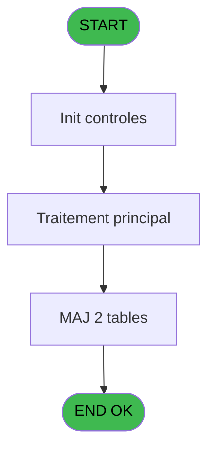
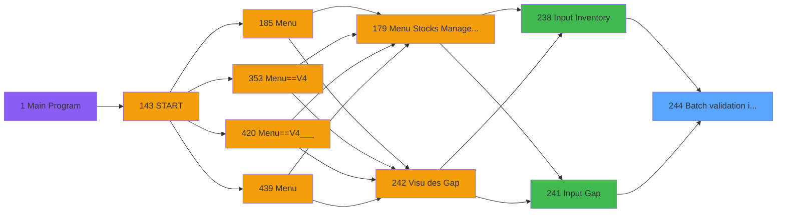
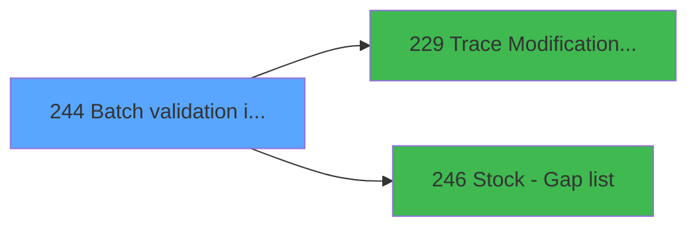

# PVE IDE 244 - Batch validation inventory

> **Analyse**: Phases 1-4 2026-02-03 19:10 -> 19:10 (16s) | Assemblage 19:10
> **Pipeline**: V7.2 Enrichi
> **Structure**: 4 onglets (Resume | Ecrans | Donnees | Connexions)

<!-- TAB:Resume -->

## 1. FICHE D'IDENTITE

| Attribut | Valeur |
|----------|--------|
| Projet | PVE |
| IDE Position | 244 |
| Nom Programme | Batch validation inventory |
| Fichier source | `Prg_244.xml` |
| Dossier IDE | Tables |
| Taches | 2 (0 ecrans visibles) |
| Tables modifiees | 2 |
| Programmes appeles | 2 |

## 2. DESCRIPTION FONCTIONNELLE

**Batch validation inventory** assure la gestion complete de ce processus, accessible depuis [Input Inventory (IDE 238)](PVE-IDE-238.md), [Input Gap (IDE 241)](PVE-IDE-241.md).

Le flux de traitement s'organise en **2 blocs fonctionnels** :

- **Traitement** (1 tache) : traitements metier divers
- **Validation** (1 tache) : controles et verifications de coherence

**Donnees modifiees** : 2 tables en ecriture (pv_sellers, log_effectif_envoi).

**Logique metier** : 1 regles identifiees couvrant conditions metier.

Detail : phases du traitement

#### Phase 1 : Validation (1 tache)

- **244** - Batch validation inventory

#### Phase 2 : Traitement (1 tache)

- **244.1** - Maj inv

Delegue a : [Trace Modification package (IDE 229)](PVE-IDE-229.md)

#### Tables impactees

| Table | Operations | Role metier |
|-------|-----------|-------------|
| log_effectif_envoi | **W** (1 usages) |  |
| pv_sellers | **W** (1 usages) |  |

## 3. BLOCS FONCTIONNELS

### 3.1 Validation (1 tache)

Controles de coherence : 1 tache verifie les donnees et conditions.

---

#### 244 - Batch validation inventory

**Role** : Verification : Batch validation inventory.
**Variables liees** : A (P.Chrono inventory)

### 3.2 Traitement (1 tache)

Traitements internes.

---

#### 244.1 - Maj inv

**Role** : Traitement : Maj inv.
**Delegue a** : [Trace Modification package (IDE 229)](PVE-IDE-229.md)

## 5. REGLES METIER

1 regles identifiees:

### Autres (1 regles)

#### [RM-001] Si [H]>[G] alors 4 sinon 5)

| Element | Detail |
|---------|--------|
| **Condition** | `[H]>[G]` |
| **Si vrai** | 4 |
| **Si faux** | 5) |
| **Expression source** | Expression 12 : `IF([H]>[G],4,5)` |
| **Exemple** | Si [H]>[G] → 4. Sinon → 5) |

## 6. CONTEXTE

- **Appele par**: [Input Inventory (IDE 238)](PVE-IDE-238.md), [Input Gap (IDE 241)](PVE-IDE-241.md)
- **Appelle**: 2 programmes | **Tables**: 4 (W:2 R:0 L:2) | **Taches**: 2 | **Expressions**: 24

<!-- TAB:Ecrans -->

## 8. ECRANS

*(Programme sans ecran visible)*

## 9. NAVIGATION

### 9.3 Structure hierarchique (2 taches)

| Position | Tache | Type | Dimensions | Bloc |
|----------|-------|------|------------|------|
| **244.1** | [**Batch validation inventory** (244)](#t1) | - | - | Validation |
| **244.2** | [**Maj inv** (244.1)](#t2) | - | - | Traitement |

### 9.4 Algorigramme

> **Legende**: Vert = START/END OK | Rouge = END KO | Bleu = Decisions
> *Algorigramme auto-genere. Utiliser `/algorigramme` pour une synthese metier detaillee.*

<!-- TAB:Donnees -->

## 10. TABLES

### Tables utilisees (4)

| ID | Nom | Description | Type | R | W | L | Usages |
|----|-----|-------------|------|---|---|---|--------|
| 403 | pv_sellers |  | DB |   | **W** |   | 1 |
| 762 | pv_mvt_stock_tempo | Table temporaire ecran | DB |   |   | L | 1 |
| 796 | stat_jour |  | DB |   |   | L | 1 |
| 797 | log_effectif_envoi |  | DB |   | **W** |   | 1 |

### Colonnes par table (1 / 2 tables avec colonnes identifiees)

Table 403 - pv_sellers (**W**) - 1 usages

| Lettre | Variable | Acces | Type |
|--------|----------|-------|------|
| A | P.Chrono inventory | W | Numeric |
| B | V.Date référence | W | Date |
| C | V.Time référence | W | Time |

Table 797 - log_effectif_envoi (**W**) - 1 usages

*Table utilisee uniquement en Link ou aucune colonne Real identifiee dans le DataView.*

## 11. VARIABLES

### 11.1 Parametres entrants (1)

Variables recues du programme appelant ([Input Inventory (IDE 238)](PVE-IDE-238.md)).

| Lettre | Nom | Type | Usage dans |
|--------|-----|------|-----------|
| A | P.Chrono inventory | Numeric | [244](#t1) |

### 11.2 Variables de session (2)

Variables persistantes pendant toute la session.

| Lettre | Nom | Type | Usage dans |
|--------|-----|------|-----------|
| B | V.Date référence | Date | 1x session |
| C | V.Time référence | Time | - |

## 12. EXPRESSIONS

**24 / 24 expressions decodees (100%)**

### 12.1 Repartition par type

| Type | Expressions | Regles |
|------|-------------|--------|
| CALCULATION | 1 | 0 |
| CONDITION | 4 | 5 |
| CONSTANTE | 2 | 0 |
| DATE | 1 | 0 |
| OTHER | 14 | 0 |
| REFERENCE_VG | 1 | 0 |
| NEGATION | 1 | 0 |

### 12.2 Expressions cles par type

#### CALCULATION (1 expressions)

| Type | IDE | Expression | Regle |
|------|-----|------------|-------|
| CALCULATION | 6 | `[D]*10^4+[E]*100+[F]` | - |

#### CONDITION (4 expressions)

| Type | IDE | Expression | Regle |
|------|-----|------------|-------|
| CONDITION | 12 | `IF([H]>[G],4,5)` | [RM-001](#rm-RM-001) |
| CONDITION | 8 | `[G]<>[H]` | - |
| CONDITION | 15 | `IF([H]>[G],ABS([H]-[G]),-ABS([H]-[G]))` | - |
| CONDITION | 13 | `IF([H]>[G],'In','Out')` | - |

#### CONSTANTE (2 expressions)

| Type | IDE | Expression | Regle |
|------|-----|------------|-------|
| CONSTANTE | 23 | `'M'` | - |
| CONSTANTE | 11 | `0` | - |

#### DATE (1 expressions)

| Type | IDE | Expression | Regle |
|------|-----|------------|-------|
| DATE | 9 | `Date()` | - |

#### OTHER (14 expressions)

| Type | IDE | Expression | Regle |
|------|-----|------------|-------|
| OTHER | 18 | `[P]` | - |
| OTHER | 17 | `[O]` | - |
| OTHER | 16 | `[N]` | - |
| OTHER | 19 | `[H]` | - |
| OTHER | 22 | `GetParam('AMOUNTFORMAT')` | - |
| ... | | *+9 autres* | |

#### REFERENCE_VG (1 expressions)

| Type | IDE | Expression | Regle |
|------|-----|------------|-------|
| REFERENCE_VG | 14 | `VG1` | - |

#### NEGATION (1 expressions)

| Type | IDE | Expression | Regle |
|------|-----|------------|-------|
| NEGATION | 24 | `NOT VG10` | - |

### 12.3 Toutes les expressions (24)

Voir les 24 expressions

#### CALCULATION (1)

| IDE | Expression Decodee |
|-----|-------------------|
| 6 | `[D]*10^4+[E]*100+[F]` |

#### CONDITION (4)

| IDE | Expression Decodee |
|-----|-------------------|
| 12 | `IF([H]>[G],4,5)` |
| 13 | `IF([H]>[G],'In','Out')` |
| 15 | `IF([H]>[G],ABS([H]-[G]),-ABS([H]-[G]))` |
| 8 | `[G]<>[H]` |

#### CONSTANTE (2)

| IDE | Expression Decodee |
|-----|-------------------|
| 11 | `0` |
| 23 | `'M'` |

#### DATE (1)

| IDE | Expression Decodee |
|-----|-------------------|
| 9 | `Date()` |

#### OTHER (14)

| IDE | Expression Decodee |
|-----|-------------------|
| 1 | `GetParam('SERVICE')` |
| 2 | `P.Chrono inventory [A]` |
| 3 | `V.Date référence [B]` |
| 4 | `[D]` |
| 5 | `[E]` |
| 7 | `[F]` |
| 10 | `Time()` |
| 16 | `[N]` |
| 17 | `[O]` |
| 18 | `[P]` |
| 19 | `[H]` |
| 20 | `GetParam('HEADERLINE01')` |
| 21 | `GetParam('CURRENCYVALUE')` |
| 22 | `GetParam('AMOUNTFORMAT')` |

#### REFERENCE_VG (1)

| IDE | Expression Decodee |
|-----|-------------------|
| 14 | `VG1` |

#### NEGATION (1)

| IDE | Expression Decodee |
|-----|-------------------|
| 24 | `NOT VG10` |

<!-- TAB:Connexions -->

## 13. GRAPHE D'APPELS

### 13.1 Chaine depuis Main (Callers)

Main -> ... -> [Input Inventory (IDE 238)](PVE-IDE-238.md) -> **Batch validation inventory (IDE 244)**

Main -> ... -> [Input Gap (IDE 241)](PVE-IDE-241.md) -> **Batch validation inventory (IDE 244)**

### 13.2 Callers

| IDE | Nom Programme | Nb Appels |
|-----|---------------|-----------|
| [238](PVE-IDE-238.md) | Input Inventory | 1 |
| [241](PVE-IDE-241.md) | Input Gap | 1 |

### 13.3 Callees (programmes appeles)

### 13.4 Detail Callees avec contexte

| IDE | Nom Programme | Appels | Contexte |
|-----|---------------|--------|----------|
| [229](PVE-IDE-229.md) | Trace Modification package | 1 | Sous-programme |
| [246](PVE-IDE-246.md) | Stock - Gap list | 1 | Calcul de donnees |

## 14. RECOMMANDATIONS MIGRATION

### 14.1 Profil du programme

| Metrique | Valeur | Impact migration |
|----------|--------|-----------------|
| Lignes de logique | 77 | Programme compact |
| Expressions | 24 | Peu de logique |
| Tables WRITE | 2 | Impact faible |
| Sous-programmes | 2 | Peu de dependances |
| Ecrans visibles | 0 | Ecran unique ou traitement batch |
| Code desactive | 0% (0 / 77) | Code sain |
| Regles metier | 1 | Quelques regles a preserver |

### 14.2 Plan de migration par bloc

#### Validation (1 tache: 0 ecran, 1 traitement)

- **Strategie** : FluentValidation avec validators specifiques.
- Chaque tache de validation -> un validator injectable

#### Traitement (1 tache: 0 ecran, 1 traitement)

- **Strategie** : 1 service(s) backend injectable(s) (Domain Services).
- 2 sous-programme(s) a migrer ou a reutiliser depuis les services existants.
- Decomposer les taches en services unitaires testables.

### 14.3 Dependances critiques

| Dependance | Type | Appels | Impact |
|------------|------|--------|--------|
| pv_sellers | Table WRITE (Database) | 1x | Schema + repository |
| log_effectif_envoi | Table WRITE (Database) | 1x | Schema + repository |
| [Stock - Gap list (IDE 246)](PVE-IDE-246.md) | Sous-programme | 1x | Normale - Calcul de donnees |
| [Trace Modification package (IDE 229)](PVE-IDE-229.md) | Sous-programme | 1x | Normale - Sous-programme |

---
*Spec DETAILED generee par Pipeline V7.2 - 2026-02-03 19:10*
