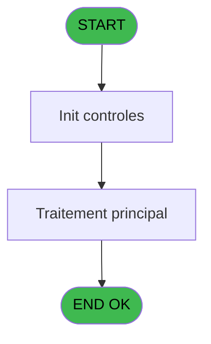
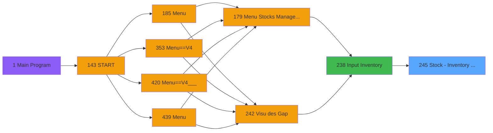

# PVE IDE 245 - Stock - Inventory list

> **Analyse**: Phases 1-4 2026-02-03 19:10 -> 19:11 (16s) | Assemblage 19:11
> **Pipeline**: V7.2 Enrichi
> **Structure**: 4 onglets (Resume | Ecrans | Donnees | Connexions)

<!-- TAB:Resume -->

## 1. FICHE D'IDENTITE

| Attribut | Valeur |
|----------|--------|
| Projet | PVE |
| IDE Position | 245 |
| Nom Programme | Stock - Inventory list |
| Fichier source | `Prg_245.xml` |
| Dossier IDE | Tables |
| Taches | 4 (0 ecrans visibles) |
| Tables modifiees | 0 |
| Programmes appeles | 0 |

## 2. DESCRIPTION FONCTIONNELLE

**Stock - Inventory list** assure la gestion complete de ce processus, accessible depuis [Input Inventory (IDE 238)](PVE-IDE-238.md).

Le flux de traitement s'organise en **2 blocs fonctionnels** :

- **Impression** (3 taches) : generation de tickets et documents
- **Calcul** (1 tache) : calculs de montants, stocks ou compteurs

Detail : phases du traitement

#### Phase 1 : Impression (3 taches)

- **245** - Print Best Of **[[ECRAN]](#ecran-t1)**
- **245.1** - Print
- **245.1.1** - Printing

#### Phase 2 : Calcul (1 tache)

- **245.1.1.1** - Stocks List

## 3. BLOCS FONCTIONNELS

### 3.1 Impression (3 taches)

Generation des documents et tickets.

---

#### 245 - Print Best Of [[ECRAN]](#ecran-t1)

**Role** : Generation du document : Print Best Of.
**Ecran** : 312 x 173 DLU (MDI) | [Voir mockup](#ecran-t1)

---

#### 245.1 - Print

**Role** : Generation du document : Print.

---

#### 245.1.1 - Printing

**Role** : Generation du document : Printing.

### 3.2 Calcul (1 tache)

Calculs metier : montants, stocks, compteurs.

---

#### 245.1.1.1 - Stocks List

**Role** : Calcul : Stocks List.

## 5. REGLES METIER

*(Aucune regle metier identifiee)*

## 6. CONTEXTE

- **Appele par**: [Input Inventory (IDE 238)](PVE-IDE-238.md)
- **Appelle**: 0 programmes | **Tables**: 5 (W:0 R:1 L:4) | **Taches**: 4 | **Expressions**: 1

<!-- TAB:Ecrans -->

## 8. ECRANS

*(Programme sans ecran visible)*

## 9. NAVIGATION

### 9.3 Structure hierarchique (4 taches)

| Position | Tache | Type | Dimensions | Bloc |
|----------|-------|------|------------|------|
| **245.1** | [**Print Best Of** (245)](#t1) [mockup](#ecran-t1) | MDI | 312x173 | Impression |
| 245.1.1 | [Print (245.1)](#t2) | MDI | - | |
| 245.1.2 | [Printing (245.1.1)](#t3) | MDI | - | |
| **245.2** | [**Stocks List** (245.1.1.1)](#t4) | MDI | - | Calcul |

### 9.4 Algorigramme

> **Legende**: Vert = START/END OK | Rouge = END KO | Bleu = Decisions
> *Algorigramme auto-genere. Utiliser `/algorigramme` pour une synthese metier detaillee.*

<!-- TAB:Donnees -->

## 10. TABLES

### Tables utilisees (5)

| ID | Nom | Description | Type | R | W | L | Usages |
|----|-----|-------------|------|---|---|---|--------|
| 379 | pv_customer_temp |  | DB |   |   | L | 1 |
| 403 | pv_sellers |  | DB | R |   |   | 1 |
| 413 | pv_tva |  | DB |   |   | L | 1 |
| 796 | stat_jour |  | DB |   |   | L | 1 |
| 797 | log_effectif_envoi |  | DB |   |   | L | 1 |

### Colonnes par table (1 / 1 tables avec colonnes identifiees)

Table 403 - pv_sellers (R) - 1 usages

| Lettre | Variable | Acces | Type |
|--------|----------|-------|------|
| A | V.Purchasing total | R | Numeric |
| B | V.Selling total | R | Numeric |
| C | v.Quantity en PC | R | Numeric |

## 11. VARIABLES

### 11.1 Parametres entrants (5)

Variables recues du programme appelant ([Input Inventory (IDE 238)](PVE-IDE-238.md)).

| Lettre | Nom | Type | Usage dans |
|--------|-----|------|-----------|
| A | P.Village name | Alpha | - |
| B | P.Currency | Alpha | - |
| C | P.Masque | Alpha | - |
| D | P.Date dern modif | Date | - |
| E | P.Heure dern modif | Time | - |

### 11.2 Autres (1)

Variables diverses.

| Lettre | Nom | Type | Usage dans |
|--------|-----|------|-----------|
| F | ; | Alpha | 1x refs |

## 12. EXPRESSIONS

**1 / 1 expressions decodees (100%)**

### 12.1 Repartition par type

| Type | Expressions | Regles |
|------|-------------|--------|
| CONSTANTE | 1 | 0 |

### 12.2 Expressions cles par type

#### CONSTANTE (1 expressions)

| Type | IDE | Expression | Regle |
|------|-----|------------|-------|
| CONSTANTE | 1 | `';'` | - |

<!-- TAB:Connexions -->

## 13. GRAPHE D'APPELS

### 13.1 Chaine depuis Main (Callers)

Main -> ... -> [Input Inventory (IDE 238)](PVE-IDE-238.md) -> **Stock - Inventory list (IDE 245)**

### 13.2 Callers

| IDE | Nom Programme | Nb Appels |
|-----|---------------|-----------|
| [238](PVE-IDE-238.md) | Input Inventory | 1 |

### 13.3 Callees (programmes appeles)

### 13.4 Detail Callees avec contexte

| IDE | Nom Programme | Appels | Contexte |
|-----|---------------|--------|----------|
| - | (aucun) | - | - |

## 14. RECOMMANDATIONS MIGRATION

### 14.1 Profil du programme

| Metrique | Valeur | Impact migration |
|----------|--------|-----------------|
| Lignes de logique | 77 | Programme compact |
| Expressions | 1 | Peu de logique |
| Tables WRITE | 0 | Impact faible |
| Sous-programmes | 0 | Peu de dependances |
| Ecrans visibles | 0 | Ecran unique ou traitement batch |
| Code desactive | 0% (0 / 77) | Code sain |
| Regles metier | 0 | Pas de regle identifiee |

### 14.2 Plan de migration par bloc

#### Impression (3 taches: 1 ecran, 2 traitements)

- **Strategie** : Templates HTML -> PDF via wkhtmltopdf ou Puppeteer.
- `PrintService` injectable avec choix imprimante

#### Calcul (1 tache: 0 ecran, 1 traitement)

- **Strategie** : Services de calcul purs (Domain Services).
- Migrer la logique de calcul (stock, compteurs, montants)

### 14.3 Dependances critiques

| Dependance | Type | Appels | Impact |
|------------|------|--------|--------|

---
*Spec DETAILED generee par Pipeline V7.2 - 2026-02-03 19:11*
