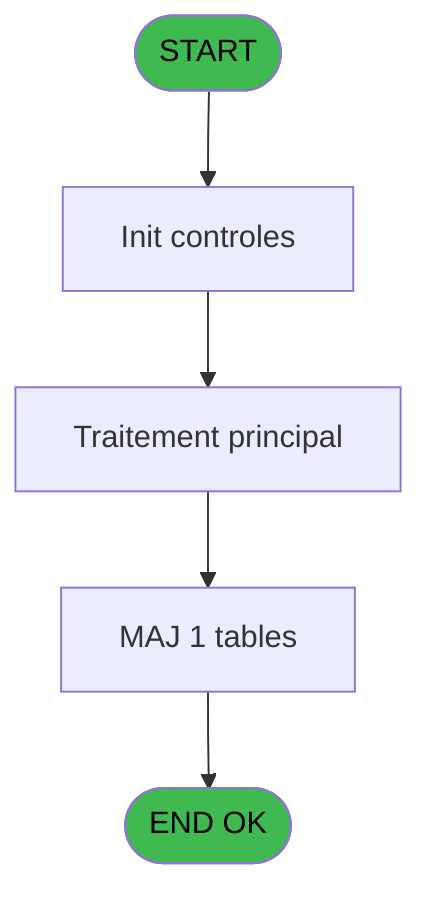
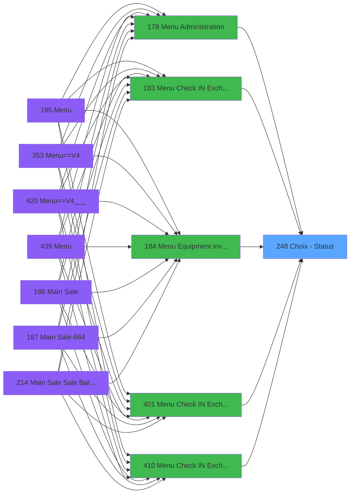
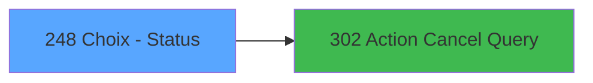

# PVE IDE 248 - Choix - Status

> **Analyse**: Phases 1-4 2026-02-03 19:11 -> 19:12 (16s) | Assemblage 19:12
> **Pipeline**: V7.2 Enrichi
> **Structure**: 4 onglets (Resume | Ecrans | Donnees | Connexions)

<!-- TAB:Resume -->

## 1. FICHE D'IDENTITE

| Attribut | Valeur |
|----------|--------|
| Projet | PVE |
| IDE Position | 248 |
| Nom Programme | Choix - Status |
| Fichier source | `Prg_248.xml` |
| Dossier IDE | Tables |
| Taches | 1 (1 ecrans visibles) |
| Tables modifiees | 1 |
| Programmes appeles | 1 |

## 2. DESCRIPTION FONCTIONNELLE

**Choix - Status** assure la gestion complete de ce processus, accessible depuis [Menu Equipment inventory (IDE 184)](PVE-IDE-184.md), [Menu Equipment inventory (IDE 411)](PVE-IDE-411.md), [Menu Administration (IDE 178)](PVE-IDE-178.md), [Menu Check IN / Exchange (IDE 183)](PVE-IDE-183.md), [Menu Check IN / Exchange V4 (IDE 401)](PVE-IDE-401.md), [Menu Check IN / Exchange (IDE 410)](PVE-IDE-410.md).

Le flux de traitement s'organise en **1 blocs fonctionnels** :

- **Traitement** (1 tache) : traitements metier divers

**Donnees modifiees** : 1 tables en ecriture (sk_testski).

**Logique metier** : 1 regles identifiees couvrant conditions metier.

## 3. BLOCS FONCTIONNELS

### 3.1 Traitement (1 tache)

Traitements internes.

---

#### 248 - Equipment status list [[ECRAN]](#ecran-t1)

**Role** : Traitement : Equipment status list.
**Ecran** : 541 x 302 DLU (MDI) | [Voir mockup](#ecran-t1)
**Variables liees** : A (v.status)
**Delegue a** : [Action Cancel Query (IDE 302)](PVE-IDE-302.md)

## 5. REGLES METIER

1 regles identifiees:

### Autres (1 regles)

#### [RM-001] Condition toujours vraie (flag actif)

| Element | Detail |
|---------|--------|
| **Condition** | `v.status [A]<>'In'` |
| **Si vrai** | [C]<>'Purge' |
| **Si faux** | 'TRUE'LOG) |
| **Variables** | A (v.status) |
| **Expression source** | Expression 8 : `IF (v.status [A]<>'In',[C]<>'Purge','TRUE'LOG)` |
| **Exemple** | Si v.status [A]<>'In' → [C]<>'Purge'. Sinon → 'TRUE'LOG) |

## 6. CONTEXTE

- **Appele par**: [Menu Equipment inventory (IDE 184)](PVE-IDE-184.md), [Menu Equipment inventory (IDE 411)](PVE-IDE-411.md), [Menu Administration (IDE 178)](PVE-IDE-178.md), [Menu Check IN / Exchange (IDE 183)](PVE-IDE-183.md), [Menu Check IN / Exchange V4 (IDE 401)](PVE-IDE-401.md), [Menu Check IN / Exchange (IDE 410)](PVE-IDE-410.md)
- **Appelle**: 1 programmes | **Tables**: 1 (W:1 R:0 L:0) | **Taches**: 1 | **Expressions**: 9

<!-- TAB:Ecrans -->

## 8. ECRANS

### 8.1 Forms visibles (1 / 1)

| # | Position | Tache | Nom | Type | Largeur | Hauteur | Bloc |
|---|----------|-------|-----|------|---------|---------|------|
| 1 | 248 | 248 | Equipment status list | MDI | 541 | 302 | Traitement |

### 8.2 Mockups Ecrans

---

#### 248 - Equipment status list
**Tache** : [248](#t1) | **Type** : MDI | **Dimensions** : 541 x 302 DLU
**Bloc** : Traitement | **Titre IDE** : Equipment status list

<!-- FORM-DATA:
{
    "width":  541,
    "vFactor":  8,
    "type":  "MDI",
    "hFactor":  4,
    "controls":  [
                     {
                         "x":  102,
                         "type":  "label",
                         "var":  "",
                         "y":  58,
                         "w":  46,
                         "fmt":  "",
                         "name":  "",
                         "h":  10,
                         "color":  "183",
                         "text":  "Status",
                         "parent":  null
                     },
                     {
                         "x":  208,
                         "type":  "label",
                         "var":  "",
                         "y":  58,
                         "w":  163,
                         "fmt":  "",
                         "name":  "",
                         "h":  10,
                         "color":  "183",
                         "text":  "Description",
                         "parent":  null
                     },
                     {
                         "x":  0,
                         "type":  "label",
                         "var":  "",
                         "y":  0,
                         "w":  539,
                         "fmt":  "",
                         "name":  "",
                         "h":  42,
                         "color":  "182",
                         "text":  "",
                         "parent":  null
                     },
                     {
                         "x":  14,
                         "type":  "label",
                         "var":  "",
                         "y":  14,
                         "w":  272,
                         "fmt":  "",
                         "name":  "",
                         "h":  10,
                         "color":  "186",
                         "text":  "Add or select a status for equipments",
                         "parent":  3
                     },
                     {
                         "x":  99,
                         "type":  "table",
                         "var":  "",
                         "name":  "",
                         "titleH":  12,
                         "color":  "110",
                         "w":  301,
                         "y":  73,
                         "fmt":  "",
                         "parent":  null,
                         "text":  "",
                         "rowH":  28,
                         "h":  170,
                         "cols":  [
                                      {
                                          "title":  "",
                                          "layer":  1,
                                          "w":  105
                                      },
                                      {
                                          "title":  "",
                                          "layer":  2,
                                          "w":  193
                                      }
                                  ],
                         "rows":  2
                     },
                     {
                         "x":  0,
                         "type":  "label",
                         "var":  "",
                         "y":  267,
                         "w":  539,
                         "fmt":  "",
                         "name":  "",
                         "h":  33,
                         "color":  "6",
                         "text":  "",
                         "parent":  null
                     },
                     {
                         "x":  104,
                         "type":  "edit",
                         "var":  "",
                         "y":  80,
                         "w":  98,
                         "fmt":  "",
                         "name":  "",
                         "h":  15,
                         "color":  "110",
                         "text":  "",
                         "parent":  6
                     },
                     {
                         "x":  208,
                         "type":  "edit",
                         "var":  "",
                         "y":  80,
                         "w":  174,
                         "fmt":  "",
                         "name":  "",
                         "h":  15,
                         "color":  "110",
                         "text":  "",
                         "parent":  6
                     },
                     {
                         "x":  490,
                         "type":  "image",
                         "var":  "",
                         "y":  4,
                         "w":  48,
                         "fmt":  "",
                         "name":  "",
                         "h":  37,
                         "color":  "",
                         "text":  "",
                         "parent":  3
                     },
                     {
                         "x":  399,
                         "type":  "button",
                         "var":  "",
                         "y":  74,
                         "w":  44,
                         "fmt":  "ñ",
                         "name":  "",
                         "h":  85,
                         "color":  "",
                         "text":  "",
                         "parent":  null
                     },
                     {
                         "x":  399,
                         "type":  "button",
                         "var":  "",
                         "y":  159,
                         "w":  44,
                         "fmt":  "ò",
                         "name":  "",
                         "h":  85,
                         "color":  "",
                         "text":  "",
                         "parent":  null
                     },
                     {
                         "x":  1,
                         "type":  "button",
                         "var":  "",
                         "y":  272,
                         "w":  78,
                         "fmt":  "\u0026Modify mode",
                         "name":  "",
                         "h":  28,
                         "color":  "",
                         "text":  "",
                         "parent":  null
                     },
                     {
                         "x":  78,
                         "type":  "button",
                         "var":  "",
                         "y":  272,
                         "w":  77,
                         "fmt":  "\u0026Add",
                         "name":  "",
                         "h":  28,
                         "color":  "",
                         "text":  "",
                         "parent":  null
                     },
                     {
                         "x":  154,
                         "type":  "button",
                         "var":  "",
                         "y":  272,
                         "w":  77,
                         "fmt":  "\u0026Delete",
                         "name":  "",
                         "h":  28,
                         "color":  "",
                         "text":  "",
                         "parent":  null
                     },
                     {
                         "x":  230,
                         "type":  "button",
                         "var":  "",
                         "y":  272,
                         "w":  77,
                         "fmt":  "\u0026Cancel",
                         "name":  "",
                         "h":  28,
                         "color":  "",
                         "text":  "",
                         "parent":  null
                     },
                     {
                         "x":  386,
                         "type":  "button",
                         "var":  "",
                         "y":  272,
                         "w":  77,
                         "fmt":  "\u0026Select",
                         "name":  "",
                         "h":  28,
                         "color":  "",
                         "text":  "",
                         "parent":  null
                     },
                     {
                         "x":  462,
                         "type":  "button",
                         "var":  "",
                         "y":  272,
                         "w":  77,
                         "fmt":  "\u0026Exit",
                         "name":  "",
                         "h":  28,
                         "color":  "",
                         "text":  "",
                         "parent":  null
                     }
                 ],
    "taskId":  "248",
    "height":  302
}
-->

<strong>Champs : 2 champs</strong>

| Pos (x,y) | Nom | Variable | Type |
|-----------|-----|----------|------|
| 104,80 | (sans nom) | - | edit |
| 208,80 | (sans nom) | - | edit |

<strong>Boutons : 8 boutons</strong>

| Bouton | Pos (x,y) | Action |
|--------|-----------|--------|
| ñ | 399,74 | Bouton fonctionnel |
| ò | 399,159 | Bouton fonctionnel |
| Modify mode | 1,272 | Modifie l'element |
| Add | 78,272 | Ajoute un element |
| Delete | 154,272 | Supprime l'element selectionne |
| Cancel | 230,272 | Appel [Action Cancel Query (IDE 302)](PVE-IDE-302.md) |
| Select | 386,272 | Ouvre la selection |
| Exit | 462,272 | Quitte le programme |

## 9. NAVIGATION

Ecran unique: **Equipment status list**

### 9.3 Structure hierarchique (1 tache)

| Position | Tache | Type | Dimensions | Bloc |
|----------|-------|------|------------|------|
| **248.1** | [**Equipment status list** (248)](#t1) [mockup](#ecran-t1) | MDI | 541x302 | Traitement |

### 9.4 Algorigramme

> **Legende**: Vert = START/END OK | Rouge = END KO | Bleu = Decisions
> *Algorigramme auto-genere. Utiliser `/algorigramme` pour une synthese metier detaillee.*

<!-- TAB:Donnees -->

## 10. TABLES

### Tables utilisees (1)

| ID | Nom | Description | Type | R | W | L | Usages |
|----|-----|-------------|------|---|---|---|--------|
| 412 | sk_testski |  | DB |   | **W** |   | 1 |

### Colonnes par table (0 / 1 tables avec colonnes identifiees)

Table 412 - sk_testski (**W**) - 1 usages

*Table utilisee uniquement en Link ou aucune colonne Real identifiee dans le DataView.*

## 11. VARIABLES

*(Programme sans variables locales mappees)*

## 12. EXPRESSIONS

**9 / 9 expressions decodees (100%)**

### 12.1 Repartition par type

| Type | Expressions | Regles |
|------|-------------|--------|
| CAST_LOGIQUE | 1 | 5 |
| OTHER | 7 | 0 |
| REFERENCE_VG | 1 | 0 |

### 12.2 Expressions cles par type

#### CAST_LOGIQUE (1 expressions)

| Type | IDE | Expression | Regle |
|------|-----|------------|-------|
| CAST_LOGIQUE | 8 | `IF (v.status [A]<>'In',[C]<>'Purge','TRUE'LOG)` | [RM-001](#rm-RM-001) |

#### OTHER (7 expressions)

| Type | IDE | Expression | Regle |
|------|-----|------------|-------|
| OTHER | 6 | `Stat (0,'M'MODE) AND NOT ([E])` | - |
| OTHER | 7 | `Stat (0,'CM'MODE)` | - |
| OTHER | 9 | `GetParam ('SERVICE')` | - |
| OTHER | 5 | `Stat (0,'E'MODE)` | - |
| OTHER | 1 | `v.status [A]` | - |
| ... | | *+2 autres* | |

#### REFERENCE_VG (1 expressions)

| Type | IDE | Expression | Regle |
|------|-----|------------|-------|
| REFERENCE_VG | 4 | `VG9` | - |

<!-- TAB:Connexions -->

## 13. GRAPHE D'APPELS

### 13.1 Chaine depuis Main (Callers)

Main -> ... -> [Menu Equipment inventory (IDE 184)](PVE-IDE-184.md) -> **Choix - Status (IDE 248)**

Main -> ... -> [Menu Equipment inventory (IDE 411)](PVE-IDE-411.md) -> **Choix - Status (IDE 248)**

Main -> ... -> [Menu Administration (IDE 178)](PVE-IDE-178.md) -> **Choix - Status (IDE 248)**

Main -> ... -> [Menu Check IN / Exchange (IDE 183)](PVE-IDE-183.md) -> **Choix - Status (IDE 248)**

Main -> ... -> [Menu Check IN / Exchange V4 (IDE 401)](PVE-IDE-401.md) -> **Choix - Status (IDE 248)**

Main -> ... -> [Menu Check IN / Exchange (IDE 410)](PVE-IDE-410.md) -> **Choix - Status (IDE 248)**

### 13.2 Callers

| IDE | Nom Programme | Nb Appels |
|-----|---------------|-----------|
| [184](PVE-IDE-184.md) | Menu Equipment inventory | 2 |
| [411](PVE-IDE-411.md) | Menu Equipment inventory | 2 |
| [178](PVE-IDE-178.md) | Menu Administration | 1 |
| [183](PVE-IDE-183.md) | Menu Check IN / Exchange | 1 |
| [401](PVE-IDE-401.md) | Menu Check IN / Exchange V4 | 1 |
| [410](PVE-IDE-410.md) | Menu Check IN / Exchange | 1 |

### 13.3 Callees (programmes appeles)

### 13.4 Detail Callees avec contexte

| IDE | Nom Programme | Appels | Contexte |
|-----|---------------|--------|----------|
| [302](PVE-IDE-302.md) | Action Cancel Query | 1 | Sous-programme |

## 14. RECOMMANDATIONS MIGRATION

### 14.1 Profil du programme

| Metrique | Valeur | Impact migration |
|----------|--------|-----------------|
| Lignes de logique | 9 | Programme compact |
| Expressions | 9 | Peu de logique |
| Tables WRITE | 1 | Impact faible |
| Sous-programmes | 1 | Peu de dependances |
| Ecrans visibles | 1 | Ecran unique ou traitement batch |
| Code desactive | 0% (0 / 9) | Code sain |
| Regles metier | 1 | Quelques regles a preserver |

### 14.2 Plan de migration par bloc

#### Traitement (1 tache: 1 ecran, 0 traitement)

- **Strategie** : 1 composant(s) UI (Razor/React) avec formulaires et validation.
- 1 sous-programme(s) a migrer ou a reutiliser depuis les services existants.
- Decomposer les taches en services unitaires testables.

### 14.3 Dependances critiques

| Dependance | Type | Appels | Impact |
|------------|------|--------|--------|
| sk_testski | Table WRITE (Database) | 1x | Schema + repository |
| [Action Cancel Query (IDE 302)](PVE-IDE-302.md) | Sous-programme | 1x | Normale - Sous-programme |

---
*Spec DETAILED generee par Pipeline V7.2 - 2026-02-03 19:12*
