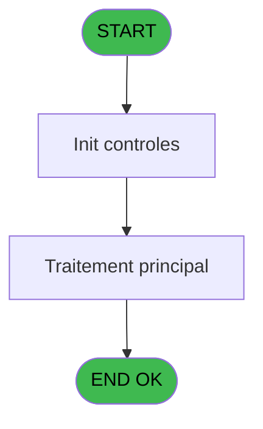
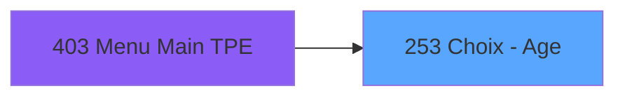

# PVE IDE 253 - Choix - Age

> **Analyse**: Phases 1-4 2026-02-03 19:13 -> 19:14 (17s) | Assemblage 19:14
> **Pipeline**: V7.2 Enrichi
> **Structure**: 4 onglets (Resume | Ecrans | Donnees | Connexions)

<!-- TAB:Resume -->

## 1. FICHE D'IDENTITE

| Attribut | Valeur |
|----------|--------|
| Projet | PVE |
| IDE Position | 253 |
| Nom Programme | Choix - Age |
| Fichier source | `Prg_253.xml` |
| Dossier IDE | Tables |
| Taches | 2 (1 ecrans visibles) |
| Tables modifiees | 0 |
| Programmes appeles | 0 |

## 2. DESCRIPTION FONCTIONNELLE

**Choix - Age** assure la gestion complete de ce processus, accessible depuis [Menu Main (TPE) (IDE 403)](PVE-IDE-403.md).

Le flux de traitement s'organise en **2 blocs fonctionnels** :

- **Traitement** (1 tache) : traitements metier divers
- **Consultation** (1 tache) : ecrans de recherche, selection et consultation

Detail : phases du traitement

#### Phase 1 : Consultation (1 tache)

- **253** - Age selection **[[ECRAN]](#ecran-t1)**

#### Phase 2 : Traitement (1 tache)

- **253.1** - Keyboard **[[ECRAN]](#ecran-t2)**

## 3. BLOCS FONCTIONNELS

### 3.1 Consultation (1 tache)

Ecrans de recherche et consultation.

---

#### 253 - Age selection [[ECRAN]](#ecran-t1)

**Role** : Selection par l'operateur : Age selection.
**Ecran** : 309 x 272 DLU (MDI) | [Voir mockup](#ecran-t1)

### 3.2 Traitement (1 tache)

Traitements internes.

---

#### 253.1 - Keyboard [[ECRAN]](#ecran-t2)

**Role** : Traitement : Keyboard.
**Ecran** : 199 x 80 DLU (MDI) | [Voir mockup](#ecran-t2)

## 5. REGLES METIER

*(Aucune regle metier identifiee)*

## 6. CONTEXTE

- **Appele par**: [Menu Main (TPE) (IDE 403)](PVE-IDE-403.md)
- **Appelle**: 0 programmes | **Tables**: 0 (W:0 R:0 L:0) | **Taches**: 2 | **Expressions**: 1

<!-- TAB:Ecrans -->

## 8. ECRANS

### 8.1 Forms visibles (1 / 2)

| # | Position | Tache | Nom | Type | Largeur | Hauteur | Bloc |
|---|----------|-------|-----|------|---------|---------|------|
| 1 | 253 | 253 | Age selection | MDI | 309 | 272 | Consultation |

### 8.2 Mockups Ecrans

---

#### 253 - Age selection
**Tache** : [253](#t1) | **Type** : MDI | **Dimensions** : 309 x 272 DLU
**Bloc** : Consultation | **Titre IDE** : Age selection

<!-- FORM-DATA:
{
    "width":  309,
    "vFactor":  8,
    "type":  "MDI",
    "hFactor":  4,
    "controls":  [
                     {
                         "x":  0,
                         "type":  "label",
                         "var":  "",
                         "y":  0,
                         "w":  307,
                         "fmt":  "",
                         "name":  "",
                         "h":  40,
                         "color":  "182",
                         "text":  "",
                         "parent":  null
                     },
                     {
                         "x":  14,
                         "type":  "label",
                         "var":  "",
                         "y":  14,
                         "w":  231,
                         "fmt":  "",
                         "name":  "",
                         "h":  12,
                         "color":  "186",
                         "text":  "Type the age of the person and select",
                         "parent":  1
                     },
                     {
                         "x":  27,
                         "type":  "label",
                         "var":  "",
                         "y":  108,
                         "w":  81,
                         "fmt":  "",
                         "name":  "",
                         "h":  61,
                         "color":  "189",
                         "text":  "",
                         "parent":  null
                     },
                     {
                         "x":  33,
                         "type":  "label",
                         "var":  "",
                         "y":  116,
                         "w":  69,
                         "fmt":  "",
                         "name":  "",
                         "h":  14,
                         "color":  "189",
                         "text":  "Age",
                         "parent":  10
                     },
                     {
                         "x":  0,
                         "type":  "label",
                         "var":  "",
                         "y":  236,
                         "w":  307,
                         "fmt":  "",
                         "name":  "",
                         "h":  34,
                         "color":  "6",
                         "text":  "",
                         "parent":  null
                     },
                     {
                         "x":  50,
                         "type":  "edit",
                         "var":  "",
                         "y":  136,
                         "w":  29,
                         "fmt":  "",
                         "name":  "",
                         "h":  19,
                         "color":  "110",
                         "text":  "",
                         "parent":  10
                     },
                     {
                         "x":  258,
                         "type":  "image",
                         "var":  "",
                         "y":  3,
                         "w":  48,
                         "fmt":  "",
                         "name":  "",
                         "h":  37,
                         "color":  "",
                         "text":  "",
                         "parent":  1
                     },
                     {
                         "x":  132,
                         "type":  "button",
                         "var":  "",
                         "y":  55,
                         "w":  52,
                         "fmt":  "1",
                         "name":  "*1",
                         "h":  40,
                         "color":  "",
                         "text":  "",
                         "parent":  null
                     },
                     {
                         "x":  184,
                         "type":  "button",
                         "var":  "",
                         "y":  55,
                         "w":  52,
                         "fmt":  "2",
                         "name":  "*2",
                         "h":  40,
                         "color":  "",
                         "text":  "",
                         "parent":  null
                     },
                     {
                         "x":  236,
                         "type":  "button",
                         "var":  "",
                         "y":  55,
                         "w":  52,
                         "fmt":  "3",
                         "name":  "*3",
                         "h":  40,
                         "color":  "",
                         "text":  "",
                         "parent":  null
                     },
                     {
                         "x":  132,
                         "type":  "button",
                         "var":  "",
                         "y":  95,
                         "w":  52,
                         "fmt":  "4",
                         "name":  "*4",
                         "h":  40,
                         "color":  "",
                         "text":  "",
                         "parent":  null
                     },
                     {
                         "x":  184,
                         "type":  "button",
                         "var":  "",
                         "y":  95,
                         "w":  52,
                         "fmt":  "5",
                         "name":  "*5",
                         "h":  40,
                         "color":  "",
                         "text":  "",
                         "parent":  null
                     },
                     {
                         "x":  236,
                         "type":  "button",
                         "var":  "",
                         "y":  95,
                         "w":  52,
                         "fmt":  "6",
                         "name":  "*6",
                         "h":  40,
                         "color":  "",
                         "text":  "",
                         "parent":  null
                     },
                     {
                         "x":  132,
                         "type":  "button",
                         "var":  "",
                         "y":  135,
                         "w":  52,
                         "fmt":  "7",
                         "name":  "*7",
                         "h":  40,
                         "color":  "",
                         "text":  "",
                         "parent":  null
                     },
                     {
                         "x":  184,
                         "type":  "button",
                         "var":  "",
                         "y":  135,
                         "w":  52,
                         "fmt":  "8",
                         "name":  "*8",
                         "h":  40,
                         "color":  "",
                         "text":  "",
                         "parent":  null
                     },
                     {
                         "x":  236,
                         "type":  "button",
                         "var":  "",
                         "y":  135,
                         "w":  52,
                         "fmt":  "9",
                         "name":  "*9",
                         "h":  40,
                         "color":  "",
                         "text":  "",
                         "parent":  null
                     },
                     {
                         "x":  132,
                         "type":  "button",
                         "var":  "",
                         "y":  175,
                         "w":  52,
                         "fmt":  "Clear",
                         "name":  "+CLEAR",
                         "h":  40,
                         "color":  "",
                         "text":  "",
                         "parent":  null
                     },
                     {
                         "x":  184,
                         "type":  "button",
                         "var":  "",
                         "y":  175,
                         "w":  52,
                         "fmt":  "0",
                         "name":  "*0",
                         "h":  40,
                         "color":  "",
                         "text":  "",
                         "parent":  null
                     },
                     {
                         "x":  236,
                         "type":  "button",
                         "var":  "",
                         "y":  175,
                         "w":  52,
                         "fmt":  "\u003c",
                         "name":  "+BACKSPACE",
                         "h":  40,
                         "color":  "",
                         "text":  "",
                         "parent":  null
                     },
                     {
                         "x":  141,
                         "type":  "button",
                         "var":  "",
                         "y":  242,
                         "w":  83,
                         "fmt":  "\u0026Cancel",
                         "name":  "",
                         "h":  28,
                         "color":  "",
                         "text":  "",
                         "parent":  null
                     },
                     {
                         "x":  223,
                         "type":  "button",
                         "var":  "",
                         "y":  242,
                         "w":  83,
                         "fmt":  "\u0026Select",
                         "name":  "",
                         "h":  28,
                         "color":  "",
                         "text":  "",
                         "parent":  null
                     }
                 ],
    "taskId":  "253",
    "height":  272
}
-->

<strong>Champs : 1 champs</strong>

| Pos (x,y) | Nom | Variable | Type |
|-----------|-----|----------|------|
| 50,136 | (sans nom) | - | edit |

<strong>Boutons : 14 boutons</strong>

| Bouton | Pos (x,y) | Action |
|--------|-----------|--------|
| 1 | 132,55 | Bouton fonctionnel |
| 2 | 184,55 | Bouton fonctionnel |
| 3 | 236,55 | Bouton fonctionnel |
| 4 | 132,95 | Bouton fonctionnel |
| 5 | 184,95 | Bouton fonctionnel |
| 6 | 236,95 | Bouton fonctionnel |
| 7 | 132,135 | Bouton fonctionnel |
| 8 | 184,135 | Bouton fonctionnel |
| 9 | 236,135 | Bouton fonctionnel |
| Clear | 132,175 | Bouton fonctionnel |
| 0 | 184,175 | Bouton fonctionnel |
| < | 236,175 | Bouton fonctionnel |
| Cancel | 141,242 | Annule et retour au menu |
| Select | 223,242 | Ouvre la selection |

## 9. NAVIGATION

Ecran unique: **Age selection**

### 9.3 Structure hierarchique (2 taches)

| Position | Tache | Type | Dimensions | Bloc |
|----------|-------|------|------------|------|
| **253.1** | [**Age selection** (253)](#t1) [mockup](#ecran-t1) | MDI | 309x272 | Consultation |
| **253.2** | [**Keyboard** (253.1)](#t2) [mockup](#ecran-t2) | MDI | 199x80 | Traitement |

### 9.4 Algorigramme

> **Legende**: Vert = START/END OK | Rouge = END KO | Bleu = Decisions
> *Algorigramme auto-genere. Utiliser `/algorigramme` pour une synthese metier detaillee.*

<!-- TAB:Donnees -->

## 10. TABLES

### Tables utilisees (0)

| ID | Nom | Description | Type | R | W | L | Usages |
|----|-----|-------------|------|---|---|---|--------|

### Colonnes par table (0 / 0 tables avec colonnes identifiees)

## 11. VARIABLES

### 11.1 Parametres entrants (1)

Variables recues du programme appelant ([Menu Main (TPE) (IDE 403)](PVE-IDE-403.md)).

| Lettre | Nom | Type | Usage dans |
|--------|-----|------|-----------|
| A | p.age | Numeric | - |

### 11.2 Variables de session (1)

Variables persistantes pendant toute la session.

| Lettre | Nom | Type | Usage dans |
|--------|-----|------|-----------|
| B | v.chaine | Alpha | 1x session |

## 12. EXPRESSIONS

**1 / 1 expressions decodees (100%)**

### 12.1 Repartition par type

| Type | Expressions | Regles |
|------|-------------|--------|
| STRING | 1 | 0 |

### 12.2 Expressions cles par type

#### STRING (1 expressions)

| Type | IDE | Expression | Regle |
|------|-----|------------|-------|
| STRING | 1 | `Val (v.chaine [B],'2')` | - |

<!-- TAB:Connexions -->

## 13. GRAPHE D'APPELS

### 13.1 Chaine depuis Main (Callers)

Main -> ... -> [Menu Main (TPE) (IDE 403)](PVE-IDE-403.md) -> **Choix - Age (IDE 253)**

### 13.2 Callers

| IDE | Nom Programme | Nb Appels |
|-----|---------------|-----------|
| [403](PVE-IDE-403.md) | Menu Main (TPE) | 1 |

### 13.3 Callees (programmes appeles)

### 13.4 Detail Callees avec contexte

| IDE | Nom Programme | Appels | Contexte |
|-----|---------------|--------|----------|
| - | (aucun) | - | - |

## 14. RECOMMANDATIONS MIGRATION

### 14.1 Profil du programme

| Metrique | Valeur | Impact migration |
|----------|--------|-----------------|
| Lignes de logique | 10 | Programme compact |
| Expressions | 1 | Peu de logique |
| Tables WRITE | 0 | Impact faible |
| Sous-programmes | 0 | Peu de dependances |
| Ecrans visibles | 1 | Ecran unique ou traitement batch |
| Code desactive | 0% (0 / 10) | Code sain |
| Regles metier | 0 | Pas de regle identifiee |

### 14.2 Plan de migration par bloc

#### Consultation (1 tache: 1 ecran, 0 traitement)

- **Strategie** : Composants de recherche/selection en modales.
- 1 ecran : Age selection

#### Traitement (1 tache: 1 ecran, 0 traitement)

- **Strategie** : 1 composant(s) UI (Razor/React) avec formulaires et validation.
- Decomposer les taches en services unitaires testables.

### 14.3 Dependances critiques

| Dependance | Type | Appels | Impact |
|------------|------|--------|--------|

---
*Spec DETAILED generee par Pipeline V7.2 - 2026-02-03 19:14*
