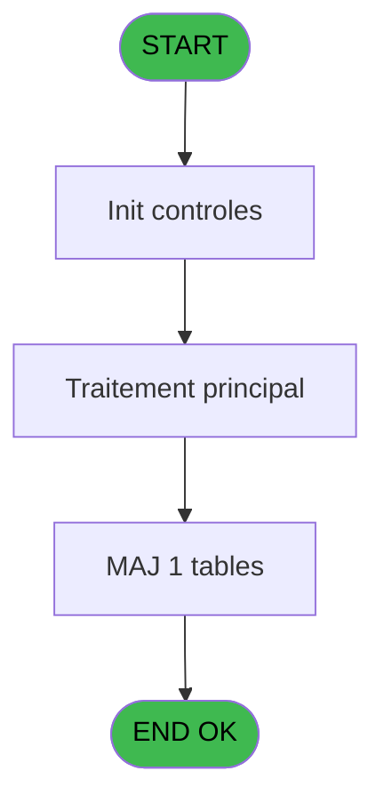
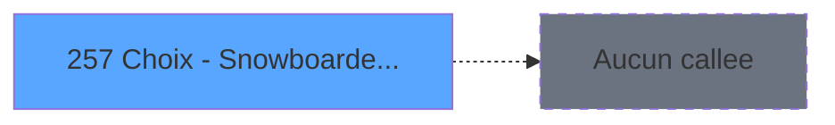

# PVE IDE 257 - Choix - Snowboarder Stance

> **Analyse**: Phases 1-4 2026-02-03 19:15 -> 19:15 (17s) | Assemblage 19:15
> **Pipeline**: V7.2 Enrichi
> **Structure**: 4 onglets (Resume | Ecrans | Donnees | Connexions)

<!-- TAB:Resume -->

## 1. FICHE D'IDENTITE

| Attribut | Valeur |
|----------|--------|
| Projet | PVE |
| IDE Position | 257 |
| Nom Programme | Choix - Snowboarder Stance |
| Fichier source | `Prg_257.xml` |
| Dossier IDE | Tables |
| Taches | 1 (1 ecrans visibles) |
| Tables modifiees | 1 |
| Programmes appeles | 0 |

## 2. DESCRIPTION FONCTIONNELLE

**Choix - Snowboarder Stance** assure la gestion complete de ce processus, accessible depuis [Skier Profile (IDE 212)](PVE-IDE-212.md).

Le flux de traitement s'organise en **1 blocs fonctionnels** :

- **Traitement** (1 tache) : traitements metier divers

**Donnees modifiees** : 1 tables en ecriture (Selection des noms a supprimer).

## 3. BLOCS FONCTIONNELS

### 3.1 Traitement (1 tache)

Traitements internes.

---

#### 257 - Snowboarder stance [[ECRAN]](#ecran-t1)

**Role** : Traitement : Snowboarder stance.
**Ecran** : 307 x 238 DLU (MDI) | [Voir mockup](#ecran-t1)
**Variables liees** : A (P.i..snowboarder stance)

## 5. REGLES METIER

*(Aucune regle metier identifiee)*

## 6. CONTEXTE

- **Appele par**: [Skier Profile (IDE 212)](PVE-IDE-212.md)
- **Appelle**: 0 programmes | **Tables**: 1 (W:1 R:0 L:0) | **Taches**: 1 | **Expressions**: 4

<!-- TAB:Ecrans -->

## 8. ECRANS

### 8.1 Forms visibles (1 / 1)

| # | Position | Tache | Nom | Type | Largeur | Hauteur | Bloc |
|---|----------|-------|-----|------|---------|---------|------|
| 1 | 257 | 257 | Snowboarder stance | MDI | 307 | 238 | Traitement |

### 8.2 Mockups Ecrans

---

#### 257 - Snowboarder stance
**Tache** : [257](#t1) | **Type** : MDI | **Dimensions** : 307 x 238 DLU
**Bloc** : Traitement | **Titre IDE** : Snowboarder stance

<!-- FORM-DATA:
{
    "width":  307,
    "vFactor":  8,
    "type":  "MDI",
    "hFactor":  4,
    "controls":  [
                     {
                         "x":  31,
                         "type":  "label",
                         "var":  "",
                         "y":  43,
                         "w":  107,
                         "fmt":  "",
                         "name":  "",
                         "h":  12,
                         "color":  "183",
                         "text":  "Classification",
                         "parent":  null
                     },
                     {
                         "x":  1,
                         "type":  "label",
                         "var":  "",
                         "y":  0,
                         "w":  300,
                         "fmt":  "",
                         "name":  "",
                         "h":  42,
                         "color":  "182",
                         "text":  "",
                         "parent":  null
                     },
                     {
                         "x":  14,
                         "type":  "label",
                         "var":  "",
                         "y":  15,
                         "w":  117,
                         "fmt":  "",
                         "name":  "",
                         "h":  10,
                         "color":  "186",
                         "text":  "Select your stance",
                         "parent":  2
                     },
                     {
                         "x":  7,
                         "type":  "table",
                         "var":  "",
                         "name":  "",
                         "titleH":  12,
                         "color":  "110",
                         "w":  242,
                         "y":  56,
                         "fmt":  "",
                         "parent":  null,
                         "text":  "",
                         "rowH":  33,
                         "h":  134,
                         "cols":  [
                                      {
                                          "title":  "",
                                          "layer":  1,
                                          "w":  236
                                      }
                                  ],
                         "rows":  1
                     },
                     {
                         "x":  7,
                         "type":  "label",
                         "var":  "",
                         "y":  200,
                         "w":  294,
                         "fmt":  "",
                         "name":  "",
                         "h":  34,
                         "color":  "6",
                         "text":  "",
                         "parent":  null
                     },
                     {
                         "x":  251,
                         "type":  "image",
                         "var":  "",
                         "y":  4,
                         "w":  48,
                         "fmt":  "",
                         "name":  "",
                         "h":  37,
                         "color":  "",
                         "text":  "",
                         "parent":  2
                     },
                     {
                         "x":  220,
                         "type":  "button",
                         "var":  "",
                         "y":  205,
                         "w":  77,
                         "fmt":  "\u0026Exit",
                         "name":  "",
                         "h":  28,
                         "color":  "",
                         "text":  "",
                         "parent":  null
                     },
                     {
                         "x":  8,
                         "type":  "button",
                         "var":  "",
                         "y":  56,
                         "w":  236,
                         "fmt":  "128",
                         "name":  "vre_valeur_reponse",
                         "h":  32,
                         "color":  "",
                         "text":  "",
                         "parent":  5
                     },
                     {
                         "x":  255,
                         "type":  "button",
                         "var":  "",
                         "y":  56,
                         "w":  44,
                         "fmt":  "ñ",
                         "name":  "",
                         "h":  66,
                         "color":  "",
                         "text":  "",
                         "parent":  null
                     },
                     {
                         "x":  255,
                         "type":  "button",
                         "var":  "",
                         "y":  124,
                         "w":  44,
                         "fmt":  "ò",
                         "name":  "",
                         "h":  66,
                         "color":  "",
                         "text":  "",
                         "parent":  null
                     }
                 ],
    "taskId":  "257",
    "height":  238
}
-->

<strong>Boutons : 4 boutons</strong>

| Bouton | Pos (x,y) | Action |
|--------|-----------|--------|
| Exit | 220,205 | Quitte le programme |
| 128 | 8,56 | Bouton fonctionnel |
| ñ | 255,56 | Bouton fonctionnel |
| ò | 255,124 | Bouton fonctionnel |

## 9. NAVIGATION

Ecran unique: **Snowboarder stance**

### 9.3 Structure hierarchique (1 tache)

| Position | Tache | Type | Dimensions | Bloc |
|----------|-------|------|------------|------|
| **257.1** | [**Snowboarder stance** (257)](#t1) [mockup](#ecran-t1) | MDI | 307x238 | Traitement |

### 9.4 Algorigramme

> **Legende**: Vert = START/END OK | Rouge = END KO | Bleu = Decisions
> *Algorigramme auto-genere. Utiliser `/algorigramme` pour une synthese metier detaillee.*

<!-- TAB:Donnees -->

## 10. TABLES

### Tables utilisees (1)

| ID | Nom | Description | Type | R | W | L | Usages |
|----|-----|-------------|------|---|---|---|--------|
| 808 | Selection des noms a supprimer |  | DB |   | **W** |   | 1 |

### Colonnes par table (0 / 1 tables avec colonnes identifiees)

Table 808 - Selection des noms a supprimer (**W**) - 1 usages

*Table utilisee uniquement en Link ou aucune colonne Real identifiee dans le DataView.*

## 11. VARIABLES

*(Programme sans variables locales mappees)*

## 12. EXPRESSIONS

**4 / 4 expressions decodees (100%)**

### 12.1 Repartition par type

| Type | Expressions | Regles |
|------|-------------|--------|
| CONSTANTE | 1 | 0 |
| OTHER | 3 | 0 |

### 12.2 Expressions cles par type

#### CONSTANTE (1 expressions)

| Type | IDE | Expression | Regle |
|------|-----|------------|-------|
| CONSTANTE | 3 | `'POSPLA'` | - |

#### OTHER (3 expressions)

| Type | IDE | Expression | Regle |
|------|-----|------------|-------|
| OTHER | 4 | `P.i..snowboarder stance [A]` | - |
| OTHER | 2 | `[D]` | - |
| OTHER | 1 | `P.i..snowboarder stance [A]` | - |

<!-- TAB:Connexions -->

## 13. GRAPHE D'APPELS

### 13.1 Chaine depuis Main (Callers)

Main -> ... -> [Skier Profile (IDE 212)](PVE-IDE-212.md) -> **Choix - Snowboarder Stance (IDE 257)**

### 13.2 Callers

| IDE | Nom Programme | Nb Appels |
|-----|---------------|-----------|
| [212](PVE-IDE-212.md) | Skier Profile | 1 |

### 13.3 Callees (programmes appeles)

### 13.4 Detail Callees avec contexte

| IDE | Nom Programme | Appels | Contexte |
|-----|---------------|--------|----------|
| - | (aucun) | - | - |

## 14. RECOMMANDATIONS MIGRATION

### 14.1 Profil du programme

| Metrique | Valeur | Impact migration |
|----------|--------|-----------------|
| Lignes de logique | 8 | Programme compact |
| Expressions | 4 | Peu de logique |
| Tables WRITE | 1 | Impact faible |
| Sous-programmes | 0 | Peu de dependances |
| Ecrans visibles | 1 | Ecran unique ou traitement batch |
| Code desactive | 0% (0 / 8) | Code sain |
| Regles metier | 0 | Pas de regle identifiee |

### 14.2 Plan de migration par bloc

#### Traitement (1 tache: 1 ecran, 0 traitement)

- **Strategie** : 1 composant(s) UI (Razor/React) avec formulaires et validation.
- Decomposer les taches en services unitaires testables.

### 14.3 Dependances critiques

| Dependance | Type | Appels | Impact |
|------------|------|--------|--------|
| Selection des noms a supprimer | Table WRITE (Database) | 1x | Schema + repository |

---
*Spec DETAILED generee par Pipeline V7.2 - 2026-02-03 19:15*
