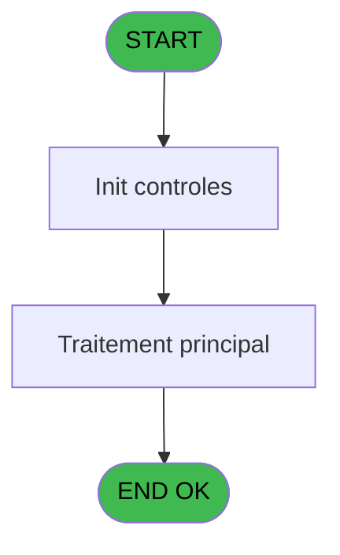
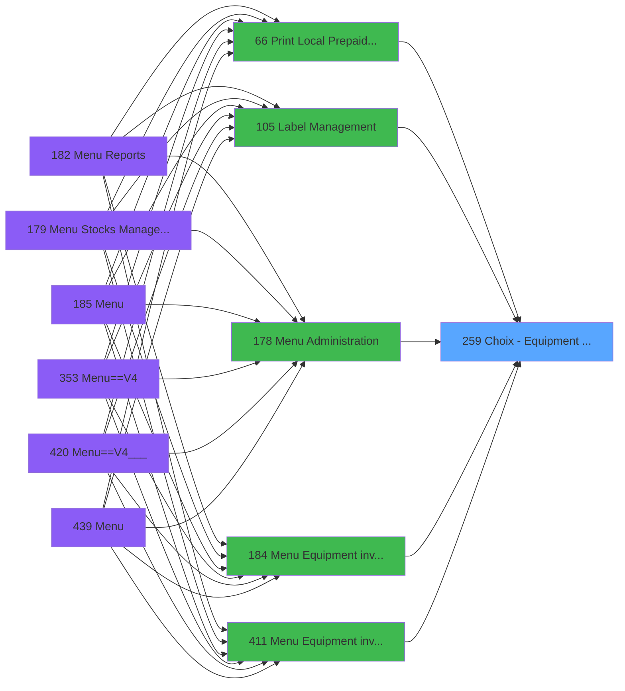
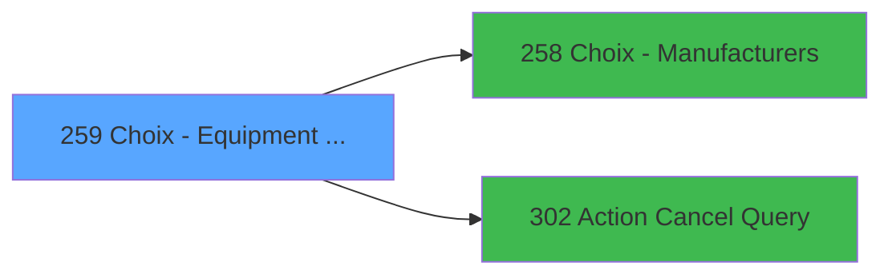

# PVE IDE 259 - Choix - Equipment models

> **Analyse**: Phases 1-4 2026-02-03 19:16 -> 19:16 (15s) | Assemblage 19:16
> **Pipeline**: V7.2 Enrichi
> **Structure**: 4 onglets (Resume | Ecrans | Donnees | Connexions)

<!-- TAB:Resume -->

## 1. FICHE D'IDENTITE

| Attribut | Valeur |
|----------|--------|
| Projet | PVE |
| IDE Position | 259 |
| Nom Programme | Choix - Equipment models |
| Fichier source | `Prg_259.xml` |
| Dossier IDE | Tables |
| Taches | 1 (1 ecrans visibles) |
| Tables modifiees | 0 |
| Programmes appeles | 2 |

## 2. DESCRIPTION FONCTIONNELLE

**Choix - Equipment models** assure la gestion complete de ce processus, accessible depuis [Menu Equipment inventory (IDE 184)](PVE-IDE-184.md), [Menu Equipment inventory (IDE 411)](PVE-IDE-411.md), [Print Local & Prepaid Rentals (IDE 66)](PVE-IDE-66.md), [Label Management (IDE 105)](PVE-IDE-105.md), [Menu Administration (IDE 178)](PVE-IDE-178.md).

Le flux de traitement s'organise en **1 blocs fonctionnels** :

- **Traitement** (1 tache) : traitements metier divers

**Logique metier** : 1 regles identifiees couvrant conditions metier.

## 3. BLOCS FONCTIONNELS

### 3.1 Traitement (1 tache)

Traitements internes.

---

#### 259 - Equipment models [[ECRAN]](#ecran-t1)

**Role** : Traitement : Equipment models.
**Ecran** : 542 x 264 DLU (MDI) | [Voir mockup](#ecran-t1)
**Variables liees** : D (v.retour equipment)
**Delegue a** : [Action Cancel Query (IDE 302)](PVE-IDE-302.md)

## 5. REGLES METIER

1 regles identifiees:

### Autres (1 regles)

#### [RM-001] Si p.zoom mode [C] alors 'p.zoom mode [C]'FORM sinon 'p.model id [B]'FORM)

| Element | Detail |
|---------|--------|
| **Condition** | `p.zoom mode [C]` |
| **Si vrai** | 'p.zoom mode [C]'FORM |
| **Si faux** | 'p.model id [B]'FORM) |
| **Variables** | B (p.model id), C (p.zoom mode) |
| **Expression source** | Expression 13 : `IF(p.zoom mode [C],'p.zoom mode [C]'FORM,'p.model id [B]'FOR` |
| **Exemple** | Si p.zoom mode [C] → 'p.zoom mode [C]'FORM. Sinon → 'p.model id [B]'FORM) |

## 6. CONTEXTE

- **Appele par**: [Menu Equipment inventory (IDE 184)](PVE-IDE-184.md), [Menu Equipment inventory (IDE 411)](PVE-IDE-411.md), [Print Local & Prepaid Rentals (IDE 66)](PVE-IDE-66.md), [Label Management (IDE 105)](PVE-IDE-105.md), [Menu Administration (IDE 178)](PVE-IDE-178.md)
- **Appelle**: 2 programmes | **Tables**: 3 (W:0 R:1 L:2) | **Taches**: 1 | **Expressions**: 13

<!-- TAB:Ecrans -->

## 8. ECRANS

### 8.1 Forms visibles (1 / 1)

| # | Position | Tache | Nom | Type | Largeur | Hauteur | Bloc |
|---|----------|-------|-----|------|---------|---------|------|
| 1 | 259 | 259 | Equipment models | MDI | 542 | 264 | Traitement |

### 8.2 Mockups Ecrans

---

#### 259 - Equipment models
**Tache** : [259](#t1) | **Type** : MDI | **Dimensions** : 542 x 264 DLU
**Bloc** : Traitement | **Titre IDE** : Equipment models

<!-- FORM-DATA:
{
    "width":  542,
    "vFactor":  8,
    "type":  "MDI",
    "hFactor":  4,
    "controls":  [
                     {
                         "x":  87,
                         "type":  "label",
                         "var":  "",
                         "y":  59,
                         "w":  120,
                         "fmt":  "",
                         "name":  "",
                         "h":  12,
                         "color":  "183",
                         "text":  "Manufacturer",
                         "parent":  null
                     },
                     {
                         "x":  230,
                         "type":  "label",
                         "var":  "",
                         "y":  59,
                         "w":  33,
                         "fmt":  "",
                         "name":  "",
                         "h":  12,
                         "color":  "183",
                         "text":  "Code",
                         "parent":  null
                     },
                     {
                         "x":  272,
                         "type":  "label",
                         "var":  "",
                         "y":  59,
                         "w":  107,
                         "fmt":  "",
                         "name":  "",
                         "h":  12,
                         "color":  "183",
                         "text":  "Model name",
                         "parent":  null
                     },
                     {
                         "x":  0,
                         "type":  "label",
                         "var":  "",
                         "y":  0,
                         "w":  540,
                         "fmt":  "",
                         "name":  "",
                         "h":  42,
                         "color":  "182",
                         "text":  "",
                         "parent":  null
                     },
                     {
                         "x":  16,
                         "type":  "label",
                         "var":  "",
                         "y":  15,
                         "w":  417,
                         "fmt":  "",
                         "name":  "",
                         "h":  10,
                         "color":  "186",
                         "text":  "Add or select an equipment model associated to his manufacturer",
                         "parent":  4
                     },
                     {
                         "x":  82,
                         "type":  "table",
                         "var":  "",
                         "name":  "",
                         "titleH":  12,
                         "color":  "110",
                         "w":  336,
                         "y":  72,
                         "fmt":  "",
                         "parent":  null,
                         "text":  "",
                         "rowH":  28,
                         "h":  143,
                         "cols":  [
                                      {
                                          "title":  "",
                                          "layer":  1,
                                          "w":  142
                                      },
                                      {
                                          "title":  "",
                                          "layer":  2,
                                          "w":  42
                                      },
                                      {
                                          "title":  "",
                                          "layer":  3,
                                          "w":  148
                                      }
                                  ],
                         "rows":  3
                     },
                     {
                         "x":  0,
                         "type":  "label",
                         "var":  "",
                         "y":  230,
                         "w":  539,
                         "fmt":  "",
                         "name":  "",
                         "h":  33,
                         "color":  "6",
                         "text":  "",
                         "parent":  null
                     },
                     {
                         "x":  84,
                         "type":  "button",
                         "var":  "",
                         "y":  74,
                         "w":  140,
                         "fmt":  "",
                         "name":  "CTRL_001",
                         "h":  26,
                         "color":  "",
                         "text":  "",
                         "parent":  7
                     },
                     {
                         "x":  230,
                         "type":  "edit",
                         "var":  "",
                         "y":  74,
                         "w":  33,
                         "fmt":  "2P0",
                         "name":  "CTRL_002",
                         "h":  24,
                         "color":  "110",
                         "text":  "",
                         "parent":  7
                     },
                     {
                         "x":  270,
                         "type":  "edit",
                         "var":  "",
                         "y":  74,
                         "w":  143,
                         "fmt":  "",
                         "name":  "CTRL_003",
                         "h":  25,
                         "color":  "110",
                         "text":  "",
                         "parent":  7
                     },
                     {
                         "x":  490,
                         "type":  "image",
                         "var":  "",
                         "y":  4,
                         "w":  48,
                         "fmt":  "",
                         "name":  "",
                         "h":  37,
                         "color":  "",
                         "text":  "",
                         "parent":  6
                     },
                     {
                         "x":  416,
                         "type":  "button",
                         "var":  "",
                         "y":  73,
                         "w":  44,
                         "fmt":  "ñ",
                         "name":  "",
                         "h":  70,
                         "color":  "",
                         "text":  "",
                         "parent":  null
                     },
                     {
                         "x":  416,
                         "type":  "button",
                         "var":  "",
                         "y":  143,
                         "w":  44,
                         "fmt":  "ò",
                         "name":  "",
                         "h":  72,
                         "color":  "",
                         "text":  "",
                         "parent":  null
                     },
                     {
                         "x":  1,
                         "type":  "button",
                         "var":  "",
                         "y":  235,
                         "w":  78,
                         "fmt":  "\u0026Modify mode",
                         "name":  "",
                         "h":  28,
                         "color":  "",
                         "text":  "",
                         "parent":  null
                     },
                     {
                         "x":  78,
                         "type":  "button",
                         "var":  "",
                         "y":  235,
                         "w":  77,
                         "fmt":  "\u0026Add",
                         "name":  "",
                         "h":  28,
                         "color":  "",
                         "text":  "",
                         "parent":  null
                     },
                     {
                         "x":  154,
                         "type":  "button",
                         "var":  "",
                         "y":  235,
                         "w":  77,
                         "fmt":  "\u0026Delete",
                         "name":  "",
                         "h":  28,
                         "color":  "",
                         "text":  "",
                         "parent":  null
                     },
                     {
                         "x":  230,
                         "type":  "button",
                         "var":  "",
                         "y":  235,
                         "w":  77,
                         "fmt":  "\u0026Cancel",
                         "name":  "",
                         "h":  28,
                         "color":  "",
                         "text":  "",
                         "parent":  null
                     },
                     {
                         "x":  386,
                         "type":  "button",
                         "var":  "",
                         "y":  235,
                         "w":  77,
                         "fmt":  "\u0026Select",
                         "name":  "",
                         "h":  28,
                         "color":  "",
                         "text":  "",
                         "parent":  null
                     },
                     {
                         "x":  463,
                         "type":  "button",
                         "var":  "",
                         "y":  235,
                         "w":  77,
                         "fmt":  "\u0026Exit",
                         "name":  "",
                         "h":  28,
                         "color":  "",
                         "text":  "",
                         "parent":  null
                     }
                 ],
    "taskId":  "259",
    "height":  264
}
-->

<strong>Champs : 2 champs</strong>

| Pos (x,y) | Nom | Variable | Type |
|-----------|-----|----------|------|
| 230,74 | CTRL_002 | - | edit |
| 270,74 | CTRL_003 | - | edit |

<strong>Boutons : 9 boutons</strong>

| Bouton | Pos (x,y) | Action |
|--------|-----------|--------|
| CTRL_001 | 84,74 | Bouton fonctionnel |
| ñ | 416,73 | Bouton fonctionnel |
| ò | 416,143 | Bouton fonctionnel |
| Modify mode | 1,235 | Modifie l'element |
| Add | 78,235 | Ajoute un element |
| Delete | 154,235 | Supprime l'element selectionne |
| Cancel | 230,235 | Appel [Action Cancel Query (IDE 302)](PVE-IDE-302.md) |
| Select | 386,235 | Ouvre la selection |
| Exit | 463,235 | Quitte le programme |

## 9. NAVIGATION

Ecran unique: **Equipment models**

### 9.3 Structure hierarchique (1 tache)

| Position | Tache | Type | Dimensions | Bloc |
|----------|-------|------|------------|------|
| **259.1** | [**Equipment models** (259)](#t1) [mockup](#ecran-t1) | MDI | 542x264 | Traitement |

### 9.4 Algorigramme

> **Legende**: Vert = START/END OK | Rouge = END KO | Bleu = Decisions
> *Algorigramme auto-genere. Utiliser `/algorigramme` pour une synthese metier detaillee.*

<!-- TAB:Donnees -->

## 10. TABLES

### Tables utilisees (3)

| ID | Nom | Description | Type | R | W | L | Usages |
|----|-----|-------------|------|---|---|---|--------|
| 388 | pv_hotel_days |  | DB |   |   | L | 1 |
| 389 | pv_equipment_inventory |  | DB | R |   |   | 1 |
| 398 | pv_prestations | Prestations/services vendus | DB |   |   | L | 1 |

### Colonnes par table (1 / 1 tables avec colonnes identifiees)

Table 389 - pv_equipment_inventory (R) - 1 usages

| Lettre | Variable | Acces | Type |
|--------|----------|-------|------|
| A | p.manufacturer id | R | Numeric |
| B | p.model id | R | Numeric |
| C | p.zoom mode | R | Logical |
| D | v.retour equipment | R | Logical |

## 11. VARIABLES

### 11.1 Parametres entrants (3)

Variables recues du programme appelant ([Menu Equipment inventory (IDE 184)](PVE-IDE-184.md)).

| Lettre | Nom | Type | Usage dans |
|--------|-----|------|-----------|
| A | p.manufacturer id | Numeric | 2x parametre entrant |
| B | p.model id | Numeric | 2x parametre entrant |
| C | p.zoom mode | Logical | [259](#t1) |

### 11.2 Variables de session (1)

Variables persistantes pendant toute la session.

| Lettre | Nom | Type | Usage dans |
|--------|-----|------|-----------|
| D | v.retour equipment | Logical | - |

## 12. EXPRESSIONS

**13 / 13 expressions decodees (100%)**

### 12.1 Repartition par type

| Type | Expressions | Regles |
|------|-------------|--------|
| CONDITION | 4 | 5 |
| OTHER | 8 | 0 |
| REFERENCE_VG | 1 | 0 |

### 12.2 Expressions cles par type

#### CONDITION (4 expressions)

| Type | IDE | Expression | Regle |
|------|-----|------------|-------|
| CONDITION | 13 | `IF(p.zoom mode [C],'p.zoom mode [C]'FORM,'p.model id [B]'FORM)` | [RM-001](#rm-RM-001) |
| CONDITION | 3 | `CndRange (p.model id [B]<>0,p.model id [B])` | - |
| CONDITION | 2 | `CndRange (p.manufacturer id [A]<>0,p.manufacturer id [A])` | - |
| CONDITION | 1 | `p.manufacturer id [A]=0` | - |

#### OTHER (8 expressions)

| Type | IDE | Expression | Regle |
|------|-----|------------|-------|
| OTHER | 10 | `Stat (0,'CM'MODE)` | - |
| OTHER | 9 | `Stat (0,'M'MODE)` | - |
| OTHER | 12 | `GetParam ('SERVICE')` | - |
| OTHER | 11 | `Stat (0,'M'MODE) AND NOT ([K])` | - |
| OTHER | 5 | `[I]` | - |
| ... | | *+3 autres* | |

#### REFERENCE_VG (1 expressions)

| Type | IDE | Expression | Regle |
|------|-----|------------|-------|
| REFERENCE_VG | 7 | `VG9` | - |

<!-- TAB:Connexions -->

## 13. GRAPHE D'APPELS

### 13.1 Chaine depuis Main (Callers)

Main -> ... -> [Menu Equipment inventory (IDE 184)](PVE-IDE-184.md) -> **Choix - Equipment models (IDE 259)**

Main -> ... -> [Menu Equipment inventory (IDE 411)](PVE-IDE-411.md) -> **Choix - Equipment models (IDE 259)**

Main -> ... -> [Print Local & Prepaid Rentals (IDE 66)](PVE-IDE-66.md) -> **Choix - Equipment models (IDE 259)**

Main -> ... -> [Label Management (IDE 105)](PVE-IDE-105.md) -> **Choix - Equipment models (IDE 259)**

Main -> ... -> [Menu Administration (IDE 178)](PVE-IDE-178.md) -> **Choix - Equipment models (IDE 259)**

### 13.2 Callers

| IDE | Nom Programme | Nb Appels |
|-----|---------------|-----------|
| [184](PVE-IDE-184.md) | Menu Equipment inventory | 3 |
| [411](PVE-IDE-411.md) | Menu Equipment inventory | 3 |
| [66](PVE-IDE-66.md) | Print Local & Prepaid Rentals | 2 |
| [105](PVE-IDE-105.md) | Label Management | 1 |
| [178](PVE-IDE-178.md) | Menu Administration | 1 |

### 13.3 Callees (programmes appeles)

### 13.4 Detail Callees avec contexte

| IDE | Nom Programme | Appels | Contexte |
|-----|---------------|--------|----------|
| [258](PVE-IDE-258.md) | Choix - Manufacturers | 1 | Selection/consultation |
| [302](PVE-IDE-302.md) | Action Cancel Query | 1 | Sous-programme |

## 14. RECOMMANDATIONS MIGRATION

### 14.1 Profil du programme

| Metrique | Valeur | Impact migration |
|----------|--------|-----------------|
| Lignes de logique | 26 | Programme compact |
| Expressions | 13 | Peu de logique |
| Tables WRITE | 0 | Impact faible |
| Sous-programmes | 2 | Peu de dependances |
| Ecrans visibles | 1 | Ecran unique ou traitement batch |
| Code desactive | 0% (0 / 26) | Code sain |
| Regles metier | 1 | Quelques regles a preserver |

### 14.2 Plan de migration par bloc

#### Traitement (1 tache: 1 ecran, 0 traitement)

- **Strategie** : 1 composant(s) UI (Razor/React) avec formulaires et validation.
- 2 sous-programme(s) a migrer ou a reutiliser depuis les services existants.
- Decomposer les taches en services unitaires testables.

### 14.3 Dependances critiques

| Dependance | Type | Appels | Impact |
|------------|------|--------|--------|
| [Action Cancel Query (IDE 302)](PVE-IDE-302.md) | Sous-programme | 1x | Normale - Sous-programme |
| [Choix - Manufacturers (IDE 258)](PVE-IDE-258.md) | Sous-programme | 1x | Normale - Selection/consultation |

---
*Spec DETAILED generee par Pipeline V7.2 - 2026-02-03 19:16*
