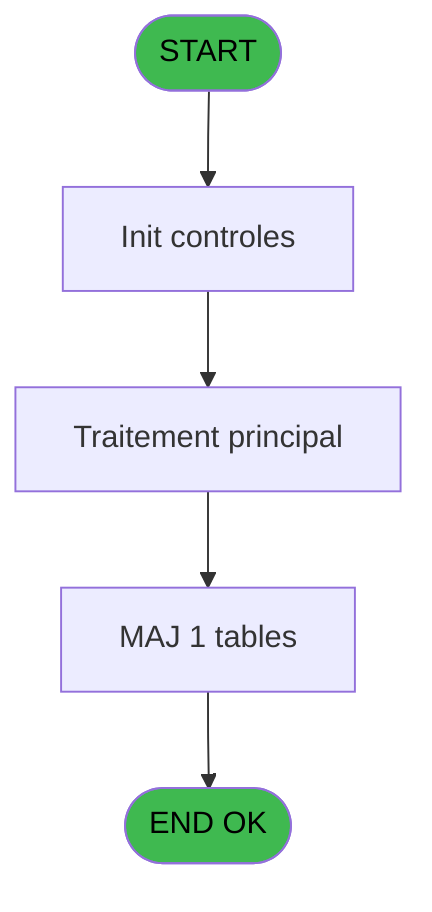
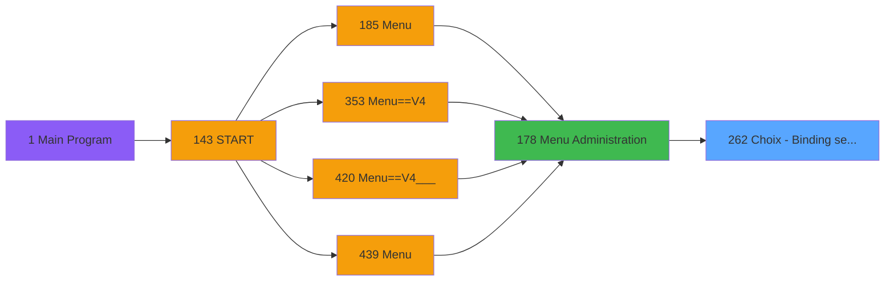
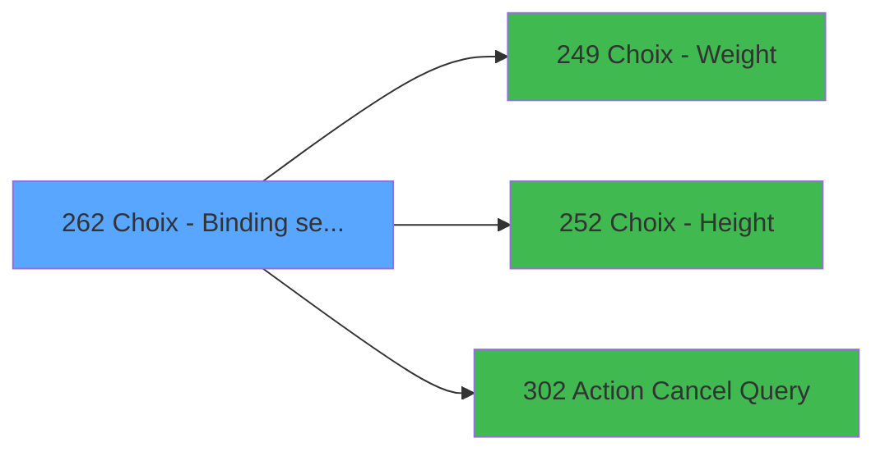

# PVE IDE 262 - Choix - Binding settings

> **Analyse**: Phases 1-4 2026-02-03 19:17 -> 19:17 (14s) | Assemblage 19:17
> **Pipeline**: V7.2 Enrichi
> **Structure**: 4 onglets (Resume | Ecrans | Donnees | Connexions)

<!-- TAB:Resume -->

## 1. FICHE D'IDENTITE

| Attribut | Valeur |
|----------|--------|
| Projet | PVE |
| IDE Position | 262 |
| Nom Programme | Choix - Binding settings |
| Fichier source | `Prg_262.xml` |
| Dossier IDE | Tables |
| Taches | 2 (1 ecrans visibles) |
| Tables modifiees | 1 |
| Programmes appeles | 3 |

## 2. DESCRIPTION FONCTIONNELLE

**Choix - Binding settings** assure la gestion complete de ce processus, accessible depuis [Menu Administration (IDE 178)](PVE-IDE-178.md).

Le flux de traitement s'organise en **2 blocs fonctionnels** :

- **Initialisation** (1 tache) : reinitialisation d'etats et de variables de travail
- **Traitement** (1 tache) : traitements metier divers

**Donnees modifiees** : 1 tables en ecriture (pv_cat).

Detail : phases du traitement

#### Phase 1 : Traitement (1 tache)

- **262** - Binding setting **[[ECRAN]](#ecran-t1)**

Delegue a : [Action Cancel Query (IDE 302)](PVE-IDE-302.md)

#### Phase 2 : Initialisation (1 tache)

- **262.1** - Init - weight

#### Tables impactees

| Table | Operations | Role metier |
|-------|-----------|-------------|
| pv_cat | **W**/L (2 usages) |  |

## 3. BLOCS FONCTIONNELS

### 3.1 Traitement (1 tache)

Traitements internes.

---

#### 262 - Binding setting [[ECRAN]](#ecran-t1)

**Role** : Traitement : Binding setting.
**Ecran** : 685 x 402 DLU (MDI) | [Voir mockup](#ecran-t1)
**Delegue a** : [Action Cancel Query (IDE 302)](PVE-IDE-302.md)

### 3.2 Initialisation (1 tache)

Reinitialisation d'etats et variables de travail.

---

#### 262.1 - Init - weight

**Role** : Reinitialisation : Init - weight.
**Variables liees** : A (p.weight)

## 5. REGLES METIER

*(Aucune regle metier identifiee)*

## 6. CONTEXTE

- **Appele par**: [Menu Administration (IDE 178)](PVE-IDE-178.md)
- **Appelle**: 3 programmes | **Tables**: 2 (W:1 R:1 L:1) | **Taches**: 2 | **Expressions**: 8

<!-- TAB:Ecrans -->

## 8. ECRANS

### 8.1 Forms visibles (1 / 2)

| # | Position | Tache | Nom | Type | Largeur | Hauteur | Bloc |
|---|----------|-------|-----|------|---------|---------|------|
| 1 | 262 | 262 | Binding setting | MDI | 685 | 402 | Traitement |

### 8.2 Mockups Ecrans

---

#### 262 - Binding setting
**Tache** : [262](#t1) | **Type** : MDI | **Dimensions** : 685 x 402 DLU
**Bloc** : Traitement | **Titre IDE** : Binding setting

<!-- FORM-DATA:
{
    "width":  685,
    "vFactor":  8,
    "type":  "MDI",
    "hFactor":  4,
    "controls":  [
                     {
                         "x":  223,
                         "type":  "label",
                         "var":  "",
                         "y":  43,
                         "w":  45,
                         "fmt":  "",
                         "name":  "",
                         "h":  8,
                         "color":  "183",
                         "text":  "Code",
                         "parent":  null
                     },
                     {
                         "x":  274,
                         "type":  "label",
                         "var":  "",
                         "y":  43,
                         "w":  54,
                         "fmt":  "",
                         "name":  "",
                         "h":  8,
                         "color":  "183",
                         "text":  "Sole lenght 1",
                         "parent":  null
                     },
                     {
                         "x":  334,
                         "type":  "label",
                         "var":  "",
                         "y":  43,
                         "w":  54,
                         "fmt":  "",
                         "name":  "",
                         "h":  8,
                         "color":  "183",
                         "text":  "Sole lenght 2",
                         "parent":  null
                     },
                     {
                         "x":  394,
                         "type":  "label",
                         "var":  "",
                         "y":  43,
                         "w":  54,
                         "fmt":  "",
                         "name":  "",
                         "h":  8,
                         "color":  "183",
                         "text":  "Sole lenght 3",
                         "parent":  null
                     },
                     {
                         "x":  454,
                         "type":  "label",
                         "var":  "",
                         "y":  43,
                         "w":  54,
                         "fmt":  "",
                         "name":  "",
                         "h":  8,
                         "color":  "183",
                         "text":  "Sole lenght 4",
                         "parent":  null
                     },
                     {
                         "x":  514,
                         "type":  "label",
                         "var":  "",
                         "y":  43,
                         "w":  54,
                         "fmt":  "",
                         "name":  "",
                         "h":  8,
                         "color":  "183",
                         "text":  "Sole lenght 5",
                         "parent":  null
                     },
                     {
                         "x":  574,
                         "type":  "label",
                         "var":  "",
                         "y":  43,
                         "w":  54,
                         "fmt":  "",
                         "name":  "",
                         "h":  8,
                         "color":  "183",
                         "text":  "Sole lenght 6",
                         "parent":  null
                     },
                     {
                         "x":  13,
                         "type":  "label",
                         "var":  "",
                         "y":  44,
                         "w":  72,
                         "fmt":  "",
                         "name":  "",
                         "h":  9,
                         "color":  "183",
                         "text":  "Weight",
                         "parent":  null
                     },
                     {
                         "x":  119,
                         "type":  "label",
                         "var":  "",
                         "y":  44,
                         "w":  67,
                         "fmt":  "",
                         "name":  "",
                         "h":  9,
                         "color":  "183",
                         "text":  "Height",
                         "parent":  null
                     },
                     {
                         "x":  0,
                         "type":  "label",
                         "var":  "",
                         "y":  0,
                         "w":  682,
                         "fmt":  "",
                         "name":  "",
                         "h":  41,
                         "color":  "182",
                         "text":  "",
                         "parent":  null
                     },
                     {
                         "x":  15,
                         "type":  "label",
                         "var":  "",
                         "y":  15,
                         "w":  77,
                         "fmt":  "",
                         "name":  "",
                         "h":  10,
                         "color":  "186",
                         "text":  "Text",
                         "parent":  10
                     },
                     {
                         "x":  7,
                         "type":  "table",
                         "var":  "",
                         "name":  "",
                         "titleH":  12,
                         "color":  "110",
                         "w":  626,
                         "y":  52,
                         "fmt":  "",
                         "parent":  null,
                         "text":  "",
                         "rowH":  17,
                         "h":  307,
                         "cols":  [
                                      {
                                          "title":  "Weight",
                                          "layer":  1,
                                          "w":  100
                                      },
                                      {
                                          "title":  "H",
                                          "layer":  2,
                                          "w":  113
                                      },
                                      {
                                          "title":  "",
                                          "layer":  3,
                                          "w":  51
                                      },
                                      {
                                          "title":  "",
                                          "layer":  4,
                                          "w":  60
                                      },
                                      {
                                          "title":  "",
                                          "layer":  5,
                                          "w":  60
                                      },
                                      {
                                          "title":  "",
                                          "layer":  6,
                                          "w":  60
                                      },
                                      {
                                          "title":  "",
                                          "layer":  7,
                                          "w":  60
                                      },
                                      {
                                          "title":  "",
                                          "layer":  8,
                                          "w":  60
                                      },
                                      {
                                          "title":  "",
                                          "layer":  9,
                                          "w":  59
                                      }
                                  ],
                         "rows":  9
                     },
                     {
                         "x":  0,
                         "type":  "label",
                         "var":  "",
                         "y":  367,
                         "w":  682,
                         "fmt":  "",
                         "name":  "",
                         "h":  33,
                         "color":  "6",
                         "text":  "",
                         "parent":  null
                     },
                     {
                         "x":  14,
                         "type":  "edit",
                         "var":  "",
                         "y":  55,
                         "w":  90,
                         "fmt":  "",
                         "name":  "CTRL_001",
                         "h":  13,
                         "color":  "110",
                         "text":  "",
                         "parent":  13
                     },
                     {
                         "x":  116,
                         "type":  "edit",
                         "var":  "",
                         "y":  55,
                         "w":  90,
                         "fmt":  "",
                         "name":  "CTRL_002",
                         "h":  13,
                         "color":  "110",
                         "text":  "",
                         "parent":  13
                     },
                     {
                         "x":  224,
                         "type":  "edit",
                         "var":  "",
                         "y":  55,
                         "w":  20,
                         "fmt":  "",
                         "name":  "CTRL_003",
                         "h":  13,
                         "color":  "110",
                         "text":  "",
                         "parent":  13
                     },
                     {
                         "x":  274,
                         "type":  "edit",
                         "var":  "",
                         "y":  55,
                         "w":  35,
                         "fmt":  "",
                         "name":  "CTRL_004",
                         "h":  13,
                         "color":  "110",
                         "text":  "",
                         "parent":  13
                     },
                     {
                         "x":  334,
                         "type":  "edit",
                         "var":  "",
                         "y":  55,
                         "w":  35,
                         "fmt":  "",
                         "name":  "CTRL_005",
                         "h":  13,
                         "color":  "110",
                         "text":  "",
                         "parent":  13
                     },
                     {
                         "x":  394,
                         "type":  "edit",
                         "var":  "",
                         "y":  55,
                         "w":  35,
                         "fmt":  "",
                         "name":  "CTRL_006",
                         "h":  13,
                         "color":  "110",
                         "text":  "",
                         "parent":  13
                     },
                     {
                         "x":  454,
                         "type":  "edit",
                         "var":  "",
                         "y":  55,
                         "w":  35,
                         "fmt":  "",
                         "name":  "CTRL_007",
                         "h":  13,
                         "color":  "110",
                         "text":  "",
                         "parent":  13
                     },
                     {
                         "x":  514,
                         "type":  "edit",
                         "var":  "",
                         "y":  55,
                         "w":  35,
                         "fmt":  "",
                         "name":  "CTRL_008",
                         "h":  13,
                         "color":  "110",
                         "text":  "",
                         "parent":  13
                     },
                     {
                         "x":  574,
                         "type":  "edit",
                         "var":  "",
                         "y":  55,
                         "w":  35,
                         "fmt":  "",
                         "name":  "CTRL_009",
                         "h":  13,
                         "color":  "110",
                         "text":  "",
                         "parent":  13
                     },
                     {
                         "x":  634,
                         "type":  "image",
                         "var":  "",
                         "y":  3,
                         "w":  48,
                         "fmt":  "",
                         "name":  "",
                         "h":  37,
                         "color":  "",
                         "text":  "",
                         "parent":  10
                     },
                     {
                         "x":  632,
                         "type":  "button",
                         "var":  "",
                         "y":  52,
                         "w":  44,
                         "fmt":  "ñ",
                         "name":  "",
                         "h":  154,
                         "color":  "",
                         "text":  "",
                         "parent":  null
                     },
                     {
                         "x":  632,
                         "type":  "button",
                         "var":  "",
                         "y":  206,
                         "w":  44,
                         "fmt":  "ò",
                         "name":  "",
                         "h":  155,
                         "color":  "",
                         "text":  "",
                         "parent":  null
                     },
                     {
                         "x":  1,
                         "type":  "button",
                         "var":  "",
                         "y":  372,
                         "w":  78,
                         "fmt":  "\u0026Modify mode",
                         "name":  "",
                         "h":  28,
                         "color":  "",
                         "text":  "",
                         "parent":  null
                     },
                     {
                         "x":  78,
                         "type":  "button",
                         "var":  "",
                         "y":  372,
                         "w":  77,
                         "fmt":  "\u0026Add",
                         "name":  "",
                         "h":  28,
                         "color":  "",
                         "text":  "",
                         "parent":  null
                     },
                     {
                         "x":  154,
                         "type":  "button",
                         "var":  "",
                         "y":  372,
                         "w":  77,
                         "fmt":  "\u0026Delete",
                         "name":  "",
                         "h":  28,
                         "color":  "",
                         "text":  "",
                         "parent":  null
                     },
                     {
                         "x":  230,
                         "type":  "button",
                         "var":  "",
                         "y":  372,
                         "w":  77,
                         "fmt":  "\u0026Cancel",
                         "name":  "",
                         "h":  28,
                         "color":  "",
                         "text":  "",
                         "parent":  null
                     },
                     {
                         "x":  528,
                         "type":  "button",
                         "var":  "",
                         "y":  372,
                         "w":  77,
                         "fmt":  "\u0026Select",
                         "name":  "",
                         "h":  28,
                         "color":  "",
                         "text":  "",
                         "parent":  null
                     },
                     {
                         "x":  604,
                         "type":  "button",
                         "var":  "",
                         "y":  372,
                         "w":  77,
                         "fmt":  "\u0026Exit",
                         "name":  "",
                         "h":  28,
                         "color":  "",
                         "text":  "",
                         "parent":  null
                     }
                 ],
    "taskId":  "262",
    "height":  402
}
-->

<strong>Champs : 9 champs</strong>

| Pos (x,y) | Nom | Variable | Type |
|-----------|-----|----------|------|
| 14,55 | CTRL_001 | - | edit |
| 116,55 | CTRL_002 | - | edit |
| 224,55 | CTRL_003 | - | edit |
| 274,55 | CTRL_004 | - | edit |
| 334,55 | CTRL_005 | - | edit |
| 394,55 | CTRL_006 | - | edit |
| 454,55 | CTRL_007 | - | edit |
| 514,55 | CTRL_008 | - | edit |
| 574,55 | CTRL_009 | - | edit |

<strong>Boutons : 8 boutons</strong>

| Bouton | Pos (x,y) | Action |
|--------|-----------|--------|
| ñ | 632,52 | Bouton fonctionnel |
| ò | 632,206 | Bouton fonctionnel |
| Modify mode | 1,372 | Modifie l'element |
| Add | 78,372 | Ajoute un element |
| Delete | 154,372 | Supprime l'element selectionne |
| Cancel | 230,372 | Appel [Action Cancel Query (IDE 302)](PVE-IDE-302.md) |
| Select | 528,372 | Ouvre la selection |
| Exit | 604,372 | Quitte le programme |

## 9. NAVIGATION

Ecran unique: **Binding setting**

### 9.3 Structure hierarchique (2 taches)

| Position | Tache | Type | Dimensions | Bloc |
|----------|-------|------|------------|------|
| **262.1** | [**Binding setting** (262)](#t1) [mockup](#ecran-t1) | MDI | 685x402 | Traitement |
| **262.2** | [**Init - weight** (262.1)](#t2) | MDI | - | Initialisation |

### 9.4 Algorigramme

> **Legende**: Vert = START/END OK | Rouge = END KO | Bleu = Decisions
> *Algorigramme auto-genere. Utiliser `/algorigramme` pour une synthese metier detaillee.*

<!-- TAB:Donnees -->

## 10. TABLES

### Tables utilisees (2)

| ID | Nom | Description | Type | R | W | L | Usages |
|----|-----|-------------|------|---|---|---|--------|
| 375 | pv_cat |  | DB |   | **W** | L | 2 |
| 421 | req_location |  | DB | R |   |   | 1 |

### Colonnes par table (1 / 2 tables avec colonnes identifiees)

Table 375 - pv_cat (**W**/L) - 2 usages

| Lettre | Variable | Acces | Type |
|--------|----------|-------|------|
| A | p.weight | W | Alpha |
| B | p.height | W | Alpha |
| C | p.age | W | Alpha |

Table 421 - req_location (R) - 1 usages

*Table utilisee uniquement en Link ou aucune colonne Real identifiee dans le DataView.*

## 11. VARIABLES

### 11.1 Parametres entrants (3)

Variables recues du programme appelant ([Menu Administration (IDE 178)](PVE-IDE-178.md)).

| Lettre | Nom | Type | Usage dans |
|--------|-----|------|-----------|
| A | p.weight | Alpha | 1x parametre entrant |
| B | p.height | Alpha | 1x parametre entrant |
| C | p.age | Alpha | - |

## 12. EXPRESSIONS

**8 / 8 expressions decodees (100%)**

### 12.1 Repartition par type

| Type | Expressions | Regles |
|------|-------------|--------|
| OTHER | 7 | 0 |
| REFERENCE_VG | 1 | 0 |

### 12.2 Expressions cles par type

#### OTHER (7 expressions)

| Type | IDE | Expression | Regle |
|------|-----|------------|-------|
| OTHER | 6 | `Stat (0,'M'MODE)` | - |
| OTHER | 7 | `Stat (0,'CM'MODE)` | - |
| OTHER | 8 | `GetParam ('SERVICE')` | - |
| OTHER | 5 | `Stat (0,'E'MODE)` | - |
| OTHER | 1 | `[E]` | - |
| ... | | *+2 autres* | |

#### REFERENCE_VG (1 expressions)

| Type | IDE | Expression | Regle |
|------|-----|------------|-------|
| REFERENCE_VG | 4 | `VG9` | - |

<!-- TAB:Connexions -->

## 13. GRAPHE D'APPELS

### 13.1 Chaine depuis Main (Callers)

Main -> ... -> [Menu Administration (IDE 178)](PVE-IDE-178.md) -> **Choix - Binding settings (IDE 262)**

### 13.2 Callers

| IDE | Nom Programme | Nb Appels |
|-----|---------------|-----------|
| [178](PVE-IDE-178.md) | Menu Administration | 1 |

### 13.3 Callees (programmes appeles)

### 13.4 Detail Callees avec contexte

| IDE | Nom Programme | Appels | Contexte |
|-----|---------------|--------|----------|
| [249](PVE-IDE-249.md) | Choix - Weight | 1 | Selection/consultation |
| [252](PVE-IDE-252.md) | Choix - Height | 1 | Selection/consultation |
| [302](PVE-IDE-302.md) | Action Cancel Query | 1 | Sous-programme |

## 14. RECOMMANDATIONS MIGRATION

### 14.1 Profil du programme

| Metrique | Valeur | Impact migration |
|----------|--------|-----------------|
| Lignes de logique | 31 | Programme compact |
| Expressions | 8 | Peu de logique |
| Tables WRITE | 1 | Impact faible |
| Sous-programmes | 3 | Peu de dependances |
| Ecrans visibles | 1 | Ecran unique ou traitement batch |
| Code desactive | 0% (0 / 31) | Code sain |
| Regles metier | 0 | Pas de regle identifiee |

### 14.2 Plan de migration par bloc

#### Traitement (1 tache: 1 ecran, 0 traitement)

- **Strategie** : 1 composant(s) UI (Razor/React) avec formulaires et validation.
- 3 sous-programme(s) a migrer ou a reutiliser depuis les services existants.
- Decomposer les taches en services unitaires testables.

#### Initialisation (1 tache: 0 ecran, 1 traitement)

- **Strategie** : Constructeur/methode `InitAsync()` dans l'orchestrateur.

### 14.3 Dependances critiques

| Dependance | Type | Appels | Impact |
|------------|------|--------|--------|
| pv_cat | Table WRITE (Database) | 1x | Schema + repository |
| [Action Cancel Query (IDE 302)](PVE-IDE-302.md) | Sous-programme | 1x | Normale - Sous-programme |
| [Choix - Height (IDE 252)](PVE-IDE-252.md) | Sous-programme | 1x | Normale - Selection/consultation |
| [Choix - Weight (IDE 249)](PVE-IDE-249.md) | Sous-programme | 1x | Normale - Selection/consultation |

---
*Spec DETAILED generee par Pipeline V7.2 - 2026-02-03 19:17*
