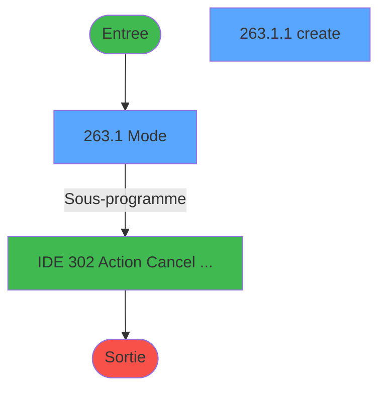
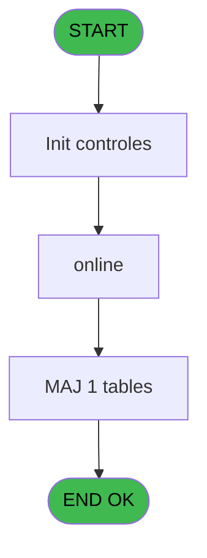
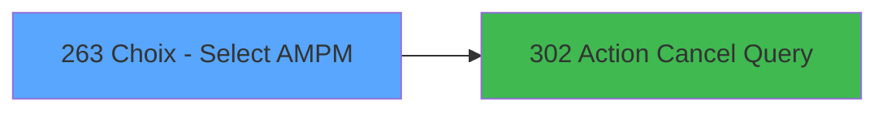

# PVE IDE 263 - Choix - Select AM/PM

> **Analyse**: Phases 1-4 2026-02-03 19:17 -> 19:17 (11s) | Assemblage 19:17
> **Pipeline**: V7.2 Enrichi
> **Structure**: 4 onglets (Resume | Ecrans | Donnees | Connexions)

<!-- TAB:Resume -->

## 1. FICHE D'IDENTITE

| Attribut | Valeur |
|----------|--------|
| Projet | PVE |
| IDE Position | 263 |
| Nom Programme | Choix - Select AM/PM |
| Fichier source | `Prg_263.xml` |
| Dossier IDE | Tables |
| Taches | 4 (2 ecrans visibles) |
| Tables modifiees | 1 |
| Programmes appeles | 1 |

## 2. DESCRIPTION FONCTIONNELLE

**Choix - Select AM/PM** assure la gestion complete de ce processus, accessible depuis [Main Program (IDE 1)](PVE-IDE-1.md).

Le flux de traitement s'organise en **3 blocs fonctionnels** :

- **Creation** (2 taches) : insertion d'enregistrements en base (mouvements, prestations)
- **Consultation** (1 tache) : ecrans de recherche, selection et consultation
- **Traitement** (1 tache) : traitements metier divers

**Donnees modifiees** : 1 tables en ecriture (pv_equipment_models).

Detail : phases du traitement

#### Phase 1 : Consultation (1 tache)

- **263** - Browse-Select AM/PM **[[ECRAN]](#ecran-t1)**

#### Phase 2 : Traitement (1 tache)

- **263.1** - Mode **[[ECRAN]](#ecran-t2)**

Delegue a : [Action Cancel Query (IDE 302)](PVE-IDE-302.md)

#### Phase 3 : Creation (2 taches)

- **263.1.1** - create **[[ECRAN]](#ecran-t3)**
- **263.1.1.1** - create batch

#### Tables impactees

| Table | Operations | Role metier |
|-------|-----------|-------------|
| pv_equipment_models | **W** (2 usages) |  |

## 3. BLOCS FONCTIONNELS

### 3.1 Consultation (1 tache)

Ecrans de recherche et consultation.

---

#### 263 - Browse-Select AM/PM [[ECRAN]](#ecran-t1)

**Role** : Traitement : Browse-Select AM/PM.
**Ecran** : 471 x 306 DLU (MDI) | [Voir mockup](#ecran-t1)

### 3.2 Traitement (1 tache)

Traitements internes.

---

#### 263.1 - Mode [[ECRAN]](#ecran-t2)

**Role** : Traitement : Mode.
**Ecran** : 473 x 306 DLU (MDI) | [Voir mockup](#ecran-t2)
**Variables liees** : B (v.L.mode)
**Delegue a** : [Action Cancel Query (IDE 302)](PVE-IDE-302.md)

### 3.3 Creation (2 taches)

Insertion de nouveaux enregistrements en base.

---

#### 263.1.1 - create [[ECRAN]](#ecran-t3)

**Role** : Traitement : create.
**Ecran** : 278 x 115 DLU (MDI) | [Voir mockup](#ecran-t3)

---

#### 263.1.1.1 - create batch

**Role** : Traitement : create batch.

## 5. REGLES METIER

*(Aucune regle metier identifiee)*

## 6. CONTEXTE

- **Appele par**: [Main Program (IDE 1)](PVE-IDE-1.md)
- **Appelle**: 1 programmes | **Tables**: 1 (W:1 R:0 L:0) | **Taches**: 4 | **Expressions**: 6

<!-- TAB:Ecrans -->

## 8. ECRANS

### 8.1 Forms visibles (2 / 4)

| # | Position | Tache | Nom | Type | Largeur | Hauteur | Bloc |
|---|----------|-------|-----|------|---------|---------|------|
| 1 | 263.1 | 263.1 | Mode | MDI | 473 | 306 | Traitement |
| 2 | 263.1.1 | 263.1.1 | create | MDI | 278 | 115 | Creation |

### 8.2 Mockups Ecrans

---

#### 263.1 - Mode
**Tache** : [263.1](#t2) | **Type** : MDI | **Dimensions** : 473 x 306 DLU
**Bloc** : Traitement | **Titre IDE** : Mode

<!-- FORM-DATA:
{
    "width":  473,
    "vFactor":  8,
    "type":  "MDI",
    "hFactor":  4,
    "controls":  [
                     {
                         "x":  70,
                         "type":  "label",
                         "var":  "",
                         "y":  63,
                         "w":  56,
                         "fmt":  "",
                         "name":  "",
                         "h":  12,
                         "color":  "183",
                         "text":  "Mode",
                         "parent":  null
                     },
                     {
                         "x":  186,
                         "type":  "label",
                         "var":  "",
                         "y":  63,
                         "w":  93,
                         "fmt":  "",
                         "name":  "",
                         "h":  12,
                         "color":  "183",
                         "text":  "Description",
                         "parent":  null
                     },
                     {
                         "x":  0,
                         "type":  "label",
                         "var":  "",
                         "y":  0,
                         "w":  471,
                         "fmt":  "",
                         "name":  "",
                         "h":  42,
                         "color":  "182",
                         "text":  "",
                         "parent":  null
                     },
                     {
                         "x":  16,
                         "type":  "label",
                         "var":  "",
                         "y":  15,
                         "w":  367,
                         "fmt":  "",
                         "name":  "",
                         "h":  10,
                         "color":  "186",
                         "text":  "Select the mode",
                         "parent":  3
                     },
                     {
                         "x":  31,
                         "type":  "table",
                         "var":  "",
                         "name":  "",
                         "titleH":  12,
                         "color":  "110",
                         "w":  347,
                         "y":  77,
                         "fmt":  "",
                         "parent":  null,
                         "text":  "",
                         "rowH":  43,
                         "h":  174,
                         "cols":  [
                                      {
                                          "title":  "",
                                          "layer":  1,
                                          "w":  347
                                      }
                                  ],
                         "rows":  1
                     },
                     {
                         "x":  41,
                         "type":  "label",
                         "var":  "",
                         "y":  80,
                         "w":  20,
                         "fmt":  "",
                         "name":  "",
                         "h":  38,
                         "color":  "144",
                         "text":  "Ø",
                         "parent":  6
                     },
                     {
                         "x":  0,
                         "type":  "label",
                         "var":  "",
                         "y":  273,
                         "w":  471,
                         "fmt":  "",
                         "name":  "",
                         "h":  33,
                         "color":  "6",
                         "text":  "",
                         "parent":  null
                     },
                     {
                         "x":  67,
                         "type":  "button",
                         "var":  "",
                         "y":  78,
                         "w":  111,
                         "fmt":  "",
                         "name":  "AM",
                         "h":  42,
                         "color":  "",
                         "text":  "",
                         "parent":  6
                     },
                     {
                         "x":  184,
                         "type":  "edit",
                         "var":  "",
                         "y":  79,
                         "w":  192,
                         "fmt":  "",
                         "name":  "",
                         "h":  40,
                         "color":  "110",
                         "text":  "",
                         "parent":  6
                     },
                     {
                         "x":  393,
                         "type":  "button",
                         "var":  "",
                         "y":  278,
                         "w":  77,
                         "fmt":  "\u0026Exit",
                         "name":  "",
                         "h":  28,
                         "color":  "",
                         "text":  "",
                         "parent":  null
                     },
                     {
                         "x":  1,
                         "type":  "button",
                         "var":  "",
                         "y":  278,
                         "w":  78,
                         "fmt":  "\u0026Modify mode",
                         "name":  "",
                         "h":  28,
                         "color":  "",
                         "text":  "",
                         "parent":  null
                     },
                     {
                         "x":  78,
                         "type":  "button",
                         "var":  "",
                         "y":  278,
                         "w":  77,
                         "fmt":  "\u0026Add",
                         "name":  "ADD",
                         "h":  28,
                         "color":  "",
                         "text":  "",
                         "parent":  null
                     },
                     {
                         "x":  154,
                         "type":  "button",
                         "var":  "",
                         "y":  278,
                         "w":  77,
                         "fmt":  "\u0026Delete",
                         "name":  "",
                         "h":  28,
                         "color":  "",
                         "text":  "",
                         "parent":  null
                     },
                     {
                         "x":  230,
                         "type":  "button",
                         "var":  "",
                         "y":  278,
                         "w":  77,
                         "fmt":  "\u0026Cancel",
                         "name":  "",
                         "h":  28,
                         "color":  "",
                         "text":  "",
                         "parent":  null
                     },
                     {
                         "x":  422,
                         "type":  "image",
                         "var":  "",
                         "y":  4,
                         "w":  48,
                         "fmt":  "",
                         "name":  "",
                         "h":  37,
                         "color":  "",
                         "text":  "",
                         "parent":  5
                     }
                 ],
    "taskId":  "263.1",
    "height":  306
}
-->

<strong>Champs : 1 champs</strong>

| Pos (x,y) | Nom | Variable | Type |
|-----------|-----|----------|------|
| 184,79 | (sans nom) | - | edit |

<strong>Boutons : 6 boutons</strong>

| Bouton | Pos (x,y) | Action |
|--------|-----------|--------|
| AM | 67,78 | Bouton fonctionnel |
| Exit | 393,278 | Quitte le programme |
| Modify mode | 1,278 | Modifie l'element |
| Add | 78,278 | Ajoute un element |
| Delete | 154,278 | Supprime l'element selectionne |
| Cancel | 230,278 | Appel [Action Cancel Query (IDE 302)](PVE-IDE-302.md) |

---

#### 263.1.1 - create
**Tache** : [263.1.1](#t3) | **Type** : MDI | **Dimensions** : 278 x 115 DLU
**Bloc** : Creation | **Titre IDE** : create

<!-- FORM-DATA:
{
    "width":  278,
    "vFactor":  8,
    "type":  "MDI",
    "hFactor":  4,
    "controls":  [
                     {
                         "x":  73,
                         "type":  "label",
                         "var":  "",
                         "y":  50,
                         "w":  137,
                         "fmt":  "",
                         "name":  "",
                         "h":  11,
                         "color":  "183",
                         "text":  "Mode",
                         "parent":  null
                     },
                     {
                         "x":  0,
                         "type":  "label",
                         "var":  "",
                         "y":  0,
                         "w":  277,
                         "fmt":  "",
                         "name":  "",
                         "h":  40,
                         "color":  "186",
                         "text":  "",
                         "parent":  null
                     },
                     {
                         "x":  13,
                         "type":  "label",
                         "var":  "",
                         "y":  13,
                         "w":  201,
                         "fmt":  "",
                         "name":  "",
                         "h":  13,
                         "color":  "186",
                         "text":  "Enter the name of the mode",
                         "parent":  4
                     },
                     {
                         "x":  0,
                         "type":  "label",
                         "var":  "",
                         "y":  84,
                         "w":  277,
                         "fmt":  "",
                         "name":  "",
                         "h":  29,
                         "color":  "6",
                         "text":  "",
                         "parent":  null
                     },
                     {
                         "x":  73,
                         "type":  "edit",
                         "var":  "",
                         "y":  62,
                         "w":  137,
                         "fmt":  "",
                         "name":  "",
                         "h":  13,
                         "color":  "110",
                         "text":  "",
                         "parent":  null
                     },
                     {
                         "x":  123,
                         "type":  "button",
                         "var":  "",
                         "y":  89,
                         "w":  77,
                         "fmt":  "Validate",
                         "name":  "",
                         "h":  24,
                         "color":  "",
                         "text":  "",
                         "parent":  null
                     },
                     {
                         "x":  199,
                         "type":  "button",
                         "var":  "",
                         "y":  89,
                         "w":  77,
                         "fmt":  "Cancel",
                         "name":  "",
                         "h":  24,
                         "color":  "",
                         "text":  "",
                         "parent":  null
                     },
                     {
                         "x":  227,
                         "type":  "image",
                         "var":  "",
                         "y":  1,
                         "w":  48,
                         "fmt":  "",
                         "name":  "",
                         "h":  37,
                         "color":  "",
                         "text":  "",
                         "parent":  null
                     }
                 ],
    "taskId":  "263.1.1",
    "height":  115
}
-->

<strong>Champs : 1 champs</strong>

| Pos (x,y) | Nom | Variable | Type |
|-----------|-----|----------|------|
| 73,62 | (sans nom) | - | edit |

<strong>Boutons : 2 boutons</strong>

| Bouton | Pos (x,y) | Action |
|--------|-----------|--------|
| Validate | 123,89 | Valide la saisie et enregistre |
| Cancel | 199,89 | Appel [Action Cancel Query (IDE 302)](PVE-IDE-302.md) |

## 9. NAVIGATION

### 9.1 Enchainement des ecrans

**Detail par enchainement :**

| Depuis | Action | Vers | Retour |
|--------|--------|------|--------|
| Mode | Sous-programme | [Action Cancel Query (IDE 302)](PVE-IDE-302.md) | Retour ecran |

### 9.3 Structure hierarchique (4 taches)

| Position | Tache | Type | Dimensions | Bloc |
|----------|-------|------|------------|------|
| **263.1** | [**Browse-Select AM/PM** (263)](#t1) [mockup](#ecran-t1) | MDI | 471x306 | Consultation |
| **263.2** | [**Mode** (263.1)](#t2) [mockup](#ecran-t2) | MDI | 473x306 | Traitement |
| **263.3** | [**create** (263.1.1)](#t3) [mockup](#ecran-t3) | MDI | 278x115 | Creation |
| 263.3.1 | [create batch (263.1.1.1)](#t4) | MDI | - | |

### 9.4 Algorigramme

> **Legende**: Vert = START/END OK | Rouge = END KO | Bleu = Decisions
> *Algorigramme auto-genere. Utiliser `/algorigramme` pour une synthese metier detaillee.*

<!-- TAB:Donnees -->

## 10. TABLES

### Tables utilisees (1)

| ID | Nom | Description | Type | R | W | L | Usages |
|----|-----|-------------|------|---|---|---|--------|
| 384 | pv_equipment_models |  | DB |   | **W** |   | 2 |

### Colonnes par table (0 / 1 tables avec colonnes identifiees)

Table 384 - pv_equipment_models (**W**) - 2 usages

*Table utilisee uniquement en Link ou aucune colonne Real identifiee dans le DataView.*

## 11. VARIABLES

### 11.1 Variables de session (2)

Variables persistantes pendant toute la session.

| Lettre | Nom | Type | Usage dans |
|--------|-----|------|-----------|
| A | v.no exit | Logical | 1x session |
| B | v.L.mode | Alpha | - |

## 12. EXPRESSIONS

**6 / 6 expressions decodees (100%)**

### 12.1 Repartition par type

| Type | Expressions | Regles |
|------|-------------|--------|
| NEGATION | 2 | 0 |
| CAST_LOGIQUE | 2 | 0 |
| OTHER | 1 | 0 |
| REFERENCE_VG | 1 | 0 |

### 12.2 Expressions cles par type

#### NEGATION (2 expressions)

| Type | IDE | Expression | Regle |
|------|-----|------------|-------|
| NEGATION | 6 | `NOT (VG9)` | - |
| NEGATION | 1 | `NOT (v.no exit [A])` | - |

#### CAST_LOGIQUE (2 expressions)

| Type | IDE | Expression | Regle |
|------|-----|------------|-------|
| CAST_LOGIQUE | 5 | `'TRUE'LOG` | - |
| CAST_LOGIQUE | 2 | `'FALSE'LOG` | - |

#### OTHER (1 expressions)

| Type | IDE | Expression | Regle |
|------|-----|------------|-------|
| OTHER | 3 | `GetParam ('MODEDAY')` | - |

#### REFERENCE_VG (1 expressions)

| Type | IDE | Expression | Regle |
|------|-----|------------|-------|
| REFERENCE_VG | 4 | `VG9` | - |

<!-- TAB:Connexions -->

## 13. GRAPHE D'APPELS

### 13.1 Chaine depuis Main (Callers)

Main -> ... -> [Main Program (IDE 1)](PVE-IDE-1.md) -> **Choix - Select AM/PM (IDE 263)**

### 13.2 Callers

| IDE | Nom Programme | Nb Appels |
|-----|---------------|-----------|
| [1](PVE-IDE-1.md) | Main Program | 1 |

### 13.3 Callees (programmes appeles)

### 13.4 Detail Callees avec contexte

| IDE | Nom Programme | Appels | Contexte |
|-----|---------------|--------|----------|
| [302](PVE-IDE-302.md) | Action Cancel Query | 1 | Sous-programme |

## 14. RECOMMANDATIONS MIGRATION

### 14.1 Profil du programme

| Metrique | Valeur | Impact migration |
|----------|--------|-----------------|
| Lignes de logique | 30 | Programme compact |
| Expressions | 6 | Peu de logique |
| Tables WRITE | 1 | Impact faible |
| Sous-programmes | 1 | Peu de dependances |
| Ecrans visibles | 2 | Quelques ecrans |
| Code desactive | 0% (0 / 30) | Code sain |
| Regles metier | 0 | Pas de regle identifiee |

### 14.2 Plan de migration par bloc

#### Consultation (1 tache: 1 ecran, 0 traitement)

- **Strategie** : Composants de recherche/selection en modales.
- 1 ecran : Browse-Select AM/PM

#### Traitement (1 tache: 1 ecran, 0 traitement)

- **Strategie** : 1 composant(s) UI (Razor/React) avec formulaires et validation.
- 1 sous-programme(s) a migrer ou a reutiliser depuis les services existants.
- Decomposer les taches en services unitaires testables.

#### Creation (2 taches: 1 ecran, 1 traitement)

- **Strategie** : Repository pattern avec Entity Framework Core.
- Insertion via `IRepository<T>.CreateAsync()`

### 14.3 Dependances critiques

| Dependance | Type | Appels | Impact |
|------------|------|--------|--------|
| pv_equipment_models | Table WRITE (Database) | 2x | Schema + repository |
| [Action Cancel Query (IDE 302)](PVE-IDE-302.md) | Sous-programme | 1x | Normale - Sous-programme |

---
*Spec DETAILED generee par Pipeline V7.2 - 2026-02-03 19:17*
