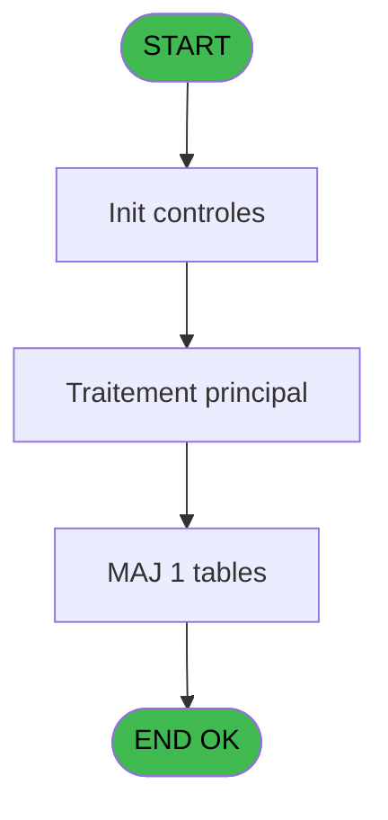
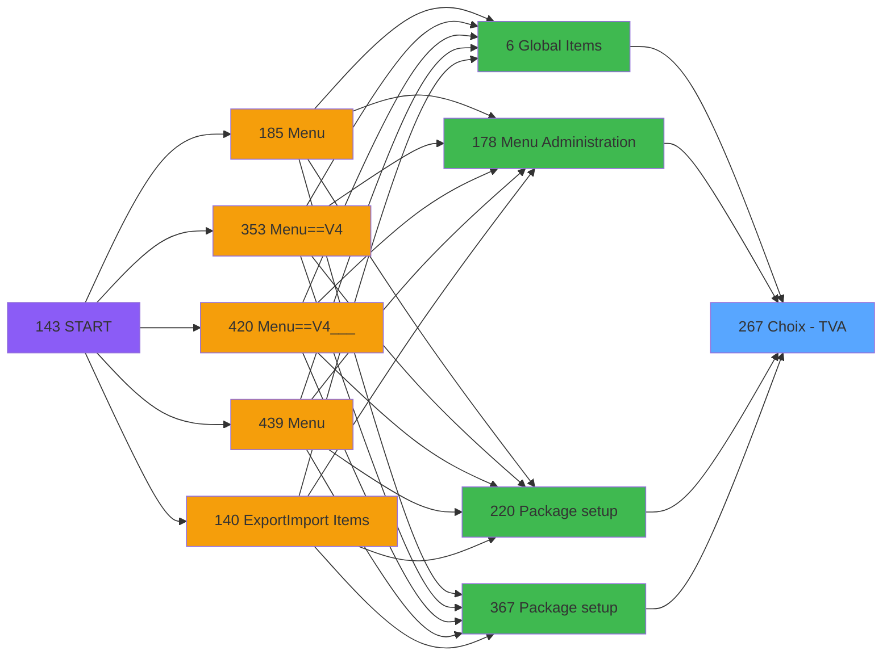
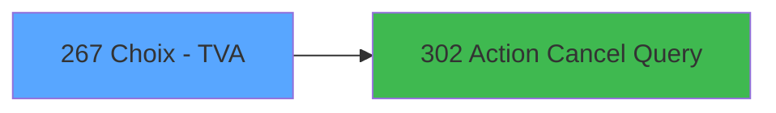

# PVE IDE 267 - Choix - TVA

> **Analyse**: Phases 1-4 2026-02-03 19:18 -> 19:19 (12s) | Assemblage 19:19
> **Pipeline**: V7.2 Enrichi
> **Structure**: 4 onglets (Resume | Ecrans | Donnees | Connexions)

<!-- TAB:Resume -->

## 1. FICHE D'IDENTITE

| Attribut | Valeur |
|----------|--------|
| Projet | PVE |
| IDE Position | 267 |
| Nom Programme | Choix - TVA |
| Fichier source | `Prg_267.xml` |
| Dossier IDE | Tables |
| Taches | 2 (1 ecrans visibles) |
| Tables modifiees | 1 |
| Programmes appeles | 1 |

## 2. DESCRIPTION FONCTIONNELLE

**Choix - TVA** assure la gestion complete de ce processus, accessible depuis [Package setup (IDE 220)](PVE-IDE-220.md), [Package setup (IDE 367)](PVE-IDE-367.md), [Global Items (IDE 6)](PVE-IDE-6.md), [Menu Administration (IDE 178)](PVE-IDE-178.md).

Le flux de traitement s'organise en **1 blocs fonctionnels** :

- **Traitement** (2 taches) : traitements metier divers

**Donnees modifiees** : 1 tables en ecriture (pv_weight).

## 3. BLOCS FONCTIONNELS

### 3.1 Traitement (2 taches)

Traitements internes.

---

#### 267 - TVA list [[ECRAN]](#ecran-t1)

**Role** : Traitement : TVA list.
**Ecran** : 542 x 308 DLU (MDI) | [Voir mockup](#ecran-t1)
**Delegue a** : [Action Cancel Query (IDE 302)](PVE-IDE-302.md)

---

#### 267.1 - Reimpact articles

**Role** : Traitement : Reimpact articles.
**Variables liees** : C (L.Confirmation reimpact)
**Delegue a** : [Action Cancel Query (IDE 302)](PVE-IDE-302.md)

## 5. REGLES METIER

*(Aucune regle metier identifiee)*

## 6. CONTEXTE

- **Appele par**: [Package setup (IDE 220)](PVE-IDE-220.md), [Package setup (IDE 367)](PVE-IDE-367.md), [Global Items (IDE 6)](PVE-IDE-6.md), [Menu Administration (IDE 178)](PVE-IDE-178.md)
- **Appelle**: 1 programmes | **Tables**: 1 (W:1 R:0 L:0) | **Taches**: 2 | **Expressions**: 10

<!-- TAB:Ecrans -->

## 8. ECRANS

### 8.1 Forms visibles (1 / 2)

| # | Position | Tache | Nom | Type | Largeur | Hauteur | Bloc |
|---|----------|-------|-----|------|---------|---------|------|
| 1 | 267 | 267 | TVA list | MDI | 542 | 308 | Traitement |

### 8.2 Mockups Ecrans

---

#### 267 - TVA list
**Tache** : [267](#t1) | **Type** : MDI | **Dimensions** : 542 x 308 DLU
**Bloc** : Traitement | **Titre IDE** : TVA list

<!-- FORM-DATA:
{
    "width":  542,
    "vFactor":  8,
    "type":  "MDI",
    "hFactor":  4,
    "controls":  [
                     {
                         "x":  102,
                         "type":  "label",
                         "var":  "",
                         "y":  64,
                         "w":  53,
                         "fmt":  "",
                         "name":  "",
                         "h":  13,
                         "color":  "183",
                         "text":  "Value",
                         "parent":  null
                     },
                     {
                         "x":  168,
                         "type":  "label",
                         "var":  "",
                         "y":  64,
                         "w":  96,
                         "fmt":  "",
                         "name":  "",
                         "h":  13,
                         "color":  "183",
                         "text":  "Description",
                         "parent":  null
                     },
                     {
                         "x":  1,
                         "type":  "label",
                         "var":  "",
                         "y":  0,
                         "w":  539,
                         "fmt":  "",
                         "name":  "",
                         "h":  42,
                         "color":  "182",
                         "text":  "",
                         "parent":  null
                     },
                     {
                         "x":  14,
                         "type":  "label",
                         "var":  "",
                         "y":  15,
                         "w":  272,
                         "fmt":  "",
                         "name":  "",
                         "h":  10,
                         "color":  "186",
                         "text":  "Add or select a VAT",
                         "parent":  3
                     },
                     {
                         "x":  97,
                         "type":  "table",
                         "var":  "",
                         "name":  "",
                         "titleH":  12,
                         "color":  "110",
                         "w":  291,
                         "y":  78,
                         "fmt":  "",
                         "parent":  null,
                         "text":  "",
                         "rowH":  28,
                         "h":  170,
                         "cols":  [
                                      {
                                          "title":  "",
                                          "layer":  1,
                                          "w":  65
                                      },
                                      {
                                          "title":  "",
                                          "layer":  2,
                                          "w":  223
                                      }
                                  ],
                         "rows":  2
                     },
                     {
                         "x":  0,
                         "type":  "label",
                         "var":  "",
                         "y":  273,
                         "w":  540,
                         "fmt":  "",
                         "name":  "",
                         "h":  34,
                         "color":  "6",
                         "text":  "",
                         "parent":  null
                     },
                     {
                         "x":  102,
                         "type":  "edit",
                         "var":  "",
                         "y":  80,
                         "w":  52,
                         "fmt":  "",
                         "name":  "",
                         "h":  24,
                         "color":  "110",
                         "text":  "",
                         "parent":  6
                     },
                     {
                         "x":  167,
                         "type":  "edit",
                         "var":  "",
                         "y":  81,
                         "w":  210,
                         "fmt":  "",
                         "name":  "",
                         "h":  24,
                         "color":  "110",
                         "text":  "",
                         "parent":  6
                     },
                     {
                         "x":  490,
                         "type":  "image",
                         "var":  "",
                         "y":  4,
                         "w":  48,
                         "fmt":  "",
                         "name":  "",
                         "h":  37,
                         "color":  "",
                         "text":  "",
                         "parent":  3
                     },
                     {
                         "x":  388,
                         "type":  "button",
                         "var":  "",
                         "y":  78,
                         "w":  44,
                         "fmt":  "ñ",
                         "name":  "",
                         "h":  86,
                         "color":  "",
                         "text":  "",
                         "parent":  null
                     },
                     {
                         "x":  388,
                         "type":  "button",
                         "var":  "",
                         "y":  164,
                         "w":  44,
                         "fmt":  "ò",
                         "name":  "",
                         "h":  84,
                         "color":  "",
                         "text":  "",
                         "parent":  null
                     },
                     {
                         "x":  1,
                         "type":  "button",
                         "var":  "",
                         "y":  278,
                         "w":  78,
                         "fmt":  "\u0026Modify mode",
                         "name":  "",
                         "h":  28,
                         "color":  "",
                         "text":  "",
                         "parent":  null
                     },
                     {
                         "x":  78,
                         "type":  "button",
                         "var":  "",
                         "y":  278,
                         "w":  77,
                         "fmt":  "\u0026Add",
                         "name":  "",
                         "h":  28,
                         "color":  "",
                         "text":  "",
                         "parent":  null
                     },
                     {
                         "x":  154,
                         "type":  "button",
                         "var":  "",
                         "y":  278,
                         "w":  77,
                         "fmt":  "\u0026Delete",
                         "name":  "",
                         "h":  28,
                         "color":  "",
                         "text":  "",
                         "parent":  null
                     },
                     {
                         "x":  230,
                         "type":  "button",
                         "var":  "",
                         "y":  278,
                         "w":  77,
                         "fmt":  "\u0026Cancel",
                         "name":  "",
                         "h":  28,
                         "color":  "",
                         "text":  "",
                         "parent":  null
                     },
                     {
                         "x":  385,
                         "type":  "button",
                         "var":  "",
                         "y":  278,
                         "w":  77,
                         "fmt":  "\u0026Select",
                         "name":  "",
                         "h":  28,
                         "color":  "",
                         "text":  "",
                         "parent":  null
                     },
                     {
                         "x":  462,
                         "type":  "button",
                         "var":  "",
                         "y":  278,
                         "w":  77,
                         "fmt":  "\u0026Exit",
                         "name":  "",
                         "h":  28,
                         "color":  "",
                         "text":  "",
                         "parent":  null
                     }
                 ],
    "taskId":  "267",
    "height":  308
}
-->

<strong>Champs : 2 champs</strong>

| Pos (x,y) | Nom | Variable | Type |
|-----------|-----|----------|------|
| 102,80 | (sans nom) | - | edit |
| 167,81 | (sans nom) | - | edit |

<strong>Boutons : 8 boutons</strong>

| Bouton | Pos (x,y) | Action |
|--------|-----------|--------|
| ñ | 388,78 | Bouton fonctionnel |
| ò | 388,164 | Bouton fonctionnel |
| Modify mode | 1,278 | Modifie l'element |
| Add | 78,278 | Ajoute un element |
| Delete | 154,278 | Supprime l'element selectionne |
| Cancel | 230,278 | Appel [Action Cancel Query (IDE 302)](PVE-IDE-302.md) |
| Select | 385,278 | Ouvre la selection |
| Exit | 462,278 | Quitte le programme |

## 9. NAVIGATION

Ecran unique: **TVA list**

### 9.3 Structure hierarchique (2 taches)

| Position | Tache | Type | Dimensions | Bloc |
|----------|-------|------|------------|------|
| **267.1** | [**TVA list** (267)](#t1) [mockup](#ecran-t1) | MDI | 542x308 | Traitement |
| 267.1.1 | [Reimpact articles (267.1)](#t2) | - | - | |

### 9.4 Algorigramme

> **Legende**: Vert = START/END OK | Rouge = END KO | Bleu = Decisions
> *Algorigramme auto-genere. Utiliser `/algorigramme` pour une synthese metier detaillee.*

<!-- TAB:Donnees -->

## 10. TABLES

### Tables utilisees (1)

| ID | Nom | Description | Type | R | W | L | Usages |
|----|-----|-------------|------|---|---|---|--------|
| 417 | pv_weight |  | DB |   | **W** |   | 1 |

### Colonnes par table (1 / 1 tables avec colonnes identifiees)

Table 417 - pv_weight (**W**) - 1 usages

| Lettre | Variable | Acces | Type |
|--------|----------|-------|------|
| A | P. TVA | W | Numeric |
| B | V.Ancien taux TVA | W | Numeric |
| C | L.Confirmation reimpact | W | Numeric |

## 11. VARIABLES

### 11.1 Parametres entrants (1)

Variables recues du programme appelant ([Package setup (IDE 220)](PVE-IDE-220.md)).

| Lettre | Nom | Type | Usage dans |
|--------|-----|------|-----------|
| A | P. TVA | Numeric | 1x parametre entrant |

### 11.2 Variables de session (1)

Variables persistantes pendant toute la session.

| Lettre | Nom | Type | Usage dans |
|--------|-----|------|-----------|
| B | V.Ancien taux TVA | Numeric | - |

### 11.3 Autres (1)

Variables diverses.

| Lettre | Nom | Type | Usage dans |
|--------|-----|------|-----------|
| C | L.Confirmation reimpact | Numeric | [267.1](#t2) |

## 12. EXPRESSIONS

**10 / 10 expressions decodees (100%)**

### 12.1 Repartition par type

| Type | Expressions | Regles |
|------|-------------|--------|
| CONSTANTE | 1 | 0 |
| CONDITION | 3 | 0 |
| OTHER | 5 | 0 |
| NEGATION | 1 | 0 |

### 12.2 Expressions cles par type

#### CONSTANTE (1 expressions)

| Type | IDE | Expression | Regle |
|------|-----|------------|-------|
| CONSTANTE | 5 | `''` | - |

#### CONDITION (3 expressions)

| Type | IDE | Expression | Regle |
|------|-----|------------|-------|
| CONDITION | 10 | `L.Confirmation reimpact [C]<>[E]` | - |
| CONDITION | 9 | `[F]=6` | - |
| CONDITION | 1 | `GetParam ('GROUP')='INFORMATICIEN' OR GetParam ('GROUP')='GESTION'` | - |

#### OTHER (5 expressions)

| Type | IDE | Expression | Regle |
|------|-----|------------|-------|
| OTHER | 6 | `P. TVA [A]` | - |
| OTHER | 7 | `L.Confirmation reimpact [C]` | - |
| OTHER | 4 | `Stat (0,'CM'MODE)` | - |
| OTHER | 2 | `Stat (0,'E'MODE)` | - |
| OTHER | 3 | `Stat (0,'M'MODE)` | - |

#### NEGATION (1 expressions)

| Type | IDE | Expression | Regle |
|------|-----|------------|-------|
| NEGATION | 8 | `NOT Stat(0,'C'MODE)` | - |

<!-- TAB:Connexions -->

## 13. GRAPHE D'APPELS

### 13.1 Chaine depuis Main (Callers)

Main -> ... -> [Package setup (IDE 220)](PVE-IDE-220.md) -> **Choix - TVA (IDE 267)**

Main -> ... -> [Package setup (IDE 367)](PVE-IDE-367.md) -> **Choix - TVA (IDE 267)**

Main -> ... -> [Global Items (IDE 6)](PVE-IDE-6.md) -> **Choix - TVA (IDE 267)**

Main -> ... -> [Menu Administration (IDE 178)](PVE-IDE-178.md) -> **Choix - TVA (IDE 267)**

### 13.2 Callers

| IDE | Nom Programme | Nb Appels |
|-----|---------------|-----------|
| [220](PVE-IDE-220.md) | Package setup | 2 |
| [367](PVE-IDE-367.md) | Package setup | 2 |
| [6](PVE-IDE-6.md) | Global Items | 1 |
| [178](PVE-IDE-178.md) | Menu Administration | 1 |

### 13.3 Callees (programmes appeles)

### 13.4 Detail Callees avec contexte

| IDE | Nom Programme | Appels | Contexte |
|-----|---------------|--------|----------|
| [302](PVE-IDE-302.md) | Action Cancel Query | 1 | Sous-programme |

## 14. RECOMMANDATIONS MIGRATION

### 14.1 Profil du programme

| Metrique | Valeur | Impact migration |
|----------|--------|-----------------|
| Lignes de logique | 16 | Programme compact |
| Expressions | 10 | Peu de logique |
| Tables WRITE | 1 | Impact faible |
| Sous-programmes | 1 | Peu de dependances |
| Ecrans visibles | 1 | Ecran unique ou traitement batch |
| Code desactive | 0% (0 / 16) | Code sain |
| Regles metier | 0 | Pas de regle identifiee |

### 14.2 Plan de migration par bloc

#### Traitement (2 taches: 1 ecran, 1 traitement)

- **Strategie** : Orchestrateur avec 1 ecrans (Razor/React) et 1 traitements backend (services).
- Les ecrans deviennent des composants UI, les traitements invisibles deviennent des services injectables.
- 1 sous-programme(s) a migrer ou a reutiliser depuis les services existants.
- Decomposer les taches en services unitaires testables.

### 14.3 Dependances critiques

| Dependance | Type | Appels | Impact |
|------------|------|--------|--------|
| pv_weight | Table WRITE (Database) | 1x | Schema + repository |
| [Action Cancel Query (IDE 302)](PVE-IDE-302.md) | Sous-programme | 1x | Normale - Sous-programme |

---
*Spec DETAILED generee par Pipeline V7.2 - 2026-02-03 19:19*
