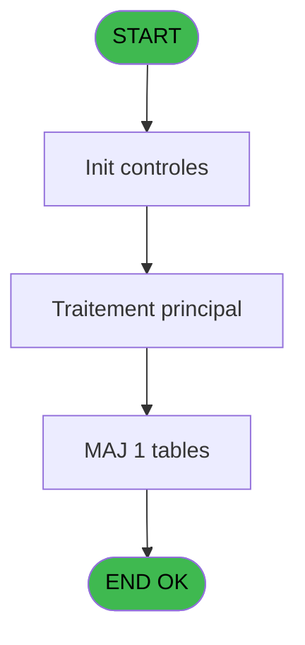
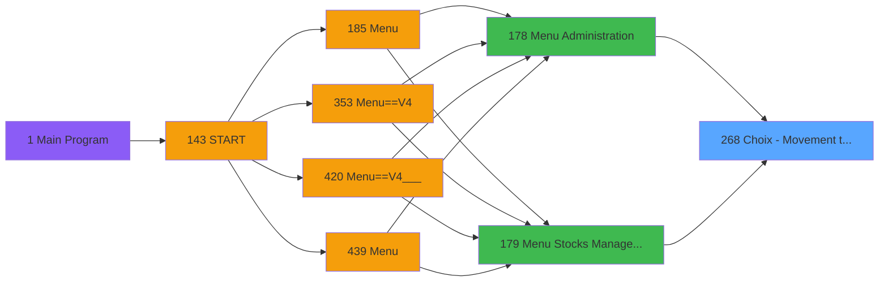
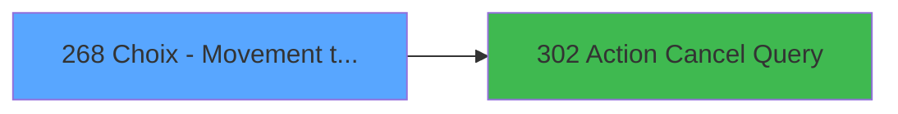

# PVE IDE 268 - Choix - Movement types

> **Analyse**: Phases 1-4 2026-02-03 19:19 -> 19:19 (13s) | Assemblage 19:19
> **Pipeline**: V7.2 Enrichi
> **Structure**: 4 onglets (Resume | Ecrans | Donnees | Connexions)

<!-- TAB:Resume -->

## 1. FICHE D'IDENTITE

| Attribut | Valeur |
|----------|--------|
| Projet | PVE |
| IDE Position | 268 |
| Nom Programme | Choix - Movement types |
| Fichier source | `Prg_268.xml` |
| Dossier IDE | Tables |
| Taches | 1 (1 ecrans visibles) |
| Tables modifiees | 1 |
| Programmes appeles | 1 |

## 2. DESCRIPTION FONCTIONNELLE

**Choix - Movement types** assure la gestion complete de ce processus, accessible depuis [Menu Stocks Management (IDE 179)](PVE-IDE-179.md), [Menu Administration (IDE 178)](PVE-IDE-178.md).

Le flux de traitement s'organise en **1 blocs fonctionnels** :

- **Traitement** (1 tache) : traitements metier divers

**Donnees modifiees** : 1 tables en ecriture (pv_ligne_inv_stock).

**Logique metier** : 3 regles identifiees couvrant conditions metier.

## 3. BLOCS FONCTIONNELS

### 3.1 Traitement (1 tache)

Traitements internes.

---

#### 268 - Movement types [[ECRAN]](#ecran-t1)

**Role** : Traitement : Movement types.
**Ecran** : 542 x 312 DLU (MDI) | [Voir mockup](#ecran-t1)
**Delegue a** : [Action Cancel Query (IDE 302)](PVE-IDE-302.md)

## 5. REGLES METIER

3 regles identifiees:

### Autres (3 regles)

#### [RM-001] Si Stat (0 alors 'C'MODE) sinon 'Out',[F])

| Element | Detail |
|---------|--------|
| **Condition** | `Stat (0` |
| **Si vrai** | 'C'MODE) |
| **Si faux** | 'Out',[F]) |
| **Expression source** | Expression 2 : `IF (Stat (0,'C'MODE),'Out',[F])` |
| **Exemple** | Si Stat (0 → 'C'MODE). Sinon → 'Out',[F]) |

#### [RM-002] Condition toujours vraie (flag actif)

| Element | Detail |
|---------|--------|
| **Condition** | `P.Saisie manuelle [B]` |
| **Si vrai** | L Mouvement [C]='M' |
| **Si faux** | 'TRUE'LOG) |
| **Variables** | B (P.Saisie manuelle), C (L Mouvement) |
| **Expression source** | Expression 13 : `IF(P.Saisie manuelle [B],L Mouvement [C]='M','TRUE'LOG)` |
| **Exemple** | Si P.Saisie manuelle [B] → L Mouvement [C]='M'. Sinon → 'TRUE'LOG) |

#### [RM-003] Si VG122 alors 72+[M] sinon 72)

| Element | Detail |
|---------|--------|
| **Condition** | `VG122` |
| **Si vrai** | 72+[M] |
| **Si faux** | 72) |
| **Expression source** | Expression 16 : `IF(VG122,72+[M],72)` |
| **Exemple** | Si VG122 → 72+[M]. Sinon → 72) |

## 6. CONTEXTE

- **Appele par**: [Menu Stocks Management (IDE 179)](PVE-IDE-179.md), [Menu Administration (IDE 178)](PVE-IDE-178.md)
- **Appelle**: 1 programmes | **Tables**: 2 (W:1 R:0 L:1) | **Taches**: 1 | **Expressions**: 22

<!-- TAB:Ecrans -->

## 8. ECRANS

### 8.1 Forms visibles (1 / 1)

| # | Position | Tache | Nom | Type | Largeur | Hauteur | Bloc |
|---|----------|-------|-----|------|---------|---------|------|
| 1 | 268 | 268 | Movement types | MDI | 542 | 312 | Traitement |

### 8.2 Mockups Ecrans

---

#### 268 - Movement types
**Tache** : [268](#t1) | **Type** : MDI | **Dimensions** : 542 x 312 DLU
**Bloc** : Traitement | **Titre IDE** : Movement types

<!-- FORM-DATA:
{
    "width":  542,
    "vFactor":  8,
    "type":  "MDI",
    "hFactor":  4,
    "controls":  [
                     {
                         "x":  106,
                         "type":  "label",
                         "var":  "",
                         "y":  51,
                         "w":  56,
                         "fmt":  "",
                         "name":  "",
                         "h":  12,
                         "color":  "183",
                         "text":  "Code",
                         "parent":  null
                     },
                     {
                         "x":  182,
                         "type":  "label",
                         "var":  "",
                         "y":  51,
                         "w":  107,
                         "fmt":  "",
                         "name":  "",
                         "h":  12,
                         "color":  "183",
                         "text":  "Description",
                         "parent":  null
                     },
                     {
                         "x":  326,
                         "type":  "label",
                         "var":  "",
                         "y":  51,
                         "w":  48,
                         "fmt":  "",
                         "name":  "",
                         "h":  12,
                         "color":  "183",
                         "text":  "In / Out",
                         "parent":  null
                     },
                     {
                         "x":  391,
                         "type":  "label",
                         "var":  "",
                         "y":  51,
                         "w":  48,
                         "fmt":  "",
                         "name":  "",
                         "h":  12,
                         "color":  "183",
                         "text":  "Reason",
                         "parent":  null
                     },
                     {
                         "x":  0,
                         "type":  "label",
                         "var":  "",
                         "y":  0,
                         "w":  539,
                         "fmt":  "",
                         "name":  "",
                         "h":  42,
                         "color":  "182",
                         "text":  "",
                         "parent":  null
                     },
                     {
                         "x":  15,
                         "type":  "label",
                         "var":  "",
                         "y":  15,
                         "w":  271,
                         "fmt":  "",
                         "name":  "",
                         "h":  10,
                         "color":  "186",
                         "text":  "Add or select a movement type",
                         "parent":  5
                     },
                     {
                         "x":  101,
                         "type":  "table",
                         "var":  "",
                         "name":  "",
                         "titleH":  12,
                         "color":  "110",
                         "w":  351,
                         "y":  65,
                         "fmt":  "",
                         "parent":  null,
                         "text":  "",
                         "rowH":  25,
                         "h":  200,
                         "cols":  [
                                      {
                                          "title":  "",
                                          "layer":  1,
                                          "w":  64
                                      },
                                      {
                                          "title":  "",
                                          "layer":  2,
                                          "w":  153
                                      },
                                      {
                                          "title":  "",
                                          "layer":  3,
                                          "w":  67
                                      },
                                      {
                                          "title":  "",
                                          "layer":  4,
                                          "w":  64
                                      }
                                  ],
                         "rows":  4
                     },
                     {
                         "x":  0,
                         "type":  "label",
                         "var":  "",
                         "y":  277,
                         "w":  540,
                         "fmt":  "",
                         "name":  "",
                         "h":  33,
                         "color":  "6",
                         "text":  "",
                         "parent":  null
                     },
                     {
                         "x":  108,
                         "type":  "edit",
                         "var":  "",
                         "y":  69,
                         "w":  50,
                         "fmt":  "",
                         "name":  "",
                         "h":  19,
                         "color":  "6",
                         "text":  "",
                         "parent":  8
                     },
                     {
                         "x":  171,
                         "type":  "edit",
                         "var":  "",
                         "y":  69,
                         "w":  142,
                         "fmt":  "",
                         "name":  "",
                         "h":  19,
                         "color":  "6",
                         "text":  "",
                         "parent":  8
                     },
                     {
                         "x":  326,
                         "type":  "combobox",
                         "var":  "",
                         "y":  72,
                         "w":  51,
                         "fmt":  "",
                         "name":  "",
                         "h":  12,
                         "color":  "6",
                         "text":  "In,Out",
                         "parent":  8
                     },
                     {
                         "x":  490,
                         "type":  "image",
                         "var":  "",
                         "y":  4,
                         "w":  48,
                         "fmt":  "",
                         "name":  "",
                         "h":  37,
                         "color":  "",
                         "text":  "",
                         "parent":  5
                     },
                     {
                         "x":  388,
                         "type":  "button",
                         "var":  "",
                         "y":  66,
                         "w":  44,
                         "fmt":  "ñ",
                         "name":  "",
                         "h":  99,
                         "color":  "",
                         "text":  "",
                         "parent":  null
                     },
                     {
                         "x":  388,
                         "type":  "button",
                         "var":  "",
                         "y":  165,
                         "w":  44,
                         "fmt":  "ò",
                         "name":  "",
                         "h":  102,
                         "color":  "",
                         "text":  "",
                         "parent":  null
                     },
                     {
                         "x":  1,
                         "type":  "button",
                         "var":  "",
                         "y":  282,
                         "w":  78,
                         "fmt":  "\u0026Modify mode",
                         "name":  "",
                         "h":  28,
                         "color":  "",
                         "text":  "",
                         "parent":  null
                     },
                     {
                         "x":  78,
                         "type":  "button",
                         "var":  "",
                         "y":  282,
                         "w":  77,
                         "fmt":  "\u0026Add",
                         "name":  "",
                         "h":  28,
                         "color":  "",
                         "text":  "",
                         "parent":  null
                     },
                     {
                         "x":  154,
                         "type":  "button",
                         "var":  "",
                         "y":  282,
                         "w":  77,
                         "fmt":  "\u0026Delete",
                         "name":  "",
                         "h":  28,
                         "color":  "",
                         "text":  "",
                         "parent":  null
                     },
                     {
                         "x":  230,
                         "type":  "button",
                         "var":  "",
                         "y":  282,
                         "w":  77,
                         "fmt":  "\u0026Cancel",
                         "name":  "",
                         "h":  28,
                         "color":  "",
                         "text":  "",
                         "parent":  null
                     },
                     {
                         "x":  387,
                         "type":  "button",
                         "var":  "",
                         "y":  282,
                         "w":  77,
                         "fmt":  "\u0026Select",
                         "name":  "",
                         "h":  28,
                         "color":  "",
                         "text":  "",
                         "parent":  null
                     },
                     {
                         "x":  463,
                         "type":  "button",
                         "var":  "",
                         "y":  282,
                         "w":  77,
                         "fmt":  "\u0026Exit",
                         "name":  "",
                         "h":  28,
                         "color":  "",
                         "text":  "",
                         "parent":  null
                     },
                     {
                         "x":  392,
                         "type":  "combobox",
                         "var":  "",
                         "y":  72,
                         "w":  51,
                         "fmt":  "",
                         "name":  "MTY_Reason_Needed",
                         "h":  12,
                         "color":  "6",
                         "text":  "Yes,No",
                         "parent":  8
                     }
                 ],
    "taskId":  "268",
    "height":  312
}
-->

<strong>Champs : 4 champs</strong>

| Pos (x,y) | Nom | Variable | Type |
|-----------|-----|----------|------|
| 108,69 | (sans nom) | - | edit |
| 171,69 | (sans nom) | - | edit |
| 326,72 | In,Out | - | combobox |
| 392,72 | MTY_Reason_Needed | - | combobox |

<strong>Boutons : 8 boutons</strong>

| Bouton | Pos (x,y) | Action |
|--------|-----------|--------|
| ñ | 388,66 | Bouton fonctionnel |
| ò | 388,165 | Bouton fonctionnel |
| Modify mode | 1,282 | Modifie l'element |
| Add | 78,282 | Ajoute un element |
| Delete | 154,282 | Supprime l'element selectionne |
| Cancel | 230,282 | Appel [Action Cancel Query (IDE 302)](PVE-IDE-302.md) |
| Select | 387,282 | Ouvre la selection |
| Exit | 463,282 | Quitte le programme |

## 9. NAVIGATION

Ecran unique: **Movement types**

### 9.3 Structure hierarchique (1 tache)

| Position | Tache | Type | Dimensions | Bloc |
|----------|-------|------|------------|------|
| **268.1** | [**Movement types** (268)](#t1) [mockup](#ecran-t1) | MDI | 542x312 | Traitement |

### 9.4 Algorigramme

> **Legende**: Vert = START/END OK | Rouge = END KO | Bleu = Decisions
> *Algorigramme auto-genere. Utiliser `/algorigramme` pour une synthese metier detaillee.*

<!-- TAB:Donnees -->

## 10. TABLES

### Tables utilisees (2)

| ID | Nom | Description | Type | R | W | L | Usages |
|----|-----|-------------|------|---|---|---|--------|
| 761 | pv_ligne_inv_stock | Articles et stock | DB |   | **W** |   | 1 |
| 762 | pv_mvt_stock_tempo | Table temporaire ecran | DB |   |   | L | 1 |

### Colonnes par table (1 / 1 tables avec colonnes identifiees)

Table 761 - pv_ligne_inv_stock (**W**) - 1 usages

| Lettre | Variable | Acces | Type |
|--------|----------|-------|------|
| A | P. Type | W | Numeric |
| B | P.Saisie manuelle | W | Logical |
| C | L Mouvement | W | Logical |
| D | v.Décalage insertion Reason Nee | W | Numeric |

## 11. VARIABLES

### 11.1 Parametres entrants (2)

Variables recues du programme appelant ([Menu Stocks Management (IDE 179)](PVE-IDE-179.md)).

| Lettre | Nom | Type | Usage dans |
|--------|-----|------|-----------|
| A | P. Type | Numeric | [268](#t1) |
| B | P.Saisie manuelle | Logical | 1x parametre entrant |

### 11.2 Variables de session (1)

Variables persistantes pendant toute la session.

| Lettre | Nom | Type | Usage dans |
|--------|-----|------|-----------|
| D | v.Décalage insertion Reason Nee | Numeric | - |

### 11.3 Autres (1)

Variables diverses.

| Lettre | Nom | Type | Usage dans |
|--------|-----|------|-----------|
| C | L Mouvement | Logical | 1x refs |

## 12. EXPRESSIONS

**22 / 22 expressions decodees (100%)**

### 12.1 Repartition par type

| Type | Expressions | Regles |
|------|-------------|--------|
| CONDITION | 10 | 2 |
| CAST_LOGIQUE | 1 | 5 |
| CONSTANTE | 1 | 0 |
| OTHER | 7 | 0 |
| REFERENCE_VG | 2 | 0 |
| NEGATION | 1 | 0 |

### 12.2 Expressions cles par type

#### CONDITION (10 expressions)

| Type | IDE | Expression | Regle |
|------|-----|------------|-------|
| CONDITION | 16 | `IF(VG122,72+[M],72)` | [RM-003](#rm-RM-003) |
| CONDITION | 2 | `IF (Stat (0,'C'MODE),'Out',[F])` | [RM-001](#rm-RM-001) |
| CONDITION | 22 | `IF(VG122,97.75-([M]/2),97.75)` | - |
| CONDITION | 21 | `IF(VG122,97+([M]/2),97)` | - |
| CONDITION | 9 | `Stat (0,'M'MODE) AND NOT (Range (v.Décalage insertion R... [D],1,5)) AND v.Décalage insertion R... [D]<>99 AND NOT ([H])` | - |
| ... | | *+5 autres* | |

#### CAST_LOGIQUE (1 expressions)

| Type | IDE | Expression | Regle |
|------|-----|------------|-------|
| CAST_LOGIQUE | 13 | `IF(P.Saisie manuelle [B],L Mouvement [C]='M','TRUE'LOG)` | [RM-002](#rm-RM-002) |

#### CONSTANTE (1 expressions)

| Type | IDE | Expression | Regle |
|------|-----|------------|-------|
| CONSTANTE | 14 | `'M'` | - |

#### OTHER (7 expressions)

| Type | IDE | Expression | Regle |
|------|-----|------------|-------|
| OTHER | 8 | `Stat (0,'M'MODE)` | - |
| OTHER | 10 | `Stat (0,'CM'MODE)` | - |
| OTHER | 11 | `Stat (0,'C'MODE)` | - |
| OTHER | 7 | `Stat (0,'E'MODE)` | - |
| OTHER | 1 | `P. Type [A]` | - |
| ... | | *+2 autres* | |

#### REFERENCE_VG (2 expressions)

| Type | IDE | Expression | Regle |
|------|-----|------------|-------|
| REFERENCE_VG | 15 | `VG122` | - |
| REFERENCE_VG | 5 | `VG9` | - |

#### NEGATION (1 expressions)

| Type | IDE | Expression | Regle |
|------|-----|------------|-------|
| NEGATION | 12 | `NOT (Range (v.Décalage insertion R... [D],1,5)) AND v.Décalage insertion R... [D]<>99` | - |

### 12.3 Toutes les expressions (22)

Voir les 22 expressions

#### CONDITION (10)

| IDE | Expression Decodee |
|-----|-------------------|
| 2 | `IF (Stat (0,'C'MODE),'Out',[F])` |
| 16 | `IF(VG122,72+[M],72)` |
| 17 | `IF(VG122,26.5-([M]/2),26.5)` |
| 18 | `IF(VG122,25.25-([M]/2),25.25)` |
| 19 | `IF(VG122,45.5-([M]/2),45.5)` |
| 20 | `IF(VG122,81.5-([M]/2),81.5)` |
| 21 | `IF(VG122,97+([M]/2),97)` |
| 22 | `IF(VG122,97.75-([M]/2),97.75)` |
| 6 | `VG9 AND NOT (Range (v.Décalage insertion R... [D],1,5)) AND v.Décalage insertion R... [D]<>99 AND NOT ([H])` |
| 9 | `Stat (0,'M'MODE) AND NOT (Range (v.Décalage insertion R... [D],1,5)) AND v.Décalage insertion R... [D]<>99 AND NOT ([H])` |

#### CAST_LOGIQUE (1)

| IDE | Expression Decodee |
|-----|-------------------|
| 13 | `IF(P.Saisie manuelle [B],L Mouvement [C]='M','TRUE'LOG)` |

#### CONSTANTE (1)

| IDE | Expression Decodee |
|-----|-------------------|
| 14 | `'M'` |

#### OTHER (7)

| IDE | Expression Decodee |
|-----|-------------------|
| 1 | `P. Type [A]` |
| 3 | `GetParam ('SERVICE')` |
| 4 | `v.Décalage insertion R... [D]` |
| 7 | `Stat (0,'E'MODE)` |
| 8 | `Stat (0,'M'MODE)` |
| 10 | `Stat (0,'CM'MODE)` |
| 11 | `Stat (0,'C'MODE)` |

#### REFERENCE_VG (2)

| IDE | Expression Decodee |
|-----|-------------------|
| 5 | `VG9` |
| 15 | `VG122` |

#### NEGATION (1)

| IDE | Expression Decodee |
|-----|-------------------|
| 12 | `NOT (Range (v.Décalage insertion R... [D],1,5)) AND v.Décalage insertion R... [D]<>99` |

<!-- TAB:Connexions -->

## 13. GRAPHE D'APPELS

### 13.1 Chaine depuis Main (Callers)

Main -> ... -> [Menu Stocks Management (IDE 179)](PVE-IDE-179.md) -> **Choix - Movement types (IDE 268)**

Main -> ... -> [Menu Administration (IDE 178)](PVE-IDE-178.md) -> **Choix - Movement types (IDE 268)**

### 13.2 Callers

| IDE | Nom Programme | Nb Appels |
|-----|---------------|-----------|
| [179](PVE-IDE-179.md) | Menu Stocks Management | 2 |
| [178](PVE-IDE-178.md) | Menu Administration | 1 |

### 13.3 Callees (programmes appeles)

### 13.4 Detail Callees avec contexte

| IDE | Nom Programme | Appels | Contexte |
|-----|---------------|--------|----------|
| [302](PVE-IDE-302.md) | Action Cancel Query | 1 | Sous-programme |

## 14. RECOMMANDATIONS MIGRATION

### 14.1 Profil du programme

| Metrique | Valeur | Impact migration |
|----------|--------|-----------------|
| Lignes de logique | 20 | Programme compact |
| Expressions | 22 | Peu de logique |
| Tables WRITE | 1 | Impact faible |
| Sous-programmes | 1 | Peu de dependances |
| Ecrans visibles | 1 | Ecran unique ou traitement batch |
| Code desactive | 0% (0 / 20) | Code sain |
| Regles metier | 3 | Quelques regles a preserver |

### 14.2 Plan de migration par bloc

#### Traitement (1 tache: 1 ecran, 0 traitement)

- **Strategie** : 1 composant(s) UI (Razor/React) avec formulaires et validation.
- 1 sous-programme(s) a migrer ou a reutiliser depuis les services existants.
- Decomposer les taches en services unitaires testables.

### 14.3 Dependances critiques

| Dependance | Type | Appels | Impact |
|------------|------|--------|--------|
| pv_ligne_inv_stock | Table WRITE (Database) | 1x | Schema + repository |
| [Action Cancel Query (IDE 302)](PVE-IDE-302.md) | Sous-programme | 1x | Normale - Sous-programme |

---
*Spec DETAILED generee par Pipeline V7.2 - 2026-02-03 19:19*
