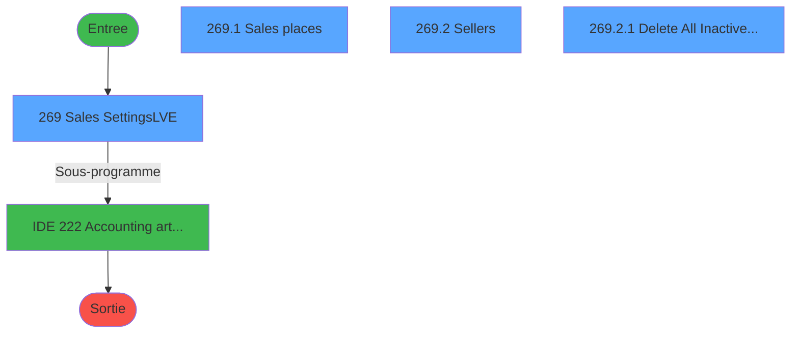
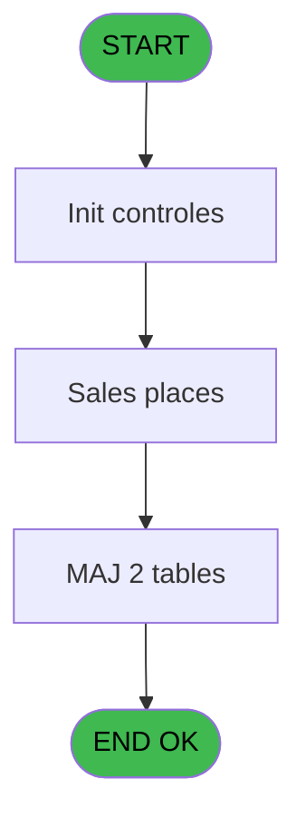
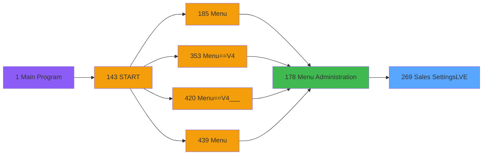
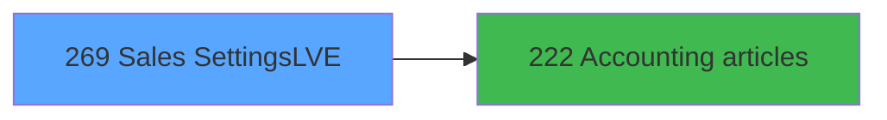

# PVE IDE 269 - Sales Settings(LVE)

> **Analyse**: Phases 1-4 2026-02-03 19:19 -> 19:19 (14s) | Assemblage 19:19
> **Pipeline**: V7.2 Enrichi
> **Structure**: 4 onglets (Resume | Ecrans | Donnees | Connexions)

<!-- TAB:Resume -->

## 1. FICHE D'IDENTITE

| Attribut | Valeur |
|----------|--------|
| Projet | PVE |
| IDE Position | 269 |
| Nom Programme | Sales Settings(LVE) |
| Fichier source | `Prg_269.xml` |
| Dossier IDE | Tables |
| Taches | 4 (4 ecrans visibles) |
| Tables modifiees | 2 |
| Programmes appeles | 1 |

## 2. DESCRIPTION FONCTIONNELLE

**Sales Settings(LVE)** assure la gestion complete de ce processus, accessible depuis [Menu Administration (IDE 178)](PVE-IDE-178.md).

Le flux de traitement s'organise en **1 blocs fonctionnels** :

- **Traitement** (4 taches) : traitements metier divers

**Donnees modifiees** : 2 tables en ecriture (tranche_age, code_reduction).

**Logique metier** : 1 regles identifiees couvrant conditions metier.

Detail : phases du traitement

#### Phase 1 : Traitement (4 taches)

- **269** - Sales Settings(LVE) **[[ECRAN]](#ecran-t1)**
- **269.1** - Sales places **[[ECRAN]](#ecran-t2)**
- **269.2** - Sellers **[[ECRAN]](#ecran-t3)**
- **269.2.1** - Delete All Inactive Sellers **[[ECRAN]](#ecran-t4)**

Delegue a : [   Accounting articles (IDE 222)](PVE-IDE-222.md)

#### Tables impactees

| Table | Operations | Role metier |
|-------|-----------|-------------|
| tranche_age | **W**/L (2 usages) |  |
| code_reduction | **W** (1 usages) |  |

## 3. BLOCS FONCTIONNELS

### 3.1 Traitement (4 taches)

Traitements internes.

---

#### 269 - Sales Settings(LVE) [[ECRAN]](#ecran-t1)

**Role** : Traitement : Sales Settings(LVE).
**Ecran** : 687 x 411 DLU (MDI) | [Voir mockup](#ecran-t1)

3 sous-taches directes

| Tache | Nom | Bloc |
|-------|-----|------|
| [269.1](#t2) | Sales places **[[ECRAN]](#ecran-t2)** | Traitement |
| [269.2](#t3) | Sellers **[[ECRAN]](#ecran-t3)** | Traitement |
| [269.2.1](#t4) | Delete All Inactive Sellers **[[ECRAN]](#ecran-t4)** | Traitement |

**Delegue a** : [   Accounting articles (IDE 222)](PVE-IDE-222.md)

---

#### 269.1 - Sales places [[ECRAN]](#ecran-t2)

**Role** : Traitement : Sales places.
**Ecran** : 667 x 138 DLU | [Voir mockup](#ecran-t2)
**Delegue a** : [   Accounting articles (IDE 222)](PVE-IDE-222.md)

---

#### 269.2 - Sellers [[ECRAN]](#ecran-t3)

**Role** : Traitement : Sellers.
**Ecran** : 666 x 131 DLU | [Voir mockup](#ecran-t3)
**Delegue a** : [   Accounting articles (IDE 222)](PVE-IDE-222.md)

---

#### 269.2.1 - Delete All Inactive Sellers [[ECRAN]](#ecran-t4)

**Role** : Traitement : Delete All Inactive Sellers.
**Ecran** : 198 x 35 DLU | [Voir mockup](#ecran-t4)
**Variables liees** : G (V.Valide Delete Inactive)
**Delegue a** : [   Accounting articles (IDE 222)](PVE-IDE-222.md)

## 5. REGLES METIER

1 regles identifiees:

### Autres (1 regles)

#### [RM-001] Si B Imputation [E]='A' alors '' sinon B Imputation [E])

| Element | Detail |
|---------|--------|
| **Condition** | `B Imputation [E]='A'` |
| **Si vrai** | '' |
| **Si faux** | B Imputation [E]) |
| **Variables** | E (B Imputation) |
| **Expression source** | Expression 3 : `IF(B Imputation [E]='A','',B Imputation [E])` |
| **Exemple** | Si B Imputation [E]='A' → ''. Sinon → B Imputation [E]) |

## 6. CONTEXTE

- **Appele par**: [Menu Administration (IDE 178)](PVE-IDE-178.md)
- **Appelle**: 1 programmes | **Tables**: 6 (W:2 R:2 L:4) | **Taches**: 4 | **Expressions**: 4

<!-- TAB:Ecrans -->

## 8. ECRANS

### 8.1 Forms visibles (4 / 4)

| # | Position | Tache | Nom | Type | Largeur | Hauteur | Bloc |
|---|----------|-------|-----|------|---------|---------|------|
| 1 | 269 | 269 | Sales Settings(LVE) | MDI | 687 | 411 | Traitement |
| 2 | 269.1 | 269.1 | Sales places | Type0 | 667 | 138 | Traitement |
| 3 | 269.2 | 269.2 | Sellers | Type0 | 666 | 131 | Traitement |
| 4 | 269.2.1 | 269.2.1 | Delete All Inactive Sellers | Type0 | 198 | 35 | Traitement |

### 8.2 Mockups Ecrans

---

#### 269 - Sales Settings(LVE)
**Tache** : [269](#t1) | **Type** : MDI | **Dimensions** : 687 x 411 DLU
**Bloc** : Traitement | **Titre IDE** : Sales Settings(LVE)

<!-- FORM-DATA:
{
    "width":  687,
    "vFactor":  8,
    "type":  "MDI",
    "hFactor":  4,
    "controls":  [
                     {
                         "x":  5,
                         "type":  "label",
                         "var":  "",
                         "y":  382,
                         "w":  677,
                         "fmt":  "",
                         "name":  "",
                         "h":  28,
                         "color":  "",
                         "text":  "",
                         "parent":  null
                     },
                     {
                         "x":  1,
                         "type":  "label",
                         "var":  "",
                         "y":  0,
                         "w":  682,
                         "fmt":  "",
                         "name":  "",
                         "h":  32,
                         "color":  "182",
                         "text":  "",
                         "parent":  null
                     },
                     {
                         "x":  14,
                         "type":  "label",
                         "var":  "",
                         "y":  11,
                         "w":  102,
                         "fmt":  "",
                         "name":  "",
                         "h":  10,
                         "color":  "186",
                         "text":  "Sales Settings",
                         "parent":  2
                     },
                     {
                         "x":  147,
                         "type":  "label",
                         "var":  "",
                         "y":  11,
                         "w":  53,
                         "fmt":  "",
                         "name":  "",
                         "h":  10,
                         "color":  "186",
                         "text":  "Service :",
                         "parent":  2
                     },
                     {
                         "x":  4,
                         "type":  "label",
                         "var":  "",
                         "y":  49,
                         "w":  678,
                         "fmt":  "",
                         "name":  "",
                         "h":  153,
                         "color":  "187",
                         "text":  "Sales Places",
                         "parent":  null
                     },
                     {
                         "x":  4,
                         "type":  "label",
                         "var":  "",
                         "y":  217,
                         "w":  678,
                         "fmt":  "",
                         "name":  "",
                         "h":  164,
                         "color":  "187",
                         "text":  "Sellers",
                         "parent":  null
                     },
                     {
                         "x":  636,
                         "type":  "image",
                         "var":  "",
                         "y":  4,
                         "w":  40,
                         "fmt":  "",
                         "name":  "",
                         "h":  27,
                         "color":  "",
                         "text":  "",
                         "parent":  2
                     },
                     {
                         "x":  599,
                         "type":  "button",
                         "var":  "",
                         "y":  384,
                         "w":  77,
                         "fmt":  "\u0026Exit",
                         "name":  "Bt.Quitter",
                         "h":  24,
                         "color":  "",
                         "text":  "",
                         "parent":  null
                     },
                     {
                         "x":  9,
                         "type":  "checkbox",
                         "var":  "",
                         "y":  33,
                         "w":  178,
                         "fmt":  "",
                         "name":  "V Preview",
                         "h":  15,
                         "color":  "187",
                         "text":  "Manage Sales Places ?",
                         "parent":  null
                     },
                     {
                         "x":  9,
                         "type":  "checkbox",
                         "var":  "",
                         "y":  203,
                         "w":  178,
                         "fmt":  "",
                         "name":  "V Show Printers",
                         "h":  14,
                         "color":  "187",
                         "text":  "Manage Sellers ?",
                         "parent":  null
                     },
                     {
                         "x":  9,
                         "type":  "subform",
                         "var":  "",
                         "y":  58,
                         "w":  668,
                         "fmt":  "",
                         "name":  "Sales places",
                         "h":  141,
                         "color":  "",
                         "text":  "",
                         "parent":  null
                     },
                     {
                         "x":  9,
                         "type":  "subform",
                         "var":  "",
                         "y":  245,
                         "w":  668,
                         "fmt":  "",
                         "name":  "Sellers",
                         "h":  133,
                         "color":  "",
                         "text":  "",
                         "parent":  null
                     },
                     {
                         "x":  201,
                         "type":  "edit",
                         "var":  "",
                         "y":  11,
                         "w":  35,
                         "fmt":  "4",
                         "name":  "",
                         "h":  10,
                         "color":  "186",
                         "text":  "",
                         "parent":  2
                     },
                     {
                         "x":  243,
                         "type":  "edit",
                         "var":  "",
                         "y":  11,
                         "w":  216,
                         "fmt":  "30",
                         "name":  "",
                         "h":  10,
                         "color":  "186",
                         "text":  "",
                         "parent":  2
                     },
                     {
                         "x":  243,
                         "type":  "combobox",
                         "var":  "",
                         "y":  222,
                         "w":  173,
                         "fmt":  "",
                         "name":  "v.STATUT",
                         "h":  23,
                         "color":  "183",
                         "text":  "A,O,N",
                         "parent":  null
                     }
                 ],
    "taskId":  "269",
    "height":  411
}
-->

<strong>Champs : 5 champs</strong>

| Pos (x,y) | Nom | Variable | Type |
|-----------|-----|----------|------|
| 9,33 | V Preview | - | checkbox |
| 9,203 | V Show Printers | - | checkbox |
| 201,11 | 4 | - | edit |
| 243,11 | 30 | - | edit |
| 243,222 | v.STATUT | - | combobox |

<strong>Boutons : 1 boutons</strong>

| Bouton | Pos (x,y) | Action |
|--------|-----------|--------|
| Exit | 599,384 | Quitte le programme |

---

#### 269.1 - Sales places
**Tache** : [269.1](#t2) | **Type** : Type0 | **Dimensions** : 667 x 138 DLU
**Bloc** : Traitement | **Titre IDE** : Sales places

<!-- FORM-DATA:
{
    "width":  667,
    "vFactor":  8,
    "type":  "Type0",
    "hFactor":  4,
    "controls":  [
                     {
                         "x":  8,
                         "type":  "label",
                         "var":  "",
                         "y":  0,
                         "w":  53,
                         "fmt":  "",
                         "name":  "",
                         "h":  13,
                         "color":  "183",
                         "text":  "Code",
                         "parent":  null
                     },
                     {
                         "x":  92,
                         "type":  "label",
                         "var":  "",
                         "y":  0,
                         "w":  96,
                         "fmt":  "",
                         "name":  "",
                         "h":  13,
                         "color":  "183",
                         "text":  "Name",
                         "parent":  null
                     },
                     {
                         "x":  293,
                         "type":  "label",
                         "var":  "",
                         "y":  0,
                         "w":  86,
                         "fmt":  "",
                         "name":  "",
                         "h":  13,
                         "color":  "183",
                         "text":  "Active place ?",
                         "parent":  null
                     },
                     {
                         "x":  393,
                         "type":  "label",
                         "var":  "",
                         "y":  0,
                         "w":  125,
                         "fmt":  "",
                         "name":  "",
                         "h":  13,
                         "color":  "183",
                         "text":  "Imputation",
                         "parent":  null
                     },
                     {
                         "x":  4,
                         "type":  "label",
                         "var":  "",
                         "y":  111,
                         "w":  660,
                         "fmt":  "",
                         "name":  "",
                         "h":  24,
                         "color":  "6",
                         "text":  "",
                         "parent":  null
                     },
                     {
                         "x":  3,
                         "type":  "table",
                         "var":  "",
                         "name":  "",
                         "titleH":  12,
                         "color":  "110",
                         "w":  615,
                         "y":  14,
                         "fmt":  "",
                         "parent":  null,
                         "text":  "",
                         "rowH":  17,
                         "h":  94,
                         "cols":  [
                                      {
                                          "title":  "",
                                          "layer":  1,
                                          "w":  88
                                      },
                                      {
                                          "title":  "",
                                          "layer":  2,
                                          "w":  229
                                      },
                                      {
                                          "title":  "",
                                          "layer":  3,
                                          "w":  23
                                      },
                                      {
                                          "title":  "",
                                          "layer":  4,
                                          "w":  43
                                      },
                                      {
                                          "title":  " ",
                                          "layer":  5,
                                          "w":  63
                                      },
                                      {
                                          "title":  " ",
                                          "layer":  6,
                                          "w":  128
                                      },
                                      {
                                          "title":  "",
                                          "layer":  7,
                                          "w":  38
                                      }
                                  ],
                         "rows":  7
                     },
                     {
                         "x":  532,
                         "type":  "label",
                         "var":  "",
                         "y":  18,
                         "w":  18,
                         "fmt":  "",
                         "name":  "",
                         "h":  9,
                         "color":  "110",
                         "text":  "-",
                         "parent":  6
                     },
                     {
                         "x":  8,
                         "type":  "edit",
                         "var":  "",
                         "y":  16,
                         "w":  82,
                         "fmt":  "",
                         "name":  "CODE_LIEU",
                         "h":  12,
                         "color":  "110",
                         "text":  "",
                         "parent":  6
                     },
                     {
                         "x":  96,
                         "type":  "edit",
                         "var":  "",
                         "y":  17,
                         "w":  220,
                         "fmt":  "",
                         "name":  "LIBELLE_LIEU",
                         "h":  12,
                         "color":  "110",
                         "text":  "",
                         "parent":  6
                     },
                     {
                         "x":  328,
                         "type":  "checkbox",
                         "var":  "",
                         "y":  17,
                         "w":  12,
                         "fmt":  "",
                         "name":  "v.Lieu (Logique)",
                         "h":  14,
                         "color":  "6",
                         "text":  "",
                         "parent":  6
                     },
                     {
                         "x":  361,
                         "type":  "button",
                         "var":  "",
                         "y":  17,
                         "w":  19,
                         "fmt":  "",
                         "name":  "B Imputation",
                         "h":  13,
                         "color":  "",
                         "text":  "",
                         "parent":  6
                     },
                     {
                         "x":  393,
                         "type":  "edit",
                         "var":  "",
                         "y":  17,
                         "w":  43,
                         "fmt":  "6Z",
                         "name":  "LIE_Id_Article_imputation",
                         "h":  12,
                         "color":  "110",
                         "text":  "",
                         "parent":  6
                     },
                     {
                         "x":  457,
                         "type":  "edit",
                         "var":  "",
                         "y":  17,
                         "w":  72,
                         "fmt":  "10Z",
                         "name":  "art_imputation",
                         "h":  12,
                         "color":  "110",
                         "text":  "",
                         "parent":  6
                     },
                     {
                         "x":  537,
                         "type":  "edit",
                         "var":  "",
                         "y":  17,
                         "w":  38,
                         "fmt":  "3P0Z",
                         "name":  "LIE_Libelle_imputation",
                         "h":  12,
                         "color":  "110",
                         "text":  "",
                         "parent":  6
                     },
                     {
                         "x":  589,
                         "type":  "button",
                         "var":  "",
                         "y":  17,
                         "w":  21,
                         "fmt":  "",
                         "name":  "",
                         "h":  14,
                         "color":  "",
                         "text":  "",
                         "parent":  6
                     },
                     {
                         "x":  619,
                         "type":  "button",
                         "var":  "",
                         "y":  14,
                         "w":  44,
                         "fmt":  "ñ",
                         "name":  "",
                         "h":  46,
                         "color":  "",
                         "text":  "",
                         "parent":  null
                     },
                     {
                         "x":  619,
                         "type":  "button",
                         "var":  "",
                         "y":  58,
                         "w":  44,
                         "fmt":  "ò",
                         "name":  "",
                         "h":  44,
                         "color":  "",
                         "text":  "",
                         "parent":  null
                     },
                     {
                         "x":  6,
                         "type":  "button",
                         "var":  "",
                         "y":  114,
                         "w":  78,
                         "fmt":  "\u0026Modify mode",
                         "name":  "",
                         "h":  18,
                         "color":  "",
                         "text":  "",
                         "parent":  null
                     },
                     {
                         "x":  84,
                         "type":  "button",
                         "var":  "",
                         "y":  114,
                         "w":  77,
                         "fmt":  "\u0026Add",
                         "name":  "",
                         "h":  18,
                         "color":  "",
                         "text":  "",
                         "parent":  null
                     },
                     {
                         "x":  161,
                         "type":  "button",
                         "var":  "",
                         "y":  114,
                         "w":  77,
                         "fmt":  "\u0026Delete",
                         "name":  "",
                         "h":  18,
                         "color":  "",
                         "text":  "",
                         "parent":  null
                     },
                     {
                         "x":  237,
                         "type":  "button",
                         "var":  "",
                         "y":  114,
                         "w":  77,
                         "fmt":  "\u0026Cancel",
                         "name":  "",
                         "h":  18,
                         "color":  "",
                         "text":  "",
                         "parent":  null
                     }
                 ],
    "taskId":  "269.1",
    "height":  138
}
-->

<strong>Champs : 6 champs</strong>

| Pos (x,y) | Nom | Variable | Type |
|-----------|-----|----------|------|
| 8,16 | CODE_LIEU | - | edit |
| 96,17 | LIBELLE_LIEU | - | edit |
| 328,17 | v.Lieu (Logique) | - | checkbox |
| 393,17 | LIE_Id_Article_imputation | - | edit |
| 457,17 | art_imputation | - | edit |
| 537,17 | LIE_Libelle_imputation | - | edit |

<strong>Boutons : 8 boutons</strong>

| Bouton | Pos (x,y) | Action |
|--------|-----------|--------|
| B Imputation | 361,17 | Bouton fonctionnel |
| (sans nom) | 589,17 | Action declenchee |
| ñ | 619,14 | Bouton fonctionnel |
| ò | 619,58 | Bouton fonctionnel |
| Modify mode | 6,114 | Modifie l'element |
| Add | 84,114 | Ajoute un element |
| Delete | 161,114 | Supprime l'element selectionne |
| Cancel | 237,114 | Annule et retour au menu |

---

#### 269.2 - Sellers
**Tache** : [269.2](#t3) | **Type** : Type0 | **Dimensions** : 666 x 131 DLU
**Bloc** : Traitement | **Titre IDE** : Sellers

<!-- FORM-DATA:
{
    "width":  666,
    "vFactor":  8,
    "type":  "Type0",
    "hFactor":  4,
    "controls":  [
                     {
                         "x":  7,
                         "type":  "label",
                         "var":  "",
                         "y":  0,
                         "w":  76,
                         "fmt":  "",
                         "name":  "",
                         "h":  13,
                         "color":  "183",
                         "text":  "Seller ID",
                         "parent":  null
                     },
                     {
                         "x":  103,
                         "type":  "label",
                         "var":  "",
                         "y":  0,
                         "w":  96,
                         "fmt":  "",
                         "name":  "",
                         "h":  13,
                         "color":  "183",
                         "text":  "Name",
                         "parent":  null
                     },
                     {
                         "x":  468,
                         "type":  "label",
                         "var":  "",
                         "y":  0,
                         "w":  81,
                         "fmt":  "",
                         "name":  "",
                         "h":  13,
                         "color":  "183",
                         "text":  "Login ID",
                         "parent":  null
                     },
                     {
                         "x":  558,
                         "type":  "label",
                         "var":  "",
                         "y":  0,
                         "w":  69,
                         "fmt":  "",
                         "name":  "",
                         "h":  13,
                         "color":  "183",
                         "text":  "Active seller ?",
                         "parent":  null
                     },
                     {
                         "x":  1,
                         "type":  "label",
                         "var":  "",
                         "y":  106,
                         "w":  661,
                         "fmt":  "",
                         "name":  "",
                         "h":  24,
                         "color":  "6",
                         "text":  "",
                         "parent":  null
                     },
                     {
                         "x":  0,
                         "type":  "table",
                         "var":  "",
                         "name":  "",
                         "titleH":  12,
                         "color":  "110",
                         "w":  622,
                         "y":  12,
                         "fmt":  "",
                         "parent":  null,
                         "text":  "",
                         "rowH":  18,
                         "h":  91,
                         "cols":  [
                                      {
                                          "title":  "",
                                          "layer":  1,
                                          "w":  102
                                      },
                                      {
                                          "title":  "",
                                          "layer":  2,
                                          "w":  380
                                      },
                                      {
                                          "title":  "",
                                          "layer":  3,
                                          "w":  80
                                      },
                                      {
                                          "title":  "",
                                          "layer":  4,
                                          "w":  56
                                      }
                                  ],
                         "rows":  4
                     },
                     {
                         "x":  4,
                         "type":  "edit",
                         "var":  "",
                         "y":  14,
                         "w":  91,
                         "fmt":  "",
                         "name":  "PVD_Code_vendeur",
                         "h":  12,
                         "color":  "110",
                         "text":  "",
                         "parent":  6
                     },
                     {
                         "x":  106,
                         "type":  "edit",
                         "var":  "",
                         "y":  14,
                         "w":  342,
                         "fmt":  "",
                         "name":  "NOM",
                         "h":  12,
                         "color":  "110",
                         "text":  "",
                         "parent":  6
                     },
                     {
                         "x":  486,
                         "type":  "edit",
                         "var":  "",
                         "y":  14,
                         "w":  65,
                         "fmt":  "#6",
                         "name":  "PVD_Id_vendeur",
                         "h":  12,
                         "color":  "110",
                         "text":  "",
                         "parent":  6
                     },
                     {
                         "x":  583,
                         "type":  "checkbox",
                         "var":  "",
                         "y":  14,
                         "w":  12,
                         "fmt":  "",
                         "name":  "V.Actif ? (Logique)",
                         "h":  12,
                         "color":  "",
                         "text":  "",
                         "parent":  6
                     },
                     {
                         "x":  621,
                         "type":  "button",
                         "var":  "",
                         "y":  12,
                         "w":  44,
                         "fmt":  "ñ",
                         "name":  "",
                         "h":  46,
                         "color":  "",
                         "text":  "",
                         "parent":  null
                     },
                     {
                         "x":  621,
                         "type":  "button",
                         "var":  "",
                         "y":  57,
                         "w":  44,
                         "fmt":  "ò",
                         "name":  "",
                         "h":  46,
                         "color":  "",
                         "text":  "",
                         "parent":  null
                     },
                     {
                         "x":  4,
                         "type":  "button",
                         "var":  "",
                         "y":  109,
                         "w":  78,
                         "fmt":  "\u0026Modify mode",
                         "name":  "",
                         "h":  18,
                         "color":  "",
                         "text":  "",
                         "parent":  null
                     },
                     {
                         "x":  81,
                         "type":  "button",
                         "var":  "",
                         "y":  109,
                         "w":  77,
                         "fmt":  "\u0026Add",
                         "name":  "",
                         "h":  18,
                         "color":  "",
                         "text":  "",
                         "parent":  null
                     },
                     {
                         "x":  157,
                         "type":  "button",
                         "var":  "",
                         "y":  109,
                         "w":  77,
                         "fmt":  "\u0026Delete",
                         "name":  "",
                         "h":  18,
                         "color":  "",
                         "text":  "",
                         "parent":  null
                     },
                     {
                         "x":  232,
                         "type":  "button",
                         "var":  "",
                         "y":  109,
                         "w":  93,
                         "fmt":  "Delete \u0026Inactive Sellers",
                         "name":  "Delete Inactive",
                         "h":  18,
                         "color":  "",
                         "text":  "",
                         "parent":  null
                     },
                     {
                         "x":  324,
                         "type":  "button",
                         "var":  "",
                         "y":  109,
                         "w":  77,
                         "fmt":  "\u0026Cancel",
                         "name":  "",
                         "h":  18,
                         "color":  "",
                         "text":  "",
                         "parent":  null
                     }
                 ],
    "taskId":  "269.2",
    "height":  131
}
-->

<strong>Champs : 4 champs</strong>

| Pos (x,y) | Nom | Variable | Type |
|-----------|-----|----------|------|
| 4,14 | PVD_Code_vendeur | - | edit |
| 106,14 | NOM | - | edit |
| 486,14 | PVD_Id_vendeur | - | edit |
| 583,14 | V.Actif ? (Logique) | - | checkbox |

<strong>Boutons : 7 boutons</strong>

| Bouton | Pos (x,y) | Action |
|--------|-----------|--------|
| ñ | 621,12 | Bouton fonctionnel |
| ò | 621,57 | Bouton fonctionnel |
| Modify mode | 4,109 | Modifie l'element |
| Add | 81,109 | Ajoute un element |
| Delete | 157,109 | Supprime l'element selectionne |
| Delete Inactive Sellers | 232,109 | Supprime l'element selectionne |
| Cancel | 324,109 | Annule et retour au menu |

---

#### 269.2.1 - Delete All Inactive Sellers
**Tache** : [269.2.1](#t4) | **Type** : Type0 | **Dimensions** : 198 x 35 DLU
**Bloc** : Traitement | **Titre IDE** : Delete All Inactive Sellers

<!-- FORM-DATA:
{
    "width":  198,
    "vFactor":  8,
    "type":  "Type0",
    "hFactor":  4,
    "controls":  [
                     {
                         "x":  12,
                         "type":  "label",
                         "var":  "",
                         "y":  10,
                         "w":  177,
                         "fmt":  "",
                         "name":  "",
                         "h":  16,
                         "color":  "",
                         "text":  "   Deleting in Progress ...",
                         "parent":  null
                     }
                 ],
    "taskId":  "269.2.1",
    "height":  35
}
-->

## 9. NAVIGATION

### 9.1 Enchainement des ecrans

**Detail par enchainement :**

| Depuis | Action | Vers | Retour |
|--------|--------|------|--------|
| Sales Settings(LVE) | Sous-programme | [   Accounting articles (IDE 222)](PVE-IDE-222.md) | Retour ecran |

### 9.3 Structure hierarchique (4 taches)

| Position | Tache | Type | Dimensions | Bloc |
|----------|-------|------|------------|------|
| **269.1** | [**Sales Settings(LVE)** (269)](#t1) [mockup](#ecran-t1) | MDI | 687x411 | Traitement |
| 269.1.1 | [Sales places (269.1)](#t2) [mockup](#ecran-t2) | - | 667x138 | |
| 269.1.2 | [Sellers (269.2)](#t3) [mockup](#ecran-t3) | - | 666x131 | |
| 269.1.3 | [Delete All Inactive Sellers (269.2.1)](#t4) [mockup](#ecran-t4) | - | 198x35 | |

### 9.4 Algorigramme

> **Legende**: Vert = START/END OK | Rouge = END KO | Bleu = Decisions
> *Algorigramme auto-genere. Utiliser `/algorigramme` pour une synthese metier detaillee.*

<!-- TAB:Donnees -->

## 10. TABLES

### Tables utilisees (6)

| ID | Nom | Description | Type | R | W | L | Usages |
|----|-----|-------------|------|---|---|---|--------|
| 77 | articles_________art | Articles et stock | DB | R |   |   | 1 |
| 400 | pv_cust_rentals |  | DB | R |   | L | 2 |
| 756 | Country_ISO |  | DB |   |   | L | 2 |
| 765 | tranche_age |  | DB |   | **W** | L | 2 |
| 766 | temp_forfait_ski |  | DB |   |   | L | 1 |
| 767 | code_reduction |  | DB |   | **W** |   | 1 |

### Colonnes par table (3 / 4 tables avec colonnes identifiees)

Table 77 - articles_________art (R) - 1 usages

| Lettre | Variable | Acces | Type |
|--------|----------|-------|------|
| A | v.Lieu (Logique) | R | Logical |
| B | T.Lieu existe | R | Logical |
| C | T.Lieu affecte | R | Logical |
| D | T.Lieu affecte archive | R | Logical |
| E | B Imputation | R | Alpha |

Table 400 - pv_cust_rentals (R/L) - 2 usages

| Lettre | Variable | Acces | Type |
|--------|----------|-------|------|
| A | P.Statut | R | Unicode |
| B | L.Vendeur Existe | R | Logical |
| C | L.Vendeur affecte | R | Logical |
| D | L.Vendeur affecte archive | R | Logical |
| E | V.Actif ? (Logique) | R | Logical |
| F | L.Id Vendeur Existe | R | Logical |
| G | V.Valide Delete Inactive | R | Numeric |

Table 765 - tranche_age (**W**/L) - 2 usages

*Table utilisee uniquement en Link ou aucune colonne Real identifiee dans le DataView.*

Table 767 - code_reduction (**W**) - 1 usages

| Lettre | Variable | Acces | Type |
|--------|----------|-------|------|
| A | Bt.Quitter | W | Alpha |
| B | v.Combo_Statut | W | Unicode |

## 11. VARIABLES

### 11.1 Variables de session (2)

Variables persistantes pendant toute la session.

| Lettre | Nom | Type | Usage dans |
|--------|-----|------|-----------|
| B | v.Combo_Statut | Unicode | - |
| G | V.Valide Delete Inactive | Numeric | - |

### 11.2 Autres (5)

Variables diverses.

| Lettre | Nom | Type | Usage dans |
|--------|-----|------|-----------|
| A | Bt.Quitter | Alpha | - |
| C | T.Lieu affecte | Logical | - |
| D | T.Lieu affecte archive | Logical | - |
| E | B Imputation | Alpha | 1x refs |
| F | L.Id Vendeur Existe | Logical | - |

## 12. EXPRESSIONS

**4 / 4 expressions decodees (100%)**

### 12.1 Repartition par type

| Type | Expressions | Regles |
|------|-------------|--------|
| CONDITION | 1 | 5 |
| CONSTANTE | 1 | 0 |
| OTHER | 2 | 0 |

### 12.2 Expressions cles par type

#### CONDITION (1 expressions)

| Type | IDE | Expression | Regle |
|------|-----|------------|-------|
| CONDITION | 3 | `IF(B Imputation [E]='A','',B Imputation [E])` | [RM-001](#rm-RM-001) |

#### CONSTANTE (1 expressions)

| Type | IDE | Expression | Regle |
|------|-----|------------|-------|
| CONSTANTE | 4 | `'A'` | - |

#### OTHER (2 expressions)

| Type | IDE | Expression | Regle |
|------|-----|------------|-------|
| OTHER | 2 | `GetParam('SERVICELIB')` | - |
| OTHER | 1 | `GetParam ('SERVICE')` | - |

<!-- TAB:Connexions -->

## 13. GRAPHE D'APPELS

### 13.1 Chaine depuis Main (Callers)

Main -> ... -> [Menu Administration (IDE 178)](PVE-IDE-178.md) -> **Sales Settings(LVE) (IDE 269)**

### 13.2 Callers

| IDE | Nom Programme | Nb Appels |
|-----|---------------|-----------|
| [178](PVE-IDE-178.md) | Menu Administration | 1 |

### 13.3 Callees (programmes appeles)

### 13.4 Detail Callees avec contexte

| IDE | Nom Programme | Appels | Contexte |
|-----|---------------|--------|----------|
| [222](PVE-IDE-222.md) |    Accounting articles | 1 | Sous-programme |

## 14. RECOMMANDATIONS MIGRATION

### 14.1 Profil du programme

| Metrique | Valeur | Impact migration |
|----------|--------|-----------------|
| Lignes de logique | 99 | Programme compact |
| Expressions | 4 | Peu de logique |
| Tables WRITE | 2 | Impact faible |
| Sous-programmes | 1 | Peu de dependances |
| Ecrans visibles | 4 | Quelques ecrans |
| Code desactive | 0% (0 / 99) | Code sain |
| Regles metier | 1 | Quelques regles a preserver |

### 14.2 Plan de migration par bloc

#### Traitement (4 taches: 4 ecrans, 0 traitement)

- **Strategie** : 4 composant(s) UI (Razor/React) avec formulaires et validation.
- 1 sous-programme(s) a migrer ou a reutiliser depuis les services existants.
- Decomposer les taches en services unitaires testables.

### 14.3 Dependances critiques

| Dependance | Type | Appels | Impact |
|------------|------|--------|--------|
| tranche_age | Table WRITE (Database) | 1x | Schema + repository |
| code_reduction | Table WRITE (Database) | 1x | Schema + repository |
| [   Accounting articles (IDE 222)](PVE-IDE-222.md) | Sous-programme | 1x | Normale - Sous-programme |

---
*Spec DETAILED generee par Pipeline V7.2 - 2026-02-03 19:19*
