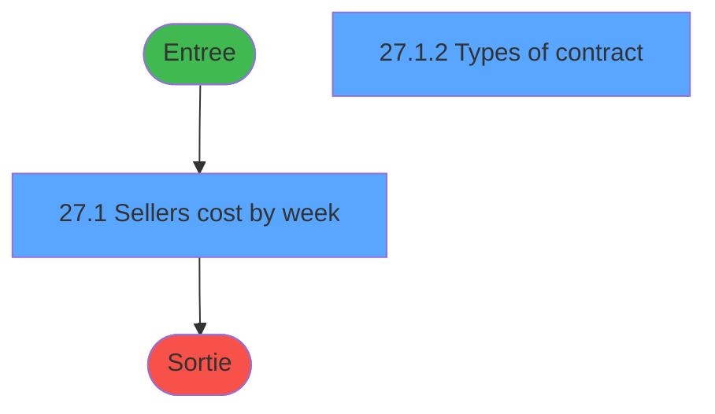
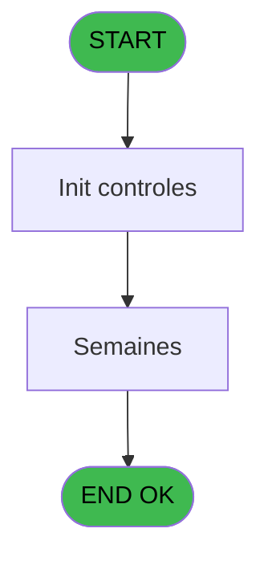
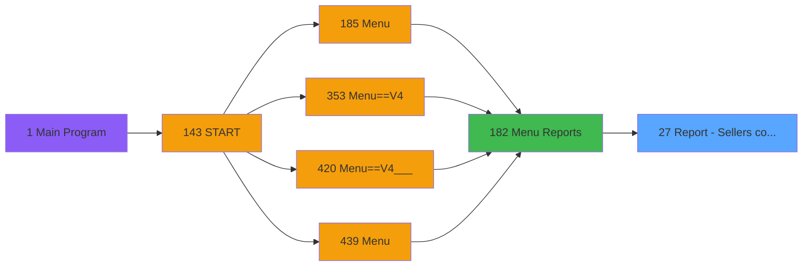

# PVE IDE 27 - Report - Sellers cost by week

> **Analyse**: Phases 1-4 2026-02-03 01:14 -> 01:15 (38s) | Assemblage 01:15
> **Pipeline**: V7.2 Enrichi
> **Structure**: 4 onglets (Resume | Ecrans | Donnees | Connexions)

<!-- TAB:Resume -->

## 1. FICHE D'IDENTITE

| Attribut | Valeur |
|----------|--------|
| Projet | PVE |
| IDE Position | 27 |
| Nom Programme | Report - Sellers cost by week |
| Fichier source | `Prg_27.xml` |
| Domaine metier | General |
| Taches | 4 (2 ecrans visibles) |
| Tables modifiees | 0 |
| Programmes appeles | 0 |

## 2. DESCRIPTION FONCTIONNELLE

**Report - Sellers cost by week** assure la gestion complete de ce processus, accessible depuis [Menu Reports (IDE 182)](PVE-IDE-182.md).

Le flux de traitement s'organise en **1 blocs fonctionnels** :

- **Traitement** (4 taches) : traitements metier divers

Detail : phases du traitement

#### Phase 1 : Traitement (4 taches)

- **27** - Report - Sellers cost **[[ECRAN]](#ecran-t1)**
- **27.1** - Sellers cost by week **[[ECRAN]](#ecran-t2)**
- **27.1.1** - Types of contract **[[ECRAN]](#ecran-t3)**
- **27.1.2** - Types of contract **[[ECRAN]](#ecran-t4)**

## 3. BLOCS FONCTIONNELS

### 3.1 Traitement (4 taches)

Traitements internes.

---

#### 27 - Report - Sellers cost [[ECRAN]](#ecran-t1)

**Role** : Traitement : Report - Sellers cost.
**Ecran** : 809 x 394 DLU (MDI) | [Voir mockup](#ecran-t1)

3 sous-taches directes

| Tache | Nom | Bloc |
|-------|-----|------|
| [27.1](#t2) | Sellers cost by week **[[ECRAN]](#ecran-t2)** | Traitement |
| [27.1.1](#t3) | Types of contract **[[ECRAN]](#ecran-t3)** | Traitement |
| [27.1.2](#t4) | Types of contract **[[ECRAN]](#ecran-t4)** | Traitement |

---

#### 27.1 - Sellers cost by week [[ECRAN]](#ecran-t2)

**Role** : Traitement : Sellers cost by week.
**Ecran** : 615 x 367 DLU (MDI) | [Voir mockup](#ecran-t2)

---

#### 27.1.1 - Types of contract [[ECRAN]](#ecran-t3)

**Role** : Traitement : Types of contract.
**Ecran** : 396 x 279 DLU (Modal) | [Voir mockup](#ecran-t3)

---

#### 27.1.2 - Types of contract [[ECRAN]](#ecran-t4)

**Role** : Traitement : Types of contract.
**Ecran** : 396 x 279 DLU (Modal) | [Voir mockup](#ecran-t4)

## 5. REGLES METIER

*(Aucune regle metier identifiee)*

## 6. CONTEXTE

- **Appele par**: [Menu Reports (IDE 182)](PVE-IDE-182.md)
- **Appelle**: 0 programmes | **Tables**: 3 (W:0 R:2 L:1) | **Taches**: 4 | **Expressions**: 7

<!-- TAB:Ecrans -->

## 8. ECRANS

### 8.1 Forms visibles (2 / 4)

| # | Position | Tache | Nom | Type | Largeur | Hauteur | Bloc |
|---|----------|-------|-----|------|---------|---------|------|
| 1 | 27.1 | 27.1 | Sellers cost by week | MDI | 615 | 367 | Traitement |
| 2 | 27.1.2 | 27.1.2 | Types of contract | Modal | 396 | 279 | Traitement |

### 8.2 Mockups Ecrans

---

#### 27.1 - Sellers cost by week
**Tache** : [27.1](#t2) | **Type** : MDI | **Dimensions** : 615 x 367 DLU
**Bloc** : Traitement | **Titre IDE** : Sellers cost by week

<!-- FORM-DATA:
{
    "width":  615,
    "vFactor":  8,
    "type":  "MDI",
    "hFactor":  4,
    "controls":  [
                     {
                         "x":  32,
                         "type":  "label",
                         "var":  "",
                         "y":  49,
                         "w":  105,
                         "fmt":  "",
                         "name":  "",
                         "h":  17,
                         "color":  "183",
                         "text":  "Week starting on",
                         "parent":  null
                     },
                     {
                         "x":  0,
                         "type":  "label",
                         "var":  "",
                         "y":  0,
                         "w":  612,
                         "fmt":  "",
                         "name":  "",
                         "h":  41,
                         "color":  "182",
                         "text":  "",
                         "parent":  null
                     },
                     {
                         "x":  14,
                         "type":  "label",
                         "var":  "",
                         "y":  16,
                         "w":  336,
                         "fmt":  "",
                         "name":  "",
                         "h":  11,
                         "color":  "186",
                         "text":  "Choose the week to visualize",
                         "parent":  2
                     },
                     {
                         "x":  16,
                         "type":  "table",
                         "var":  "",
                         "name":  "",
                         "titleH":  12,
                         "color":  "110",
                         "w":  161,
                         "y":  67,
                         "fmt":  "",
                         "parent":  null,
                         "text":  "",
                         "rowH":  28,
                         "h":  253,
                         "cols":  [
                                      {
                                          "title":  "",
                                          "layer":  1,
                                          "w":  158
                                      }
                                  ],
                         "rows":  1
                     },
                     {
                         "x":  154,
                         "type":  "label",
                         "var":  "",
                         "y":  69,
                         "w":  14,
                         "fmt":  "",
                         "name":  "",
                         "h":  18,
                         "color":  "144",
                         "text":  "ü",
                         "parent":  5
                     },
                     {
                         "x":  2,
                         "type":  "label",
                         "var":  "",
                         "y":  331,
                         "w":  612,
                         "fmt":  "",
                         "name":  "",
                         "h":  33,
                         "color":  "6",
                         "text":  "",
                         "parent":  null
                     },
                     {
                         "x":  18,
                         "type":  "edit",
                         "var":  "",
                         "y":  69,
                         "w":  132,
                         "fmt":  "",
                         "name":  "V Week affichage",
                         "h":  18,
                         "color":  "146",
                         "text":  "",
                         "parent":  5
                     },
                     {
                         "x":  564,
                         "type":  "image",
                         "var":  "",
                         "y":  4,
                         "w":  48,
                         "fmt":  "",
                         "name":  "",
                         "h":  37,
                         "color":  "",
                         "text":  "",
                         "parent":  2
                     },
                     {
                         "x":  176,
                         "type":  "button",
                         "var":  "",
                         "y":  68,
                         "w":  38,
                         "fmt":  "ñ",
                         "name":  "",
                         "h":  126,
                         "color":  "",
                         "text":  "",
                         "parent":  null
                     },
                     {
                         "x":  176,
                         "type":  "button",
                         "var":  "",
                         "y":  194,
                         "w":  38,
                         "fmt":  "ò",
                         "name":  "",
                         "h":  128,
                         "color":  "",
                         "text":  "",
                         "parent":  null
                     },
                     {
                         "x":  525,
                         "type":  "button",
                         "var":  "",
                         "y":  336,
                         "w":  87,
                         "fmt":  "\u0026Exit",
                         "name":  "",
                         "h":  28,
                         "color":  "",
                         "text":  "",
                         "parent":  null
                     }
                 ],
    "taskId":  "27.1",
    "height":  367
}
-->

<strong>Champs : 1 champs</strong>

| Pos (x,y) | Nom | Variable | Type |
|-----------|-----|----------|------|
| 18,69 | V Week affichage | - | edit |

<strong>Boutons : 3 boutons</strong>

| Bouton | Pos (x,y) | Action |
|--------|-----------|--------|
| ñ | 176,68 | Bouton fonctionnel |
| ò | 176,194 | Bouton fonctionnel |
| Exit | 525,336 | Quitte le programme |

---

#### 27.1.2 - Types of contract
**Tache** : [27.1.2](#t4) | **Type** : Modal | **Dimensions** : 396 x 279 DLU
**Bloc** : Traitement | **Titre IDE** : Types of contract

<!-- FORM-DATA:
{
    "width":  396,
    "vFactor":  8,
    "type":  "Modal",
    "hFactor":  4,
    "controls":  [
                     {
                         "x":  46,
                         "type":  "label",
                         "var":  "",
                         "y":  5,
                         "w":  72,
                         "fmt":  "",
                         "name":  "",
                         "h":  17,
                         "color":  "183",
                         "text":  "Contract type",
                         "parent":  null
                     },
                     {
                         "x":  246,
                         "type":  "label",
                         "var":  "",
                         "y":  5,
                         "w":  103,
                         "fmt":  "",
                         "name":  "",
                         "h":  17,
                         "color":  "183",
                         "text":  "Number of sellers",
                         "parent":  null
                     },
                     {
                         "x":  134,
                         "type":  "label",
                         "var":  "",
                         "y":  210,
                         "w":  99,
                         "fmt":  "",
                         "name":  "",
                         "h":  17,
                         "color":  "183",
                         "text":  "Week salaries",
                         "parent":  null
                     },
                     {
                         "x":  34,
                         "type":  "table",
                         "var":  "",
                         "name":  "",
                         "titleH":  12,
                         "color":  "110",
                         "w":  325,
                         "y":  24,
                         "fmt":  "",
                         "parent":  null,
                         "text":  "",
                         "rowH":  29,
                         "h":  170,
                         "cols":  [
                                      {
                                          "title":  "",
                                          "layer":  1,
                                          "w":  203
                                      },
                                      {
                                          "title":  "",
                                          "layer":  2,
                                          "w":  118
                                      }
                                  ],
                         "rows":  2
                     },
                     {
                         "x":  222,
                         "type":  "label",
                         "var":  "",
                         "y":  25,
                         "w":  14,
                         "fmt":  "",
                         "name":  "",
                         "h":  24,
                         "color":  "144",
                         "text":  "ü",
                         "parent":  5
                     },
                     {
                         "x":  38,
                         "type":  "edit",
                         "var":  "",
                         "y":  25,
                         "w":  179,
                         "fmt":  "",
                         "name":  "",
                         "h":  24,
                         "color":  "110",
                         "text":  "",
                         "parent":  5
                     },
                     {
                         "x":  240,
                         "type":  "edit",
                         "var":  "",
                         "y":  25,
                         "w":  107,
                         "fmt":  "",
                         "name":  "",
                         "h":  24,
                         "color":  "110",
                         "text":  "",
                         "parent":  5
                     },
                     {
                         "x":  359,
                         "type":  "button",
                         "var":  "",
                         "y":  25,
                         "w":  33,
                         "fmt":  "ñ",
                         "name":  "",
                         "h":  82,
                         "color":  "",
                         "text":  "",
                         "parent":  null
                     },
                     {
                         "x":  359,
                         "type":  "button",
                         "var":  "",
                         "y":  107,
                         "w":  33,
                         "fmt":  "ò",
                         "name":  "",
                         "h":  88,
                         "color":  "",
                         "text":  "",
                         "parent":  null
                     },
                     {
                         "x":  239,
                         "type":  "edit",
                         "var":  "",
                         "y":  210,
                         "w":  119,
                         "fmt":  "10.3C",
                         "name":  "",
                         "h":  17,
                         "color":  "110",
                         "text":  "",
                         "parent":  null
                     }
                 ],
    "taskId":  "27.1.2",
    "height":  279
}
-->

<strong>Champs : 3 champs</strong>

| Pos (x,y) | Nom | Variable | Type |
|-----------|-----|----------|------|
| 38,25 | (sans nom) | - | edit |
| 240,25 | (sans nom) | - | edit |
| 239,210 | 10.3C | - | edit |

<strong>Boutons : 2 boutons</strong>

| Bouton | Pos (x,y) | Action |
|--------|-----------|--------|
| ñ | 359,25 | Bouton fonctionnel |
| ò | 359,107 | Bouton fonctionnel |

## 9. NAVIGATION

### 9.1 Enchainement des ecrans

**Detail par enchainement :**

| Depuis | Action | Vers | Retour |
|--------|--------|------|--------|

### 9.3 Structure hierarchique (4 taches)

| Position | Tache | Type | Dimensions | Bloc |
|----------|-------|------|------------|------|
| **27.1** | [**Report - Sellers cost** (27)](#t1) [mockup](#ecran-t1) | MDI | 809x394 | Traitement |
| 27.1.1 | [Sellers cost by week (27.1)](#t2) [mockup](#ecran-t2) | MDI | 615x367 | |
| 27.1.2 | [Types of contract (27.1.1)](#t3) [mockup](#ecran-t3) | Modal | 396x279 | |
| 27.1.3 | [Types of contract (27.1.2)](#t4) [mockup](#ecran-t4) | Modal | 396x279 | |

### 9.4 Algorigramme

> **Legende**: Vert = START/END OK | Rouge = END KO | Bleu = Decisions
> *Algorigramme auto-genere. Utiliser `/algorigramme` pour une synthese metier detaillee.*

<!-- TAB:Donnees -->

## 10. TABLES

### Tables utilisees (3)

| ID | Nom | Description | Type | R | W | L | Usages |
|----|-----|-------------|------|---|---|---|--------|
| 381 | pv_days |  | DB | R |   |   | 2 |
| 385 | pv_equipment |  | DB | R |   |   | 1 |
| 408 | pv_status |  | DB |   |   | L | 2 |

### Colonnes par table (1 / 2 tables avec colonnes identifiees)

Table 381 - pv_days (R) - 2 usages

*Table utilisee uniquement en Link ou aucune colonne Real identifiee dans le DataView.*

Table 385 - pv_equipment (R) - 1 usages

| Lettre | Variable | Acces | Type |
|--------|----------|-------|------|
| A | v.visible 1 | R | Logical |
| B | V Year/Week | R | Numeric |
| C | V Week affichage | R | Alpha |
| D | V Total | R | Numeric |

## 11. VARIABLES

### 11.1 Parametres entrants (5)

Variables recues du programme appelant ([Menu Reports (IDE 182)](PVE-IDE-182.md)).

| Lettre | Nom | Type | Usage dans |
|--------|-----|------|-----------|
| A | P. Village Name | Alpha | 1x parametre entrant |
| B | P. Currency | Alpha | 2x parametre entrant |
| C | P. Masque | Alpha | 1x parametre entrant |
| D | P. Masque sans Z | Alpha | 1x parametre entrant |
| E | P. Decimales | Numeric | - |

### 11.2 Variables de session (1)

Variables persistantes pendant toute la session.

| Lettre | Nom | Type | Usage dans |
|--------|-----|------|-----------|
| F | v.no exit | Logical | - |

## 12. EXPRESSIONS

**7 / 7 expressions decodees (100%)**

### 12.1 Repartition par type

| Type | Expressions | Regles |
|------|-------------|--------|
| CALCULATION | 1 | 0 |
| DATE | 2 | 0 |
| CAST_LOGIQUE | 2 | 0 |
| CONDITION | 1 | 0 |
| OTHER | 1 | 0 |

### 12.2 Expressions cles par type

#### CALCULATION (1 expressions)

| Type | IDE | Expression | Regle |
|------|-----|------------|-------|
| CALCULATION | 2 | `P. Masque [C]*100+P. Masque sans Z [D]` | - |

#### DATE (2 expressions)

| Type | IDE | Expression | Regle |
|------|-----|------------|-------|
| DATE | 3 | `'Monday '&DStr (P. Currency [B],'DD/MM/YYYY')` | - |
| DATE | 1 | `Date ()` | - |

#### CAST_LOGIQUE (2 expressions)

| Type | IDE | Expression | Regle |
|------|-----|------------|-------|
| CAST_LOGIQUE | 5 | `'FALSE'LOG` | - |
| CAST_LOGIQUE | 4 | `'TRUE'LOG` | - |

#### CONDITION (1 expressions)

| Type | IDE | Expression | Regle |
|------|-----|------------|-------|
| CONDITION | 6 | `DOW (P. Currency [B])=2` | - |

#### OTHER (1 expressions)

| Type | IDE | Expression | Regle |
|------|-----|------------|-------|
| OTHER | 7 | `P. Village Name [A]` | - |

<!-- TAB:Connexions -->

## 13. GRAPHE D'APPELS

### 13.1 Chaine depuis Main (Callers)

Main -> ... -> [Menu Reports (IDE 182)](PVE-IDE-182.md) -> **Report - Sellers cost by week (IDE 27)**

### 13.2 Callers

| IDE | Nom Programme | Nb Appels |
|-----|---------------|-----------|
| [182](PVE-IDE-182.md) | Menu Reports | 2 |

### 13.3 Callees (programmes appeles)

### 13.4 Detail Callees avec contexte

| IDE | Nom Programme | Appels | Contexte |
|-----|---------------|--------|----------|
| - | (aucun) | - | - |

## 14. RECOMMANDATIONS MIGRATION

### 14.1 Profil du programme

| Metrique | Valeur | Impact migration |
|----------|--------|-----------------|
| Lignes de logique | 56 | Programme compact |
| Expressions | 7 | Peu de logique |
| Tables WRITE | 0 | Impact faible |
| Sous-programmes | 0 | Peu de dependances |
| Ecrans visibles | 2 | Quelques ecrans |
| Code desactive | 0% (0 / 56) | Code sain |
| Regles metier | 0 | Pas de regle identifiee |

### 14.2 Plan de migration par bloc

#### Traitement (4 taches: 4 ecrans, 0 traitement)

- **Strategie** : 4 composant(s) UI (Razor/React) avec formulaires et validation.
- Decomposer les taches en services unitaires testables.

### 14.3 Dependances critiques

| Dependance | Type | Appels | Impact |
|------------|------|--------|--------|

---
*Spec DETAILED generee par Pipeline V7.2 - 2026-02-03 01:15*
