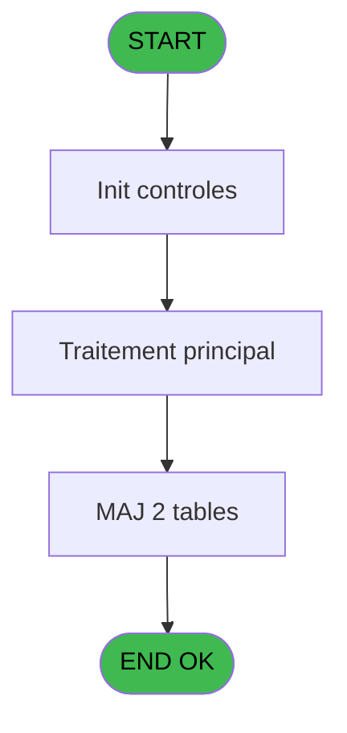
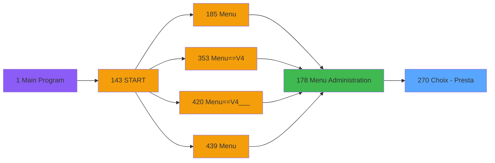
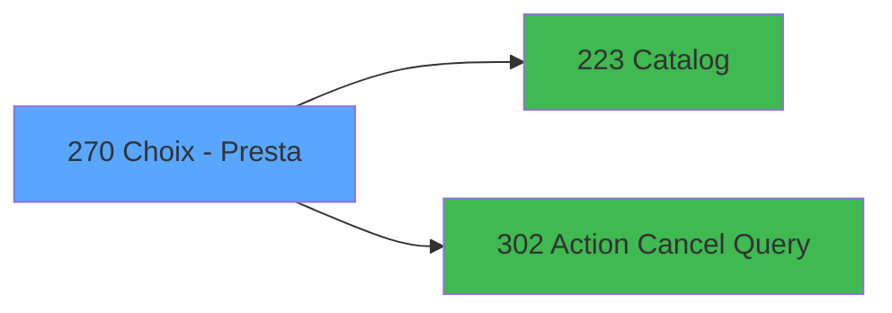

# PVE IDE 270 - Choix - Presta

> **Analyse**: Phases 1-4 2026-02-03 19:19 -> 19:20 (17s) | Assemblage 19:20
> **Pipeline**: V7.2 Enrichi
> **Structure**: 4 onglets (Resume | Ecrans | Donnees | Connexions)

<!-- TAB:Resume -->

## 1. FICHE D'IDENTITE

| Attribut | Valeur |
|----------|--------|
| Projet | PVE |
| IDE Position | 270 |
| Nom Programme | Choix - Presta |
| Fichier source | `Prg_270.xml` |
| Dossier IDE | Ticket |
| Taches | 3 (1 ecrans visibles) |
| Tables modifiees | 2 |
| Programmes appeles | 2 |

## 2. DESCRIPTION FONCTIONNELLE

**Choix - Presta** assure la gestion complete de ce processus, accessible depuis [Menu Administration (IDE 178)](PVE-IDE-178.md).

Le flux de traitement s'organise en **1 blocs fonctionnels** :

- **Traitement** (3 taches) : traitements metier divers

**Donnees modifiees** : 2 tables en ecriture (libelle_prestation, pv_sboarder_types).

**Logique metier** : 1 regles identifiees couvrant conditions metier.

## 3. BLOCS FONCTIONNELS

### 3.1 Traitement (3 taches)

Traitements internes.

---

#### 270 - Prepaid packages [[ECRAN]](#ecran-t1)

**Role** : Traitement : Prepaid packages.
**Ecran** : 809 x 392 DLU (MDI) | [Voir mockup](#ecran-t1)
**Delegue a** : [Catalog (IDE 223)](PVE-IDE-223.md), [Action Cancel Query (IDE 302)](PVE-IDE-302.md)

---

#### 270.1 - Delete All

**Role** : Traitement : Delete All.
**Delegue a** : [Catalog (IDE 223)](PVE-IDE-223.md), [Action Cancel Query (IDE 302)](PVE-IDE-302.md)

---

#### 270.2 - Maj Prestation /Service

**Role** : Traitement : Maj Prestation /Service.
**Delegue a** : [Catalog (IDE 223)](PVE-IDE-223.md), [Action Cancel Query (IDE 302)](PVE-IDE-302.md)

## 5. REGLES METIER

1 regles identifiees:

### Autres (1 regles)

#### [RM-001] Si [G] AND [K] AND [P] alors 110 sinon 114)

| Element | Detail |
|---------|--------|
| **Condition** | `[G] AND [K] AND [P]` |
| **Si vrai** | 110 |
| **Si faux** | 114) |
| **Expression source** | Expression 15 : `IF([G] AND [K] AND [P],110,114)` |
| **Exemple** | Si [G] AND [K] AND [P] → 110. Sinon → 114) |

## 6. CONTEXTE

- **Appele par**: [Menu Administration (IDE 178)](PVE-IDE-178.md)
- **Appelle**: 2 programmes | **Tables**: 5 (W:2 R:1 L:3) | **Taches**: 3 | **Expressions**: 17

<!-- TAB:Ecrans -->

## 8. ECRANS

### 8.1 Forms visibles (1 / 3)

| # | Position | Tache | Nom | Type | Largeur | Hauteur | Bloc |
|---|----------|-------|-----|------|---------|---------|------|
| 1 | 270 | 270 | Prepaid packages | MDI | 809 | 392 | Traitement |

### 8.2 Mockups Ecrans

---

#### 270 - Prepaid packages
**Tache** : [270](#t1) | **Type** : MDI | **Dimensions** : 809 x 392 DLU
**Bloc** : Traitement | **Titre IDE** : Prepaid packages

<!-- FORM-DATA:
{
    "width":  809,
    "vFactor":  8,
    "type":  "MDI",
    "hFactor":  4,
    "controls":  [
                     {
                         "x":  11,
                         "type":  "label",
                         "var":  "",
                         "y":  53,
                         "w":  19,
                         "fmt":  "",
                         "name":  "",
                         "h":  32,
                         "color":  "187",
                         "text":  "T",
                         "parent":  null
                     },
                     {
                         "x":  43,
                         "type":  "label",
                         "var":  "",
                         "y":  62,
                         "w":  89,
                         "fmt":  "",
                         "name":  "",
                         "h":  12,
                         "color":  "183",
                         "text":  "Code",
                         "parent":  null
                     },
                     {
                         "x":  139,
                         "type":  "label",
                         "var":  "",
                         "y":  62,
                         "w":  154,
                         "fmt":  "",
                         "name":  "",
                         "h":  12,
                         "color":  "183",
                         "text":  "Description",
                         "parent":  null
                     },
                     {
                         "x":  328,
                         "type":  "label",
                         "var":  "",
                         "y":  62,
                         "w":  138,
                         "fmt":  "",
                         "name":  "",
                         "h":  12,
                         "color":  "183",
                         "text":  "Package",
                         "parent":  null
                     },
                     {
                         "x":  1,
                         "type":  "label",
                         "var":  "",
                         "y":  0,
                         "w":  808,
                         "fmt":  "",
                         "name":  "",
                         "h":  41,
                         "color":  "182",
                         "text":  "",
                         "parent":  null
                     },
                     {
                         "x":  15,
                         "type":  "label",
                         "var":  "",
                         "y":  15,
                         "w":  504,
                         "fmt":  "",
                         "name":  "",
                         "h":  10,
                         "color":  "186",
                         "text":  "Enter the list of packages sold by clubmed travel agents",
                         "parent":  5
                     },
                     {
                         "x":  38,
                         "type":  "table",
                         "var":  "",
                         "name":  "",
                         "titleH":  12,
                         "color":  "110",
                         "w":  712,
                         "y":  75,
                         "fmt":  "",
                         "parent":  null,
                         "text":  "",
                         "rowH":  30,
                         "h":  272,
                         "cols":  [
                                      {
                                          "title":  "",
                                          "layer":  1,
                                          "w":  95
                                      },
                                      {
                                          "title":  "",
                                          "layer":  2,
                                          "w":  192
                                      },
                                      {
                                          "title":  "",
                                          "layer":  3,
                                          "w":  421
                                      }
                                  ],
                         "rows":  3
                     },
                     {
                         "x":  0,
                         "type":  "label",
                         "var":  "",
                         "y":  359,
                         "w":  809,
                         "fmt":  "",
                         "name":  "",
                         "h":  33,
                         "color":  "6",
                         "text":  "",
                         "parent":  null
                     },
                     {
                         "x":  45,
                         "type":  "edit",
                         "var":  "",
                         "y":  78,
                         "w":  74,
                         "fmt":  "",
                         "name":  "CTRL_001",
                         "h":  24,
                         "color":  "110",
                         "text":  "",
                         "parent":  8
                     },
                     {
                         "x":  139,
                         "type":  "edit",
                         "var":  "",
                         "y":  78,
                         "w":  182,
                         "fmt":  "",
                         "name":  "CTRL_002",
                         "h":  24,
                         "color":  "110",
                         "text":  "",
                         "parent":  8
                     },
                     {
                         "x":  327,
                         "type":  "button",
                         "var":  "",
                         "y":  77,
                         "w":  37,
                         "fmt":  "",
                         "name":  "BP. Label zoom",
                         "h":  29,
                         "color":  "",
                         "text":  "",
                         "parent":  8
                     },
                     {
                         "x":  759,
                         "type":  "image",
                         "var":  "",
                         "y":  3,
                         "w":  48,
                         "fmt":  "",
                         "name":  "",
                         "h":  37,
                         "color":  "",
                         "text":  "",
                         "parent":  5
                     },
                     {
                         "x":  750,
                         "type":  "button",
                         "var":  "",
                         "y":  76,
                         "w":  44,
                         "fmt":  "ñ",
                         "name":  "",
                         "h":  135,
                         "color":  "",
                         "text":  "",
                         "parent":  null
                     },
                     {
                         "x":  369,
                         "type":  "edit",
                         "var":  "",
                         "y":  78,
                         "w":  374,
                         "fmt":  "65",
                         "name":  "",
                         "h":  24,
                         "color":  "110",
                         "text":  "",
                         "parent":  8
                     },
                     {
                         "x":  750,
                         "type":  "button",
                         "var":  "",
                         "y":  210,
                         "w":  44,
                         "fmt":  "ò",
                         "name":  "",
                         "h":  138,
                         "color":  "",
                         "text":  "",
                         "parent":  null
                     },
                     {
                         "x":  1,
                         "type":  "button",
                         "var":  "",
                         "y":  364,
                         "w":  79,
                         "fmt":  "Modify mode",
                         "name":  "",
                         "h":  28,
                         "color":  "",
                         "text":  "",
                         "parent":  null
                     },
                     {
                         "x":  79,
                         "type":  "button",
                         "var":  "",
                         "y":  364,
                         "w":  77,
                         "fmt":  "Add",
                         "name":  "",
                         "h":  28,
                         "color":  "",
                         "text":  "",
                         "parent":  null
                     },
                     {
                         "x":  155,
                         "type":  "button",
                         "var":  "",
                         "y":  364,
                         "w":  77,
                         "fmt":  "Delete",
                         "name":  "",
                         "h":  28,
                         "color":  "",
                         "text":  "",
                         "parent":  null
                     },
                     {
                         "x":  231,
                         "type":  "button",
                         "var":  "",
                         "y":  364,
                         "w":  77,
                         "fmt":  "Cancel",
                         "name":  "",
                         "h":  28,
                         "color":  "",
                         "text":  "",
                         "parent":  null
                     },
                     {
                         "x":  308,
                         "type":  "button",
                         "var":  "",
                         "y":  364,
                         "w":  91,
                         "fmt":  "Delete ALL !!!",
                         "name":  "",
                         "h":  28,
                         "color":  "",
                         "text":  "",
                         "parent":  null
                     },
                     {
                         "x":  656,
                         "type":  "button",
                         "var":  "",
                         "y":  364,
                         "w":  77,
                         "fmt":  "Select",
                         "name":  "",
                         "h":  28,
                         "color":  "",
                         "text":  "",
                         "parent":  null
                     },
                     {
                         "x":  732,
                         "type":  "button",
                         "var":  "",
                         "y":  364,
                         "w":  77,
                         "fmt":  "Exit",
                         "name":  "",
                         "h":  28,
                         "color":  "",
                         "text":  "",
                         "parent":  null
                     }
                 ],
    "taskId":  "270",
    "height":  392
}
-->

<strong>Champs : 3 champs</strong>

| Pos (x,y) | Nom | Variable | Type |
|-----------|-----|----------|------|
| 45,78 | CTRL_001 | - | edit |
| 139,78 | CTRL_002 | - | edit |
| 369,78 | 65 | - | edit |

<strong>Boutons : 10 boutons</strong>

| Bouton | Pos (x,y) | Action |
|--------|-----------|--------|
| BP. Label zoom | 327,77 | Ouvre la selection |
| ñ | 750,76 | Bouton fonctionnel |
| ò | 750,210 | Bouton fonctionnel |
| Modify mode | 1,364 | Modifie l'element |
| Add | 79,364 | Ajoute un element |
| Delete | 155,364 | Supprime l'element selectionne |
| Cancel | 231,364 | Appel [Action Cancel Query (IDE 302)](PVE-IDE-302.md) |
| Delete ALL !!! | 308,364 | Supprime l'element selectionne |
| Select | 656,364 | Ouvre la selection |
| Exit | 732,364 | Quitte le programme |

## 9. NAVIGATION

Ecran unique: **Prepaid packages**

### 9.3 Structure hierarchique (3 taches)

| Position | Tache | Type | Dimensions | Bloc |
|----------|-------|------|------------|------|
| **270.1** | [**Prepaid packages** (270)](#t1) [mockup](#ecran-t1) | MDI | 809x392 | Traitement |
| 270.1.1 | [Delete All (270.1)](#t2) | MDI | - | |
| 270.1.2 | [Maj Prestation /Service (270.2)](#t3) | - | - | |

### 9.4 Algorigramme

> **Legende**: Vert = START/END OK | Rouge = END KO | Bleu = Decisions
> *Algorigramme auto-genere. Utiliser `/algorigramme` pour une synthese metier detaillee.*

<!-- TAB:Donnees -->

## 10. TABLES

### Tables utilisees (5)

| ID | Nom | Description | Type | R | W | L | Usages |
|----|-----|-------------|------|---|---|---|--------|
| 135 | libelle_prestation | Prestations/services vendus | DB |   | **W** |   | 1 |
| 379 | pv_customer_temp |  | DB | R |   |   | 1 |
| 402 | pv_sboarder_types |  | DB |   | **W** | L | 2 |
| 403 | pv_sellers |  | DB |   |   | L | 1 |
| 413 | pv_tva |  | DB |   |   | L | 1 |

### Colonnes par table (2 / 3 tables avec colonnes identifiees)

Table 135 - libelle_prestation (**W**) - 1 usages

| Lettre | Variable | Acces | Type |
|--------|----------|-------|------|
| A | v.Retour Prestation | W | Logical |

Table 379 - pv_customer_temp (R) - 1 usages

| Lettre | Variable | Acces | Type |
|--------|----------|-------|------|
| A | retour categorie | R | Logical |
| B | retour sous categorie | R | Logical |
| C | retour produit | R | Logical |
| D | BP. Label zoom | R | Alpha |
| E | v.Filtre Cat | R | Numeric |
| F | v.Filtre Sub_Cat | R | Numeric |

Table 402 - pv_sboarder_types (**W**/L) - 2 usages

*Table utilisee uniquement en Link ou aucune colonne Real identifiee dans le DataView.*

## 11. VARIABLES

### 11.1 Variables de session (2)

Variables persistantes pendant toute la session.

| Lettre | Nom | Type | Usage dans |
|--------|-----|------|-----------|
| E | v.Filtre Cat | Numeric | 1x session |
| F | v.Filtre Sub_Cat | Numeric | 1x session |

### 11.2 Autres (4)

Variables diverses.

| Lettre | Nom | Type | Usage dans |
|--------|-----|------|-----------|
| A | retour categorie | Logical | - |
| B | retour sous categorie | Logical | 1x refs |
| C | retour produit | Logical | - |
| D | BP. Label zoom | Alpha | 2x refs |

## 12. EXPRESSIONS

**17 / 17 expressions decodees (100%)**

### 12.1 Repartition par type

| Type | Expressions | Regles |
|------|-------------|--------|
| CONCATENATION | 1 | 0 |
| CONDITION | 3 | 5 |
| CONSTANTE | 1 | 0 |
| OTHER | 11 | 0 |
| REFERENCE_VG | 1 | 0 |

### 12.2 Expressions cles par type

#### CONCATENATION (1 expressions)

| Type | IDE | Expression | Regle |
|------|-----|------------|-------|
| CONCATENATION | 4 | `Trim([J])&' - '&Trim([O])&' - '&Trim([U])` | - |

#### CONDITION (3 expressions)

| Type | IDE | Expression | Regle |
|------|-----|------------|-------|
| CONDITION | 15 | `IF([G] AND [K] AND [P],110,114)` | [RM-001](#rm-RM-001) |
| CONDITION | 12 | `retour sous categorie [B]<>'' AND Trim ([O])&Trim ([U])='' AND NOT (Stat (0,'E'MODE))` | - |
| CONDITION | 13 | `GetParam ('SERVICE')='SKIN'` | - |

#### CONSTANTE (1 expressions)

| Type | IDE | Expression | Regle |
|------|-----|------------|-------|
| CONSTANTE | 5 | `'%club_images%btzoom.bmp'` | - |

#### OTHER (11 expressions)

| Type | IDE | Expression | Regle |
|------|-----|------------|-------|
| OTHER | 11 | `GetParam ('SERVICE')` | - |
| OTHER | 10 | `Stat (0,'CM'MODE)` | - |
| OTHER | 14 | `BP. Label zoom [D]` | - |
| OTHER | 17 | `VG108 AND Stat(0,'CMD'MODE)` | - |
| OTHER | 16 | `GetParam ('SERVICE')` | - |
| ... | | *+6 autres* | |

#### REFERENCE_VG (1 expressions)

| Type | IDE | Expression | Regle |
|------|-----|------------|-------|
| REFERENCE_VG | 7 | `VG9` | - |

<!-- TAB:Connexions -->

## 13. GRAPHE D'APPELS

### 13.1 Chaine depuis Main (Callers)

Main -> ... -> [Menu Administration (IDE 178)](PVE-IDE-178.md) -> **Choix - Presta (IDE 270)**

### 13.2 Callers

| IDE | Nom Programme | Nb Appels |
|-----|---------------|-----------|
| [178](PVE-IDE-178.md) | Menu Administration | 1 |

### 13.3 Callees (programmes appeles)

### 13.4 Detail Callees avec contexte

| IDE | Nom Programme | Appels | Contexte |
|-----|---------------|--------|----------|
| [223](PVE-IDE-223.md) | Catalog | 1 | Sous-programme |
| [302](PVE-IDE-302.md) | Action Cancel Query | 1 | Sous-programme |

## 14. RECOMMANDATIONS MIGRATION

### 14.1 Profil du programme

| Metrique | Valeur | Impact migration |
|----------|--------|-----------------|
| Lignes de logique | 55 | Programme compact |
| Expressions | 17 | Peu de logique |
| Tables WRITE | 2 | Impact faible |
| Sous-programmes | 2 | Peu de dependances |
| Ecrans visibles | 1 | Ecran unique ou traitement batch |
| Code desactive | 0% (0 / 55) | Code sain |
| Regles metier | 1 | Quelques regles a preserver |

### 14.2 Plan de migration par bloc

#### Traitement (3 taches: 1 ecran, 2 traitements)

- **Strategie** : Orchestrateur avec 1 ecrans (Razor/React) et 2 traitements backend (services).
- Les ecrans deviennent des composants UI, les traitements invisibles deviennent des services injectables.
- 2 sous-programme(s) a migrer ou a reutiliser depuis les services existants.
- Decomposer les taches en services unitaires testables.

### 14.3 Dependances critiques

| Dependance | Type | Appels | Impact |
|------------|------|--------|--------|
| libelle_prestation | Table WRITE (Database) | 1x | Schema + repository |
| pv_sboarder_types | Table WRITE (Database) | 1x | Schema + repository |
| [Action Cancel Query (IDE 302)](PVE-IDE-302.md) | Sous-programme | 1x | Normale - Sous-programme |
| [Catalog (IDE 223)](PVE-IDE-223.md) | Sous-programme | 1x | Normale - Sous-programme |

---
*Spec DETAILED generee par Pipeline V7.2 - 2026-02-03 19:20*
